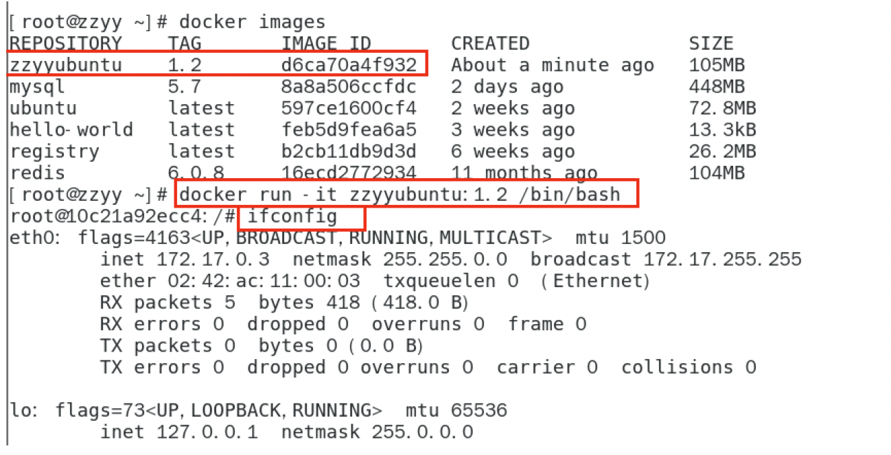

### 								Docker 详细教程

### 一、Docker简介

#### 1.1 docker是什么

【问题】：问什么会有docker出现

​	Docker的出现 使得Docker得以打破过去「程序即应用」的观念。透过镜像(images)将作业系统核心除外，运作应用程式所需要的系统环境，由下而上打包，达到应用程式跨平台间的无缝接轨运作。 

【docker理念】：解决了运行环境和配置问题的软件容器，方便持续继承并有助于整体发布的容器虚拟化技术。

#### 1.2 容器与虚拟机比较

##### 1.2.1 容器发展简史




##### 1.2.2 传统虚拟机技术

虚拟机（virtual machine）就是带环境安装的一种解决方案。 

它可以在一种操作系统里面运行另一种操作系统，比如在Windows10系统里面运行Linux系统CentOS7。应用程序对此毫无感知，因为虚拟机看上去跟真实系统一模一样，而对于底层系统来说，虚拟机就是一个普通文件，不需要了就删掉，对其他部分毫无影响。这类虚拟机完美的运行了另一套系统，能够使应用程序，操作系统和硬件三者之间的逻辑不变。  

| Win10 | VMWare | Centos7 | 各种cpu、内存网络额配置+各种软件 | 虚拟机实例 |
| ----- | ------ | ------- | -------------------------------- | ---------- |
|       |        |         |                                  |            |

虚拟机的缺点： 

1   资源占用多         2   冗余步骤多          3   启动慢 

##### 1.2.3 容器虚拟化技术

由于前面虚拟机存在某些缺点，Linux发展出了另一种虚拟化技术： 

Linux容器(Linux Containers，缩写为 LXC) 

Linux容器是与系统其他部分隔离开的一系列进程，从另一个镜像运行，并由该镜像提供支持进程所需的全部文件。容器提供的镜像包含了应用的所有依赖项，因而在从开发到测试再到生产的整个过程中，它都具有可移植性和一致性。 

Linux 容器不是模拟一个完整的操作系统 而是对进程进行隔离。有了容器，就可以将软件运行所需的所有资源打包到一个隔离的容器中。 容器与虚拟机不同，不需要捆绑一整套操作系统 ，只需要软件工作所需的库资源和设置。系统因此而变得高效轻量并保证部署在任何环境中的软件都能始终如一地运行。 

#####   1.2.4 对比

 

比较了 Docker 和传统虚拟化方式的不同之处： 

传统虚拟机技术是虚拟出一套硬件后，在其上运行一个完整操作系统，在该系统上再运行所需应用进程； 容器内的应用进程直接运行于宿主的内核，容器内没有自己的内核 且也没有进行硬件虚拟 。因此容器要比传统虚拟机更为轻便。 每个容器之间互相隔离，每个容器有自己的文件系统 ，容器之间进程不会相互影响，能区分计算资源。  

#### 1.3 能干什么

##### 1.3.1 技术职级变化

coder -> programmer -> software engineer -> DevOps engineer

##### 1.3.2 开发/运维（Devops)新一代开发工程师

- 一次构建、随处运行
- 更快速的应用交付和部署
- 更便捷的升级和扩缩容
- 更简单的系统运维
- 更高效的计算资源利用

##### 1.3.3 Docker应用场景


Docker 借鉴了标砖集装箱的概念。标准集装箱将货物运往世界各地，Docker将这个模型运用到自己的设计中，唯一不同的是：集装箱运输货物，而Docker运输软件。

#### 1.4 那些企业在使用

- 新浪

  

  

  

  

- 美团


- 蘑菇街


#### 1.5 下载地址

官网：http://www.docker.com

Docker Hub 官网：https://hub.docker.com

### 二、Docker安装

#### 2.1 前提说明

##### 2.1.1 **CentOS Docker** **安装** 


##### 2.1.2 前提条件

目前，CentOS仅发行版本中的内核支持Docker。Docker运行在CentOS 7（64-bit）上，要求系统为64位，Linux系统内核版本为3.8以上，这里选用Centos7.x

##### 2.1.3 查看自己的内核

uname 命令用于打印当前系统相关信息（内核版本号，硬件架构，主机名称和操作系统类型等）。


#### 2.2 Docker的基本组成

##### 2.2.1 镜像（image）

Docker 镜像（Image）就是一个 **只读** 的模板。镜像可以用来创建 Docker 容器， 一个镜像可以创建很多容器 。 

它也相当于是一个root文件系统。比如官方镜像 centos:7 就包含了完整的一套 centos:7 最小系统的 root 文件系统。 

相当于容器的“源代码”， docker镜像文件类似于Java的类模板，而docker容器实例类似于java中new出来的实例对象。

##### 2.2.2 容器（container）

- 从面向对象角度 

Docker 利用容器（Container）独立运行的一个或一组应用，应用程序或服务运行在容器里面，容器就类似于一个虚拟化的运行环境， 容器是用镜像创建的运行实例 。就像是Java中的类和实例对象一样，镜像是静态的定义，容器是镜像运行时的实体。容器为镜像提供了一个标准的和隔离的运行环境 ，它可以被启动、开始、停止、删除。每个容器都是相互隔离的、保证安全的平台 

- 从镜像容器角度 

**可以把容器看做是一个简易版的** ***Linux\*** **环境** （包括root用户权限、进程空间、用户空间和网络空间等）和运行在其中的应用程序。 

##### 2.2.3 仓库（repository）

仓库（Repository）是 集中存放镜像 文件的场所。 

类似于 

Maven仓库，存放各种jar包的地方； 

github仓库，存放各种git项目的地方； 

Docker公司提供的官方registry被称为Docker Hub，存放各种镜像模板的地方。 

仓库分为公开仓库（Public）和私有仓库（Private）两种形式。 

最大的公开仓库是 Docker Hub(https://hub.docker.com/) ， 

存放了数量庞大的镜像供用户下载。国内的公开仓库包括阿里云 、网易云等 

##### 2.2.4 小总结

- 需要正确的理解仓库/镜像/容器这几个概念: 

Docker 本身是一个容器运行载体或称之为管理引擎。我们把应用程序和配置依赖打包好形成一个可交付的运行环境，这个打包好的运行环境就是image镜像文件。只有通过这个镜像文件才能生成Docker容器实例(类似Java中new出来一个对象)。 

image文件可以看作是容器的模板。Docker 根据 image 文件生成容器的实例。同一个 image 文件，可以生成多个同时运行的容器实例。 

- 镜像文件 

image 文件生成的容器实例，本身也是一个文件，称为镜像文件。 

- 容器实例 

一个容器运行一种服务，当我们需要的时候，就可以通过docker客户端创建一个对应的运行实例，也就是我们的容器 。

- 仓库 

就是放一堆镜像的地方，我们可以把镜像发布到仓库中，需要的时候再从仓库中拉下来就可以了。 

#### 2.3 Docker平台架构图解（入门版）


##### 2.3.1 Docker工作原理

Docker是一个Client-Server结构的系统，Docker守护进程运行在主机上， 然后通过Socket连接从客户端访问，守护进程从客户端接受命令并管理运行在主机上的容器 。 容器，是一个运行时环境，就是我们前面说到的集装箱。可以对比mysql演示对比讲解 


##### 2.3.2 整体架构及底层通信原理简述

Docker是一个C/S模式的架构，后端是一个松耦合架构，众多模块各司其职

##### 2.3.3 Docker运行的基本流程为：

1. 用户是使用Docker Client 与Docker Daemon 建立通信，并发送请求给后者。
2. Docker Daemon 作为Docker架构中的主体部分，首先提供Docker Server 的功能时期可以接受 Docker Client的请求。
3. Docker Engine 执行Docker内部的一些列工作，每一项工作都是以一个Job的形式的存在。
4. Job的运行过程中，当需要容器镜像是，则从Docker Register中下载镜像，并通过镜像管理驱动Graph driver 将下载镜像以Graph的形式存储。
5. 当需要为Docker创建网络环境时，通过网络驱动Network driver创建并配置Docker容器网络环境。
6. 当需要限制Docker容器运行资源或执行用户指令等操作时，则通过Exec driver来完成。
7. Libcontainer是一项独立的容器管理包，Network driver以及Exec driver都是通过Libcontainer来实现具体容器进行的操作。


#### 2.4、安装步骤

##### 2.4.1 CentOS7安装Docker

1. 确定你是CentOS7以上版本

```shell
# 查看CentOS版本命令
cat /etc/redhat-release
```

2. 卸载旧版本

   

```shell
# 卸载旧版本docker命令
$ sudo yum remove docker \
									docker-client \
									docker-client-latest \
									docker-common \
									docker-latest \
									docker-latest-logrotate \
									docker-logrotate \
									docker-engine		
```

3. yum安装gcc相关命令

```shell
# yum安装gcc相关命令
yum -y install gcc
yum -y install gcc-c++
```

4. 安装需要的软件包

   **使用存储库安装**

```shell
在新主机上首次安装Docker Engine之前，您需要设置Docker存储库。之后，您可以从存储库安装和更新Docker
设置存储库
安装 yum-utils 包（提供yum-config-manager 实用程序）并设置稳定的存储库
# 官网要求
yum install -y yum-utils
```

5. 设置stable镜像仓库

   

```shell
# 推荐使用 使用阿里的 docker 镜像仓库，国外的镜像仓库是比较慢的
yum-config-manager --add-repo http://mirrors.aliyun.com/docker-ce/linux/centos/docker-ce.repo
```

6. 更新yum软件包索引

```shell
# 更新yum软件包索引
yum makecache fast
```

7. 安装DOCKER CE 引擎

```shell
# 命令
yum -y install docker-ce docker-ce-cli containerd.io
```

8. 启动docker

```shell
# 启动命令
systemctl start docker
```

9. 测试

```shell
# 测试
docker version 

docker run hello-world
```


10. 卸载

```shell
# 卸载命令
systemctl stop docker 
yum remove docker-ce docker-ce-cli containerd.io
rm -rf /var/lib/docker
rm -rf /var/lib/containerd
```

#### 2.5、阿里云镜像加速

#### 2.5.1 是什么

- 地址：https://promotion.aliyun.com/ntms/act/kubernetes.html

- 注册一个属于自己的阿里云账户
- 获得加速器地址连接：
  1. 登陆阿里云开发者平台
  2. 点击控制台
  3. 选择容器镜像服务
  4. 获取加速器地址

- 粘贴脚本直接执行

```shell
mkdir -p /etc/docker 
tee /etc/docker/daemon.json <<-'EOF'
{ 
  "registry-mirrors": ["https://aa25jngu.mirror.aliyuncs.com"] 
} 
EOF 
```


```shell
# 或者分开步骤执行
mkdir -p /etc/docker
vim /etc/docker/daemon.json
```

- 重启服务器

```shell
# 重启服务器
systemctl daemon-reload
systemctl restart docker
```

#### 2.5.2 永远的HelloWorld

启动Docker后台容器（测试运行 hello-world）

```shell
# 命令
docker run hello-world
```


#### 2.5.3 底层原理

为什么Docker会比VM虚拟机快:

```properties
(1)docker有着比虚拟机更少的抽象层 
   由于docker不需要Hypervisor(虚拟机)实现硬件资源虚拟化,运行在docker容器上的程序直接使用的都是实际物理机的硬件资源。因此在CPU、内存利用率上docker将会在效率上有明显优势。 
(2)docker利用的是宿主机的内核,而不需要加载操作系统OS内核 
   当新建一个容器时,docker不需要和虚拟机一样重新加载一个操作系统内核。进而避免引寻、加载操作系统内核返回等比较费时费资源的过程,当新建一个虚拟机时,虚拟机软件需要加载OS,返回新建过程是分钟级别的。而docker由于直接利用宿主机的操作系统,则省略了返回过程,因此新建一个docker容器只需要几秒钟。
```


### 三、Docker常用命令

#### 3.1 帮助启动类命令

```shell
# 启动命令
systemctl start docker
# 停止命令
systemctl stop docker
# 重启命令
systemctl restart docker
# 查看docker状态
systemctl status docker
# 开机启动
systemctl enable docker
# 查看 docker 概要信息
docker info
# 查看docker 总体帮助文档
docker --help
# 查看docker命令帮助文档：
docker 具体命令 --help
```

#### 3.2 镜像命令

##### 3.2.1 docker images

```shell
# 列出本地主机上的镜像
docker images 
```


各个选项说明: 

- REPOSITORY：表示镜像的仓库源 

- TAG：镜像的标签版本号 
- IMAGE ID：镜像ID 
- CREATED：镜像创建时间 
- SIZE：镜像大小 

 同一仓库源可以有多个 TAG版本，代表这个仓库源的不同个版本，我们使用 REPOSITORY:TAG 来定义不同的镜像。 

如果你不指定一个镜像的版本标签，例如你只使用 ubuntu，docker 将默认使用 ubuntu:latest 镜像 

##### 3.2.2 OPTIONS 说明

-a :  列出本地所有的镜像（含历史映像层）

-q：只显示镜像ID

##### 3.2.3 docker search 某个XXX镜像名字

```shell
# 网站
https://hub.docker.com
# 命令
docker search [OPTIONS]镜像名字
# OPTIONS说明
# --limit ：只列出N个镜像，默认25个
docker search  --limit 5 redis
```

案例：


##### 3.2.4 docker pull 某个XXX镜像名字

```shell
# 下载镜像
 docker pull 镜像名字[:TAG]
 
 docker pull  镜像名字 
 
 # 没有TAG就是最新版本 等价于
 docker pull 镜像名字：latest
 docker pull ubuntu 
```


##### 3.2.5 docker system df 查看镜像/容器/数据卷所占用的空间


##### 3.2.6 docker rmi 删除镜像

```shell
# 删除单个
docker rmi -f 镜像ID

# 删除多个
docker rmi -f 镜像名1:TAG 镜像名2:TAG

# 删除全部
docker rmi -f $(docker images -qa)
```

##### 3.2.7 谈谈docker虚悬镜像是什么？

```properties
仓库名称，标签都是<none>的镜像，俗称虚悬镜像dangling image
长什么样子
后续Dockerfile章节在介绍
```

#### 3.3 容器命令

> 有镜像才能创建容器，这是根本前提（下载一个CentOS或者ubuntu镜像演示）
>
> ##### 1.说明
>
> 
>
> ##### 2.docker pull centos
>
> ##### 3.docker pull ubuntu
>
> ##### 4.本次演示用ubuntu演示
>
> 


##### 3.3.1 新建+启动容器

> ###### 新建+启动容器 命令
> docker run [OPTIONS] IMAGE [COMMAND] [ARG...]
> ###### OPTIONS说明
>  OPTIONS说明（常用）：有些是一个减号，有些是两个减号 
>
> --name="容器新名字"       为容器指定一个名称； 
> -d: 后台运行容器并返回容器ID，也即启动守护式容器(后台运行)； 
>
> -i：以交互模式运行容器，通常与 -t 同时使用； 
> -t：为容器重新分配一个伪输入终端，通常与 -i 同时使用； 
> 也即 启动交互式容器(前台有伪终端，等待交互) ； 
>
> -P:  随机 端口映射，大写P 
> -p:  指定 端口映射，小写p 
>
> 

>启动交互式容器（前台命令行）
>
>
>
>使用镜像centos:latest以 交互模式 启动一个容器,在容器内执行/bin/bash命令。 
>
>**docker run -it centos /bin/bash** 
>
>参数说明： 
>
>- -i: 交互式操作。
>
>-  -t: 终端。 
>
>- centos : centos 镜像。
>
>- /bin/bash：放在镜像名后的是命令，这里我们希望有个交互式 Shell，因此用的是 /bin/bash。 要退出终端，直接输入 exit: 

##### 3.3.2 列出当前所有正在运行的容器

```SHELL
# 列出当前所有正在运行的容器
docker ps [OPTIONS]
# OPTIONS说明
-a : 列出当前所有 正在运行 的容器 + 历史上运行过 的 
-l :显示最近创建的容器。 
-n：显示最近n个创建的容器。 
-q :静默模式，只显示容器编号。 
```

##### 3.3.3 退出容器

```shell
# 两种退出方式
# 1、run进去容器，exit退出，容器停止
exit 
# 2、run进去容器，ctrl+p+q退出，容器不停止
ctrl+p+q
```

##### 3.3.4 启动已停止运行的容器

```shell
# 启动已停止运行的容器
docker start 容器ID或者容器名
# 重启容器
docker restart 容器ID或者容器名
# 停止容器
docker stop 容器ID或者容器名
# 强制停止容器
docker kill 容器ID或容器名
# 删除已停止的容器
docker rm 容器ID
# 一次性删除多个容器实例
docker rm -rf $(docker ps -a -q)

docker ps -a -q | xargs docker rm
```

##### 3.3.5 重要

**启动守护式容器（后台服务器）：**

```shell
有镜像才能创建容器，这是根本前提（下载一个Redis6.0.8镜像演示）

在大部分的场景下，我们希望docker的服务是在后台运行的，我们可以通过 -d 指定容器的后台运行模式。

docker run -d 容器名
# 使用镜像centos:latest以后台模式启动一个容器 
docker run -d centos 
  
问题：然后docker ps -a 进行查看,  会发现容器已经退出 
很重要的要说明的一点:  Docker容器后台运行,就必须有一个前台进程. 
容器运行的命令如果不是那些 一直挂起的命令 （比如运行top，tail），就是会自动退出的。 
  
这个是docker的机制问题,比如你的web容器,我们以nginx为例，正常情况下, 
我们配置启动服务只需要启动响应的service即可。例如service nginx start 
但是,这样做,nginx为后台进程模式运行,就导致docker前台没有运行的应用, 
这样的容器后台启动后,会立即自杀因为他觉得他没事可做了. 
所以，最佳的解决方案是, 将你要运行的程序以前台进程的形式运行， 
常见就是命令行模式，表示我还有交互操作，别中断，O(∩_∩)O哈哈~ 

```

**redis前后台启动演示case**

```shell
# 前台交互式启动
docker run -it redis:6.0.8
# 后台交互式启动
docker run -d redis:6.0.8
```

**查看容器日志**

```shell
# 查看容器日志
docker logs 容器ID
```

**查看容器内运行的进程**

```shell
# 查看容器内运行的进程
docker top 容器ID
```

**查看容器内部细节**

```shell
# 查看容器内部细节
docker inspect 容器ID
```

**进入正在运行的容器并以命令行交互**

```shell
docker exec -it 容器ID bashShell
```


> 重新进入docker attach 容器ID
>
> 案例演示，用centos或者unbuntu都可以
> **上述两个区别：**
>
> 1. attach 直接进入容器启动命令的终端，不会启动新的进程用exit退出，会导致容器的停止。
>
> 2. exec 是在容器中打开新的终端，并且可以启动新的进程用exit退出，不会导致容器的停止。
>
> 
>
> 推荐大家使用docker exec 命令，因为退出容器终端，不会导致容器的停止。
>
> **使用之前的redis容器实例进入试试**
>
> ```shell
> docker exec -it 容器ID /bin/bash
> 
> docker exec -it 容器ID redis-cli
> 
> 一般用-d后台启动的程序，在用exec进入对应容器实例
> ```

**从容器内拷贝文件到主机上**

> 容器 -> 主机
>
> docker cp 容器ID:容器内路径  目的主机路径
>
> 
>
> 公式： docker cp  容器 ID: 容器内路径  目的主机路径

**导入和导出容器**

> Export 导出容器的内容留作为一个tar归档文件[对应import命令]
>
> import 从tar 包中的内容创建一个新的文件系统在导入为镜像[对应export]
>
> 【案例】：
>
> docker export 容器ID  > 文件.tar 
>
> 
>
> cat 文件名.tar  | docker  import  -镜像用户/镜像名:镜像版本号
>
> 

#### 3.4 小总结


```shell
attach    Attach to a running container                 # 当前 shell 下 attach 连接指定运行镜像 
build     Build an image from a Dockerfile              # 通过 Dockerfile 定制镜像 
commit    Create a new image from a container changes   # 提交当前容器为新的镜像 
cp        Copy files/folders from the containers filesystem to the host path   #从容器中拷贝指定文件或者目录到宿主机中 
create    Create a new container                        # 创建一个新的容器，同 run，但不启动容器 
diff      Inspect changes on a container's filesystem   # 查看 docker 容器变化 
events    Get real time events from the server          # 从 docker 服务获取容器实时事件 
exec      Run a command in an existing container        # 在已存在的容器上运行命令 
export    Stream the contents of a container as a tar archive   # 导出容器的内容流作为一个 tar 归档文件[对应 import ] 
history   Show the history of an image                  # 展示一个镜像形成历史 
images    List images                                   # 列出系统当前镜像 
import    Create a new filesystem image from the contents of a tarball # 从tar包中的内容创建一个新的文件系统映像[对应export] 
info      Display system-wide information               # 显示系统相关信息 
inspect   Return low-level information on a container   # 查看容器详细信息 
kill      Kill a running container                      # kill 指定 docker 容器 
load      Load an image from a tar archive              # 从一个 tar 包中加载一个镜像[对应 save] 
login     Register or Login to the docker registry server    # 注册或者登陆一个 docker 源服务器 
logout    Log out from a Docker registry server          # 从当前 Docker registry 退出 
logs      Fetch the logs of a container                 # 输出当前容器日志信息 
port      Lookup the public-facing port which is NAT-ed to PRIVATE_PORT    # 查看映射端口对应的容器内部源端口 
pause     Pause all processes within a container        # 暂停容器 
ps        List containers                               # 列出容器列表 
pull      Pull an image or a repository from the docker registry server   # 从docker镜像源服务器拉取指定镜像或者库镜像 
push      Push an image or a repository to the docker registry server    # 推送指定镜像或者库镜像至docker源服务器 
restart   Restart a running container                   # 重启运行的容器 
rm        Remove one or more containers                 # 移除一个或者多个容器 
rmi       Remove one or more images       # 移除一个或多个镜像[无容器使用该镜像才可删除，否则需删除相关容器才可继续或 -f 强制删除] 
run       Run a command in a new container              # 创建一个新的容器并运行一个命令 
save      Save an image to a tar archive                # 保存一个镜像为一个 tar 包[对应 load] 
search    Search for an image on the Docker Hub         # 在 docker hub 中搜索镜像 
start     Start a stopped containers                    # 启动容器 
stop      Stop a running containers                     # 停止容器 
tag       Tag an image into a repository                # 给源中镜像打标签 
top       Lookup the running processes of a container   # 查看容器中运行的进程信息 
unpause   Unpause a paused container                    # 取消暂停容器 
version   Show the docker version information           # 查看 docker 版本号 
wait      Block until a container stops, then print its exit code   # 截取容器停止时的退出状态值 
```

### 四、Docker镜像

#### 4.1 是什么

```properties
【镜像】 
是一种轻量级、可执行的独立软件包，它包含运行某个软件所需的所有内容，我们把应用程序和配置依赖打包好形成一个可交付的运行环境(包括代码、运行时需要的库、环境变量和配置文件等)，这个打包好的运行环境就是image镜像文件。 
只有通过这个镜像文件才能生成Docker容器实例(类似Java中new出来一个对象)。

【分层镜像】
以我们的pull为例，在下载的过程中我们可以看到docker的镜像好像是在一层一层的在下载 。

【UnionFS（联合文件系统）】
UnionFS（联合文件系统）：Union文件系统（UnionFS）是一种分层、轻量级并且高性能的文件系统，它支持 对文件系统的修改作为一次提交来一层层的叠加， 同时可以将不同目录挂载到同一个虚拟文件系统下(unite several directories into a single virtual filesystem)。Union 文件系统是 Docker 镜像的基础。 镜像可以通过分层来进行继承 ，基于基础镜像（没有父镜像），可以制作各种具体的应用镜像。 

特性：一次同时加载多个文件系统，但从外面看起来，只能看到一个文件系统，联合加载会把各层文件系统叠加起来，这样最终的文件系统会包含所有底层的文件和目录 
```

**Docker镜像加载原理**

>  Docker镜像加载原理： 
>
>   docker的镜像实际上由一层一层的文件系统组成，这种层级的文件系统UnionFS。 
>
> bootfs(boot file system)主要包含bootloader和kernel, bootloader主要是引导加载kernel, Linux刚启动时会加载bootfs文件系统， 在Docker镜像的最底层是引导文件系统bootfs。 这一层与我们典型的Linux/Unix系统是一样的，包含boot加载器和内核。当boot加载完成之后整个内核就都在内存中了，此时内存的使用权已由bootfs转交给内核，此时系统也会卸载bootfs。 
>
>  
>
> rootfs (root file system) ，在bootfs之上 。包含的就是典型 Linux 系统中的 /dev, /proc, /bin, /etc 等标准目录和文件。rootfs就是各种不同的操作系统发行版，比如Ubuntu，Centos等等。  
>
> 
>
>  平时我们安装进虚拟机的CentOS都是好几个G，为什么docker这里才200M？？ 
>
>  
>
> 对于一个精简的OS，rootfs可以很小，只需要包括最基本的命令、工具和程序库就可以了，因为底层直接用Host的kernel，自己只需要提供 rootfs 就行了。由此可见对于不同的linux发行版, bootfs基本是一致的, rootfs会有差别, 因此不同的发行版可以公用bootfs。 

**为什么Docker镜像要采用这种分层结构呢**

> 镜像分层最大的一个好处就是共享资源，方便复制迁移，就是为了复用。 
>
> 比如说有多个镜像都从相同的 base 镜像构建而来，那么 Docker Host 只需在磁盘上保存一份 base 镜像； 
> 同时内存中也只需加载一份 base 镜像，就可以为所有容器服务了。而且镜像的每一层都可以被共享。

#### 4.2 重点理解

> Docker镜像层都是只读的，容器层是可写的，当容器启动时，一个新的可写层被加载到镜像的顶部。这一层通常被称作"容器层"，"容器层"之下的都叫"镜像层"。
>
> 所有对容器的改动 - 无论添加、删除、还是修改文件都只会发生在容器层中。只有容器层是可写的，容器层下面的所有镜像层都是只读的。
>
> 

#### 4.3 Docker镜像commit操作案例

> docker commit 提交容器副本使之成为一个新的镜像
>
> docker commit -m="提交的描述信息" -a="作者" 容器ID  要创建的目标镜像名:[标签名]
>
> 【案例演示】ubuntu安装vim
>
> 1. 从Hub上下ubuntu镜像到笨地并成功运行
> 2. 原始默认Ubuntu镜像是不带着vim命令的
> 3. 外网连通情况下，安装vim
>
> ```shell
> # 先更新我们的包管理工具
> apt-get update
> # 然后安装我们需要的vim
> apt-get install vim
> ```
>
> docker容器内执行上述两条命令： 
>
> apt-get update 
>
> apt-get -y install vim 
>
> 
>
> 4. 安装完成后，commit我们自己的新镜像
>
>    
>
> 5. 启动我们的新镜像并和原来的对比
>
>    
>
>    官网是默认下载的Ubuntu没有vim命令 
>
>    我们自己commit构建的镜像，新增加了vim功能，可以成功使用。 

**总结**

```shell
 Docker中的镜像分层， 支持通过扩展现有镜像，创建新的镜像 。类似Java继承于一个Base基础类，自己再按需扩展。 
新镜像是从 base 镜像一层一层叠加生成的。每安装一个软件，就在现有镜像的基础上增加一层 
```


### 五、本地镜像发布到阿里云

#### 5.1 本地镜像发布到阿里云流程


#### 5.2 镜像生成的方法

> 上一讲已经介绍过
>
> 基于当前容器创建一个新的镜像，新功能增强
>
> docker commit [OPTIONS]容器ID [REPOSOTORY[:TAG]]
>
> **OPTIONS说明：** 
>
> -a :提交的镜像作者； 
>
> -m :提交时的说明文字； 
>
> 本次案例centos+ubuntu两个，当堂讲解一个，家庭作业一个，请大家务必动手，亲自实操。 
>
> 
>
> 

#### 5.3 将本地镜像推送到阿里云

> **本地镜像素材原型**
>
> 
>
> 
>
> **阿里云开发者平台**
>
> 地址：https://promotion.aliyun.com/ntms/act/kubernetes.html
>
> **将镜像推送到阿里云**
>
> 将镜像推送到阿里云registry ，管理界面脚本
>
> **脚本实例**
>
> ```shell
> docker login --username=zzyybuy registry.cn-hangzhou.aliyuncs.com 
> 
> docker tag cea1bb40441c registry.cn-hangzhou.aliyuncs.com/atguiguwh/myubuntu:1.1 
> 
> docker push registry.cn-hangzhou.aliyuncs.com/atguiguwh/myubuntu:1.1 
> 
> 上面命令是阳哥自己本地的，你自己酌情处理，不要粘贴我的。 
> ```
>
> 

#### 5.4 将阿里云上的镜像下载到本地


```shell
docker pull registry.cn-hangzhou.aliyuncs.com/atguiguwh/myubuntu:1.1 
```

### 六、本地镜像发布到私有库

#### 6.1 本地镜像发布到私有库流程

> 1. 下载镜像Docker Registry
>
>    docker pull registry  
>
>    
>
>    2. 运行私有库Registry，相当于本地有个私有库Docker hub
>
>       docker run -d -p 5000:5000 -v /zzyyuse/myregistry/:/tmp/registry --privileged=true registry 
>
>       默认情况，仓库被创建在容器的/var/lib/registry目录下，建议自行用容器卷映射，方便于宿主机联调
>
>       
>
>    3. 案例演示创建一个新镜像，ubuntu安装ifconfig命令
>
>       从Hub上下载ubuntu镜像到本地并成功运行
>
>        原始Ubuntu镜像是不带着ifconfig命令的
>
>       
>
>       从Hub上下载ubuntu镜像到本地并成功运行
>
>        原始Ubuntu镜像是不带着ifconfig命令的
>
>       **外网连通情况下，安装ifconfig命令通过测试**
>
>       docker容器内 执行上述两条命令： 
>
>       apt-get update 
>
>       apt-get install net-tools 
>
>       
>
>       
>
>       **安装完成后，commit我们自己的新镜像**
>
>       公式： 
>
>       docker commit -m=" 提交的描述信息 " -a=" 作者 " 容器 ID 要创建的目标镜像名 :[ 标签名 ] 
>
>       命令： 在容器外执行，记得 
>
>       docker commit -m=" ifconfig cmd add " -a=" zzyy " a69d7c825c4f zzyyubuntu:1.2 
>
>       
>
>       **启动我们的新镜像并和原来的对比**
>
>       1.官网是默认下载的Ubuntu没有ifconfig命令 
>
>       2.我们自己commit构建的新镜像，新增加了ifconfig功能，可以成功使用。
>
>       
>
>    4. curl验证私服库上有什么镜像
>
>        curl -XGET http://192.168.111.162:5000/v2/_catalog 
>
>       可以看到，目前私服库没有任何镜像上传过。。。。。。 
>
>       
>
>    5. 将新镜像zzyyubuntu:1.2修改符合私服规范的Tag
>
>    ```shell
>    按照公式： docker   tag   镜像:Tag   Host:Port/Repository:Tag 
>    自己host主机IP地址，填写同学你们自己的，不要粘贴错误，O(∩_∩)O 
>    使用命令 docker tag 将zzyyubuntu:1.2 这个镜像修改为192.168.111.162:5000/zzyyubuntu:1.2 
>      
>    docker tag  zzyyubuntu:1.2  192.168.111.162:5000/zzyyubuntu:1.2 
>    ```
>
>    
>
>    
>
>    6. 修改配置文件使之支持http
>
>    
>
>    ```shell
>    别无脑照着复制，registry-mirrors 配置的是国内阿里提供的镜像加速地址，不用加速的话访问官网的会很慢。
>    2个配置中间有个逗号 ','别漏了 ，这个配置是json格式的。 
>    2个配置中间有个逗号 ','别漏了 ，这个配置是json格式的。 
>    2个配置中间有个逗号 ','别漏了 ，这个配置是json格式的。 
>    ```
>
>    vim命令新增如下红色内容：vim /etc/docker/daemon.json 
>
>    ```shell
>    {
>      "registry-mirrors": ["https://aa25jngu.mirror.aliyuncs.com"] , 
>      "insecure-registries": ["192.168.111.162:5000"] 
>    } 
>    ```
>
>    上述理由：docker默认不允许http方式推送镜像，通过配置选项来取消这个限制。====>  修改完后如果不生效，建议重启docker 
>
>    7. push推送到私服库
>
>       ```shell
>       docker push 192.168.111.162:5000/zzyyubuntu:1.2 
>       ```
>
>       
>
>    8. curl验证私服库上有什么镜像2
>
>       curl -XGET http://192.168.111.162:5000/v2/_catalog 
>
>       
>
>    9. pull到本地并运行
>
>       ```shell
>       docker pull 192.168.111.162:5000/zzyyubuntu:1.2 
>       ```
>
>       
>
>       docker run -it 镜像ID /bin/bash 
>
>       


### 七、Docker容器数据卷

#### 7.1 坑：容器卷记得加入

```shell
--privileged=true
# 原因
  Docker挂载主机目录访问 如果出现cannot open directory .: Permission denied 
解决办法：在挂载目录后多加一个--privileged=true参数即可 
  
如果是CentOS7安全模块会比之前系统版本加强，不安全的会先禁止，所以目录挂载的情况被默认为不安全的行为， 
在SELinux里面挂载目录被禁止掉了额，如果要开启，我们一般使用--privileged=true命令，扩大容器的权限解决挂载目录没有权限的问题，也即 
使用该参数，container内的root拥有真正的root权限，否则，container内的root只是外部的一个普通用户权限。 

```

#### 7.2 回顾下上一将的知识点，参数V

还记得蓝色框框中的内容嘛


#### 7.3 是什么

```shell
一句话：有点类似我们Redis里面的rdb和aof文件
将docker容器内的数据保存进宿主机的磁盘中
运行一个带有容器卷存储功能的容器实例
docker run -it --privileged=true -v /宿主机绝对路径目录:/容器内目录      镜像名
```

#### 7.4 能干什么

```shell
将运用与运行的环境打包镜像，run后形成容器实例运行 ，但是我们对数据的要求希望是 持久化的 
 
Docker容器产生的数据，如果不备份，那么当容器实例删除后，容器内的数据自然也就没有了。 
为了能保存数据在docker中我们使用卷。 
  
特点： 
1：数据卷可在容器之间共享或重用数据 
2：卷中的更改可以直接实时生效，爽 
3：数据卷中的更改不会包含在镜像的更新中 
4：数据卷的生命周期一直持续到没有容器使用它为止 
```

#### 7.5 数据卷案例

>##### 7.5.1 宿主vs容器之间映射添加容器卷
>
>**直接命令添加**
>
>```shell
>公式：docker run -it -v /宿主机目录:/容器内目录
>ubuntu /bin/bash
>docker run -it --name myu3 --privileged=true -v /tmp/myHostData:/tmp/myDockerData ubuntu /bin/bash 
>```
>
>
>
>**查看数据卷是否挂成功**
>
>```
>docker inspect 容器ID 
>```
>
>
>
>**容器和宿主机之间数据共享**
>
>```
>1. docker修改，主机同步获得  
>2. 主机修改，docker同步获得 
>3. docker容器stop，主机修改，docker容器重启看数据是否同步。
>```
>
>

> ##### 7.5.2 读写规则映射添加说明
>
> **读写(默认)**
>
> ```shell
> docker run -it --privileged=true -v /宿主机绝对路径目录:/容器内目录:rw  镜像名
> 默认同上案例，默认就是rw
> ```
>
> 
>
> 默认同上案例，默认就是rw

> **只读**
>
> 容器实例内部被限制，只能读取不能写
>
> 
>
> ```shell
> /容器目录:ro 镜像名               就能完成功能，此时容器自己只能读取不能写   
> ro = read only 
> 此时如果宿主机写入内容，可以同步给容器内，容器可以读取到。
> ```
>
> ```shell
>  docker run -it --privileged=true -v /宿主机绝对路径目录:/容器内目录:ro      镜像名
> ```
>
> 

>##### 7.5.3 卷的集成和共享
>
>容器1完成和宿主机的映射
>
>```shell
>docker run -it --privileged=true -v /mydocker/u:/tmp --name u1 ubuntu 
>```
>
>
>
>
>
>容器2集成容器1的卷规则
>
>```shell
>docker run -it --privileged=true --volumes-from 父类 --name u2 ubuntu
>```
>
>

### 八、Docker常规安装简介

#### 8.1 总体步骤

```
1. 搜索镜像
2. 拉去镜像
3. 查看镜像
4. 查看镜像
5. 启动镜像
	 服务端口映射
6. 停止容器
```

#### 8.2 安装tomcat

> 1、docker hub 上面查找tomcat镜像
>
> ```shell
> # 命令
> docker search tomcat
> ```
>
> 2、从docker hub 上拉去tomcat镜像到本地
>
> ```shell
> # 命令
> docker pull tomcat
> ```
>
> 3、docker images 查看是否有拉去到tomcat
>
> ```shell
> # 命令
> docker images tomcat
> ```
>
> 4、使用tomcat镜像创建容器实例（也叫运行镜像）
>
> ```shell
> # 命令
> docker run -it -p 8080:8080 tomcat
> 
> -p 小写，主机端口:docker容器端口
> 
> -P 大写，随机分配端口
> 
> i:交互
> 
> t:终端
> 
> d:后台
> 
> ```
>
> 5、访问tomcat首页
>
> ```
> 可能出现404 的情况
> 
> 解决
> 
> 1、可能没有映射端口或者没有关闭防火墙
> 2、把webapps.dist 目录换成webapps 
> 	先成功启动tomcat
> ```
>
> 
>
> 查看webapps文件夹查看为空
>
> 
>
> 6、免修改版说明
>
> docker pull billygoo/tomcat8-jdk8
>
> Docker run -d -p 8080:8080 --name mytomcat8 billygoo/tomcat8-djk8

#### 8.3 安装mysql

> 1、docker hub上面查找mysql镜像
>
> ```shell
> # 命令
> docker search mysql
> ```
>
> 2、从docker hub上（阿里云加速器）拉去mysql镜像到本地标签为5.7 
>
> ```
> # 命令
> docker pull mysql:5.7
> ```
>
> 3、使用mysql5.7 镜像创建容器（也叫运行镜像）
>
> ```shell
> # 1、命令出处，哪里来的
> 地址：https://hub.docker.com/_/mysql
> # 2、简单版
> docker run -p 3306:3306 -e MYSQL_ROOT_PASSWORD=123456 -d mysql:5.7 
> 
> docker ps
> 
> docker exec -it 容器ID /bin/bash
> 
> mysql -uroot -p
> ```
>
> 
>
> ```shell
> # 4、 建库建表插入数据
> ```
>
> 
>
> ```shell
> 外部Win10也来连接运行在dokcer上的mysql容器实例服务
> 【问题】
> 插入中文数据试试，为什么报错？ docker 上默认字符集编码隐患
> 
>  docker里面的mysql容器实例查看，内容如下： 
>  SHOW VARIABLES LIKE 'character%' 
>  
>  删除容器后，里面的mysql数据如何办
>  
>  容器实例一删除，你还有什么？
> 删容器到跑路。。。。。？
> ```
>
> 【实战版】
>
> ```shell
> #1、新建mysql容器实例
> docker run -d -p 3306:3306 --privileged=true -v /zzyyuse/mysql/log:/var/log/mysql -v /zzyyuse/mysql/data:/var/lib/mysql -v /zzyyuse/mysql/conf:/etc/mysql/conf.d -e MYSQL_ROOT_PASSWORD=123456  --name mysql mysql:5.7 
> 
> #2、新建my.cnf  通过容器卷同步给MySQL容器实例
> [client]
> default_character_set=utf8 
> [mysqld] 
> collation_server = utf8_general_ci 
> character_set_server = utf8 
> 
> #3、重新启动mysql容器实例在重新进入并查看字符编码
> docker restart mysql
> 
> docker exec -it mysql_bash
> 
> show variables like 'character%';
> #4、再新建库新建表再插入中文测试
> 完全正常
> #5、结论
> 之前的DB  无效 
> 修改字符集操作+重启mysql容器实例 
> 之后的DB  有效，需要新建 
> 结论： docker安装完MySQL并run出容器后，建议请先修改完字符集编码后再新建mysql库-表-插数据 
> #6、假如将当前容器实例删除，再重新来一次，之前建的db01实例还有吗？trytry
> ```
>
> 

#### 8.4 安装redis

>1、从docker hub上（阿里云加速器）拉去redis镜像到本地标签6.0.8
>
>```shell
># 拉去镜像
>docker pull redis:6.0.8
># 查看镜像
>docker images
>```
>
>2、入门命令
>
>```shell
># 启动命令
>docker run -d -p 6379:6379 redis:6.0.8
># docker ps
># 后台启动
>docker exec -it CONTAINER ID /bin/bash
>```
>
>3、命令提醒：容器卷记得加入 --privileged=true
>
>```
>Docker挂载主机目录Docker访问出现cannot open directory .: Permission denied 
>解决办法：在挂载目录后多加一个--privileged=true参数即可 
>```
>
>4、在CentOS宿主机下新建目录/app/redis 
>
>```shell
># 新建目录
>mkdir -p /app/redis
>```
>
>5、将一个redis.conf文件模板拷贝进 /app/redis目录下
>
>```shell
>mkdir -p /app/redis
>
>cp /myredis/redis.conf  /app/redis/
>
>cp /app/redis
>```
>
>6、/app/redis 目录下修改redis.conf
>
>```shell
># 修改redis.conf文件 
>/app/redis目录下修改redis.conf文件 
>开启redis验证     可选 
>requirepass 123 
>允许redis外地连接  必须 
>注释掉 # bind 127.0.0.1 
>
># 注释daemonize no
>daemonize no 
>将daemonize yes注释起来或者 daemonize no设置，因为该配置和docker run中-d参数冲突，会导致容器一直启动失败
>
># 开启redis数据持久化
>appendonly yes  可选 
>```
>
>7、使用redis6.0.8 镜像创建容器(也叫运行镜像)
>
>```shell
>docker run  -p 6379:6379 --name myr3 --privileged=true -v /app/redis/redis.conf:/etc/redis/redis.conf -v /app/redis/data:/data -d redis:6.0.8 redis-server /etc/redis/redis.conf 
>```
>
>8、测试redis-cli连接上
>
>docker exec -it 运行着Rediis服务的容器ID redis-cli 
>
>
>
>9、请证明docker启动使用了我们自己指定的配置文件
>
>【修改前】
>
>
>
>【修改后】
>
>
>
>10、测试redis-cli连接上来第2次
>
>


