### Docker 高级篇

### 一、Docker复杂安装

#### 1.1 安装mysql主从复制

##### 1.1.1 主从复制原理

```properties
默认你已经了解
```

##### 1.1.2 主从搭建步骤

>1、新建主服务器容器实例3307
>
>```shell
>docker run -p 3307:3306 --name mysql-master \ 
>-v /mydata/mysql-master/log:/var/log/mysql \ 
>-v /mydata/mysql-master/data:/var/lib/mysql \ 
>-v /mydata/mysql-master/conf:/etc/mysql \ 
>-e MYSQL_ROOT_PASSWORD=root  \ 
>-d mysql:5.7 
>```
>
>2、进入/mydata/mysql-master/conf目录下新建my.cnf
>
>```shell
>[mysqld] 
>## 设置server_id，同一局域网中需要唯一 
>server_id=101  
>## 指定不需要同步的数据库名称 
>binlog-ignore-db=mysql   
>## 开启二进制日志功能 
>log-bin=mall-mysql-bin   
>## 设置二进制日志使用内存大小（事务） 
>binlog_cache_size=1M   
>## 设置使用的二进制日志格式（mixed,statement,row） 
>binlog_format=mixed   
>## 二进制日志过期清理时间。默认值为0，表示不自动清理。 
>expire_logs_days=7   
>## 跳过主从复制中遇到的所有错误或指定类型的错误，避免slave端复制中断。 
>## 如：1062错误是指一些主键重复，1032错误是因为主从数据库数据不一致 
>slave_skip_errors=1062 
>## 设置utf8
>collation_server = utf8_general_ci 
>## 设置server字符集
>character_set_server = utf8 
>[client]
>default_character_set=utf8 
>```
>
>3、修改完配置后重启master实例
>
>```shell
>docker restart mysql-master
>```
>
>4、进入mysql-master容器
>
>```shell
>docker exec -it mysql-master /bin/bash
>
>mysql -uroot -proot
>```
>
>5、maser容器实例内创建数据同步用户
>
>```shell
># 创建同步用户
>CREATE USER 'slave'@'%' IDENTIFIED BY '123456';
>
># 同步用户授权
>GRANT REPLICATION SLAVE, REPLICATION CLIENT ON *.* TO 'slave'@'%';
>```
>
>6、新建从服务容器实例3308
>
>```shell
>docker run -p 3308:3306 --name mysql-slave \ 
>-v /mydata/mysql-slave/log:/var/log/mysql \ 
>-v /mydata/mysql-slave/data:/var/lib/mysql \ 
>-v /mydata/mysql-slave/conf:/etc/mysql \ 
>-e MYSQL_ROOT_PASSWORD=root  \ 
>-d mysql:5.7 
>```
>
>7、进入/mydata/mysql-slave/conf目录下新建my.cnf
>
>```shell
># 添加配置文件
>[mysqld] 
>## 设置server_id，同一局域网中需要唯一 
>server_id=102 
>## 指定不需要同步的数据库名称 
>binlog-ignore-db=mysql   
>## 开启二进制日志功能，以备Slave作为其它数据库实例的Master时使用 
>log-bin=mall-mysql-slave1-bin   
>## 设置二进制日志使用内存大小（事务） 
>binlog_cache_size=1M   
>## 设置使用的二进制日志格式（mixed,statement,row） 
>binlog_format=mixed   
>## 二进制日志过期清理时间。默认值为0，表示不自动清理。 
>expire_logs_days=7   
>## 跳过主从复制中遇到的所有错误或指定类型的错误，避免slave端复制中断。 
>## 如：1062错误是指一些主键重复，1032错误是因为主从数据库数据不一致 
>slave_skip_errors=1062   
>## relay_log配置中继日志 
>relay_log=mall-mysql-relay-bin   
>## log_slave_updates表示slave将复制事件写进自己的二进制日志 
>log_slave_updates=1   
>## slave设置为只读（具有super权限的用户除外） 
>read_only=1 
>## 设置utf8
>collation_server = utf8_general_ci 
>## 设置server字符集
>character_set_server = utf8 
>[client]
>default_character_set=utf8 
>```
>
>8、修改完配置后重启slave实例
>
>```shell
>docker restart mysql-slave
>```
>
>9、在主数据库中查看主从同步状态
>
>```shell
>show master status;
>```
>
>10、进入mysql-slave容器
>
>```shell
>docker exec -it mysql-slave /bin/bash
>mysql -uroot -proot
>```
>
>11、在从数据库中配置主从复制
>
>```shell
>change master to master_host='宿主机ip', master_user='slave', master_password='123456', master_port=3307, master_log_file='mall-mysql-bin.000001', master_log_pos=617, master_connect_retry=30; 
>```
>
>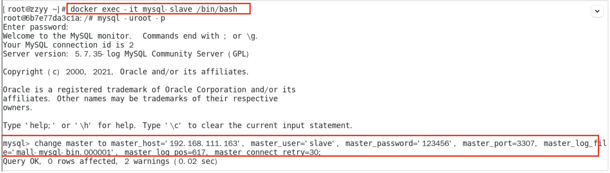
>
>12、在从数据库中查看主从同步状态
>
>```shell
>show slave status\G;
>```
>
>13、在从数据库中开启主从同步
>
>```shell
>start slave;
>```
>
>14、查看从数据库状态发现已经同步
>
>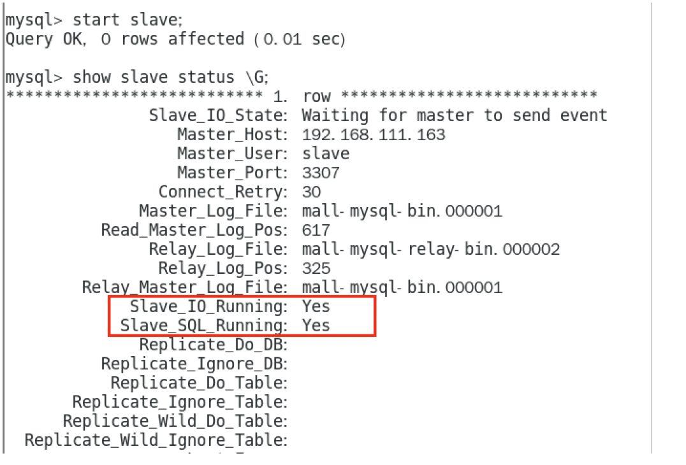
>
>15、主从复制测试
>
>```properties
>1.主机新建数据库 --->  使用数据库 ---> 新建表 --->插入数据 ， ok
>2.从机使用库 ---> 查看记录 ok
>```
>
>

#### 1.2 安装redis集群(大厂面试题第4季-分布式存储案例真题)

##### 1.2.1 cluster(集群)模式-docker版哈希槽分区进行亿级数据存储

>一、面试题
>
>问题：1~2亿条数据需要缓存，请问如何设计这个存储案例
>
> 回答：单机单台100%不可能，肯定是分布式存储，用redis如何落地？
>
>上述问题阿里P6~P7工程案例和场景设计类必考题目，
>一般业界有3种解决方案
>1. 哈希取余分区
>
>```shell
>2亿条记录就是2亿个k,v，我们单机不行必须要分布式多机，假设有3台机器构成一个集群，用户每次读写操作都是根据公式：
>hash(key) % N个机器台数，计算出哈希值，用来决定数据映射到哪一个节点上。 
>
>优点：
>  简单粗暴，直接有效，只需要预估好数据规划好节点，例如3台、8台、10台，就能保证一段时间的数据支撑。使用Hash算法让固定的一部分请求落到同一台服务器上，这样每台服务器固定处理一部分请求（并维护这些请求的信息），起到负载均衡+分而治之的作用。 
>  
>缺点：
>   原来规划好的节点，进行扩容或者缩容就比较麻烦了额，不管扩缩，每次数据变动导致节点有变动，映射关系需要重新进行计算，在服务器个数固定不变时没有问题，如果需要弹性扩容或故障停机的情况下，原来的取模公式就会发生变化：Hash(key)/3会变成Hash(key) /?。此时地址经过取余运算的结果将发生很大变化，根据公式获取的服务器也会变得不可控。 
>某个redis机器宕机了，由于台数数量变化，会导致hash取余全部数据重新洗牌。 
>
>```
>
>2. 一致性哈希算法分区
>
>   1、是什么
>   一致性Hash算法背景 
>   　一致性哈希算法在1997年由麻省理工学院中提出的，设计目标是为了解决 
>   分布式缓存数据 变动和映射问题 ，某个机器宕机了，分母数量改变了，自然取余数不OK了。
>   2、能干什么
>   提出一致性Hash解决方案。目的是当服务器个数发生变动时，尽量减少影响客户端到服务器的映射关系。
>   3、3大步骤
>   【算法构建一致性哈希环】
>       一致性哈希算法必然有个hash函数并按照算法产生hash值，这个算法的所有可能哈希值会构成一个全量集，这个集合可以成为一个hash空间[0,2^32-1]，这个是一个线性空间，但是在算法中，我们通过适当的逻辑控制将它首尾相连(0 = 2^32),这样让它逻辑上形成了一个环形空间。 
>
>   它也是按照使用取模的方法，前面笔记介绍的节点取模法是对节点（服务器）的数量进行取模。而一致性Hash算法是对2^32取模，简单来说， 一致性Hash算法将整个哈希值空间组织成一个虚拟的圆环 ，如假设某哈希函数H的值空间为0-2^32-1（即哈希值是一个32位无符号整形），整个哈希环如下图：整个空间 按顺时针方向组织 ，圆环的正上方的点代表0，0点右侧的第一个点代表1，以此类推，2、3、4、……直到2^32-1，也就是说0点左侧的第一个点代表2^32-1， 0和2^32-1在零点中方向重合，我们把这个由2^32个点组成的圆环称为Hash环。
>
>
>
>【服务器IP节点映射】
>   将集群中各个IP节点映射到环上的某一个位置。 
>   将各个服务器使用Hash进行一个哈希，具体可以选择服务器的IP或主机名作为关键字进行哈希，这样每台机器就能确定其在哈希环上的位置。假如4个节点NodeA、B、C、D，经过IP地址的 哈希函数 计算(hash(ip))，使用IP地址哈希后在环空间的位置如下：
>
>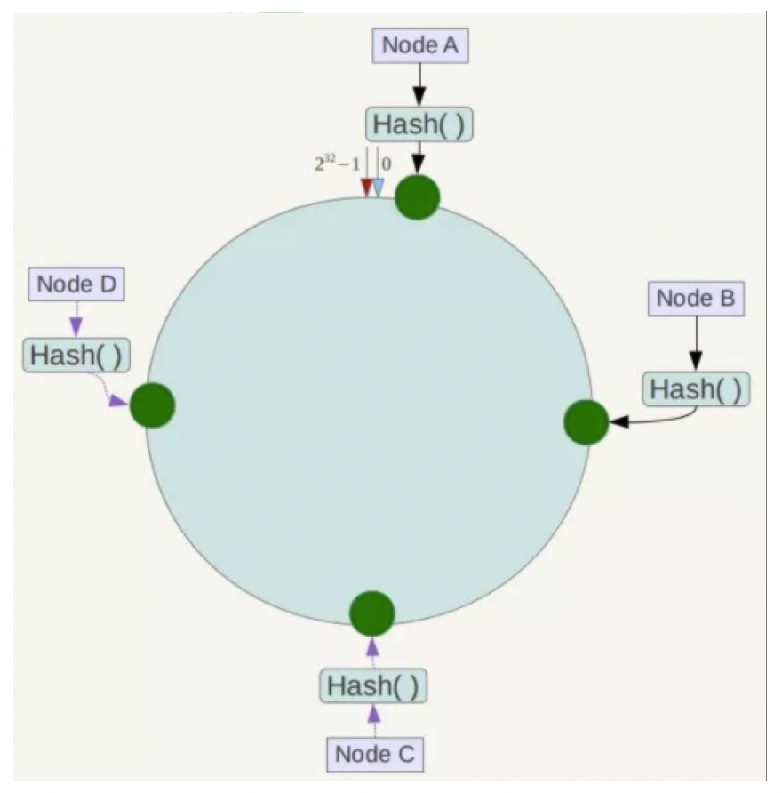
>
>【key落到服务器的落键规则】
>	当我们需要存储一个kv键值对时，首先计算key的hash值，hash(key)，将这个key使用相同的函数Hash计算出哈希值并确定此数据在环上的位置， 从此位置沿环顺时针“行走” ，第一台遇到的服务器就是其应该定位到的服务器，并将该键值对存储在该节点上。 
>如我们有Object A、Object B、Object C、Object D四个数据对象，经过哈希计算后，在环空间上的位置如下：根据一致性Hash算法，数据A会被定为到Node A上，B被定为到Node B上，C被定为到Node C上，D被定为到Node D上。
>
>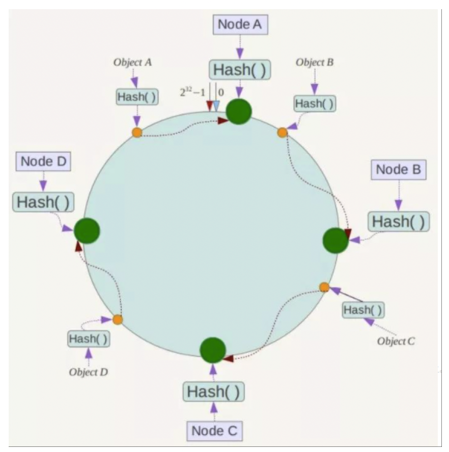
>
>4、优点
>
>一致性哈希算法的容错性
>
>```properties
>假设Node C宕机，可以看到此时对象A、B、D不会受到影响，只有C对象被重定位到Node D。一般的，在一致性Hash算法中，如果一台服务器不可用，则 受影响的数据仅仅是此服务器到其环空间中前一台服务器（即沿着逆时针方向行走遇到的第一台服务器）之间数据 ，其它不会受到影响。简单说，就是C挂了，受到影响的只是B、C之间的数据，并且这些数据会转移到D进行存储。 
>```
>
>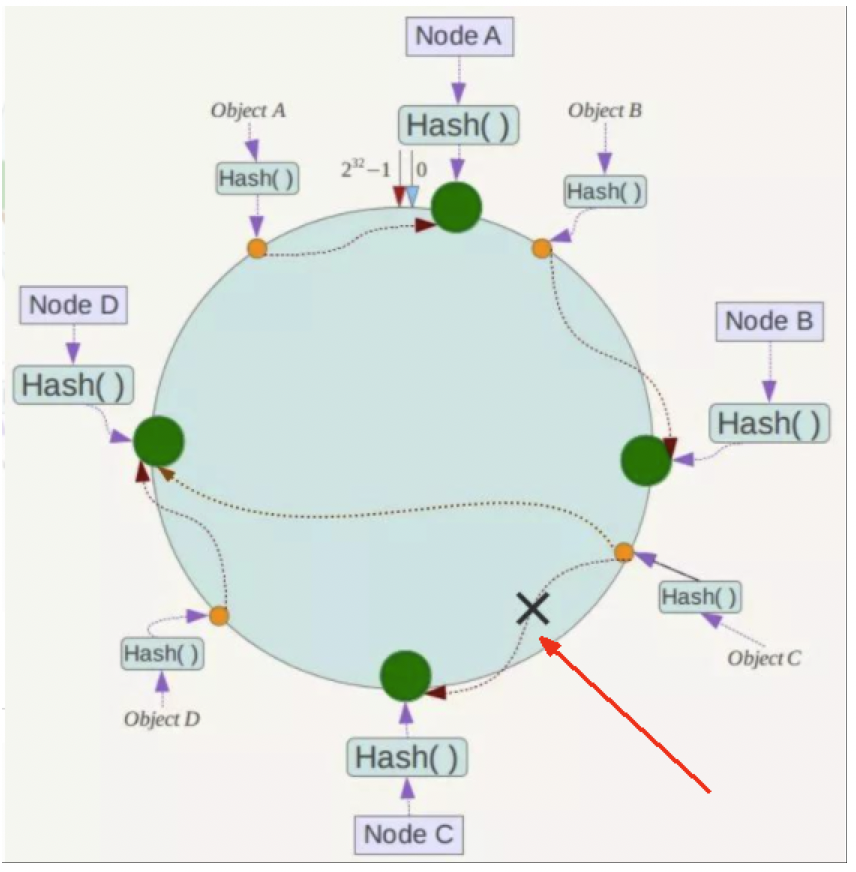
>
>一致性哈希算法的扩展性
>
>```properties
>数据量增加了，需要增加一台节点NodeX，X的位置在A和B之间，那收到影响的也就是A到X之间的数据，重新把A到X的数据录入到X上即可， 
>不会导致hash取余全部数据重新洗牌。 
>```
>
>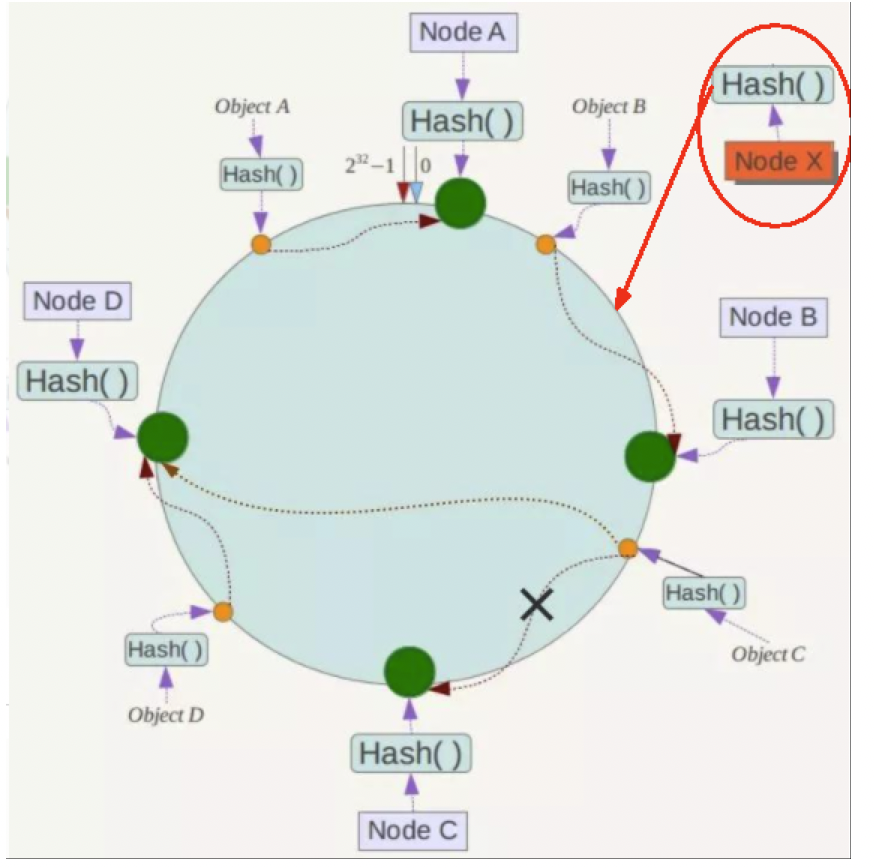
>
>5、缺点
>
>一致性哈希算法的数据倾斜问题
>
>```properties
>一致性Hash算法在服务 节点太少时 ，容易因为节点分布不均匀而造成 数据倾斜 （被缓存的对象大部分集中缓存在某一台服务器上）问题， 
>例如系统中只有两台服务器：
>```
>
>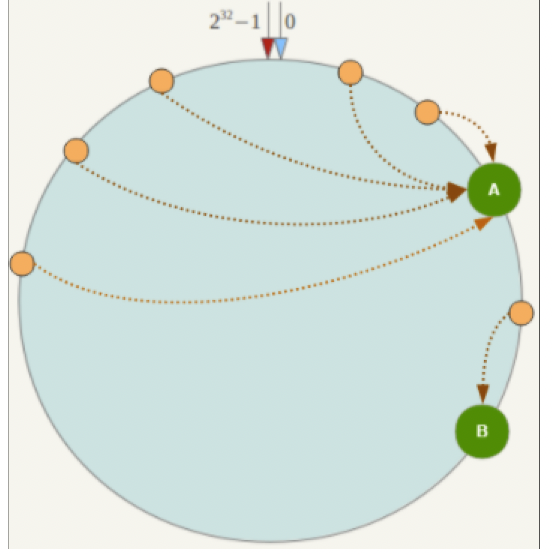
>
>6、小总结
>
>```properties
>为了在节点数目发生改变时尽可能少的迁移数据 
>  
>将所有的存储节点排列在收尾相接的Hash环上，每个key在计算Hash后会 顺时针 找到临近的存储节点存放。 
>而当有节点加入或退出时仅影响该节点在Hash环上 顺时针相邻的后续节点 。   
>  
>优点 
>加入和删除节点只影响哈希环中顺时针方向的相邻的节点，对其他节点无影响。 
>  
>缺点  
>数据的分布和节点的位置有关，因为这些节点不是均匀的分布在哈希环上的，所以数据在进行存储时达不到均匀分布的效果。 
>
>```

> 3. 哈希槽分区
>
> ```properties
> 1. 为什么出现
> 一致性哈希算法的数据倾斜问题
> 哈希槽是指就是一个数组，数组[0,2^14-1]形成的hash slot空间。
> 2. 能干什么
> 解决均匀分配的问题，在数据和节点之间有加入了一层，把这层称为哈希槽(slot)，用于管理数据和节点之间的关系，现在就相当于节点上放的是槽，槽里放的是数据。
> 
> ```
>
> 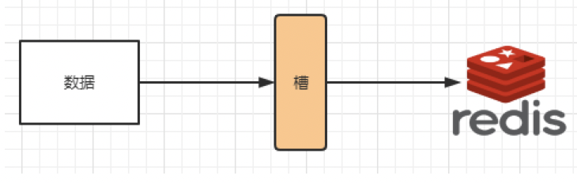
>
> ```properties
> 槽解决的是粒度问题，相当于把粒度变大了，这样便于数据移动。 
> 哈希解决的是映射问题，使用key的哈希值来计算所在的槽，便于数据分配。
> 3. 多少个hash槽 
> 一个集群只能有16384个槽，编号0-16383（0-2^14-1）。这些槽会分配给集群中的所有主节点，分配策略没有要求。可以指定哪些编号的槽分配给哪个主节点。集群会记录节点和槽的对应关系。解决了节点和槽的关系后，接下来就需要对key求哈希值，然后对16384取余，余数是几key就落入对应的槽里。slot = CRC16(key) % 16384。以槽为单位移动数据，因为槽的数目是固定的，处理起来比较容易，这样数据移动问题就解决了。 
> ```
>
> 

##### 1.2.2 redis集群3主3从扩缩容配置案例

>一、关闭防火墙+启动docker后台服务
>
>```shell
>systemctl start docker
>```
>
>二、新建6个docker容器redis实例
>
>```shell
># 创建并运行docker容器实例
>docker run 
># 容器名字
>--name redis-node-6
># 使用宿主机的IP和端口，默认
>--net host
># 获取宿主机root用户权限
>--privileged=true
># 容器卷，宿主机地址:docker内部地址
>-v /data/redis/share/redis-node-6:/data
># redis镜像和版本号
>redis:6.0.8
># 开启redis集群
>--cluster-enabled yes 
># 开启持久化
>--applendonly yes 
>```
>
>```shell
>docker run -d --name redis-node-1 --net host --privileged=true -v /data/redis/share/redis-node-1:/data redis:6.0.8 --cluster-enabled yes --appendonly yes --port 6381 
>  
>docker run -d --name redis-node-2 --net host --privileged=true -v /data/redis/share/redis-node-2:/data redis:6.0.8 --cluster-enabled yes --appendonly yes --port 6382 
>  
>docker run -d --name redis-node-3 --net host --privileged=true -v /data/redis/share/redis-node-3:/data redis:6.0.8 --cluster-enabled yes --appendonly yes --port 6383 
>  
>docker run -d --name redis-node-4 --net host --privileged=true -v /data/redis/share/redis-node-4:/data redis:6.0.8 --cluster-enabled yes --appendonly yes --port 6384 
>  
>docker run -d --name redis-node-5 --net host --privileged=true -v /data/redis/share/redis-node-5:/data redis:6.0.8 --cluster-enabled yes --appendonly yes --port 6385 
>  
>docker run -d --name redis-node-6 --net host --privileged=true -v /data/redis/share/redis-node-6:/data redis:6.0.8 --cluster-enabled yes --appendonly yes --port 6386 
>```
>
>三、进入容器redis-node-1并为6台机器构建集群关系
>
>```shell
># 进入容器
>docker exec -it redis-node-1 /bin/bash
>```
>
>//注意，进入docker容器后才能执行一下命令，且注意自己的真实IP地址 
>
>```shell
>redis-cli --cluster create 192.168.111.147:6381 192.168.111.147:6382 192.168.111.147:6383 192.168.111.147:6384 192.168.111.147:6385 192.168.111.147:6386 --cluster-replicas 1 
>```
>
>--cluster-replicas 1 表示为每个master创建一个slave节点 
>
>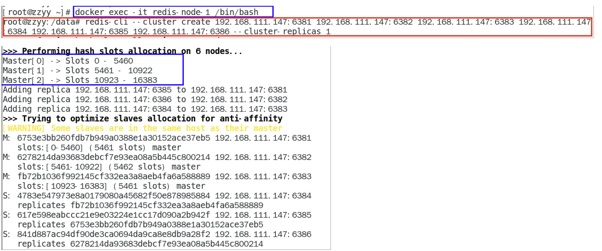
>
>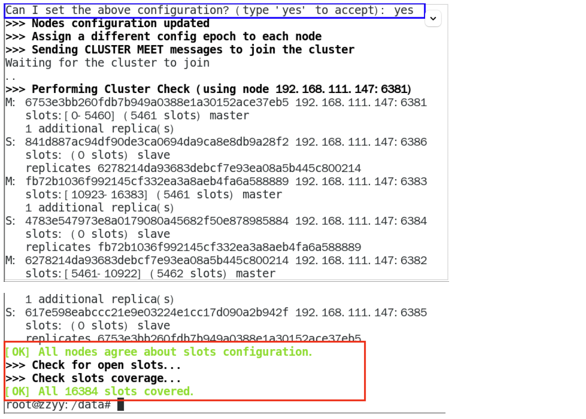
>
>四、连接进入6318作为切入点，查看集群状态
>
>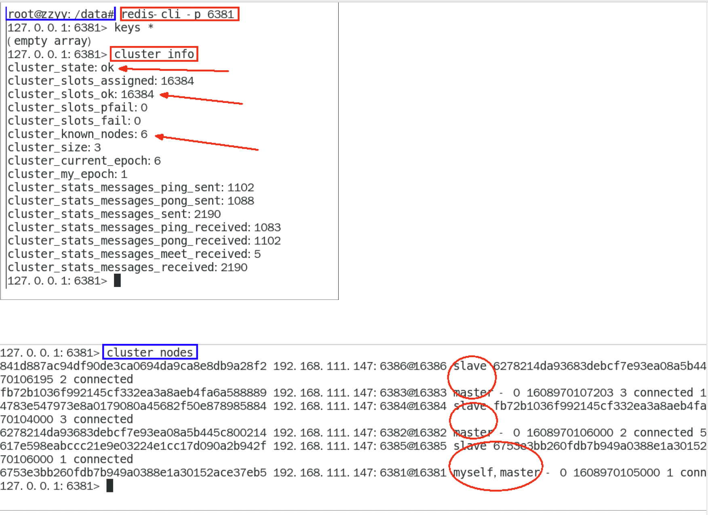
>
>```
>cluster info
>
>cluster nodes
>```
>
>

##### 1.2.3 主从容错切换迁移案例

>一、数据读写存储
>
>启动6机构成的集群并通过exec进入
>
>对6381新增两个key
>
>防止路由时效加参数-c并新增连个key
>
>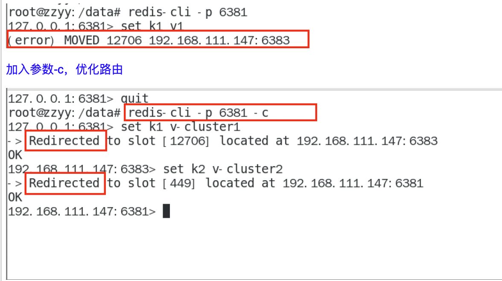
>
>查看集群信息
>
>```shell
>redis-cli --cluster check 192.168.111.147:6381 
>```
>
>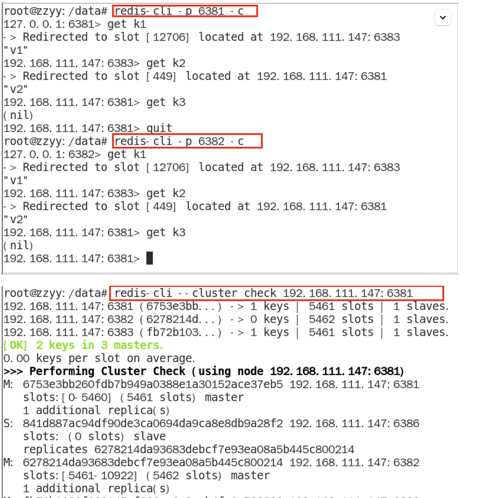
>
>二、容错切换迁移
>
>1. 主6381和从机切换，先停止主机6381
>
>```properties
>6381主机停了，对应的真实从机上位
>6381作为1号主机分配的从机以实际情况为准，具体是几号机器就是几号
>```
>
>2. 再次查看集群信息
>
>   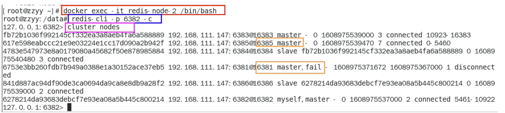
>
>   6381宕机了，6385上位成为了新的master。 
>
>   备注：本次脑图笔记6381为主下面挂从6385 。 
>
>   每次案例下面挂的从机以实际情况为准，具体是几号机器就是几号 
>
>3. 先还原之前的3主3从
>
>```shell
># 先启6381
>docker start redis-node-1
># 再停6385 
>docker stop redis-node-5
># 再起6385
>docker start redis-node-5
>主从机器分配情况一实际情况为准
>```
>
>4. 查看集群状态
>
>   ```shell
>   redis-cli --cluster check 自己IP:6381
>   ```
>
>   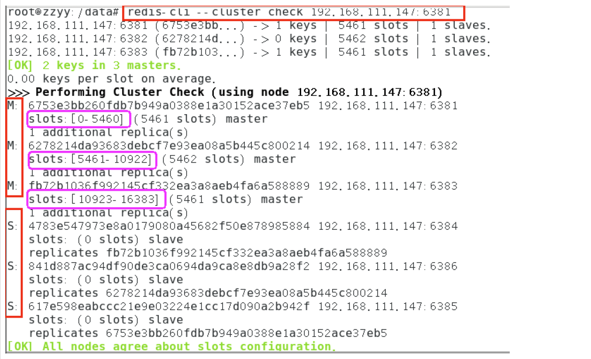

##### 1.2.4 主从扩容案例

>一、新建6387、6388两个节点+新建后启动+查看是否8节点
>
>```shell
>docker run -d --name redis-node-7 --net host --privileged=true -v /data/redis/share/redis-node-7:/data redis:6.0.8 --cluster-enabled yes --appendonly yes --port 6387 
>
>docker run -d --name redis-node-8 --net host --privileged=true -v /data/redis/share/redis-node-8:/data redis:6.0.8 --cluster-enabled yes --appendonly yes --port 6388 
>
>docker ps 
>```
>
>二、进入6387容器实例内部
>
>```shell
>docker exec -it redis-node-7 /bin/bash
>```
>
>三、将新增的6387节点(空槽号)作为master节点加入原集群
>
>```shell
>将新增的6387作为master节点加入集群
>redis-cli --cluster  add-node  自己实际IP地址: 6387  自己实际IP地址: 6381 
>6387 就是将要作为master新增节点 
>6381 就是原来集群节点里面的领路人，相当于6387拜拜6381的码头从而找到组织加入集群 
>```
>
>四、检查集群情况第1次
>
>```shell
>redis-cli --cluster check 真实ip地址:6381 
># 例如
>redis-cli --cluster check 192.168.111.147:6381 
>```
>
>五、重新分派槽号
>
>```shell
>重新分派槽号
>命令:redis-cli --cluster  reshard  IP地址:端口号 
>redis-cli --cluster reshard 192.168.111.147:6381 
>```
>
>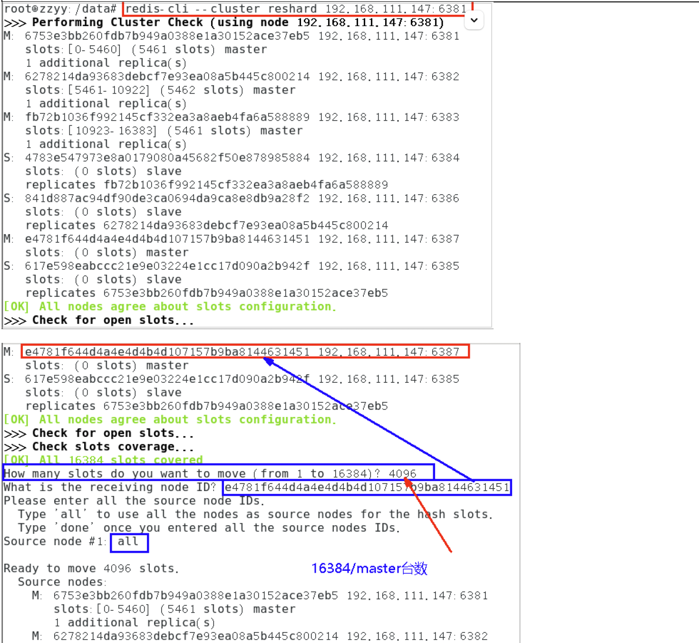
>
>六、检查集群情况第2次
>
>```shell
>redis-cli --cluster check 真实ip地址:6381 
>
>为什么6387是3个新的区间，以前的还是连续？
>重新分配成本太高，所以前3家各自匀出来一部分，从6381/6382/6383三个旧节点分别匀出1364个坑位给新节点6387 
>```
>
>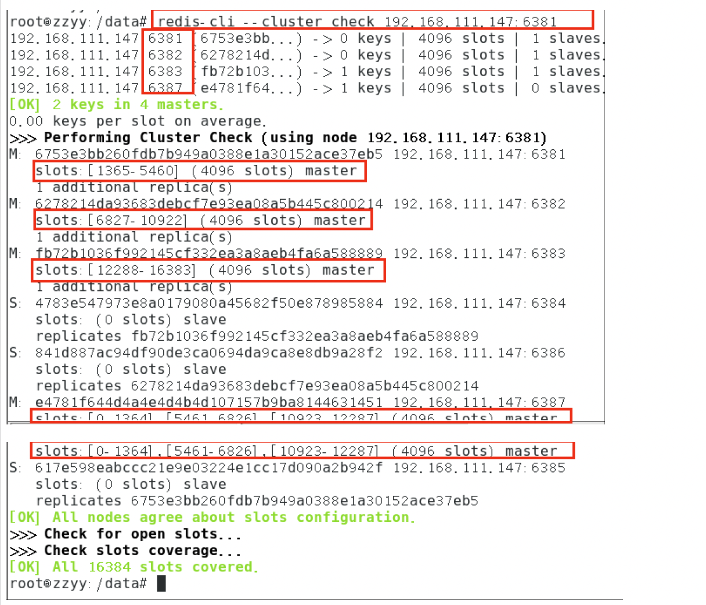
>
>七、为主节点6387分配从节点6388
>
>```shell
>命令：redis-cli  --cluster add-node  ip:新slave端口 ip:新master端口 --cluster-slave --cluster-master-id 新主机节点ID
> 
>redis-cli --cluster add-node 192.168.111.147:6388 192.168.111.147:6387 --cluster-slave --cluster-master-id e4781f644d4a4e4d4b4d107157b9ba8144631451-------这个是6387的编号，按照自己实际情况 
>```
>
>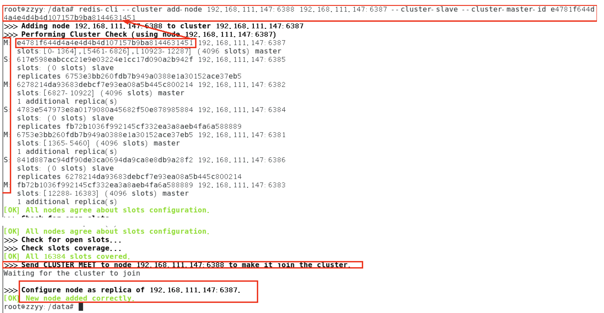
>
>八、检查集群情况第3次
>
>```shell
>redis-cli --cluster check 192.168.111.147:6382 
>```
>
>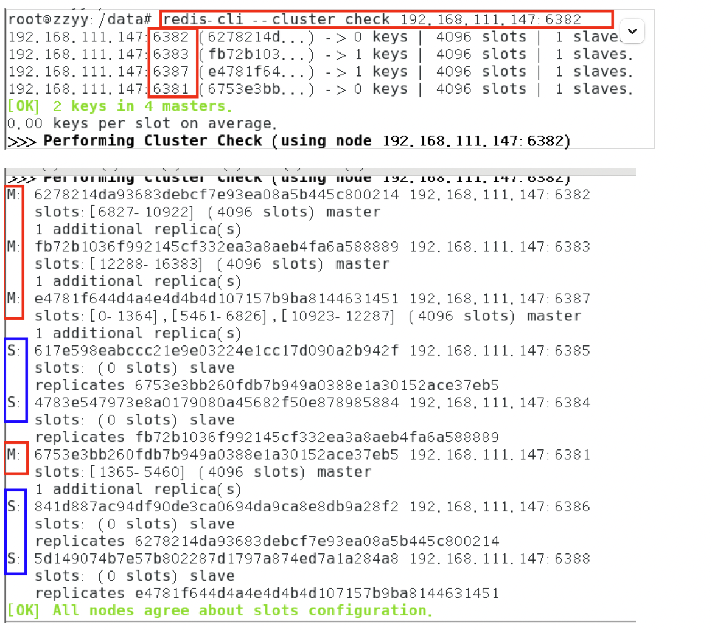

##### 1.2.5 主从缩容案例

>一、目的：6387和6388下线
>
>二、检查集群情况1获得6388的节点ID
>
>```shell
>redis-cli --cluster check 192.168.111.147:6382 
>```
>
>三、将6388删除  从集群中将4号从节点6388删除
>
>```shell
>命令：redis-cli --cluster  del-node  ip:从机端口 从机6388节点ID
>  
>redis-cli --cluster  del-node  192.168.111.147:6388 5d149074b7e57b802287d1797a874ed7a1a284a8 
>
>redis-cli --cluster check 192.168.111.147:6382 
>
>检查一下发现，6388被删除了，只剩下7台机器了。
>```
>
>四、将6387的槽号清空，重新分配，本例将清出来的槽号都给6381
>
>```shell
>redis-cli --cluster reshard 192.168.111.147:6381 
>```
>
>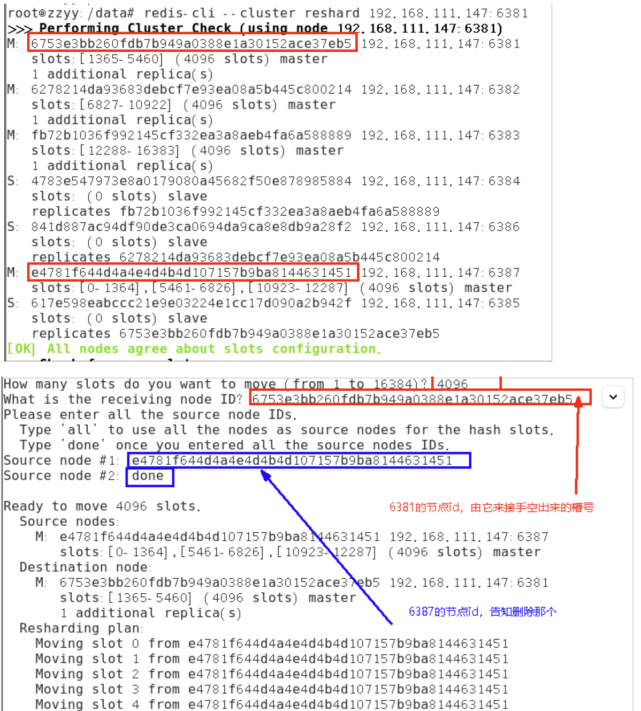
>
>五、检查集群情况第二次
>
>```shell
>redis-cli --cluster check 192.168.111.147:6381
>  
>4096个槽位都指给6381，它变成了8192个槽位，相当于全部都给6381了，不然要输入3次，一锅端 
>```
>
>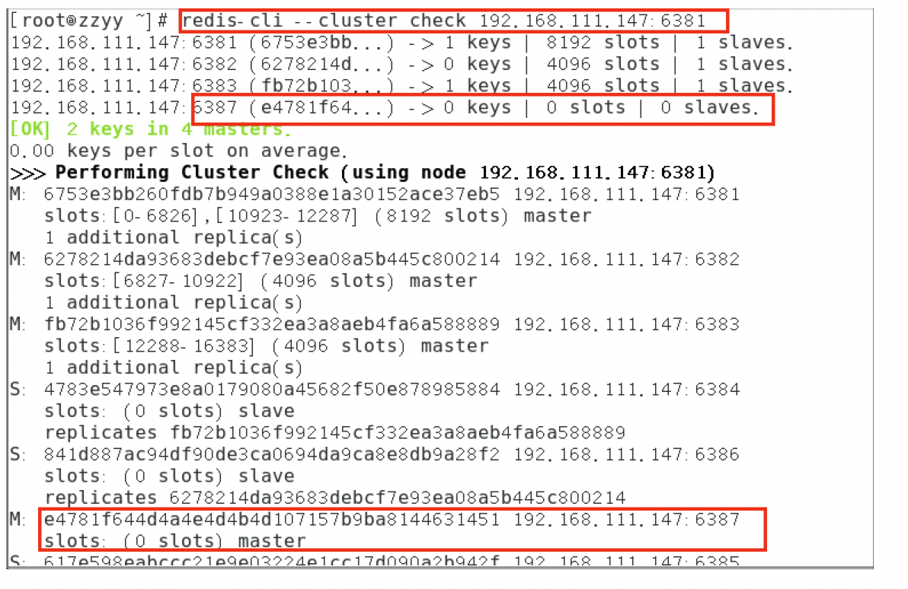
>
>六、将6387删除
>
>```shell
># 命令：redis-cli --cluster del-node ip:端口 6387节点ID
>redis-cli --cluster del-node 192.168.111.147:6387 e4781f644d4a4e4d4b4d107157b9ba8144631451 
>```
>
>七、检查集群情况第三次
>
>```shell
>redis-cli --cluster check 192.168.111.147:6381 
>```
>
>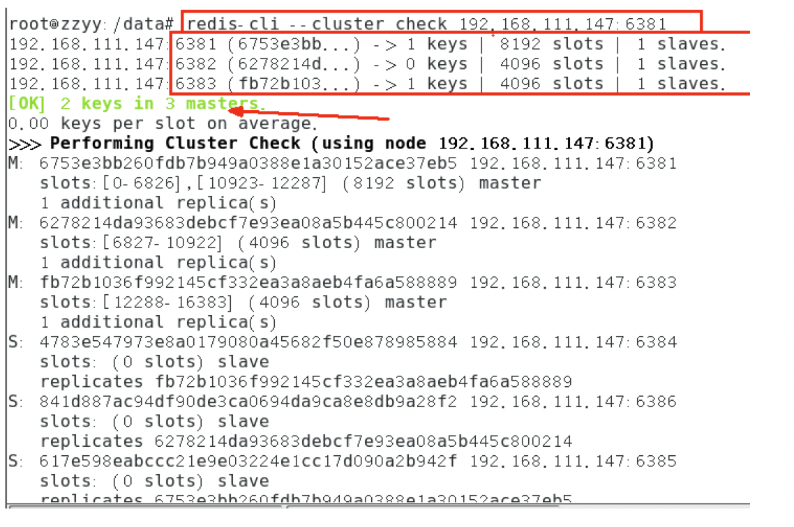

### 二、DockerFile解析

#### 2.1 DockerFile是什么

DockerFile是用来构建Docker镜像的文本文件，是有一条条构建镜像所需的指令和参数构成的脚本。

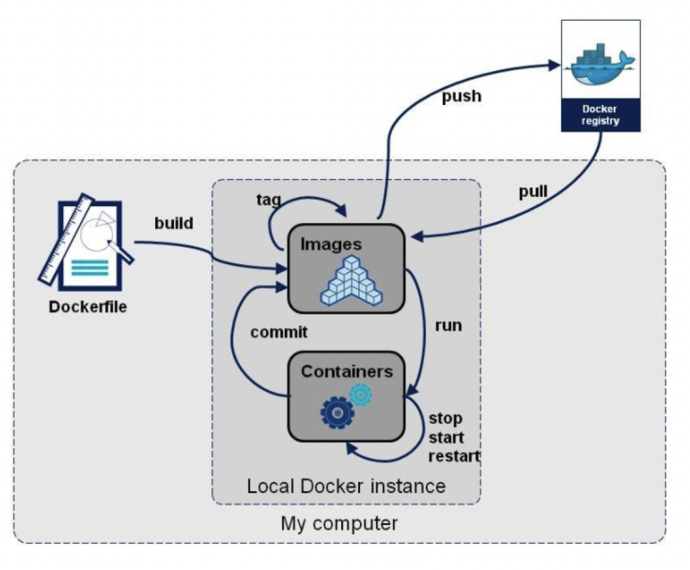

官网：https://docs.docker.com/engine/reference/builder/

构建三步骤

````shell
1、编写DockerFile文件
2、docker build命令构建镜像
3、docker run 依镜像运行容器实例
````

#### 2.2 DockerFile构建过程解析

**DockerFile内容基础知识**

```shell
1. 每条保留字指令都必须为大写字母且后面跟随至少一个参数
2. 指令按照从上到下，顺序执行
3. #表示注释
4. 每条指令都会创建一个新的镜像层并对镜像进行提交。
```

**Docker执行DockerFile的大致流程**

```
1. docker从技术镜像运行一个容器
2. 执行一条指令比鞥对容器做出修改
3. 执行类似docker commit 的操作提交一个新的镜像层
4. docker 在基于刚提交的镜像运行一个新容器
5. 执行dockerfile中的下一条指令直到所有执行执行完成。
```

#### 2.3 小总结

>从应用软件的角度来看，Dockerfile、Docker镜像与Docker容器分别代表软件的三个不同阶段， 
>
> Dockerfile是软件的原材料 
>
>Docker镜像是软件的交付品 
>
>Docker容器则可以认为是软件镜像的运行态，也即依照镜像运行的容器实例 
>
>Dockerfile面向开发，Docker镜像成为交付标准，Docker容器则涉及部署与运维，三者缺一不可，合力充当Docker体系的基石。 
>
>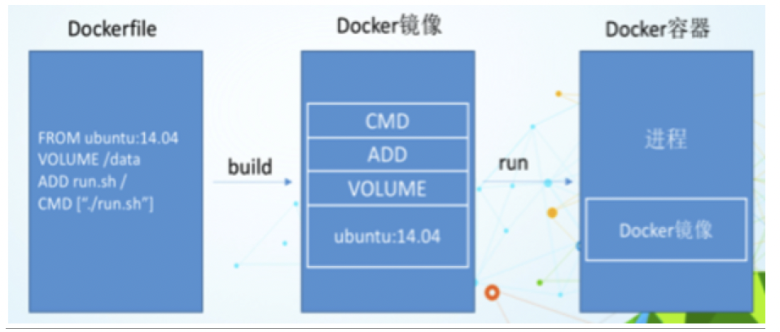
>
>1. Dockerfile，需要定义一个Dockerfile，Dockerfile定义了进程需要的一切东西。Dockerfile涉及的内容包括执行代码或者是文件、环境变量、依赖包、运行时环境、动态链接库、操作系统的发行版、服务进程和内核进程(当应用进程需要和系统服务和内核进程打交道，这时需要考虑如何设计namespace的权限控制)等等; 
>
>2. Docker镜像，在用Dockerfile定义一个文件之后，docker build时会产生一个Docker镜像，当运行 Docker镜像时会真正开始提供服务; 
>
>3. Docker容器，容器是直接提供服务的。 

#### 2.4 DockerFile常用保留字指令

>1. 参考tomcat8的dockerfile入门
>
>https://github.com/docker-library/tomcat
>
>2. From
>
>   ```properties
>   基础镜像，当前新镜像是基于哪个镜像的，指定一个已经存在的镜像作为模板，第一条必须是from
>   ```
>
>3. MANINTAINER
>
>   镜像维护者的姓名和邮箱地址
>
>4. Run
>
>   容器构建时需要运行的命令
>
>   两种格式：
>
>   shell格式
>
>   ```shell
>   <命令行命令>等同于，在终端操作的shell命令
>   
>   RUN yum -y install vim
>   ```
>
>   exec格式
>
>   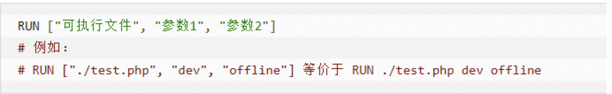
>
>   RUN是在docker build时运行
>
>5. EXPOSE
>
>   当前容器对外暴露出的端口
>
>6. WORKDIR
>
>   指定在创建容器后。终端默认登录的进来工作目录，一个落脚点。
>
>7. USER
>
>   指定该镜像以什么样的用户去执行，如果都不指定，默认是root
>
>8. ENV
>
>   用来在构建镜像过程中设置环境变量
>
>   ```properties
>   ENV MY_PATH /usr/mytest 
>   这个环境变量可以在后续的任何RUN指令中使用，这就如同在命令前面指定了环境变量前缀一样； 
>   也可以在其它指令中直接使用这些环境变量， 
>     
>   比如：WORKDIR $MY_PATH 
>   ```
>
>   
>
>9. ADD
>
>   将宿主机目录下的文件拷贝进镜像且会自动处理URL和解压tar压缩包
>
>10. COPY
>
>    类似ADD，拷贝文件和目录到镜像中。将从构建上下文目录中<源路径>的文件/目录复制到新的一层镜像内的<目标路径>位置
>
>    ```shell
>    COPY src dest
>    
>    COPY["src","dest"]
>    
>    <src源路径>：源文件或源目录
>    
>    <dest目标路径>: 容器内的指定路径，该路径不用事先建好，路径不存在的话，会自动创建。
>    ```
>
>    
>
>11. VOLUME
>
>    容器数据卷，用于数据保存和持久化的工作
>
>12. CMD
>
>    指定容器启动后的要干的事情。
>
>    【注意】
>
>    ```shell
>    Dockerfile 中可以由多个CMD指令，但是只有最后一个生效，CMD会被docker run 之后的参数替换。
>    ```
>
>    参考官网Tomcat的dockerfile演示讲解
>
>    官网最后一行命令
>
>    ```
>    EXPOSE 8080
>    CMD ["catalina.sh","run"]
>    ```
>
>    我们演示自己的覆盖操作
>
>    ```shell
>    docker run -it -p 8080:8080  容器ID /bin/bash
>    ```
>
>    他和前面RUN命令的区别
>
>    ```shell
>    CMD 是在 docker run 时运行。
>    
>    RUN 是在docker build 时运行
>    ```
>
>    
>
>13. ENTRYPOINT 
>
>    1. 也是用来指定一个容器启动时要运行的命令
>
>    2. 类似于CMD指令，但是ENTRYPOINT不会被docker run 后面的命令覆盖，而且这些命令行参数会被当作参数送给ENTRYPOINT指令指定的程序。
>
>    3. 命令格式和案例说明
>
>       ```shell
>       命令格式：ENTRYPOINT["<executeable>","<param1>","<param2>",...]
>                         
>       ENTRYPOINT 可以和CMD一起用，一般是 变参 才会使用 CMD ，这里的CMD等于是在给 ENTRYPOINT 传参。当制定了 ENTRYPOINT 后，CMD的含义就发生了变化，不再是直接运行其命令而是将 CMD 的内容作为参数传递给 ENTRYPOINT 指定，他两个组合会变成<ENTRYPOINT> "<CMD>"
>       案例如下：假设已通过 Dockerfile 构建了 nginx:test 镜像
>       ```
>
>        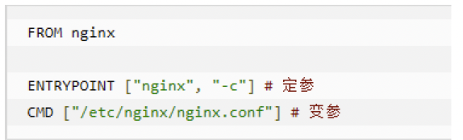
>
>       | 是否传参         | 按照dockerfile编写执行         | 传参运行                                      |
>       | ---------------- | ------------------------------ | --------------------------------------------- |
>       | Docker命令       | docker run nginx:test          | docker run nginx:test -c /etc/nginx/ new.conf |
>       | 衍生出的实际命令 | nginx -c /etc/nginx/nginx.conf | nginx -c /etc/nginx/ new.conf                 |
>
>        
>
>    优点：在执行docker run 的时候可以指定 ENTRYPOINT 运行所需的参数。
>
>    注意：如果Dockerfile 中如果存在多个 ENTRYPOINT 指令，进最后一个生效。
>
>    14. 小总结
>
>        

#### 2.5 案例

##### 2.5.1 自定义镜像mycentosjava8

**要求**

```shell
Centos7镜像具备 vim + ifconfig + jdk8

JDK下载镜像地址
官网：https://www.oracle.com/java/technologies/downloads/#java8 
https://mirrors.yangxingzhen.com/jdk/
```

**编写**

```shell
准备编写Dockerfile文件 
【注意】大写字母D
 
FROM centos
MAINTAINER zzyy<zzyybs@126.com> 
  
ENV MYPATH /usr/local 
WORKDIR $MYPATH 
  
#安装vim编辑器 
RUN yum -y install vim 
#安装ifconfig命令查看网络IP 
RUN yum -y install net-tools 
#安装java8及lib库 
RUN yum -y install glibc.i686 
RUN mkdir /usr/local/java 
#ADD 是相对路径jar,把jdk-8u171-linux-x64.tar.gz添加到容器中,安装包必须要和Dockerfile文件在同一位置 
ADD jdk-8u171-linux-x64.tar.gz /usr/local/java/ 
#配置java环境变量 
ENV JAVA_HOME /usr/local/java/jdk1.8.0_171 
ENV JRE_HOME $JAVA_HOME/jre 
ENV CLASSPATH $JAVA_HOME/lib/dt.jar:$JAVA_HOME/lib/tools.jar:$JRE_HOME/lib:$CLASSPATH 
ENV PATH $JAVA_HOME/bin:$PATH 
  
EXPOSE 80 
 
CMD echo $MYPATH 
CMD echo "success--------------ok" 
CMD /bin/bash 
```

**构建**

```shell
docker build -t 新镜像名字: TAG

例如：docker build -t centosjava8:1.5 .

【注意】
上面TAG 后面有个空格，有个点
```

**运行**

```shell
docker run -it 新镜像名字:TAG

docker run -it centosjava8:1.5 /bin/bash 
```

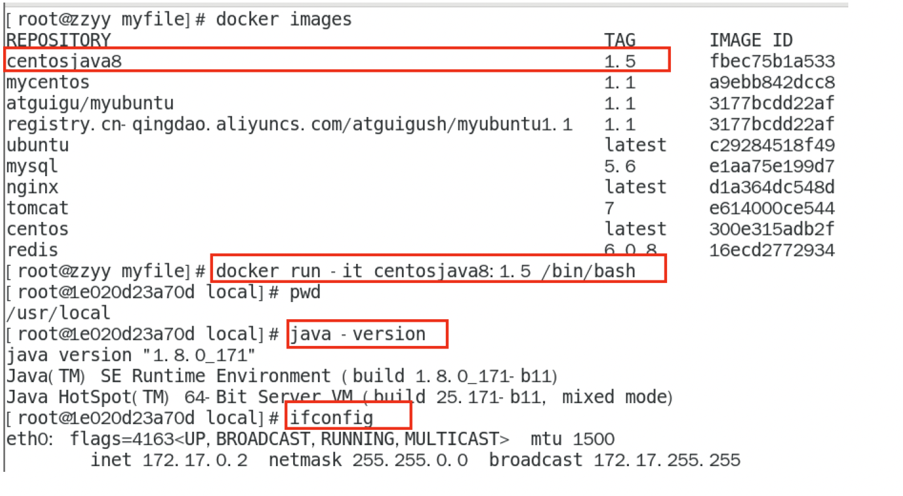

**再体会下UnionFS（联合文件系统）**

```properties
UnionFS（联合文件系统）：Union文件系统（UnionFS）是一种分层、轻量级并且高性能的文件系统，它支持 对文件系统的修改作为一次提交来一层层的叠加， 同时可以将不同目录挂载到同一个虚拟文件系统下(unite several directories into a single virtual filesystem)。Union 文件系统是 Docker 镜像的基础。 镜像可以通过分层来进行继承 ，基于基础镜像（没有父镜像），可以制作各种具体的应用镜像。

特性：一次同时加载多个文件系统，但从外面看起来，只能看到一个文件系统，联合加载会把各层文件系统叠加起来，这样最终的文件系统会包含所有底层的文件和目录 
```

##### 2.5.2 虚悬镜像

**是什么**

```
仓库名，标签都是 <none> 的镜像，俗称dangling image

Dockerfile 写一个
```

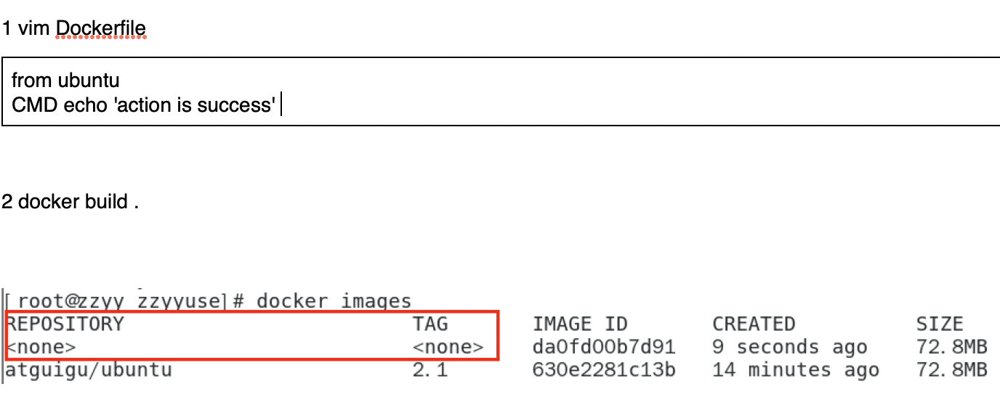

**查看**

```shell
docker image ls -f dangling=true
命令结果如下图：
```

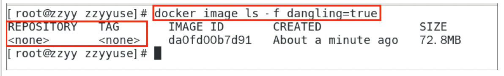

**删除**

```
docker image prune 

虚悬镜像已经市区存在价值，可以删除
```

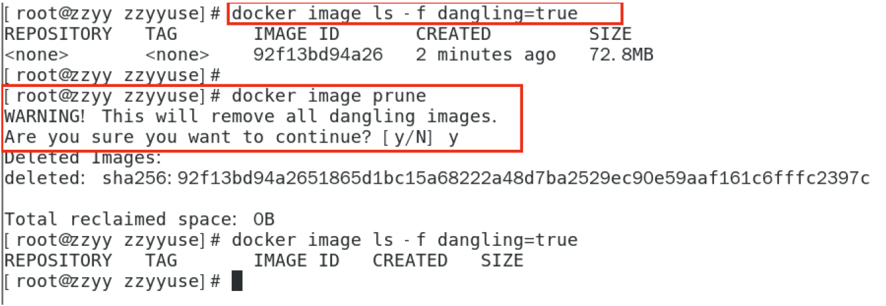

##### 2.5.3 家庭作业自定义myubuntu

````shell
# 编写
准备编写DockerFile文件
vim Dockerfile
----------------------
FROM ubuntu
MAINTAINER zzyy<zzyybs@126.com> 
  
ENV MYPATH /usr/local 
WORKDIR $MYPATH 
  
RUN apt-get update 
RUN apt-get install net-tools 
#RUN apt-get install -y iproute2 
#RUN apt-get install -y inetutils-ping 
  
EXPOSE 80 
  
CMD echo $MYPATH 
CMD echo "install inconfig cmd into ubuntu success--------------ok" 
CMD /bin/bash 
------------------------
# 构建
docker build -t 新镜像名字:TAG

#运行
docker run -it 新镜像名字:TAG

````

### 三、Docker微服务实战

#### 3.1 通过IDEA新建一个普通微服务模块

**建Module**

```
docker_boot
```

**修改POM**

````xml
<?xml version ="1.0" encoding ="UTF-8"?>
 <project xmlns ="http://maven.apache.org/POM/4.0.0" xmlns: xsi ="http://www.w3.org/2001/XMLSchema-instance"
      xsi :schemaLocation ="http://maven.apache.org/POM/4.0.0 https://maven.apache.org/xsd/maven-4.0.0.xsd"> 
   <modelVersion> 4.0.0 </modelVersion> 
   <parent> 
     <groupId> org.springframework.boot </groupId> 
     <artifactId> spring-boot-starter-parent </artifactId> 
     <version> 2.5.6 </version> 
     <relativePath/> 
   </parent> 
 
   <groupId> com.atguigu.docker </groupId> 
   <artifactId> docker_boot </artifactId> 
   <version> 0.0.1-SNAPSHOT </version> 
 
   <properties> 
     <project.build.sourceEncoding> UTF-8 </project.build.sourceEncoding> 
     <maven.compiler.source> 1.8 </maven.compiler.source> 
     <maven.compiler.target> 1.8 </maven.compiler.target> 
     <junit.version> 4.12 </junit.version> 
     <log4j.version> 1.2.17 </log4j.version> 
     <lombok.version> 1.16.18 </lombok.version> 
     <mysql.version> 5.1.47 </mysql.version> 
     <druid.version> 1.1.16 </druid.version> 
     <mapper.version> 4.1.5 </mapper.version> 
     <mybatis.spring.boot.version> 1.3.0 </mybatis.spring.boot.version> 
   </properties> 
 
   <dependencies> 
     <!--SpringBoot 通用依赖模块 -->
     <dependency> 
       <groupId> org.springframework.boot </groupId> 
       <artifactId> spring-boot-starter-web </artifactId> 
     </dependency> 
     <dependency> 
       <groupId> org.springframework.boot </groupId> 
       <artifactId> spring-boot-starter-actuator </artifactId> 
     </dependency> 
     <!--test-->
     <dependency> 
       <groupId> org.springframework.boot </groupId> 
       <artifactId> spring-boot-starter-test </artifactId> 
       <scope> test </scope> 
     </dependency> 
   </dependencies> 
   <build> 
     <plugins> 
       <plugin> 
         <groupId> org.springframework.boot </groupId> 
         <artifactId> spring-boot-maven-plugin </artifactId> 
       </plugin> 
       <plugin> 
         <groupId> org.apache.maven.plugins </groupId> 
         <artifactId> maven-resources-plugin </artifactId> 
         <version> 3.1.0 </version> 
       </plugin> 
     </plugins> 
   </build> 
 </project> 
````

**写YML**

```yaml
server.port=6001
```

**主启动**

```java
package  com.atguigu.docker;
import  org.springframework.boot.SpringApplication;
import  org.springframework.boot.autoconfigure. SpringBootApplication ;
@SpringBootApplication
public class  DockerBootApplication {
	public static void  main(String[] args)    {
  	SpringApplication. run (DockerBootApplication. class , args);
 		 }
  }
```

**业务类**

```java
 package com.atguigu.docker.controller;

 import org.springframework.beans.factory.annotation. Value ;
 import org.springframework.web.bind.annotation. RequestMapping ;
 import org.springframework.web.bind.annotation.RequestMethod;
 import org.springframework.web.bind.annotation. RestController ;

 import java.util.UUID;

 /
  *@auther  zzyy
  *@create  2021-10-25 17:43
 */
 @RestController
 public class OrderController
 {
   @Value ( "${server.port}" )
   private String port ;

   @RequestMapping ( "/order/docker" )
   public String helloDocker()
   {
     return "hello docker" + " \t " + port + " \t " + UUID. *randomUUID* ().toString();
   }

   @RequestMapping (value = "/order/index" ,method = RequestMethod. *GET\* )
   public String index()
   {
     return " 服务端口号 : " + " \t " + port + " \t " +UUID. *randomUUID* ().toString();
   }
 } 
```

#### 3.2 通过dockerfile 发布微服务部署到docker容器

##### 3.2.1 **IDEA工具里面搞定微服务jar包**

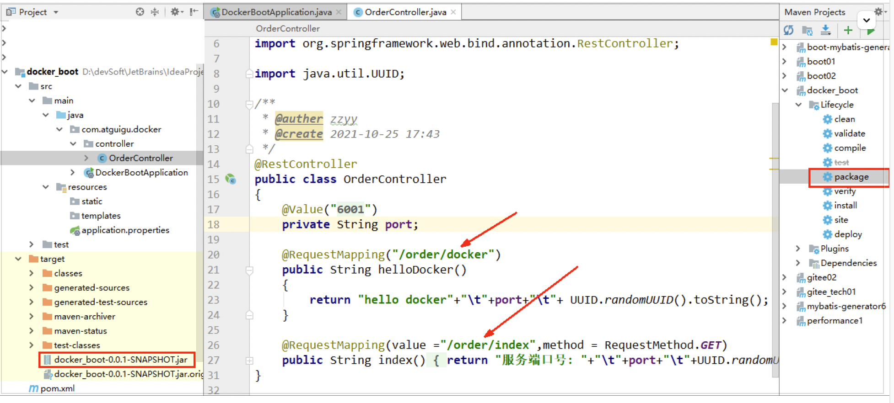

##### 3.2.2 **编写Dockerfile**

 **Dockerfile内容**

```shell
# 基础镜像使用java 
FROM java:8 
# 作者 
MAINTAINER zzyy 
# VOLUME 指定临时文件目录为/tmp，在主机/var/lib/docker目录下创建了一个临时文件并链接到容器的/tmp 
VOLUME /tmp 
# 将jar包添加到容器中并更名为zzyy_docker.jar 
ADD docker_boot-0.0.1-SNAPSHOT.jar /zzyy_docker.jar 
# 运行jar包 
RUN bash -c 'touch /zzyy_docker.jar' 
ENTRYPOINT ["java","-jar","/zzyy_docker.jar"] 
#暴露6001端口作为微服务 
EXPOSE 6001 
```

**将微服务jar包和Dockerfile文件上传到同一个目录下/mydocker**

 

```shell
docker build -t zzyy_docker:1.6 . 

```

**构建镜像**

```shell
docker build -t zzyy_docker:1.6 .

打包成镜像文件
# 命令
docker build -t zzyy_docker:1.6 .
```

**运行容器**

```shell
# 运行命令
docker run -d -p 6001:6001 zzyy_docker:1.6
# 查看镜像运行命令
docker images
```

**访问测试**


### 四、Docker网络

#### 4.1 Docker 网络是什么

##### 4.1.1 docker不启动，默认网络情况

```shell
ens 33
lo
virbr0
```

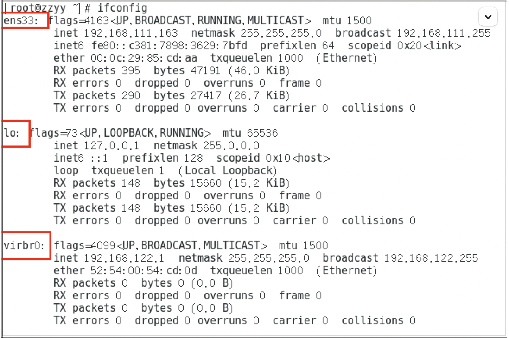

```shell
在CentOS7的安装过程中如果有 选择相关虚拟化的的服务安装系统后 ，启动网卡时会发现有一个以网桥连接的私网地址的virbr0网卡(virbr0网卡：它还有一个固定的默认IP地址192.168.122.1)，是做虚拟机网桥的使用的，其作用是为连接其上的虚机网卡提供 NAT访问外网的功能。 
  
我们之前学习Linux安装，勾选安装系统的时候附带了libvirt服务才会生成的一个东西，如果不需要可以直接将libvirtd服务卸载， 
yum remove libvirt-libs.x86_64 
```

##### 4.1.2 docker启动后，网络情况

查看docker网络模式命令

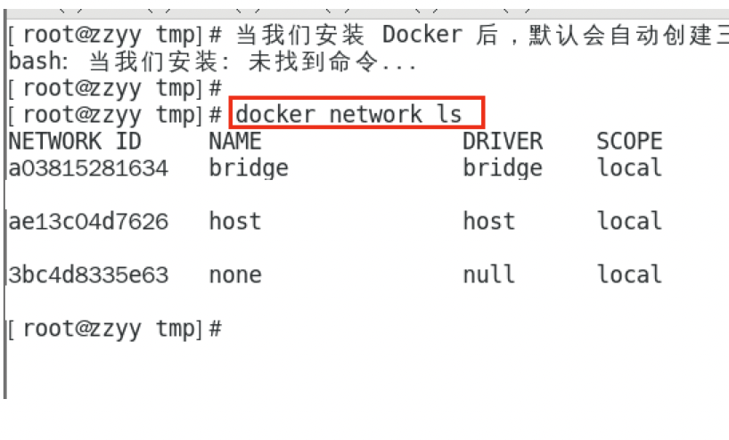

#### 4.2 常用基本命令

##### 4.2.1 **All 命令**

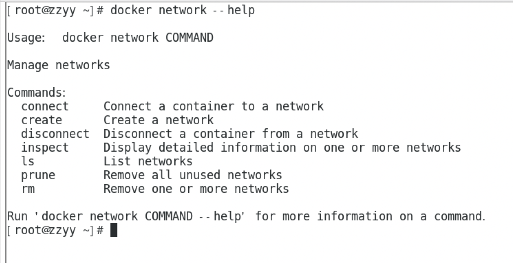

##### 4.2.2 **查看网络**

```shell
docker network ls
```

##### 4.2.3 查看网络源数据

```shell
docker network inspect  XXX网络名字
```

##### 4.2.4 删除网络

```shell
docker network rm XXX网络名字
```

##### 4.2.5 案例

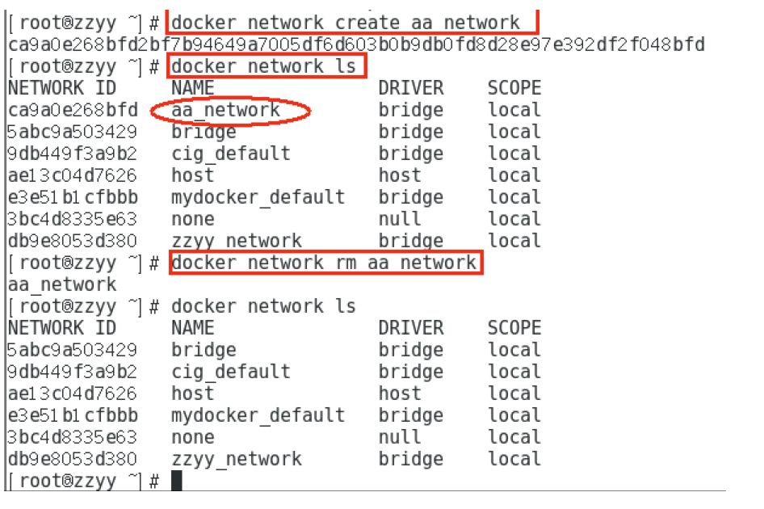

#### 4.3 能干嘛

```shell
容器间的互联和通信以及端口映射
容器IP变动时候可以通过服务名直接网络通信而不受到影响
```

#### 4.4 网络模式

##### 4.4.1 总体介绍

```shell
bridge模式：使用--network bridge指定，默认使用docker()

host模式：使用 --network host指定

none模式：使用 --network none指定

container模式：使用 --network container:Name或者容器ID指定
```

##### 4.4.2 容器实例内默认网络IP生产规则

>1 先启动两个ubuntu容器实例 
>
>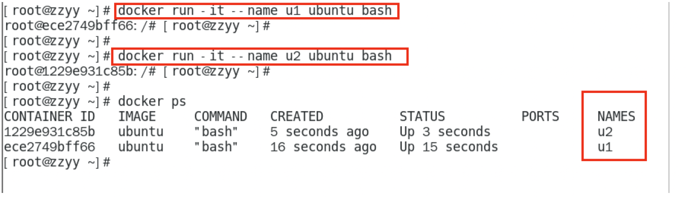
>
>2 docker inspect 容器ID or 容器名字 
>
>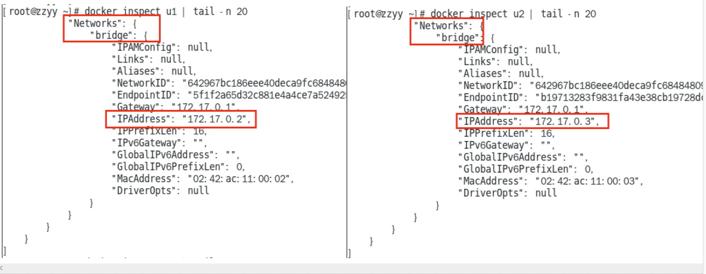
>
>3 关闭u2实例，新建u3，查看ip变化 
>
>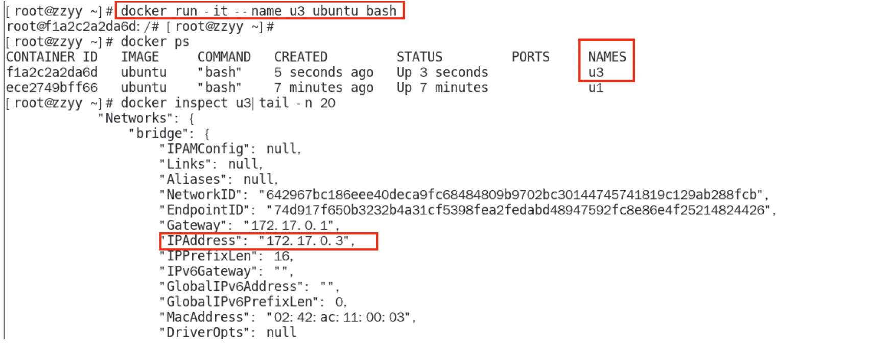

##### 4.4.3 案例说明

**bridge**

```shell
Docker 服务默认会创建一个 docker0 网桥（其上有一个 docker0 内部接口），该桥接网络的名称为docker0，它在 内核层 连通了其他的物理或虚拟网卡，这就将所有容器和本地主机都放到 同一个物理网络 。Docker 默认指定了 docker0 接口 的 IP 地址和子网掩码， 让主机和容器之间可以通过网桥相互通信。 
  
# 查看 bridge 网络的详细信息，并通过 grep 获取名称项 
docker network inspect bridge | grep name 

ifconfig 
```

**案例**

```shell
1 Docker使用Linux桥接，在宿主机虚拟一个Docker容器网桥(docker0)，Docker启动一个容器时会根据Docker网桥的网段分配给容器一个IP地址，称为Container-IP，同时Docker网桥是每个容器的默认网关。因为在同一宿主机内的容器都接入同一个网桥，这样容器之间就能够通过容器的Container-IP直接通信。 
 
2 docker run 的时候，没有指定network的话默认使用的网桥模式就是bridge，使用的就是docker0 。在宿主机ifconfig,就可以看到docker0和自己create的network(后面讲)eth0，eth1，eth2……代表网卡一，网卡二，网卡三…… ，lo代表127.0.0.1，即localhost ，inet addr用来表示网卡的IP地址 
 
3 网桥docker0创建一对对等虚拟设备接口一个叫veth，另一个叫eth0，成对匹配。 
   3.1 整个宿主机的网桥模式都是docker0，类似一个交换机有一堆接口，每个接口叫veth，在本地主机和容器内分别创建一个虚拟接口，并让他们彼此联通（这样一对接口叫veth pair）； 
   3.2 每个容器实例内部也有一块网卡，每个接口叫eth0； 
   3.3 docker0上面的每个veth匹配某个容器实例内部的eth0，两两配对，一一匹配。 
 通过上述，将宿主机上的所有容器都连接到这个内部网络上，两个容器在同一个网络下,会从这个网关下各自拿到分配的ip，此时两个容器的网络是互通的。 
```

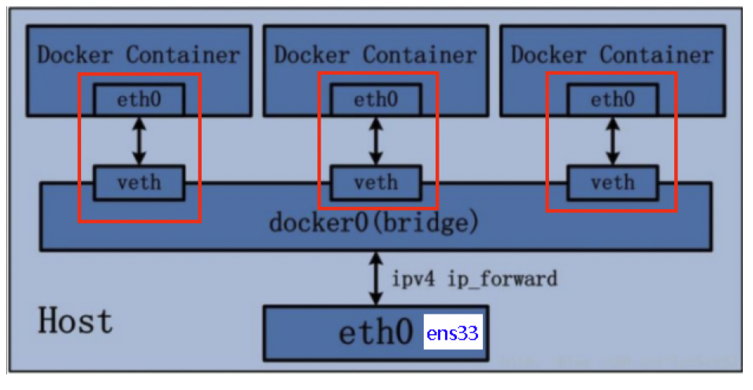

【代码】

```shell
docker run -d -p 8081:8080   --name tomcat81 billygoo/tomcat8-jdk8

docker run -d -p 8082:8080   --name tomcat82 billygoo/tomcat8-jdk8
```

**两两匹配验证**

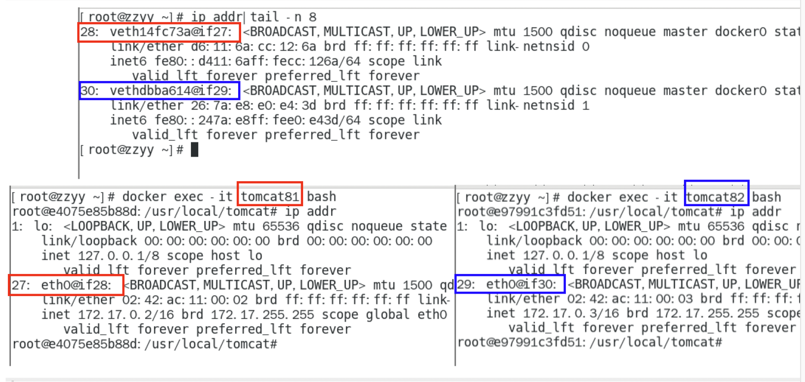

**Host**

>一、是什么
>
>直接使用宿主机的IP地址与外界进行通信，不再需要额外进行NAT转换。
>
>二、案例
>
>1. 说明
>
>   容器将 不会获得 一个独立的Network Namespace， 而是和宿主机共用一个Network Namespace。 容器将不会虚拟出自己的网卡而是使用宿主机的IP和端口。
>
>2. 代码
>
>   ```shell
>   警告：
>    docker run -d -p 8083:8080 --network host --name tomcat83 billygoo/tomcat8-jdk8
>    
>   正确：
>    docker run -d    --network host --name tomcat83 billygoo/tomcat8-jdk8
>   ```
>
>   
>
>3. 无之前的配对显示了，看容器实例内部
>
>   
>
>4. 没有设置-p的端口映射了，如何访问启动的tomcat83？
>
>   ```shell
>   http://宿主机IP:8080/ 
>     
>   在CentOS里面用默认的火狐浏览器访问容器内的tomcat83看到访问成功，因为此时容器的IP借用主机的， 
>   所以容器共享宿主机网络IP，这样的好处是外部主机与容器可以直接通信。
>   ```
>
>   

**none**

>一、是什么
>
>禁用网络功能，只有lo标识（就是127.0.0.1表示本地回环）
>
>二、案例
>
>docker run -d -p8084:8080 --network none --name tomcat84 billygoo/tomcat8-jdk8

**container**

>一、是什么
>
>container⽹络模式 
>
>新建的容器和已经存在的一个容器共享一个网络ip配置而不是和宿主机共享。新创建的容器不会创建自己的网卡，配置自己的IP，而是和一个指定的容器共享IP、端口范围等。同样，两个容器除了网络方面，其他的如文件系统、进程列表等还是隔离的。 
>
>二、❎案例
>
>```shell
>docker run -d -p 8085:8080                                     --name tomcat85 billygoo/tomcat8-jdk8
>
>docker run -d -p 8086:8080 --network container:tomcat85 --name tomcat86 billygoo/tomcat8-jdk8
>
>运行结果
>
> docker：Error response from daemon: conflicting optisons: port ...........
> 
># 相当于tomcat86和tomcat85公用同一个ip同一个端口，导致端口冲突 
>```
>
>三、✅案例2
>
>```shell
>Alpine操作系统是一个面向安全的轻型 Linux发行版
>
>docker run -it                  --name alpine1  alpine /bin/sh
>
>docker run -it --network container:alpine1 --name alpine2  alpine /bin/sh
>
>
>```
>
>运行结果，验证共用搭桥
>
>
>
>假如此时关闭alpine1，再看看alpine2
>
>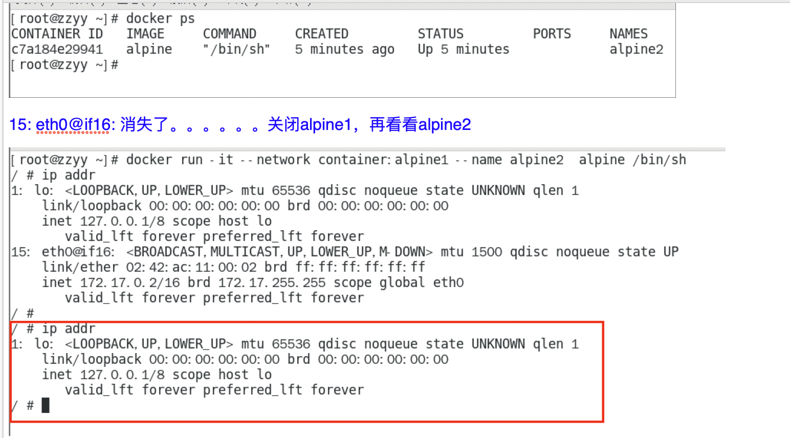

**自定义网络**

>一、过时的link
>
>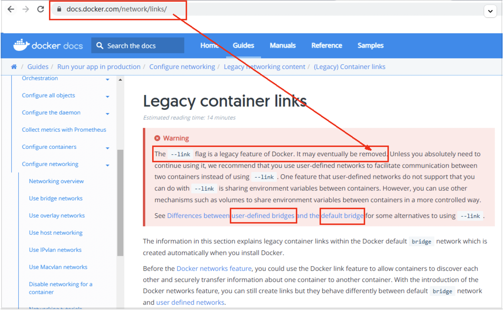
>
>二、是什么
>
>三、案例
>
>【before】
>
>```shell
>案例：
>docker run -d -p 8081:8080   --name tomcat81 billygoo/tomcat8-jdk8
>
>docker run -d -p 8082:8080   --name tomcat82 billygoo/tomcat8-jdk8
>
>上述成功启动并用docker exec进入各自容器实例内部
>```
>
>```shell
>问题：
>1. 按照IP地址ping是OK的
>2. 按照服务名ping结果???
>	ping： tocmat82：Name or service not known
>```
>
>【after】
>
>```
>案例
>自定义桥接网络,自定义网络默认使用的是桥接网络bridge
>
>新建自定义网络
>```
>
>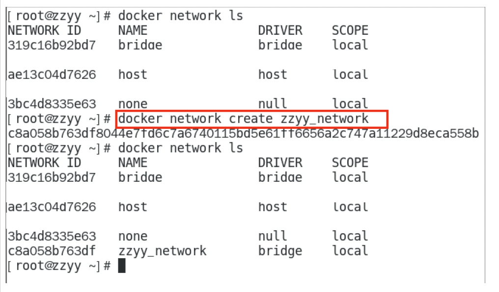
>
>新建容器加入上一步新建的自定义网络
>
>```shell
>docker run -d -p 8081:8080 --network zzyy_network  --name tomcat81 billygoo/tomcat8-jdk8
>
>docker run -d -p 8082:8080 --network zzyy_network  --name tomcat82 billygoo/tomcat8-jdk8
>
>```
>
>互相ping测试
>
>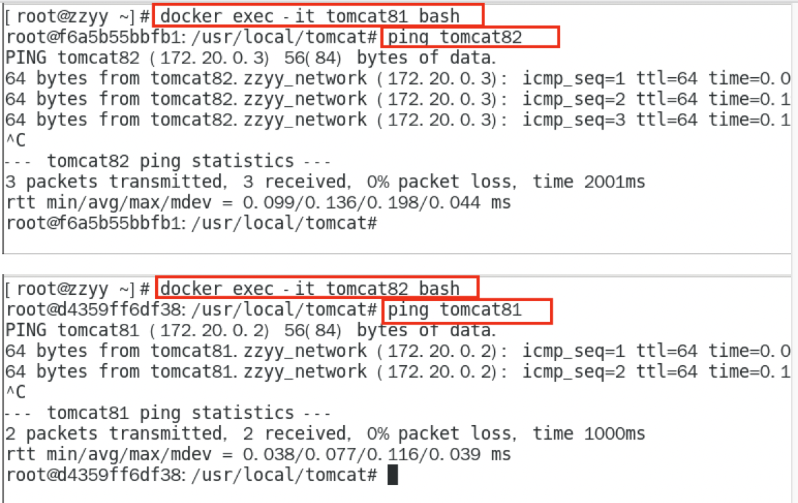
>
>问题结论
>
>```
>1、自定义网络本身就维护好了主机名和ip的对应关系（ip和域名都能通）
>2、自定义网络本身就维护好了主机名和ip的对应关系（ip和域名都能通）
>3、自定义网络本身就维护好了主机名和ip的对应关系（ip和域名都能通）
>```
>
>

#### 4.5 Docker平台架构图解

```shell
从其架构和运行流程来看，Docker 是一个 C/S 模式的架构，后端是一个松耦合架构，众多模块各司其职。  
  
Docker 运行的基本流程为： 
  
1 用户是使用 Docker Client 与 Docker Daemon 建立通信，并发送请求给后者。 
2 Docker Daemon 作为 Docker 架构中的主体部分，首先提供 Docker Server 的功能使其可以接受 Docker Client 的请求。 
3 Docker Engine 执行 Docker 内部的一系列工作，每一项工作都是以一个 Job 的形式的存在。 
4 Job 的运行过程中，当需要容器镜像时，则从 Docker Registry 中下载镜像，并通过镜像管理驱动 Graph driver将下载镜像以Graph的形式存储。 
5 当需要为 Docker 创建网络环境时，通过网络管理驱动 Network driver 创建并配置 Docker 容器网络环境。 
6 当需要限制 Docker 容器运行资源或执行用户指令等操作时，则通过 Execdriver 来完成。 
7 Libcontainer是一项独立的容器管理包，Network driver以及Exec driver都是通过Libcontainer来实现具体对容器进行的操作。
```

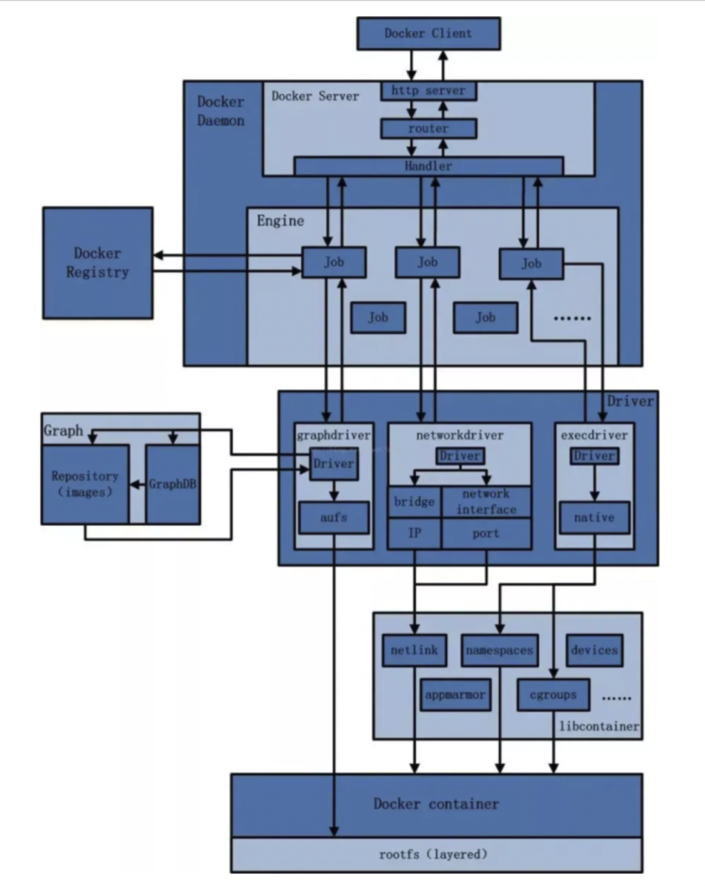

### 五、Docker-compose容器编排

#### 5.1 Docker-compose是什么

```shell
Docker-Compose是Docker官方的开源项目，负责实现对Docker容器集群的快速编排。
```

#### 5.2 能干什么

```properties
 docker建议我们每一个容器中只运行一个服务,因为docker容器本身占用资源极少,所以最好是将每个服务单独的分割开来但是这样我们又面临了一个问题？ 
 
如果我需要同时部署好多个服务,难道要每个服务单独写Dockerfile然后在构建镜像,构建容器,这样累都累死了,所以docker官方给我们提供了docker-compose多服务部署的工具 
  
例如要实现一个Web微服务项目，除了Web服务容器本身，往往还需要再加上后端的数据库mysql服务容器，redis服务器，注册中心eureka，甚至还包括负载均衡容器等等。。。。。。 
 
Compose允许用户通过一个单独的 docker-compose.yml模板文件 （YAML 格式）来定义 一组相关联的应用容器为一个项目（project）。 
  
可以很容易地用一个配置文件定义一个多容器的应用，然后使用一条指令安装这个应用的所有依赖，完成构建。Docker-Compose 解决了容器与容器之间如何管理编排的问题。
```

#### 5.3 去哪里

##### 5.3.1 官网：

https://docs.docker.com/compose/compose-file/compose-file-v3/

##### 5.3.2 官网下载

https://docs.docker.com/compose/install/

##### 5.3.3 安装步骤

```shell
curl -L "https://github.com/docker/compose/releases/download/1.29.2/docker-compose-$(uname -s)-$(uname -m)" -o /usr/local/bin/docker-compose 
chmod +x /usr/local/bin/docker-compose 
docker-compose --version 
```

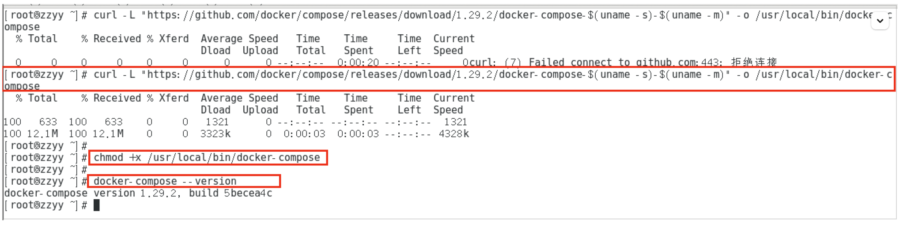

##### 5.3.4 卸载步骤

```shell
sudo rm /usr/local/bin/docker-compose
```

#### 5.4 Compose 核心概念

##### 5.4.1 一文件

```shell
docker-compose.yml
```

##### 5.4.2 两要素

```shell
服务(service):
一个个应用容器实例，比如订单微服务、库存微服务、mysql容器、nginx容器或者redis容器。

工程(project):
由一组关联的应用容器组成的一个完整业务单元，在 docker-compose.yml 文件中定义。
```

#### 5.5 Compose 使用的三个步骤

```
1. 编写Dockerfile定义各个微服务应用并构建出对应的镜像文件
2. 使用 docker-compose.yml 定义一个完整业务单元，安排好整体应用中的各个容器服务。
3. 最后，执行docker-compose up命令 来启动并运行整个应用程序，完成一键部署上线

```

#### 5.6 Compose常用命令

```shell
Compose 常用命令 
docker-compose -h                           #  查看帮助 
docker-compose up                           #  启动所有 docker-compose服务 
docker-compose up -d                        #  启动所有 docker-compose服务 并后台运行 
docker-compose down                         #  停止并删除容器、网络、卷、镜像。 
docker-compose exec  yml里面的服务id                 # 进入容器实例内部  docker-compose exec  docker-compose.yml文件中写的服务id  /bin/bash 
docker-compose ps                      # 展示当前docker-compose编排过的运行的所有容器 
docker-compose top                     # 展示当前docker-compose编排过的容器进程 
 
docker-compose logs  yml里面的服务id     #  查看容器输出日志 
docker-compose config     #  检查配置 
docker-compose config -q  #  检查配置，有问题才有输出 
docker-compose restart   #  重启服务 
docker-compose start     #  启动服务 
docker-compose stop      #  停止服务 
```

#### 5.5 Componse 编排微服务

##### 5.5.1 改造升级微服务工程docker_boot

**以前的基础版**

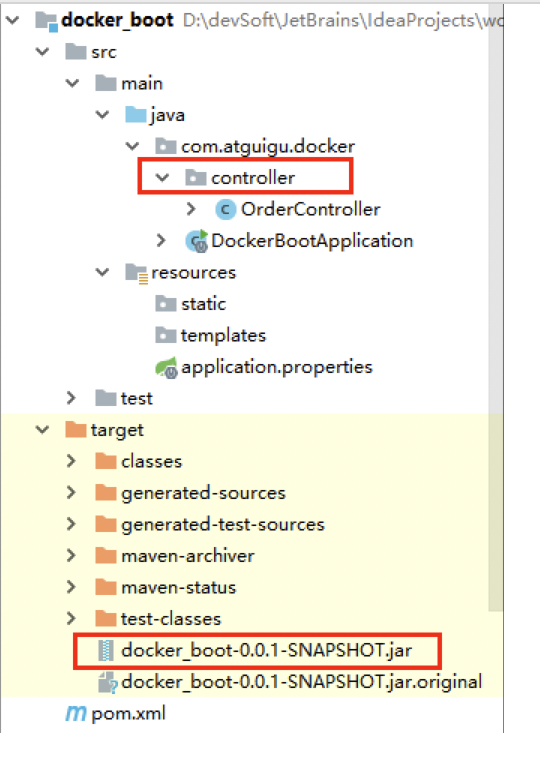

**SQL建表建库**

```mysql
CREATE TABLE `t_user` ( 
  `id` int(10) unsigned NOT NULL AUTO_INCREMENT, 
  `username` varchar(50) NOT NULL DEFAULT '' COMMENT '用户名', 
  `password` varchar(50) NOT NULL DEFAULT '' COMMENT '密码', 
  `sex` tinyint(4) NOT NULL DEFAULT '0' COMMENT '性别 0=女 1=男 ', 
  `deleted` tinyint(4) unsigned NOT NULL DEFAULT '0' COMMENT '删除标志，默认0不删除，1删除', 
  `update_time` timestamp NOT NULL DEFAULT CURRENT_TIMESTAMP ON UPDATE CURRENT_TIMESTAMP COMMENT '更新时间', 
  `create_time` timestamp NOT NULL DEFAULT CURRENT_TIMESTAMP COMMENT '创建时间', 
  PRIMARY KEY (`id`) 
) ENGINE=InnoDB AUTO_INCREMENT=1 DEFAULT CHARSET=utf8 COMMENT='用户表' 
```

**改POM**

```xml
<? xml version ="1.0" encoding ="UTF-8" ?>
<project xmlns ="http://maven.apache.org/POM/4.0.0" xmlns: xsi ="http://www.w3.org/2001/XMLSchema-instance"
      xsi :schemaLocation ="http://maven.apache.org/POM/4.0.0 https://maven.apache.org/xsd/maven-4.0.0.xsd"> 
   <modelVersion> 4.0.0 </modelVersion> 
   <parent> 
     <groupId> org.springframework.boot </groupId> 
     <artifactId> spring-boot-starter-parent </artifactId> 
     <version> 2.5.6 </version> 
     <!--<version>2.3.10.RELEASE</version>-->
     <relativePath/>  <!-- lookup parent from repository -->
   </parent> 

   <groupId> com.atguigu.docker </groupId> 
   <artifactId> docker_boot </artifactId> 
   <version> 0.0.1-SNAPSHOT </version> 

   <properties> 
     <project.build.sourceEncoding> UTF-8 </project.build.sourceEncoding> 
     <maven.compiler.source> 1.8 </maven.compiler.source> 
     <maven.compiler.target> 1.8 </maven.compiler.target> 
     <junit.version> 4.12 </junit.version> 
     <log4j.version> 1.2.17 </log4j.version> 
     <lombok.version> 1.16.18 </lombok.version> 
     <mysql.version> 5.1.47 </mysql.version> 
     <druid.version> 1.1.16 </druid.version> 
     <mapper.version> 4.1.5 </mapper.version> 
     <mybatis.spring.boot.version> 1.3.0 </mybatis.spring.boot.version> 
   </properties> 

   <dependencies> 
     <!--guava Google 开源的  Guava 中自带的布隆过滤器 -->
     <dependency> 
       <groupId> com.google.guava </groupId> 
       <artifactId> guava </artifactId> 
       <version> 23.0 </version> 
     </dependency> 
     <!-- redisson -->
    <dependency> 
       <groupId> org.redisson </groupId> 
       <artifactId> redisson </artifactId> 
       <version> 3.13.4 </version> 
     </dependency> 
     <!--SpringBoot 通用依赖模块 -->
     <dependency> 
       <groupId> org.springframework.boot </groupId> 
       <artifactId> spring-boot-starter-web </artifactId> 
     </dependency> 
     <dependency> 
       <groupId> org.springframework.boot </groupId> 
       <artifactId> spring-boot-starter-actuator </artifactId> 
     </dependency> 
     <!--swagger2-->
     <dependency> 
       <groupId> io.springfox </groupId> 
       <artifactId> springfox-swagger2 </artifactId> 
       <version> 2.9.2 </version> 
     </dependency> 
     <dependency> 
       <groupId> io.springfox </groupId> 
       <artifactId> springfox-swagger-ui </artifactId> 
       <version> 2.9.2 </version> 
     </dependency> 
     <!--SpringBoot 与 Redis 整合依赖 -->
     <dependency> 
       <groupId> org.springframework.boot </groupId> 
       <artifactId> spring-boot-starter-data-redis </artifactId> 
     </dependency> 
     <!--springCache-->
    <dependency> 
       <groupId> org.springframework.boot </groupId> 
       <artifactId> spring-boot-starter-cache </artifactId> 
     </dependency> 
     <!--springCache 连接池依赖包 -->
    <dependency> 
       <groupId> org.apache.commons </groupId> 
       <artifactId> commons-pool2 </artifactId> 
     </dependency> 
     <!-- jedis -->
     <dependency> 
       <groupId> redis.clients </groupId> 
       <artifactId> jedis </artifactId> 
       <version> 3.1.0 </version> 
     </dependency> 
     <!--Mysql 数据库驱动 -->
     <dependency> 
       <groupId> mysql </groupId> 
       <artifactId> mysql-connector-java </artifactId> 
       <version> 5.1.47 </version> 
     </dependency> 
     <!--SpringBoot 集成 druid 连接池 -->
     <dependency> 
       <groupId> com.alibaba </groupId> 
       <artifactId> druid-spring-boot-starter </artifactId> 
       <version> 1.1.10 </version> 
     </dependency> 
     <dependency> 
       <groupId> com.alibaba </groupId> 
       <artifactId> druid </artifactId> 
       <version> ${druid.version} </version> 
     </dependency> 
     <!--mybatis 和 springboot 整合 -->
     <dependency> 
       <groupId> org.mybatis.spring.boot </groupId> 
       <artifactId> mybatis-spring-boot-starter </artifactId> 
       <version> ${mybatis.spring.boot.version} </version> 
     </dependency> 
     <!-- 添加 springboot 对 amqp 的支持 -->
    <dependency> 
       <groupId> org.springframework.boot </groupId> 
       <artifactId> spring-boot-starter-amqp </artifactId> 
     </dependency> 
     <dependency> 
       <groupId> commons-codec </groupId> 
       <artifactId> commons-codec </artifactId> 
       <version> 1.10 </version> 
     </dependency> 
     <!-- 通用基础配置 junit/devtools/test/log4j/lombok/hutool-->
     <!--hutool-->
     <dependency> 
       <groupId> cn.hutool </groupId> 
       <artifactId> hutool-all </artifactId> 
       <version> 5.2.3 </version> 
     </dependency> 
     <dependency> 
       <groupId> junit </groupId> 
       <artifactId> junit </artifactId> 
       <version> ${junit.version} </version> 
     </dependency> 
     <dependency> 
       <groupId> org.springframework.boot </groupId> 
       <artifactId> spring-boot-devtools </artifactId> 
       <scope> runtime </scope> 
       <optional> true </optional> 
     </dependency> 
     <dependency> 
       <groupId> org.springframework.boot </groupId> 
       <artifactId> spring-boot-starter-test </artifactId> 
       <scope> test </scope> 
     </dependency> 
     <dependency> 
       <groupId> log4j </groupId> 
       <artifactId> log4j </artifactId> 
       <version> ${log4j.version} </version> 
     </dependency> 
     <dependency> 
       <groupId> org.projectlombok </groupId> 
       <artifactId> lombok </artifactId> 
       <version> ${lombok.version} </version> 
       <optional> true </optional> 
     </dependency> 
     <!--persistence-->
     <dependency> 
       <groupId> javax.persistence </groupId> 
       <artifactId> persistence-api </artifactId> 
       <version> 1.0.2 </version> 
     </dependency> 
     <!-- 通用 Mapper-->
     <dependency> 
       <groupId> tk.mybatis </groupId> 
       <artifactId> mapper </artifactId> 
       <version> ${mapper.version} </version> 
     </dependency> 
   </dependencies> 

   <build> 
     <plugins> 
       <plugin> 
         <groupId> org.springframework.boot </groupId> 
         <artifactId> spring-boot-maven-plugin </artifactId> 
       </plugin> 
       <plugin> 
         <groupId> org.apache.maven.plugins </groupId> 
         <artifactId> maven-resources-plugin </artifactId> 
         <version> 3.1.0 </version> 
       </plugin> 
     </plugins> 
   </build> 

 </project> 
```

**写YML**

```yaml
server.port = 6001
========================alibaba.druid* 相关配置 *=====================
spring.datasource.type = com.alibaba.druid.pool.DruidDataSource
spring.datasource.driver-class-name = com.mysql.jdbc.Driver
spring.datasource.url= jdbc:mysql://192.168.111.169 :3306/db2021?useUnicode=true&characterEncoding=utf-8&useSSL=false
spring.datasource.username = root

spring.datasource.password = 123456
spring.datasource.druid.test-while-idle = false

========================redis* 相关配置 *=====================

spring.redis.database = 0
spring.redis.host = 192.168.111.169
spring.redis.port = 6379
spring.redis.password =
spring.redis.lettuce.pool.max-active = 8
spring.redis.lettuce.pool.max-wait = -1ms
spring.redis.lettuce.pool.max-idle = 8
spring.redis.lettuce.pool.min-idle = 0

========================mybatis 相关配置 *===================*=

mybatis.mapper-locations = classpath:mapper/\*.xml
mybatis.type-aliases-package = com.atguigu.docker.entities

========================swagger=====================

spring.swagger2.enabled = true
```

**主启动**


**业务类**

>一、config配置类
>
>RedisConfig
>
>```java
>package  com.atguigu.docker.config;
>import  lombok.extern.slf4j. Slf4j ;
>import  org.springframework.context.annotation.Bean ;
>import  org.springframework.context.annotation.Configuration ;
>import  org.springframework.data.redis.connection.lettuce.LettuceConnectionFactory;
>import  org.springframework.data.redis.core.RedisTemplate;
>import  org.springframework.data.redis.serializer.GenericJackson2JsonRedisSerializer;
>import  org.springframework.data.redis.serializer.StringRedisSerializer;
>import  java.io.Serializable;
>	/**
>	*  @auther  zzyy
>	*  @create  2021-10-27 17:19
>	*/ 
>	@Configuration
>	@Slf4j
>	public class  RedisConfig{    
>	/**
>	* @param  lettuceConnectionFactory     
>	* @return    
>	* redis 序列化的工具配置类，下面这个请一定开启配置     
>	* 127.0.0.1:6379> keys *    
>	* 1) "ord:102"   序列化过     
>	* 2) "\xac\xed\x00\x05t\x00\aord:102"    野生，没有序列化过     
>	*/    
>@Bean    
>public  RedisTemplate<String,Serializable> redisTemplate(LettuceConnectionFactory lettuceConnectionFactory)   {       
>	RedisTemplate<String,Serializable> redisTemplate =  new  RedisTemplate<>();
>	redisTemplate.setConnectionFactory(lettuceConnectionFactory);        
>	// 设置 key 序列化方式 string        
>	redisTemplate.setKeySerializer( new  StringRedisSerializer());        
>	// 设置 value 的序列化方式 json        
>	redisTemplate.setValueSerializer(new GenericJackson2JsonRedisSerializer());
>	redisTemplate.setHashKeySerializer(new StringRedisSerializer());
>  redisTemplate.setHashValueSerializer( new GenericJackson2JsonRedisSerializer());
>  redisTemplate.afterPropertiesSet();
>  return  redisTemplate;   
>    }
>  }
>
>```

**SwaggerConfig**

```java
package com.atguigu.docker.config;
 
 import org.springframework.beans.factory.annotation. Value ;
 import org.springframework.context.annotation. Bean ;
 import org.springframework.context.annotation. Configuration ;
 import springfox.documentation.builders.ApiInfoBuilder;
 import springfox.documentation.builders.PathSelectors;
 import springfox.documentation.builders.RequestHandlerSelectors;
 import springfox.documentation.service.ApiInfo;
 import springfox.documentation.spi.DocumentationType;
 import springfox.documentation.spring.web.plugins.Docket;
 import springfox.documentation.swagger2.annotations. EnableSwagger2 ;
 
 import java.text.SimpleDateFormat;
 import java.util.Date;
 
 /**
  *@auther zzyy
  *@create 2021-05-01 16:18
  */
 @Configuration
 @EnableSwagger2
 public class SwaggerConfig
 {
   @Value ( "${spring.swagger2.enabled}" )
   private Boolean enabled ;
 
   @Bean
   public Docket createRestApi() {
     return new Docket(DocumentationType. *SWAGGER_2\* )
         .apiInfo(apiInfo())
         .enable( enabled )
         .select()
         .apis(RequestHandlerSelectors. *basePackage* ( "com.atguigu.docker" )) *//* 你自己的 *package
         .paths(PathSelectors. *any* ())
         .build();
   }
 
   public ApiInfo apiInfo() {
     return new ApiInfoBuilder()
         .title( " 尚硅谷 Java 大厂技术 " + " \t " + new SimpleDateFormat( "yyyy-MM-dd" ).format( new Date()))
         .description( "docker-compose" )
         .version( "1.0" )
         .termsOfServiceUrl( "https://www.atguigu.com/" )
         .build();
   }
 }
```

**新建entity** **User**

```java
package com.atguigu.docker.entities;
 
 import javax.persistence. Column ;
 import javax.persistence. GeneratedValue ;
 import javax.persistence. Id ;
 import javax.persistence. Table ;
 import java.util.Date;
 
 @Table (name = "t_user" )
 public class User
 {
   @Id
   @GeneratedValue (generator = "JDBC" )
   private Integer id ;

	 private String username ;
   private String password ;
 	 private Byte sex ;
   private Byte deleted ;
   @Column (name = "update_time" )
   private Date updateTime ;
   @Column (name = "create_time" )
   private Date createTime ;
   public Integer getId() {
     return id ;
   }
   public void setId(Integer id) {
     this . id = id;
   }

   public String getUsername() {
     return username ;
   }

	 public void setUsername(String username) {
     this . username = username;
   }
	 public String getPassword() {
     return password ;
   }
   public void setPassword(String password) {
     this . password = password;
   }
   public Byte getSex() {
     return sex ;
   }
	 public void setSex(Byte sex) {
     this . sex = sex;
   }
   public Byte getDeleted() {
     return deleted ;
   }
   public void setDeleted(Byte deleted) {
     this . deleted = deleted;
   }
   public Date getUpdateTime() {
     return updateTime ;
   }
   public void setUpdateTime(Date updateTime) {
     this . updateTime = updateTime;
   }
   public Date getCreateTime() {
     return createTime ;
   }
   public void setCreateTime(Date createTime) {
     this . createTime = createTime;
   }
 } 
```

**UserDTO**

```java
package  com.atguigu.docker.entities;
import  io.swagger.annotations. ApiModel ;
import  io.swagger.annotations. ApiModelProperty ;
import  lombok. AllArgsConstructor ;
import  lombok. Data ;
import  lombok. NoArgsConstructor ;
import  java.io.Serializable;
import  java.util.Date;
@NoArgsConstructor
@AllArgsConstructor
@Data
@ApiModel (value =  " 用户信息 " )
public class  UserDTO  implements  Serializable{     

	@ApiModelProperty (value =  " 用户 ID" )     
	private  Integer  id ;     
	@ApiModelProperty (value =  " 用户名 " )     
	private  String  username ;     
	@ApiModelProperty (value =  " 密码 " )     
	private  String  password ;     
	@ApiModelProperty (value =  " 性别  0= 女  1= 男  " )     
	private  Byte  sex ;     
	@ApiModelProperty (value =  " 删除标志，默认 0 不删除， 1 删除 " )     
	private  Byte  deleted ;     
	@ApiModelProperty (value =  " 更新时间 " )     
	private  Date  updateTime ;     
	@ApiModelProperty (value =  " 创建时间 " )     
	private  Date  createTime ;     
	/**
	*  @return  id
	*/     
	public  Integer getId() {         

		return  id ;    
	}     
	/**
	*  @param  id 
	*/     
	public void  setId(Integer id) { 
		this . id  = id;   
		 }     

	/**
	*  获取用户名
	* 
	*  @return  username -  用户名
	*/     
	public  String getUsername() {
		return  username ;    
		}    

	 /**
	 *  设置用户名
	 *
	 *  @param  username  用户名
	 */     
	 public void  setUsername(String username) {
	 	this.username = username;
	 }     

	 /**
	 *  获取密码
	 *
	 *  @return  password -  密码
	 */     
	 public  String getPassword() {
	 	return  password ;
	 }     

	 /**
	 *  设置密码
	 *
	 *  @param  password  密码
	 */     
	 public void  setPassword(String password) {
	 	this.password=password;
	 }     

	 /**
	 *获取性别  0= 女  1= 男
	 *
	 *  @return  sex -  性别  0= 女  1= 男
	 */     
	 public  Byte getSex() {
	 	return  sex ;    
	 	}     

	 /**
	 *  设置性别  0= 女  1= 男       
	 *
	 *  @param  sex  性别  0= 女  1= 男       
	 */    
	  public void  setSex(Byte sex) {
	  this.sex = sex;
	  }     

	  /**
	  *  获取删除标志，默认 0 不删除， 1 删除      
	  *     
	  *  @return  deleted -  删除标志，默认 0 不删除， 1 删除      
	  */    
	   public  Byte getDeleted() {
	   	return  deleted ;
	   }     

	   /**
	   *  设置删除标志，默认 0 不删除， 1 删除      
	   *
	   *  @param  deleted  删除标志，默认 0 不删除， 1 删除      
	   */    
	    public void  setDeleted(Byte deleted) {
	    	this.deleted = deleted;    
	    	}     

	    /**
	    *  获取更新时间
	    *
	    *  @return  update_time -  更新时间
	    */     
	    public  Date getUpdateTime() {
	    	return  updateTime ; 
	    	}     

	    /**
	    *  设置更新时间 
      *
      *  @param  updateTime  更新时间     
      */     
	    public void  setUpdateTime(Date updateTime) {
	    	this . updateTime  = updateTime;
	    	}     

	    /** 
      *  获取创建时间     
      *   
      *  @return  create_time -  创建时间   
      */     
	    public  Date getCreateTime() {         
	    	return  createTime ;  
        }     

	    /**
	    *  设置创建时间 
	    *
	    *  @param  createTime  创建时间 
	    */     
	    public void  setCreateTime(Date createTime) {         
	    	this . createTime  = createTime;    
	    	}     

	    @Override 
	    public  String toString() {         \
	    	return  "User{"  +                 "id="  +  id  +                 ", 
	    	username='"  +  username  +  ' \' '  +                 ", 
	    	password='"  +  password  +  ' \' '  +                 ", 
	    	sex="  +  sex  + '}' ;    
	    }} 
```

**新建mapper**

```java
新建接口UserMapper
src\main\resource路径下新建mapper文件夹并新增UserMapper.xml

package  com.atguigu.docker.mapper;
import  com.atguigu.docker.entities.User;
import  tk.mybatis.mapper.common.Mapper;
public interface  UserMapper  extends  Mapper<User> {
} 
```

**UserMapper.xml**

```xml
 <? xml version ="1.0"  encoding ="UTF-8" ?>  

<!DOCTYPE   mapper   PUBLIC   "-//mybatis.org//DTD Mapper 3.0//EN"   "http://mybatis.org/dtd/mybatis-3-mapper.dtd"> 
<mapper  namespace ="com.atguigu.docker.mapper.UserMapper">     
  <resultMap  id ="BaseResultMap"  type ="com.atguigu.docker.entities.User">        
    <!--        WARNING - @mbg.generated      -->       
    <id  column ="id"  jdbcType ="INTEGER"  property ="id" />        
    <result  column ="username"  jdbcType ="VARCHAR"  property ="username" />       
    <result  column ="password"  jdbcType ="VARCHAR"  property ="password" />       
    <result  column ="sex"  jdbcType ="TINYINT"  property ="sex" />       
    <result  column ="deleted"  jdbcType ="TINYINT"  property ="deleted" />       
    <result  column ="update_time"  jdbcType ="TIMESTAMP"  property ="updateTime" />       
    <result  column ="create_time"  jdbcType ="TIMESTAMP"  property ="createTime" />     
  </resultMap>  
</mapper> 
```

**新建Service**

```
```

**新建Controller**

```
```


mvn package命令将微服务形成新的jar包

并上传到Linux服务器/mydocker目录下

**编写Dockerfile**

```shell
# 基础镜像使用java 
FROM java:8 
# 作者 
MAINTAINER zzyy 
# VOLUME 指定临时文件目录为/tmp，在主机/var/lib/docker目录下创建了一个临时文件并链接到容器的/tmp 
VOLUME /tmp 
# 将jar包添加到容器中并更名为zzyy_docker.jar 
ADD docker_boot-0.0.1-SNAPSHOT.jar zzyy_docker.jar 
# 运行jar包 
RUN bash -c 'touch /zzyy_docker.jar' 
ENTRYPOINT ["java","-jar","/zzyy_docker.jar"] 
#暴露6001端口作为微服务 
EXPOSE 6001 
```

**构建镜像**

```shell
docker build -t zzyy_docker:1.6 .
```

**5.5.2 不用Compose**

```shell
一、单独的mysql容器实例
1. 新建mysql容器实例
docker run -p 3306:3306 --name mysql57 --privileged=true -v /zzyyuse/mysql/conf:/etc/mysql/conf.d -v /zzyyuse/mysql/logs:/logs -v /zzyyuse/mysql/data:/var/lib/mysql -e MYSQL_ROOT_PASSWORD=123456 -d mysql:5.7

2. 进入mysql容器实例并新建库db2021+新建表t_user
docker exec -it mysql57 /bin/bash 
mysql -uroot -p 
create database db2021; 
use db2021; 
CREATE TABLE `t_user` (
  `id` INT(10) UNSIGNED NOT NULL AUTO_INCREMENT, 
  `username` VARCHAR(50) NOT NULL DEFAULT '' COMMENT '用户名', 
  `password` VARCHAR(50) NOT NULL DEFAULT '' COMMENT '密码', 
  `sex` TINYINT(4) NOT NULL DEFAULT '0' COMMENT '性别 0=女 1=男 ', 
  `deleted` TINYINT(4) UNSIGNED NOT NULL DEFAULT '0' COMMENT '删除标志，默认0不删除，1删除', 
  `update_time` TIMESTAMP NOT NULL DEFAULT CURRENT_TIMESTAMP ON UPDATE CURRENT_TIMESTAMP COMMENT '更新时间', 
  `create_time` TIMESTAMP NOT NULL DEFAULT CURRENT_TIMESTAMP COMMENT '创建时间', 
  PRIMARY KEY (`id`) 
) ENGINE=INNODB AUTO_INCREMENT=1 DEFAULT CHARSET=utf8mb4 COMMENT='用户表'; 

```

**单独的redis容器实例**

```shell
docker run  -p 6379:6379 --name redis608 --privileged=true -v /app/redis/redis.conf:/etc/redis/redis.conf -v /app/redis/data:/data -d redis:6.0.8 redis-server /etc/redis/redis.conf 
```

**微服务工程**

```shell
docker run -d -p 6001:6001 zzyy_docker:1.6 
```

**上面三个容器实例依次顺序启动成功**

```shell
docker ps
```

**5.5.3 swagger 测试**

```shell
http://localhost:你的微服务端口号/swagger-ui.html#/
```

##### 5.5.4 上面存在什么问题？

```shell
先后顺序要求固定，先mysql+redis才能微服务访问成功

多个run命令......

容器间的启停或宕机，有可能导致IP地址对应的容器实例变化，映射出错，

要么生产IP写死(可以但是不推荐)，要么通过服务调用
```

##### 5.5.5 使用Compose

```
1. 服务编排，一套带走，安排

2. 编写docker-componse.yml文件
```

```yaml
version: "3" 
  
services: 
  microService: 
    image: zzyy_docker:1.6 
    container_name: ms01 
    ports: 
      - "6001:6001" 
    volumes: 
      - /app/microService:/data 
    networks:  
      - atguigu_net  
    depends_on:  
      - redis 
      - mysql 
  
  redis: 
    image: redis:6.0.8 
    ports: 
      - "6379:6379" 
    volumes: 
      - /app/redis/redis.conf:/etc/redis/redis.conf 
      - /app/redis/data:/data 
    networks:  
      - atguigu_net 
    command: redis-server /etc/redis/redis.conf 
  
  mysql: 
    image: mysql:5.7 
    environment: 
      MYSQL_ROOT_PASSWORD: '123456' 
      MYSQL_ALLOW_EMPTY_PASSWORD: 'no' 
      MYSQL_DATABASE: 'db2021' 
      MYSQL_USER: 'zzyy' 
      MYSQL_PASSWORD: 'zzyy123' 
    ports: 
       - "3306:3306" 
    volumes: 
       - /app/mysql/db:/var/lib/mysql 
       - /app/mysql/conf/my.cnf:/etc/my.cnf 
       - /app/mysql/init:/docker-entrypoint-initdb.d 
    networks: 
      - atguigu_net 
    command: --default-authentication-plugin=mysql_native_password #解决外部无法访问 
  
networks:  
   atguigu_net:  
 

```

```shell
3. 第二次修改微服务工程docker_boot
写YML 通过服务名访问，IP无关
```

```properties
server.port = 6001
# ========================alibaba.druid 相关配置 =====================
spring.datasource.type = com.alibaba.druid.pool.DruidDataSource
spring.datasource.driver-class-name=com.mysql.jdbc.Driver
#spring.datasource.url=jdbc:mysql://192.168.111.169:3306/db2021?useUnicode=true&characterEncoding=utf-8&useSSL=false
spring.datasource.url = jdbc:mysql://mysql:3306/db2021?useUnicode=true&characterEncoding=utf-8&useSSL=false spring.datasource.username = rootspring.datasource.password = 123456spring.datasource.druid.test-while-idle = false
# ========================redis 相关配置 =====================
spring.redis.database = 0
#spring.redis.host=192.168.111.169
spring.redis.host = redis 
spring.redis.port = 6379
spring.redis.password =
spring.redis.lettuce.pool.max-active = 8
spring.redis.lettuce.pool.max-wait = -1ms
spring.redis.lettuce.pool.max-idle = 8
spring.redis.lettuce.pool.min-idle = 0
# ========================mybatis 相关配置 ===================
mybatis.mapper-locations = classpath:mapper/*.xml
mybatis.type-aliases-package = com.atguigu.docker.entities
# ========================swagger=====================
spring.swagger2.enabled = true 

```

```shell

mvn package命令将微服务形成新的jar包
并上传到Linux服务器/mydocker目录下

编写Dockerfile
# 基础镜像使用java 
FROM java:8 
# 作者 
MAINTAINER zzyy 
# VOLUME 指定临时文件目录为/tmp，在主机/var/lib/docker目录下创建了一个临时文件并链接到容器的/tmp 
VOLUME /tmp 
# 将jar包添加到容器中并更名为zzyy_docker.jar 
ADD docker_boot-0.0.1-SNAPSHOT.jar zzyy_docker.jar 
# 运行jar包 
RUN bash -c 'touch /zzyy_docker.jar' 
ENTRYPOINT ["java","-jar","/zzyy_docker.jar"] 
#暴露6001端口作为微服务 
EXPOSE 6001 


构建镜像
docker build -t zzyy_docker:1.6 .
```

```shell
4. 执行 docker-compose up 或者 执行 docker-compose up -d

# 若不使用默认的docker-compose.yml 文件名：
$ docker-compose -f server.yml up -d 
```

```shell
5. 进入mysql容器实例并新建库db2021+新建表t_user
docker exec -it 容器实例id /bin/bash 
mysql -uroot -p 
create database db2021; 
use db2021; 
CREATE TABLE `t_user` (
  `id` INT(10) UNSIGNED NOT NULL AUTO_INCREMENT, 
  `username` VARCHAR(50) NOT NULL DEFAULT '' COMMENT '用户名', 
  `password` VARCHAR(50) NOT NULL DEFAULT '' COMMENT '密码', 
  `sex` TINYINT(4) NOT NULL DEFAULT '0' COMMENT '性别 0=女 1=男 ', 
  `deleted` TINYINT(4) UNSIGNED NOT NULL DEFAULT '0' COMMENT '删除标志，默认0不删除，1删除', 
  `update_time` TIMESTAMP NOT NULL DEFAULT CURRENT_TIMESTAMP ON UPDATE CURRENT_TIMESTAMP COMMENT '更新时间', 
  `create_time` TIMESTAMP NOT NULL DEFAULT CURRENT_TIMESTAMP COMMENT '创建时间', 
  PRIMARY KEY (`id`) 
) ENGINE=INNODB AUTO_INCREMENT=1 DEFAULT CHARSET=utf8mb4 COMMENT='用户表'; 

```

```shell
6. 测试通过
7. Compose常用命令
Compose 常用命令 
docker-compose -h                           #  查看帮助 
docker-compose up                           #  启动所有 docker-compose服务 
docker-compose up -d                        #  启动所有 docker-compose服务 并后台运行 
docker-compose down                         #  停止并删除容器、网络、卷、镜像。 
docker-compose exec  yml里面的服务id                 # 进入容器实例内部  docker-compose exec  docker-compose.yml文件中写的服务id  /bin/bash 
docker-compose ps                      # 展示当前docker-compose编排过的运行的所有容器 
docker-compose top                     # 展示当前docker-compose编排过的容器进程 
 
docker-compose logs  yml里面的服务id     #  查看容器输出日志 
dokcer-compose config     #  检查配置 
dokcer-compose config -q  #  检查配置，有问题才有输出 
docker-compose restart   #  重启服务 
docker-compose start     #  启动服务 
docker-compose stop      #  停止服务 
```

```shell
8. 关停
docker -compose stop
```

### 六、Docker轻量级可视化工具Portainer

#### 6.1 是什么

```shell
Portainer 是一款轻量级的应用，它提供了图形化界面，用于方便地管理Docker环境，包括单机环境和集群环境。 
```

#### 6.2 安装

>一、官网
>
>https://www.portainer.io/
>
>https://docs.portainer.io/v/ce-2.9/start/install/server/docker/linux
>
>二、步骤
>
>1. docker命令安装
>
>```shell
>docker run -d -p 8000:8000 -p 9000:9000 --name portainer     --restart=always     -v /var/run/docker.sock:/var/run/docker.sock     -v portainer_data:/data     portainer/portainer 
>```
>
>2. 第一次登录需创建admin，访问地址：xxx.xxx.xxx.xxx:9000
>
>```shell
>用户名，直接用默认admin 
>密码记得8位，随便你写 
>```
>
>3. 设置admin用户和密码后首次登陆
>4. 选择local选项卡后本地docker详细信息展示
>5. 上一步的图形展示，能想得起对应命令吗？
>6. 登陆并演示介绍常用操作case

### 七、Docker容器监控之CAdvisor+InfluxDB+Granfana

#### 7.1 原生命令

```shell
docker stats命令的结果 

问题
通过docker stats命令可以很方便的看到当前宿主机上所有容器的CPU,内存以及网络流量等数据， 一般小公司够用了。。。。 
但是
docker stats统计结果只能是当前宿主机的全部容器，数据资料是实时的，没有地方存储、没有健康指标过线预警等功能 
```

#### 7.2 是什么

>容器监控3剑客
>
>一句话
>
>```shell
>CAdvisor监控收集+InfluxDB存储数据+Granfana展示图表
>```
>
>**CAdvisor**
>
>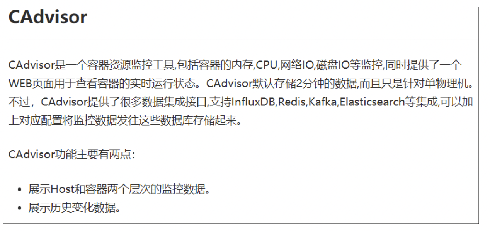
>
>**InfluxDB**
>
>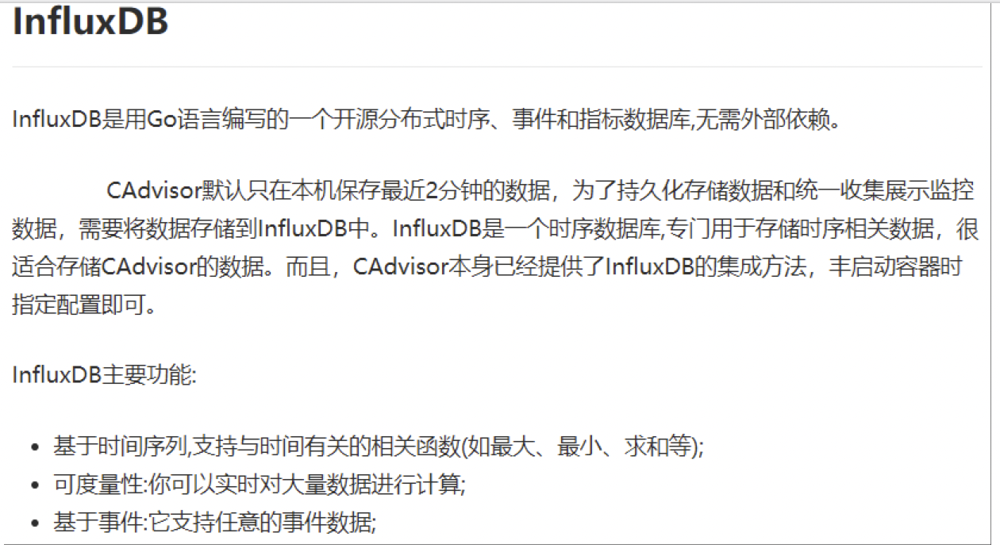
>
>Granfana
>
>

#### 7.3 compose容器编排，一套带走

>一、新建目录
>
>二、新建3件套组合的 docker-compose.yml
>
>```yaml
>version: '3.1' 
>  
>volumes: 
>  grafana_data: {} 
>  
>services: 
> influxdb: 
>  image: tutum/influxdb:0.9 
>  restart: always 
>  environment: 
>    - PRE_CREATE_DB=cadvisor 
>  ports: 
>    - "8083:8083" 
>    - "8086:8086" 
>  volumes: 
>    - ./data/influxdb:/data 
>  
> cadvisor: 
>  image: google/cadvisor 
>  links: 
>    - influxdb:influxsrv 
>  command: -storage_driver=influxdb -storage_driver_db=cadvisor -storage_driver_host=influxsrv:8086 
>  restart: always 
>  ports: 
>    - "8080:8080" 
>  volumes: 
>    - /:/rootfs:ro 
>    - /var/run:/var/run:rw 
>    - /sys:/sys:ro 
>    - /var/lib/docker/:/var/lib/docker:ro 
>  
> grafana: 
>  user: "104" 
>  image: grafana/grafana 
>  user: "104" 
>  restart: always 
>  links: 
>    - influxdb:influxsrv 
>  ports: 
>    - "3000:3000" 
>  volumes: 
>    - grafana_data:/var/lib/grafana 
>  environment: 
>    - HTTP_USER=admin 
>    - HTTP_PASS=admin 
>    - INFLUXDB_HOST=influxsrv 
>    - INFLUXDB_PORT=8086 
>    - INFLUXDB_NAME=cadvisor 
>    - INFLUXDB_USER=root 
>    - INFLUXDB_PASS=root 
>
>```
>
>三、启动docker-compose文件
>
>```shell
>docker-compose up
>```
>
>四、查看三个服务容器是否启动
>
>```shell
>docker ps
>```
>
>五、测试
>
>```properties
>1. 浏览cAdvisor收集服务，http://ip:8080/
>
>第一次访问慢，请稍等
>
>cadvisor也有基础的图形展现功能，这里主要用它来作数据采集
>2. 浏览influxdb存储服务，http://ip:8083/
>
>```
>
>```
>3. 浏览grafana展现服务，http://ip:3000
>	ip+3000端口的方式访问,默认帐户密码（admin/admin）
>	https://gitee.com/yooome/golang/tree/main/Docker详细教程
>	配置步骤
>	[1] 配置数据源
>	[2] 选择influxdb数据源
>	[3] 配置细节
>	[4] 配置面板panel
>	[5] 到这里cAdvisor+InfluxDB+Grafana容器监控系统就部署完成了
>```
>
>

