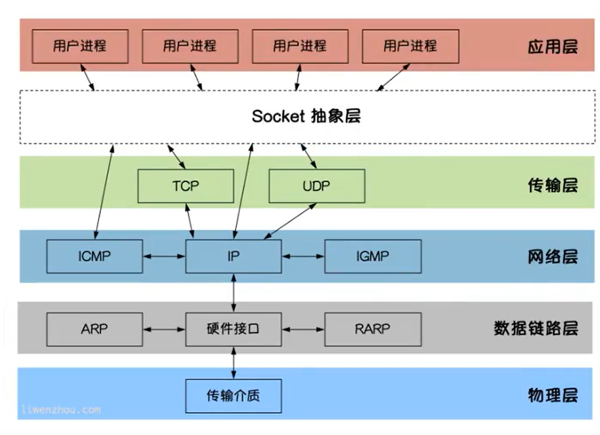

# HTTP请求

## 本次内容

- context
- 单元测试（给函数做单元测试）
- pprof调试工具（go语言内置工具）
  - 可以看到代码的cpu和运行时的一些信息
  - 能看到一些图表信息，如内存占用、cpu占用等

## 内容回顾

https://www.liwenzhou.com/posts/Go/14_concurrence/

### 锁

sync.Mutex，底层是一个结构体，是值类型。给参数传递参数的时候，要传指针

两个方法

```go
var lock sync.Mutex
lock.lock() // 加锁
lock.unlock() //解锁
```

为什么要上锁？？

防止多个goroutine同一时刻操作同一个资源。

### 读写互斥锁

应用场景：适用于读多写少的场景下，也就是支持并发读，单个写

特点

- 读的goroutine来了获取的是读锁，后续的goroutine能读不能写
- 写的goroutine来了获取的是写锁，后续的goroutine不管是读还是写都要等待获取获取锁

使用

```go
var rwLock sync.RWMutex
rwLock.RLock() // 获取读锁
rwLock.Runlock() // 释放锁

rwLock.Lock() // 获取写锁
rwLock.unlock() // 释放写锁
```

### 等待组

`sync.waitgroup`，用来等goroutine执行完在继续，是一个结构体，值类型，给函数传参数的时候要传指针

```go
var wg sync.WaitGroup

wg.add(1) // 起几个goroutine就加几个数
wg.Done() // 在goroutine对应的函数中，函数要结束的时候调用，表示goroutine完成，计数器减1
wg.Wait() // 阻塞，等待所有的goroutine都结束
```

### Sync.Once

某些函数只需要执行 一次的时候，就可以使用 `sync.Once` 

比如blog加载图片那个例子

```go
var once sync.Once
once.Do() //接收一个没有参数也乜有返回值的函数，如有需要可以使用闭包
```

### sync.Map

使用场景：并发操作一个map的时候，内置的map不是并发安全的

而sync.map是一个开箱即用（不需要make初始化）的并发安全的map

```go
var syncMap sync.Map
syncMap[key] = value  //原生map
syncMap.Store(key, value) // 存储
syncMap.LoadOrStore() // 获取
syncMap.Delete()
syncMap.Range()
```

### 原子操作

Go语言内置了一些针对内置的基本数据类型的一些并发安全的操作

```go
var i int64 = 10
atomic.AddInt64(&i, 1)
```

### 网络编程

互联网的协议

OSI七层模型：应用层、表示层、会话层、传输层、网络层、数据链路层、物理层

TCP/IP协议：应用层、传输层、网络层、数据链路层、物理层



## Http服务端

Go语言内置的`net/http` 包提供了HTTP客户端和服务端的实现

### HTTP协议

超文本传输协议（HTTP，Hyper Text Transfer Protocol）是互联网上应用最为广泛的一种网络传输协议，所有的wWW文件都必须遵守这个标准。设计HTTP最初的目的是为了提供一种发布和接收HTML页面的方法。

### HTTP客户端

使用`net/http`包编写一个简单的发送HTTP请求的Client端，代码如下：

```go
package main

import "net/http"

func f1(w http.ResponseWriter, r *http.Request) {
	str := "hello 沙河！"
	w.Write([]byte(str))
}

func main() {
	http.HandleFunc("/posts/Go/15_socket/", f1)
	http.ListenAndServe("127.0.0.1:9090", nil)
}
```

我们制作了一个最简单的api接口，最后返回的是我们的hello 沙河！


我们也可以通过读取文件中的内容，然后进行显示

```go
func f1(w http.ResponseWriter, r *http.Request) {
	index, err := ioutil.ReadFile("./index.html")
	if err != nil {
		w.Write([]byte(fmt.Sprintf("%v", err)))
	}
	w.Write([]byte(index))
}

func main() {
	http.HandleFunc("/index", f1)
	http.HandleFunc("/home", f1)
	http.HandleFunc("/about", f1)
	http.ListenAndServe("127.0.0.1:9090", nil)
}
```

### 自定义Server

要管理服务端的行为，可以创建一个自定义的Server：

```go
s := &http.Server{
	Addr:           ":8080",
	Handler:        myHandler,
	ReadTimeout:    10 * time.Second,
	WriteTimeout:   10 * time.Second,
	MaxHeaderBytes: 1 << 20,
}
log.Fatal(s.ListenAndServe())
```

### 网站运行运行流程


- HTTP：超文本传输协议，规定了浏览器和网站服务器之间通信的规则
  - 规定了浏览器和网站服务器之间通信的规则

- HTML：超文本标记语言，学的就是标记的符号，标签
- CSS：层叠样式表，规定了HTML中标签的具体样式（颜色/背景/大小/位置/浮动...）
- JavaScript：一种跑在浏览器上的编程语言

## HTTP客户端

我们可以使用http客户端，去请求我们的URL地址，得到我们的内容

```go
func main() {
	res, err := http.Get("http://127.0.0.1:9090/query?name=zansan&age=10")
	if err != nil {
		fmt.Println(err)
		return
	}

	// 从res中把服务端返回的数据读取出来
	b, err := ioutil.ReadAll(res.Body)
	if err != nil {
		fmt.Println(err)
		return
	}
	fmt.Println(string(b))
}
```

对于GET请求，参数都放在URL上（query param），请求体上是没有数据的，我们可以通过以下方法来获取

```go
func f2(w http.ResponseWriter, r *http.Request) {
	fmt.Println(r.URL)
	fmt.Println(r.URL.Query()) // 识别URL中的参数
	queryParams := r.URL.Query()
	name := queryParams.Get("name")
	age := queryParams.Get("age")
	fmt.Println("传递来的name:", name)
	fmt.Println("传递来的age:", age)
	fmt.Println(r.Method)
	fmt.Println(ioutil.ReadAll(r.Body))
}

func main() {
	http.HandleFunc("/query", f2)
	http.ListenAndServe("127.0.0.1:9090", nil)
}

```

同时上述的url也支持中文的请求，如下所示

```go
res, err := http.Get("http://127.0.0.1:9090/query?name=张三&age=10")
```

或者我们可以使用更为复杂的请求方式，可以使用下面的方式

```go
	data := url.Values{}
	urlObj, _ := url.Parse("http://127.0.0.1:9090/query")
	data.Set("name", "周林")
	data.Set("age", "100")
	// 对请求进行编码
	queryStr := data.Encode()
	urlObj.RawQuery = queryStr

	req, err := http.NewRequest("GET", urlObj.String(), nil)
	if err != nil {
		fmt.Println(err)
		return
	}
	fmt.Println(req)
```

### 自定义Client

```go
client := &http.Client{
	CheckRedirect: redirectPolicyFunc,
}
resp, err := client.Get("http://example.com")
// ...
req, err := http.NewRequest("GET", "http://example.com", nil)
// ...
req.Header.Add("If-None-Match", `W/"wyzzy"`)
resp, err := client.Do(req)
```

### 自定义Transport

要管理代理、TLS配置、keep-alive、压缩和其他设置，创建一个Transport：

```go
tr := &http.Transport{
	TLSClientConfig:    &tls.Config{RootCAs: pool},
	DisableCompression: true,
}
client := &http.Client{Transport: tr}
resp, err := client.Get("https://example.com")
```

Client和Transport类型都可以安全的被多个goroutine同时使用。出于效率考虑，应该一次建立、尽量重用。

## 参考

- [Go语言基础之net/http](https://www.liwenzhou.com/posts/Go/go_http/)