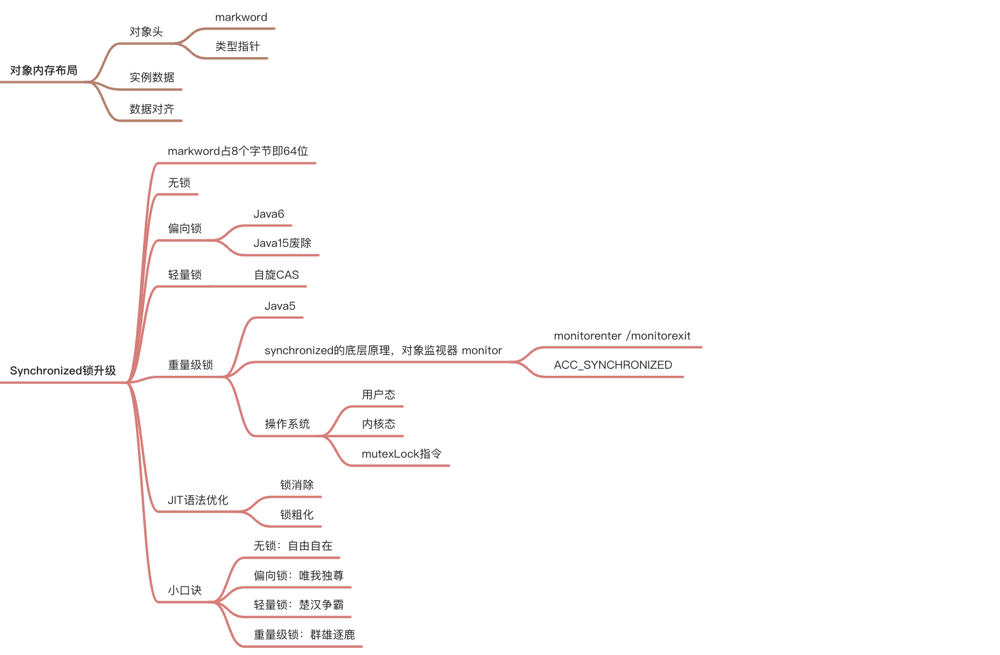
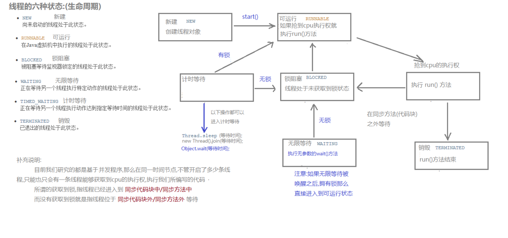

### JUC 并发笔记

### 一、并发大纲





#### 1.1 java.util.concurrent包

java.util.concurrent包涵盖一下三个快内容：

- atomic
- locks
- 其他


### 二、并发理念

#### 2.1 并发和并行

**并发**：是在同一实体上的多个事件，是在同一台处理器上“同时”处理多个任务，同一时刻，其实是只有一个事件在发生。

**并行**：是在不同实体上的多个事件，是在多台处理器上同时处理多个任务，同一时刻，大家都真的在做事情，你做你的，我做我的

#### 2.2 进程、线程、管程

**进程**：系统中运行的一个应用程序就是一个进程，每一个进程都有它自己的内存空间和系统资源。

**线程**：也被称为轻量级进程，在同一个进程内基本会有1一个或多个线程，是大多数操作系统进行调度的基本单元。

**管程**：

- Monitor（监视器），也就是我们平时说的锁

- Monitor其实是一种同步机制，他的义务是保证（同一时间）只有一个线程可以访问被保护的数据和代码。

- JVM中同步是基于进入和退出监视器对象(Monitor,管程对象)来实现的，每个对象实例都会有一个Monitor对象，

### 进程VS线程

进程是…，线程是…，进程和线程的最大不同在于进程基本上是独立的，而线程不一定，线程**共享方法区和堆，线程私有栈、本地方法栈和程序计数器**

#### 2.3 用户线程和守护线程

java线程分为用户线程和守护线程

线程的daemon属性为：

- true：表示守护线程。
- false：表示用户线程。

**用户线程**：是系统的工作线程，它会完成这个程序需要完成的业务操作。

**守护线程**：是一种特殊的线程，为其他线程服务的，在后台默默地完成一些系统性的服务。比如垃圾回收。

**总结**：

```java
public class DaemonDemo
{
public static void main(String[] args)
{
    Thread t1 = new Thread(() -> {
        System.out.println(Thread.currentThread().getName()+"\t 开始运行，"+(Thread.currentThread().isDaemon() ? "守护线程":"用户线程"));
        while (true) {

        }
    }, "t1");
    //线程的daemon属性为true表示是守护线程，false表示是用户线程
    //---------------------------------------------
    t1.setDaemon(true);
    //-----------------------------------------------
    t1.start();
    //3秒钟后主线程再运行
    try { TimeUnit.SECONDS.sleep(3); } catch (InterruptedException e) { e.printStackTrace(); }

    System.out.println("----------main线程运行完毕");
}

}
```

- 两种情况
  1. 未加`t1.setDaemon(true);`，默认是用户线程，他会继续运行，所以灯亮着。
  2. 加了`t1.setDaemon(true);`是守护线程，当用户线程main方法结束后自动退出了。

- 守护线程作为一个服务线程，没有服务对象就没有必要继续运行了，如果用户线程全部结束了，意味着程序需要完成的业务操作已经结束了，系统可退出了。假如当系统只剩下守护线程的时候，java虚拟机会自动退出。

- setDaemon(true) 方法必须在start()之前设置，否则报IIIegalThreadStateException异常
  

#### 2.4 Java 真的自己可以开启线程嘛

开不了

```java

    public synchronized void start() {
        /**
         * This method is not invoked for the main method thread or "system"
         * group threads created/set up by the VM. Any new functionality added
         * to this method in the future may have to also be added to the VM.
         *
         * A zero status value corresponds to state "NEW".
         */
        if (threadStatus != 0)
            throw new IllegalThreadStateException();

        /* Notify the group that this thread is about to be started
         * so that it can be added to the group's list of threads
         * and the group's unstarted count can be decremented. */
        group.add(this);

        boolean started = false;
        try {
            start0();
            started = true;
        } finally {
            try {
                if (!started) {
                    group.threadStartFailed(this);
                }
            } catch (Throwable ignore) {
                /* do nothing. If start0 threw a Throwable then
                  it will be passed up the call stack */
            }
        }
    }
    
// 本地方法，底层的C++ ，Java运行于虚拟机之上 无法直接操作硬件
    private native void start0();

```

#### 2.5 继承Thread

```java
    Thread01 thread = new Thread01();
    thread.start();//启动线程
    // 继承Thread
    public static class T1 extends Thread{
        @Override
        public void run(){
            System.out.println("当前线程："+Thread.currentThread().getId());
            System.out.println("T1");
        }

    }
```

#### 2.6 Thread的join方法阻塞当前线程

Thread的join方法：

join方法是Thread类中的一个方法，该方法的定义是等待该线程执行直到终止。其实就说join方法将挂起调用线程的执行，直到被调用的对象完成它的执行。

- 调用线程：当前线程，即调用了 t.join()语句的线程。
- 被调用的对象：t.join当中的线程对象t。

#### 2.7 join阻塞子线程的情况

join实例：现在有T1,T2,T3三个线程，你怎样保证 T2在T1执行完之后执行，T3在T2执行完之后执行？这个问题是网上很热的面试题（这里除了join还有很多方法能够实现，只是使用join是最简单的方案），下面是实现的代码：

```java
/**
 * @author wcc
 * @date 2021/8/21 20:46
 * 现在有T1、T2、T3三个线程，你怎样保证T2在T1执行完后执行，T3在T2执行完后执行？
 */
public class JoinDemo {

    public static void main(String[] args) {
        //初始化线程1，由于后续有匿名内部类调用这个局部变量，需要用final修饰
        //这里不用final修饰也不会报错的原因 是因为jdk1.8对其进行了优化
        /*
        在局部变量没有重新赋值的情况下，它默认局部变量为final类型，认为你只是忘记了加final声明了而已。
        如果你重新给局部变量改变了值或者引用，那就无法默认为final了
         */
        Thread t1=new Thread(new Runnable() {
            @Override
            public void run() {
                System.out.println("t1 is running...");
            }
        });

        //初始化线程二
        Thread t2=new Thread(new Runnable() {
            @Override
            public void run() {
                try {
                    t1.join();
                } catch (InterruptedException e) {
                    e.printStackTrace();
                }finally {
                    System.out.println("t2 is running...");
                }
            }
        });

        //初始化线程三
        Thread t3=new Thread(new Runnable() {
            @Override
            public void run() {
                try {
                    t2.join();
                } catch (InterruptedException e) {
                    e.printStackTrace();
                }finally {
                    System.out.println("t3 is running...");
                }
            }
        });

        t1.start();
        t2.start();
        t3.start();
    }

}
输出：
t1 is running...
t2 is running...
t3 is running...

```

结果分析：

在t2 线程中 t2 本省就是调用线程，

- 所谓的调用线程是指调用了 t.join()方法的线程。
- 而被调用的对象指的是调用join方法的线程对象，即 t1。


#### 2.8 join 阻塞主线程的情况

在很多情况下，主线程创建并启动子线程，如果子线程中要进行大量的耗时运算，主线程将可能早于子线程结束。如果主线程需要知道子线程的执行结果时，就需要等待子线程执行结束了。主线程可以sleep(xx)，但是这样的xx时间不好确定，因为子线程的执行时间不确定，join()方法比较合适这个场景。

```java
	public static void main(String[] args) {
        Thread t = new Thread(() -> System.out.println("test"));
        t.start();
        System.out.println("main1");
        try {
            t.join();
        } catch (Exception e) {
            e.printStackTrace();
        }
        System.out.println("main2");
    }

```

输出结果如下：

```java
main1
test
main2
OR
test
main1
main2
```

在这个例子当中：

- 调用贤臣是主线程
- 被调用的对象是 t.join()；当中的对象 t 

Main1 和 test 虽然会随机输出， 但join 方法后的代码 (输出 main2)，一定会在线程t 的 run 方法输出 test 之后执行。

#### 2.9 实现Runable接口

```java
    Runable01 runable01 = new Runable01();
    new Thread(runable01).start();
    // 实现Runnable接口
    public static class R1 implements Runnable{
        @Override
        public void run(){
            System.out.println("当前线程："+Thread.currentThread().getId());
            System.out.println("R1");
        }

    }
```

#### 2.10 实现Callable<T> 接口

```java
    //实现Callable接口 + FutureTask （可以拿到返回结果，可以处理异常）
    FutureTask<Integer> futureTask = new FutureTask<>(new Callable01());
    new Thread(futureTask).start();
    //阻塞等待整个线程执行完成，获取返回结果
    Integer integer = futureTask.get();    


    // 实现Callable接口 （可以拿到返回结果，可以处理异常）
    public static class C1 implements Callable<Integer> {

        @Override
        public Integer call() throws Exception {
            System.out.println("当前线程："+Thread.currentThread().getId());
            System.out.println("C1");
            return 66;
        }
    }
```

#### 2.11 实现 Runable 接口和 Callable 接口的区别

Runnable自 Java1.0 以来一直存在，但Callable仅在 Java1.5 中引入，目的就是为了处理 Runable 不支持的用例。

- Runnable 接口不会返回结果或抛出检查异常。
- 但是Callable 接口可以返回结果或抛出检查异常。
- 工具类 Executors 可以实现 Runnable 和 Callable 对象之间的互相转换。（Executors.callable (Runnable task) 或 Executor.callable（Runnable task， Object resule））。

所以，如果任务不需要返回结果或抛出异常推荐使用 Runnable 接口，这样代码看起来会更加简洁。

```java
Runnable.java
@FunctionalInterface
public interface Runnable {
   /**
    * 被线程执行，没有返回值也无法抛出异常
    */
    public abstract void run();
}

Callable.java
@FunctionalInterface
public interface Callable<V> {
    /**
     * 计算结果，或在无法这样做时抛出异常。
     * @return 计算返回的结果
     * @throws 如果无法计算结果，则抛出异常
     */
    V call() throws Exception;
}
```

### 三、线程四种实现方式、常用方法API、生命周期、买票案例、synchronized锁

#### 3.1 线程四种实现方式一：继承Thread

```java
	//注意:打印出来的结果会交替执行
	public class ThreadDemo{
	    public static void main(String[] args) {
	        //4.创建Thread类的子类对象
	        MyThread myThread=new MyThread();
	        //5.调用start()方法开启线程
	        //[ 会自动调用run方法这是JVM做的事情,源码看不到 ]
	        myThread.start();
	        for (int i = 0; i < 100; i++) {
	            System.out.println("我是主线程"+i);
	        }
	    }
	}
	class MyThread extends Thread{
	    //2.重写run方法
	    public void run(){
	        //3.将要执行的代码写在run方法中
	       for(int i=0;i<100;i++){
	           System.out.println("我是线程"+i);
	       }
	    }
	}

```

#### 3.2 线程四种实现方式二：实现Runnable接口

```java
public class RunnableDemo {
    public static void main(String[] args) {
        //4.创建Runnable的子类对象
        MyRunnale mr=new MyRunnale(); 
        //5.将子类对象当做参数传递给Thread的构造函数,并开启线程
        //MyRunnale taget=mr; 多态
        new Thread(mr).start();
        for (int i = 0; i < 1000; i++) {
            System.out.println("我是主线程"+i);
        }
    }
}

//1.定义一个类实现Runnable
class MyRunnale implements Runnable{
    //2.重写run方法
    @Override
    public void run() {
        //3.将要执行的代码写在run方法中
        for (int i = 0; i < 1000; i++) {
            System.out.println("我是线程"+i);
        }
    }
}
```


**两种实现多线程方式的区别**

```properties
	(1).查看源码
	a.继承Thread:由于子类重写了Thread类的run(),当调用start()时,直接找子类的run()
	方法
    b.实现Runnable:构造函数中传入了Runnable的引用,成员变量记住了它,start()调用
 run()方法时内部判断成员变量Runnable的引用是否为空,不为空编译时看的是Runnable的run(),
 运行时执行的是子类的run()方法
  (2).继承Thread
    a.好处是:可以直接使用Thread类中的方法,代码简单
    b.弊端是:如果已经有了父类,就不能用这种方法
  (3).实现Runnable接口
    a.好处是:即使自己定义的线程类有了父类也没有关系,因为有了父类可以实现接口,而且接口
可以多现实的
    b.弊端是:不能直接使用Thread中的方法需要先获取到线程对象后,才能得到Thread的方法,
代码复杂

```

#### 3.3 线程四种实现方式三：实现Runnable接口

Callable接口中的call方法和Runnable接口中的run方法的区别：

- 是否有返回值(Runnable接口没有返回值 Callable接口有返回值).
- 是否抛异常(Runnable接口不会抛出异常 Callable接口会抛出异常).
- 落地方法不一样,一个是call() ,一个是run().


**Future接口概述**:

1. FutureTask是Future接口的唯一的实现类
2. FutureTask同时实现了Runnable、Future接口。它既可以作为Runnable被线程执行,又可以作为Futrue得到Callable的返回值


```java
	/*
	创建线程的方式三: 实现callable接口 ---JDK 5.0 新增
	1.创建一个实现Callable接口的实现类
	2.实现call方法,将此线程需要执行的操作声明在call()中
	3.创建callable接口实现类的对象
	4.将此callable的对象作为参数传入到FutureTask构造器中,创建FutureTask的对象
	5.将FutureTask对象作为参数传递到Thread类的构造器中,创建Thread对象,并调用star
	6.获取callable接口中call方法的返回值
	* */
	public class ThreadNew {
	    public static void main(String[] args) {
	        //3.创建callable接口实现类的对象
	        NumThead m=new NumThead();
	        //4.将此callable的对象作为参数传入到FutureTask构造器中,创建FutureTask的对象
	        
	        FutureTask futureTask = new FutureTask(m);
	        //5.将FutureTask对象作为参数传递到Thread类的构造器中,创建Thread对象,并调用start()方法
	        //FutureTask类继承了Runnable接口
	        //new Runnable = futrueTask;
	        new Thread(futureTask).start();
	
	        //6.获取callable接口中call方法的返回值
	        try {
	            //get()方法返回值即为FutureTask构造器参数callable实现类重写的call方法的返回值
	            Object sum = futureTask.get();
	            System.out.println("总和是:"+sum);
	        } catch (Exception e) {
	            e.printStackTrace();
	        }
	    }
	
	}
	//1.创建一个实现Callable接口的实现类
	class  NumThead implements Callable{
	   // class  NumThead implements Callable<Integer>{
	    //2.实现call方法,将此线程需要执行的操作声明在call()中
	    @Override
	    public Object call() throws Exception {
	    //public Integer call() throws Exception {
	        int sum=0;
	        for(int i=1;i<=100;i++){
	            System.out.println(i);
	            sum+=i;
	        }
	        return sum;
	    }
	}
```


**FutureTask原理解析**:

- 有了Runnable,为什么还要有Callable接口?我们假设一共有四个程序需要执行,第三个程序时间很长 | Runnable接口会按照顺序去执行,会依次从上到下去执行,会等第三个程序执行完毕,才去执行第四个 | Callable接口会把时间长的第三个程序单独开启一个线程去执行,第1、2、4 线程执行不受影响。

- 比如主线程让一个子线程去执行任务,子线程可能比较耗时,启动子线程开始执行任务。子线程就去做其他的事情,过一会儿才去获取子任务的执行结果
  
  


**注意事项**

1. get( )方法建议放在最后一行,防止线程阻塞(一旦调用了get( )方法,不管是否计算完成都会阻塞)
2. 一个FutureTask,多个线程调用call( )方法只会调用一次
3. 如果需要调用call方法多次,则需要多个FutureTask

```java
public class CallableDemo  {
    public static void main(String[] args) throws Exception{
        CallAble c=new CallAble();
        FutureTask<Integer> futureTask=new FutureTask<>(c);

        new Thread(futureTask,"线程A").start();
        new Thread(futureTask,"线程B").start();
        Integer integer = futureTask.get();
        System.out.println("integer = " + integer);
    }
}
class CallAble implements Callable<Integer>{
    @Override
    public Integer call() throws Exception {
        System.out.println("欢迎你调用call方法");
        return 6;
    }
}
```

 **isDone()轮询**

(后面我们会用CompletableFuture来解决get( )阻塞的问题)

1. 轮询的方式会消耗无畏的CPU资源,而且也不见得能及时地得到计算的结果
2. 如果想要异步获取结果,通常都会以轮询的方式去获取结果,尽量不要阻塞

```java
public class FutureTaskTest {
    public static void main(String[] args) throws Exception{
        FutureTask futureTask = new FutureTask(()->{
            try { TimeUnit.SECONDS.sleep(3);  } catch (InterruptedException e) {e.printStackTrace();}
            System.out.println(Thread.currentThread().getName()+"\t"+"coming......");
            return 1024;
        });
        new Thread(futureTask).start();
        //1.果futureTask.get()放到main线程前面,会导致main线程阻塞
        //Object o = futureTask.get();

        /*Object o = futureTask.get();//不见不散,只要出现了get()方法就会阻塞
        System.out.println("不见不散,只要出现了get()方法就会阻塞,获取到的值为:"+o);*/
        //2.过时不候
//        System.out.println(Thread.currentThread().getName()+"\t"+"线程来了.....");
//        Object o2 = futureTask.get(2L, TimeUnit.SECONDS);
        //3.使用轮询
        while(true){
            if(futureTask.isDone()){
                System.out.println("使用轮询来解决,值为:"+futureTask.get());
                break;
            }else{
                System.out.println("阻塞中**********");
            }
        }
    }
}
```

#### 3.4 线程四种实现方式四：线程池

#### 3.5 设置和获取线程池名称

- void setName(String name):将此线程的名称更改为等于参数 name

```java
      //FileWriter
      MyThread my1 = new MyThread();
      MyThread my2 = new MyThread();

      //void setName(String name):将此线程的名称更改为等于参数 name
      my1.setName("高铁");
      my2.setName("飞机");

      my1.start();
      my2.start();

```

- String getName( )：返回此线程的名称

注意:要是类没有继承Thread,不能直接使用getName( ) ；要是没有继承Thread,要通过Thread.currentThread得到当前线程,然后调用getName( )方法


- static Thread currentThread( )返回对当前正在执行的线程对象的引用

- 通过构造函数设置线程名称

Thread(String name):通过带参构造进行赋值
Thread(Runnable target , String name)

```java
public class MyThread extends Thread {
    public MyThread() {}

    public MyThread(String name) {
        super(name);
    }
    @Override
    public void run() {
        for (int i = 0; i < 100; i++) {
            System.out.println(getName()+":"+i);
        }
    }
}
```

```java
//Thread(String name)
MyThread my1 = new MyThread("高铁");
MyThread my2 = new MyThread("飞机");
my1.start();
my2.start();
```

#### 3.6 线程优先级(setPriority)

**线程有两种调度模型 [ 了解 ]**

1. **分时调度模式**:所有线程轮流使用CPU的使用权,平均分配每个线程占有CPU的时间片
2. **抢占式调度模型**:优先让优先级高的线程使用CPU,如果线程的优先级相同,那么会随机选择一个,优先级高的线程获取的CPU时间片相对多一些 [ Java使用的是抢占式调度模型 ]

**Thread类中设置和获取线程优先级的方法**

1. public final void setPriority(int newPriority):更改此线程的优先级

2. public final int getPriority():返回此线程的优先级

3. a. 线程默认优先级是5；线程优先级范围是:1-10； b. 线程优先级高仅仅表示线程获取的CPU时间的几率高,但是要在次数比较多,或者多次运行的时候才能看到你想要的效果
   

```java
      ThreadPriority tp1 = new ThreadPriority();
      ThreadPriority tp2 = new ThreadPriority();
      ThreadPriority tp3 = new ThreadPriority();

      tp1.setName("高铁");
      tp2.setName("飞机");
      tp3.setName("汽车");
      //设置正确的优先级
      tp1.setPriority(5);
      tp2.setPriority(10);
      tp3.setPriority(1);

      tp1.start();
      tp2.start();
      tp3.start();

```


#### 3.7 线程控制(sleep、join、setDeamon)

①. static void sleep(long millis):使当前正在执行的线程停留(暂停执行)指定的毫秒数 (休眠线程)

②. void join():当前线程暂停,等待指定的线程执行结束后,当前线程再继续 (相当于插队加入)
void join(int millis):可以等待指定的毫秒之后继续 (相当于插队,有固定的时间)

③. void yield():让出cpu的执行权(礼让线程)

④.void setDaemon(boolean on):将此线程标记为守护线程,当运行的线程都是守护线程时,Java虚拟机将退出(守护线程)
(相当于象棋中的帅,要是帅没了,别的棋子都会没用了)

1. 守护线程是区别于用户线程哈,用户线程即我们手动创建的线程,而守护线程是程序运行的时候在后台提供一种通用服务的线程。垃圾回收线程就是典型的守护线程

2. 守护线程拥有自动结束自己生命周期的特性,非守护线程却没有。如果垃圾回收线程是非守护线程,当JVM 要退出时,由于垃圾回收线程还在运行着,导致程序无法退出,这就很尴尬。这就是为什么垃圾回收线程需要是守护线程

3. t1.setDaemon(true)一定要在start( )方法之前使用
   

```java
    //守护线程和非守护线程的区别是
    public static void main(String[] args) throws InterruptedException {
        Thread t1 = new Thread(()-> {
                while (true) {
                    try {
                        Thread.sleep(1000);
                        System.out.println("我是子线程(用户线程.I am running");
                    } catch (Exception e) {
                    }
                }
        });
        //标记为守护线程,setDaemon要在start()方法之前使用
        t1.setDaemon(true);
        //启动线程
        t1.start();

        Thread.sleep(3000);
        System.out.println("主线程执行完毕...");
    }

```


#### 3.8 线程的生命周期

①. **新建**:就是刚使用new方法,new出来的线程

②. **就绪**:就是调用的线程的start()方法后,这时候线程处于等待CPU分配资源阶段,谁先抢的CPU资源,谁开始执行

③. **运行**:当就绪的线程被调度并获得CPU资源时,便进入运行状态,run方法定义了线程的操作和功能

④. **阻塞**:在运行状态的时候,可能因为某些原因导致运行状态的线程变成了阻塞状态
比如sleep()、wait()之后线程就处于了阻塞状态,这个时候需要其他机制将处于阻塞状态的线程唤醒,比如调用notify或者notifyAll()方法。唤醒的线程不会立刻执行run方法,它们要再次等待CPU分配资源进入运行状态

⑤. **销毁**:如果线程正常执行完毕后或线程被提前强制性的终止或出现异常导致结束,那么线程就要被销毁,释放资源

⑥. 完整的生命周期图如下:




#### 3.9 线程同步

##### 3.9.1 买票案例出现的两个问题

出现的问题:

1. 相同票数出现多次；

2. 出现了负票

```java
public class SellTicket implements Runnable {
    //定义一个成员变量表示有100张票
    private int tickets=100;
    public void run(){
     while (true){
         if(tickets>0){
             try {
                 //通过sleep()方法来等待
                 Thread.sleep(100);
             } catch (InterruptedException e) {
                 e.printStackTrace();
             }
             System.out.println(Thread.currentThread().getName()+"正在出售第"+tickets--+"张票");
         }else{
             //System.out.println("");
         }
     }
    }
}
@SuppressWarnings("all")
public class SellTicketDemo {
    public static void main(String[] args) {
        SellTicket st = new SellTicket();

        Thread t1 = new Thread(st, "窗口1");
        Thread t2 = new Thread(st, "窗口2");
        Thread t3 = new Thread(st, "窗口3");

        t1.start();
        t2.start();
        t3.start();
    }
}

```

-  原因分析:

1. 为什么会出现相同的票
2. 为什么会出现负票


##### 3.9.2 同步代码块synchronized

- 为什么出现问题？(这也是我们判断多线程程序是否会有数据安全问题的标准)

1. 是否有多线程坏境
2. 是否有共享数据
3. 是否有多条语句操作共享数据

- 如何解决多线程安全问题

1. 基本思想:让程序没有安全问题的坏境
2. 把多条语句操作的共享数据的代码给锁起来,让任意时刻只能有一个线程执行即可

- 怎么锁起来呢？
  synchronized(任意对象):相当于给代码加锁了,任意对象就可以看成是一把锁

- 同步的好处和弊端

1. 好处:解决了多线程的数据安全问题
2. 弊端:当线程很多时,因为每个线程都会判断同步上的锁,这是很浪费资源的,无形中会降低程序的运行效率

```java
public class SellTicket implements Runnable {
    //定义一个成员变量表示有100张票
    private int tickets=100;
    
    private Object obj=new Object();

    public void run(){
     while (true){
       //这里放的锁要是同一把锁才可以
       synchronized(obj){
           if(tickets>0){
               try {
                   //通过sleep()方法来等待
                   Thread.sleep(100);
               } catch (InterruptedException e) {
                   e.printStackTrace();
               }
               System.out.println(Thread.currentThread().getName()+"正在出售第"+tickets--+"张票");
           }else{
               //System.out.println("");
           }
       }
     }
    }
}
```


##### 3.9.3 同步方法

- ①. 同步方法:就是把synchronized 关键字加到方法上
  同步方法的锁对象是什么呢? this
  格式:修饰符 synchronized 返回值类型 方法名(方法参数){ }


```java
    private int tickets = 100;
    private Object obj = new Object();
    private int x = 0;

    @Override
    public void run() {
        while (true) {
            if (x % 2 == 0) {
//                synchronized (obj) {
        synchronized (this) {    
                    if (tickets > 0) {
                        try {
                            Thread.sleep(100);
                        } catch (InterruptedException e) {
                            e.printStackTrace();
                        }
                        System.out.println(Thread.currentThread().getName() + "正在出售第" + tickets + "张票");
                        tickets--;
                    }
                }
            } else {
                sellTicket();
            }
            x++;
        }
    }

  private synchronized void sellTicket() {
        if (tickets > 0) {
            try {
                Thread.sleep(100);
            } catch (InterruptedException e) {
                e.printStackTrace();
            }
            System.out.println(Thread.currentThread().getName() + "正在出售第" + tickets + "张票");
            tickets--;
        }
    }

}

```

- **同步静态方法**:就是把synchronized关键字加到静态方法上

格式:修饰符 static synchronized 返回值类型 方法名(方法参数){ }
同步静态方法的锁对象是什么呢?
类名.class

```java
public class SellTicket implements Runnable {

    private static int tickets = 100;
    private Object obj = new Object();
    private int x = 0;

    @Override
    public void run() {
        while (true) {
            if (x % 2 == 0) {

                synchronized (SellTicket.class) {
                    if (tickets > 0) {
                        try {
                            Thread.sleep(100);
                        } catch (InterruptedException e) {
                            e.printStackTrace();
                        }
                        System.out.println(Thread.currentThread().getName() + "正在出售第" + tickets + "张票");
                        tickets--;
                    }
                }
            } else {
         
                sellTicket();
            }
            x++;
        }
    }

    private static synchronized void sellTicket() {
        if (tickets > 0) {
            try {
                Thread.sleep(100);
            } catch (InterruptedException e) {
                e.printStackTrace();
            }
            System.out.println(Thread.currentThread().getName() + "正在出售第" + tickets + "张票");
            tickets--;
        }
    }
}

```

### 四、Future和Callable接口

- Future接口(FutureTask实现类)定义了操作异步任务执行一些方法，如获取异步任务的执行结果、取消任务的执行、判断任务是否被取消、判断任务执行是否完毕等。（异步：可以被叫停，可以被取消）

- 一句话：Future接口可以为主线程开一个分支任务，专门为主线程处理耗时和费力的复杂业务。
  


- eg.比如主线程让一个子线程去执行任务，子线程可能比较耗时，启动子线程开始执行任务后，主线程就去做其他事情了，过了一会才去获取子任务的执行结果。老师在上课，但是口渴，于是让班长这个线程去买水，自己可以继续上课，实现了异步任务。

- 有个目的：异步多线程任务执行且有返回结果，三个特点：多线程/有返回/异步任务（班长作为老师去买水作为新启动的异步多线程任务且买到水有结果返回）
  

#### 4.1 FutureTask实现类

- FutureTask（实现了x接口，x接口又继承了a和v接口）
  1. 在源码可以看到，他既继承了`RunnableFuture`接口，也在构造方法中实现了`Callable`接口（有返回值、可抛出异常）和`Runnable`接口。


- 完成上面目的的代码 - 多线程/有返回/异步

  一个主线程，一个mythread|步执行了|返回了"hello callable"

```java
public class CompletableFutureDemo {
    public static void main(String[] args) throws ExecutionException, InterruptedException {
        FutureTask<String> futureTask = new FutureTask<>(new MyThread());
        Thread t1 = new Thread(futureTask,"t1");
        t1.start();
        System.out.println(futureTask.get());//接收返回值
    }
}

class MyThread implements Callable<String>{

    @Override
    public String call() throws Exception {
        System.out.println("-----come in call() ----异步执行");
        return "hello Callable 返回值";
    }
}
//结果
//-----come in call() ----异步执行
//hello Callable 返回值

```

#### 4.2 Future到CompletableFuture

**Future优点**

- **future**+**线程池**异步多线程任务配合，能显著提高程序的执行效率。
- 方案一，3个任务1个main线程处理，大概**1130ms**


- 方案二，3个任务3个线程，利用线程池（假如每次new一个Thread，太浪费资源，会有GC这些工作），大概**400毫秒**。


**Future缺点**

- get()阻塞

一旦调用get()方法，不管是否计算完成，都会导致阻塞（所以一般get方法放到最后）

```java
public class FutureAPIDemo {
    public static void main(String[] args) throws ExecutionException, InterruptedException {
        FutureTask<String> futureTask = new FutureTask<String>(()->{
            System.out.println(Thread.currentThread().getName()+"\t ------副线程come in");
            try {
                TimeUnit.SECONDS.sleep(5);//暂停几秒
            } catch (InterruptedException e) {
                e.printStackTrace();
            }
            return "task over";
        });
        Thread t1 = new Thread(futureTask,"t1");
        t1.start();
        //-----------------------------------------------------------注意顺序
        System.out.println(Thread.currentThread().getName()+"\t-------主线程忙其他任务了");
        System.out.println(futureTask.get());
        //----------------------------------------------------------注意顺序
    }
}
//main  -------主线程忙其他任务了
//t1   ------副线程come in

public class FutureAPIDemo {
    public static void main(String[] args) throws ExecutionException, InterruptedException {
        FutureTask<String> futureTask = new FutureTask<String>(()->{
            System.out.println(Thread.currentThread().getName()+"\t ------副线程come in");
            try {
                TimeUnit.SECONDS.sleep(5);//暂停几秒
            } catch (InterruptedException e) {
                e.printStackTrace();
            }
            return "task over";
        });
        Thread t1 = new Thread(futureTask,"t1");
        t1.start();
        //-----------------------------------------------------------注意顺序
        System.out.println(futureTask.get());
        System.out.println(Thread.currentThread().getName()+"\t-------主线程忙其他任务了");

        //----------------------------------------------------------注意顺序
    }
}
//t1   ------副线程come in
//-------------------5秒后才出现下面的结果-------------说明一旦调用get()方法直接去找副线程了，阻塞了主线程
//task over
//main  -------主线程忙其他任务了

```

- isDone()轮询

利用if(futureTask.isDone())的方式使得他在结束之后才get(),但是也会消耗cpu

```java
public class FutureAPIDemo {
    public static void main(String[] args) throws ExecutionException, InterruptedException, TimeoutException {
        FutureTask<String> futureTask = new FutureTask<String>(()->{
            System.out.println(Thread.currentThread().getName()+"\t ------副线程come in");
            try {
                TimeUnit.SECONDS.sleep(5);//暂停几秒
            } catch (InterruptedException e) {
                e.printStackTrace();
            }
            return "task over";
        });
        Thread t1 = new Thread(futureTask,"t1");
        t1.start();

        System.out.println(Thread.currentThread().getName()+"\t-------主线程忙其他任务了");
      //1-------  System.out.println(futureTask.get(3,TimeUnit.SECONDS));//只愿意等3秒，过了3秒直接抛出异常

        //2-------更健壮的方式-------轮询方法---等副线程拿到才去get()
        //但是也会消耗cpu资源
        while(true){
            if(futureTask.isDone()){
                System.out.println(futureTask.get());
                break;
            }else{
                //暂停毫秒
                try {
                    TimeUnit.MILLISECONDS.sleep(500);
                } catch (InterruptedException e) {
                    e.printStackTrace();
                }
                System.out.println("正在处理中------------正在处理中");
            }
        }
    }
}
//main  -------主线程忙其他任务了
//t1   ------副线程come in
//正在处理中------------正在处理中
//正在处理中------------正在处理中
//正在处理中------------正在处理中
//正在处理中------------正在处理中
//正在处理中------------正在处理中
//正在处理中------------正在处理中
//正在处理中------------正在处理中
//正在处理中------------正在处理中
//正在处理中------------正在处理中
//正在处理中------------正在处理中
//task over

```

#### 4.3 Future应用现状

对于简单的业务场景使用Future完全ok

- 回调通知
  1. 前面的`isDone()`方法耗费cpu资源，一般应该还是利用**回调函数**，在Future结束时自动调用该回调函数。应对Future的完成时间，完成了可以告诉我，也就是我们的回调通知。

- 创建异步任
  2. Future + 线程池配合

- 多个任务前后依赖可以组合处理（水煮鱼）
  3. 想将对个异步任务的计算结果组合起来，后一个异步任务计算结果需要前一个异步任务的值，将两个或多个异步计算和成一个异步计算，这几个异步计算互相独立，同时后面这个又依赖前一个处理的结果。

- 对计算速度选最快完成的(并返回结果)
  4. 当Future集合中某个任务最快结束时，返回结果，返回第一名处理结果。

#### 4.4 CompletableFuture基本介绍

阻塞的方式和异步编程的设计理念相违背，而轮询的方式会消耗无畏的CPU资源。因此，JDK8设计出CompletableFuture

**CompletableFuture**

```java
public class CompletableFuture<T> implements Future<T>, CompletionStage<T> {
```


- 在Java 8中， Complet able Future提供了非常强大的Future的扩展功能， 可以帮助我们简化异步编程的复杂性， 并且提供了函数式编程的能
  力， 可以通过回调的方式处理计算结果， 也提供了转换和组合Complet able Future的方法。

- 它可能代表一个明确完成的Future， 也有可能代表一个完成阶段(Completion Stage) ， 它支持在计算完成以后触发一些函数或执行某些
  动作。

- 它实现了Future和Completion Stage接口
  

**CompletionStage**

- Completion Stage代表异步计算过程中的某一个阶段， 一个阶段完成以后可能会触发另外一个阶段

- 一个阶段的计算执行可以是一个Function， Consumer或者Runnable。比如：stage.then Apply(x->square(x) ) .then Accept(x->System.out.print(x) ) .then Run() ->System.out.print In() )，一个阶段的执行可能是被单个阶段的完成触发，也可能是由多个阶段一起触发。

**核心的四个静态方法（分为两组）**

- 利用核心的四个静态方法创建一个异步操作 | 不建议用new

- 关键就是 |有没有返回值|是否用了线程池|

- 参数说明：
  1. 没有指定Executor的方法，直接使用默认的ForkJoinPool.commPool()作为它的线程池执行异步代码。
  2. 如果指定线程池，则使用我们定义的或者特别指定的线程池执行异步代码。
     

**runAsync无返回值**

1、 runAsync

```java
public static CompletableFuture<Void> runAsync(Runnable runnable)
```

```java
public class CompletableFutureBuildDemo {
    public static void main(String[] args) throws ExecutionException, InterruptedException {
        CompletableFuture<Void> voidCompletableFuture = CompletableFuture.runAsync(() -> {
            System.out.println(Thread.currentThread().getName());
            //停顿几秒线程
            try {
                TimeUnit.SECONDS.sleep(1);
            } catch (InterruptedException e) {
                e.printStackTrace();
            }
        });
        System.out.println(voidCompletableFuture.get());
    }
}
//ForkJoinPool.commonPool-worker-9 //默认的线程池
//null --- 没有返回值

```

**2、runAsync+线程池**

```java
public static CompletableFuture<Void> runAsync(Runnable runnable,
                                                   Executor executor)
```

```java
public class CompletableFutureBuildDemo {
    public static void main(String[] args) throws ExecutionException, InterruptedException {

        ExecutorService executorService = Executors.newFixedThreadPool(3);//加入线程池

        CompletableFuture<Void> voidCompletableFuture = CompletableFuture.runAsync(() -> {

            System.out.println(Thread.currentThread().getName());
            //停顿几秒线程
            try {
                TimeUnit.SECONDS.sleep(1);
            } catch (InterruptedException e) {
                e.printStackTrace();
            }
        },executorService);
        System.out.println(voidCompletableFuture.get());
    }
}
//pool-1-thread-1   ----指定的线程池
//null ----没有返回值
```

**supplyAsync有返回值**

**3、supplyAsync**

```java
public static <U> CompletableFuture<U> supplyAsync(Supplier<U> supplier) 
```

```java
public class CompletableFutureBuildDemo {
    public static void main(String[] args) throws ExecutionException, InterruptedException {

        ExecutorService executorService = Executors.newFixedThreadPool(3);//加入线程池

        CompletableFuture<String> objectCompletableFuture = CompletableFuture.supplyAsync(()->{
            System.out.println(Thread.currentThread().getName());
            try {
                TimeUnit.SECONDS.sleep(1);
            } catch (InterruptedException e) {
                e.printStackTrace();
            }
            return "helllo supplyasync";
        });
        System.out.println(objectCompletableFuture.get());
    }
}
//ForkJoinPool.commonPool-worker-9---------默认的线程池
//helllo supplyasync-------------supplyasync有返回值了
```

**4、supplyAsync+线程池**

```java
public static <U> CompletableFuture<U> supplyAsync(Supplier<U> supplier,
                                                       Executor executor)
```

```java
public class CompletableFutureBuildDemo {
    public static void main(String[] args) throws ExecutionException, InterruptedException {

        ExecutorService executorService = Executors.newFixedThreadPool(3);//加入线程池

        CompletableFuture<String> objectCompletableFuture = CompletableFuture.supplyAsync(()->{
            System.out.println(Thread.currentThread().getName());
            try {
                TimeUnit.SECONDS.sleep(1);
            } catch (InterruptedException e) {
                e.printStackTrace();
            }
            return "helllo supplyasync";
        },executorService);
        System.out.println(objectCompletableFuture.get());
    }
}
//ForkJoinPool.commonPool-worker-9---------默认的线程池
//helllo supplyasync-------------supplyasync有返回值了
```

#### 4.5 CompletableFuture使用演示（日常使用）

##### 4.5.1 基本功能

`CompletableFuture`可以完成`Future`的功能

```java
public class CompletableFutureUseDemo {
    public static void main(String[] args) throws ExecutionException, InterruptedException {
        CompletableFuture<Object> objectCompletableFuture = CompletableFuture.supplyAsync(()->{
            System.out.println(Thread.currentThread().getName()+"----副线程come in");
            int result = ThreadLocalRandom.current().nextInt(10);//产生一个随机数
            try {
                TimeUnit.SECONDS.sleep(1);
            } catch (InterruptedException e) {
                e.printStackTrace();
            }
            System.out.println("1秒钟后出结果"+result);
            return result;
        });

        System.out.println(Thread.currentThread().getName()+"线程先去忙其他任务");
        System.out.println(objectCompletableFuture.get());
    }
}
//main线程先去忙其他任务
//ForkJoinPool.commonPool-worker-9----副线程come in
//1秒钟后出结果6
//6
```

##### 4.5.2 减少阻塞和轮询whenComplete

`CompletableFuture`通过`whenComplete`来**减少阻塞和轮询**（自动回调）

```java
public class CompletableFutureUseDemo {
    public static void main(String[] args) throws ExecutionException, InterruptedException {
        CompletableFuture.supplyAsync(()->{
            System.out.println(Thread.currentThread().getName()+"--------副线程come in");
            int result = ThreadLocalRandom.current().nextInt(10);//产生随机数
            try {
                TimeUnit.SECONDS.sleep(1);
            } catch (InterruptedException e) {
                e.printStackTrace();
            }
            return result;
        }).whenComplete((v,e) -> {//没有异常,v是值，e是异常
            if(e == null){
                System.out.println("------------------计算完成，更新系统updataValue"+v);
            }
        }).exceptionally(e->{//有异常的情况
            e.printStackTrace();
            System.out.println("异常情况"+e.getCause()+"\t"+e.getMessage());
            return null;
        });

        //线程不要立刻结束，否则CompletableFuture默认使用的线程池会立刻关闭：暂停3秒钟线程
        System.out.println(Thread.currentThread().getName()+"线程先去忙其他任务");
        try {
            TimeUnit.SECONDS.sleep(3);
        } catch (InterruptedException e) {
            e.printStackTrace();
        }
    }
}
//ForkJoinPool.commonPool-worker-9--------副线程come in（这里用的是默认的ForkJoinPool）
//main线程先去忙其他任务
//------------------计算完成，更新系统updataValue3
```

- 假如换用自定义线程池

```java
public class CompletableFutureUseDemo {
    public static void main(String[] args) throws ExecutionException, InterruptedException {
        ExecutorService threadPool = Executors.newFixedThreadPool(3);
        CompletableFuture.supplyAsync(()->{
            System.out.println(Thread.currentThread().getName()+"--------副线程come in");
            int result = ThreadLocalRandom.current().nextInt(10);//产生随机数
            try {
                TimeUnit.SECONDS.sleep(1);
            } catch (InterruptedException e) {
                e.printStackTrace();
            }
            return result;
        },threadPool).whenComplete((v,e) -> {//没有异常,v是值，e是异常
            if(e == null){
                System.out.println("------------------计算完成，更新系统updataValue"+v);
            }
        }).exceptionally(e->{//有异常的情况
            e.printStackTrace();
            System.out.println("异常情况"+e.getCause()+"\t"+e.getMessage());
            return null;
        });

        //线程不要立刻结束，否则CompletableFuture默认使用的线程池会立刻关闭：暂停3秒钟线程
        System.out.println(Thread.currentThread().getName()+"线程先去忙其他任务");
        try {
            TimeUnit.SECONDS.sleep(3);
        } catch (InterruptedException e) {
            e.printStackTrace();
        }
    }
}
//pool-1-thread-1--------副线程come in
//main线程先去忙其他任务
//------------------计算完成，更新系统updataValue6

```

- 异常情况的展示，设置一个异常 `int i = 10 / 0 ;`

```java
public class CompletableFutureUseDemo {
    public static void main(String[] args) throws ExecutionException, InterruptedException {
        ExecutorService threadPool = Executors.newFixedThreadPool(3);
        CompletableFuture.supplyAsync(()->{
            System.out.println(Thread.currentThread().getName()+"--------副线程come in");
            int result = ThreadLocalRandom.current().nextInt(10);//产生随机数
            try {
                TimeUnit.SECONDS.sleep(1);
            } catch (InterruptedException e) {
                e.printStackTrace();
            }
            System.out.println("-----结果---异常判断值---"+result);
            //---------------------异常情况的演示--------------------------------------
            if(result > 2){
                int i  = 10 / 0 ;//我们主动的给一个异常情况
            }
            //------------------------------------------------------------------
            return result;
        },threadPool).whenComplete((v,e) -> {//没有异常,v是值，e是异常
            if(e == null){
                System.out.println("------------------计算完成，更新系统updataValue"+v);
            }
        }).exceptionally(e->{//有异常的情况
            e.printStackTrace();
            System.out.println("异常情况"+e.getCause()+"\t"+e.getMessage());
            return null;
        });

        //线程不要立刻结束，否则CompletableFuture默认使用的线程池会立刻关闭：暂停3秒钟线程
        System.out.println(Thread.currentThread().getName()+"线程先去忙其他任务");
        try {
            TimeUnit.SECONDS.sleep(3);
        } catch (InterruptedException e) {
            e.printStackTrace();
        }
    }
}
//pool-1-thread-1--------副线程come in
//main线程先去忙其他任务
//-----结果---异常判断值---4                (这里 4 >2了，直接抛出异常)
//异常情况java.lang.ArithmeticException: / by zero  java.lang.ArithmeticException: / by zero
//java.util.concurrent.CompletionException: java.lang.ArithmeticException: / by zero
//  at java.util.concurrent.CompletableFuture.encodeThrowable(CompletableFuture.java:273)
//  at java.util.concurrent.CompletableFuture.completeThrowable(CompletableFuture.java:280)
//  at java.util.concurrent.CompletableFuture$AsyncSupply.run(CompletableFuture.java:1592)
//  at java.util.concurrent.ThreadPoolExecutor.runWorker(ThreadPoolExecutor.java:1149)
//  at java.util.concurrent.ThreadPoolExecutor$Worker.run(ThreadPoolExecutor.java:624)
//  at java.lang.Thread.run(Thread.java:748)
//Caused by: java.lang.ArithmeticException: / by zero
//  at com.zhang.admin.controller.CompletableFutureUseDemo.lambda$main$0(CompletableFutureUseDemo.java:19)
//  at java.util.concurrent.CompletableFuture$AsyncSupply.run(CompletableFuture.java:1590)
//  ... 3 more
```

##### 4.5.3 CompletableFuture优点总结

- 异步任务结束时，会**自动回调**某个对象的方法；
- 主线程设置好毁掉后，不再关心异步任务的执行，异步任务之间可以顺序执行
- 异步任务出错时，会自动回调某个对象的方法。

#### 4.6 CompletableFuture案例精讲

 编程必备技能准备

函数式接口

- 函数式接口的定义：
  1. 任何接口，如果只包含唯一一个抽象方法，那么它就是一个函数式接口。对于函数式接口，我们可以通过lambda表达式来创建该接口的对象。

```java
public interface Runnable{
  public abstract void run();
}
```

- 常见的函数式接口

1. Runnable

```java
@FunctionalInterface
public interface Runnable {
    public abstract void run();
}
```

2. Function

```java
@FunctionalInterface
public interface Function<T, R> {
    R apply(T t);
}
```

3. Consumer

```java
@FunctionalInterface
public interface Consumer<T> {
    void accept(T t);
}
```

4. Supplier

```java
@FunctionalInterface
public interface Supplier<T> {

    /**
     * Gets a result.
     *
     * @return a result
     */
    T get();
}
```

5. Biconsumer(Bi代表两个的意思，我们要传入两个参数，在上面的案例中是v和e)

```java
@FunctionalInterface
public interface BiConsumer<T, U> {
    void accept(T t, U u);

}
```

| 函数式接口名称 | 方法名称 | 参数     | 返回值   |
| -------------- | -------- | -------- | -------- |
| Runnable       | run      | 无参数   | 无返回值 |
| Function       | apply    | 1个参数  | 有返回值 |
| Consume        | accept   | 1个参数  | 无返回值 |
| Supplier       | get      | 没有参数 | 有返回值 |
| Biconsumer     | accept   | 2个参数  | 无返回值 |

##### 4.6.1 链式调用|链式编程|链式写法

```java
public class Chain {
    public static void main(String[] args) {
        //-------------------老式写法------------
//        Student student = new Student();
//        student.setId(1);
//        student.setMajor("cs");
//        student.setName("小卡");
        new Student().setId(1).setName("大卡").setMajor("cs");
    }
    
}

@NoArgsConstructor
@AllArgsConstructor
@Data
@Accessors(chain = true)//开启链式编程
class Student{
    private int id;
    private String name;
    private String major;
}

```

##### 4.6.2 join和get对比

- 功能基本一样，区别在于编码是是否需要抛出异常
  1. get() 方法需要抛出异常。
  2. join() 不需要抛出异常。

```java
public class Chain {
    public static void main(String[] args) throws ExecutionException, InterruptedException {//抛出异常
        CompletableFuture<String> completableFuture = CompletableFuture.supplyAsync(() -> {
            return "hello 12345";
        });
        System.out.println(completableFuture.get());
    }

}

public class Chain {
    public static void main(String[] args)  {//抛出异常
        CompletableFuture<String> completableFuture = CompletableFuture.supplyAsync(() -> {
            return "hello 12345";
        });
        System.out.println(completableFuture.join());
    }
}
```

##### 4.6.3 实战精讲-比价网站case

```properties
1需求说明
1.1同一款产品，同时搜索出同款产品在各大电商平台的售价；
1.2同一款产品，同时搜索出本产品在同一个电商平台下，各个入驻卖家售价是多少

2输出返回：
出来结果希望是同款产品的在不同地方的价格清单列表， 返回一个List<String>
《mysql》in jd price is 88.05
《mysql》in dang dang price is 86.11
《mysql》in tao bao price is 90.43

3解决方案，比对同一个商品在各个平台上的价格，要求获得一个清单列表
1   stepbystep   ， 按部就班， 查完京东查淘宝， 查完淘宝查天猫......
2   all in       ，万箭齐发，一口气多线程异步任务同时查询。。。

```

- 基本框架搭建

 相当于一个一个按部就班

```java
public class Case {
    static List<NetMall> list = Arrays.asList(
      new NetMall("jd"),
      new NetMall("dangdang"),
        new NetMall("taobao")
    );

    public static List<String> getPrice(List<NetMall> list,String productName){
        return list
                .stream() //----流式计算做了映射（利用map），希望出来的是有格式的字符串（利用String.format）,%是占位符
                .map(netMall -> String.format(productName + " in %s price is %.2f",
                                netMall.getNetMallName(),//第一个%
                                netMall.calcPrice(productName))).collect(Collectors.toList());//第二个%
    }

    public static void main(String[] args) {
        long startTime = System.currentTimeMillis();
        List<String> list1 = getPrice(list, "mysql");
        for(String element:list1){
            System.out.println(element);
        }
        long endTime = System.currentTimeMillis();
        System.out.println("---当前操作花费时间----costTime:"+(endTime-startTime)+"毫秒");
    }
}

class NetMall{
    @Getter
    private String netMallName;

    public NetMall(String netMallName){
        this.netMallName = netMallName;
    }

    public double calcPrice(String productName){
        try {
            TimeUnit.SECONDS.sleep(1);
        } catch (InterruptedException e) {
            e.printStackTrace();
        }
        return ThreadLocalRandom.current().nextDouble() * 2 + productName.charAt(0);//用这句话来模拟价格
    }
}

//mysql in jd price is 110.48
//mysql in dangdang price is 109.06
//mysql in taobao price is 110.96
//---当前操作花费时间----costTime:3098毫秒

```

##### 4.6.4 从功能到性能：利用 CompletableFuture

- 这里是利用异步线程，万箭齐发
- 此处用了两步**流式编程**。
- 性能差距巨大

```java
public class Case {
    static List<NetMall> list = Arrays.asList(
      new NetMall("jd"),
      new NetMall("dangdang"),
        new NetMall("taobao")
    );

    public static List<String> getPrice(List<NetMall> list,String productName){
        return list
                .stream() //----流式计算做了映射（利用map），希望出来的是有格式的字符串（利用String.format）,%是占位符
                .map(netMall -> String.format(productName + " in %s price is %.2f",
                                netMall.getNetMallName(),//第一个%
                                netMall.calcPrice(productName))).collect(Collectors.toList());//第二个%
    }

    //从功能到性能
    public static List<String> getPricesByCompletableFuture(List<NetMall> list,String productName){
        return list.stream().map(netMall ->
                        CompletableFuture.supplyAsync(() -> String.format(productName + " in %s price is %.2f",
                                netMall.getNetMallName(),
                                netMall.calcPrice(productName))))//Stream<CompletableFuture<String>>
                                .collect(Collectors.toList())//List<CompletablFuture<String>>
                                .stream()//Stream<CompletableFuture<String>
                                .map(s->s.join())//Stream<String>
                                .collect(Collectors.toList());
    }

    public static void main(String[] args) {
        long startTime = System.currentTimeMillis();
        List<String> list1 = getPrice(list, "mysql");
        for(String element:list1){
            System.out.println(element);
        }
        long endTime = System.currentTimeMillis();
        System.out.println("--普通版----当前操作花费时间----costTime:"+(endTime-startTime)+"毫秒");
        System.out.println("------------------------------分割----------------------");
        startTime = System.currentTimeMillis();
        List<String> list2 = getPricesByCompletableFuture(list, "mysql");
        for(String element:list2){
            System.out.println(element);
        }
        endTime = System.currentTimeMillis();
        System.out.println("--性能版-当前操作花费时间----costTime:"+(endTime-startTime)+"毫秒");
    }
}

class NetMall{
    @Getter
    private String netMallName;

    public NetMall(String netMallName){
        this.netMallName = netMallName;
    }

    public double calcPrice(String productName){
        try {
            TimeUnit.SECONDS.sleep(1);
        } catch (InterruptedException e) {
            e.printStackTrace();
        }
        return ThreadLocalRandom.current().nextDouble() * 2 + productName.charAt(0);//用这句话来模拟价格
    }
}
//mysql in jd price is 109.49
//mysql in dangdang price is 110.85
//mysql in taobao price is 110.32
//--普通版----当前操作花费时间----costTime:3124毫秒
//------------------------------分割----------------------
//mysql in jd price is 109.34
//mysql in dangdang price is 109.02
//mysql in taobao price is 110.37
//--性能版-当前操作花费时间----costTime:1000毫秒

```

##### 4.6.5 CompletableFuture常用API

- getNow调用的时候如果计算完了，就拿取这个计算完的值；否则就拿**备胎值**

- 获的结果和触发计算

> **获取结果**
>
> - public T get() 不见不散，容易阻塞
>
> - public T get(long timeout,TimeUnit unit) 过时不候，超过时间会爆异常
>
> - public T join() 类似于get()，区别在于是否需要抛出异常
>
> - public T getNow(T valueIfAbsent)
>
>   没有计算完成的情况下，给一个替代结果
>
>   立即获取结果不阻塞
>
>   计算完，返回计算完成后的结果
>
>   没算完，返回设定的valueAbsent(直接返回了备胎值xxx)
>   

> **主动触发计算**
>
> - public boolean complete(T value) 是否立即打断get()方法返回括号值。
>
> - (执行要2s，等待只有1s，所以还没执行完就被打断了。返回true表示打断了获取这个过程，直接返回了备胎值complete；如果没打断，返回false 和原来的abc)。
>   

```java
public class CompletableFutureAPIDemo {
    public static void main(String[] args) throws ExecutionException, InterruptedException {
        CompletableFuture<String> uCompletableFuture = CompletableFuture.supplyAsync(() -> {
            try {
                TimeUnit.SECONDS.sleep(2);//执行需要2秒
            } catch (InterruptedException e) {
                e.printStackTrace();
            }
            return "abc";
        });

        try {
            TimeUnit.SECONDS.sleep(1);//等待需要1秒
        } catch (InterruptedException e) {
            e.printStackTrace();
        }
       // System.out.println(uCompletableFuture.getNow("xxx"));//执2-等1 返回xxx
        System.out.println(uCompletableFuture.complete("completeValue")+"\t"+uCompletableFuture.get());//执2-等1 返回true+备胎值completeValue
    }
}
```

2.对计算结果进行处理

- `thenApply `计算结果存在在依赖关系，使得线程串行化。因为依赖关系，所以一旦有异常，直接叫停。

```java
public class CompletableFutureDemo2
{
public static void main(String[] args) throws ExecutionException, InterruptedException
{
    //当一个线程依赖另一个线程时用 thenApply 方法来把这两个线程串行化,
    CompletableFuture.supplyAsync(() -> {
        //暂停几秒钟线程
        try { TimeUnit.SECONDS.sleep(1); } catch (InterruptedException e) { e.printStackTrace(); }
        System.out.println("111");
        return 1024;
    }).thenApply(f -> {
        System.out.println("222");
        return f + 1;
    }).thenApply(f -> {
        //int age = 10/0; // 异常情况：那步出错就停在那步。
        System.out.println("333");
        return f + 1;
    }).whenCompleteAsync((v,e) -> {
        System.out.println("*****v: "+v);
    }).exceptionally(e -> {
        e.printStackTrace();
        return null;
    });

    System.out.println("-----主线程结束，END");

    // 主线程不要立刻结束，否则CompletableFuture默认使用的线程池会立刻关闭:
    try { TimeUnit.SECONDS.sleep(2); } catch (InterruptedException e) { e.printStackTrace(); }
}
}
//-----正常情况
//111
//222
//333
//----计算结果： 6

//-----异常情况
//111
//异常.....
```

- `handle `类似于thenApply，但是有异常的话仍然可以往下走一步。

```java
public class CompletableFutureDemo2
{

    public static void main(String[] args) throws ExecutionException, InterruptedException
    {
        //当一个线程依赖另一个线程时用 handle 方法来把这两个线程串行化,
        // 异常情况：有异常也可以往下一步走，根据带的异常参数可以进一步处理
        CompletableFuture.supplyAsync(() -> {
            //暂停几秒钟线程
            try { TimeUnit.SECONDS.sleep(1); } catch (InterruptedException e) { e.printStackTrace(); }
            System.out.println("111");
            return 1024;
        }).handle((f,e) -> {
            int age = 10/0;//异常语句
            System.out.println("222");
            return f + 1;
        }).handle((f,e) -> {
            System.out.println("333");
            return f + 1;
        }).whenCompleteAsync((v,e) -> {
            System.out.println("*****v: "+v);
        }).exceptionally(e -> {
            e.printStackTrace();
            return null;
        });

        System.out.println("-----主线程结束，END");

        // 主线程不要立刻结束，否则CompletableFuture默认使用的线程池会立刻关闭:
        try { TimeUnit.SECONDS.sleep(2); } catch (InterruptedException e) { e.printStackTrace(); }
    }
}
//-----异常情况
//111
//333
//异常，可以看到多走了一步333

```

- 一般用thenApply

##### 4.6.6 对计算结果进行消费

- 接收任务的处理结果，并**消费处理，无返回结果**|**消费型函数式接口**，之前的是Function
- `thenAccept`

```java
public static void main(String[] args) throws ExecutionException, InterruptedException
{
    CompletableFuture.supplyAsync(() -> {
        return 1;
    }).thenApply(f -> {
        return f + 2;
    }).thenApply(f -> {
        return f + 3;
    }).thenApply(f -> {
        return f + 4;
    }).thenAccept(r -> System.out.println(r));
}
//6
//消费一下，直接得到6
```

- 补充：Code之任务之间的顺序执行

1. `thenRun`

- thenRun(Runnable runnable)
- 任务A执行完执行B，并且B不需要A的结果

2. `thenAccept`

- henAccept(Consumer action)
- 任务A执行完执行B，B需要A的结果，但是任务B无返回值

3. `thenApply`

- thenApply(Function fn)
- 任务A执行完执行B，B需要A的结果，同时任务B有返回值

```java
 
System.out.println(CompletableFuture.supplyAsync(() -> "resultA").thenRun(() -> {}).join());
//null 

System.out.println(CompletableFuture.supplyAsync(() -> "resultA").thenAccept(resultA -> {}).join());
//resultA打印出来的 null因为没有返回值

System.out.println(CompletableFuture.supplyAsync(() -> "resultA").thenApply(resultA -> resultA + " resultB").join());
//resultAresultB 返回值
```

##### 4.6.7 CompleteFuture和线程池说明（非常重要）

- 上面的几个方法都有普通版本和**后面加Async**的版本
- 以`thenRun`和`thenRunAsync`为例，有什么区别？
- 先看结论
  1. 没有传入自定义线程池，都用默认线程池ForkJoinPool
  2. 传入了一个自定义线程池如果你执行第一个任务的时候，传入了一个自定义线程池
     - 调用thenRun方法执行第二个任务的时候，则第二个任务和第一个任务是用同一个线程池。
     - 调用thenRunAsync执行第二个任务的时候，则第一个任务使用的是你自己传入的线程池，第二个任务使用的是ForkJoin线程池。

也有可能处理太快，系统优化切换原则，直接使用main线程处理（把sleep去掉）

```java
//2-1
public class CompletableFutureAPIDemo {
    public static void main(String[] args) throws ExecutionException, InterruptedException {
        ExecutorService threadPool = Executors.newFixedThreadPool(5);
        CompletableFuture<Void> completableFuture = CompletableFuture.supplyAsync(()->{
            try {TimeUnit.MILLISECONDS.sleep(20);} catch (InterruptedException e) {e.printStackTrace();}
            System.out.println("1号任务"+"\t"+Thread.currentThread().getName());
            return "abcd";
        },threadPool).thenRun(()->{
            try {TimeUnit.MILLISECONDS.sleep(20);} catch (InterruptedException e) {e.printStackTrace();}
            System.out.println("2号任务"+"\t"+Thread.currentThread().getName());
        }).thenRun(()->{
            try {TimeUnit.MILLISECONDS.sleep(20);} catch (InterruptedException e) {e.printStackTrace();}
            System.out.println("3号任务"+"\t"+Thread.currentThread().getName());
        }).thenRun(()->{
            try {TimeUnit.MILLISECONDS.sleep(20);} catch (InterruptedException e) {e.printStackTrace();}
            System.out.println("4号任务"+"\t"+Thread.currentThread().getName());
        });
    }
}
//1号任务  pool-1-thread-1
//2号任务  pool-1-thread-1
//3号任务  pool-1-thread-1
//4号任务  pool-1-thread-1
```

```java
//2-2
public class CompletableFutureAPIDemo {
    public static void main(String[] args) throws ExecutionException, InterruptedException {
        ExecutorService threadPool = Executors.newFixedThreadPool(5);
        CompletableFuture<Void> completableFuture = CompletableFuture.supplyAsync(()->{
            try {TimeUnit.MILLISECONDS.sleep(20);} catch (InterruptedException e) {e.printStackTrace();}
            System.out.println("1号任务"+"\t"+Thread.currentThread().getName());
            return "abcd";
        },threadPool).thenRunAsync(()->{
            try {TimeUnit.MILLISECONDS.sleep(20);} catch (InterruptedException e) {e.printStackTrace();}
            System.out.println("2号任务"+"\t"+Thread.currentThread().getName());
        }).thenRun(()->{
            try {TimeUnit.MILLISECONDS.sleep(20);} catch (InterruptedException e) {e.printStackTrace();}
            System.out.println("3号任务"+"\t"+Thread.currentThread().getName());
        }).thenRun(()->{
            try {TimeUnit.MILLISECONDS.sleep(20);} catch (InterruptedException e) {e.printStackTrace();}
            System.out.println("4号任务"+"\t"+Thread.currentThread().getName());
        });
    }
}
//1号任务  pool-1-thread-1
//2号任务  ForkJoinPool.commonPool-worker-9---这里另起炉灶重新调用了默认的ForkJoinPool
//3号任务  ForkJoinPool.commonPool-worker-9
//4号任务  ForkJoinPool.commonPool-worker-9

```

```java
public class CompletableFutureAPIDemo {
    public static void main(String[] args) throws ExecutionException, InterruptedException {
        ExecutorService threadPool = Executors.newFixedThreadPool(5);
        CompletableFuture<Void> completableFuture = CompletableFuture.supplyAsync(()->{
//            try {TimeUnit.MILLISECONDS.sleep(20);} catch (InterruptedException e) {e.printStackTrace();}
            System.out.println("1号任务"+"\t"+Thread.currentThread().getName());
            return "abcd";
        },threadPool).thenRun(()->{
           // try {TimeUnit.MILLISECONDS.sleep(20);} catch (InterruptedException e) {e.printStackTrace();}
            System.out.println("2号任务"+"\t"+Thread.currentThread().getName());
        }).thenRun(()->{
          //  try {TimeUnit.MILLISECONDS.sleep(20);} catch (InterruptedException e) {e.printStackTrace();}
            System.out.println("3号任务"+"\t"+Thread.currentThread().getName());
        }).thenRun(()->{
            //try {TimeUnit.MILLISECONDS.sleep(20);} catch (InterruptedException e) {e.printStackTrace();}
            System.out.println("4号任务"+"\t"+Thread.currentThread().getName());
        });
    }
}
//1号任务  1号任务  pool-1-thread-1
//2号任务  main
//3号任务  main
//4号任务  main
```

- 源码

```java
//CompletableFuture.java 2009行
public CompletableFuture<Void> thenRun(Runnable action) {//传入值是一样的
        return uniRunStage(null, action);
    }

    public CompletableFuture<Void> thenRunAsync(Runnable action) {
        return uniRunStage(asyncPool, action);//但是这里有个异步的线程池asyncPool
    }
```

```java
    //进入asyncPool
    private static final boolean useCommonPool =
        (ForkJoinPool.getCommonPoolParallelism() > 1);//一般大于1都是成立的

    /**
     * Default executor -- ForkJoinPool.commonPool() unless it cannot
     * support parallelism.
     */
    private static final Executor asyncPool = useCommonPool ?
        ForkJoinPool.commonPool() : new ThreadPerTaskExecutor();//所以这里会调用forkJoin线程池
```

##### 4.6.8 对计算速度进行选用

- `applyToEither`方法，快的那个掌权

```java
public class CompletableFutureDemo2 {
    public static void main(String[] args) throws ExecutionException, InterruptedException
    {
        CompletableFuture<String> play1 = CompletableFuture.supplyAsync(() -> {
            System.out.println(Thread.currentThread().getName() + "\t" + "---come in ");
            //暂停几秒钟线程
            try { TimeUnit.SECONDS.sleep(2); } catch (InterruptedException e) { e.printStackTrace(); }
            return "play1 ";
        });

        CompletableFuture<String> play2 = CompletableFuture.supplyAsync(() -> {
            System.out.println(Thread.currentThread().getName() + "\t" + "---come in ");
            try { TimeUnit.SECONDS.sleep(1); } catch (InterruptedException e) { e.printStackTrace(); }
            return "play2";
        });

        CompletableFuture<String> thenCombineResult = play1.applyToEither(play2, f -> {//对计算速度进行选用
            return f + " is winner";
        });

        System.out.println(Thread.currentThread().getName() + "\t" + thenCombineResult.get());
    }
}
//ForkJoinPool.commonPool-worker-9  ---come in 
//ForkJoinPool.commonPool-worker-2  ---come in 
//main  play2 is winner
```

##### 4.6.9 对计算结果进行合并

- `thenCombine` 合并
  - 两个CompletionStage任务都完成后，最终能把两个任务的结果一起交给thenCOmbine来处理
  - 先完成的先等着，等待其它分支任务

```java
public class CompletableFutureDemo2
{
    public static void main(String[] args) throws ExecutionException, InterruptedException
    {
        CompletableFuture<Integer> completableFuture1 = CompletableFuture.supplyAsync(() -> {
            System.out.println(Thread.currentThread().getName() + "\t" + "---come in ");
            return 10;
        });

        CompletableFuture<Integer> completableFuture2 = CompletableFuture.supplyAsync(() -> {
            System.out.println(Thread.currentThread().getName() + "\t" + "---come in ");
            return 20;
        });

        CompletableFuture<Integer> thenCombineResult = completableFuture1.thenCombine(completableFuture2, (x, y) -> {
            System.out.println(Thread.currentThread().getName() + "\t" + "---come in ");
            return x + y;
        });
        
        System.out.println(thenCombineResult.get());
    }
}
//30
```

- 合并版本

```java
public class CompletableFutureDemo2
{
    public static void main(String[] args) throws ExecutionException, InterruptedException
    {
        CompletableFuture<Integer> thenCombineResult = CompletableFuture.supplyAsync(() -> {
            System.out.println(Thread.currentThread().getName() + "\t" + "---come in 1");
            return 10;
        }).thenCombine(CompletableFuture.supplyAsync(() -> {
            System.out.println(Thread.currentThread().getName() + "\t" + "---come in 2");
            return 20;
        }), (x,y) -> {
            System.out.println(Thread.currentThread().getName() + "\t" + "---come in 3");
            return x + y;
        }).thenCombine(CompletableFuture.supplyAsync(() -> {
            System.out.println(Thread.currentThread().getName() + "\t" + "---come in 4");
            return 30;
        }),(a,b) -> {
            System.out.println(Thread.currentThread().getName() + "\t" + "---come in 5");
            return a + b;
        });
        System.out.println("-----主线程结束，END");
        System.out.println(thenCombineResult.get());


        // 主线程不要立刻结束，否则CompletableFuture默认使用的线程池会立刻关闭:
        try { TimeUnit.SECONDS.sleep(10); } catch (InterruptedException e) { e.printStackTrace(); }
    }
}
```

