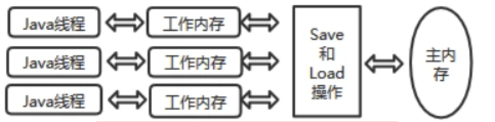
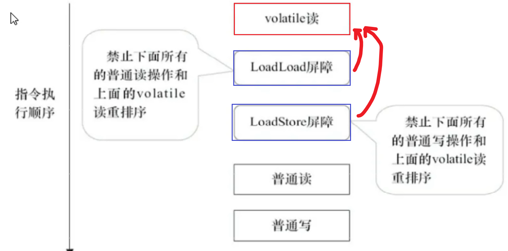

### Java锁

### 一、大厂面试题

- Synchronized相关问题
  1. Synchronized用过吗， 其原理是什么?
  
  2. 你刚才提到获取对象的锁，这个锁到底是什么?如何确定对象的锁?
  
     锁”的本质其实是 monitorenter 和 monitorexit 字节码指令的一个 Reference 类型的参数，即要锁定和解锁的对象。我们知道，使用 Synchronized 可以修饰不同的对象，因此，对应的对象锁可以这么确定。
  
     - 如果 Synchronized 明确指定了锁对象，比如 Synchronized（变量名）、Synchronized(this) 等，说明加解锁对象为该对象。
  
     - 如果没有明确指定： 若 Synchronized 修饰的方法为非静态方法，表示此方法对应的对象为锁对象； 若 Synchronized 修饰的方法为静态方法，则表示此方法对应的类对象为锁对象。 注意，当一个对象被锁住时，对象里面所有用 Synchronized 修饰的方法都将产生堵塞，而对象里非 Synchronized 修饰的方法可正常被调用，不受锁影响。
  
  3. 什么是可重入性，为什么说Synchronized是可重入锁?
  
     - 可重入性是锁的一个基本要求,是为了解决自 己锁死自己的情况 。比如，一个类中的同 步方法调用另一个同步方法 ，假如Synchronized不支持重入 ，进入method2方法时当前线程 获得锁 ，method2方法里面执行method1 时当前线程又要去尝试获取锁 ，这时如果不支持重 入 ，它就要等释放 ，把自己阻塞 ，导致自己锁死自己 。
     - synchronized是基于原子性的内部锁机制，是可重入的，因此在一个线程调用synchronized方法的同时在其方法体内部调用该对象另一个synchronized方法，也就是说一个线程得到一个对象锁后再次请求该对象锁，是允许的，这就是synchronized的可重入性。
  
  4. JVM对Java的原生锁做了哪些优化?
  
     - [自旋锁](https://so.csdn.net/so/search?q=自旋锁&spm=1001.2101.3001.7020)、自适应自旋锁、锁粗化、锁消除、偏向锁、轻量级锁
  
  5. 为什么说Synchronized是非公平锁?
  
  6. 什么是锁消除和锁粗化?
  
     - **锁粗化**：如果在一段代码中同一线程反复获取、释放同一个对象的锁，将会生产不必要的性能开销，所以需要把获锁的范围扩大，对同一个对象的锁操作只进行一次，在头部获取锁，在尾部释放锁。
     - **锁消除**：锁消除是指JIT在运行时分析到使用了锁的同步代码在实际运行时不可能存在共享数据被竞争的情况，对锁进行去除。例如如果一个局部变量在方法内部不可能被外部引用，那么它就不需要加锁控制，可以去掉锁。（注意：如果你的回答中提到了逃逸分析，面试官很有可能会问你什么是逃逸分析，提前做好准备）
  
  7. 为什么说Synchronized是个悲观锁?乐观锁的实现原理又是什么?什么是CAS， 它有
  
  8. 乐观锁一定就是好的吗
  
- 可重入锁Reentrant Lock及其他显式锁相关问题
  1. 跟Synchronized相比，可重入锁Reentrant Lock其实现原理有什么不同?
  2. 那么请谈谈AQS框架是怎么回事儿?
  3. 3.请尽可能详尽地对比下Synchronized和Reentrant Lock的异同。
  4. Reentrant Lock是如何实现可重入性的?

  

  ------

  

  1， 你怎么理解iava多线程的?怎么处理并发?线程池有那几个核心参数?
  2， Java加锁有哪几种锁?我先说了synchronized， 刚讲到偏向锁， 他就不让我讲了，
  3， 简单说说lock?
  4， hashmap的实现原理?hash冲突怎么解决?为什么使用红黑树?
  5， spring里面都使用了那些设计模式?循环依赖怎么解决?
  6，项目中那个地方用了countdown lan ch， 怎么使用的?

### 二、乐观锁和悲观锁

#### 2.1 悲观锁

- 悲观锁认为自己在使用数据的时候一定有别的线程来修改数据，因此在获取数据的时候会先加锁，确保数据不会被别的线程修改。
- 悲观锁的实现方式
  1. synchronized 关键字。
  2. Lock 的实现类都是悲观锁。

- 适合写操作多的场景，先加锁可以保证写操作时数据正确。显示的锁定之后在操作同步资源。

```java
//=============悲观锁的调用方式
public synchronized void m1()
{
    //加锁后的业务逻辑......
}

// 保证多个线程使用的是同一个lock对象的前提下
ReentrantLock lock = new ReentrantLock();
public void m2() {
    lock.lock();
    try {
        // 操作同步资源
    }finally {
        lock.unlock();
    }
}
```

#### 2.2 乐观锁

- 乐观锁认为自己在使用数据时不会有别的线程修改数据，所以不会添加锁，只是在更新数据的时候去判断之前有没有别的线程更新了这个数据。如果这个数据没有被更新，当前线程将自己修改的数据成功写入。如果数据已经被其他线程更新，则根据不同的实现方式执行不同的操作。

- 乐观锁的实现方式
  1. 版本号机制Version。（只要有人提交了就会修改版本号，可以解决ABA问题）
  2. ABA 问题：在CAS中想读取一个值A，想把值A变成C，不能保证读取时的A就是赋值时的A，中间可能有个线程将A变为B在变为A。
  3. **解决方法**：Juc包提供了一个`AtomicStampedReference`，原子更新带有版本号的引用类型，通过控制版本值的变化来解决ABA问题。

4. 最常采用的是CAS算法，Java原子类中的递增操作就通过CAS自旋实现的。

- 适合读操作多的场景，不加锁的性能特点能够使其操作的性能大幅提升。

```java
//=============乐观锁的调用方式
// 保证多个线程使用的是同一个AtomicInteger
private AtomicInteger atomicInteger = new AtomicInteger();
atomicInteger.incrementAndGet();

```

### 三、从8种情况演示锁的案例，看看我们到底锁的是什么

- 阿里巴巴代码规范
  - 【强制】高并发时，同步调用应该去考量锁的性能损耗。能用无锁数据结构，就不要用锁；能锁区块，就不要锁整个方法体；能用对象锁，就不要用类锁。
  - 说明：尽可能使加锁的代码块工作量尽可能的小，避免在锁代码块中调用 RPC 方法。

#### 3.1 锁演示

- 8锁案例

```java
class Phone{
    public static synchronized void sendEmail(){
        try {TimeUnit.SECONDS.sleep(3);} catch (InterruptedException e) {e.printStackTrace();}
        System.out.println("-------------sendEmail");

    }
    public  synchronized void sendSMS(){//static
        System.out.println("-------------sendSMS");
    }
    public void hello(){
        System.out.println("-------------hello");
    }
}

/**
 * - 题目：谈谈你对多线程锁的理解，8锁案例说明
 * - 口诀：线程 操作 资源类
 * 1. 标准访问有ab两个线程，请问先打印邮件还是短信?邮件
 * 2. a里面故意停3秒？邮件
 * 3. 添加一个普通的hello方法，请问先打印邮件还是hello？hello
 * 4. 有两部手机，请问先打印邮件（这里有个3秒延迟）还是短信?短信
 * 5.有两个静态同步方法（synchroized前加static,3秒延迟也在），有1部手机，先打印邮件还是短信？邮件
 * 6.两个手机，有两个静态同步方法（synchroized前加static,3秒延迟也在），有1部手机，先打印邮件还是短信？邮件
 * 7.一个静态同步方法，一个普通同步方法，请问先打印邮件还是手机？短信
 * 8.两个手机，一个静态同步方法，一个普通同步方法，请问先打印邮件还是手机？短信
 */
public class lock8 {
    public static void main(String[] args) {
        Phone phone = new Phone();
        Phone phone2 = new Phone();
        new Thread(()->{
            phone.sendEmail();
        },"a").start();

        //暂停毫秒，保证a线程先启动
        try {TimeUnit.MILLISECONDS.sleep(200);} catch (InterruptedException e) {e.printStackTrace();}

        new Thread(()->{
            phone.sendSMS();
        },"b").start();
    }
}

```

#### 3.2 锁原理

- 1.2中

  一个对象里面如果有多个synchronized方法，某一时刻内，只要一个线程去调用其中的一个synchronized方法了，其他的线程都只能是等待，换句话说，某一个时刻内，只能有唯一的一个线程去访问这些synchronized方法，锁的是当前对象this，被锁定后，其它的线程都不能 进入到当前对象的其他synchronized方法

- 3中

  hello并未和其他synchronized修饰的方法产生争抢

- 4 中

  锁在两个不同的对象/两个不同的资源上，不产生竞争条件

- 5.6中static+synchronized - 类锁  phone = new Phone();中 加到了左边的Phone上

  1. 对于普通同步方法，锁的是当前实例对象，通常指this，具体的一部部手机，所有的普通同步方法用的都是同一把锁→实例对象本身。

  2. 对于静态同步方法，锁的是当前类的Class对象，如Phone，class唯一的一个模板。
  3. 对于同步方法块，锁的是synchronized括号内的对象。synchronized(o)

- 7.8中一个加了对象锁，一个加了类锁，不产生竞争条件

#### 3.3 8锁-3个体现

- 8种锁的案例实际体现在3个地方-相当于总结
  - 作用域**实例方法**，当前实例加锁，进入同步代码块前要获得当前实例的锁。
  - 作用于**代码块**，对括号里配置的对象加锁。
  - 作用于**静态方法**，当前类加锁，进去同步代码前要获得当前类对象的锁

#### 3.4 字节码角度分析synchronized实现

文件反编译技巧
文件反编译javap -c ***.class文件反编译，-c表示对代码进行反汇编

假如需要更多信息 javap -v ***.class ，-v即-verbose输出附加信息（包括行号、本地变量表、反汇编等详细信息）

##### 3.4.1 synchronized同步代码块

```java
/**
 * 锁同步代码块
 */
public class LockSyncDemo {
    Object object = new Object();

    public void m1(){
        synchronized (object){
            System.out.println("-----hello synchronized code block");
        }
    }

    public static void main(String[] args) {

    }
}

```

- 从target中找到LockSyncDemo.class文件，右键，open in terminal，然后`javap -c LockSyncDemo.class`

```java
public class com.zhang.admin.controller.LockSyncDemo {
  java.lang.Object object;

  public com.zhang.admin.controller.LockSyncDemo();
    Code:
       0: aload_0
       1: invokespecial #1                  // Method java/lang/Object."<init>":()V
       4: aload_0
       5: new           #2                  // class java/lang/Object
       8: dup
       9: invokespecial #1                  // Method java/lang/Object."<init>":()V
      12: putfield      #3                  // Field object:Ljava/lang/Object;
      15: return

  public void m1();
    Code:
       0: aload_0
       1: getfield      #3                  // Field object:Ljava/lang/Object;
       4: dup
       5: astore_1
       6: monitorenter        //**注****------进入锁
       7: getstatic     #4                  // Field java/lang/System.out:Ljava/io/PrintStream;
      10: ldc           #5                  // String -----hello synchronized code block
      12: invokevirtual #6                  // Method java/io/PrintStream.println:(Ljava/lang/String;)V
      15: aload_1
      16: monitorexit        // **注**------退出锁
      17: goto          25
      20: astore_2
      21: aload_1
      22: monitorexit        //**注**-----这里又有一个exit???????以防出现异常，保证能够释放锁
      23: aload_2
      24: athrow
      25: return
    Exception table:
       from    to  target type
           7    17    20   any
          20    23    20   any

  public static void main(java.lang.String[]);
    Code:
       0: return
}

```

##### 3.4.2 总结

synchronized同步代码块，实现使用的是moniterenter和moniterexit指令（moniterexit可能有两个）

那一定是一个enter两个exit吗？（不一样，如果主动throw一个RuntimeException，发现一个enter，一个exit，还有两个athrow）


##### 3.4.3 synchronized普通同步方法

```java
/**
 * 锁普通的同步方法
 */
public class LockSyncDemo {

    public synchronized void m2(){
        System.out.println("------hello synchronized m2");
    }

    public static void main(String[] args) {

    }
}
```

- 类似于上述操作，最后调用`javap -v LockSyncDemo.class`

```java
.....
public synchronized void m2();
    descriptor: ()V
    flags: ACC_PUBLIC, ACC_SYNCHRONIZED //请注意该标志
    Code:
      stack=2, locals=1, args_size=1
         0: getstatic     #2                  // Field java/lang/System.out:Ljava/io/PrintStream;
         3: ldc           #3                  // String ------hello synchronized m2
         5: invokevirtual #4                  // Method java/io/PrintStream.println:(Ljava/lang/String;)V
         8: return
      LineNumberTable:
        line 11: 0
        line 12: 8
      LocalVariableTable:
        Start  Length  Slot  Name   Signature
            0       9     0  this   Lcom/zhang/admin/controller/LockSyncDemo;
......
```

##### 3.4.4 总结

- 调用指令将会检查方法的****访问标志是否被设置。如果设置了，执行线程会将先持有monitore然后再执行方法，最后在方法完成（无论是正常完成还是非正常完成）时释放monitor

##### 3.4.5 synchronized静态同步方法

```java
/**
 * 锁静态同步方法
 */
public class LockSyncDemo {

    public synchronized void m2(){
        System.out.println("------hello synchronized m2");
    }

    public static synchronized void m3(){
        System.out.println("------hello synchronized m3---static");
    }


    public static void main(String[] args) {

    }
}
```

- 和上面一样的操作

```java
 ......
 public static synchronized void m3();
    descriptor: ()V
    flags: ACC_PUBLIC, ACC_STATIC, ACC_SYNCHRONIZED //访问标志 区分该方法是否是静态同步方法
    Code:
      stack=2, locals=0, args_size=0
         0: getstatic     #2                  // Field java/lang/System.out:Ljava/io/PrintStream;
         3: ldc           #5                  // String ------hello synchronized m3---static
         5: invokevirtual #4                  // Method java/io/PrintStream.println:(Ljava/lang/String;)V
         8: return
      LineNumberTable:
        line 15: 0
        line 16: 8
......
```

- 总结
  - ******, ******访问标志区分该方法是否是静态同步方法。

#### 3.5 反编译synchronized锁的是什么

##### 3.5.1 概念-管程

- 管程概念
  1. **管程**：Monitor（监视器），也就是我们平时说的锁。监视器锁
  2. 信号量及其操作原语“封装”在一个对象内部）管程实现了在一个时间点，最多只有一个线程在执行管程的某个子程序。 管程提供了一种机制，管程可以看做一个软件模块，它是将共享的变量和对于这些共享变量的操作封装起来，形成一个具有一定接口的功能模块，进程可以调用管程来实现进程级别的并发控制。
  3. 执行线程就要求先成功持有管程，然后才能执行方法，最后当方法完成（无论是正常完成还是非正常完成）时释放管理。在方法执行期间，执行线程持有了管程，其他任何线程都无法再获取到同一个管程。
     

##### 3.5.2 为什么任何一个对象都可以成为一个锁？

- 溯源
  1. Java Object 类是所有类的父类，也就是说 Java 的所有类都继承了 Object，子类可以使用 Object 的所有方法。
  2. ObjectMonitor.java→ObjectMonitor.cpp→objectMonitor.hpp

ObjectMonitor.cpp中引入了头文件（include）objectMonitor.hpp

```java
140行
  ObjectMonitor() {
    _header       = NULL;
    _count        = 0; //用来记录该线程获取锁的次数
    _waiters      = 0,
    _recursions   = 0;//锁的重入次数
    _object       = NULL;
    _owner        = NULL; //------最重要的----指向持有ObjectMonitor对象的线程，记录哪个线程持有了我
    _WaitSet      = NULL; //存放处于wait状态的线程队列
    _WaitSetLock  = 0 ;
    _Responsible  = NULL ;
    _succ         = NULL ;
    _cxq          = NULL ;
    FreeNext      = NULL ;
    _EntryList    = NULL ;//存放处于等待锁block状态的线程队列
    _SpinFreq     = 0 ;
    _SpinClock    = 0 ;
    OwnerIsThread = 0 ;
    _previous_owner_tid = 0;
  }

```

- 追溯底层可以发现每个对象天生都带着一个**对象监视器**。

##### 3.5.3 提前熟悉锁升级

synchronized必须作用于某个对象中，所以Java在对象的头文件存储了锁的相关信息。锁升级功能主要依赖于 MarkWord 中的锁标志位和释放偏向锁标志位


#### 3.6 公平锁和非公平锁

3.6.1 ReentrantLock抢票案例

```java
class Ticket
{
    private int number = 30;
    ReentrantLock lock = new ReentrantLock();
    //ReentrantLock lock = new ReentrantLock(true);

    public void sale()
    {
        lock.lock();
        try
        {
            if(number > 0)
            {
                System.out.println(Thread.currentThread().getName()+"卖出第：\t"+(number--)+"\t 还剩下:"+number);
            }
        }catch (Exception e){
            e.printStackTrace();
        }finally {
            lock.unlock();
        }
    }
}


/**
 * @auther zzyy
 * @create 2022-05-14 17:26
 */
public class SaleTicketDemo
{
    public static void main(String[] args)
    {
        Ticket ticket = new Ticket();

        new Thread(() -> { for (int i = 0; i <35; i++)  ticket.sale(); },"a").start();
        new Thread(() -> { for (int i = 0; i <35; i++)  ticket.sale(); },"b").start();
        new Thread(() -> { for (int i = 0; i <35; i++)  ticket.sale(); },"c").start();
    }
}

```

##### 3.6.1 非公平锁

- 默认是非公平锁
- 非公平锁可以**插队**，买卖票不均匀。
- 是指多个线程获取锁的顺序并不是按照申请锁的顺序，有可能后申请的线程比先申请的线程优先获取锁，在高并发环境下，有可能造成优先级翻转或**饥饿的状态**（某个线程一直得不到锁）

##### 3.6.2 公平锁

- `ReentrantLock lock = new ReentrantLock(true);`
- 买卖票一开始a占优，后面a b c a b c a b c均匀分布
- 是指多个线程按照**申请锁的顺序**来获取锁，这里类似排队买票，先来的人先买后来的人在队尾排着，这是公平的。

##### 3.6.3 为什么会有公平锁/非公平锁的设计？为什么默认是非公平？

1. **恢复挂起的线程到真正锁的获取还是有时间差的**，从开发人员来看这个时间微乎其微，但是从CPU的角度来看，这个时间差存在的还是很明显的。所以非公平锁能更充分的利用CPU 的时间片，尽量减少 CPU 空闲状态时间。

2. 使用多线程很重要的考量点是线程切换的开销，当采用非公平锁时，当1个线程请求锁获取同步状态，然后释放同步状态，因为不需要考虑是否还有前驱节点，所以刚释放锁的线程在此刻再次获取同步状态的概率就变得非常大，所以就减少了线程的开销。
   

##### 3.6.4 什么时候用公平？什么时候用非公平？

如果为了更高的**吞吐量**，很显然非公平锁是比较合适的，因为**节省很多线程切换时间**，吞吐量自然就上去了；
否则那就用公平锁，大家公平使用。

#### 3.7 可重入锁（又名递归锁）

可重入锁又名递归锁

是指在同一个线程在外层方法获取锁的时候，再进入该线程的内层方法会自动获取锁(前提，锁对象得是同一个对象)，不会因为之前已经获取过还没释放而阻塞。

如果是1个有 synchronized 修饰的递归调用方法，程序第2次进入被自己阻塞了岂不是天大的笑话，出现了作茧自缚。

所以Java中`ReentrantLock`和`synchronized`都是可重入锁，可重入锁的一个优点是可一定程度避免死锁。

##### 3.7.1 可重入锁种类

- 隐式锁Synchronized

`synchronized`是java中的关键字，**默认**是**可重入锁**，即隐式锁

在同步块中

```java
public class ReEntryLockDemo {
    public static void main(String[] args)
    {
        final Object objectLockA = new Object();

        new Thread(() -> {
            synchronized (objectLockA)
            {
                System.out.println("-----外层调用");
                synchronized (objectLockA)
                {
                    System.out.println("-----中层调用");
                    synchronized (objectLockA)
                    {
                        System.out.println("-----内层调用");
                    }
                }
            }
        },"a").start();
    }
}
//-----外层调用
//-----中层调用
//-----内层调用
```

- 在同步方法中

```java
public class ReEntryLockDemo
{
    public synchronized void m1()
    {
        //指的是可重复可递归调用的锁，在外层使用之后，在内层仍然可以使用，并且不发生死锁，这样的锁就叫做可重入锁
        System.out.println(Thread.currentThread().getName()+"\t"+"-----come in m1");
        m2();
        System.out.println(Thread.currentThread().getName()+"\t-----end m1");
    }
    public synchronized void m2()
    {
        System.out.println("-----m2");
        m3();
    }
    public synchronized void m3()
    {
        System.out.println("-----m3");
    }

    public static void main(String[] args)
    {
        ReEntryLockDemo reEntryLockDemo = new ReEntryLockDemo();

        reEntryLockDemo.m1();
    }
}
/**
 * main  -----come in m1
 * -----m2
 * -----m3
 * main  -----end m1
 */

```

##### 3.7.2 Synchronized的重入实现机理

- 回看上方的`ObjectMoitor.hpp`

```java
140行
  ObjectMonitor() {
    _header       = NULL;
    _count        = 0; //用来记录该线程获取锁的次数
    _waiters      = 0,
    _recursions   = 0;//锁的重入次数
    _object       = NULL;
    _owner        = NULL; //------最重要的----指向持有ObjectMonitor对象的线程，记录哪个线程持有了我
    _WaitSet      = NULL; //存放处于wait状态的线程队列
    _WaitSetLock  = 0 ;
    _Responsible  = NULL ;
    _succ         = NULL ;
    _cxq          = NULL ;
    FreeNext      = NULL ;
    _EntryList    = NULL ;//存放处于等待锁block状态的线程队列
    _SpinFreq     = 0 ;
    _SpinClock    = 0 ;
    OwnerIsThread = 0 ;
    _previous_owner_tid = 0;
  }
```

- ObjectMoitor.hpp底层：每个锁对象拥有一个锁计数器和一个指向持有该锁的线程的指针。_count _owner

- 首次加锁：当执行monitorenter时，如果目标锁对象的计数器为零，那么说明它没有被其他线程所持有，Java虚拟机会将该锁对象的持有线程设置为当前线程，并且将其计数器加1。

- 重入：在目标锁对象的计数器不为零的情况下，如果锁对象的持有线程是当前线程，那么 Java 虚拟机可以将其计数器加1，否则需要等待，直至持有线程释放该锁。

- 释放锁：当执行monitorexit时，Java虚拟机则需将锁对象的计数器减1。计数器为零代表锁已被释放
  

##### 3.7.3 显式锁Lock

- 显式锁（即Lock）也有ReentrantLock这样的可重入锁

> 感觉所谓的显式隐式即是指显示/隐式的调用锁

- 注意：`lock` `unlock`要**成对**

```java
public class ReEntryLockDemo {
    static Lock lock = new ReentrantLock();
    public static void main(String[] args) {

        {
            new Thread(() -> {
                lock.lock();
                try {
                    System.out.println(Thread.currentThread().getName() + "\t----come in 外层调用");
                    lock.lock();
                    try {
                        System.out.println(Thread.currentThread().getName() + "\t------come in 内层调用");
                    } finally {
                        lock.unlock();
                    }
                } finally {
                    lock.unlock();
                }
            }, "t1").start();
        }
    }
}
//t1  ----come in 外层调用
//t1  ------come in 内层调用
```

- 假如`lock` `unlock`不成对，单线程情况下问题不大，但**多线程下出问题**

```java
public class ReEntryLockDemo {
    static Lock lock = new ReentrantLock();
    public static void main(String[] args) {

            new Thread(() -> {
                lock.lock();
                try {
                    System.out.println(Thread.currentThread().getName() + "\t----come in 外层调用");
                    lock.lock();
                    try {
                        System.out.println(Thread.currentThread().getName() + "\t------come in 内层调用");
                    } finally {
                        lock.unlock();
                    }
                } finally {
                    //lock.unlock();//-------------------------不成对|多线程情况
                }
            }, "t1").start();

        new Thread(() -> {
            lock.lock();
            try
            {
                System.out.println("t2 ----外层调用lock");
            }finally {
                lock.unlock();
            }
        },"t2").start();

    }
}
//t1  ----come in 外层调用
//t1  ------come in 内层调用
//(t2 ----外层调用lock 假如不成对，这句话就不显示了)
```

3.7.4 死锁及排查

- 死锁
  1. 是指两个或两个以上的线程在执行过程中,因争夺资源而造成的一种互相等待的现象,若无外力干涉那它们都将无法推进下去，如果系统资源充足，进程的资源请求都能够得到满足，死锁出现的可能性就很低，否则就会因争夺有限的资源而陷入死锁。
  2. a跟b两个资源互相请求对方的资源

- 死锁产生的原因
  1. 系统资源不足
  2. 进程运行推进的顺序不合适
  3. 资源分配不当
     

```java
public class DeadLockDemo {
    public static void main(String[] args) {
        Object object1 = new Object();
        Object object2 = new Object();

        new Thread(()->{
            synchronized (object1){
                System.out.println(Thread.currentThread().getName()+"\t 持有a锁，想获得b锁");
                try {TimeUnit.SECONDS.sleep(1);} catch (InterruptedException e) {e.printStackTrace();}//使得线程b也启动
                synchronized (object2){
                    System.out.println(Thread.currentThread().getName()+"\t 成功获得b锁");
                }
            }
        },"A").start();

        new Thread(()->{
            synchronized (object2){
                System.out.println(Thread.currentThread().getName()+"\t 持有b锁，想获得a锁");
                synchronized (object1){
                    System.out.println(Thread.currentThread().getName()+"\t 成功获得a锁");
                }
            }
        },"B").start();
    }

}
```

##### 3.7.4 如何排查死锁

**纯命令**

- `jps -l` 查看当前进程运行状况
- `jstack 进程编号` 查看该进程信息


#### 3.8 小总结-重要

指针指向monitor对象（也称为管程或监视器锁）的起始地址。每个对象都存在着一个monitor与之关联，当一个monitor被某个线程持有后，它便处于锁定状态。在Java虚拟机(HotSpot)中，monitor是由ObjectMonitor实现的，其主要数据结构如下（位于HotSpot虚拟机源码ObjectMonitor.hpp,C++实现的）


### 四、LockSupport与线程中断

#### 4.1 线程中断机制


| void           | interrupt()     | 中断此线程               |
| -------------- | --------------- | ------------------------ |
| static boolean | interrupted()   | 测试当前线程是否已被中断 |
| boolean        | isInterrupted() | 测试此线程是否已经被中断 |

- 三个方法了解过吗？用在哪？
- 如何停止一个运行中的线程？
- 如何中断一个运行中的线程？？

#### 4.2 什么是中断机制？

- 首先

一个线程不应该由其他线程来强制中断或停止，而是应该由线程自己自行停止。所以，Thread.stop, Thread.suspend, Thread.resume 都已经被废弃了。

- 其次

在Java中没有办法立即停止一条线程，然而停止线程却显得尤为重要，如取消一个耗时操作。

因此，Java提供了一种用于停止线程的协商机制——中断。

中断只是一种协作协商机制，Java没有给中断增加任何语法，中断的过程完全需要程序员自己实现。

若要中断一个线程，你需要手动调用该线程的interrupt方法，该方法也仅仅是将线程对象的中断标识设成true；

接着你需要自己写代码不断地检测当前线程的标识位，如果为true，表示别的线程要求这条线程中断，

此时究竟该做什么需要你自己写代码实现。每个线程对象中都有一个标识，用于表示线程是否被中断；该标识位为true表示中断，为false表示未中断；

通过调用线程对象的interrupt方法将该线程的标识位设为true；可以在别的线程中调用，也可以在自己的线程中调用。

- eg.顾客在无烟餐厅中吸烟，服务员希望他别吸烟了，不是强行停止他吸烟，而是给他的标志位打为true，具体的停止吸烟还是要顾客自己停止。（体现了协商机制）


| **public void interrupt()**         | **实例方法，实例方法interrupt()仅仅是设置线程的中断状态为true，发起一个协商而不会立刻停止线程** |
| ----------------------------------- | ------------------------------------------------------------ |
| public static boolean interrupted() | 静态方法，`Thread.interrupted();`判断线程是否被中断，并清除当前中断状态这个方法做了**两件事**：1 返回当前线程的中断状态。2 将当前线程的中断状态设为false（这个方法有点不好理解，因为连续调用两次的结果可能不一样。） |
| public boolean isInterrupted()      | 实例方法，判断当前线程是否被中断（通过检查中断标志位）       |

#### 4.3 如何使用中断标识停止线程？

##### 4.3.1 通过一个volatile变量实现

- volatile保证了可见性，t2修改了标志位后能马上被t1看到

```java
public class interruptDemo {
    static volatile boolean isStop = false;

    public static void main(String[] args) {
        new Thread(()->{
            while(true){
                if(isStop){//如果这个标志位被其他线程改为true了
                    System.out.println(Thread.currentThread().getName()+"\t isStop被修改为true，程序终止");
                    break;
                }
                System.out.println("t1 ------hello volatile");//----------------------如果没停止，那就一直打印
            }
        },"t1").start();

        try {TimeUnit.MILLISECONDS.sleep(20);} catch (InterruptedException e) {e.printStackTrace();}

        new Thread(()->{
            isStop = true;
        },"t2").start();
    }
}
//--
//t1 ------hello volatile
//t1 ------hello volatile
//t1 ------hello volatile
//t1 ------hello volatile
//t1 ------hello volatile
//t1 ------hello volatile
//t1 ------hello volatile
//t1   isStop被修改为true，程序终止
```

##### 4.3.2 通过AtomicBoolean（原子布尔型）

```java
public class interruptDemo {

    static AtomicBoolean atomicBoolean = new AtomicBoolean(false);

    public static void main(String[] args) {
        m1_volatile();
    }

    public static void m1_volatile() {
        new Thread(()->{
            while(true){
                if(atomicBoolean.get()){//如果这个标志位被其他线程改为true了
                    System.out.println(Thread.currentThread().getName()+"\t isStop被修改为true，程序终止");
                    break;
                }
                System.out.println("t1 ------hello volatile");//----------------------如果没停止，那就一直打印
            }
        },"t1").start();

        try {TimeUnit.MILLISECONDS.sleep(20);} catch (InterruptedException e) {e.printStackTrace();}

        new Thread(()->{
            atomicBoolean.set(true);
        },"t2").start();
    }
}
//t1 ------hello volatile
//t1 ------hello volatile
//t1 ------hello volatile
//t1 ------hello volatile
//t1 ------hello volatile
//t1 ------hello volatile
//t1   isStop被修改为true，程序终止
```

##### 4.3.3 通过Thread类自带的中断api方法实现

```java
    //默认的中断标志位是false，然后被改为了true
    public static void main(String[] args) {
        m1_volatile();
    }

    public static void m1_volatile() {
        Thread t1 = new Thread(() -> {
            while (true) {
                if (Thread.currentThread().isInterrupted()) {//一旦发现中断标志位被修改
                    System.out.println(Thread.currentThread().getName() + "\t isInterrupted()被修改为true，程序终止");
                    break;
                }
                System.out.println("t1 ------hello interrupt ");//----------------------如果没停止，那就一直打印
            }
        }, "t1");
        t1.start();

        try {TimeUnit.MILLISECONDS.sleep(20);} catch (InterruptedException e) {e.printStackTrace();}

        new Thread(()->{
            t1.interrupt();//把t1中断
        },"t2").start();
    }
}

//t1 ------hello interrupt 
//t1 ------hello interrupt 
//t1 ------hello interrupt 
//t1 ------hello interrupt 
//t1 ------hello interrupt 
//t1 ------hello interrupt 
//t1 ------hello interrupt 
//t1 ------hello interrupt 
//t1 ------hello interrupt 
//t1   isInterrupted()被修改为true，程序终止
```

#### 4.4 API源码分析

**实例方法interrupt()，没有返回值**

```java
//Thread.java
public void interrupt() {
        if (this != Thread.currentThread())
            checkAccess();

        synchronized (blockerLock) {
            Interruptible b = blocker;
            if (b != null) {
                interrupt0();           // Just to set the interrupt flag----调用了interrupt0（）方法
                b.interrupt(this);
                return;
            }
        }
        interrupt0();
    }
```

```java
//Thread.java
    /* Some private helper methods */
    private native void setPriority0(int newPriority);
    private native void stop0(Object o);
    private native void suspend0();
    private native void resume0();
    private native void interrupt0();  //---------------------------调用了c底层
    private native void setNativeName(String name);
```

**实例方法isInterrupted，返回布尔值**

```java
    //Thread.java
    public boolean isInterrupted() {
        return isInterrupted(false);
    }

```

```java
    //Thread.java
    private native boolean isInterrupted(boolean ClearInterrupted);//也调用了c底层
```

**说明**

- 具体来说，当对一个线程，调用 interrupt() 时：
  1. 如果线程处于正常活动状态，那么会将该线程的中断标志设置为 true，仅此而已。被设置中断标志的线程将继续正常运行，不受影响。所以， interrupt() 并不能真正的中断线程，需要被调用的线程自己进行配合才行。
  2. ② 如果线程处于被阻塞状态（例如处于sleep, wait, join 等状态），在别的线程中调用当前线程对象的interrupt方法，那么线程将立即退出被阻塞状态（中断状态将被清除），并抛出一个InterruptedException异常。
  3. （中断不活动的线程不会产生任何影响，看下面案例）
     

#### 4.5 当前线程的中断标识为true，是不是线程就立刻停止？

- **否**
  - 仅仅设置了一个中断状态
- 看看中断是否会立即停止这个300的线程
  - 否，虽然中断标志位变了。但是i一直在循环

```java
public class InterruptDemo02 {
    public static void main(String[] args) {
        Thread t1 = new Thread(()->{
            for(int i = 0;i < 300;i ++){
                System.out.println("---------" + i);
            }
            System.out.println("after t1.interrupt()---第2次----"+Thread.currentThread().isInterrupted());
        },"t1");
        t1.start();
        System.out.println("before t1.interrupt()----"+t1.isInterrupted());
        t1.interrupt();
        try {TimeUnit.MILLISECONDS.sleep(3);} catch (InterruptedException e) {e.printStackTrace();}
        System.out.println("after t1.interrupt()---第1次---"+t1.isInterrupted());
        try {TimeUnit.MILLISECONDS.sleep(3000);} catch (InterruptedException e) {e.printStackTrace();}
        System.out.println("after t1.interrupt()---第3次---"+t1.isInterrupted());
    }
}
//before t1.interrupt()----false
//---------0
//---------1
//---------2
//---------3
//....
//---------136
//after t1.interrupt()---第1次---true    ------此处中断标志位设置为了true,但是t1仍然在运行
//---------137
//---------298
//---------299
//after t1.interrupt()---第2次----true
//after t1.interrupt()---第3次---false//中断不活动的线程不会产生任何影响，线程结束后应该是自动变为了false

```

#### 后手案例-深入

- 在我们基本中断程序的骨架上 + 一个sleep阻塞
- 中断异常 且 会导致程序无限循环.

```java
public class InterruptDemo03 {
    public static void main(String[] args) {
        Thread t1 =  new Thread(()->{
            while(true){
                if(Thread.currentThread().isInterrupted()){
                    System.out.println(Thread.currentThread().getName()+"\t"+
                            "中断标志位："+Thread.currentThread().isInterrupted()+"程序终止");
                    break;
                }
                try {
                    Thread.sleep(200);
                } catch (InterruptedException e) {
                    e.printStackTrace();
                    // Thread.currentThread().interrupt();  假如加了这个，程序可以终止，只会爆异常
                }
                System.out.println("-----hello InterruptDemo03");
            }
        },"t1");
        t1.start();
        try {TimeUnit.MILLISECONDS.sleep(1);} catch (InterruptedException e) {e.printStackTrace();}
        new Thread(() -> t1.interrupt()).start();
    }
}
//爆异常了，并且程序一直在跑
//java.lang.InterruptedException: sleep interrupted
//  at java.lang.Thread.sleep(Native Method)
//-----hello InterruptDemo03
//-----hello InterruptDemo03
//-----hello InterruptDemo03
//......
//----------------------------
//---------加了Thread.currentThread().interrupt();
//java.lang.InterruptedException: sleep interrupted
// at java.lang.Thread.sleep(Native Method)
//  at com.zhang.admin.controller.InterruptDemo03.lambda$main$0(InterruptDemo03.java:15)
//  at java.lang.Thread.run(Thread.java:748)
//-----hello InterruptDemo03
//t1  中断标志位：true程序终止
```

- 前文
  1. ② 如果线程处于被阻塞状态（例如处于sleep, wait, join 等状态），在别的线程中调用当前线程对象的`interrupt`方法，那么线程将**立即退出被阻塞状态**（中断状态将被清除），并抛出一个InterruptedException异常。

```java
/**
 * 1 中断标志位 默认是false
 * 2 t2 ----->t1发出了中断协商，t2调用t1.interrupt()，中断标志位true
 * 3 中断标志位true，正常情况下，程序停止，^-^
 * 4 中断标志位true，异常情况下，InterruptedException，将会把中断状态清除，并且将收到InterruptedException。中断标志位false导致无限循环。
 * 
 * 5 在catch块中，需要再次给中断标志位设置为true，2次调用停止
 */
```

```java
sleep方法抛出InterruptedException后，中断标识也被清空置为false,我们在catch没有通过th.interrupt()方法再次将中断标志设置为true，这就导致无限循环了
```

##### 4.5.1 小总结

- 中断只是一种协同机制，修改中断标识位仅此而已，而不是立刻stop打断

#### 4.6 静态方法Thread.interrupted()，谈谈你的理解

- api里的第二个

  1. public static boolean interrupted()

  2. 静态方法，Thread.interrupted();判断线程是否被中断，并清除当前中断状态这个方法做了两件事：1 返回当前线程的中断状态2 将当前线程的中断状态设为false（这个方法有点不好理解，因为连续调用两次的结果可能不一样。）
     

```java
public class InterruptDemo04 {
    public static void main(String[] args) {
        System.out.println(Thread.currentThread().getName()+"\t"+Thread.interrupted());
        System.out.println(Thread.currentThread().getName()+"\t"+Thread.interrupted());
        System.out.println("-----1");
        Thread.currentThread().interrupt();//中断标志位设置为true
        System.out.println("-----2");
        System.out.println(Thread.currentThread().getName()+"\t"+Thread.interrupted());
        System.out.println(Thread.currentThread().getName()+"\t"+Thread.interrupted());
    }
}
//main  false
//main  false
//-----1
//-----2
//main  true
//main  false

```

- 看下源码，`interrupted()`对比`isInterrupted()`

```java
public static boolean interrupted() {
        return currentThread().isInterrupted(true);
    }
    
private native boolean isInterrupted(boolean ClearInterrupted);

```

```java
public boolean isInterrupted() {
        return isInterrupted(false);
    }

private native boolean isInterrupted(boolean ClearInterrupted);

```

- 他们在底层都调用了native方法isInterrupted。

- 只不过传入参数ClearInterrupted一个传参传了true，一个传了false。
  1. 静态方法interrupted() 中true表示清空当前中断状态。
  2. 实例方法isInterrupted 则不会。
     

#### 4.7 LockSupport是什么

- 官方解释：用于创建锁和其他同步类的基本线程阻塞原语。

- 核心就是park()和unpark()方法
  1. park()方法是阻塞线程
  2. unpark()方法是解除阻塞线程
     


##### 4.7.1 线程等待唤醒机制

3种让线程等待和唤醒的方法

- 使用Object中的wait()方法让线程等待，使用Object中的notify()方法唤醒线程

- 使用JUC包中Condition的await()方法让线程等待，使用signal()方法唤醒线程

- LockSupport类可以阻塞当前线程以及唤醒指定被阻塞的线程。


##### 4.7.2 Object类中的wait和notify方法实现线程等待和唤醒

```java
public class LockSupportDemo
{
    public static void main(String[] args)
    {
        Object objectLock = new Object();

        new Thread(() -> {
            synchronized (objectLock) {
                System.out.println(Thread.currentThread().getName()+"\t ---- come in");
                try {
                    objectLock.wait();//----------------------这里先让他等待
                } catch (InterruptedException e) {
                    e.printStackTrace();
                }
            }
            System.out.println(Thread.currentThread().getName()+"\t"+"---被唤醒了");
        },"t1").start();

        //暂停几秒钟线程
        try { TimeUnit.SECONDS.sleep(3L); } catch (InterruptedException e) { e.printStackTrace(); }

        new Thread(() -> {
            synchronized (objectLock) {
                objectLock.notify();//-------------------------再唤醒它
                System.out.println(Thread.currentThread().getName()+"\t ---发出通知");
            }
        },"t2").start();
    }
}
//t1   ---- come in
//t2   ---发出通知
//t1  ---被唤醒了
```

**异常1**—去掉synchronized

- 说明要使用`wait`和`notify`必须加`synchronized`

```java
public class LockSupportDemo
{
    public static void main(String[] args)
    {
        Object objectLock = new Object();

        new Thread(() -> {
        //    synchronized (objectLock) {
                System.out.println(Thread.currentThread().getName()+"\t ---- come in");
                try {
                    objectLock.wait();
                } catch (InterruptedException e) {
                    e.printStackTrace();
                }
      //      }
            System.out.println(Thread.currentThread().getName()+"\t"+"---被唤醒了");
        },"t1").start();

        //暂停几秒钟线程
        try { TimeUnit.SECONDS.sleep(3L); } catch (InterruptedException e) { e.printStackTrace(); }

        new Thread(() -> {
       //     synchronized (objectLock) {
                objectLock.notify();
                System.out.println(Thread.currentThread().getName()+"\t ---发出通知");
       //     }
        },"t2").start();
    }
}
//t1   ---- come in
//Exception in thread "t1" java.lang.IllegalMonitorStateException
//  at java.lang.Object.wait(Native Method)
//  at java.lang.Object.wait(Object.java:502)
//  at com.zhang.admin.controller.LockSupportDemo.lambda$main$0(LockSupportDemo.java:15)
//  at java.lang.Thread.run(Thread.java:748)
```

**异常2**—把notify和wait的执行顺序对换

- 说明顺序不能对换

```java
public class LockSupportDemo
{
    public static void main(String[] args)
    {
        Object objectLock = new Object();

        new Thread(() -> {
            try { TimeUnit.SECONDS.sleep(1); } catch (InterruptedException e) { e.printStackTrace(); }
            synchronized (objectLock) {
                System.out.println(Thread.currentThread().getName()+"\t ---- come in");
                try {
                    objectLock.wait();
                } catch (InterruptedException e) {
                    e.printStackTrace();
                }
            }
            System.out.println(Thread.currentThread().getName()+"\t"+"---被唤醒了");
        },"t1").start();


        new Thread(() -> {
            synchronized (objectLock) {
                objectLock.notify();//这个先执行了
                System.out.println(Thread.currentThread().getName()+"\t ---发出通知");
            }
        },"t2").start();
    }
}
//一直处于循环中
```

##### 4.7.3 小总结

- wait和notify方法必须要在**同步**块或者方法里面，且**成对**出现使用
- 先wait后notify才OK,**顺序**

##### 4.7.4 Condition接口中的await后signal方法实现线程的等待和唤醒

- 正常

```java
public class LockSupportDemo
{
    public static void main(String[] args)
    {
        Lock lock = new ReentrantLock();
        Condition condition = lock.newCondition();

        new Thread(() -> {
            lock.lock();
            try
            {
                System.out.println(Thread.currentThread().getName()+"\t-----come in");
                condition.await();
                System.out.println(Thread.currentThread().getName()+"\t -----被唤醒");
            } catch (InterruptedException e) {
                e.printStackTrace();
            } finally {
                lock.unlock();
            }
        },"t1").start();

        //暂停几秒钟线程
        try { TimeUnit.SECONDS.sleep(1); } catch (InterruptedException e) { e.printStackTrace(); }

        new Thread(() -> {
            lock.lock();
            try
            {
                condition.signal();
            } catch (Exception e) {
                e.printStackTrace();
            } finally {
                lock.unlock();
            }
            System.out.println(Thread.currentThread().getName()+"\t"+"我要进行唤醒");
        },"t2").start();

    }
}
//t1  -----come in
//t2  我要进行唤醒
//t1   -----被唤醒
```

- 异常1原理同上
  - 仍然返回`IllegalMonitorStateException`
- 异常2 原理同上
  - 仍然在不停的循环

##### 4.7.5 小总结

- `await`和`notify`类似于上面`wait`和`notify`
  - Condition中的线程等待和唤醒方法，需要先获取锁
  - 一定要先await后signal，不能反了

##### 4.7.6 Object和Condition使用的限制条件

- 总结
  - 线程先要获得并持有锁，必须在锁块（synchronized或lock）中
  - 必须要先等待后唤醒，线程才能够被唤醒

##### 4.7.7 LockSupport类中的park等待和unpark唤醒

**是什么**：通过`park()`和`unpark(thread)`方法来实现阻塞和唤醒线程的操作

**官网解释**

- LockSupport是用来创建锁和其他同步类的基本线程阻塞原语。

- LockSupport类使用了一种名为Permit（许可） 的概念来做到阻塞和唤醒线程的功能， 每个线程都有一个许可(permit)，

- permit（许可）只有两个值1和0，默认是0。0 是阻塞，1是唤醒

- 可以把许可看成是一种(0,1)信号量（Semaphore），但与 Semaphore 不同的是，许可的累加上限是1。

**API**


**阻塞**

- `park()/park(Object blocker)`
- 调用`LockSupport.park()`时，发现它调用了`unsafe类`，并且默认传了一个0

```java
public static void park() {
        UNSAFE.park(false, 0L);
    }
```

- permit默认是零，所以一开始调用park()方法，当前线程就会阻塞，直到别的线程将当前线程的permit设置为1时，park方法会被唤醒，
  然后会将permit再次设置为零并返回。

**唤醒**

- 调用`LockSupport.unpark();`时，也调用了`unsafe类`

```java
public static void unpark(Thread thread) {
        if (thread != null)
            UNSAFE.unpark(thread);
    }

```

- 调用unpark(thread)方法后，就会将thread线程的许可permit设置成**1**(注意多次调用unpark方法，不会累加，permit值还是1)会自动唤醒thread线程，即之前阻塞中的LockSupport.park()方法会立即返回。

##### 4.7.8 代码

- 正常+无锁块要求

```java
public class LockSupportDemo
{
    public static void main(String[] args) {
        Thread t1 = new Thread(()->{
            System.out.println(Thread.currentThread().getName()+"\t----------come in");
            LockSupport.park();
            System.out.println(Thread.currentThread().getName()+"\t----------被唤醒了");
        },"t1");
        t1.start();

        new Thread(()->{
            LockSupport.unpark(t1);
            System.out.println(Thread.currentThread().getName()+"\t-----发出通知，去唤醒t1");
        },"t2").start();
    }
}
//t1  ----------come in
//t2  -----发出通知，去唤醒t1
//t1  ----------被唤醒了
```

- 之前错误的先唤醒后等待，LockSupport照样支持

```java
public class LockSupportDemo
{
    public static void main(String[] args) {
        Thread t1 = new Thread(()->{
            try {TimeUnit.SECONDS.sleep(3);} catch (InterruptedException e) {e.printStackTrace();}
            System.out.println(Thread.currentThread().getName()+"\t----------come in"+"\t"+System.currentTimeMillis());
            LockSupport.park();
            System.out.println(Thread.currentThread().getName()+"\t----------被唤醒了"+"\t"+System.currentTimeMillis());
        },"t1");
        t1.start();

        new Thread(()->{
            LockSupport.unpark(t1);
            System.out.println(Thread.currentThread().getName()+"\t-----发出通知，去唤醒t1");
        },"t2").start();
    }
}
//t2  -----发出通知，去唤醒t1
//t1  ----------come in  1654750785663
//t1  ----------被唤醒了  1654750785663

```

> sleep方法3秒后醒来，执行park无效，没有阻塞效果，解释如下。先执行了unpark(t1)导致上面的park方法形同虚设无效，**时间是一样的**
> \- 类似于高速公路的ETC，提前买好了通行证unpark，到闸机处直接抬起栏杆放行了，没有park拦截了。

##### 4.7.9. 最后

- 许可证是只要一个的 

```java
public class LockSupportDemo
{
    public static void main(String[] args) {
        Thread t1 = new Thread(()->{
            try {TimeUnit.SECONDS.sleep(3);} catch (InterruptedException e) {e.printStackTrace();}
            System.out.println(Thread.currentThread().getName()+"\t----------come in"+"\t"+System.currentTimeMillis());
            LockSupport.park();
            LockSupport.park();
            System.out.println(Thread.currentThread().getName()+"\t----------被唤醒了"+"\t"+System.currentTimeMillis());
        },"t1");
        t1.start();

        new Thread(()->{
            LockSupport.unpark(t1);
            LockSupport.unpark(t1);
            System.out.println(Thread.currentThread().getName()+"\t-----发出通知，去唤醒t1");
        },"t2").start();
    }
}
//t2  -----发出通知，去唤醒t1
//t1  ----------come in  1654750970677--------------------卡在这里了

```

##### 4.7.10 小总结

Lock Support是用来创建锁和其他同步类的基本线程阻塞原语。
Lock Support是一个线程阻塞工具类， 所有的方法都是静态方法， 可以让线程在任意位置阻塞， 阻塞之后也有对应的唤醒方法。归根结
底， Lock Support调用的Unsafe中的native代码。

Lock Support提供park() 和unpark() 方法实现阻塞线程和解除线程阻塞的过程
Lock Support和每个使用它的线程都有一个许可(permit) 关联。
每个线程都有一个相关的permit， permit最多只有一个， 重复调用un park也不会积累凭证。

**形象的理解**
线程阻塞需要消耗凭证(permit) ， 这个凭证最多只有1个。

当调用方法时

如果有凭证，则会直接消耗掉这个凭证然后正常退出；
如果无凭证，就必须阻塞等待凭证可用；
而则相反， 它会增加一个凭证， 但凭证最多只能有1个， 累加无效。

**面试题**

- 为什么可以突破wait/notify的原有调用顺序?
  因为un park获得了一个凭证， 之后再调用park方法， 就可以名正言顺的凭证消费， 故不会阻塞。
  先发放了凭证后续可以畅通无阻。

- 为什么唤醒两次后阻塞两次，但最终结果还会阻塞线程?
  因为凭证的数量最多为1， 连续调用两次un park和调用一次un park效果一样， 只会增加一个凭证；
  而调用两次park却需要消费两个凭证， 证不够， 不能放行。

### 五、Java内存模型JMM

#### 5.1 面试题

- 你知道什么是Java内存模型JMM吗？
- JMM与volatile它们两个之间的关系？（下一章详细讲解）
- JMM有哪些特性or它的三大特性是什么？
- 为什么要有JMM，它为什么出现？作用和功能是什么？
- happens-before先行发生原则你有了解过吗？

#### 5.2 计算机硬件存储体系

计算机存储结构，从本地磁盘到主存到CPU缓存，也就是从硬盘到内存，到CPU。
一般对应的程序的操作就是从数据库查数据到内存然后到CPU进行计算


因为有这么多级的缓存(cpu和物理主内存的速度不一致的)，
CPU的运**行并不是直接操作内存而是先把内存里边的数据读到缓存**，而内存的读和写操作的时候就会造成不一致的问题。


#### 5.3 Java内存模型Java Memory Model

- JMM

JMM(Java内存模型Java Memory Model，简称JMM)本身是一种抽象的概念并不真实存在它仅仅描述的是一组约定或规范，通过这组规范定义了程序中(尤其是多线程)各个变量的读写访问方式并决定一个线程对共享变量的写入何时以及如何变成对另一个线程可见，关键技术点都是围绕多线程的原子性、可见性和有序性展开的。

- 原则：

JMM的关键技术点都是围绕多线程的**原子性**、**可见性**和**有序性**展开的

- 能干嘛？

1. 通过JMM来实现线程和主内存之间的抽象关系。

2. 屏蔽各个**硬件平台**和**操作系统**的内存访问差异以实现让Java程序在各种平台下都能达到一致的内存访问效果。

#### 5.4 JMM规范下，三大特性

##### 5.4.1 原子性

- 指一个操作是不可中断的，即多线程环境下，操作不能被其他线程干扰

##### 5.4.2 可见性

- 可见性
  - 是指当一个线程修改了某一个共享变量的值，其他线程是否能够立即知道该变更 ，JMM规定了所有的变量都存储在主内存中。


- Java中普通的共享变量不保证可见性，因为数据修改被写入内存的时机是不确定的，多线程并发下很可能出现"脏读"，所以每个线程都有自己的工作内存，线程自己的工作内存中保存了该线程使用到的变量的主内存副本拷贝，线程对变量的所有操作（读取，赋值等 ）都必需在线程自己的工作内存中进行，而不能够直接读写主内存中的变量。不同线程之间也无法直接访问对方工作内存中的变量，线程间变量值的传递均需要通过主内存来完成
  


- 如果没有保证可见性
  1. 导致-线程脏读
  2. 例子
     - 主内存中有变量 x，初始值为 0
     - 线程 A 要将 x 加 1，先将 x=0 拷贝到自己的私有内存中，然后更新 x 的值
     - 线程 A 将更新后的 x 值回刷到主内存的时间是不固定的
     - 刚好在线程 A 没有回刷 x 到主内存时，线程 B 同样从主内存中读取 x，此时为 0，和线程 A 一样的操作，最后期盼的 x=2 就会变成 x=1
       

##### 5.4.3 有序性

- 有序性牵扯到指令
- 这里给一个案例

```java
public void mySort()
{
    int x = 11; //语句1
    int y = 12; //语句2
    x = x + 5;  //语句3
    y = x * x;  //语句4
}
 
  1234
  2134
  1324
 
问题：请问语句4可以重排后变成第一个条吗？
```

- 有序性是什么？
  对于一个线程的执行代码而言，我们总是习惯性认为代码的执行总是从上到下，有序执行。但为了提供性能，编译器和处理器通常会对指令序列进行重新排序。Java规范规定JVM线程内部维持顺序化语义，即只要程序的最终结果与它顺序化执行的结果相等，那么指令的执行顺序可以与代码顺序不一致，此过程叫指令的重排序。

- 优缺点

JVM能根据处理器特性（CPU多级缓存系统、多核处理器等）适当的机器对指令进行重排序，使得机器指令能更符合CPU的执行特性，最大限度的发挥机器性能。但是

**指令重排**可以保证**串行**语义一致，但没有义务保证**多线程间**的语义也一致（即可能产生“脏读”），简单说，两行以上不相干的代码在执行的时候有可能先执行的不是第一条，不见得是从上到下顺序执行，执行顺序会被优化。

- 指令重排的**三种表现（层面）**
  1. 编译器优化的重排
  2. 指令并行的重排
  3. 内存系统的重排


- 小总结

  **单线程**环境里面确保程序最终执行结果和代码顺序执行的**结果一致**。
  处理器在进行重排序时必须要考虑指令之间的**数据依赖性**

  **多线程**环境中线程交替执行,由于编译器优化重排的存在，两个线程中使用的变量能否保证一致性是**无法确定的,结果无法预测**

#### 5.5 JMM规范下，多线程对变量的读写过程

- 读取过程

由于JVM运行程序的实体是线程，而每个线程创建时JVM都会为其创建一个工作内存(有些地方称为栈空间)，工作内存是每个线程的私有数据区域，而Java内存模型中规定所有变量都存储在主内存，主内存是共享内存区域，所有线程都可以访问，但线程对变量的操作(读取赋值等)必须在工作内存中进行，首先要将变量从主内存拷贝到的线程自己的工作内存空间，然后对变量进行操作，操作完成后再将变量写回主内存，不能直接操作主内存中的变量，各个线程中的工作内存中存储着主内存中的变量副本拷贝，因此不同的线程间无法访问对方的工作内存，线程间的通信(传值)必须通过主内存来完成，其简要访问过程如下图。


- JMM定义了线程和主内存之间的抽象关系
  1. 线程之间的共享变量存储在主内存中(从硬件角度来说就是内存条)
  2. 每个线程都有一个私有的本地工作内存，本地**工作内存**中存储了该线程用来读/写共享变量的副本(从硬件角度来说就是CPU的缓存，比如寄存器、L1、L2、L3缓存等)

- 小总结
  1. 我们定义的所有共享变量都存储在物理主内存中
  2. 每个线程都有自己独立的工作内存，里面保存该线程使用到的变量的副本（主内存中该变量的一份拷贝）
  3. 线程对共享变量所有的操作都必须先在线程自己的工作内存中进行后写回主内存，不能直接从主内存中读写（不能越级）
  4. 不同线程之间也无法直接访问其他线程的工作内存中的变量，线程间变量值的传递需要通过主内存来进行（同级不能相互访问）
     

#### 5.6 JMM规范下，多线程先行发生原则之happens-before

##### 5.6.1 引入happens-before

本章最晦涩难懂的知识

- happens-before先行发生原则

在JMM中，如果一个操作执行的结果需要对另一个操作可见性或者代码重新排序，那么这两个操作之间必须存在happens-before（先行发生）原则。逻辑上的先后关系。

- x,y案例说明

x=5;线程A执行

y=x;线程B执行

问：y一定等于5吗？

答：不一定

如果线程A的操作（x= 5）happens-before(先行发生)线程B的操作（y = x）,那么可以确定线程B执行后y = 5 一定成立;

如果他们不存在happens-before原则，那么y = 5 不一定成立。

是happens-before原则的威力。-------------------》包含可见性和有序性的约束

- 先行发生原则(`happens-before`)被定义在了JMM之中

如果Java内存模型中所有的有序性都仅靠volatile和synchronized来完成，那么有很多操作都将会变得非常啰嗦，

但是我们在编写Java并发代码的时候并没有察觉到这一点。

我们没有时时、处处、次次，添加volatile和synchronized来完成程序，这是因为Java语言中JMM原则下

有一个**“先行发生”(Happens-Before)的原则限制和规矩**

这个原则非常重要：

它是判断数据是否存在竞争，线程是否安全的非常有用的手段。依赖这个原则，我们可以通过几条简单规则一揽子解决并发环境下两个操作之间是否可能存在冲突的所有问题，而不需要陷入Java内存模型苦涩难懂的底层编译原理之中。


##### 5.6.2 happens-before总原则

- `happens-before`**总原则**

1. 如果一个操作happens-before另一个操作，那么第一个操作的执行结果将对第二个操作可见，而且第一个操作的执行顺序排在第二个操作之前。

2. 两个操作之间存在happens-before关系，并不一定要按照happens-before原则制定的顺序来执行。如果重排序之后的执行结果与按照happens-before关系来执行的结果一致，那么这种重排序并不非法。
   

- happens-before8条

> JMM存在的**天然存在**的`happens-before` 关系，8条

1. 次序规则：一个线程内，按照代码顺序，写在前面的操作先行发生于写在后面的操作。
2. 锁定规则：锁的获取的先后顺序
   - 一个`unLock`操作先行发生于后面（这里的后面是指时间上的先后）对同一个锁的`lock`操作（一个线程想要lock,肯定要等前面的锁`unLock`释放这个资源）

```java
public class HappenBeforeDemo
{
    static Object objectLock = new Object();

    public static void main(String[] args) throws InterruptedException
    {
        //对于同一把锁objectLock，threadA一定先unlock同一把锁后B才能获得该锁，   A 先行发生于B
        synchronized (objectLock)
        {

        }
    }
}

```

3. volatile变量规则

对一个volatile变量的读写操作先行发生于后面对这个变量的读操作，前面的写对后面的读是**可见**的，这里的后面同样是指时间上的先后。

4. 传递规则

如果操作A先行发生于操作B，而操作B又先行发生于操作C，则可以得出操作A先行发生于操作C

5. 线程启动规则(Thread Start Rule)

Thread对象的`start()`方法**先行**发生于此线程的每一个动作

```java
Thread t1 = new Thread(()->{
 System.out.println("----hello thread")//后执行
},"t1");
t1.start();//-------------------先执行
```

6. 线程中断规则(Thread Interruption Rule)

对线程interrupt()方法的调用先行发生于被中断线程的代码检测到中断事件的发生；可以通过Thread.interrupted()检测到是否发生中断。

也就是说你要先调用了`interrupt()`方法设置过中断标志位，我才能检测到中断发送

7. 线程终止规则(Thread Termination Rule)

线程中的所有操作都先行发生于对此线程的终止检测，我们可以通过isAlive()等手段检测线程是否已经终止执行。

8. 对象终结规则(Finalizer Rule)

一个对象的初始化完成（构造函数执行结束）先行发生于它的finalize()方法的开始

finalize的通常目的是在对象被不可撤销的丢弃之前执行清理操作。


##### 5.6.3 happens-before案例说明

- 案例

```java
public class TestDemo
{
  private int value = 0;
  public int getValue(){
      return value; 
  }
  public  int setValue(){
      return ++value;
  }
}
```

问：假设存在线程A和B，线程A先（时间上的先后）调用了setValue()，然后线程B调用了同一个对象的getValue()，那么线程B收到的返回值是什么？是0还是1？

答：真不一定

我们就这段简单的代码一次分析happens-before的规则（规则5、6、7、8 可以忽略，因为他们和这段代码毫无关系）：
1 由于两个方法是由不同的线程调用，不在同一个线程中，所以肯定不满足程序次序规则；
2 两个方法都没有使用锁，所以不满足锁定规则；
3 变量不是用volatile修饰的，所以volatile变量规则不满足；
4 传递规则肯定不满足；

所以我们无法通过happens-before原则推导出线程A happens-before线程B，虽然可以确认在时间上线程A优先于线程B指定，
但就是无法确认线程B获得的结果是什么，所以这段代码不是线程安全的。那么怎么修复这段代码呢？

**修复**

```java
//1
public class TestDemo
{
  private int value = 0;
  public synchronized int getValue(){
      return value; 
  }
  public synchronized int setValue(){
      return ++value;
  }
}
//synchronized太猛了，降低太多的效率

```

```java
//2
public class TestDemo
{
  private int value = 0;
  public synchronized int getValue(){
      return value; 
  }
  public synchronized int setValue(){
      return ++value;
  }
}
//把value定义为volatile变量，由于setter方法对value的修改不依赖value的值，满足volatile关键字使用场景
//理由：利用volatile保证读取操作的可见性；利用synchronized保证复合操作的原子性结合使用锁和volatile变量来减少同步的开销。

```

### 六、volatile 与 Java内存模型


#### 6.1 Volatile 的内存语义

当写一个volatile变量时，JMM会把该线程对应的本地内存中的共享变量立即刷新回到主内存中。

当读一个volatile变量时，JMM会把该线程对应的工作内存设置为无效，直接从主内存中读取共享变量。

所以volatile的写内存语义是直接刷新到主内存中，读的内存语义是直接从主内存中读取。


> 一句话，volatile修饰的变量在某个工作内存修改后立刻会刷新会主内存，并把其他工作内存的该变量设置为无效。

##### 6.1.1 **是什么**

内存屏障（也称内存栅栏，内存栅障，屏障指令等，是一类同步屏障指令，是CPU或编译器在对内存随机访问的操作中的一个同步点，使得此点之前的所有读写操作都执行后才可以开始执行此点之后的操作），避免代码重排序。内存屏障其实就是一种JVM指令，Java内存模型的重排规则会要求Java编译器在生成JVM指令时插入特定的内存屏障指令 ，通过这些内存屏障指令，volatile实现了Java内存模型中的可见性和有序性，但volatile无法保证原子性 。

内存屏障之前的**所有写**操作都要回写到主内存，
内存屏障之后的**所有读**操作都能获得内存屏障之前的所有写操作的最新结果(实现了可见性)。

**写屏障**(Store Memory Barrier) ：告诉处理器在写屏障之前将所有存储在缓存(store buffer es) 中的数据同步到主内存。也就是说当看到Store屏障指令， 就必须把该指令之前所有写入指令执行完毕才能继续往下执行。
**读屏障**(Load Memory Barrier) ：处理器在读屏障之后的读操作， 都在读屏障之后执行。也就是说在Load屏障指令之后就能够保证后面的读取数据指令一定能够读取到最新的数据。



因此重排序时，不允许把内存屏障之后的指令重排序到内存屏障之前。
一句话：对一个 volatile 域的写, happens-before 于任意后续对这个 volatile 域的读，也叫写后读。


##### 6.1.2 内存屏障分类

- 写屏障
- 读屏障

```java
//Unsafe.class

    public native void loadFence();

    public native void storeFence();

    public native void fullFence();

```

```java
//Unsafe.java   
//同上

```

```java
//unsafe.cpp

UNSAFE_ENTRY(void, Unsafe_LoadFence(JNIEnv* env, jobject unsafe))//读屏障
  UnsafeWrapper("Unsafe_LoadFence");
  OrderAccess::acquire();
UNSAFE_END

UNSAFE_ENTRY(void, Unsafe_StoreFence(JNIEnv* env, jobject unsafe))//写屏障
  UnsafeWrapper("Unsafe_StoreFence");
  OrderAccess::release();
UNSAFE_END

UNSAFE_ENTRY(void, Unsafe_FullFence(JNIEnv* env, jobject unsafe))
  UnsafeWrapper("Unsafe_FullFence");
  OrderAccess::fence();
UNSAFE_END

```

```java
//OrderAccess.hpp
class OrderAccess : AllStatic {
 public:
  static void     loadload();//读读
  static void     storestore();//写写
  static void     loadstore();//读写
  static void     storeload();//写读

  static void     acquire();
  static void     release();
  static void     fence();

```

```java
//orderAccess_linux_x86
inline void OrderAccess::loadload()   { acquire(); }
inline void OrderAccess::storestore() { release(); }
inline void OrderAccess::loadstore()  { acquire(); }
inline void OrderAccess::storeload()  { fence(); }

inline void OrderAccess::acquire() {
  volatile intptr_t local_dummy;
#ifdef AMD64
  __asm__ volatile ("movq 0(%%rsp), %0" : "=r" (local_dummy) : : "memory");
#else__
  asm__ volatile ("movl 0(%%esp),%0" : "=r" (local_dummy) : : "memory");
#endif // AMD64
}
```


##### 6.1.3 什么叫保证有序性

- 禁止指令重排

通过内存屏障禁止重排

```properties
1.  重排序有可能影响程序的执行和实现， 因此， 我们有时候希望告诉JVM你别“自作聪明”给我重排序， 我这里不需要排序， 听主人的。

2.  对于编译器的重排序， JMM会根据重排序的规则， 禁止特定类型的编译器重排序。

3.  对于处理器的重排序， Java编译器在生成指令序列的适当位置， 插入内存屏障指令， 来禁止特定类型的处理器排序。

```

#### 6.2 happens-before之volatile变量规则


- 当第一个操作为volatile读时，不论第二个操作是什么，都不能重排序。这个操作保证了volatile读之后的操作不会被重排到volatile读之前。

当第二个操作为volatile写时，不论第一个操作是什么，都不能重排序。这个操作保证了volatile写之前的操作不会被重排到volatile写之后。

当第一个操作为volatile写时，第二个操作为volatile读时，不能重排。

##### 6.2.1 JMM就将内存屏障插入策略分为4种规则

###### 6.2.1.1 **读屏障**

- 在每个`volatile读`操作的**后面**插入一个`LoadLoad`屏障

- 在每个`volatile读`操作的**后面**插入一个`LoadStore`屏障



###### 6.2.1.2 **写屏障**

- 在每个`volatile写`操作的**前面**插入一个`StoreStore`屏障

- 在每个`volatile写`操作的**后面**插入一个`StoreLoad`屏障


#### 6.3 volatile特性

##### 6.3.1 保证可见性

保证不同线程对某个变量完成操作后结果及时可见，即该共享变量一旦改变所有线程立即可见。

```java
public class VolatileSeeDemo
{
    //static  boolean flag = true;       //不加volatile，没有可见性
    static volatile boolean flag = true;       //加了volatile，保证可见性

    public static void main(String[] args)
    {
        new Thread(() -> {
            System.out.println(Thread.currentThread().getName()+"\t come in");
            while (flag)//默认flag是true,如果未被修改就一直循环，下面那句话也打不出来
            {

            }
            System.out.println(Thread.currentThread().getName()+"\t flag被修改为false,退出.....");
        },"t1").start();

        //暂停几秒
        try { TimeUnit.SECONDS.sleep(2); } catch (InterruptedException e) { e.printStackTrace(); }

        flag = false;

        System.out.println("main线程修改完成");
    }
}
//没有volatile时
//t1   come in
//main线程修改完成
//--------程序一直在跑（在循环里）

//有volatile时
//t1   come in
//main线程修改完成
//t1   flag被修改为false,退出.....
```

##### 6.3.2 上述代码原理解释

线程t1中为何看不到被主线程main修改为false的flag的值？

- 问题可能:

1. 主线程修改了flag之后没有将其刷新到主内存，所以t1线程看不到。

2. 主线程将flag刷新到了主内存，但是t1一直读取的是自己工作内存中flag的值，没有去主内存中更新获取flag最新的值。

- 我们的诉求：

1. 线程中修改了工作内存中的副本之后，立即将其刷新到主内存；

2. 工作内存中每次读取共享变量时，都去主内存中重新读取，然后拷贝到工作内存。

- 解决：

使用volatile修饰共享变量，就可以达到上面的效果，被volatile修改的变量有以下特点：

1. 线程中读取的时候，每次读取都会去主内存中读取共享变量最新的值 ，然后将其复制到工作内存

2. 线程中修改了工作内存中变量的副本，修改之后会立即刷新到主内存
   

##### 6.3.3 volatile变量的读写过程

> 原理一层层剖析：现象—失效/立刻刷新—内存屏障—缓存一致性协议/总线嗅探

ead(读取)→load(加载)→use(使用)→assign(赋值)→store(存储)→write(写入)→lock(锁定)→unlock(解锁)

老师的图


- 一个更清晰简单的图


> **read**: 作用于主内存，将变量的值从主内存传输到工作内存，主内存到工作内存
> **load**: 作用于工作内存，将read从主内存传输的变量值放入工作内存变量副本中，即数据加载
> **use**: 作用于工作内存，将工作内存变量副本的值传递给执行引擎，每当JVM遇到需要该变量的字节码指令时会执行该操作
> **assign**: 作用于工作内存，将从执行引擎接收到的值赋值给工作内存变量，每当JVM遇到一个给变量赋值字节码指令时会执行该操作
> **store**: 作用于工作内存，将赋值完毕的工作变量的值写回给主内存
> **write**: 作用于主内存，将store传输过来的变量值赋值给主内存中的变量
> 由于上述6条只能保证单条指令的原子性，针对多条指令的组合性原子保证，没有大面积加锁，所以，JVM提供了另外两个原子指令：
> **lock**: 作用于主内存，将一个变量标记为一个线程独占的状态，只是写时候加锁，就只是锁了写变量的过程。
> **unlock**: 作用于主内存，把一个处于锁定状态的变量释放，然后才能被其他线程占用

##### 6.3.4 没有原子性

- volatile变量的复合操作不具有原子性，比如number++

- `synchronized`和`volatile`代码演示

```java
class MyNumber
{
    //volatile int number = 0;

    int number = 0;
    public synchronized void addPlusPlus()//加上synchronized
    {
        number++;
    }
}

public class VolatileNoAtomicDemo
{
    public static void main(String[] args) throws InterruptedException
    {
        MyNumber myNumber = new MyNumber();

        for (int i = 1; i <=10; i++) {
            new Thread(() -> {
                for (int j = 1; j <= 1000; j++) {
                    myNumber.addPlusPlus();
                }
            },String.valueOf(i)).start();
        }

        //暂停几秒钟线程
        try { TimeUnit.SECONDS.sleep(3); } catch (InterruptedException e) { e.printStackTrace(); }
        System.out.println(Thread.currentThread().getName() + "\t" + myNumber.number);
    }
}
//-------------volatile情况下
//main  8302
//-----------synchronized请款下
//main  10000
```

##### 6.3.5 结论

- volatile不适合参与到依赖当前值的运算，如i=i+1，i++之类的

那么依靠可见性的特点volatile可以用在哪些地方呢？*通常volatile用作保存某个状态的boolean值或or int值。* *（一旦布尔值被改变迅速被看到，就可以做其他操作）*

《深入理解Java虚拟机》


##### 6.3.6 面试回答

对于volatile变量，JVM只是保证从主内存加载到线程工作内存的值是最新的，也只是数据加载时是最新的。如果第二个线程在第一个线程**读取旧值**和**写回新值期**间读取i的阈值，也就造成了线程安全问题。

（中间这个**蓝色框**代表的是在执行引擎操作期间）

#### 6.4 禁止指令重排

##### 6.4.1 说明与案例

重排序

重排序是指编译器和处理器为了优化程序性能而对指令序列进行重新排序的一种手段，有时候会改变程序语句的先后顺序

不存在数据依赖关系，可以重排序；

> 存在数据依赖关系 ，禁止重排序

但重排后的指令绝对不能改变原有的串行语义！这点在并发设计中必须要重点考虑！

重排序的分类和执行流程


编译器优化的重排序： 编译器在不改变单线程串行语义的前提下，可以重新调整指令的执行顺序
指令级并行的重排序： 处理器使用指令级并行技术来讲多条指令重叠执行，若不存在数据依赖性，处理器可以改变语句对应机器指令的执行顺序
内存系统的重排序： 由于处理器使用缓存和读/写缓冲区，这使得加载和存储操作看上去可能是乱序执行

数据依赖性 ：若两个操作访问同一变量，且这两个操作中有一个为写操作，此时两操作间就存在数据依赖性。

案例

不存在数据依赖关系，可以重排序 ===> 重排序OK 。


存在数据依赖关系，禁止重排序===> 重排序发生，会导致程序运行结果不同。

编译器和处理器在重排序时，会遵守数据依赖性，不会改变存在依赖关系的两个操作的执行,但不同处理器和不同线程之间的数据性不会被编译器和处理器考虑，其只会作用于单处理器和单线程环境，下面三种情况，只要重排序两个操作的执行顺序，程序的执行结果就会被改变。

#### 6.5 volatile的底层实现是通过内存屏障，2次复习

- volatile有关的禁止指令重排的行为


- 四大屏障的插入情况


- 案例

```java
public class VolatileTest {
    int i = 0;
    volatile boolean flag = false;
    public void write(){
        i = 2;//假如不加volatile，这两句话的顺序就有可能颠倒，影像最终结果
        flag = true;
    }
    public void read(){
        if(flag){
            System.out.println("---i = " + i);
        }
    }
}
```

- volatile写
  1. 在每个`volatile写`操作的**前面**插入一个`StoreStore`屏障
  2. 在每个`volatile写`操作的**后面**插入一个`StoreLoad`屏

- volatile读
  1. 在每个`volatile读`操作的**后面**插入一个`LoadLoad`屏障
  2. 在每个`volatile读`操作的**后面**插入一个`LoadStore`屏障

#### 6.6 如何正确使用volatile

##### 6.6.1 单一赋值可以，但是含有符合运算赋值不可以（比如i++）

- 下面这两个单一赋值可以的

volatile int a = 10;

volatile boolean flag = false

##### 6.6.2 状态标志，判断业务是否结束

```java
//这个前面讲过
public class UseVolatileDemo
{
    private volatile static boolean flag = true;

    public static void main(String[] args)
    {
        new Thread(() -> {
            while(flag) {
                //do something......循环
            }
        },"t1").start();

        //暂停几秒钟线程
        try { TimeUnit.SECONDS.sleep(2L); } catch (InterruptedException e) { e.printStackTrace(); }

        new Thread(() -> {
            flag = false;
        },"t2").start();
    }
}
```

##### 6.6.3 开销较低的读，写锁策略

当读远多于写

最土的方法就是加两个synchronized，但是读用volatile，写用synchronized可以提高性能

```java
public class UseVolatileDemo
{
    //
   // 使用：当读远多于写，结合使用内部锁和 volatile 变量来减少同步的开销
   // 理由：利用volatile保证读取操作的可见性；利用synchronized保证复合操作的原子性
     
    public class Counter
    {
        private volatile int value;

        public int getValue()
        {
            return value;   //利用volatile保证读取操作的可见性
              }
        public synchronized int increment()
        {
            return value++; //利用synchronized保证复合操作的原子性
               }
    }
}
```

##### 6.6.4 DCL双锁案例

```java
public class SafeDoubleCheckSingleton
{
    private static SafeDoubleCheckSingleton singleton; //-----这里没加volatile
    //私有化构造方法
    private SafeDoubleCheckSingleton(){
    }
    //双重锁设计
    public static SafeDoubleCheckSingleton getInstance(){
        if (singleton == null){
            //1.多线程并发创建对象时，会通过加锁保证只有一个线程能创建对象
            synchronized (SafeDoubleCheckSingleton.class){
                if (singleton == null){
                    //隐患：多线程环境下，由于重排序，该对象可能还未完成初始化就被其他线程读取
                    singleton = new SafeDoubleCheckSingleton();
                    //实例化分为三步
                    //1.分配对象的内存空间
                    //2.初始化对象
                    //3.设置对象指向分配的内存地址
                }
            }
        }
        //2.对象创建完毕，执行getInstance()将不需要获取锁，直接返回创建对象
        return singleton;
    }
}

```

##### 6.6.5 单线程情况下

单线程环境下(或者说正常情况下)，在"问题代码处"，会执行如下操作，保证能获取到已完成初始化的实例

```java
//三步
memory = allocate(); //1.分配对象的内存空间
ctorInstance(memory); //2.初始化对象
instance = memory; //3.设置对象指向分配的内存地址
```

##### 6.6.6 多线程情况下（由于指令重排序）

隐患：多线程环境下，在"问题代码处"，会执行如下操作，由于重排序导致2,3乱序，后果就是其他线程得到的是null而不是完成初始化的对象 *。（没初始化完的就是null）*

正常情况

```java
//三步
memory = allocate(); //1.分配对象的内存空间
ctorInstance(memory); //2.初始化对象
instance = memory; //3.设置对象指向分配的内存地址
```

- 解决

加volatile修饰

```java
public class SafeDoubleCheckSingleton
{
    //通过volatile声明，实现线程安全的延迟初始化。
    private volatile static SafeDoubleCheckSingleton singleton;
    //私有化构造方法
    private SafeDoubleCheckSingleton(){
    }
    //双重锁设计
    public static SafeDoubleCheckSingleton getInstance(){
        if (singleton == null){
            //1.多线程并发创建对象时，会通过加锁保证只有一个线程能创建对象
            synchronized (SafeDoubleCheckSingleton.class){
                if (singleton == null){
                    //隐患：多线程环境下，由于重排序，该对象可能还未完成初始化就被其他线程读取
                                      //原理:利用volatile，禁止 "初始化对象"(2) 和 "设置singleton指向内存空间"(3) 的重排序
                    singleton = new SafeDoubleCheckSingleton();
                }
            }
        }
        //2.对象创建完毕，执行getInstance()将不需要获取锁，直接返回创建对象
        return singleton;
    }
}
```

实例化singleton分多步执行（分配内存空间、初始化对象、将对象指向分配的内存空间），某些编译器为了性能原因，会将第二步和第三步进行重排序（分配内存空间、将对象指向分配的内存空间、初始化对象）。这样，某个线程可能会获得一个未完全初始化的实例。

# 最后的小总结

- volatile可见性


- volatile没有原子性

- volatile禁重排

内存屏障能干嘛？

1. 阻止**屏障两边的**指令重排序

2. 写数据时假如屏障，强制将线程私有工作内存的数据刷回主物理内存

3. 读数据时加入屏障，线程私有工作内存的数据失效，重新到主物理内存中获取最新数据

3、句话总结：

- volatile写之前的的操作，都禁止重排到volatile之后

- volatile读之后的操作，都禁止重排到volatile之前

- volatile写之后volatile读，禁止重排序