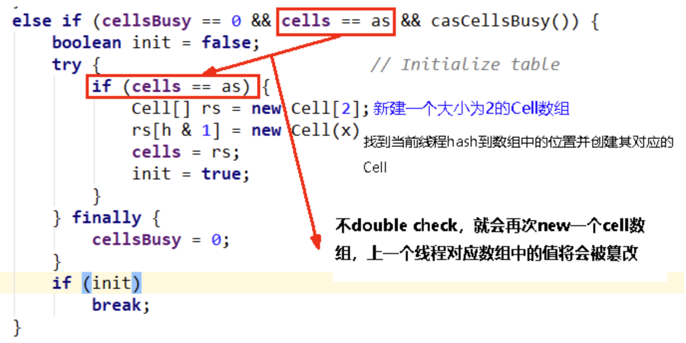
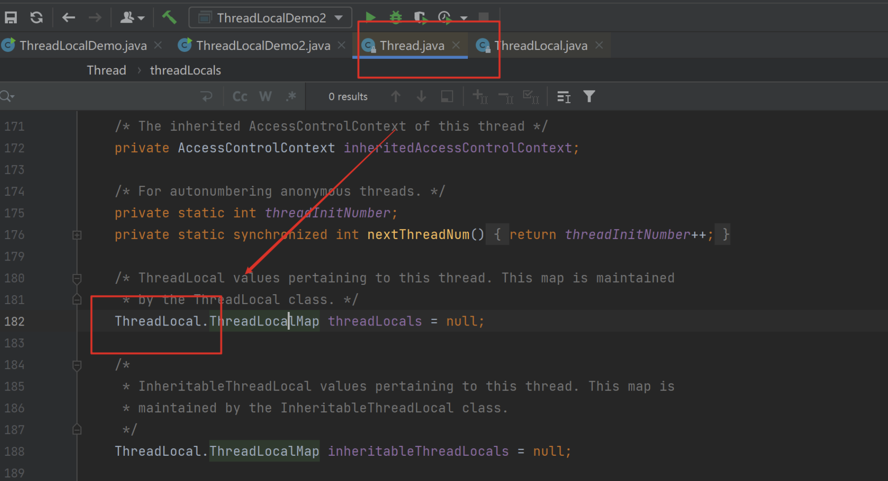

### CAS

### 一、原子类

#### 1.1 何为原子类

即为java.util.concurrent.atomic包下的所有相关类和API


#### 1.2 没有CAS之前

- 多线程环境**不使用**原子类保证线程安全i++（基本数据类型）

常用`synchronized`锁，但是它比较重 ，牵扯到了用户态和内核态的切换,效率不高。

```java
public class T3
{
    volatile int number = 0;
    //读取
    public int getNumber()
    {
        return number;
    }
    //写入加锁保证原子性
    public synchronized void setNumber()
    {
        number++;
    }
}
```

#### 1.3 使用CAS之后

- 多线程情况下**使用原子类**保证线程安全（基本数据类型）

```java
public class T3
{
    volatile int number = 0;
    //读取
    public int getNumber()
    {
        return number;
    }
    //写入加锁保证原子性
    public synchronized void setNumber()
    {
        number++;
    }
    //=================================
    //下面是新版本
    //=================================
    AtomicInteger atomicInteger = new AtomicInteger();

    public int getAtomicInteger()
    {
        return atomicInteger.get();
    }

    public void setAtomicInteger()
    {
        atomicInteger.getAndIncrement();//先读再加
    }
}

```

#### 1.4 CAS是什么

**compare and swap **的缩写，中文翻译成比较并交换,实现并发算法时常用到的一种技术。它包含三个操作数——**内存位置**、**预期原值**及**更新值**。

- 执行CAS操作的时候，将内存位置的值与预期原值比较：

- 如果相匹配，那么处理器会自动将该位置值更新为新值，

- 如果不匹配，处理器不做任何操作，多个线程同时执行CAS操作只有一个会成功。
  

#### 1.5 CAS原理

CAS （CompareAndSwap）
CAS有3个操作数，位置内存值`V`，旧的预期值`A`，要修改的更新值`B`。
当且仅当旧的预期值`A`和内存值`V`**相同**时，将内存值`V`**修改**为`B`，否则什么都不做或重来

当它重来重试的这种行为成为—**自旋！**

- eg

线程A读取了值为5，想要更新为6，想要将值写回的时候发现线程B和C都进行了操作，已经变成了7，这个时候A不能成功，可能会发生**自旋**


#### 1.6 CASDemo代码

多线程情况下**使用原子类**保证线程安全（基本数据类型）

```java
public class CompletableFutureAPIDemo {
    public static void main(String[] args) throws ExecutionException, InterruptedException {

        AtomicInteger atomicInteger = new AtomicInteger(5);

        System.out.println(atomicInteger.compareAndSet(5, 2020)+"\t"+atomicInteger.get());
        System.out.println(atomicInteger.compareAndSet(5, 1024)+"\t"+atomicInteger.get());


        true	2020
        false	2020
    }
}
```

#### 1.7 硬件级别保证

对总线加锁，效率比synchronized效率高。

```properties
CAS是JDK提供的非阻塞原子性操作，它通过硬件保证了比较-更新的原子性。

它是非阻塞的且自身原子性，也就是说这玩意效率更高且通过硬件保证，说明这玩意更可靠。

CAS是一条CPU的**原子指令* *（`cmpxchg指令`），不会造成所谓的数据不一致问题，`Unsafe`提供的`CAS方法`（如compareAndSwapXXX）底层实现即为CPU指令cmpxchg。

执行cmpxchg指令的时候，会判断当前系统是否为多核系统，如果是就**给总线加锁* *，**只有一个**线程会对总线加锁**成功* *，加锁成功之后会执行cas操作，也就是说CAS的原子性实际上是**CPU实现的* *， 其实在这一点上还是有排他锁的，只是比起用synchronized， 这里的排他时间要短的多， 所以在多线程情况下性能会比较好

```

#### 1.8 源码分析

```java
//compareAndSet
//发现它调用了Unsafe类
public final boolean compareAndSet(int expect, int update) {
        return unsafe.compareAndSwapInt(this, valueOffset, expect, update);
    }

//compareAndSwapInt
//发现它调用了native方法
public final native boolean compareAndSwapInt(Object var1, long var2, int var4, int var5);

```

```java
//这三个方法是类似的
public final native boolean compareAndSwapObject(Object var1, long var2, Object var4, Object var5);

public final native boolean compareAndSwapInt(Object var1, long var2, int var4, int var5);

public final native boolean compareAndSwapLong(Object var1, long var2, long var4, long var6);

```

上面三个方法都是类似的，主要对4个参数做一下说明。
var1：表示要操作的对象
var2：表示要操作对象中属性地址的偏移量
var4：表示需要修改数据的期望的值
var5/var6：表示需要修改为的新值

> 引出来一个问题：Unsafe类是什么？

#### 1.9 CAS底层原理？如果知道，谈谈你对UnSafe的理解

```java
public class AtomicInteger extends Number implements java.io.Serializable {
    private static final long serialVersionUID = 6214790243416807050L;

    // setup to use Unsafe.compareAndSwapInt for updates
    private static final Unsafe unsafe = Unsafe.getUnsafe();
    static {
        try {
            valueOffset = unsafe.objectFieldOffset
                (AtomicInteger.class.getDeclaredField("value"));
        } catch (Exception ex) { throw new Error(ex); }
    }

    private volatile int value;//保证变量修改后多线程之间的可见性
    }

```

1. Unsafe

CAS这个理念 ，落地就是Unsafe类

它是CAS的核心类，由于Java方法无法直接访问底层系统，需要通过本地（native）方法来访问，Unsafe相当于一个后门 ，基于该类可以直接操作特定内存\ 的数据 。Unsafe类存在于sun.misc包中，其内部方法操作可以像C的指针一样直接操作内存，因为Java中CAS操作的执行依赖于Unsafe类的方法。

注意Unsafe类中的所有方法都是 \ 修饰的，也就是说Unsafe类中的方法都直接调用操作系统底层资源执行相应任务 。

打开rt.jar包（最基本的包）


2. 变量`valueOffset`，表示该变量值在内存中的偏移地址，因为Unsafe就是根据内存偏移地址获取数据的。

```java
 public final int getAndIncrement() {
        return unsafe.getAndAddInt(this, valueOffset, 1);
    }

```

3. 变量value用volatile修饰

我们知道i++线程不安全的，那atomicInteger.getAndIncrement()
CAS的全称为Compare-And-Swap，它是一条CPU并发原语。
它的功能是判断内存某个位置的值是否为预期值，如果是则更改为新的值，这个过程是原子的。
AtomicInteger 类主要利用 CAS (compare and swap) + volatile 和 native 方法来保证原子操作，从而避免 synchronized 的高开销，执行效率大为提升。


CAS并发原语体现在JAVA语言中就是sun.misc.Unsafe类中的各个方法。调用UnSafe类中的CAS方法，JVM会帮我们实现出CAS汇编指令 。这是一种完全依赖于硬件的功能，通过它实现了原子操作。再次强调，由于CAS是一种系统原语 ，原语属于操作系统用语范畴，是由若干条指令组成的，用于完成某个功能的一个过程，并且原语的执行必须是连续的，在执行过程中不允许被中断，也就是说CAS是一条CPU的原子指令，不会造成所谓的数据不一致问题。

#### 1.10 源码分析

```java
new AtomicInteger().getAndIncrement();


//AtomicInteger.java
public final int getAndIncrement() {
        return unsafe.getAndAddInt(this, valueOffset, 1);
    }


//Unsafe.class
public final int getAndAddInt(Object var1, long var2, int var4) {
        int var5;
        do {
            var5 = this.getIntVolatile(var1, var2);
        } while(!this.compareAndSwapInt(var1, var2, var5, var5 + var4));

        return var5;
    }

//Unsafe.class
public final native boolean compareAndSwapInt(Object var1, long var2, int var4, int var5);

```

若在OpenJDK源码中查看Unsafe.java*

- 这里while体现了自旋的思想*
- 假如是ture,取反false退出循环；假如是false，取反true要继续循环。


##### 1.10.1 原理

假设线程A和线程B两个线程同时执行getAndAddInt操作（分别跑在不同CPU上）：

1 AtomicInteger里面的value原始值为3，即主内存中AtomicInteger的value为3，根据JMM模型，线程A和线程B各自持有一份值为3的value的副本分别到各自的工作内存。

2 线程A通过getIntVolatile(var1, var2)拿到value值3，这时线程A被**挂起* *。

3 线程B也通过getIntVolatile(var1, var2)方法获取到value值3，此时刚好线程B没有被挂起并执行compareAndSwapInt方法比较内存值也为3，成功修改内存值为4，线程B打完收工，一切OK。

4 这时线程A恢复，执行compareAndSwapInt方法比较，发现自己手里的值数字3和主内存的值数字4不一致，说明该值已经被其它线程抢先一步修改过了，那A线程本次修改失败，只能重新读取重新来一遍了。

5 线程A重新获取value值，因为变量value被volatile修饰，所以其它线程对它的修改，线程A总是能够看到，线程A继续执行compareAndSwapInt进行比较替换，直到成功。

##### 1.10.2 总结

你只需要记住：CAS是靠硬件实现的从而在硬件层面提升效率，最底层还是交给硬件来保证原子性和可见性

实现方式是基于硬件平台的汇编指令，在intel的CPU中(X86机器上)，使用的是汇编指令cmpxchg指令。

核心思想就是：比较要更新变量的值V和预期值E（compare），相等才会将V的值设为新值N（swap）如果不相等自旋再来。

#### 1.11 自定义原子引用

- 譬如AtomicInteger原子整型，可否有其他原子类型?比如AtomicBook、AtomicOrder*
- 可以！
- 丢入泛型中`Class AtomicReference<V>`


```java

import lombok.AllArgsConstructor;
import lombok.Getter;
import lombok.ToString;

import java.util.concurrent.atomic.AtomicReference;

@Getter
@ToString
@AllArgsConstructor
class User
{
    String userName;
    int    age;
}


public class AtomicReferenceDemo
{
    public static void main(String[] args)
    {
        User z3 = new User("z3",24);
        User li4 = new User("li4",26);
//将类型丢入泛型即可
        AtomicReference<User> atomicReferenceUser = new AtomicReference<>();

        atomicReferenceUser.set(z3);//将这个原子类设置为张三
        //张三换位李四
        System.out.println(atomicReferenceUser.compareAndSet(z3,li4)+"\t"+atomicReferenceUser.get().toString());
        //true   User(userName=li4，age=28)
        System.out.println(atomicReferenceUser.compareAndSet(z3,li4)+"\t"+atomicReferenceUser.get().toString());
        //false   User(userName=li4，age=28)
    }
}
```

#### 1.12 CAS与自旋锁，借鉴CAS思想*

CAS落地的重要应用-自旋锁

是什么
自旋锁（spinlock）

是指尝试获取锁的线程不会立即阻塞，而是采用循环的方式去尝试**获取锁* *，

当线程发现锁被占用时，会不断循环判断锁的状态，直到获取。这样的好处是减少线程上下文切换的消耗，缺点是循环会消耗CPU。

若在OpenJDK源码中查看Unsafe.java

这里while体现了自旋的思想

假如是ture,取反false退出循环；假如是false，取反true要继续循环。


#### 1.13 自己实现一个自旋锁SpinLockDemo

```properties
题目：实现一个自旋锁
自旋锁好处：循环比较获取没有类似wait的阻塞。
 
通过CAS操作完成自旋锁，A线程先进来调用myLock方法自己持有锁5秒钟，B随后进来后发现
当前有线程持有锁，不是null，所以只能通过自旋等待，直到A释放锁后B随后抢到。

```

```java
//利用cas实现自旋锁
    public class SpinLockDemo
    {
        AtomicReference<Thread> atomicReference = new AtomicReference<>();

        public void Lock()
        {
            Thread thread = Thread.currentThread();
            System.out.println(Thread.currentThread().getName()+"\t"+"-----come in");
            while(!atomicReference.compareAndSet(null,thread))//用这个循环实现自旋
            {

            }
            //如果是空的，那我们把thread放进去

        }

        public void UnLock()
        {
            Thread thread = Thread.currentThread();
            atomicReference.compareAndSet(thread,null);//把当前线程踢出去，置为null
            System.out.println(Thread.currentThread().getName()+"\t"+"-------task over,unLock.....");
        }

        public static void main(String[] args)
        {
            SpinLockDemo spinLockDemo = new SpinLockDemo();
            new Thread(() -> {
                spinLockDemo.Lock();
                try { TimeUnit.SECONDS.sleep( 5 ); } catch (InterruptedException e) { e.printStackTrace(); }
                spinLockDemo.UnLock();
            },"A").start();

            //暂停一会儿线程，保证A线程先于B线程启动并完成
            try { TimeUnit.MILLISECONDS.sleep( 500); } catch (InterruptedException e) { e.printStackTrace(); }

            new Thread(() -> {
                spinLockDemo.Lock();//B  -----come in  B只是尝试去抢锁，但是一直在自旋。

                spinLockDemo.UnLock();//A结束后 B立马抢到锁，然后马上结束了
            },"B").start();

        }
    }
    //A  -----come in
    //B  -----come in
    //A  -------task over,unLock.....
    //B  -------task over,unLock.....

```

#### 1.14 CAS缺点

##### 1.14.1  循环时间长开销很大

- `do while `如果它一直自旋会一直占用CPU时间，造成较大的开销

- 如果CAS失败，会一直进行尝试。如果CAS长时间一直不成功，可能会给CPU带来很大的开销。

##### 1.14.2 引出来ABA问题

- 什么是ABA问题

CAS会导致“ABA问题”。

CAS算法实现一个重要前提需要取出内存中某时刻的数据并在当下时刻比较并替换，那么在这个时间差类会导致数据的变化。

比如说一个线程one从内存位置V中取出A，这时候另一个线程two也从内存中取出A，并且线程two进行了一些操作将值变成了B，

然后线程two又将V位置的数据变成A，这时候线程one进行CAS操作发现内存中仍然是A，然后线程one操作成功。

尽管线程one的CAS操作成功，但是不代表这个过程就是没有问题的。


- 如何解决

`AtomicStampedReference`版本号 （注意区分前面的`Class AtomicReference<V>`）

`Class AtomicStampedReference<V> `相关API

```java
AtomicStampedReference(V initialRef, int initialStamp)
创建一个新的 AtomicStampedReference与给定的初始值。

```

```java
public boolean weakCompareAndSet(V expectedReference,//旧值
                                 V newReference,//新值
                                 int expectedStamp,//旧版本号
                                 int newStamp)//新版本号
以原子方式设置该引用和邮票给定的更新值的值，如果当前的参考是==至预期的参考，并且当前标志等于预期标志。
May fail spuriously and does not provide ordering guarantees ，所以只是很少适合替代compareAndSet 。

参数
expectedReference - 参考的预期值
newReference - 参考的新值
expectedStamp - 邮票的预期值
newStamp - 邮票的新值
结果
true如果成功
```*

```

```java
  //基本情况
    @NoArgsConstructor
    @AllArgsConstructor
    @Data
    class Book{
        private  int id;
        private String bookName;
    }

    public class AtomicStampedDemo {
        public static void main(String[] args) {
            Book javaBook = new Book(1, "javaBook");
            AtomicStampedReference<Book> stampedReference = new AtomicStampedReference<>(javaBook,1);
            System.out.println(stampedReference.getReference()+"\t"+stampedReference.getReference());
            Book mysqlBook = new Book(2, "mysqlBook");
            boolean b;
                    b= stampedReference.compareAndSet(javaBook, mysqlBook, stampedReference.getStamp(), stampedReference.getStamp() + 1);
            System.out.println(b+"\t"+stampedReference.getReference()+"\t"+stampedReference.getStamp());
        }
    }
    //Book(id=1, bookName=javaBook)  Book(id=1, bookName=javaBook)
    //true  Book(id=2, bookName=mysqlBook)  2
  

   //ABA复现（单线程情况下）

    ```java
    public class AtomicStampedDemo {
        public static void main(String[] args) {
            Book javaBook = new Book(1, "javaBook");
            AtomicStampedReference<Book> stampedReference = new AtomicStampedReference<>(javaBook,1);
            System.out.println(stampedReference.getReference()+"\t"+stampedReference.getReference());
            Book mysqlBook = new Book(2, "mysqlBook");
            boolean b;
                    b= stampedReference.compareAndSet(javaBook, mysqlBook, stampedReference.getStamp(), stampedReference.getStamp() + 1);
            System.out.println(b+"\t"+stampedReference.getReference()+"\t"+stampedReference.getStamp());
            b= stampedReference.compareAndSet(mysqlBook,javaBook, stampedReference.getStamp(), stampedReference.getStamp() + 1);
            System.out.println(b+"\t"+stampedReference.getReference()+"\t"+stampedReference.getStamp());
        }
    }
    //Book(id=1, bookName=javaBook)  Book(id=1, bookName=javaBook) --------
    //true  Book(id=2, bookName=mysqlBook)  2
    //true  Book(id=1, bookName=javaBook)  3  --------虽然1.3行内容是一样的，但是版本号不一样


   //ABA复现（多线程情况下）
    public class ABADemo
    {
        static AtomicInteger atomicInteger = new AtomicInteger(100);
        static AtomicStampedReference atomicStampedReference = new AtomicStampedReference(100,1);

        public static void main(String[] args)
        {
            new Thread(() -> {
                atomicInteger.compareAndSet(100,101);
                atomicInteger.compareAndSet(101,100);//这里 中间就有人动过了，虽然值是不变的，假如不检查版本号，CAS就直接能成功了
            },"t1").start();

            new Thread(() -> {
                //暂停一会儿线程
                try { Thread.sleep( 500 ); } catch (InterruptedException e) { e.printStackTrace(); };            
                System.out.println(atomicInteger.compareAndSet(100, 2022)+"\t"+atomicInteger.get());
            },"t2").start();
            
            //-------------------- true-2022

            //暂停一会儿线程,main彻底等待上面的ABA出现演示完成。
            try { Thread.sleep( 2000 ); } catch (InterruptedException e) { e.printStackTrace(); }

            System.out.println("============以下是ABA问题的解决=============================");

            new Thread(() -> {
                int stamp = atomicStampedReference.getStamp();
                System.out.println(Thread.currentThread().getName()+"\t 首次版本号:"+stamp);//1-----------初始获得一样的版本号
                //暂停500毫秒，保证t4线程初始化拿到的版本号和我一样,
                try { TimeUnit.MILLISECONDS.sleep( 500 ); } catch (InterruptedException e) { e.printStackTrace(); }
                atomicStampedReference.compareAndSet(100,101,atomicStampedReference.getStamp(),atomicStampedReference.getStamp()+1);
                System.out.println(Thread.currentThread().getName()+"\t 2次版本号:"+atomicStampedReference.getStamp());
                atomicStampedReference.compareAndSet(101,100,atomicStampedReference.getStamp(),atomicStampedReference.getStamp()+1);
                System.out.println(Thread.currentThread().getName()+"\t 3次版本号:"+atomicStampedReference.getStamp());
            },"t3").start();

            new Thread(() -> {
                int stamp = atomicStampedReference.getStamp();//记录一开始的版本号，并且写死
                System.out.println(Thread.currentThread().getName()+"\t 首次版本号:"+stamp);//1------------初始获得一样的版本号
                //暂停1秒钟线程，等待上面的t3线程，发生了ABA问题
                try { TimeUnit.SECONDS.sleep(1); } catch (InterruptedException e) { e.printStackTrace(); }
                boolean result = atomicStampedReference.compareAndSet(100,2019,stamp,stamp+1);//这个还是初始的版本号，但是实际上版本号被T3修改了，所以肯定会失败
                System.out.println(Thread.currentThread().getName()+"\t"+result+"\t"+atomicStampedReference.getReference());
            },"t4").start();
        }
    }
    //t3 首次版本号：1
    //t4 首次版本号：1
    //t3 2次版本号：2
    //t3 3次版本号：3
    //false 100 3   -----因为版本号实际上已经被修改了

```

### 二、原子操作值18个增强类


- 阿里巴巴Java开发手册

volatile解决多线程内存不可见问题。对于一写多读，是可以解决变量同步问题，但是如果多写，同样无法解决线程安全问题。

说明：如果是count ++ 操作，使用如下类实现：AtomicInteger count = new AtomicInteger();count.AndGet(1);如果JDK8，推荐使用LongAdder对象，比AtomicLong性能更好（减少乐观锁的重试次数）。

- 为什么说是18个呢，却只有16个类。

#### 2.1 在分类

##### 2.1.1 基本类型原子类

```java
AtomicInteger
AtomicBoolean
AtomicLong
```

##### 2.1.2 常用API

```java
public final int get()
public final int getAndSet(int new Value)
public final int getAndIncrement()
public final int getAndDecrement()
public final int getAndAdd(int delta)
public comapreAndSet(int expect,int update)//如果

```

##### 2.1.3 Case-CountDownLatch

- 案例

```java
class MyNumber{
    AtomicInteger atomicInteger = new AtomicInteger();
    public void addPlusPlus(){
        atomicInteger.getAndIncrement();
    }
}

public class AtomicIntegerDemo {
    public static final int SIZE = 50;
    public static void main(String[] args) {
        MyNumber myNumber = new MyNumber();
        for(int i = 1;i <= SIZE;i ++){
            new Thread(() -> {
                for(int j = 1;j <= 1000;j ++){
                    myNumber.addPlusPlus();
                }
            },String.valueOf(i)).start();
        }
        System.out.println(Thread.currentThread().getName()+"\t"+"result: "+myNumber.atomicInteger);
    }
}
//本来应该是50000
//1试-main  result: 39000
//2试-main  result: 40178
//?是不是我们的程序有问题？

//因为上面的50*  1000个计算还没结束，他就去get数值了
```*

   解决

```java
//方法一（不推荐，做做Demo还行）
public class AtomicIntegerDemo {
    public static final int SIZE = 50;
    public static void main(String[] args) {
        MyNumber myNumber = new MyNumber();
        for(int i = 1;i <= SIZE;i ++){
            new Thread(() -> {
                for(int j = 1;j <= 1000;j ++){
                    myNumber.addPlusPlus();
                }
            },String.valueOf(i)).start();
        }
        try {
            TimeUnit.SECONDS.sleep(2);
        } catch (InterruptedException e) {
            e.printStackTrace();
        }
        System.out.println(Thread.currentThread().getName()+"\t"+"result: "+myNumber.atomicInteger);
    }
}

//方法二-减法计数器CountDownLatch
public class AtomicIntegerDemo {
    public static final int SIZE = 50;
    public static void main(String[] args) throws InterruptedException {
        MyNumber myNumber = new MyNumber();
        CountDownLatch countDownLatch = new CountDownLatch(SIZE);
        for(int i = 1;i <= SIZE;i ++){
            new Thread(() -> {
                try {
                    for(int j = 1;j <= 1000;j ++){
                        myNumber.addPlusPlus();
                    }
                } finally {
                    countDownLatch.countDown();
                }
            },String.valueOf(i)).start();
        }
        countDownLatch.await();
        System.out.println(Thread.currentThread().getName()+"\t"+"result: "+myNumber.atomicInteger);
    }
}
//main  result: 50000

```

##### 2.1.4 数组类原子类

基本原理同上

```java
AtomicIntegerArray
AtomicLongArray
AtomicRreferenceArray
```

- 案例

```java
public class AtomicIntegerArrayDemo
{
    public static void main(String[] args)
    {
        AtomicIntegerArray atomicIntegerArray = new AtomicIntegerArray(new int[5]);//0 0 0 0 0
        //AtomicIntegerArray atomicIntegerArray = new AtomicIntegerArray(5);
        //AtomicIntegerArray atomicIntegerArray = new AtomicIntegerArray(new int[]{1,2,3,4,5});//1 2 3 4 5 

        for (int i = 0; i <atomicIntegerArray.length(); i++) {
            System.out.println(atomicIntegerArray.get(i));
        }
        System.out.println();
        System.out.println();
        System.out.println();
        int tmpInt = 0;

        tmpInt = atomicIntegerArray.getAndSet(0,1122);
        System.out.println(tmpInt+"\t"+atomicIntegerArray.get(0));
        atomicIntegerArray.getAndIncrement(1);
        atomicIntegerArray.getAndIncrement(1);
        tmpInt = atomicIntegerArray.getAndIncrement(1);
        System.out.println(tmpInt+"\t"+atomicIntegerArray.get(1));
    }
}

```

##### 2.1.5 引用类型原子类

这三个相对比较重要

```java
AtomicReference
AtomicStampedReference
AtomicMarkableReference
```*

   `AtomicReference` 可以带泛型（前面讲过）

`AtomicReference<xxx> `*

   `AtomicStampedReference` 带版本号以防CAS中的ABA问题（前面讲过）

携带版本号的引用类型原子类，可以解决ABA问题。解决修改过几次的问题。*

   `AtomicMarkableReference`类似于上面的 ，但解决**一次性**问题

构造方法`AtomicMarkableReference(V initialRef, boolean initialMark)`

原子更新带有标记位的引用类型对象

解决是否修改过，它的定义就是将`状态戳`**简化**为`true|false`，类似一次性筷子

```java
//来个案例
public class AtomicMarkableReferenceDemo {

    static AtomicMarkableReference markableReference = new AtomicMarkableReference(100,false);

    public static void main(String[] args) {
        new Thread(()->{
            boolean marked = markableReference.isMarked();
            System.out.println(Thread.currentThread().getName()+"\t"+"默认标识"+marked);
            //暂停1秒钟线程，等待后面的T2线程和我拿到一样的模式flag标识，都是false
            try {TimeUnit.SECONDS.sleep(1);} catch (InterruptedException e) {e.printStackTrace();}
            markableReference.compareAndSet(100, 1000, marked, !marked);
        },"t1").start();

        new Thread(()->{
            boolean marked = markableReference.isMarked();
            System.out.println(Thread.currentThread().getName()+"\t"+"默认标识"+marked);
            //这里停2秒，让t1先修改,然后t2试着修改
            try {TimeUnit.SECONDS.sleep(2);} catch (InterruptedException e) {e.printStackTrace();}
            boolean t2Result = markableReference.compareAndSet(100, 1000, marked, !marked);
            System.out.println(Thread.currentThread().getName()+"\t"+"t2线程result--"+t2Result);
            System.out.println(Thread.currentThread().getName()+"\t"+markableReference.isMarked());
            System.out.println(Thread.currentThread().getName()+"\t"+markableReference.getReference());

        },"t2").start();
    }
}


```

##### 2.1.6 对象的属性修改原子类

- 关键词FieldUpdater

```java
AtomicIntegerFieldUpdater//原子更新对象中int类型字段的值
AtomicLongFieldUpdater//原子更新对象中Long类型字段的值
AtomicReferenceFieldUpdater//原子更新引用类型字段的值
```


##### 2.1.7 使用目的

- 以一种现场安全带方式操作非线程安全对象内的某些字段

举个例子（它是更加细粒度的/影像某个字段，而不用锁住整个对象）


##### 2.1.8 使要求

- 更新的对象属性必须使用public volatile 修饰符。

因为对象的属性修改类型原子类都是 抽象类。所以每次使用都必须使用静态方法 newUpdater()创建一个更新器，并且需要设置想要更新的类和属性。

- 案例

`AtomicIntegerFieldUpdater`-这个针对int类型

~~~java
class BankAccount{
    String bankName = "CCB";
    public volatile int money = 0;//条件一

    //synchronized版本
//    public synchronized void add(){
//        money++;
//    }
    //AtomicIntegerFieldUpdater版本
    AtomicIntegerFieldUpdater<BankAccount> fieldUpdater =
            AtomicIntegerFieldUpdater.newUpdater(BankAccount.class,"money");//只限制了money这个字段，条件二

    public void transMoney(BankAccount bankAccount){
        fieldUpdater.getAndIncrement(bankAccount);
    }

}

public class AtomicIntegerFieldUpdaterDemo {
    public static void main(String[] args) throws InterruptedException {
        BankAccount bankAccount = new BankAccount();
        CountDownLatch countDownLatch = new CountDownLatch(10);
        for(int i = 1;i <= 10;i ++){
            new Thread(()->{
                try {
                    for(int j = 1;j <= 1000;j ++){
                       // bankAccount.add();
                        bankAccount.transMoney(bankAccount);
                    }
                } finally {
                    countDownLatch.countDown();
                }
            },String.valueOf(i)).start();
        }
        countDownLatch.await();
        System.out.println(Thread.currentThread().getName()+"\t"+"result: "+bankAccount.money);
    }
}
//main  result: 10000

```*

   `AtomicReferenceFieldUpdater`-适用度更广

```java
//比如这个案例中是针对boolean类型的
class MyVar{
    public volatile Boolean isInit = Boolean.FALSE;
    AtomicReferenceFieldUpdater<MyVar,Boolean> referenceFieldUpdater =
            AtomicReferenceFieldUpdater.newUpdater(MyVar.class,Boolean.class,"isInit");
    public void init(MyVar myVar){
        if(referenceFieldUpdater.compareAndSet(myVar,Boolean.FALSE,Boolean.TRUE)){
            System.out.println(Thread.currentThread().getName()+"\t"+"-----start init,needs 3 seconds");
            try {TimeUnit.SECONDS.sleep(3);} catch (InterruptedException e) {e.printStackTrace();}
            System.out.println(Thread.currentThread().getName()+"\t"+"-----over init");
        }else{
            System.out.println(Thread.currentThread().getName()+"\t"+"抱歉，已经有其他线程进行了初始化");
        }
    }
}

public class AtomicReferenceFieldUpdaterDemo {
    public static void main(String[] args) {
        MyVar myVar = new MyVar();
        for(int i = 1;i <= 5;i ++){
            new Thread(()->{
                myVar.init(myVar);
            },String.valueOf(i)).start();
        }
    }
}
//1  -----start init,needs 3 seconds
//5  抱歉，已经有其他线程进行了初始化
//4  抱歉，已经有其他线程进行了初始化
//2  抱歉，已经有其他线程进行了初始化
//3  抱歉，已经有其他线程进行了初始化
//1  -----over init
~~~

##### 2.1.9 面试

面试官问你：你在哪里用来volatile？

在AtomicReferenceFieldUpdater中，因为是规定好的必须由volatile修饰的

还有的话之前我们在DCL单例中，也用了volatile保证了可见性

##### 2.1.10 原子操作增强类原理深度解析

开篇的时候我们将原子类分为了红框和蓝框，这里就是蓝框的内容

```java
//这几个都是java8开始有的，前面的都是java5就有了
DoubleAccumulator
DoubleAdder
LongAccumulator
LongAdder
```


1. 热点商品点赞计算器，点赞数加加统计，不要求实时精确
2. 一个很大的List，里面都是int类型，如何实现加加，说说思路

##### 2.1.11 模拟下点赞计数器，看看性能

- 要求：热点商品点赞计算器，点赞数加加统计，不要求实时精确

看看这个LongAdder

- 看看这个LongAccumulator


常用API


##### 2.1.12 入门讲解

LongAdder只能用来计算加法 *。且从零开始计算*

LongAccumulator提供了自定义的函数操作 (利用lambda表达式)

```java
public class LongAdderAPIDemo {
    public static void main(String[] args) {
        LongAdder longAdder = new LongAdder();

        longAdder.increment();
        longAdder.increment();
        longAdder.increment();

        System.out.println(longAdder.longValue());//3

        LongAccumulator longAccumulator = new LongAccumulator((x, y) -> x + y, 0);//lambda表达式
        longAccumulator.accumulate(1);//1
        longAccumulator.accumulate(3);//4
        System.out.println(longAccumulator.get());//4
    }
}

```

##### 2.1.13 LongAdder 高性能对比Code演示

```java
package com.yooome.springcloud.controller;

import java.util.concurrent.CountDownLatch;
import java.util.concurrent.atomic.AtomicLong;
import java.util.concurrent.atomic.LongAccumulator;
import java.util.concurrent.atomic.LongAdder;

//需求：50个线程，每个线程100w次，计算总点赞数
class ClickNumber{
    int number = 0;
    public synchronized void add1(){
        number++;
    }

    AtomicLong atomicLong =  new AtomicLong(0);
    public void add2(){
        atomicLong.incrementAndGet();
    }

    LongAdder longAdder =new LongAdder();
    public void add3(){
        longAdder.increment();
    }

    LongAccumulator longAccumulator = new  LongAccumulator((x, y) -> x + y,0);
    public void add4(){
        longAccumulator.accumulate(1);
    }
}
public class CompletableFutureAPIDemo {
    public static final int _1W = 1000000;
    public static final int threadNumber = 50;
    public static void main(String[] args) throws InterruptedException {

        ClickNumber clickNumber = new ClickNumber();
        Long startTime;
        Long endTime;
        CountDownLatch countDownLatch1 = new CountDownLatch(50);
        CountDownLatch countDownLatch2 = new CountDownLatch(50);
        CountDownLatch countDownLatch3 = new CountDownLatch(50);
        CountDownLatch countDownLatch4 = new CountDownLatch(50);

        startTime = System.currentTimeMillis();
        for(int i = 1;i <= threadNumber;i ++){
            new Thread(()->{
                try {
                    for(int j = 1;j <=_1W;j ++){
                        clickNumber.add1();
                    }
                } finally {
                    countDownLatch1.countDown();
                }
            },String.valueOf(i)).start();
        }
        countDownLatch1.await();
        endTime = System.currentTimeMillis();
        System.out.println("costTime---"+(endTime-startTime)+"毫秒"+"\t"+"synchronized---"+clickNumber.number);

        startTime = System.currentTimeMillis();
        for(int i = 1;i <= threadNumber;i ++){
            new Thread(()->{
                try {
                    for(int j = 1;j <=_1W;j ++){
                        clickNumber.add2();
                    }
                } finally {
                    countDownLatch2.countDown();
                }
            },String.valueOf(i)).start();
        }
        countDownLatch2.await();
        endTime = System.currentTimeMillis();
        System.out.println("costTime---"+(endTime-startTime)+"毫秒"+"\t"+"atomicLong---"+clickNumber.atomicLong);

        startTime = System.currentTimeMillis();
        for(int i = 1;i <= threadNumber;i++){
            new Thread(()->{
                try {
                    for(int j = 1;j <=_1W;j++){
                        clickNumber.add3();
                    }
                } finally {
                    countDownLatch3.countDown();
                }
            },String.valueOf(i)).start();
        }
        countDownLatch3.await();
        endTime = System.currentTimeMillis();
        System.out.println("costTime---"+(endTime-startTime)+"毫秒"+"\t"+"LongAdder---"+clickNumber.longAdder.sum());

        startTime = System.currentTimeMillis();
        for(int i = 1;i <= threadNumber;i ++){
            new Thread(()->{
                try {
                    for(int j = 1;j <=_1W;j++){
                        clickNumber.add4();
                    }
                } finally {
                    countDownLatch4.countDown();
                }
            },String.valueOf(i)).start();
        }
        countDownLatch4.await();
        endTime = System.currentTimeMillis();
        System.out.println("costTime---"+(endTime-startTime)+"毫秒"+"\t"+"LongAccumulator---"+clickNumber.longAccumulator.longValue());
    }
//    costTime---1411毫秒	synchronized---50000000
//    costTime---1454毫秒	atomicLong---50000000
//    costTime---104毫秒	LongAdder---50000000
//    costTime---227毫秒	LongAccumulator---50000000
}//印证了阿里卡法手册中说的 【如果是JDK8，推荐使用LongAdder对象，比AtomicLong性能更好（减少乐观锁的重试次数）】
```

##### 2.1.14 源码、原理分析


LongAdder是Striped64的子类

```java
public class LongAdder extends Striped64 implements Serializable {
    private static final long serialVersionUID = 7249069246863182397L;
 //---------------------------
 abstract class Striped64 extends Number {

```

##### 2.1.15 原理(LongAdder为什么这么快)


##### 2.1.16 LongAdder是Striped64的子类

Striped64

- 重要的成员函数

```java
//Number of CPUS, to place bound on table size       
// CPU数量，即cells数组的最大长度 
static final int NCPU = Runtime.getRuntime().availableProcessors();


//Table of cells. When non-null, size is a power of 2.
//单元格数组|cells数组，为2的幂，2,4,8,16.....，方便以后位运算
transient volatile Cell[] cells;

//基础value值，当并发较低时，只累加该值主要用于没有竞争的情况，通过CAS更新。
//Base value, used mainly when there is no contention, but also as
//a fallback during table initialization races. Updated via CAS.
transient volatile long base;

//创建或者扩容Cells数组时使用的自旋锁变量调整单元格大小（扩容），创建单元格时使用的锁。
//Spinlock (locked via CAS) used when resizing and/or creating Cells. 
transient volatile int cellsBusy;
```

最重要的两个


- Striperd64中一些变量或者方法的定义


- Cell

是java.util.concurrent.atomic下Striped64的一个静态内部类

```java
@sun.misc.Contended static final class Cell {
        volatile long value;
        Cell(long x) { value = x; }
        final boolean cas(long cmp, long val) {
            return UNSAFE.compareAndSwapLong(this, valueOffset, cmp, val);
        }

        // Unsafe mechanics
        private static final sun.misc.Unsafe UNSAFE;
        private static final long valueOffset;
        static {
            try {
                UNSAFE = sun.misc.Unsafe.getUnsafe();
                Class<?> ak = Cell.class;
                valueOffset = UNSAFE.objectFieldOffset
                    (ak.getDeclaredField("value"));
            } catch (Exception e) {
                throw new Error(e);
            }
        }
    }
```

##### 2.1.17 LongAdder为什么这么快

其实在小并发下情况差不多；但在高并发情况下，在AtomicLong中，等待的线程会不停的自旋，导致效率比较低；而LongAdder用cell[]分了几个块出来，最后统计总的结果值（base+所有的cell值），分散热点。

举个形象的例子，火车站买火车票，AtomicLong 只要一个窗口，其他人都在排队；而LongAdder 利用cell开了多个卖票窗口，所以效率高了很多。


一句话

LongAdder的基本思路就是分散热点 ，将value值分散到一个Cell数组中，不同线程会命中到数组的不同槽中，各个线程只对自己槽中的那个值进行CAS操作，这样热点就被分散了，冲突的概率就小很多。如果要获取真正的long值，只要将各个槽中的变量值累加返回。

sum()会将所有Cell数组中的value和base累加作为返回值，核心的思想就是将之前AtomicLong一个value的更新压力分散到多个value中去，从而降级更新热点 。


- 数学表达

内部有一个base变量，一个Cell[]数组。

base变量：非竞态条件下，直接累加到该变量上

Cell[]数组：竞态条件下，累加各个线程自己的槽Cell[i]中

##### 2.1.18 源码解读深度分析

**小总结**

LongAdder在无竞争的情况，跟AtomicLong一样，对同一个base进行操作，当出现竞争关系时则是采用化整为零的做法，从空间换时间，用一个数组 \ \ ，将一个value拆分进这个数组cells。多个线程需要同时对value进行操作时候，可以对线程id进行hash得到hash值，再根据hash值映射到这个数组cells的某个下标，再对该下标所对应的值进行自增操作。当所有线程操作完毕，将数组cells的所有值和无竞争值base都加起来作为最终结果。


##### 2.1.21 LongAdder.increment()

- 1-add(1L)

```java
public class LongAdder extends Striped64 implements Serializable {
    private static final long serialVersionUID = 7249069246863182397L;

    /***     
 Creates a new adder with initial sum of zero.*     
/
    public LongAdder() {
    }

    /***     
 Adds the given value.**     

      @param x the value to add*     
/
    public void add(long x) {
        Cell[] as; long b, v; int m; Cell a;
        if ((as = cells) != null || !casBase(b = base, b + x)) {
            boolean uncontended = true;
            if (as == null || (m = as.length - 1) < 0 ||
                (a = as[getProbe() & m]) == null ||
                !(uncontended = a.cas(v = a.value, v + x)))
                longAccumulate(x, null, uncontended);
        }
    }
    //真正干活的是longAccumulate
    //as表示cells引用
    //b表示获取的base值
    //v表示期望值
    //m表示cells数组的长度
    //a表示当前线程命中的cell单元格
   
```

uncontended代表没有冲突。

我们点进这个casBase发现他也是个CAS

```java
final boolean casBase(long cmp, long val) {
        return UNSAFE.compareAndSwapLong(this, BASE, cmp, val);
    }

```

一开始竞争小的时候CAS能成功，也就是casBase能成功，然后cells也是空的，所以不会进到循环


竞争大的时候，他会`Cell[] rs = new Cell[2];` 新建两个cell, 此时≠ null ，条件满足了，进入循环。

然后这里还有一层循环，这里是多个if并排


> 总结一下
> 1.最初无竞争时只更新base;
> 2.如果更新base失败后，首次新建一个Cell[]数组
> 3.当多个线程竞争同一个Cell比价激烈时，可能就要利用`longAccumulate`对Cell[]扩容。

> 再次小总结


- 2-longAccumulate

```java
    final void longAccumulate(long x, LongBinaryOperator fn,
                              boolean wasUncontended) {
        int h;
        if ((h = getProbe()) == 0) {
            ThreadLocalRandom.current(); // force initialization
            h = getProbe();
            wasUncontended = true;
        }
        boolean collide = false;                // True if last slot nonempty
        for (;;) {
            Cell[] as; Cell a; int n; long v;
            if ((as = cells) != null && (n = as.length) > 0) {
            //这里是③ Cell数组不再为空且可能存在Cell数组扩容
                if ((a = as[(n - 1) & h]) == null) {
                    if (cellsBusy == 0) {       // Try to attach new Cell
                        Cell r = new Cell(x);   // Optimistically create
                        if (cellsBusy == 0 && casCellsBusy()) {
                            boolean created = false;
                            try {               // Recheck under lock
                                Cell[] rs; int m, j;
                                if ((rs = cells) != null &&
                                    (m = rs.length) > 0 &&
                                    rs[j = (m - 1) & h] == null) {
                                    rs[j] = r;
                                    created = true;
                                }
                            } finally {
                                cellsBusy = 0;
                            }
                            if (created)
                                break;
                            continue;           // Slot is now non-empty
                        }
                    }
                    collide = false;
                }
                else if (!wasUncontended)       // CAS already known to fail
                    wasUncontended = true;      // Continue after rehash
                else if (a.cas(v = a.value, ((fn == null) ? v + x :
                                             fn.applyAsLong(v, x))))
                    break;
                else if (n >= NCPU || cells != as)//不能超过cpu核数
                    collide = false;            // At max size or stale
                else if (!collide)
                    collide = true;
                else if (cellsBusy == 0 && casCellsBusy()) {
                    try {
                        if (cells == as) {      // Expand table unless stale
                            Cell[] rs = new Cell[n << 1];//扩容-左移一位，相当于x2
                            for (int i = 0; i < n; ++i)
                                rs[i] = as[i];
                            cells = rs;
                        }
                    } finally {
                        cellsBusy = 0;
                    }
                    collide = false;
                    continue;                   // Retry with expanded table
                }
                h = advanceProbe(h);
            }
            else if (cellsBusy == 0 && cells == as && casCellsBusy()) {
            //这里是①初始化
                boolean init = false;
                try {                           // Initialize table
                    if (cells == as) {
                        Cell[] rs = new Cell[2];
                        rs[h & 1] = new Cell(x);
                        cells = rs;
                        init = true;
//------可以先看这里，进行了初始化，长度是2
//------cells数组，为2的幂，2，4，8，16，方便以后位运算
                    }
                } finally {
                    cellsBusy = 0;
                }
                if (init)
                    break;
            }
            else if (casBase(v = base, ((fn == null) ? v + x :
                                        fn.applyAsLong(v, x))))//这里是②兜底
                break;                          // Fall back on using base
        }
    }

```

- LongAccumulate入参说明


- Striped64中一些变量或者方法的定义


- 步骤
- 我们先讲这个`(a = as[getProbe() & m])`里的probe，这里其实拿了hash值，通过hash值知道我们去到哪个cell槽。

```java
static final int getProbe() {
        return UNSAFE.getInt(Thread.currentThread(), PROBE);
    }

//其实就是得到了线程的Hash值
```

所以最前面的这一段就像是新员工入职获取工号（hash值）一样


- 总纲


上述代码首先给当前线程分配一个hash值，然后进入一个for(;;)自旋，这个自旋分为三个分支：
CASE1：Cell[]数组已经初始化
CASE2：Cell[]数组未初始化(首次新建)
CASE3：Cell[]数组正在初始化中

- 计算

1. 刚刚要初始化Cell[]数组（首次新建）



如果上面条件都执行成功就会执行数组的初始化及赋值操作， Cell[] rs = new Cell[2]表示数组的长度为2，
rs[h & 1] = new Cell(x) 表示创建一个新的Cell元素，value是x值，默认为1。
h & 1类似于我们之前HashMap常用到的计算散列桶index的算法，通常都是hash & (table.len - 1)。同hashmap一个意思。

- 兜底

多个线程尝试CAS修改失败的线程会走到这个分支

```java
//排在最后面的
else if (casBase(v = base, ((fn == null) ? v + x :
                                        fn.applyAsLong(v, x))))
//该分支实现直接操作base基数，将值累加到base上，也即其它线程正在初始化，多个线程正在更新base的值。
```

- Cell数组不再为空且可能存在Cell数组扩容

多个线程同时命中一个cell的竞争,这个是**最复杂**的部分


上面代码判断当前线程hash后指向的数据位置元素是否为空，
如果为空则将Cell数据放入数组中，跳出循环。
如果不空则继续循环。


- 3


说明当前线程对应的数组中有了数据，也重置过hash值，
这时通过CAS操作尝试对当前数中的value值进行累加x操作，x默认为1，如果CAS成功则直接跳出循环。


- 4


- 5


- 6


- 以上六步总结


- sum()

```java
//LongAdder.java
public long sum() {
        Cell[] as = cells; Cell a;
        long sum = base;
        if (as != null) {
            for (int i = 0; i < as.length; ++i) {
                if ((a = as[i]) != null)
                    sum += a.value;
            }
        }
        return sum;
    }

```

sum()会将所有Cell数组中的**value和base累加**作为返回值。
核心的思想就是将之前AtomicLong一个value的更新压力分散到多个value中去，*从而降级更新热点* ()

> 为啥在并发情况下sum的值不精确？


sum执行时，并没有限制对base和cells的更新(一句要命的话)。所以LongAdder不是强一致性的，它是最终一致性的。

首先，最终返回的sum局部变量，初始被复制为base，而最终返回时，很可能base已经被更新了 ，而此时局部变量sum不会更新，造成不一致。
其次，这里对cell的读取也无法保证是最后一次写入的值。所以，sum方法在没有并发的情况下，可以获得正确的结果。

##### 2.1.22 使用总结

- AtomicLong
  线程安全，可允许一些性能损耗，要求高精度时可使用

​		保证精度，性能代价

​		AtomicLong是多个线程针对单个热点值value进行原子操作

- LongAdder
  当需要在高并发下有较好的性能表现，且对值的精确度要求不高时，可以使用

​		保证性能，精度代价

​		LongAdder是每个线程拥有自己的槽，各个线程一般只对自己槽中的那个值进行CAS操作

- 小总结

  AtomicLong

  原理

  CAS+自旋

incrementAndGet

- 场景
  低并发下的全局计算

​		AtomicLong能保证并发情况下计数的准确性，其内部通过CAS来解决并发安全性的问题

- 缺陷
  高并发后性能急剧下降

why?AtomicLong的自旋会称为瓶颈（N个线程CAS操作修改线程的值，每次只有一个成功过，其它N - 1失败，失败的不停的自旋直到成功，这样大量失败自旋的情况，一下子cpu就打高了。）

- LongAdder
  原理
  CAS+Base+Cell数组分散

- 空间换时间并分散了热点数据

- 场景
  高并发的全局计算

- 缺陷
  sum求和后还有计算线程修改结果的话，最后结果不够准确


### 三、ThreadLocal

- ThreadLocal中ThreadLocalMap的数据结构和关系？
- ThreadLocal的key是弱引用，这是为什么？
- ThreadLocal内存泄漏问题你知道吗？
- ThreadLocal中最后为什么要加remove方法？

#### 3.1 是什么

ThreadLocal提供线程局部变量。这些变量与正常的变量不同，因为每一个线程在访问ThreadLocal实例的时候（通过其get或set方法）都有自己的、独立初始化的变量副本。 ThreadLocal实例通常是类中的私有静态字段，使用它的目的是希望将状态（例如，用户ID或事务ID）与线程关联起来。

#### 3.2 能干什么

实现**每一个线程都有自己专属的本地变量副本**(自己用自己的变量不麻烦别人，不和其他人共享，人人有份，人各一份)，

主要解决了让每个线程绑定自己的值，通过使用get()和set()方法，获取默认值或将其值更改为当前线程所存的副本的值从而避免了线程安全问题。


#### 3.3 api介绍


##### 3.3.1 需求

5个销售卖房子，集团高层只关心**销售总量**的准确统计数，按照总销售额统计，方便集团公司发奖金

群雄逐鹿起纷争—为了数据安全只能加锁

```java
//代码样例

class House{
    int saleCount = 0;
    public synchronized void saleHouse(){
        ++ saleCount;
    }
}

public class ThreadLocalDemo {
    public static void main(String[] args) {
        House house = new House();
        for(int i = 1;i <= 5;i ++){
            new Thread(()->{
                int size = new Random().nextInt(5) + 1;
                System.out.println(size);
                for(int j = 1;j <= size;j ++){
                    house.saleHouse();
                }
            },String.valueOf(i)).start();
        }

        try {
            TimeUnit.MILLISECONDS.sleep(300);
        } catch (InterruptedException e) {
            e.printStackTrace();
        }
        System.out.println(Thread.currentThread().getName()+"\t"+"共计卖出多少套："+ house.saleCount);
    }
}
//2
//3
//1
//5
//4
//main  共计卖出多少套：15
```

##### 3.3.2 需求变了

- 希望各自分灶吃饭，各凭销售本事提成，按照出单数各自统计
  - 比如某房产中介销售都有自己的销售额指标，自己专属于自己的，不和别人掺和

正好对应了前面的【每个线程都有自己专属的本地变量副本】

##### 3.3.3 上述需求该如何处理

- 利用ThreadLocal
- 先初始化，给个0值
- 利用set get 方法
- ------注意，也要调用remove() 接口，不然容易导致内存泄漏。

- 阿里巴巴手册：必须回收自定义的ThreadLocal变量，尤其在**线程池场景**下，线程经常会被**复用**，如果不清理自定义的ThreadLocal变量，可能会影像后序业务逻辑和造成**内存泄露**等问题。尽量在代理中使用`try-finally`块进行回收。

```java
//Demo1
class House{
    int saleCount = 0;
    public synchronized void saleHouse(){
        ++ saleCount;
    }
    
//两个都是创建一个线程局部变量并返回初始值
    /**
     * 一个比较老式的写法（这个阿里巴巴手册里也也有），initialValue()这个api已经淘汰了
     */
    /*ThreadLocal<Integer> saleVolume =  new ThreadLocal<Integer>(){
        @Override
        protected Integer initialValue(){
            return 0;
        }
    };*/
//java8之后带来的新写法
    ThreadLocal<Integer> saleVolume = ThreadLocal.withInitial(() -> 0);//withInitial当前常被用来初始化
    
    public void saleVolumeByThreadLocal(){
        saleVolume.set(1+saleVolume.get());
    }
}

public class ThreadLocalDemo {
    public static void main(String[] args) {
        House house = new House();
        for(int i = 1;i <= 5;i ++){
            new Thread(()->{
                int size = new Random().nextInt(5) + 1;
                for(int j = 1;j <= size;j ++){
                    house.saleHouse();
                    house.saleVolumeByThreadLocal();
                }
                System.out.println(Thread.currentThread().getName()+"\t"+"号销售卖出："+house.saleVolume.get());
            },String.valueOf(i)).start();
        }

        try {
            TimeUnit.MILLISECONDS.sleep(300);
        } catch (InterruptedException e) {
            e.printStackTrace();
        }
        System.out.println(Thread.currentThread().getName()+"\t"+"共计卖出多少套："+ house.saleCount);
    }
}
//人手一份，不用加锁也可以实现上述需求
//3  号销售卖出：3
//2  号销售卖出：2
//4  号销售卖出：3
//1  号销售卖出：2
//5  号销售卖出：1
//main  共计卖出多少套：11
```


```java
//Demo2-主要演示线程池情况下，线程池中的线程会复用(不会自动清空)，而上面的都是新建一个Thread
class MyData{
    ThreadLocal<Integer> threadLocalField = ThreadLocal.withInitial(() -> 0);
    public void add(){
        threadLocalField.set(1+ threadLocalField.get());
    }
}

/**
 * 根据阿里规范，需要对自定义的ThreadLocal进行回收，否则容易造成内存泄漏和业务逻辑问题(因为线程池中的线程会复用)
 */
public class ThreadLocalDemo2 {
    public static void main(String[] args) {
        MyData myData = new MyData();
        ExecutorService threadPool = Executors.newFixedThreadPool(3);
        try {
            for(int i = 0;i < 10;i ++){
                threadPool.submit(()->{
                    try {
                        Integer beforeInt = myData.threadLocalField.get();
                        myData.add();
                        Integer afterInt = myData.threadLocalField.get();
                        System.out.println(Thread.currentThread().getName()+"\t"+"beforeInt"+beforeInt+"\t afterInt"+afterInt);
                    } finally {
                        myData.threadLocalField.remove();
                    }
                });
            }
        } catch (Exception e) {
            e.printStackTrace();
        }finally {
            threadPool.shutdown();
        }
    }
}
//没有remove---出现了累积
//pool-1-thread-1  beforeInt0   afterInt1
//pool-1-thread-3  beforeInt0   afterInt1
//pool-1-thread-2  beforeInt0   afterInt1
//pool-1-thread-2  beforeInt1   afterInt2
//pool-1-thread-2  beforeInt2   afterInt3
//pool-1-thread-2  beforeInt3   afterInt4
//pool-1-thread-2  beforeInt4   afterInt5
//pool-1-thread-2  beforeInt5   afterInt6
//pool-1-thread-3  beforeInt1   afterInt2
//pool-1-thread-1  beforeInt1   afterInt2
//有remove-不会出现累积的情况
//pool-1-thread-1  beforeInt0   afterInt1
//pool-1-thread-3  beforeInt0   afterInt1
//pool-1-thread-2  beforeInt0   afterInt1
//pool-1-thread-1  beforeInt0   afterInt1
//pool-1-thread-3  beforeInt0   afterInt1
//pool-1-thread-1  beforeInt0   afterInt1
//pool-1-thread-2  beforeInt0   afterInt1
//pool-1-thread-1  beforeInt0   afterInt1
//pool-1-thread-3  beforeInt0   afterInt1
//pool-1-thread-2  beforeInt0   afterInt1
```

#### 3.4 通过上面的代码总结

- 因为每个Thread内有自己的实例副本并且该副本只由当前线程自己使用

- 既然其他Thread不可访问，那就不存在多线程间共享的问题。

- 统一设置初始值，但是每个线程对这个值的修改都是各自线程相互独立的

- 一句话
  - 如何才能不争抢
    1. 假如synchronized或者Lock控制资源的访问顺序
    2. 利用ThreadLocal人手一份，大家各自安好，没必要抢夺
       

#### 3.5 ThreadLocal源码分析

##### 3.5.1 Thread，ThreadLocal，ThreadLocalMap关系

- 根据官方API，Thread是程序中执行的**线程；ThreadLocal类提供线程局部变量**。

- 先打开`Thread.java`类，发现每个Thread类里面有一个`ThreadLocal`类。



- 而`ThreadLocalMap`是`ThreadLocal`的一个静态内部类


- All三者总概括脑图


`threadLocalMap`实际上就是一个以`threadLocal`实例为**key**，任意对象为**value**的`Entry对象`。
当我们为threadLocal变量赋值，实际上就是以当前threadLocal实例为key，值为value的Entry往这个threadLocalMap中存放。


##### 3.5.2 小总结

近似可以理解为:
ThreadLocalMap从字面上就可以看出这是一个保存ThreadLocal对象的map(其实是以ThreadLocal为Key)，不过是经过了**两层包装**的ThreadLocal对象：（两层包装可以看下面的解释）


JVM内部维护了一个线程版的Map<Thread,T>(通过ThreadLocal对象的set方法，结果把ThreadLocal对象自己当做key，放进了ThreadLoalMap中,每个线程要用到这个T的时候，用当前的线程去Map里面获取，通过这样让每个线程都拥有了自己独立的变量，人手一份，竞争条件被彻底消除，在并发模式下是绝对安全的变量。


#### 3.6 ThreadLocal内存泄漏问题-非常重要


- 看着阿里规范，引出三个问题

什么是内存泄露?

为什么要用弱引用？

不用如何？

##### 3.6.1 什么是内存泄露

不再会被使用的对象或者变量占用的内存不能被回收，就是**内存泄露**

##### 3.6.2 谁惹的祸

- 再回首ThreadLocalMap


ThreadLocalMap从字面上就可以看出这是一个保存ThreadlLocal对象的map(以ThreadLocal为Key，不过是经过了两层包装的 ThreadLocal对象：
（1）第一层包装是使用 WeakReference<ThreadLocal<?>> 将ThreadLocal对象变成一个弱引用的对象。
（2）第二层包裝是定义了一个专门的类 Entry 来扩展 WeakReference<ThreadLocals?>>。

##### 3.6.3 强引用，软引用，弱引用分别是什么？

整体架构
Java技术允许使用finalize()方法在垃圾收集器将对象从内存中清除出去之前做必要的清理工作。

官方API:finalize()的通常目的是在对象被不可撤销地丢弃之前执行清理操作。

(我自己理解，某个对象被干掉前还会调用finalize()清理一下）

**Reference是强引用**

**SoftReference是软引用**

**WeakReference是弱引用**

**PhantomReference是虚引用**


新建一个待finalize()方法的对象MyObject

```java
class MyObject{
    @Override
    protected void finalize() throws Throwable{
        //finalize的通常目的是在对象被不可撤销的丢弃之前进行清理操作
        System.out.println("finalize()被调用-------invoke finalize");
    }
}

```

**强引用（默认支持模式）**

- 当内存不足，JVM开始垃圾回收，对于强引用的对象，就算是出现了OOM也不会对该对象进行回收，死都不收。

- 强引用是我们最常见的普通对象引用，只要还有强引用指向一个对象，就能表明对象还“活着”，垃圾收集器不会碰这种对象。在 Java 中最常见的就是强引用，把一个对象赋给一个引用变量，这个引用变量就是一个强引用。当一个对象被强引用变量引用时，它处于可达状态，它是不可能被垃圾回收机制回收的，即使该对象以后永远都不会被用到JVM也不会回收。因此强引用是造成Java内存泄漏的主要原因之一。

- 对于一个普通的对象，如果没有其他的引用关系，只要超过了引用的作用域或者显式地将相应（强）引用赋值为 null，一般认为就是可以被垃圾收集的了(当然具体回收时机还是要看垃圾收集策略)。
  

```java
public class referenceDemo {
    public static void main(String[] args) {
        MyObject myObject = new MyObject();
        System.out.println("gc before"+myObject);

        myObject = null;//new 一个对象是一个强引用，如果不把他指为null，垃圾回收回收不了他
        System.gc();//人工开启gc 一般不用

        System.out.println("gc after "+myObject);
    }
}
//gc beforecom.zhang.admin.controller.MyObject@2f4d3709
//gc after null
//finalize()被调用-------invoke finalize      -------这不就是在对象丢弃之前进行一个清理操作，这里确实清理了
```

**软引用**

软引用是一种相对强引用弱化了一些的引用，需要用java.lang.ref.SoftReference类来实现，可以让对象豁免一些垃圾收集。

对于只有软引用的对象来说，

当系统内存充足时它 不会 被回收，

当系统内存不足时它 会 被回收。

软引用通常用在对内存敏感的程序中，比如高速缓存就有用到软引用，内存够用的时候就保留，不够用就回收！

- 先调整一下内存配置。


```java
public class referenceDemo {
    public static void main(String[] args) {
        SoftReference<MyObject> softReference = new SoftReference<>(new MyObject());
        System.gc();
        try {TimeUnit.SECONDS.sleep(1);} catch (InterruptedException e) {e.printStackTrace();}
        System.out.println("-------gc after内存够用"+softReference.get());

        try {
            byte[] bytes = new byte[20 * 1024 * 1024];
        } catch (Exception e) {
            e.printStackTrace();
        } finally {
            System.out.println("---------gc after内存不够"+softReference.get());
        }
    }
}
//-------gc after内存够用com.zhang.admin.controller.MyObject@2f4d3709
//---------gc after内存不够null，（因为是软引用，在内存不足时被清理了）
//finalize()被调用-------invoke finalize
//Exception in thread "main" java.lang.OutOfMemoryError: Java heap space
//  at com.zhang.admin.controller.referenceDemo.main(referenceDemo.java:22)

```

**弱引用**

**弱引用**需要用java.lang.ref.WeakReference类来实现，它比软引用的生存期更短，

对于只有弱引用的对象来说，只要垃圾回收机制一运行，不管JVM的内存空间是否足够，都会回收该对象占用的内存。

```java
public class referenceDemo {
    public static void main(String[] args) {
        WeakReference<MyObject> weakReference = new WeakReference<>(new MyObject());
        System.out.println("-----gc before 内存够用 "+ weakReference.get());

        System.gc();
        try {TimeUnit.SECONDS.sleep(1);} catch (InterruptedException e) {e.printStackTrace();}
        //暂停几秒钟线程
        System.out.println("----gc after内存够用 "+weakReference.get());
    }
}
//-----gc before 内存够用 com.zhang.admin.controller.MyObject@2f4d3709
//finalize()被调用-------invoke finalize
//----gc after内存够用 null ------- (不管怎么样都会清楚，这即是弱引用)

```

- 适用场景

假如有一个应用需要读取大量的本地图片:

- 如果每次读取图片都从硬盘读取则会严重影响性能,
- 如果一次性全部加载到内存中又可能造成内存溢出。

此时使用软引用可以解决这个问题。

设计思路是：用一个HashMap来保存图片的路径和相应图片对象关联的软引用之间的映射关系，在内存不足时，JVM会自动回收这些缓存图片对象所占用的空间，从而有效地避免了OOM的问题。

Map<String, SoftReference<Bitmap>> imageCache = new HashMap<String, SoftReference<Bitmap>>();

**虚引用**


- 虚引用必须和引用队列 (ReferenceQueue)**联合使用
  虚引用需要java.lang.ret.PhantomReterence类来实现,顾名思义， 就是形同虚设**，与其他几种引用都不同，虚引用并不会决定对象的生命周期。如果一个对象仅持有院引用，那么它就和没有任何引用一样，在任何时候都可能被垃圾回收器回收，它不能单独使用也不能通过它访问对象，虚引用必须和引用队列(ReferenceQueue)联合使用。

- PhantomReference的get方法总是返回null
  虚引用的主要作用是跟踪对象被垃圾回收的状态。仅仅是提供了一和确保对象被 finalize以后，做某些事情的通知机制。
  PhantomReference的get方法总是返回null，因此无法访问对应的引用对象。

- 处理监控通知使用换句话说，设置虚引用关联对象的唯一目的，就是在这个对象被收集器回收的时候收到一个系统通知或者后续添加进一步的处理，用来实现比finalize机制更灵活的回收操作。
  

- 构造方法


- 引用队列

我被回收前需要被**引用队列**保存下


- 案例

  记得先给设置成-Xms10m -Xmx10m

```java
class MyObject{
    @Override
    protected void finalize() throws Throwable{
        //finalize的通常目的是在对象被不可撤销的丢弃之前进行清理操作
        System.out.println("finalize()被调用-------invoke finalize");
    }
}

public class referenceDemo {
    public static void main(String[] args) {
        MyObject myObject = new MyObject();
        ReferenceQueue<MyObject> referenceQueue = new ReferenceQueue<>();
        PhantomReference<MyObject> phantomReference = new PhantomReference<>(myObject, referenceQueue);
       // System.out.println(phantomReference.get());//这里就是个null--虚引用的get()就是null

        List<byte[]> list = new ArrayList<>();

        new Thread(() -> {
            while (true)//模拟一个无限循环
            {
                list.add(new byte[1 * 1024 * 1024]);
                try { TimeUnit.MILLISECONDS.sleep(600); } catch (InterruptedException e) { e.printStackTrace(); }
                System.out.println(phantomReference.get());
            }
        },"t1").start();

        new Thread(() -> {
            while (true)
            {
                Reference<? extends MyObject> reference = referenceQueue.poll();
                if (reference != null) {
                    System.out.println("有虚对象加入队列了");
                }
            }
        },"t2").start();

    }
}
//null
//finalize()被调用-------invoke finalize
//null
//null
//null
//null
//null
//有虚对象加入队列了  ------(说明被干掉之后进入了这个引用队列)
//Exception in thread "t1" java.lang.OutOfMemoryError: Java heap space
//  at com.zhang.admin.controller.referenceDemo.lambda$main$0(referenceDemo.java:30)
//  at com.zhang.admin.controller.referenceDemo$$Lambda$1/1108411398.run(Unknown Source)
//  at java.lang.Thread.run(Thread.java:748)
```

##### 3.6.4 GCRoots和四大引用小总结


每个Thread对象维护着一个ThreadLocalMap的引用
ThreadLocalMap是ThreadLocal的内部类，用Entry来进行存储
调用ThreadLocal的set()方法时，实际上就是往ThreadLocalMap设置值，key是ThreadLocal对象，值Value是传递进来的对象
调用ThreadLocal的get()方法时，实际上就是往ThreadLocalMap获取值，key是ThreadLocal对象
ThreadLocal本身并不存储值，它只是自己作为一个key来让线程从ThreadLocalMap获取value，正因为这个原理，所以ThreadLocal能够实现“数据隔离”，获取当前线程的局部变量值，不受其他线程影响

**为什么要用弱引用？不用如何？**

**为什么源代码用弱引用?**
（Entry类似于key-value键值对）


**为什么源代码用弱引用?**
当function01方法执行完毕后，栈帧销毁强引用 tl 也就没有了。但此时线程的ThreadLocalMap里某个entry的key引用还指向这个对象
若这个key引用是强引用，就会导致key指向的ThreadLocal对象及v指向的对象不能被gc回收，造成内存泄漏；
若这个key引用是弱引用，就大概率会减少内存泄漏的问题(还有一个key为null的雷，后面讲)。使用弱引用，就可以使ThreadLocal对象在方法执行完毕后顺利被回收且Entry的key引用指向为null。

##### 3.6.5 弱引用就万事大吉了吗？

**埋雷二号坑**

- 其实主要就是线程池线程复用情况下的问题。


1. 当我们为threadLocal变量赋值，实际上就是当前的Entry(threadLocal实例为key，值为value)往这个threadLocalMap中存放。Entry中的key是弱引用，当threadLocal外部强引用被置为null(tl=null),那么系统 GC 的时候，根据可达性分析，这个threadLocal实例就没有任何一条链路能够引用到它，这个ThreadLocal势必会被回收，这样一来，ThreadLocalMap中就会出现key为null的Entry，就没有办法访问这些key为null的Entry的value，如果当前线程再迟迟不结束的话（这个tl就不会被干掉），这些key为null的Entry的value就会一直存在一条强引用链：Thread Ref -> Thread -> ThreaLocalMap -> Entry -> value永远无法回收，造成内存泄漏。

2. 当然，如果当前thread运行结束，threadLocal，threadLocalMap,Entry没有引用链可达，在垃圾回收的时候都会被系统进行回收。

3. 但在实际使用中我们有时候会用线程池去维护我们的线程，比如在Executors.newFixedThreadPool()时创建线程的时候，为了复用线程是不会结束的，所以threadLocal内存泄漏就值得我们小心
   

##### 3.6.6 key为null的entry，原理解析

- 结论：在不使用某个ThreadLocal对象后，手动调用remove方法来删除它（尤其是防止线程池下的复用）

  ThreadLocalMap使用ThreadLocal的弱引用作为key，如果一个ThreadLocal没有外部强引用引用他，那么系统gc的时候，这个ThreadLocal势必会被回收，这样一来，ThreadLocalMap中就会出现key为null的Entry，就没有办法访问这些key为null的Entry的value，如果当前线程再迟迟不结束的话(比如正好用在线程池)，这些key为null的Entry的value就会一直存在一条强引用链。

虽然弱引用，保证了key指向的ThreadLocal对象能被及时回收，但是v指向的value对象是需要ThreadLocalMap调用get、set时发现key为null时才会去回收整个entry、value，因此弱引用不能100%保证内存不泄露。我们要在不使用某个ThreadLocal对象后，手动调用方法来删除它，尤其是在线程池中，不仅仅是内存泄露的问题，因为线程池中的线程是重复使用的，意味着这个线程的ThreadLocalMap对象也是重复使用的，如果我们不手动调用remove方法，那么后面的线程就有可能获取到上个线程遗留下来的value值，造成bug。

**set、get方法会去检查所有键为null的Entry对象**

> 这些方法都对key== null 也就是脏Entry进行了处理，防止内存泄漏

- expungeStaleEntry（清楚ThreadLocal中的脏Entry的意思）
- set()
- get()
- remove()

##### 3.6.7 结论

从前面的set,getEntry,remove方法看出，在threadLocal的生命周期里，针对threadLocal存在的内存泄漏的问题，

都会通过expungeStaleEntry，cleanSomeSlots,replaceStaleEntry这三个方法清理掉key为null的脏entry。

##### 3.6.8 最佳实践

一定要进行初始化避免空指针问题ThreadLocal.withInitial(()- > 初始化值);

建议把ThreadLocal修饰为static

用完记得手动remove

##### 3.6.9 小总结

ThreadLocal 并不解决线程间共享数据的问题

ThreadLocal 适用于变量在线程间隔离且在方法间共享的场景

ThreadLocal 通过隐式的在不同线程内创建独立实例副本避免了实例线程安全的问题
每个线程持有一个只属于自己的专属Map并维护了ThreadLocal对象与具体实例的映射，
该Map由于只被持有它的线程访问，故不存在线程安全以及锁的问题
ThreadLocalMap的Entry对ThreadLocal的引用为弱引用，避免了ThreadLocal对象无法被回收的问题
都会通过expungeStaleEntry, cleanSome Slots,replaceStaleEntry这三个方法回收键为 null 的 Entry
对家的值（即为具体实例）以及 Entry 对象本身从而防止内存证漏，属手安全加固的方法
群雄逐鹿起纷争，人各一份天下安。

### 四、Java对象内存布局和对象头


- Object object = new Object()

> 谈谈你对这句话的理解？一般而言JDK8按照默认情况下，new一个对象占多少内存空间

#### 4.1 位置所在

在JVM堆里的新生区的伊甸园(这些都是之前的基础知识了)

#### 4.2 构成布局

可以联想一下我们的HTML报文。


#### 4.3 对象在内存中布局

- 对象头
- 实例数据
- 对齐填充


#### 4.4 对象在堆内存中的存储布局

下面分别是 **java对象** 和**数组**（数组对象会多一个length），原理其实类似


#### 4.4 对象头

- 对象头分为对象标记(markOpp)、类元信息(kclassOop)。

- 类元信息村粗的是指向该对象类元数据(klass)的首地址。

> 先提出几个问题来引出下面的概念

```java
public class Demo01 {
    public static void main(String[] args) {
        Object o = new Object();//?new 一个对象，内存占多少，记录在哪里？

        System.out.println(o.hashCode());//356573597，这个hashCode又是记录在哪里的

        synchronized (o){//加锁信息又是记录在哪里的

        }
        System.gc();//手动垃圾收集中，15次可以从新生代到养老区，那这个次数又是记录在哪里的
    }
}
```

> 先回复一下问题

- 刚刚几个问题都保存在**对象标记**里


**对象头**

- 对象标记
  1. 哈希地址
  2. GC标志
  3. GC次数
  4. 同步锁标记
  5. 偏向锁持有者。


- 在64位系统中，MarkWord占了8个字节，类型指针占了8个字节，一共是16个字节


默认存储对象的HashCode、分代年龄和锁标志位等信息。这些信息都是与对象自身定这无关的数据，所以MarkWord被设计成一个非固定的数据结构以便在极小的空间内存存储尽量多的数据。它会根据对象的状态复用自己的存储空间，也就是说在运行期间MarkWord上存储的数据会随着锁标志位的变化而变化。

#### 4.5 类元信息（又叫类型指针）Class Pointer

> 所谓的类元信息（类型指针）其实就可以说是**模板**


- 对象指向它的类元数据的指针，虚拟机通过这个指针来确定这个对象是哪个类的示例。

**对象头多大**

- 在64位系统中，MarkWord占了8个字节，类型指针占了8个字节，一共是16个字节。

#### 4.6 实例数据

**实例数据**：存放类的属性（Field）信息，包括父类的属性信息


#### 4.7 对齐填充

用来保证8字节的倍数

**对齐填充**：虚拟机要求对象起始地址必须是8字节的整数倍。填充数据不是必须存在的，仅仅是为了字节对齐这部分内存按8字节补充对齐。

有个案例，对象头16+实例数据5+对齐填充3=24字节


#### 4.8 官网理论

- Hotspor术语表官网

http://openjdk.java.net/groups/hotspot/docs/HotSpotGlossary.html


#### 4.9 再说对象头的MarkWord


- 看看C中的源码
- oop.hpp

#### 4.10 聊聊Object obj = new Object()【用代码演示】

**JOL证明**

JOL工具（Java Object Layout工具）-可以帮助分析对象在Java虚拟机中的大小和布局

`http://openjdk.java.net/projects/code-tools/joll`(网站已经失效了)

但我们可以直接用**依赖**来实现这个功能

```xml
<dependency>
    <groupId>org.openjdk.jol</groupId>
    <artifactId>jol-core</artifactId>
    <version>0.9</version>
</dependency>
```

```java
//简单测试
    public static void main(String[] args) {
        //Vm的细节详细情况
        System.out.println(VM.current().details());
//# WARNING: Unable to attach Serviceability Agent. You can try again with escalated privileges. Two options: a) use -Djol.tryWithSudo=true to try with sudo; b) echo 0 | sudo tee /proc/sys/kernel/yama/ptrace_scope
//# Running 64-bit HotSpot VM.
//# Using compressed oop with 3-bit shift.
//# Using compressed klass with 3-bit shift.
//# WARNING | Compressed references base/shifts are guessed by the experiment!
//# WARNING | Therefore, computed addresses are just guesses, and ARE NOT RELIABLE.
//# WARNING | Make sure to attach Serviceability Agent to get the reliable addresses.
//# Objects are 8 bytes aligned.
//# Field sizes by type: 4, 1, 1, 2, 2, 4, 4, 8, 8 [bytes]
//# Array element sizes: 4, 1, 1, 2, 2, 4, 4, 8, 8 [bytes]
        
        //所有的对象分配的字节都是8的整数倍
        System.out.println(VM.current().objectAlignment());
//8
    }
```

##### 4.10.1 代码

用自带的类

```java
//第一个演示，16bytes演示
public class Demo01 {
    public static void main(String[] args) {
        Object o = new Object();//----------新建一个Object对象就是  16bytes
        System.out.println(ClassLayout.parseInstance(o).toPrintable());
//java.lang.Object object internals:
// OFFSET  SIZE   TYPE DESCRIPTION                               VALUE
//      0     4        (object header)                           01 00 00 00 (00000001 00000000 00000000 00000000) (1)
//      4     4        (object header)                           00 00 00 00 (00000000 00000000 00000000 00000000) (0)
//      8     4        (object header)                           e5 01 00 f8 (11100101 00000001 00000000 11111000) (-134217243)
//     12     4        (loss due to the next object alignment)
//Instance size: 16 bytes
//Space losses: 0 bytes internal + 4 bytes external = 4 bytes total
    }
}
```


> 这里丢下一个疑问，为什么类型指针是4字节？之前不都是说是8字节的吗？（因为压缩指针默认开启了，后面有讲）

##### 4.10.2 用自己的类

```java
//只有对象头，没有实例数据,依然是16byte
public class Demo01 {
    public static void main(String[] args) {
        Customer c1 = new Customer();
        System.out.println(ClassLayout.parseInstance(c1).toPrintable());
//com.zhang.java.Customer object internals:
// OFFSET  SIZE   TYPE DESCRIPTION                               VALUE
//      0     4        (object header)                           01 00 00 00 (00000001 00000000 00000000 00000000) (1)
//      4     4        (object header)                           00 00 00 00 (00000000 00000000 00000000 00000000) (0)
//      8     4        (object header)                           43 c1 00 f8 (01000011 11000001 00000000 11111000) (-134168253)
//     12     4        (loss due to the next object alignment)
//Instance size: 16 bytes
//Space losses: 0 bytes internal + 4 bytes external = 4 bytes total
    }


}
class Customer{

}
```

#### 4.11 GC年龄采用4位bit存储，最大位15，例如MaxTenuringThreshold参数默认值就是15

- 对象分代年龄最大就是15


##### 4.11.1 如果想证明一下

- 我们假如想直接把分代最大年龄修改为16会直接报错。

`-XX:MaxTenurningThreshold=16`


##### 4.11.2 尾巴参数说明（压缩指针相关）

**压缩指针相关的命令**（压缩指针是否开启对我们new一个对象是不是16字节的影响）

`java -XX:+PrintCommandLineFlags -version`

**压缩指针默认是开启的**

(这也就解释了为什么前面的类型指针是4个字节，节约了内存空间）


##### 4.11.3 假如不压缩的情况？我们手动关闭压缩指针看看？

＋是开启，-就是关闭，所以指令是`-XX:-UseCompressedClassPointers`


> 也要注意，不管是否开启压缩指针，创建一个对象就是16字节的。（开启压缩指针后缺失的会由对齐填充补充）

#### 4.12 换成其他对象试试

- 同样的道理


