### Kafka 详细教程

### 一、Kafka概述

#### 1.1 定义

**Kafka传统定义**： Kafka是一个分布式的基于**发布/订阅模式**的消息队列（Message Queue），主要应用于大数据实时处理领域。

**发布/订阅**：消息的发布者不会将消息直接发布给特定的订阅者，而是将发布的消息分为不同的类别，订阅者只接收感兴趣的消息。

**Kafka最新定义**：Kafka是一个开源的分布式事件流平台（Event Streaming Platform），被数千家公司用于高性能的数据管道、流分析、数据集成和关键任务应用。


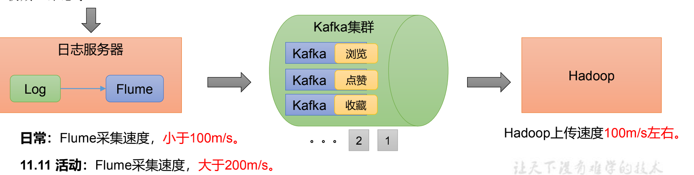

#### 1.2 消息队列

目前企业中比较常见的消息队列产品主要有Kafka、ActiveMQ、RabbitMQ、RocketMQ等。

在大数据场景主要采用Kafka作为消息队列。在JavaEE开发中主要采用ActiveMQ、RabbitMQ、RocketMQ。

##### 1.2.1 传统消息队列的应用场景

传统的消息队列的主要应用场景包括**：缓存/消峰、解耦**和**异步通信**。

**缓冲/消峰**： 有助于控制和优化数据流经过系统的速度，解决生产消息和消费消息的处理速度不一致的情况。

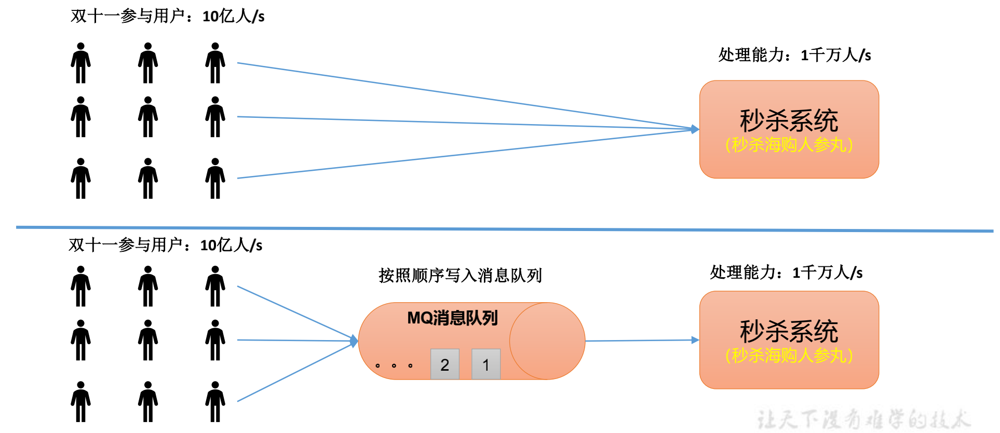

**解耦**：允许你独立的扩展或修改两边的处理过程，只要确保它们遵守同样的接口约束。

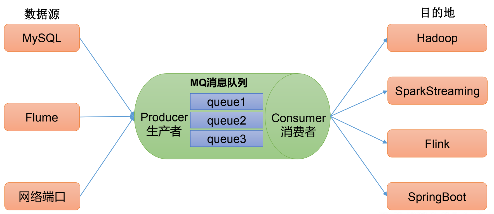

**异步通信**：允许用户把一个消息放入队列，但并不立即处理它，然后再需要的时候再去处理它们。

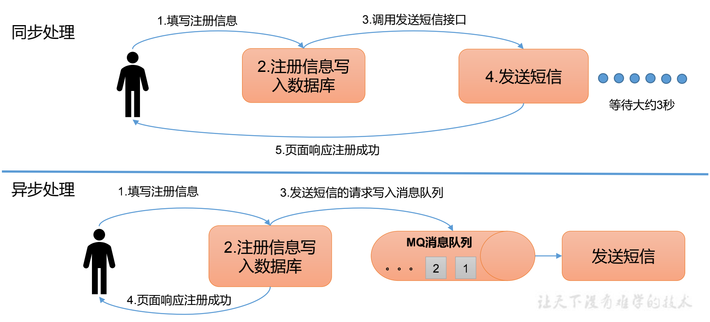

##### 1.2.2 消息队列的两种模式

**1、点对点模式**

- 消费者主动拉去数据，消息收到后清除消息

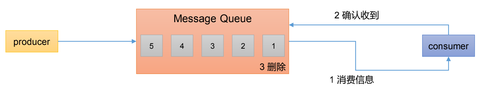

**2、发布/订阅模式**

- 可以有多个topic主题(浏览，点赞，收藏，评论等)
- 消费者消费数据之后，不删除数据
- 每个消费者互相独立，都可以消费到数据

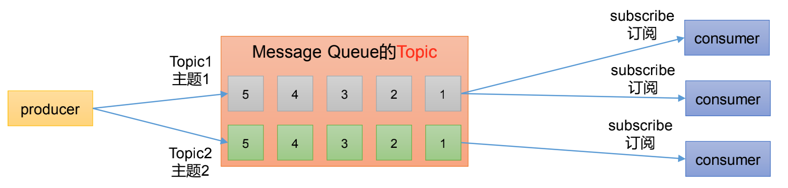

#### 1.3 Kafka基础架构

1、为方便扩展，并提高吞吐量，一个topic分为多个partition

2、配合分区的设计，提出消费者组的概念，组内每个消费者并行消费

3、为提高可用性，为每个partition增加若干副本，类似NameNode HA

4、ZK中记录谁是leader，Kafka2.8.0 以后也可以配置不采用ZK

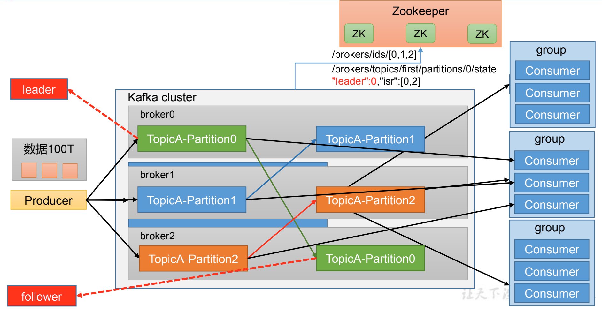


- **Producer**：消息生产者，就是向Kafka broker 发消息的客户端。
- **Consumer**：消息消费者，向Kafka broker 取消息的客户端。

- **Consumer Group（CG）**：消费者组，由多个consumer组成。消费者组内每个消费者负责消费不同分区的数据，一个分区只能由一个组内消费者消费；消费者组之间互不影响。所有的消费者都属于某个消费者组，即消费者组是逻辑上的一个订阅者。

- **Broker**：一台Kafka服务器就是一个broker。一个集群由多个broker组成。一个broker可以容纳多个topic。
- **Topic**： 可以理解为一个队列，生产者和消费者面向的都是一个topic。
- **Partition**： 为了实现扩展性，一个非常大的topic可以分布到多个broker（即服务器）上，一个topic可以分为多个partition，每个partition是一个有序的队列。
- **Replica**：副本。一个topic的每个分区都有若干个副本，一个Leader和若干个Follower。
- **Leader**：每个分区多个副本的 "主"，生产者发送数据的对象，以及消费者消费数据的对象都是Leader。
- **Follower**：每个分区多个副本中的 "从"，实时从 Leader 中同步数据，保持和 Leader 数据的同步。Leader 发生故障时，某个Follower会成为新的 Leader。

### 二、Kafka快速入门

#### 2.1 安装部署

##### 2.1.1 集群规划

| Hadoop102 | Hadoop103 | Hadoop104 |
| --------- | --------- | --------- |
| zk        | zk        | zk        |
| kafka     | kafka     | kafka     |

##### 2.1.2 集群部署

1、官方下载地址：http://kafka.apache.org/downloads.html

2、解压安装包

```tex
[yooome@192 local % sudo tar -zxvf kafka_2.13-3.1.0.tgz 
```

3、修改解压后的文件名称

```basic
[yooome@192 local % sudo mv kafka_2.13-3.1.0 kafka
```

4、进入到/usr/local/kafka目录，修改配置文件

```basic
yooome@192 kafka % cd config 
yooome@192 config % vim server.properties 
```

输入一下内容：

```bash
#broker 的全局唯一编号，不能重复，只能是数字。
broker.id=0
#处理网络请求的线程数量
num.network.threads=3
#用来处理磁盘 IO 的线程数量
num.io.threads=8
#发送套接字的缓冲区大小
socket.send.buffer.bytes=102400
#接收套接字的缓冲区大小
socket.receive.buffer.bytes=102400
#请求套接字的缓冲区大小
socket.request.max.bytes=104857600
#kafka 运行日志(数据)存放的路径，路径不需要提前创建，kafka 自动帮你创建，可以
配置多个磁盘路径，路径与路径之间可以用"，"分隔
log.dirs=/opt/module/kafka/datas
#topic 在当前 broker 上的分区个数
num.partitions=1
#用来恢复和清理 data 下数据的线程数量
num.recovery.threads.per.data.dir=1
# 每个 topic 创建时的副本数，默认时 1 个副本
offsets.topic.replication.factor=1
#segment 文件保留的最长时间，超时将被删除
log.retention.hours=168
#每个 segment 文件的大小，默认最大 1G
log.segment.bytes=1073741824
# 检查过期数据的时间，默认 5 分钟检查一次是否数据过期
log.retention.check.interval.ms=300000
#配置连接 Zookeeper 集群地址（在 zk 根目录下创建/kafka，方便管理）
zookeeper.connect=hadoop102:2181,hadoop103:2181,hadoop104:2181/kafka
```

5、分发安装包

```ba
[yooome@hadoop102 module]$ xsync kafka/
```

6、分别在hadoop103和hadoop104 上修改配置文件/opt/module/kafka/config/server.properties中的 broker.id=1、broker.id=2

**注**：broker.id 不得重复，整个集群中唯一

```bash
[atguigu@hadoop103 module]$ vim kafka/config/server.properties
修改:
# The id of the broker. This must be set to a unique integer for each broker.
broker.id=1
[atguigu@hadoop104 module]$ vim kafka/config/server.properties
修改:
# The id of the broker. This must be set to a unique integer for each broker.
broker.id=2
```

7、配置环境变量

（1）在/etc/profile.d/my_env.sh 文件中增加 kafka 环境变量配置

```bash
[atguigu@hadoop102 module]$ sudo vim /etc/profile.d/my_env.sh
增加如下内容：
#KAFKA_HOME
export KAFKA_HOME=/opt/module/kafka
export PATH=$PATH:$KAFKA_HOME/bin
```

（2）刷新一下环境变量。

```bash
[atguigu@hadoop102 module]$ source /etc/profile
```

（3）分发环境变量文件到其他节点，并 source。

```bash
[atguigu@hadoop102 module]$ sudo /home/atguigu/bin/xsync /etc/profile.d/my_env.sh
[atguigu@hadoop103 module]$ source /etc/profile
[atguigu@hadoop104 module]$ source /etc/profile
```

8、启动集群

（1）先启动 Zookeeper 集群，然后启动 Kafka。

```bash
[atguigu@hadoop102 kafka]$ zk.sh start
```

（2）依次在 hadoop102、hadoop103、hadoop104 节点上启动 Kafka。

```bash
[atguigu@hadoop102 kafka]$ bin/kafka-server-start.sh -daemon
config/server.properties
[atguigu@hadoop103 kafka]$ bin/kafka-server-start.sh -daemon
config/server.properties
[atguigu@hadoop104 kafka]$ bin/kafka-server-start.sh -daemon
config/server.properties
```

**注意：配置文件的路径要能够到 server.properties。**

9、关闭集群

```bash
[atguigu@hadoop102 kafka]$ bin/kafka-server-stop.sh 
[atguigu@hadoop103 kafka]$ bin/kafka-server-stop.sh 
[atguigu@hadoop104 kafka]$ bin/kafka-server-stop.sh
```

##### 2.1.3 集群启停脚本

1）在/home/atguigu/bin 目录下创建文件 kf.sh 脚本文件

```bash
[atguigu@hadoop102 bin]$ vim kf.sh
```

脚本如下：

```bash
#! /bin/bash
case $1 in
"start"){
	for i in hadoop102 hadoop103 hadoop104
	do
		echo " --------启动 $i Kafka-------"
		ssh $i "/opt/module/kafka/bin/kafka-server-start.sh -
	daemon /opt/module/kafka/config/server.properties"
	done
};;
"stop"){
	for i in hadoop102 hadoop103 hadoop104
	do
		echo " --------停止 $i Kafka-------"
		ssh $i "/opt/module/kafka/bin/kafka-server-stop.sh "
	done
};;
esac
```

2）添加执行权限

```bash
[atguigu@hadoop102 bin]$ chmod +x kf.sh
```

3）启动集群命令

```bash
[atguigu@hadoop102 ~]$ kf.sh start
```

4）停止集群命令

```bash
[atguigu@hadoop102 ~]$ kf.sh stop
```

**注意**：停止 Kafka 集群时，一定要等 Kafka 所有节点进程全部停止后再停止 Zookeeper集群。因为 Zookeeper 集群当中记录着 Kafka 集群相关信息，Zookeeper 集群一旦先停止，Kafka 集群就没有办法再获取停止进程的信息，只能手动杀死 Kafka 进程了。

待续。。。。。。

#### 2.2 Kafka命令行操作

##### 2.2.1 Kafka基础架构

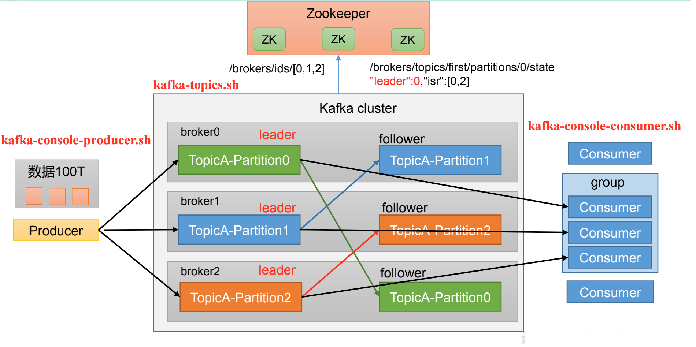

##### 2.2.2 主题命令行操作

1、查看操作主题命令参数

```basic
yooome@192 kafka % ./bin/kafka-topics.sh 
```

| 参数                                              | 描述                                   |
| :------------------------------------------------ | :------------------------------------- |
| --bootstrap-server <String: server toconnect to>  | 连接的 Kafka Broker 主机名称和端口号。 |
| --topic <String: topic>                           | 操作的 topic 名称。                    |
| --create                                          | 创建主题                               |
| --delete                                          | 删除主题                               |
| --alter                                           | 修改主题                               |
| --list                                            | 查看所有主题                           |
| --describe                                        | 查看主题详细描述                       |
| --partitions <Integer: # of partitions>           | 设置分区数。                           |
| --replication-factor<Integer: replication factor> | 设置分区副本。                         |
| --config <String: name=value>                     | 更新系统默认的配置。                   |

2、查看当前服务器中的所有topic

```bash
yooome@192 kafka % ./bin/kafka-topics.sh --bootstrap-server localhost:9092 --list
```

3、创建 `first topic`

```bash
yooome@192 kafka % ./bin/kafka-topics.sh --bootstrap-server localhost:9092 --create --partitions 1 --replication-factor 1 --topic first
```

- 选项说明：
  1. --topic 定义 topic 名
  2. --replication-factor 定义副本数
  3. --partitions 定义分区数

4、查看 `first` 主题的详情

```bash
yooome@192 kafka % ./bin/kafka-topics.sh --bootstrap-server localhost:9092 --topic first --describe
```

5、修改分区数（注意：分区数只能增加，不能减少）

```shell
yooome@192 kafka % ./bin/kafka-topics.sh --bootstrap-server localhost:9092 --alter --topic first --partitions 3
```

6、查看结果：

```shell
yooome@192 kafka % ./bin/kafka-topics.sh --bootstrap-server localhost:9092 --topic first --describe 
Topic: first	TopicId: _Pjhmn1NTr6ufGufcnsw5A	PartitionCount: 3	ReplicationFactor: 1	Configs: segment.bytes=1073741824
	Topic: first	Partition: 0	Leader: 0	Replicas: 0	Isr: 0
	Topic: first	Partition: 1	Leader: 0	Replicas: 0	Isr: 0
	Topic: first	Partition: 2	Leader: 0	Replicas: 0	Isr: 0
```

7、删除 `topic `

```shell
yooome@192 kafka % ./bin/kafka-topics.sh --bootstrap-server localhost:9092 --delete --topic first 
```

##### 2.2.3 生产者命令行操作

1、查看操作者命令参数

```shell
yooome@192 kafka % ./bin/kafka-console-producer.sh 
```

| 参数                                             | 描述                                   |
| ------------------------------------------------ | -------------------------------------- |
| --bootstrap-server <String: server toconnect to> | 连接的 Kafka Broker 主机名称和端口号。 |
| --topic <String: topic>                          | 操作的 topic 名称。                    |

2、发送消息

```shell
yooome@192 kafka % ./bin/kafka-console-producer.sh --bootstrap-server localhost:9092 --topic first
>hello world
>yooome yooome
```

##### 2.3.4 消费者命令行操作

1、查看操作消费者命令参数

| 参数                                             | 描述                                   |
| ------------------------------------------------ | -------------------------------------- |
| --bootstrap-server <String: server toconnect to> | 连接的 Kafka Broker 主机名称和端口号。 |
| --topic <String: topic>                          | 操作的 topic 名称。                    |
| --from-beginning                                 | 从头开始消费。                         |
| --group <String: consumer group id>              | 指定消费者组名称。                     |

2、消费消息

- 消费`first` 主题中的数据

```shell
yooome@192 kafka % ./bin/kafka-console-consumer.sh --bootstrap-server localhost:9092 --topic first
```

- 把主题中所有的数据都读取出来（包括历史数据）。

```shell
yooome@192 kafka % ./bin/kafka-console-consumer.sh --bootstrap-server localhost:9092 --from-beginning --topic first
```

### 三、Kafka生产者

#### 3.1 生产者消息发送流程

##### 3.1.1 发送原理

在消息发送的过程中，涉及到了两个线程 --- main 线程和Sender线程。在main线程中创建了一个双端队列 RecordAccumulator。main线程将消息发送给ResordAccumlator，Sender线程不断从 RecordAccumulator 中拉去消息发送到 Kafka Broker

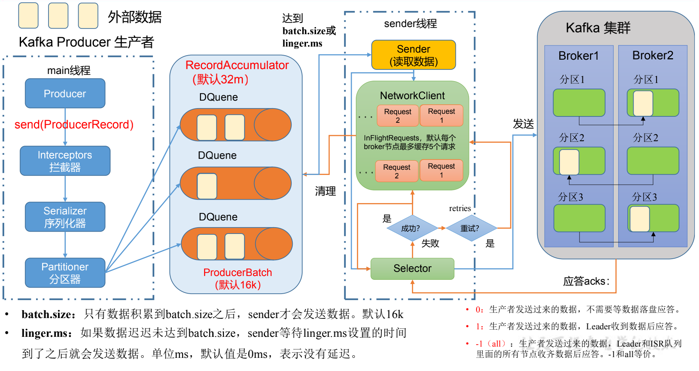

##### 3.1.2 生产者重要参数列表

| 参数名称                              | 描述                                                         |
| ------------------------------------- | ------------------------------------------------------------ |
| bootstrap.servers                     | 生产者连接集群所需的 broker 地 址 清 单 。 例 如hadoop102:9092,hadoop103:9092,hadoop104:9092，可以设置 1 个或者多个，中间用逗号隔开。注意这里并非需要所有的 broker 地址，因为生产者从给定的 broker里查找到其他 broker 信息。 |
| key.serializer 和 value.serializer    | 指定发送消息的 key 和 value 的序列化类型。一定要写全类名。   |
| buffer.memory                         | RecordAccumulator 缓冲区总大小，默认 32m。                   |
| batch.size                            | 缓冲区一批数据最大值，默认 16k。适当增加该值，可以提高吞吐量，但是如果该值设置太大，会导致数据传输延迟增加。 |
| linger.ms                             | 如果数据迟迟未达到 batch.size，sender 等待 linger.time之后就会发送数据。单位 ms，默认值是 0ms，表示没有延迟。生产环境建议该值大小为 5-100ms 之间。 |
| acks                                  | 0：生产者发送过来的数据，不需要等数据落盘应答。1：生产者发送过来的数据，Leader 收到数据后应答。-1（all）：生产者发送过来的数据，Leader+和 isr 队列里面的所有节点收齐数据后应答。默认值是-1，-1 和all 是等价的。 |
| max.in.flight.requests.per.connection | 允许最多没有返回 ack 的次数，默认为 5，开启幂等性要保证该值是 1-5 的数字。 |
| retries                               | 当消息发送出现错误的时候，系统会重发消息。retries表示重试次数。默认是 int 最大值，2147483647。如果设置了重试，还想保证消息的有序性，需要设置MAX_IN_FLIGHT_REQUESTS_PER_CONNECTION=1否则在重试此失败消息的时候，其他的消息可能发送成功了。 |
| retry.backoff.ms                      | 两次重试之间的时间间隔，默认是 100ms。                       |
| enable.idempotence                    | 是否开启幂等性，默认 true，开启幂等性。                      |
| compression.type                      | 生产者发送的所有数据的压缩方式。默认是 none，也就是不压缩。支持压缩类型：none、gzip、snappy、lz4 和 zstd。 |

#### 3.2 异步发送API

##### 3.2.1 普通异步发送

1、需求：创建Kafka生产者，采用异步的方式发送到Kafka Broker。

- **异步发送流程**


2、代码编程

- 创建工程kafka
- 导入依赖

```xml
<dependencies>
  <dependency>
    <groupId>org.apache.kafka</groupId>
    <artifactId>kafka-clients</artifactId>
    <version>3.0.0</version>
  </dependency>
</dependencies>
```

- 创建包名：com.yooome.kafka.producer

```java
package com.yooome.kafka.producer;

import org.apache.kafka.clients.producer.KafkaProducer;
import org.apache.kafka.clients.producer.ProducerConfig;
import org.apache.kafka.clients.producer.ProducerRecord;

import java.util.Properties;

public class CustomProducer {
    public static void main(String[] args) {
        // 1. 创建kafka生产者配置对象
        Properties properties = new Properties();
        // 2. 给 kafka 配置对象添加配置信息：bootstrap.servers
        properties.put(ProducerConfig.BOOTSTRAP_SERVERS_CONFIG, "localhost:9092");
        // key,value 序列化（必须）：key.serializer，value.serializer
        properties.put(ProducerConfig.KEY_SERIALIZER_CLASS_CONFIG, "org.apache.kafka.common.serialization.StringSerializer");
        properties.put(ProducerConfig.VALUE_SERIALIZER_CLASS_CONFIG, "org.apache.kafka.common.serialization.StringSerializer");
        // 3. 创建 kafka 生产者对象
        KafkaProducer<String, String> kafkaProducer = new KafkaProducer<String, String>(properties);
        // 4. 调用 send 方法,发送消息
        for (int i = 0; i < 5; i++) {
            kafkaProducer.send(new ProducerRecord<>("first", "yooome" + i));
        }
        // 5. 关闭资源
        kafkaProducer.close();
    }
}
```

- 测试
  1. 在 hadoop102 上开启 Kafka 消费者。

```shell
yooome@192 kafka % ./bin/kafka-console-consumer.sh --bootstrap-server localhost:9092 --topic first
```

​		2. 在 IDEA 中执行代码，观察 hadoop102 控制台中是否接收到消息。

```shell
yooome@192 kafka % ./bin/kafka-console-consumer.sh --bootstrap-server localhost:9092 --topic first
yooome0
yooome1
yooome2
yooome3
yooome4
```

##### 3.2.2 带回调函数的异步发送

回调函数会在producer收到ack时调用，为异步调用，该方法有两个参数，分别是元数据信息(RecordMetadata)和异常信息(Exception)，如果Exception为null，说明消息发送成功，如果Exception不为null，说明消息发送失败。

**带回调函数的异步发送**


【注意:】消息发送失败会自动重试，不需要我们在回调函数中手动重试。

```java
package com.yooome.kafka.producer;

import org.apache.kafka.clients.producer.*;
import org.apache.kafka.common.serialization.StringSerializer;

import java.util.Properties;

public class CustomProducerCallback {
    public static void main(String[] args) throws InterruptedException {
        // 1. 创建Kafka生产者的配置对象
        Properties properties = new Properties();
        // 2. 给kafka配置对象添加配置信息
        properties.put(ProducerConfig.BOOTSTRAP_SERVERS_CONFIG, "localhost:9092");
        // 3. key 序列化 key.serializer，value.serializer
        properties.put(ProducerConfig.KEY_SERIALIZER_CLASS_CONFIG, StringSerializer.class.getName());
        // 4. value 序列化 value.serializer
        properties.put(ProducerConfig.VALUE_SERIALIZER_CLASS_CONFIG, StringSerializer.class.getName());
        // 5. 创建kafka生产者对象
        KafkaProducer<String,String> kafkaProducer = new KafkaProducer<String, String>(properties);
        for (int i = 0; i < 5; i++) {
            kafkaProducer.send(new ProducerRecord<>("first", "yooome " + i), new Callback() {
                // 该方法在Producer 收到 ack 时调用，为异步调用
                @Override
                public void onCompletion(RecordMetadata recordMetadata, Exception e) {
                    if (e == null) {
                        // 没有异常，输出信息到控制台
                        System.out.println(" 主题：" + recordMetadata.topic() + " -> " + " 分区 " + recordMetadata.partition());
                    }else {
                        e.printStackTrace();
                    }
                }
            });
            // 延迟一会会看到数据发往不同分区
            //Thread.sleep(2);
        }
        // 5. 关闭资源
        kafkaProducer.close();
    }
}

```

- 测试：
  1. 在在 hadoop102 上开启 Kafka 消费者。

```bash
yooome@192 kafka % ./bin/kafka-console-consumer.sh --bootstrap-server localhost:9092 --topic first
```

   		 2. 在 IDEA 中执行代码，观察 hadoop102 控制台中是否接收到消息 

```bash
yooome@192 kafka % ./bin/kafka-console-consumer.sh --bootstrap-server localhost:9092 --topic first
yooome 0
yooome 1
yooome 2
yooome 3
yooome 4
```

3. 在 IDEA 控制台观察回调信息(注意：本up主，只启用了一台kafka，故各位根据自己的集群数而定)

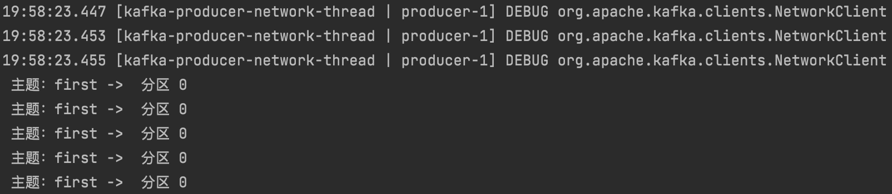

#### 3.3 同步发送API


只需要在异步发送的基础上，在调用一下 get() 方法即可。

```java
package com.yooome.kafka.producer;

import org.apache.kafka.clients.producer.*;
import org.apache.kafka.common.serialization.StringSerializer;

import java.util.Properties;
import java.util.concurrent.ExecutionException;

public class CustomProducerCallback {
    public static void main(String[] args) throws InterruptedException, ExecutionException {
        // 1. 创建Kafka生产者的配置对象
        Properties properties = new Properties();
        // 2. 给kafka配置对象添加配置信息
        properties.put(ProducerConfig.BOOTSTRAP_SERVERS_CONFIG, "localhost:9092");
        // 3. key 序列化 key.serializer，value.serializer
        properties.put(ProducerConfig.KEY_SERIALIZER_CLASS_CONFIG, StringSerializer.class.getName());
        // 4. value 序列化 value.serializer
        properties.put(ProducerConfig.VALUE_SERIALIZER_CLASS_CONFIG, StringSerializer.class.getName());
        // 5. 创建kafka生产者对象
        KafkaProducer<String,String> kafkaProducer = new KafkaProducer<String, String>(properties);
        for (int i = 0; i < 5; i++) {
            //异步发送
            // kafkaProducer.send(new ProducerRecord<>("first","kafka" + i));
            // 6. 同步发送
            kafkaProducer.send(new ProducerRecord<>("first","kafka" + i)).get();
        }
        // 7. 关闭资源
        kafkaProducer.close();
    }
}

```

**测试**：

1. 在在 hadoop102 上开启 Kafka 消费者。

```bash
yooome@192 kafka % ./bin/kafka-console-consumer.sh --bootstrap-server localhost:9092 --topic first
```

   		 2. 在 IDEA 中执行代码，观察 hadoop102 控制台中是否接收到消息 

```bash
yooome@192 kafka % ./bin/kafka-console-consumer.sh --bootstrap-server localhost:9092 --topic first
kafka0
kafka1
kafka2
kafka3
kafka4
```

#### 3.4 生产者分区

##### 3.4.1 分区好处

1. **便于合理使用存储资源**，每个Partition在一个Broker上存储，可以把海量的数据按照分区切割成一块一块数据存储在多台Broker上。合理控制分区的任务，可以实现**负载均衡**的效果。

2. **提高并行度**，生产者可以以分区为单位**发送数据**；消费者可以以分区为单位进行 **消费数据**。

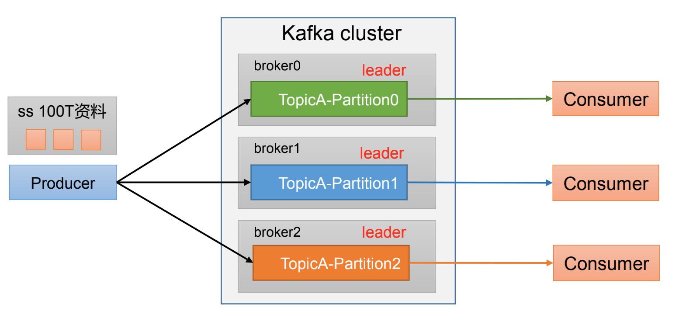

##### 3.4.2 生产者发送消息的分区策略

1. **默认的分区器DefaultPartitioner**

   在IDEA中ctrl + n，全局查找 DefaultPartitioner

```java
public class DefaultPartitioner implements Partitioner {
   ....
}
```

2. **Kafka原则**

ProducerRecord类，在类中可以看到如下构造方法：

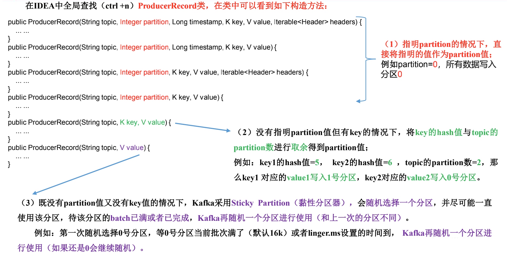

1. 指明partition的情况下，直接将指明的值作为partition值；例如：partition=0，所有数据写入分区0。
2. 没有指明 partition 值但有key的情况下，将key的hash值与topic的partition数进行取余得到partition值；例如：key1的hash值=5，key2的hash值=6，topic的partition数=2，那么key1对应的value1写入 1 号分区，key2对应的 value2 写入 0 号分区。
3. 既没有partition值又没有key值的情况下，Kafka采用 Sticky Partition（粘性分区器），会随机选择一个分区，并尽可能一直使用该分区，待该分区的 batch 已满或者已完成，Kafka在随机一个分区进行使用（和上一次的分区不同）。例如：第一次随机选择0号分区，等0号分区当前批次满了（默认16K）或者；linger.ms设置的时间到，Kafka在随机一个分区进行使用（如果还是0会继续随机）。

【案例一】

将数据发往指定partition的情况下，例如，将所有数据发往分区 0【注意：本up主开启了一台kafka，只能发往分区0，你们注意自己的分区】 中。

```java
package com.yooome.kafka.producer;

import org.apache.kafka.clients.producer.*;
import org.apache.kafka.common.serialization.StringSerializer;

import java.util.Properties;
import java.util.concurrent.ExecutionException;

public class CustomProducerCallbackPartitions {
    public static void main(String[] args) throws InterruptedException, ExecutionException {
        // 1. 创建Kafka生产者的配置对象
        Properties properties = new Properties();
        // 2. 给kafka配置对象添加配置信息
        properties.put(ProducerConfig.BOOTSTRAP_SERVERS_CONFIG, "localhost:9092");
        // 3. key 序列化 key.serializer，value.serializer
        properties.put(ProducerConfig.KEY_SERIALIZER_CLASS_CONFIG, StringSerializer.class.getName());
        // 4. value 序列化 value.serializer
        properties.put(ProducerConfig.VALUE_SERIALIZER_CLASS_CONFIG, StringSerializer.class.getName());
        // 5. 创建kafka生产者对象
        KafkaProducer<String,String> kafkaProducer = new KafkaProducer<String, String>(properties);
        for (int i = 0; i < 5; i++) {
            //异步发送
            // kafkaProducer.send(new ProducerRecord<>("first","kafka" + i));
            // 6. 同步发送
            kafkaProducer.send(new ProducerRecord<>("first", 0, "", "ka ka ka " + i), new Callback() {
                @Override
                public void onCompletion(RecordMetadata recordMetadata, Exception e) {
                    if (e == null){
                        System.out.println(" 主题： " +
                                recordMetadata.topic() + "->" + "分区：" + recordMetadata.partition()
                        );
                    }else {
                        e.printStackTrace();
                    }
                }
            }).get();
        }
        // 7. 关闭资源
        kafkaProducer.close();
    }
}
```

测试：

1. 在 hadoop102 上开启 Kafka 消费者。

```java
yooome@192 kafka % ./bin/kafka-console-consumer.sh --bootstrap-server localhost:9092 --topic first
```

2. 在IDEA中执行代码，观察 hadoop102控制台中是否接收到消息。

```java
yooome@192 kafka % ./bin/kafka-console-consumer.sh --bootstrap-server localhost:9092 --topic first
ka ka ka 0
ka ka ka 1
ka ka ka 2
ka ka ka 3
ka ka ka 4
```

3. 在 IDEA 控制台观察回调信息。

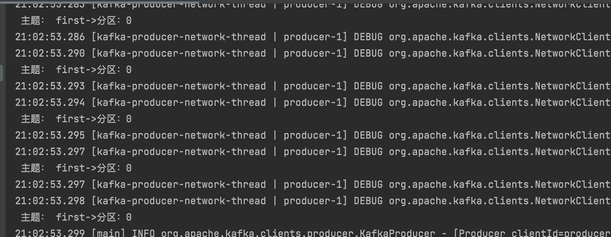

【案例二】

没有指明 partition 值但有 key 的情况下，将 key 的 hash 值与 topic 的 partition 数进行取余得到 partition 值。

**// 依次指定 key 值为 a,b,f ，数据 key 的 hash 值与 3 个分区求余，分别发往 1、2、0**

```java
package com.yooome.kafka.producer;

import org.apache.kafka.clients.producer.*;
import org.apache.kafka.common.serialization.StringSerializer;

import java.util.Properties;
import java.util.concurrent.ExecutionException;

public class CustomProducerCallbackPartitions {
    public static void main(String[] args) throws InterruptedException, ExecutionException {
        // 1. 创建Kafka生产者的配置对象
        Properties properties = new Properties();
        // 2. 给kafka配置对象添加配置信息
        properties.put(ProducerConfig.BOOTSTRAP_SERVERS_CONFIG, "localhost:9092");
        // 3. key 序列化 key.serializer，value.serializer
        properties.put(ProducerConfig.KEY_SERIALIZER_CLASS_CONFIG, StringSerializer.class.getName());
        // 4. value 序列化 value.serializer
        properties.put(ProducerConfig.VALUE_SERIALIZER_CLASS_CONFIG, StringSerializer.class.getName());
        // 5. 创建kafka生产者对象
        KafkaProducer<String,String> kafkaProducer = new KafkaProducer<String, String>(properties);
        for (int i = 0; i < 5; i++) {
            //异步发送
            // kafkaProducer.send(new ProducerRecord<>("first","kafka" + i));
            // 6. 同步发送
            // 依次指定 key 值为 a,b,f ，数据 key 的 hash 值与 3 个分区求余，分别发往 1、2、0
            kafkaProducer.send(new ProducerRecord<>("first",  "f"," fffffff " + i), new Callback() {
                @Override
                public void onCompletion(RecordMetadata recordMetadata, Exception e) {
                    if (e == null){
                        System.out.println(" 主题： " +
                                recordMetadata.topic() + "->" + "分区：" + recordMetadata.partition()
                        );
                    }else {
                        e.printStackTrace();
                    }
                }
            }).get();
        }
        // 7. 关闭资源
        kafkaProducer.close();
    }
}

```

测试：

①key="a"时，在控制台查看结果。

```java
主题：first->分区：1
主题：first->分区：1
主题：first->分区：1
主题：first->分区：1
主题：first->分区：1 
```

②key="b"时，在控制台查看结果。

```java
主题：first->分区：2
主题：first->分区：2
主题：first->分区：2
主题：first->分区：2
主题：first->分区：2 
```

③key="f"时，在控制台查看结果。

```java
主题：first->分区：0
主题：first->分区：0
主题：first->分区：0
主题：first->分区：0
主题：first->分区：0
```

##### 3.4.3 自定义分区器

如果研发人员可以根据企业需求，自己重新实现分区器

1. **需求**

例如我们实现一个分区器实现，发送过来的数据中如果包含 yooome，就发往 0 号分区，不包含 yooome ，就发往 1 号分区。

2. 实现步骤：

   (1) 定义类实现 Partition 接口。

   (2) 重写 partition() 方法。

```java
package com.yooome.kafka.producer;

import org.apache.kafka.clients.producer.Partitioner;
import org.apache.kafka.common.Cluster;

import java.util.Map;

public class MyPartitioner implements Partitioner {
    @Override
    public int partition(String s, Object key, byte[] bytes, Object value, byte[] bytes1, Cluster cluster) {
        // 获取消息
        String msgValue = value.toString();
        // 创建 partition
        int partition;
        if (msgValue.contains("yooome")) {
            partition = 0;
        } else {
            partition = 1;
        }
        return partition;
    }

    @Override
    public void close() {

    }

    @Override
    public void configure(Map<String, ?> map) {

    }
}

```

```java
package com.yooome.kafka.producer;

import org.apache.kafka.clients.producer.*;
import org.apache.kafka.common.serialization.StringSerializer;

import java.util.Properties;
import java.util.concurrent.ExecutionException;

public class CustomProducerCallbackPartitions {
    public static void main(String[] args) throws InterruptedException, ExecutionException {
        // 1. 创建Kafka生产者的配置对象
        Properties properties = new Properties();
        MyPartitioner myPartitioner = new MyPartitioner();
        // 2. 给kafka配置对象添加配置信息
        properties.put(ProducerConfig.BOOTSTRAP_SERVERS_CONFIG, "localhost:9092");
        // 3. key 序列化 key.serializer，value.serializer
        properties.put(ProducerConfig.KEY_SERIALIZER_CLASS_CONFIG, StringSerializer.class.getName());
        // 4. value 序列化 value.serializer
        properties.put(ProducerConfig.VALUE_SERIALIZER_CLASS_CONFIG, StringSerializer.class.getName());
        properties.put(ProducerConfig.PARTITIONER_CLASS_CONFIG, myPartitioner.getClass().getName());
        // 5. 创建kafka生产者对象
        KafkaProducer<String, String> kafkaProducer = new KafkaProducer<String, String>(properties);
        for (int i = 0; i < 5; i++) {
            //异步发送
            // kafkaProducer.send(new ProducerRecord<>("first","kafka" + i));
            // 6. 同步发送
            // 依次指定 key 值为 a,b,f ，数据 key 的 hash 值与 3 个分区求余，分别发往 1、2、0
            kafkaProducer.send(new ProducerRecord<>("first", "yooome fffffff " + i), new Callback() {
                @Override
                public void onCompletion(RecordMetadata recordMetadata, Exception e) {
                    if (e == null) {
                        System.out.println(" 主题： " +
                                recordMetadata.topic() + "->" + "分区：" + recordMetadata.partition()
                        );
                    } else {
                        e.printStackTrace();
                    }
                }
            }).get();
        }
        // 7. 关闭资源
        kafkaProducer.close();
    }
}

```

**测试**：

① 在 hadoop102 上开启 Kafka 消费者。

```java
yooome@192 kafka % ./bin/kafka-console-consumer.sh --bootstrap-server localhost:9092 --topic first
```

```bash
yooome@192 kafka % ./bin/kafka-console-consumer.sh --bootstrap-server localhost:9092 --topic first
yooome fffffff 0
yooome fffffff 1
yooome fffffff 2
yooome fffffff 3
yooome fffffff 4
```

②在 IDEA 控制台观察回调信息。

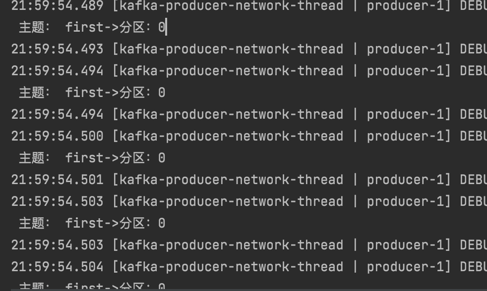

#### 3.5 生产经验----生产者如何提高吞吐量

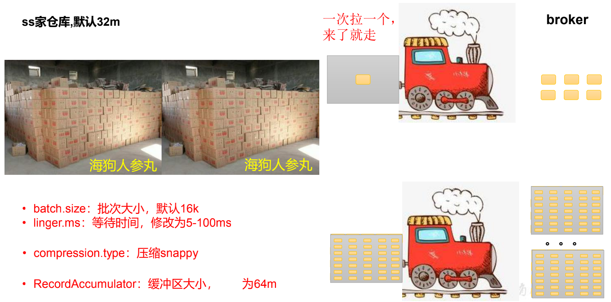

```java
package com.yooome.kafka.producer;

import org.apache.kafka.clients.producer.*;
import org.apache.kafka.common.serialization.StringSerializer;

import java.util.Properties;
import java.util.concurrent.ExecutionException;

public class CustomProducerParameters {
    public static void main(String[] args) throws ExecutionException, InterruptedException {
        // 1. 创建Kafka生产者的配置对象
        Properties properties = new Properties();
        // 2. 给kafka配置对象添加配置信息
        properties.put(ProducerConfig.BOOTSTRAP_SERVERS_CONFIG, "localhost:9092");
        // 3. key 序列化 key.serializer，value.serializer
        properties.put(ProducerConfig.KEY_SERIALIZER_CLASS_CONFIG, StringSerializer.class.getName());
        // 4. value 序列化 value.serializer
        properties.put(ProducerConfig.VALUE_SERIALIZER_CLASS_CONFIG, StringSerializer.class.getName());
        // batch size 批次大小，默认 16k
        properties.put(ProducerConfig.BATCH_SIZE_CONFIG, 16384);
        // linger.ms : 等待时间， 默认0
        properties.put(ProducerConfig.LINGER_MS_CONFIG, 0);
        // 缓冲区大小
        properties.put(ProducerConfig.BUFFER_MEMORY_CONFIG, 33554432);
        //  compression.type：压缩，默认 none，可配置值 gzip、snappy、lz4 和 zstd
        // properties.put(ProducerConfig.COMPRESSION_TYPE_CONFIG,"snappy");

        // 5. 创建kafka生产者对象
        KafkaProducer<String, String> kafkaProducer = new KafkaProducer<String, String>(properties);
        for (int i = 0; i < 5; i++) {
            //异步发送
            // kafkaProducer.send(new ProducerRecord<>("first","kafka" + i));
            // 6. 同步发送
            // 依次指定 key 值为 a,b,f ，数据 key 的 hash 值与 3 个分区求余，分别发往 1、2、0
            kafkaProducer.send(new ProducerRecord<>("first", "ProducerRecord" + i));
        }
        // 7. 关闭资源
        kafkaProducer.close();
    }
}
```

【注意】：compression.type：压缩，默认 none，可配置值 gzip、snappy、lz4 和 zstd

```bash
Mac 电脑对 compression.type 不兼容，出现报错 如下：

org.apache.spark.SparkException: Job aborted due to stage failure: Task 0 in stage 0.0 failed 1 times, most recent failure: Lost task 0.0 in stage 0.0 (TID 0, localhost, executor driver): org.xerial.snappy.SnappyError: [FAILED_TO_LOAD_NATIVE_LIBRARY] no native library is found for os.name=Mac and os.arch=aarch64
```

**测试**：

**查看控制台是否接收到消息**

```java
yooome@192 kafka % ./bin/kafka-console-consumer.sh --bootstrap-server localhost:9092 --topic first
ProducerRecord0
ProducerRecord1
ProducerRecord2
ProducerRecord3
ProducerRecord4
```

#### 3.6 生产经验----数据可靠性

##### 3.6.1 回顾发送流程


##### 3.6.2 ACK应答级别

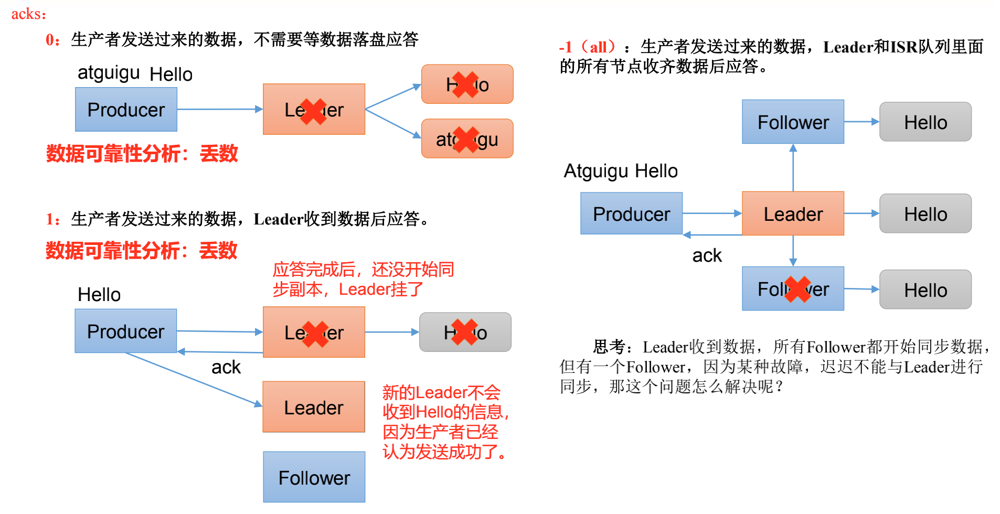


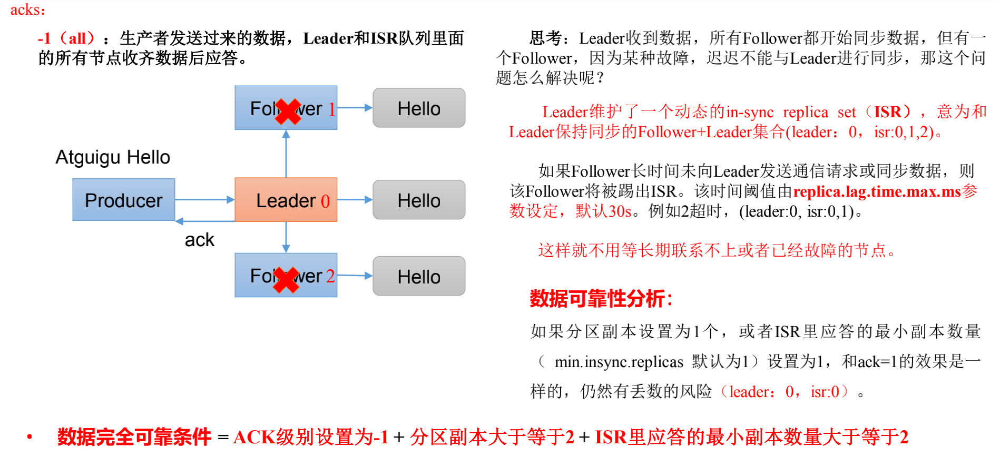

**可靠性总结**：

1. acks=0，生产者发送过来数据就不管了，可靠性差，效率高；
2. acks=1，生产者发送过来数据 Leader 应答，可靠性中等，效率中等；
3. acks=-1，生产者发送过来数据 Leader 和 ISR 队列里面所有Follwer应答，可靠性，效率低；

在生产环境中，acks=0很少使用；acks=1，一般用于传输普通的日志，允许丢个别数据；acks=-1，一般用于传输和钱相关的数据，对可靠性要求比较高的场景。


**数据重复分析**：

acks：-1（all）：生产者发送过来的数据，Leader和ISR队列里面的所有节点收齐数据后应答。

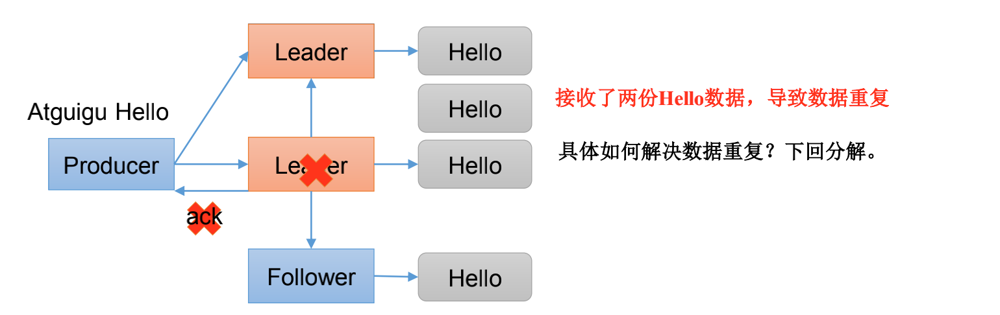

**代码配置**

```java
package com.yooome.kafka.producer;

import org.apache.kafka.clients.producer.KafkaProducer;
import org.apache.kafka.clients.producer.ProducerConfig;
import org.apache.kafka.clients.producer.ProducerRecord;
import org.apache.kafka.common.serialization.StringSerializer;

import java.util.Properties;

public class CustomProducerAck {
    public static void main(String[] args) {
        // 1. 创建Kafka生产者的配置对象
        Properties properties = new Properties();
        // 2. 给kafka配置对象添加配置信息
        properties.put(ProducerConfig.BOOTSTRAP_SERVERS_CONFIG, "localhost:9092");
        // 3. key 序列化 key.serializer，value.serializer
        properties.put(ProducerConfig.KEY_SERIALIZER_CLASS_CONFIG, StringSerializer.class.getName());
        // 4. value 序列化 value.serializer
        properties.put(ProducerConfig.VALUE_SERIALIZER_CLASS_CONFIG, StringSerializer.class.getName());
        // 设置 acks
        properties.put(ProducerConfig.ACKS_CONFIG, "all");
        // 重试次数
        properties.put(ProducerConfig.RETRIES_CONFIG, 3);
        // 5. 创建kafka生产者对象
        KafkaProducer<String, String> kafkaProducer = new KafkaProducer<String, String>(properties);
        for (int i = 0; i < 5; i++) {
            //异步发送
            // kafkaProducer.send(new ProducerRecord<>("first","kafka" + i));
            // 6. 同步发送
            // 依次指定 key 值为 a,b,f ，数据 key 的 hash 值与 3 个分区求余，分别发往 1、2、0
            kafkaProducer.send(new ProducerRecord<>("first", "acks acks " + i));
        }
        // 7. 关闭资源
        kafkaProducer.close();
    }
}

```

#### 3.7 生产经验------数据去重

##### 3.7.1 数据传递语义

- 至少一次（At Least Once） = ACK 级别设置为-1 + 分区副本大于等于 2 + ISR 里应答的最小副本数量大于等于 2 ；
- 最多一次（At Most Once）= ACK 级别设置为 0 ；
- **总结**：
  1. At Least Once 可以保证数据不丢失，但是不能保证数据不重复；
  2. At Most Once 可以保证数据不重复，但是不能保证数据不丢失。

- 精确一次（Exactly Once）：对于一些非常重要的信息，比如和钱相关的数据，要求数据既不能重复也不丢失。

  Kafka 0.11版本以后，引入了一项重大特性：幂等性和事务。

##### 3.7.2 幂等性

1. **幂等性原理**

**幂等性** 就是指 Producer 不论向 Broker 发送多少次重复数据，Broker 端都只会持久化一条，保证了不重复。

**精确一次（Exactly Once）**= 幂等性 + 至少一次（ack=-1 + 分区副本数 >= 2 + ISR 最小副本数量 >= 2)。

**重复数据的判断标准**：具有<PID, Partition, SeqNumber>相同主键的消息提交时，Broker只会持久化一条。其 中PID是Kafka每次重启都会分配一个新的；Partition 表示分区号；Sequence Number是单调自增的。

所以幂等性只能保证的是**在单分区单会话内不重复**

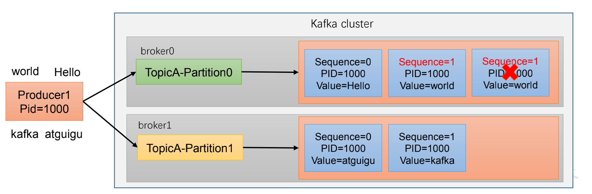

2. **如何使用幂等性**

   开启参数 enable.idempotence 默认为 true，false 关闭。

##### 3.7.3 生产者事务

1. **Kafka事务原理**：

【注意】说明，开启事务，必须开启幂等性

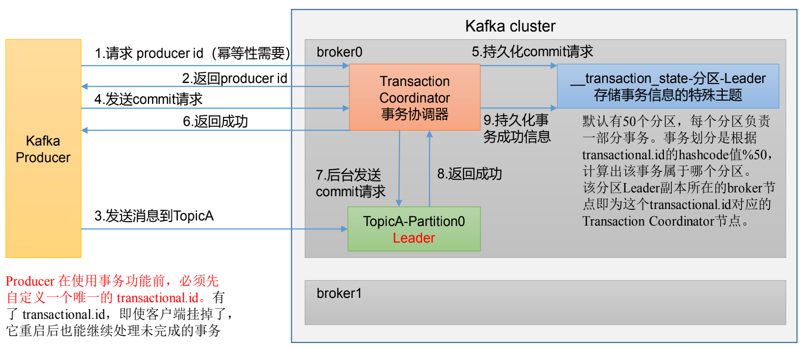

2. **Kafka的事务一共有如下 5 个 API**

```java
// 1. 初始化事务
void initTransactions();
// 2. 开启事务
void beginTransaction() throws ProducerFencedException;
// 3. 在事务内提交已经消费的偏移量(主要用于消费者)
void sendOffsetsToTransaction(Map<TopicPartition,OffsetAndMetadata> offsets, String consumerGroupId) throws ProducerFencedException;
// 4. 提交事务
void commitTransaction() throws ProducerFencedException;
// 5. 放弃事务(类似于混滚事务的操作)
void abortTransaction() throws ProducerFencedException;
```

3. 单个Producer，使用事务保证消息的仅一次发送

```java
package com.yooome.kafka.producer;

import org.apache.kafka.clients.producer.KafkaProducer;
import org.apache.kafka.clients.producer.ProducerConfig;
import org.apache.kafka.clients.producer.ProducerRecord;
import org.apache.kafka.common.serialization.StringSerializer;

import java.util.Properties;

public class CustomProducerTransactions {
    public static void main(String[] args) {
        // 1. 创建Kafka生产者的配置对象
        Properties properties = new Properties();
        // 2. 给kafka配置对象添加配置信息
        properties.put(ProducerConfig.BOOTSTRAP_SERVERS_CONFIG, "localhost:9092");
        // 3. key 序列化 key.serializer，value.serializer
        properties.put(ProducerConfig.KEY_SERIALIZER_CLASS_CONFIG, StringSerializer.class.getName());
        // 4. value 序列化 value.serializer
        properties.put(ProducerConfig.VALUE_SERIALIZER_CLASS_CONFIG, StringSerializer.class.getName());
        // 设置 事务 id(必须)，事务 id 任意起名
        properties.put(ProducerConfig.TRANSACTIONAL_ID_CONFIG,"transaction_id_0");
        // 5. 创建kafka生产者对象
        KafkaProducer<String, String> kafkaProducer = new KafkaProducer<String, String>(properties);
        // 初始化事务
        kafkaProducer.initTransactions();
        // 开启事务
        kafkaProducer.beginTransaction();
        try {
            for (int i = 0; i < 5; i++) {
                //异步发送
                // kafkaProducer.send(new ProducerRecord<>("first","kafka" + i));
                // 6. 同步发送
                // 依次指定 key 值为 a,b,f ，数据 key 的 hash 值与 3 个分区求余，分别发往 1、2、0
                kafkaProducer.send(new ProducerRecord<>("first", "transaction"));
            }
            // 提交事务
            kafkaProducer.commitTransaction();
        }catch (Exception e){
            // 终止事务
            kafkaProducer.abortTransaction();
        }finally {
            // 7. 关闭资源
            kafkaProducer.close();
        }
    }
}

```

#### 3.8 生产经验-----数据有序

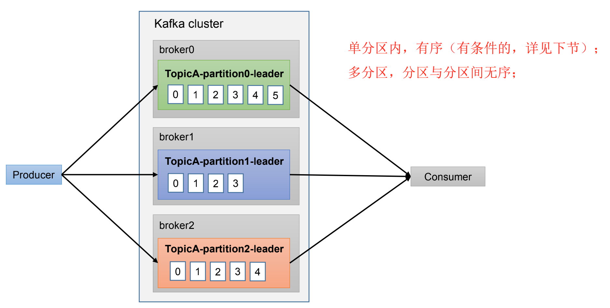

#### 3.9 生产经验-----数据乱序

1、kafka在1.x 版本之前保证数据单分区有序，条件如下：

​	**max.in.flight.requests.per.connection**=1（不需要考虑是否开启幂等性）。

2、kafka在1.x及以后版本保证数据单分区有序，条件如下：

- **未开启幂等性**

  **max.in.flight.requests.per.connection** 需要设置为1。

- **开启幂等性**

  **max.in.flight.requests.per.connection** 需要设置小于等于5。

原因说明：因为在kafka1.x以后，启用幂等后，kafka服务端会缓存producer发来的最近5个request的元数据，

故无论如何，都可以保证最近5个request的数据都是有序的。

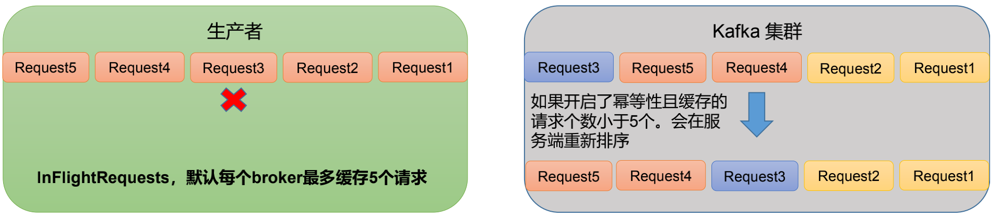

### 四、**Kafka Broker**

#### **4.1 Kafka Broker** **工作流程**

##### **4.1.1 Zookeeper** **存储的** **Kafka** **信息**

1. 启动Zookeeper客户端

```basic
yooome@192 zookeeper % ./bin/zkCli.sh 
```

2. 通过ls命令可以查看kafka相关信息

```basic
[zk: localhost:2181(CONNECTING) 0] ls /
```

3. Zookeeper中存储的Kafka信息

```basic
[zk: localhost:2181(CONNECTING) 0] ls /
[admin, brokers, cluster, config, consumers, controller, controller_epoch, feature, isr_change_notification, latest_producer_id_block, log_dir_event_notification, zookeeper]
```

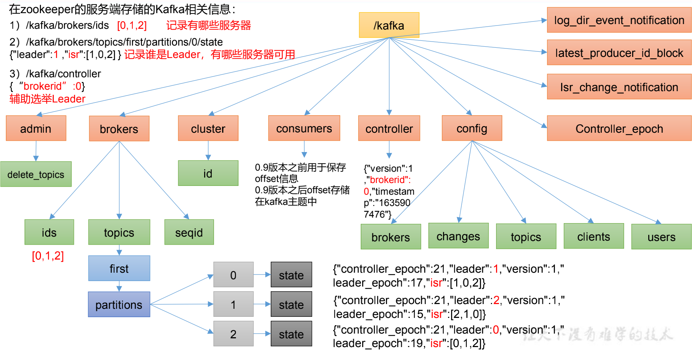

##### 4.1.2 Kafka Broker总体工作流程

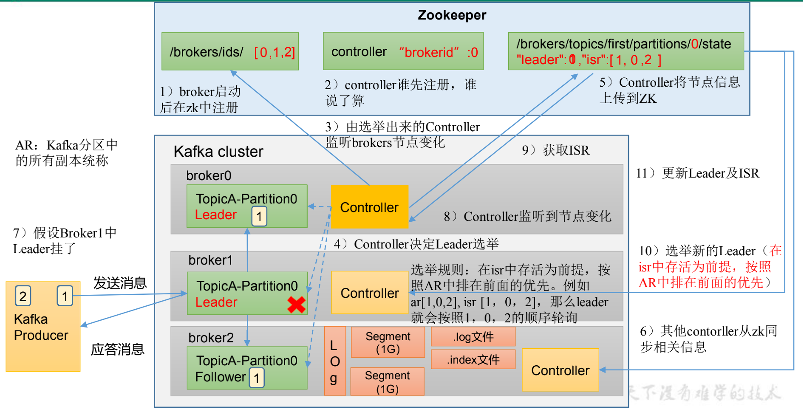


1、模拟Kafka上下线，Zookeeper中数据变化

- ① 查看/kafka/brokers/ids 路径上的节点。

```basci
[zk: localhost:2181(CONNECTED) 2] ls /kafka/brokers/ids
[0, 1, 2]
```

- ② 查看/kafka/controller 路径上的数据。

```bash
[zk: localhost:2181(CONNECTED) 15] get /kafka/controller
{"version":1,"brokerid":0,"timestamp":"1637292471777"}
```

- ③ 查看/kafka/brokers/topics/first/partitions/0/state 路径上的数据。

```bash
[zk: localhost:2181(CONNECTED) 16] get /kafka/brokers/topics/first/partitions/0/state
{"controller_epoch":24,"leader":0,"version":1,"leader_epoch":18,"isr":[0,1,2]}
```

- ④ 停止 hadoop104 上的 kafka。

```bash
[atguigu@hadoop104 kafka]$ bin/kafka-server-stop.sh
```

- ⑤ 再次查看/kafka/brokers/ids 路径上的节点。

```bash
[zk: localhost:2181(CONNECTED) 3] ls /kafka/brokers/ids
[0, 1]
```

- ⑥ 再次查看/kafka/controller 路径上的数据。

```bash
[zk: localhost:2181(CONNECTED) 15] get /kafka/controller
{"version":1,"brokerid":0,"timestamp":"1637292471777"}
```

- ⑦ 再次查看/kafka/brokers/topics/first/partitions/0/state 路径上的数据。

```bash
[zk: localhost:2181(CONNECTED) 16] get 
/kafka/brokers/topics/first/partitions/0/state
{"controller_epoch":24,"leader":0,"version":1,"leader_epoch":18,"isr":[0,1]}
```

- ⑧ 启动 hadoop104 上的 kafka。

```bash
[atguigu@hadoop104 kafka]$ bin/kafka-server-start.sh -
daemon ./config/server.properties
```

- ⑨ 再次观察（1）、（2）、（3）步骤中的内容。

##### 4.1.3 Broker重要参数

| 参数名称                                | 描述                                                         |
| --------------------------------------- | ------------------------------------------------------------ |
| replica.lag.time.max.ms                 | ISR 中，如果 Follower 长时间未向 Leader 发送通<br/>信请求或同步数据，则该 Follower 将被踢出 ISR。<br/>该时间阈值，默认 30s。 |
| auto.leader.rebalance.enable            | 默认是 true。 自动 Leader Partition 平衡。                   |
| leader.imbalance.per.broker.percentage  | 默认是 10%。每个 broker 允许的不平衡的 leader<br/>的比率。如果每个 broker 超过了这个值，控制器<br/>会触发 leader 的平衡。 |
| leader.imbalance.check.interval.seconds | 默认值 300 秒。检查 leader 负载是否平衡的间隔时间。          |
| log.segment.bytes                       | 间。Kafka 中 log 日志是分成一块块存储的，此配置是指 log 日志划分 成块的大小，默认值 1G。 |
| log.index.interval.bytes                | 默认 4kb，kafka 里面每当写入了 4kb 大小的日志<br/>（.log），然后就往 index 文件里面记录一个索引。 |
| log.retention.hours                     | Kafka 中数据保存的时间，默认 7 天。                          |
| log.retention.minutes                   | Kafka 中数据保存的时间，分钟级别，默认关闭。                 |
| log.retention.ms                        | Kafka 中数据保存的时间，毫秒级别，默认关闭。                 |
| log.retention.check.interval.ms         | 检查数据是否保存超时的间隔，默认是 5 分钟。                  |
| log.retention.bytes                     | 默认等于-1，表示无穷大。超过设置的所有日志总<br/>大小，删除最早的 segment。 |
| log.cleanup.policy                      | 默认是 delete，表示所有数据启用删除策略；<br/>如果设置值为 compact，表示所有数据启用压缩策<br/>略。 |
| num.io.threads                          | 默认是 8。负责写磁盘的线程数。整个参数值要占<br/>总核数的 50%。 |
| num.replica.fetchers                    | 副本拉取线程数，这个参数占总核数的 50%的 1/3                 |
| num.network.threads                     | 默认是 3。数据传输线程数，这个参数占总核数的<br/>50%的 2/3 。 |
| log.flush.interval.messages             | 强制页缓存刷写到磁盘的条数，默认是 long 的最<br/>大值，9223372036854775807。一般不建议修改，<br/>交给系统自己管理。 |
| log.flush.interval.ms                   | 每隔多久，刷数据到磁盘，默认是 null。一般不建<br/>议修改，交给系统自己管理。 |

#### 4.2 生产经验-----节点服役和退役

##### 4.2.1 服役新节点

**1、新节点准备**

- ① 关闭hadoop104，并右键执行克隆操作。
- ② 开启hadoop105，并修改IP地址。

```shell
[root@hadoop104 ~]# vim /etc/sysconfig/network-scripts/ifcfg-ens33
DEVICE=ens33
TYPE=Ethernet
ONBOOT=yes
BOOTPROTO=static
NAME="ens33"
IPADDR=192.168.10.105
PREFIX=24
GATEWAY=192.168.10.2
DNS1=192.168.10.2
```

- ③ 在hadoop105 上修改主机名称为hadoop105。

```shell
[root@hadoop104 ~]# vim /etc/hostname
hadoop105
```

- ④ 重新启动hadoop104、hadoop105

- ⑤ 修改 haodoop105 中 kafka 的 broker.id 为 3。 
- ⑥ 删除 hadoop105 中 kafka 下的 datas 和 logs。

```shell
[atguigu@hadoop105 kafka]$ rm -rf datas/* logs/*
```

- ⑦ 启动 hadoop102、hadoop103、hadoop104 上的 kafka 集群。

```shell
[atguigu@hadoop102 ~]$ zk.sh start
[atguigu@hadoop102 ~]$ kf.sh start
```

- ⑧ 单独启动 hadoop105 中的 kafka。

```shell
[atguigu@hadoop105 kafka]$ bin/kafka-server-start.sh -
daemon ./config/server.properties
```

**2、执行负载均衡操作**

- ① 创建一个要均衡的主题

```shell
[atguigu@hadoop102 kafka]$ vim topics-to-move.json
{
  "topics": [
  {"topic": "first"}
  ],
  "version": 1
}
```

- ② 生成一个负载均衡的计划

```shell
[atguigu@hadoop102 kafka]$ bin/kafka-reassign-partitions.sh --
bootstrap-server hadoop102:9092 --topics-to-move-json-file 
topics-to-move.json --broker-list "0,1,2,3" --generate
Current partition replica assignment
{"version":1,"partitions":[{"topic":"first","partition":0,"replic
as":[0,2,1],"log_dirs":["any","any","any"]},{"topic":"first","par
tition":1,"replicas":[2,1,0],"log_dirs":["any","any","any"]},{"to
pic":"first","partition":2,"replicas":[1,0,2],"log_dirs":["any","
any","any"]}]}
Proposed partition reassignment configuration
{"version":1,"partitions":[{"topic":"first","partition":0,"replic
as":[2,3,0],"log_dirs":["any","any","any"]},{"topic":"first","par
tition":1,"replicas":[3,0,1],"log_dirs":["any","any","any"]},{"to
pic":"first","partition":2,"replicas":[0,1,2],"log_dirs":["any","
any","any"]}]}
```

- ③ 创建副本存储计划（所有副本存储在 broker0、broker1、broker2、broker3中)。

```shell
[atguigu@hadoop102 kafka]$ vim increase-replication-factor.json
```

输入如下内容：

```json
{"version":1,"partitions":[{"topic":"first","partition":0,"replic
as":[2,3,0],"log_dirs":["any","any","any"]},{"topic":"first","par
tition":1,"replicas":[3,0,1],"log_dirs":["any","any","any"]},{"to
pic":"first","partition":2,"replicas":[0,1,2],"log_dirs":["any","
any","any"]}]}
```

- ④ 执行副本存储计划

```shell
[atguigu@hadoop102 kafka]$ bin/kafka-reassign-partitions.sh --
bootstrap-server hadoop102:9092 --reassignment-json-file 
increase-replication-factor.json --execute
```

- ⑤ 验证副本存储计划。

```shell
[atguigu@hadoop102 kafka]$ bin/kafka-reassign-partitions.sh --
bootstrap-server hadoop102:9092 --reassignment-json-file 
increase-replication-factor.json --verify
Status of partition reassignment:
Reassignment of partition first-0 is complete.
Reassignment of partition first-1 is complete.
Reassignment of partition first-2 is complete.
Clearing broker-level throttles on brokers 0,1,2,3
Clearing topic-level throttles on topic first
```

##### 4.2.2 退役旧节点

**1、执行负载均衡操作**

先按照退役一台节点，生成执行计划，然后按照服役时操作流程执行负载均衡。

- ① 创建一个要均衡的主题。

```json
[atguigu@hadoop102 kafka]$ vim topics-to-move.json
{
  "topics": [
  {"topic": "first"}
  ],
  "version": 1
}
```

- ② 创建执行计划。

```json
bootstrap-server hadoop102:9092 --topics-to-move-json-file 
topics-to-move.json --broker-list "0,1,2" --generate
Current partition replica assignment
{"version":1,"partitions":[{"topic":"first","partition":0,"replic
as":[2,0,1],"log_dirs":["any","any","any"]},{"topic":"first","par
tition":1,"replicas":[3,1,2],"log_dirs":["any","any","any"]},{"to
pic":"first","partition":2,"replicas":[0,2,3],"log_dirs":["any","
any","any"]}]}
Proposed partition reassignment configuration
{"version":1,"partitions":[{"topic":"first","partition":0,"replicas":[2,0,1],"log_dirs":["any","any","any"]},{"topic":"first","par
tition":1,"replicas":[0,1,2],"log_dirs":["any","any","any"]},{"to
pic":"first","partition":2,"replicas":[1,2,0],"log_dirs":["any","
any","any"]}]}
```

- ③ 创建副本存储计划（所有副本存储在 broker0、broker1、broker2 中）。

```json
[atguigu@hadoop102 kafka]$ vim increase-replication-factor.json
{"version":1,"partitions":[{"topic":"first","partition":0,"replic
as":[2,0,1],"log_dirs":["any","any","any"]},{"topic":"first","par
tition":1,"replicas":[0,1,2],"log_dirs":["any","any","any"]},{"to
pic":"first","partition":2,"replicas":[1,2,0],"log_dirs":["any","
any","any"]}]}
```

- ④ 执行副本存储计划。

```json
[atguigu@hadoop102 kafka]$ bin/kafka-reassign-partitions.sh --
bootstrap-server hadoop102:9092 --reassignment-json-file 
increase-replication-factor.json --execute
```

- ⑤ 验证副本存储计划。

```shell
[atguigu@hadoop102 kafka]$ bin/kafka-reassign-partitions.sh --
bootstrap-server hadoop102:9092 --reassignment-json-file 
increase-replication-factor.json --verify
Status of partition reassignment:
Reassignment of partition first-0 is complete.
Reassignment of partition first-1 is complete.
Reassignment of partition first-2 is complete.
Clearing broker-level throttles on brokers 0,1,2,3
Clearing topic-level throttles on topic first
```

**2、执行停止命令**

在hadoop105 上执行停止命令即可

```shell
[atguigu@hadoop105 kafka]$ bin/kafka-server-stop.sh
```

#### 4.3 Kafka副本

##### 4.3.1 副本基本信息

1. Kafka副本作用：提高数据可靠性。
2. Kafka默认副本1个，生产环境一般配置为2个，保证数据可靠性；太多副本会增加磁盘存储空间，增加网络上数据传输，降低效率。
3. Kafka中副本为：Leader和Follower。Kafka生产者只会把数据发往 Leader，然后Follower 找 Leader 进行同步数据。
4. Kafka 分区中的所有副本统称为 AR（Assigned Repllicas）。

AR = ISR + OSR

**ISR**：表示 Leader 保持同步的 Follower 集合。如果 Follower 长时间未 向 Leader 发送通信请求或同步数据，则该 Follower 将被踢出 ISR。该时间阈值由 **replica.lag.time.max.ms** 参数设定，默认 30s 。Leader 发生故障之后，就会从 ISR 中选举新的 Leader。

**OSR**：表示 Follower 与 Leader 副本同步时，延迟过多的副本。

##### 4.3.2 Leader 选举流程

​	Kafka 集群中有一个 broker 的 Controller 会被选举为 Controller Leader ，负责管理集群 broker 的上下线，所有 topic 的分区副本分配 和 Leader 选举等工作。

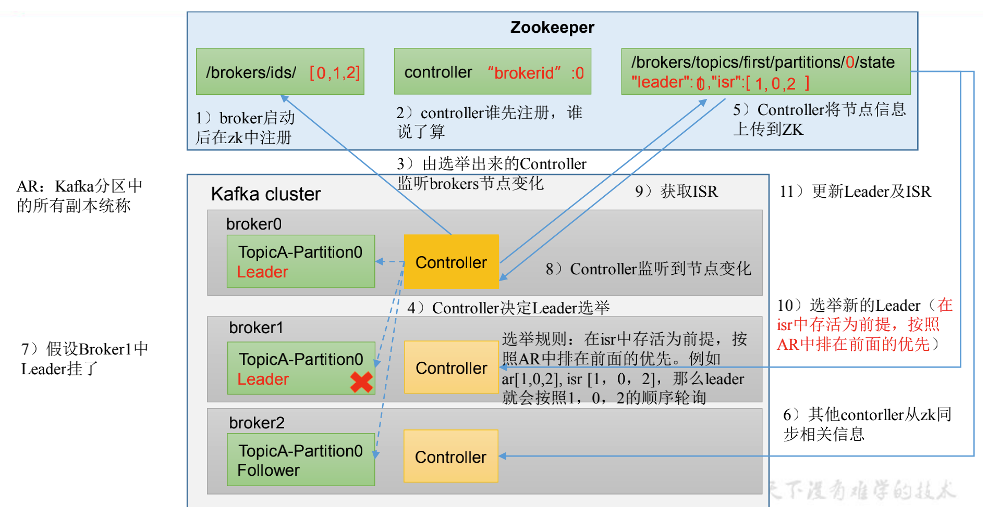

1. 创建一个新的 topic，4 个分区，4 个副本

```bash
[atguigu@hadoop102 kafka]$ bin/kafka-topics.sh --bootstrap-server hadoop102:9092 --create --topic atguigu1 --partitions 4 --replication-factor 
4
Created topic atguigu1.
```

2. 查看 Leader 分布情况

```bash
[atguigu@hadoop102 kafka]$ bin/kafka-topics.sh --bootstrap-server hadoop102:9092 --describe 
--topic atguigu1
Topic: atguigu1 TopicId: awpgX_7WR-OX3Vl6HE8sVg PartitionCount: 4 ReplicationFactor: 4
Configs: segment.bytes=1073741824
Topic: atguigu1 Partition: 0 Leader: 3 Replicas: 3,0,2,1 Isr: 3,0,2,1
Topic: atguigu1 Partition: 1 Leader: 1 Replicas: 1,2,3,0 Isr: 1,2,3,0
Topic: atguigu1 Partition: 2 Leader: 0 Replicas: 0,3,1,2 Isr: 0,3,1,2
Topic: atguigu1 Partition: 3 Leader: 2 Replicas: 2,1,0,3 Isr: 2,1,0,3
```

3. 停止掉 hadoop105 的 kafka 进程，并查看 Leader 分区情况

```bash
[atguigu@hadoop105 kafka]$ bin/kafka-server-stop.sh
[atguigu@hadoop102 kafka]$ bin/kafka-topics.sh --bootstrap-server hadoop102:9092 --describe 
--topic atguigu1
Topic: atguigu1 TopicId: awpgX_7WR-OX3Vl6HE8sVg PartitionCount: 4 ReplicationFactor: 4
Configs: segment.bytes=1073741824
Topic: atguigu1 Partition: 0 Leader: 0 Replicas: 3,0,2,1 Isr: 0,2,1
Topic: atguigu1 Partition: 1 Leader: 1 Replicas: 1,2,3,0 Isr: 1,2,0
Topic: atguigu1 Partition: 2 Leader: 0 Replicas: 0,3,1,2 Isr: 0,1,2
Topic: atguigu1 Partition: 3 Leader: 2 Replicas: 2,1,0,3 Isr: 2,1,0
```

4. 停止掉 hadoop104 的 kafka 进程，并查看 Leader 分区情况

```bash
[atguigu@hadoop104 kafka]$ bin/kafka-server-stop.sh
[atguigu@hadoop102 kafka]$ bin/kafka-topics.sh --bootstrap-server hadoop102:9092 --describe 
--topic atguigu1
Topic: atguigu1 TopicId: awpgX_7WR-OX3Vl6HE8sVg PartitionCount: 4 ReplicationFactor: 4
Configs: segment.bytes=1073741824
Topic: atguigu1 Partition: 0 Leader: 0 Replicas: 3,0,2,1 Isr: 0,1
Topic: atguigu1 Partition: 1 Leader: 1 Replicas: 1,2,3,0 Isr: 1,0
Topic: atguigu1 Partition: 2 Leader: 0 Replicas: 0,3,1,2 Isr: 0,1
Topic: atguigu1 Partition: 3 Leader: 1 Replicas: 2,1,0,3 Isr: 1,0
```

5. 启动 hadoop105 的 kafka 进程，并查看 Leader 分区情况

```bash
[atguigu@hadoop105 kafka]$ bin/kafka-server-start.sh -daemon config/server.properties
[atguigu@hadoop102 kafka]$ bin/kafka-topics.sh --bootstrap-server hadoop102:9092 --describe 
--topic atguigu1
Topic: atguigu1 TopicId: awpgX_7WR-OX3Vl6HE8sVg PartitionCount: 4 ReplicationFactor: 4
Configs: segment.bytes=1073741824
Topic: atguigu1 Partition: 0 Leader: 0 Replicas: 3,0,2,1 Isr: 0,1,3
Topic: atguigu1 Partition: 1 Leader: 1 Replicas: 1,2,3,0 Isr: 1,0,3
Topic: atguigu1 Partition: 2 Leader: 0 Replicas: 0,3,1,2 Isr: 0,1,3
Topic: atguigu1 Partition: 3 Leader: 1 Replicas: 2,1,0,3 Isr: 1,0,3
```

6. 启动 hadoop104 的 kafka 进程，并查看 Leader 分区情况

```bash
[atguigu@hadoop104 kafka]$ bin/kafka-server-start.sh -daemon config/server.properties
[atguigu@hadoop102 kafka]$ bin/kafka-topics.sh --bootstrap-server hadoop102:9092 --describe 
--topic atguigu1
Topic: atguigu1 TopicId: awpgX_7WR-OX3Vl6HE8sVg PartitionCount: 4 ReplicationFactor: 4
Configs: segment.bytes=1073741824
Topic: atguigu1 Partition: 0 Leader: 0 Replicas: 3,0,2,1 Isr: 0,1,3,2
Topic: atguigu1 Partition: 1 Leader: 1 Replicas: 1,2,3,0 Isr: 1,0,3,2
Topic: atguigu1 Partition: 2 Leader: 0 Replicas: 0,3,1,2 Isr: 0,1,3,2
Topic: atguigu1 Partition: 3 Leader: 1 Replicas: 2,1,0,3 Isr: 1,0,3,2
```

7. 停止掉 hadoop103 的 kafka 进程，并查看 Leader 分区情况

```bash
[atguigu@hadoop103 kafka]$ bin/kafka-server-stop.sh
[atguigu@hadoop102 kafka]$ bin/kafka-topics.sh --bootstrap-server hadoop102:9092 --describe 
--topic atguigu1
Topic: atguigu1 TopicId: awpgX_7WR-OX3Vl6HE8sVg PartitionCount: 4 ReplicationFactor: 4
Configs: segment.bytes=1073741824
Topic: atguigu1 Partition: 0 Leader: 0 Replicas: 3,0,2,1 Isr: 0,3,2
Topic: atguigu1 Partition: 1 Leader: 2 Replicas: 1,2,3,0 Isr: 0,3,2
Topic: atguigu1 Partition: 2 Leader: 0 Replicas: 0,3,1,2 Isr: 0,3,2
Topic: atguigu1 Partition: 3 Leader: 2 Replicas: 2,1,0,3 Isr: 0,3,2
```

##### 4.3.3 Leader  和 Follower 故障处理细节

**LEO（Log End Offset）**: 每个副本的最后一个offset，LEO其实就是最新的 offset + 1。

**HW（High Watermark）**：所有副本中最小的LEO。

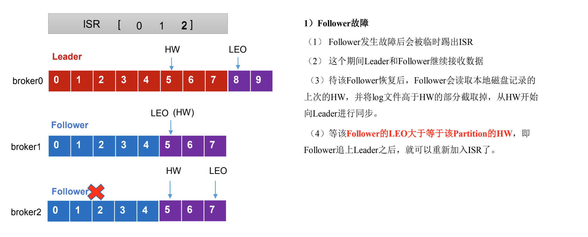

**LEO**（**Log End Offset**）：每个副本的最后一个offset，LEO其实就是最新的offset + 1

**HW**（**High Watermark**）：所有副本中最小的LEO

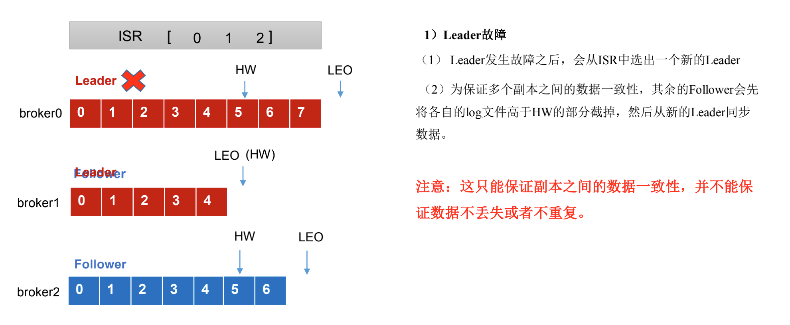

##### 4.3.4 分区副本分配

如果kafka服务器只有 4 个节点，那么设置kafka的分区数大于服务器台数，在kafka底层如何分配存储副本呢？

1、创建16分区，3个副本。

- ① 创建一个新的topic ，名称为 sedond 。

```bash
[atguigu@hadoop102 kafka]$ bin/kafka-topics.sh --bootstrap-server 
hadoop102:9092 --create --partitions 16 --replication-factor 3 --
topic second
```

- ② 查看分区和副本情况。

```bash
[atguigu@hadoop102 kafka]$ bin/kafka-topics.sh --bootstrap-server 
hadoop102:9092 --describe --topic second
Topic: second4 Partition: 0 Leader: 0 Replicas: 0,1,2 Isr: 0,1,2
Topic: second4 Partition: 1 Leader: 1 Replicas: 1,2,3 Isr: 1,2,3
Topic: second4 Partition: 2 Leader: 2 Replicas: 2,3,0 Isr: 2,3,0
Topic: second4 Partition: 3 Leader: 3 Replicas: 3,0,1 Isr: 3,0,1
Topic: second4 Partition: 4 Leader: 0 Replicas: 0,2,3 Isr: 0,2,3
Topic: second4 Partition: 5 Leader: 1 Replicas: 1,3,0 Isr: 1,3,0
Topic: second4 Partition: 6 Leader: 2 Replicas: 2,0,1 Isr: 2,0,1
Topic: second4 Partition: 7 Leader: 3 Replicas: 3,1,2 Isr: 3,1,2
Topic: second4 Partition: 8 Leader: 0 Replicas: 0,3,1 Isr: 0,3,1
Topic: second4 Partition: 9 Leader: 1 Replicas: 1,0,2 Isr: 1,0,2
Topic: second4 Partition: 10 Leader: 2 Replicas: 2,1,3 Isr: 2,1,3
Topic: second4 Partition: 11 Leader: 3 Replicas: 3,2,0 Isr: 3,2,0
Topic: second4 Partition: 12 Leader: 0 Replicas: 0,1,2 Isr: 0,1,2
Topic: second4 Partition: 13 Leader: 1 Replicas: 1,2,3 Isr: 1,2,3
Topic: second4 Partition: 14 Leader: 2 Replicas: 2,3,0 Isr: 2,3,0
Topic: second4 Partition: 15 Leader: 3 Replicas: 3,0,1 Isr: 3,0,1
```

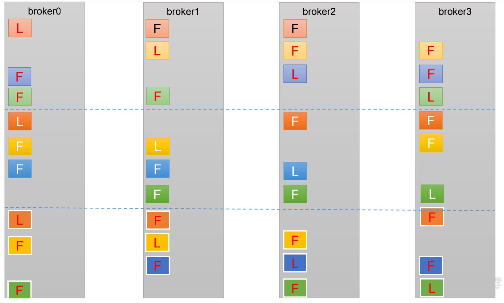

##### 4.3.5 生产经验 --- 活动调整分区副本存储

在生产环境中，每台服务器的配置和性能不一致，但是kafka只会根据自己的代码规则创建对应的分区副本，就会导致个别服务器存储压力较大。所有需要手动调整分区副本的存储。

**需求**：创建一个新的 topic ，4个分区，两个副本，名称为three 。将该 topic 的所有副本都存储到 broker0 和 broker1 两台服务器上。 

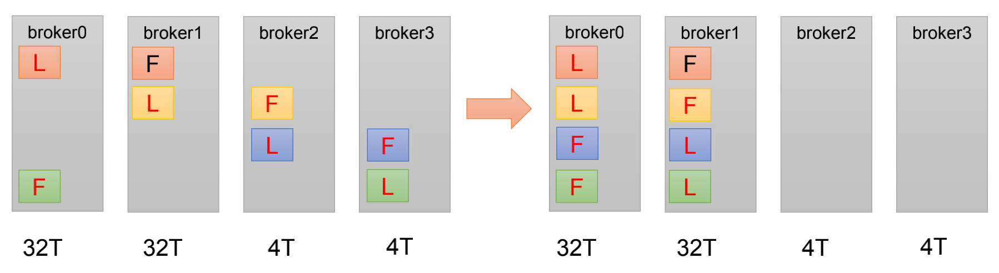

手动调整分区副本存储的步骤如下：

1. 创建一个新的 topic，名称为 three。

```bash
[atguigu@hadoop102 kafka]$ bin/kafka-topics.sh --bootstrap-server 
hadoop102:9092 --create --partitions 4 --replication-factor 2 --
topic three
```

2. 查看分区副本存储情况

```
[atguigu@hadoop102 kafka]$ bin/kafka-topics.sh --bootstrap-server 
hadoop102:9092 --describe --topic three
```

3. 创建副本存储计划（所有副本都指定存储在 broker0、broker1 中）。

```bash
[atguigu@hadoop102 kafka]$ vim increase-replication-factor.json
```

输入如下内容：

```json
{
  "version":1,
  "partitions":[{"topic":"three","partition":0,"replicas":[0,1]},
  {"topic":"three","partition":1,"replicas":[0,1]},
  {"topic":"three","partition":2,"replicas":[1,0]},
  {"topic":"three","partition":3,"replicas":[1,0]}] 
}
```

4. 执行副本存储计划。

```bash
[atguigu@hadoop102 kafka]$ bin/kafka-reassign-partitions.sh --
bootstrap-server hadoop102:9092 --reassignment-json-file 
increase-replication-factor.json --execute
```

5. 验证副本存储计划。

```bash
[atguigu@hadoop102 kafka]$ bin/kafka-reassign-partitions.sh --
bootstrap-server hadoop102:9092 --reassignment-json-file 
increase-replication-factor.json --verify
```

6. 查看分区副本存储情况。

```bash
[atguigu@hadoop102 kafka]$ bin/kafka-topics.sh --bootstrap-server 
hadoop102:9092 --describe --topic three
```

##### 4.3.6 生产经验 --- Leader Partition 负载平衡

​	正常情况下，Kafka本身会自动把Leader Partition均匀分散在各个机器上，来保证每台机器的读写吞吐量都是均匀的。但是如果某 些broker宕机，会导致Leader Partition过于集中在其他少部分几台broker上，这会导致少数几台broker的读写请求压力过高，其他宕机的broker重启之后都是follower partition，读写请求很低，造成集群负载不均衡。 

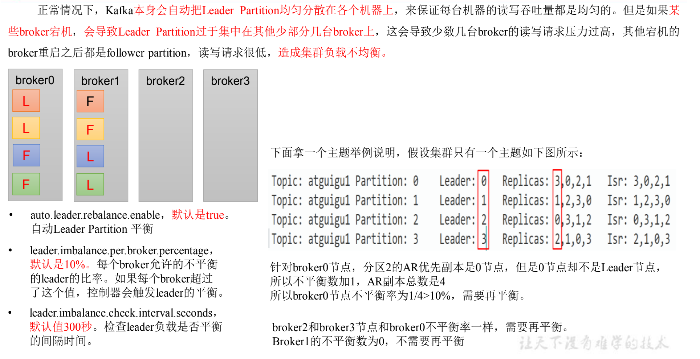

| 参数名称                                | 描述                                                         |
| --------------------------------------- | ------------------------------------------------------------ |
| auto.leader.rebalance.enable            | 默认是 true。 自动 Leader Partition 平衡。生产环<br/>境中，leader 重选举的代价比较大，可能会带来<br/>性能影响，建议设置为 false 关闭。 |
| leader.imbalance.per.broker.percentage  | 默认是 10%。每个 broker 允许的不平衡的 leader<br/>的比率。如果每个 broker 超过了这个值，控制器<br/>会触发 leader 的平衡。 |
| leader.imbalance.check.interval.seconds | 默认值 300 秒。检查 leader 负载是否平衡的间隔<br/>时间。     |

##### 4.3.7 生产经验 --- 增加副本因子

在生产环境当中，由于某个主题的重要等级需要提升，我们考虑增加副本。副本数的

增加需要先制定计划，然后根据计划执行。

1. 创建 topic

```bash
[atguigu@hadoop102 kafka]$ bin/kafka-topics.sh --bootstrap-server 
hadoop102:9092 --create --partitions 3 --replication-factor 1 --
topic four
```

2. 手动增加副本存储

- ① 创建副本存储计划（所有副本都指定存储在 broker0、broker1、broker2 中）。

```bash
[atguigu@hadoop102 kafka]$ vim increase-replication-factor.json
```

输入如下内容：

```json
{"version":1,"partitions":[{"topic":"four","partition":0,"replica
s":[0,1,2]},{"topic":"four","partition":1,"replicas":[0,1,2]},{"t
opic":"four","partition":2,"replicas":[0,1,2]}]}
```

- ② 执行副本存储计划。

```bash
[atguigu@hadoop102 kafka]$ bin/kafka-reassign-partitions.sh --
bootstrap-server hadoop102:9092 --reassignment-json-file 
increase-replication-factor.json --execute
```

#### 4.4 文件存储

##### 4.4.1 文件存储机制

1. **Topic 数据的存储机制**

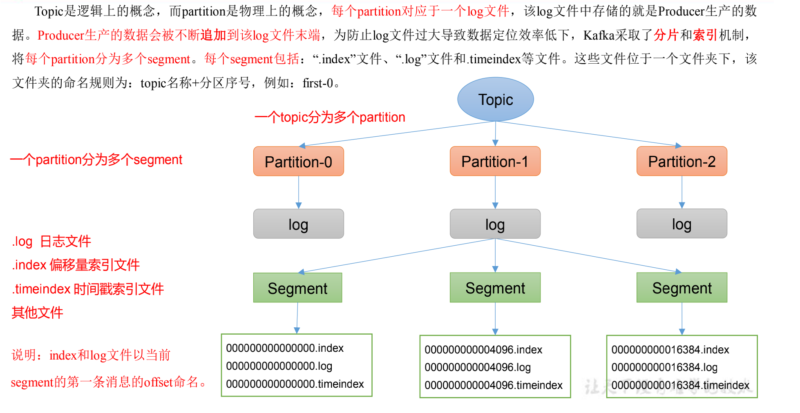

2. **思考：Topic数据到底存储在什么位置？**

- ① 启动生产者，并发送消息。

```bash
[atguigu@hadoop102 kafka]$ bin/kafka-console-producer.sh --
bootstrap-server hadoop102:9092 --topic first
>hello world
```

- ② 查看 hadoop102（或者 hadoop103、hadoop104）的/opt/module/kafka/datas/first-1 （first-0、first-2）路径上的文件

```bash
[atguigu@hadoop104 first-1]$ ls
00000000000000000092.index
00000000000000000092.log
00000000000000000092.snapshot
00000000000000000092.timeindex
leader-epoch-checkpoint
partition.metadata
```

- ③ 直接查看 log 日志，发现是乱码。

```bash
[atguigu@hadoop104 first-1]$ cat 00000000000000000092.log 
\CYnF|©|©ÿÿÿÿÿÿÿÿÿÿÿÿÿÿ"hello world
```

- ④ 通过工具查看 index 和 log 信息。

```bash
[atguigu@hadoop104 first-1]$ kafka-run-class.sh kafka.tools.DumpLogSegments 
--files ./00000000000000000000.index 
Dumping ./00000000000000000000.index
offset: 3 position: 152
```

```bash
[atguigu@hadoop104 first-1]$ kafka-run-class.sh kafka.tools.DumpLogSegments 
--files ./00000000000000000000.log
Dumping datas/first-0/00000000000000000000.log
Starting offset: 0
baseOffset: 0 lastOffset: 1 count: 2 baseSequence: -1 lastSequence: -1 producerId: -1 
producerEpoch: -1 partitionLeaderEpoch: 0 isTransactional: false isControl: false position: 
0 CreateTime: 1636338440962 size: 75 magic: 2 compresscodec: none crc: 2745337109 isvalid: 
true
baseOffset: 2 lastOffset: 2 count: 1 baseSequence: -1 lastSequence: -1 producerId: -1 
producerEpoch: -1 partitionLeaderEpoch: 0 isTransactional: false isControl: false position: 
75 CreateTime: 1636351749089 size: 77 magic: 2 compresscodec: none crc: 273943004 isvalid: 
true
baseOffset: 3 lastOffset: 3 count: 1 baseSequence: -1 lastSequence: -1 producerId: -1 
producerEpoch: -1 partitionLeaderEpoch: 0 isTransactional: false isControl: false position: 
152 CreateTime: 1636351749119 size: 77 magic: 2 compresscodec: none crc: 106207379 isvalid: 
true
baseOffset: 4 lastOffset: 8 count: 5 baseSequence: -1 lastSequence: -1 producerId: -1 
producerEpoch: -1 partitionLeaderEpoch: 0 isTransactional: false isControl: false position: 
229 CreateTime: 1636353061435 size: 141 magic: 2 compresscodec: none crc: 157376877 isvalid: 
true
baseOffset: 9 lastOffset: 13 count: 5 baseSequence: -1 lastSequence: -1 producerId: -1 
producerEpoch: -1 partitionLeaderEpoch: 0 isTransactional: false isControl: false position: 
370 CreateTime: 1636353204051 size: 146 magic: 2 compresscodec: none crc: 4058582827 isvalid: 
true
```

3. **index文件和log文件详解**

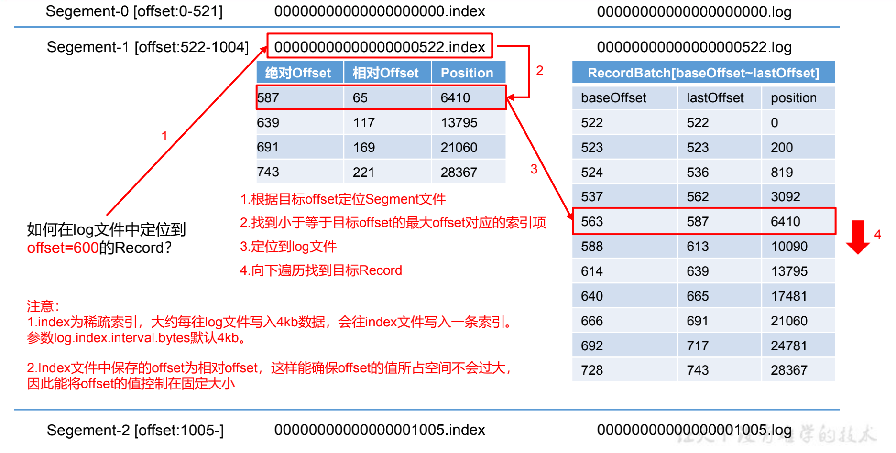

说明：日志存储参数配置

| 参数                     | 描述                                                         |
| ------------------------ | ------------------------------------------------------------ |
| log.segment.bytes        | Kafka 中 log 日志是分成一块块存储的，此配置是指 log 日志划分<br/>成块的大小，默认值 1G。 |
| log.index.interval.bytes | 默认 4kb，kafka 里面每当写入了 4kb 大小的日志（.log），<br/>然后就往 index 文件里面记录一个索引。 稀疏索引。 |

##### 4.4.2 文件清理策略

Kafka 中默认的日志保存时间为 7 天，可以通过调整如下参数修改保存时间。

- Log.retention.hours，最低优先级小时，默认7天。
- log.retention.minutes，分钟。
- log.retention.ms，最高优先级毫秒。
- log.retention.check.interval.ms，负责设置检查周期，默认 5 分钟。

那么日志一旦超过了设置的时间，怎么处理呢？

Kafka 中提供的日志清理策略有 delete 和 compact 两种。

1. **delete 日志阐述：将过期数据删除**

- log.cleanup.policy = delete 所有数据启用阐述策略

(1) 基于时间：默认打开。以  segment 中所有记录中的最大时间戳作为该文件时间戳。

(2) 基于大小：默认关闭。超过设置的所有日志总大小，阐述最早的 segment 。

log.retention.bytes，默认等于-1，表示无穷大。

**思考：**如果一个 segment 中有一部分数据过期，一部分没有过期，怎么处理？

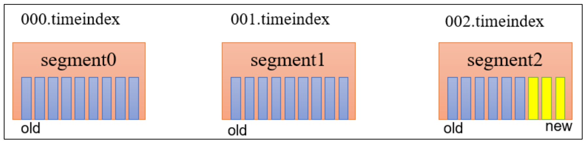

2. **compact 日志压缩**

compact日志压缩：对于相同 key 的不同 value 值，值保留最后一个版本。

- log.cleanup.policy = compact所有数据启动压缩策略

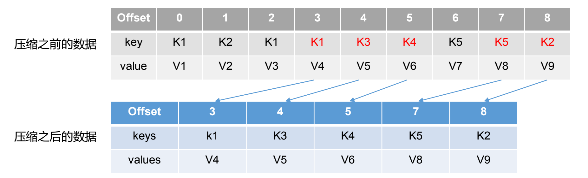

压缩后的offset可能是不连续的，比如上图中没有6，当从这些offset消费消息时，将会拿到比这个 offset 大的 offset 对应的消息，实际上会拿到 offset 为 7 的消息，并从这个位置开始消费。

​	这种策略只适合特殊场景，比如消息的 key 是用户 ID，value 是用户的资料，通过这种压缩策略，整个消息集里就保存了所有用户最新的资料。

#### 4.5 高效读写数据

1. Kafka 本身是分布式集群，可以采用分区技术，并行高度。

2. 读数据采用稀疏索引，可以快速定位要消费的数据

3. 顺序写磁盘

   kafka 的 producer 生产数据，要写入到 log 文件中，写的过程是一直追加到文件末端，为顺序写。官网有数据表明，同样的磁盘，顺序写能到 600M/s，而随机写只有 100 k/s。这与磁盘的机械机构有关，顺序写之所以快，是因为为其省去了大量磁头寻址的时间。

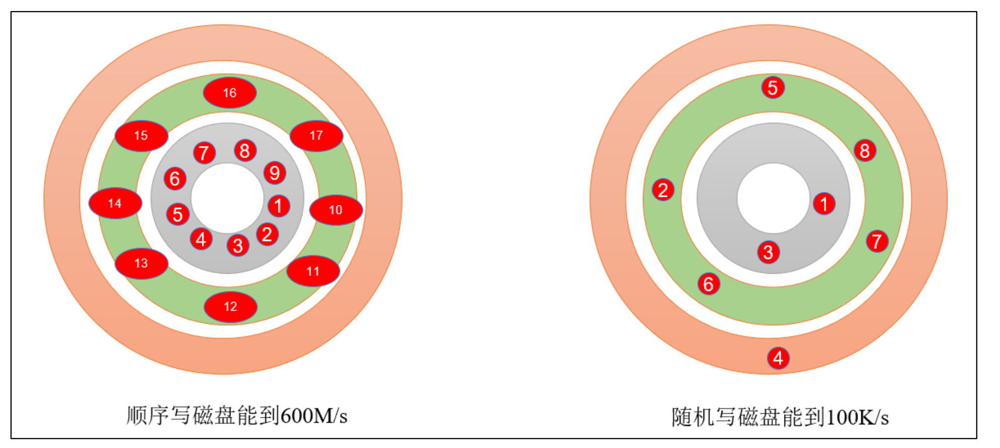

4. **页缓存** **+** **零拷贝技术**

**零拷贝**：Kafka 的数据加工处理操作交由 Kafka 生产者和 Kafka 消费者处理。Kafka Broker 应用层不关系存储的数据，所以就不用走应用层，传输效率高。

**PageCache页缓存**：Kafka 重度依赖底层操作系统提供的 PageCache 功能。当上层有写操作时，操作系统只是将数据写入 PageCache。当读操作发生时，先从PageCache中查找，如果找不到，再去聪攀中读取。实际上 PageCache 是把尽可能多的空闲内存都当做了磁盘缓存来使用。

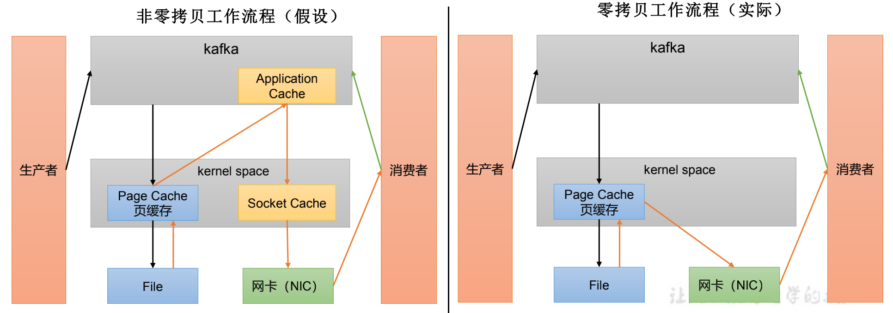


| 参数                        | 描述                                                         |
| --------------------------- | ------------------------------------------------------------ |
| log.flush.interval.messages | 强制页缓存刷写到磁盘的条数，默认是 long 的最大值，<br/>9223372036854775807。一般不建议修改，交给系统自己管<br/>理。 |
| log.flush.interval.ms       | 每隔多久，刷数据到磁盘，默认是 null。一般不建议修改，<br/>交给系统自己管理。 |

### 五、Kafka 消费者

#### 5.1 Kafka 消费方式

- **pull（拉）模式**：consumer 采用从 broker 中主动拉去数据。Kafka 采用这种方式。
- **push（推）模式**：Kafka没有采用这种方式，因为由 broker 决定消息发送速率，很难适应所有消费者的消费速率。例如推送的速度是 50m/s，Consumer1，Consumer2就来不及处理消息。

pull 模式不足之处是，如果Kafka 没有数据，消费者可能会陷入循环中，一直返回空数据。

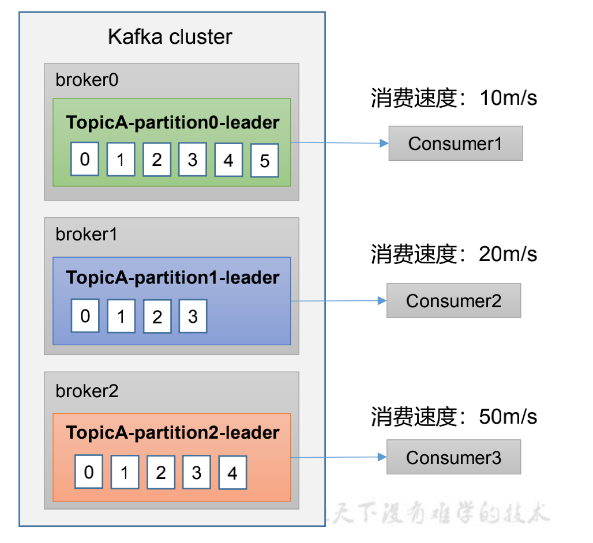

#### 5.2 Kafka 消费者工作流程

##### 5.2.1 消费者总体工作流程

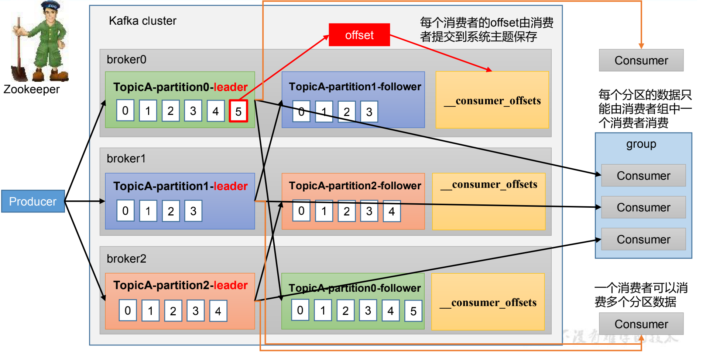

##### 5.2.2 消费者组原理

**Consumer Group （CG）**：消费者组，由多个consumer组成。形成一个消费者组的条件，是所有消费者的  groupid  相同。

- 消费者组内每个消费者负责消费不同分区的数据，一个分区只能由一个组内消费者消费。
- 消费者组之间互不影响。所有的消费者都属于某个消费者组，即消费者组是逻辑上的一个订阅者。

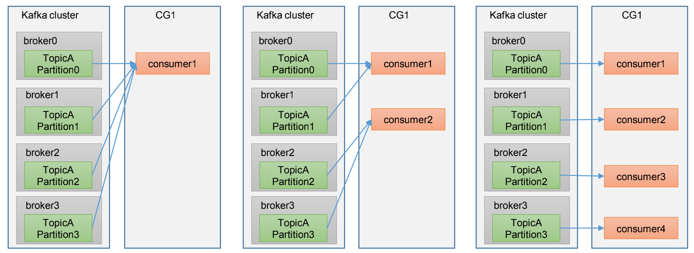


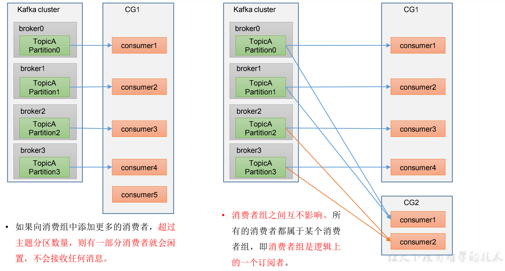

1、**coordinator：辅助实现消费者组的初始化和分区的分配。**

coordinator节点选择 = groupid的hashcode值 % 50（ __consumer_offsets的分区数量）

例如： groupid的hashcode值 = 1，1% 50 = 1，那么__consumer_offsets 主题的1号分区，在哪个broker上，就选择这个节点的coordinator 作为这个消费者组的老大。消费者组下的所有的消费者提交offset的时候就往这个分区去提交offset。

1. 每个consumer都发送JoinGroup请求 

2. 选出一个 consumer 作为 leader。
3. 把要消费的 topic 情况发送给 leader 消费者

4. leader会负责制定消费方案

5. 把消费方案发给coordinator。

6. Coordinator就把消费方案下发给各个consumer。

7. 每个消费者都会和coordinator保持心跳（默认3s），一旦超时（session.timeout.ms=45s），该消费者会被移除，并触发再平衡；

   或者消费者处理消息的时间过长（max.poll.interval.ms5分钟），也会触发再平衡。

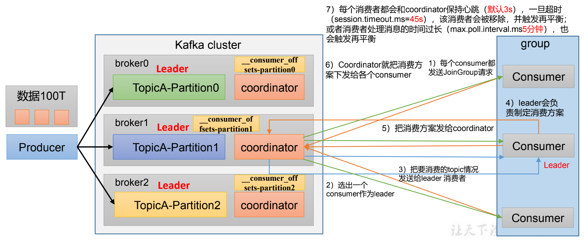

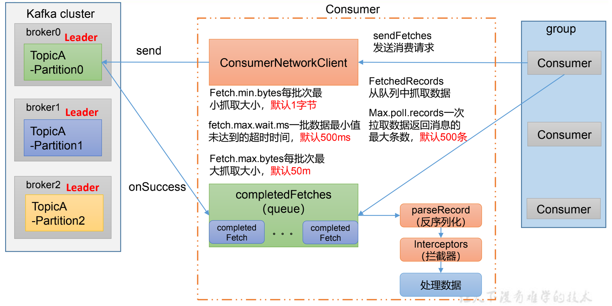

##### 5.2.3 消费者重要参数

| 参数名称                              | 描述                                                         |
| ------------------------------------- | ------------------------------------------------------------ |
| bootstrap.servers                     | 向 Kafka 集群建立初始连接用到的 host/port 列表。             |
| key.deserializer 和value.deserializer | 指定接收消息的 key 和 value 的反序列化类型。一定要写全类名。 |
| group.id                              | 标记消费者所属的消费者组。                                   |
| enable.auto.commit                    | 默认值为 true，消费者会自动周期性地向服务器提交偏移量。      |
| auto.commit.interval.ms               | 如果设置了 enable.auto.commit 的值为 true， 则该值定义了<br/>消费者偏移量向 Kafka 提交的频率，默认 5s。 |
| auto.offset.reset                     | 当 Kafka 中没有初始偏移量或当前偏移量在服务器中不存在<br/>（如，数据被删除了），该如何处理？ earliest：自动重置偏<br/>移量到最早的偏移量。 latest：默认，自动重置偏移量为最<br/>新的偏移量。 none：如果消费组原来的（previous）偏移量<br/>不存在，则向消费者抛异常。 anything：向消费者抛异常。 |
| offsets.topic.num.partitions          | __consumer_offsets 的分区数，默认是 50 个分区。              |
| heartbeat.interval.ms                 | Kafka 消费者和 coordinator 之间的心跳时间，默认 3s。<br/>该条目的值必须小于 session.timeout.ms ，也不应该高于<br/>session.timeout.ms 的 1/3。 |
| session.timeout.ms                    | Kafka 消费者和 coordinator 之间连接超时时间，默认 45s。<br/>超过该值，该消费者被移除，消费者组执行再平衡。 |
| max.poll.interval.ms                  | 消费者处理消息的最大时长，默认是 5 分钟。超过该值，该<br/>消费者被移除，消费者组执行再平衡。 |
| fetch.min.bytes                       | 默认 1 个字节。消费者获取服务器端一批消息最小的字节数。      |
| fetch.max.wait.ms                     | 默认 500ms。如果没有从服务器端获取到一批数据的最小字<br/>节数。该时间到，仍然会返回数据。 |
| fetch.max.bytes                       | 默认 Default: 52428800（50 m）。消费者获取服务器端一批<br/>消息最大的字节数。如果服务器端一批次的数据大于该值<br/>（50m）仍然可以拉取回来这批数据，因此，这不是一个绝<br/>对最大值。一批次的大小受 message.max.bytes （broker <br/>config）or max.message.bytes （topic config）影响。 |
| max.poll.records                      | 一次 poll 拉取数据返回消息的最大条数，默认是 500 条。        |

#### 5.3 消费者 API

##### 5.3.1 独立消费者案例（订阅主题）

- 需求：

  创建一个独立消费者，消费 first 主题中数据。

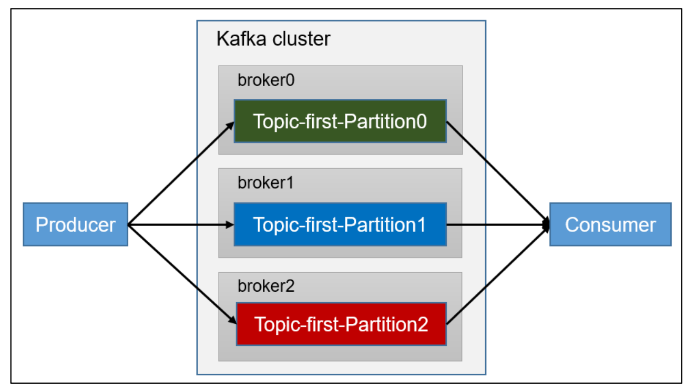

【注意】：消费者 API 代码中必须配置消费者组 id。命令行启动消费者不填写消费者组 id 会被自动填写随机的消费者组 id。

- 实现步骤
  1. 创建包名：com.yooome.kafka.consumer
  2. 编写代码

```java
package com.yooome.kafka.producer;

import org.apache.kafka.clients.consumer.ConsumerConfig;
import org.apache.kafka.clients.consumer.ConsumerRecord;
import org.apache.kafka.clients.consumer.ConsumerRecords;
import org.apache.kafka.clients.consumer.KafkaConsumer;
import org.apache.kafka.clients.producer.KafkaProducer;
import org.apache.kafka.clients.producer.ProducerConfig;
import org.apache.kafka.clients.producer.ProducerRecord;
import org.apache.kafka.common.serialization.StringDeserializer;

import java.time.Duration;
import java.util.ArrayList;
import java.util.Properties;

public class CustomConsumer {
    public static void main(String[] args) {
        // 1. 创建kafka生产者配置对象
        Properties properties = new Properties();
        // 2. 给 kafka 配置对象添加配置信息：bootstrap.servers
        properties.put(ConsumerConfig.BOOTSTRAP_SERVERS_CONFIG, "localhost:9092");
        // key,value 序列化（必须）：key.serializer，value.serializer
        properties.put(ConsumerConfig.KEY_DESERIALIZER_CLASS_CONFIG, StringDeserializer.class.getName());
        properties.put(ConsumerConfig.VALUE_DESERIALIZER_CLASS_CONFIG, StringDeserializer.class.getName());

        properties.put(ConsumerConfig.GROUP_ID_CONFIG, "test");
        // 3. 创建 kafka 生产者对象
        KafkaConsumer<String, String> kafkaConsumer = new KafkaConsumer<String, String>(properties);

        ArrayList<String> topic = new ArrayList<>();
        topic.add("first");
        kafkaConsumer.subscribe(topic);
        // 拉去数据打印
        while (true) {
            ConsumerRecords<String, String> consumerRecords = kafkaConsumer.poll(Duration.ofSeconds(1));
            for (ConsumerRecord<String,String> consumerRecord : consumerRecords) {
                System.out.println("consumerRecord: " + consumerRecord);
            }
        }
    }
}
```

测试：

1. 在IDEA 中执行消费者程序。
2. 在Kafka集群控制台，创建 Kafka 生产者，并输入数据。

```bash
[atguigu@hadoop102 kafka]$ bin/kafka-console-producer.sh --bootstrap-server hadoop102:9092 --topic first
>hello
```

3. IDEA 控制台接受到的信息

```json
consumerRecord: ConsumerRecord(topic = first, partition = 0, leaderEpoch = 0, offset = 79, CreateTime = 1645702655382, serialized key size = -1, serialized value size = 4, headers = RecordHeaders(headers = [], isReadOnly = false), key = null, value = asga)
```

##### 5.3.2 独立消费者案例（订阅分区）

1. **需求**：创建一个独立消费者，消费 first 主题 0 号分区的数据。

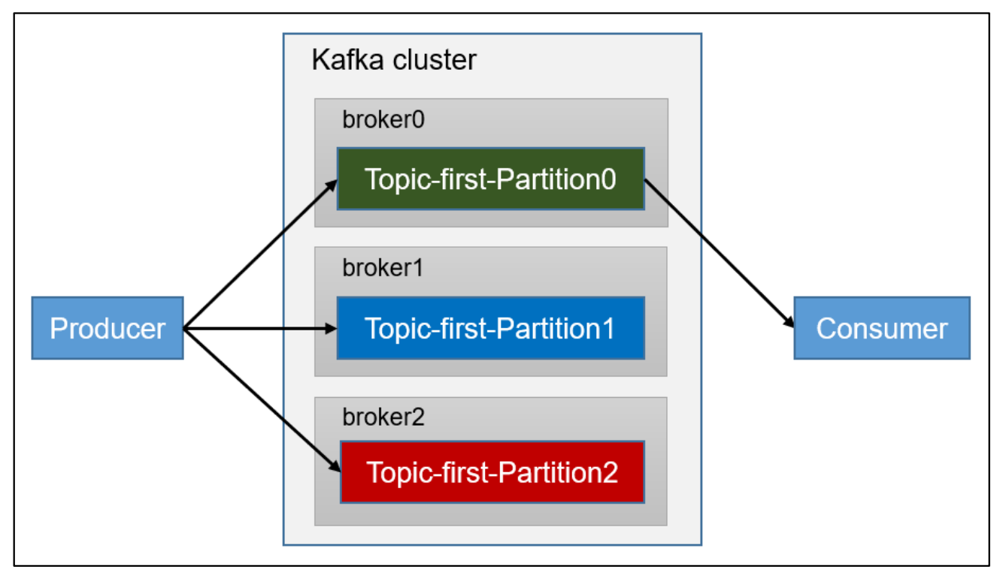

2. 实现步骤

```java
package com.yooome.kafka.producer;

import org.apache.kafka.clients.consumer.ConsumerConfig;
import org.apache.kafka.clients.consumer.ConsumerRecord;
import org.apache.kafka.clients.consumer.ConsumerRecords;
import org.apache.kafka.clients.consumer.KafkaConsumer;
import org.apache.kafka.common.TopicPartition;
import org.apache.kafka.common.serialization.StringDeserializer;

import java.time.Duration;
import java.util.ArrayList;
import java.util.Properties;

public class CustomConsumerPartition {
    public static void main(String[] args) {
        // 1. 创建kafka生产者配置对象
        Properties properties = new Properties();
        // 2. 给 kafka 配置对象添加配置信息：bootstrap.servers
        properties.put(ConsumerConfig.BOOTSTRAP_SERVERS_CONFIG, "localhost:9092");
        // key,value 序列化（必须）：key.serializer，value.serializer
        properties.put(ConsumerConfig.KEY_DESERIALIZER_CLASS_CONFIG, StringDeserializer.class.getName());
        properties.put(ConsumerConfig.VALUE_DESERIALIZER_CLASS_CONFIG, StringDeserializer.class.getName());

        properties.put(ConsumerConfig.GROUP_ID_CONFIG, "test");
        // 3. 创建 kafka 生产者对象
        KafkaConsumer<String, String> kafkaConsumer = new KafkaConsumer<String, String>(properties);

        ArrayList<TopicPartition> topicPartitions = new ArrayList<>();
        topicPartitions.add(new TopicPartition("first", 0));
        kafkaConsumer.assign(topicPartitions);
        // 拉去数据打印
        while (true) {
            ConsumerRecords<String, String> consumerRecords = kafkaConsumer.poll(Duration.ofSeconds(1));
            for (ConsumerRecord<String, String> consumerRecord : consumerRecords) {
                System.out.println("consumerRecord: " + consumerRecord);
            }
        }
    }
}

```

测试：

1. 在IDEA中执行消费者程序。

2. 在IDEA中执行消费者程序 CustomProducerCallback()在控制台观察生成几个 0 号 分区的数据

```json
consumerRecord: ConsumerRecord(topic = first, partition = 0, leaderEpoch = 0, offset = 88, CreateTime = 1645703441423, serialized key size = -1, serialized value size = 7, headers = RecordHeaders(headers = [], isReadOnly = false), key = null, value = yooome3)
```

##### 5.3.3 消费者组案例

1. **需求**：测试同一个主题的分区数据，只能由一个消费者组中的一个消费。

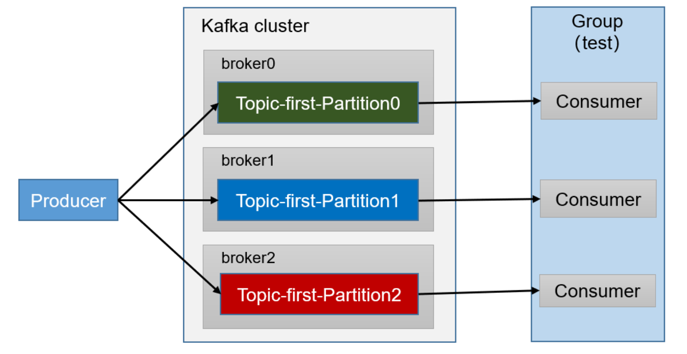

2. 案例实操

   (1) 复制一份基础消费者的代码，在IDEA 中同时启动，即可启动同一个消费者组中的两个消费者。

```java
package com.yooome.kafka.producer;

import org.apache.kafka.clients.consumer.ConsumerConfig;
import org.apache.kafka.clients.consumer.ConsumerRecord;
import org.apache.kafka.clients.consumer.ConsumerRecords;
import org.apache.kafka.clients.consumer.KafkaConsumer;
import org.apache.kafka.clients.producer.KafkaProducer;
import org.apache.kafka.clients.producer.ProducerConfig;
import org.apache.kafka.clients.producer.ProducerRecord;
import org.apache.kafka.common.serialization.StringDeserializer;

import java.time.Duration;
import java.util.ArrayList;
import java.util.Properties;

public class CustomConsumer {
    public static void main(String[] args) {
        // 1. 创建kafka生产者配置对象
        Properties properties = new Properties();
        // 2. 给 kafka 配置对象添加配置信息：bootstrap.servers
        properties.put(ConsumerConfig.BOOTSTRAP_SERVERS_CONFIG, "localhost:9092");
        // key,value 序列化（必须）：key.serializer，value.serializer
        properties.put(ConsumerConfig.KEY_DESERIALIZER_CLASS_CONFIG, StringDeserializer.class.getName());
        properties.put(ConsumerConfig.VALUE_DESERIALIZER_CLASS_CONFIG, StringDeserializer.class.getName());

        properties.put(ConsumerConfig.GROUP_ID_CONFIG, "test");
        // 3. 创建 kafka 生产者对象
        KafkaConsumer<String, String> kafkaConsumer = new KafkaConsumer<String, String>(properties);

        ArrayList<String> topic = new ArrayList<>();
        topic.add("first");
        kafkaConsumer.subscribe(topic);
        // 拉去数据打印
        while (true) {
            ConsumerRecords<String, String> consumerRecords = kafkaConsumer.poll(Duration.ofSeconds(1));
            for (ConsumerRecord<String,String> consumerRecord : consumerRecords) {
                System.out.println("consumerRecord: " + consumerRecord);
            }
        }
    }
}

```

​	(2) 启动代码中的生产者发送消息，在IDEA控制台即可看到两个消费者在消费不同分区的数据（如果只发生到一个分区，可以在发送时增加延迟代码 Thread.sleep(2);)

```json
ConsumerRecord(topic = first, partition = 0, leaderEpoch = 2, offset = 3, CreateTime = 1629169606820, serialized key size = -1, serialized value size = 8, headers = RecordHeaders(headers = [], isReadOnly = false), key = null, value = hello1)

ConsumerRecord(topic = first, partition = 1, leaderEpoch = 3, offset = 2, CreateTime = 1629169609524, serialized key size = -1, serialized value size = 6, headers = RecordHeaders(headers = [], isReadOnly = false), key = null, value = hello2)

ConsumerRecord(topic = first, partition = 2, leaderEpoch = 3, offset = 21, CreateTime = 1629169611884, serialized key size = -1, serialized value size = 6, headers = RecordHeaders(headers = [], isReadOnly = false), key = null, value = hello3)
```

​	(3) 重新发送到一个全新的主题中，由于默认创建的主题分区数为 1，可以看到只能有一个消费者消费到数据。

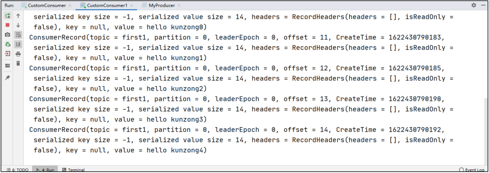

#### 5.4 生产经验---分区的分配以及再平衡

1、 一个consumer group 中有多个 consumer 组成， 一个 topic 有多个 partition 组成，现在的问题是，到底由哪个 consumer 来消费哪个 partition 的数据。

2、 Kafka 有四种主流的分区分配策略：Range、RoundRobin、Sticky、CooperativeSticky。可以通过配置参数 partition.assignment.strategy，修改分区的分配策略。默认策略是 Range+ CooperativeSticky。Kafka 可以同时使用多个分区分配策略。

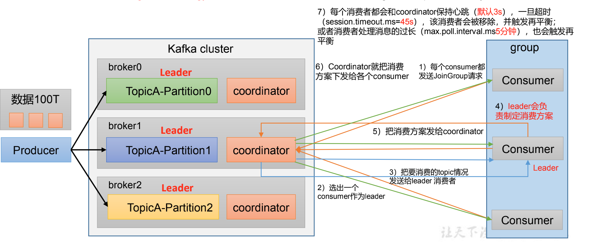

| 参数名称                      | 描述                                                         |
| ----------------------------- | ------------------------------------------------------------ |
| heartbeat.interval.ms         | Kafka 消费者和 coordinator 之间的心跳时间，默认 3s。<br/>该条目的值必须小于 session.timeout.ms，也不应该高于<br/>session.timeout.ms 的 1/3。 |
| session.timeout.ms            | Kafka 消费者和 coordinator 之间连接超时时间，默认 45s。超<br/>过该值，该消费者被移除，消费者组执行再平衡。 |
| max.poll.interval.ms          | 消费者处理消息的最大时长，默认是 5 分钟。超过该值，该<br/>消费者被移除，消费者组执行再平衡。 |
| partition.assignment.strategy | 消 费 者 分 区 分 配 策 略 ， 默 认 策 略 是 Range +CooperativeSticky。Kafka 可以同时使用多个分区分配策略。可 以 选 择 的 策 略 包 括 ： Range 、 RoundRobin 、 Sticky 、CooperativeSticky |

##### 5.4.1 Range 以及再平衡

1. **Range 是对每个 topic 而言的**。

​	首先对同一个 topic 里面的分区按照序号进行排序，并对消费者按照字母顺序进行 排序。

假如现在有 7 个分区， 3 个消费者，排序后的分区将会是 0,1,2,3,4,5,6；消费者排序完成之后将会是 C0,C1,C2。

通过 partitions数/consumer数  来决定每个消费者应该消费几个分区。如果除不尽，那么前面几个消费者将会多消费 1  个分区。

例如，7/3 = 2 余 1 ，除不尽，那么 消费者 C0 便会多消费 1 个分区。 8/3=2余2，除不尽，那么C0和C1分别多消费一个。

**注意**：如果只是针对 1 个 topic 而言，C0消费者多消费1个分区影响不是很大。但是如果有 N 多个 topic，那么针对每个 topic，消费者C0都将多消费 1 个分区，topic越多，C0消 费的分区会比其他消费者明显多消费 N 个分区。

容易产生数据倾斜！

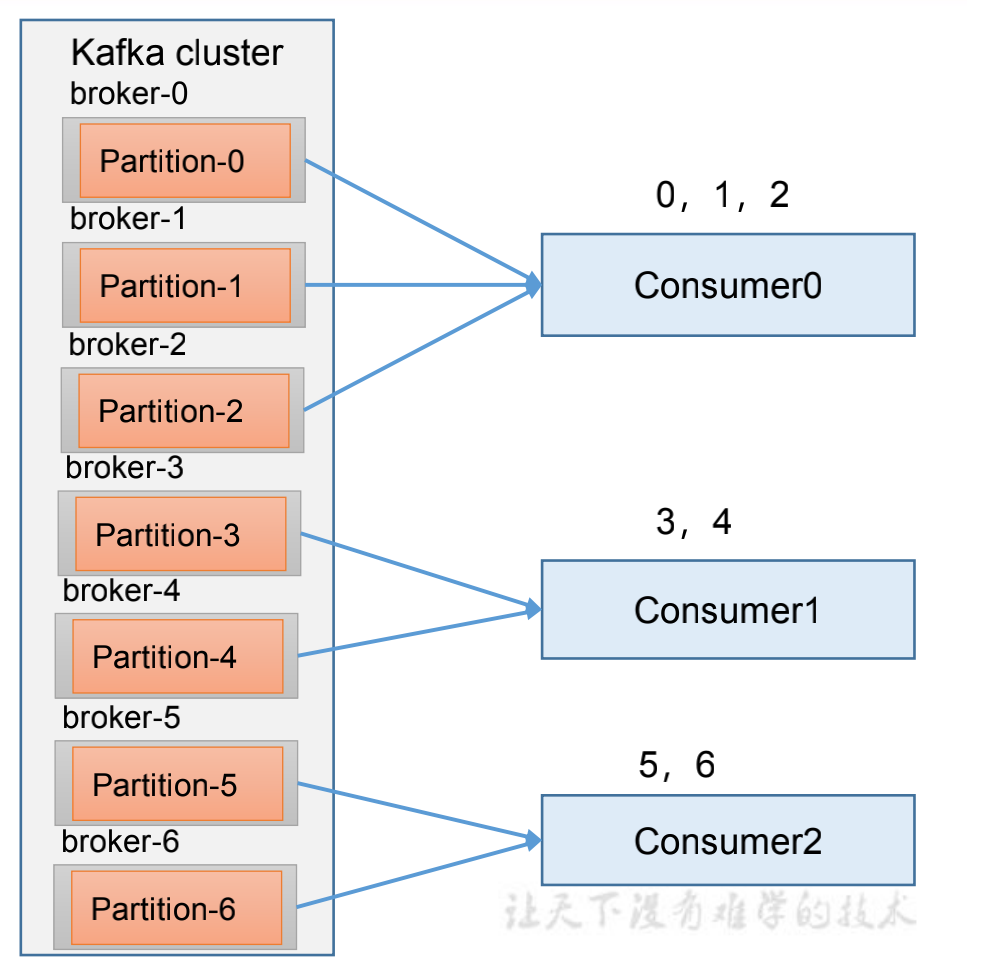

2. **Range分区分配策略案例**

- ①修改主题 first 为 7 个分区

```json
[atguigu@hadoop102 kafka]$ bin/kafka-topics.sh --bootstrap-server 
hadoop102:9092 --alter --topic first --partitions 7
```

【注意】分区数可以增加，但是不能减少。

- ② 复制CustomConsuer类，创建 CustomConsumer2。这样可以由三个消费者 CustomConsumer、CustomConsumer1、CustomConsumer2 组成消费者组，组名都为“test”，同时启动 3 个消费者。

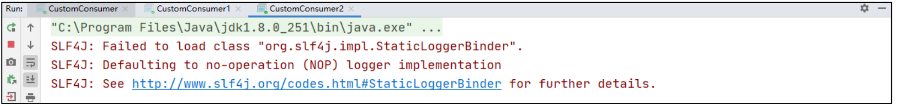

- ③ 启动CustomProducer生产者，发送 500 条消息，随机发送到不同的分区

```java
package com.yooome.kafka.producer;

import org.apache.kafka.clients.producer.KafkaProducer;
import org.apache.kafka.clients.producer.ProducerConfig;
import org.apache.kafka.clients.producer.ProducerRecord;

import java.util.Properties;

public class CustomProducer {
    public static void main(String[] args) throws
            InterruptedException {
        Properties properties = new Properties();
        properties.put(ProducerConfig.BOOTSTRAP_SERVERS_CONFIG,
                "hadoop102:9092");
        properties.put(ProducerConfig.KEY_SERIALIZER_CLASS_CONFIG,
                StringDeserializer.class.getName());
        properties.put(ProducerConfig.VALUE_SERIALIZER_CLASS_CONFIG,
                StringDeserializer.class.getName());
        KafkaProducer<String, String> kafkaProducer = new
                KafkaProducer<>(properties);
        for (int i = 0; i < 7; i++) {
            kafkaProducer.send(new ProducerRecord<>("first", i,
                    "test", "atguigu"));
        }
        kafkaProducer.close();
    }
}
```

说明：Kafka 默认的分区分配策略就是 Range + CooperativeSticky，所以不需要修改策略。

- ④ 观看 3 个消费者分别消费哪些分区的数据。

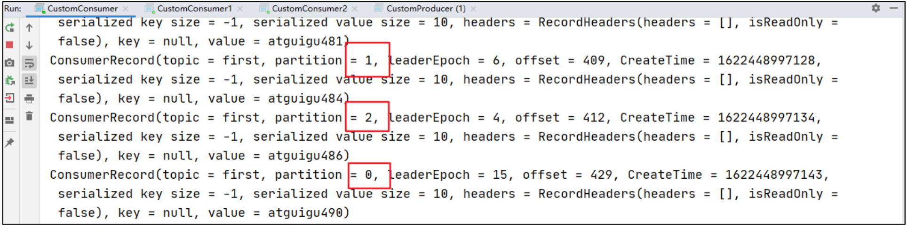

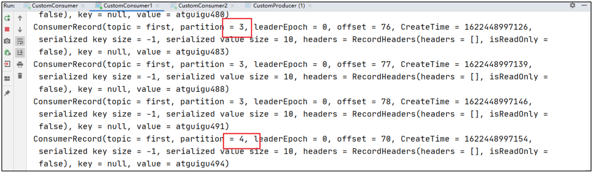

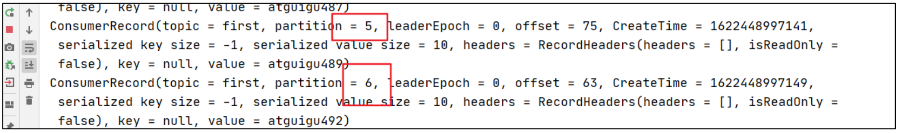

3. **Range 分区分配再平衡案例**

（1）**停止掉 0 号消费者，快速重新发送消息观看结果（45s 以内，越快越好）**。 

​		1 号消费者：消费到 3、4 号分区数据。 

​		2 号消费者：消费到 5、6 号分区数据。 

0 号消费者的任务会整体被分配到 1 号消费者或者 2 号消费者。

**说明**：0 号消费者挂掉后，消费者组需要按照超时时间 45s 来判断它是否退出，所以需要等待，时间到了 45s 后，判断它真的退出就会把任务分配给其他 broker 执行。

（2）**再次重新发送消息观看结果（45s 以后）。** 

​		1 号消费者：消费到 0、1、2、3 号分区数据。 

​		2 号消费者：消费到 4、5、6 号分区数据。

**说明**：消费者 0 已经被踢出消费者组，所以重新按照 range 方式分配。

##### 5.4.2 RoundRobin 以及再平衡

1. **RoundRobin分区策略原理**

RoundRobin 针对集群中 所有 Topic 而言。

RoundRobin 轮询分区策略，是把所有的 partition 和所有的 consumer 都列出来，然后按照 hashcode 进行排序，最后通过轮询算法来分配 partition 给到各个消费者。

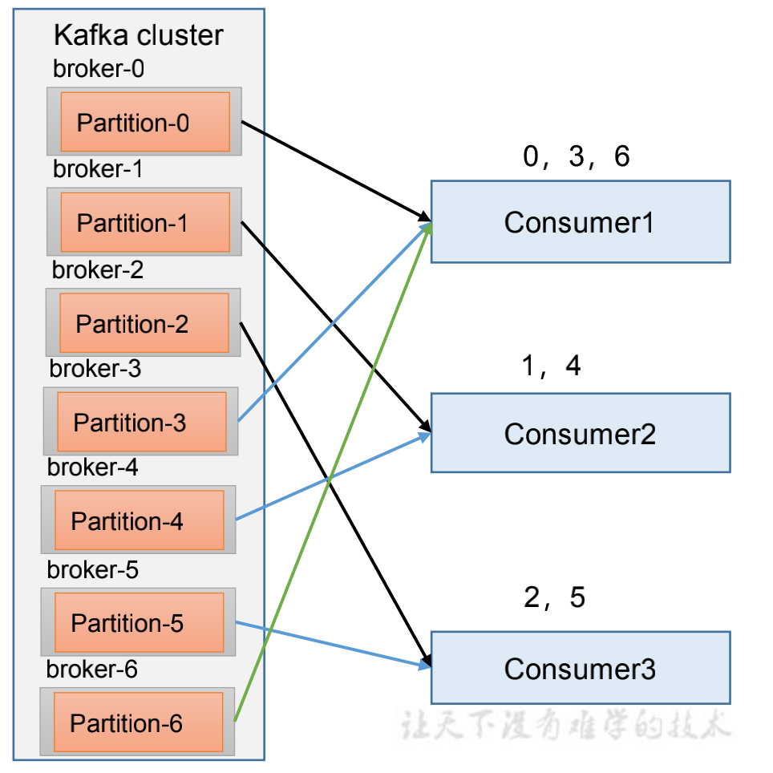

2. **RoundRobin 分区分配策略案例**

（1）依次在 CustomConsumer、CustomConsumer1、CustomConsumer2 三个消费者代码中修改分区分配策略为 RoundRobin。

```java
// 修改分区分配策略
properties.put(ConsumerConfig.PARTITION_ASSIGNMENT_STRATEGY_CONFIG, "org.apache.kafka.clients.consumer.RoundRobinAssignor");
```

（2）重启 3 个消费者，重复发送消息的步骤，观看分区结果。 

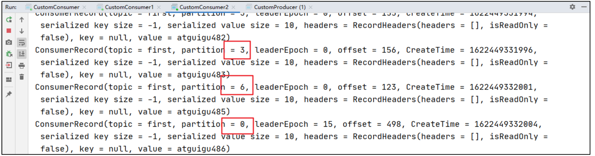

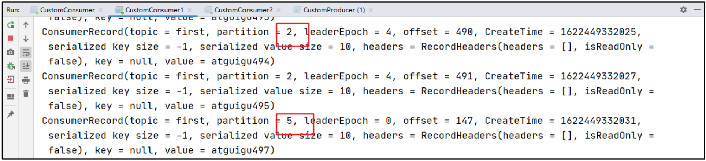

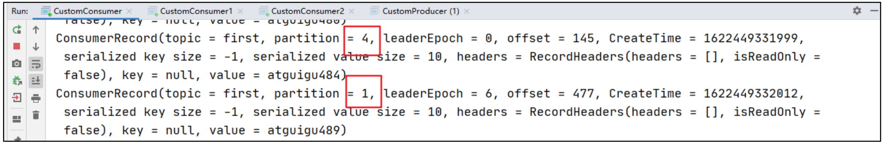

3. **RoundRobin 分区分配在平衡案例**

（1）停止掉 0 号消费者，快速重新发送消息观看结果（45s 以内，越快越好）。 

​		1 号消费者：消费到 2、5 号分区数据

​		2 号消费者：消费到 4、1 号分区数据

​		0 号消费者的任务会按照 RoundRobin 的方式，把数据轮询分成 0 、6 和 3 号分区数据，

分别由 1 号消费者或者 2 号消费者消费。

**说明**：0 号消费者挂掉后，消费者组需要按照超时时间 45s 来判断它是否退出，所以需

要等待，时间到了 45s 后，判断它真的退出就会把任务分配给其他 broker 执行。

（2）再次重新发送消息观看结果（45s 以后）。 

​		1 号消费者：消费到 0、2、4、6 号分区数据

​		2 号消费者：消费到 1、3、5 号分区数据

**说明**：消费者 0 已经被踢出消费者组，所以重新按照 RoundRobin 方式分配。

##### 5.4.3 Sticky 以及在平衡

**粘性分区定义：**可以理解为分配的结果带有“粘性的”。即在执行一次新的分配之前，考虑上一次分配的结果，尽量少的调整分配的变动，可以节省大量的开销。粘性分区是 Kafka 从 0.11.x 版本开始引入这种分配策略，首先会尽量均衡的放置分区到消费者上面，在出现同一消费者组内消费者出现问题的时候，会尽量保持原有分配的分区不变化。

1）需求：

设置主题为 first，7 个分区；准备 3 个消费者，采用粘性分区策略，并进行消费，观察消费分配情况。然后再停止其中一个消费者，再次观察消费分配情况。 

2）步骤：

（1）修改分区分配策略为粘性。

注意：3 个消费者都应该注释掉，之后重启 3 个消费者，如果出现报错，全部停止等会再重启，或者修改为全新的消费者组。

```java
// 修改分区分配策略
ArrayList<String> startegys = new ArrayList<>();
startegys.add("org.apache.kafka.clients.consumer.StickyAssignor");
properties.put(ConsumerConfig.PARTITION_ASSIGNMENT_STRATEGY_CONFIG, startegys);
```

（2）使用同样的生产者发送 500 条消息。

可以看到会尽量保持分区的个数近似划分分区。

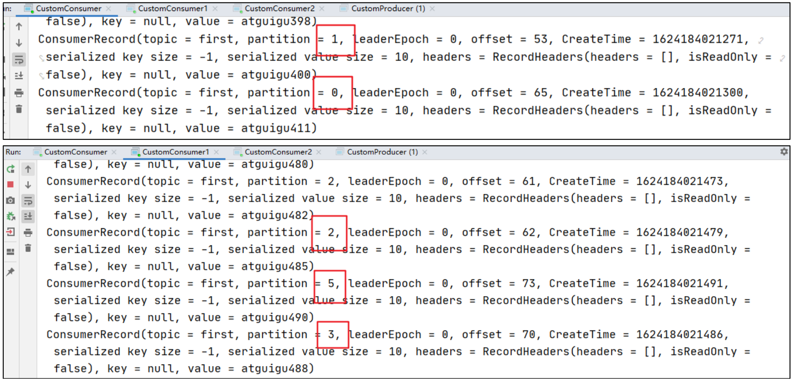

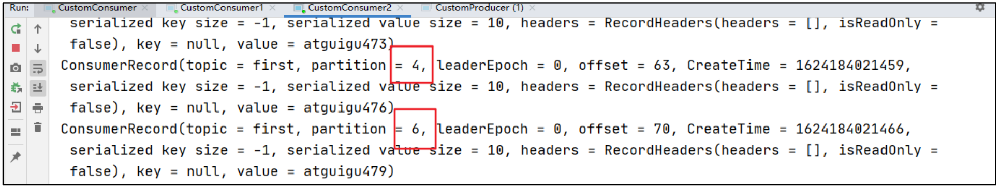

**3）Sticky分区分配再平衡案例**

（1）停止掉 0 号消费者，快速重新发送消息观看结果（45s 以内，越快越好）。 

​		1 号消费者：消费到 2、5、3 号分区数据。 

​		2 号消费者：消费到 4、6 号分区数据。 

​		0 号消费者的任务会按照粘性规则，尽可能均衡的随机分成 0 和 1 号分区数据，分别

由 1 号消费者或者 2 号消费者消费。

**说明**：0 号消费者挂掉后，消费者组需要按照超时时间 45s 来判断它是否退出，所以需要等待，时间到了 45s 后，判断它真的退出就会把任务分配给其他 broker 执行。

（2）再次重新发送消息观看结果（45s 以后）。 

​		1 号消费者：消费到 2、3、5 号分区数据。 

​		2 号消费者：消费到 0、1、4、6 号分区数据。

**说明**：消费者 0 已经被踢出消费者组，所以重新按照粘性方式分配。

#### 5.5 offset 位移

##### 5.5.1 offset 的默认维护位置

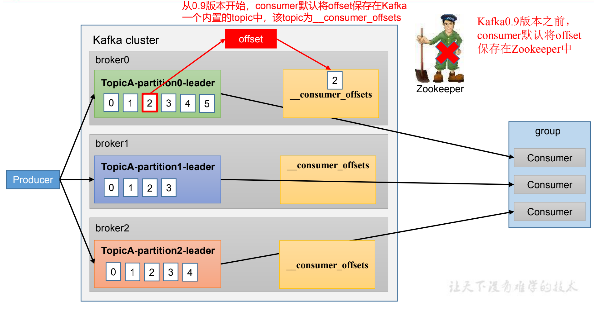

__consumer_offsets 主题里面采用 key 和 value 的方式存储数据。key 是 group.id+topic+分区号，value 就是当前 offset 的值。每隔一段时间，kafka 内部会对这个 topic 进行compact，也就是每个 group.id+topic+分区号就保留最新数据。

**1）消费 offset 案例**

（0）思想：__consumer_offsets 为 Kafka 中的 topic，那就可以通过消费者进行消费。 

（1）在配置文件 config/consumer.properties 中添加配置 exclude.internal.topics=false，

默认是 true，表示不能消费系统主题。为了查看该系统主题数据，所以该参数修改为 false。 

（2）采用命令行方式，创建一个新的 topic。

```java
[atguigu@hadoop102 kafka]$ bin/kafka-topics.sh --bootstrap-server 
hadoop102:9092 --create --topic atguigu --partitions 2 --replication-factor 2
```

（3）启动生产者往 atguigu 生产数据。

```java
[atguigu@hadoop102 kafka]$ bin/kafka-console-producer.sh --topic atguigu --bootstrap-server hadoop102:9092
```

（4）启动消费者消费 atguigu 数据。

```java
[atguigu@hadoop104 kafka]$ bin/kafka-console-consumer.sh --bootstrap-server hadoop102:9092 --topic atguigu --group test
```

注意：指定消费者组名称，更好观察数据存储位置（key 是 group.id+topic+分区号）。 

（5）查看消费者消费主题__consumer_offsets。

```java
[atguigu@hadoop102 kafka]$ bin/kafka-console-consumer.sh --topic 
__consumer_offsets --bootstrap-server hadoop102:9092 --consumer.config config/consumer.properties --formatter 
"kafka.coordinator.group.GroupMetadataManager\$OffsetsMessageFormatter" --from-beginning
  
[offset,atguigu,1]::OffsetAndMetadata(offset=7, 
leaderEpoch=Optional[0], metadata=, commitTimestamp=1622442520203, expireTimestamp=None)
  
[offset,atguigu,0]::OffsetAndMetadata(offset=8, leaderEpoch=Optional[0], metadata=,commitTimestamp=1622442520203, expireTimestamp=None)
```

##### 5.5.2 自动提交offset

为了使我们能够专注于自己的业务逻辑，Kafka提供了自动提交offset的功能。

自动提交offset的相关参数：

- **enable.auto.commit**：是否开启自动提交offset功能，默认是true

-  **auto.commit.interval.ms**：自动提交offset的时间间隔，默认是5s

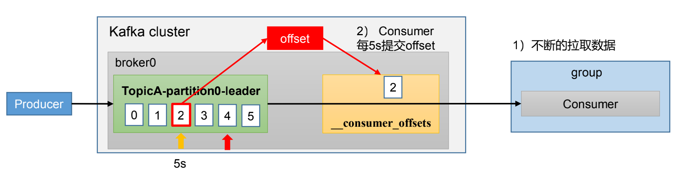

| 参数名称                | 描述                                                         |
| ----------------------- | ------------------------------------------------------------ |
| enable.auto.commit      | 默认值为 true，消费者会自动周期性地向服务器提交偏移量。      |
| auto.commit.interval.ms | 如果设置了 enable.auto.commit 的值为 true， 则该值定义了消费者偏移量向 Kafka 提交的频率，默认 5s。 |

1. **消费者自动提交offset**

```java
package com.yooome.kafka.consumer;

import org.apache.kafka.clients.consumer.ConsumerConfig;
import org.apache.kafka.clients.consumer.ConsumerRecord;
import org.apache.kafka.clients.consumer.ConsumerRecords;
import org.apache.kafka.clients.consumer.KafkaConsumer;

import java.util.Arrays;
import java.util.Properties;

public class CustomConsumerAutoOffset {
    public static void main(String[] args) {
        // 1. 创建 kafka 消费者配置类
        Properties properties = new Properties();
        // 2. 添加配置参数
        // 添加连接
        properties.put(ConsumerConfig.BOOTSTRAP_SERVERS_CONFIG,
                "hadoop102:9092");
        // 配置序列化 必须
        properties.put(ConsumerConfig.KEY_DESERIALIZER_CLASS_CONFIG,
                "org.apache.kafka.common.serialization.StringDeserializer");
        properties.put(ConsumerConfig.VALUE_DESERIALIZER_CLASS_CONFIG,
                "org.apache.kafka.common.serialization.StringDeserializer");
        // 配置消费者组
        properties.put(ConsumerConfig.GROUP_ID_CONFIG, "test");
        // 是否自动提交 offset
        properties.put(ConsumerConfig.ENABLE_AUTO_COMMIT_CONFIG,
                true);
        // 提交 offset 的时间周期 1000ms，默认 5s
        properties.put(ConsumerConfig.AUTO_COMMIT_INTERVAL_MS_CONFIG,
                1000);
        //3. 创建 kafka 消费者
        KafkaConsumer<String, String> consumer = new
                KafkaConsumer<>(properties);
        //4. 设置消费主题 形参是列表
        consumer.subscribe(Arrays.asList("first"));
        //5. 消费数据
        while (true) {
        // 读取消息
            ConsumerRecords<String, String> consumerRecords =
                    consumer.poll(Duration.ofSeconds(1));
        // 输出消息
            for (ConsumerRecord<String, String> consumerRecord :
                    consumerRecords) {
                System.out.println(consumerRecord.value());
            }
        }
    }
}
```

##### 5.5.3 手动提交offset

虽然自动提交offset十分简单比那里，但由于其是基于时间提交的，开发人员难以把握 offset 提交的时机。一次 Kafka 还提供了手动提交 offset 的API。

手动提交 offset 的方法有两种：分别是 commitSync(同步提交)和commitAsync(异步提交)。两者的相同点是，都会将本次提交的一批数据最高的偏移量提交；不同点是，同步提交阻塞当前线程，一直到提交成功，并且会自动失败重试（由不可控因素导致，也会出现提交失败）；而异步提交则没有失败重试机制，故有可能提交失败。

- **commitSync（同步提交）**：必须等待offset提交完毕，再去消费下一批数据。
- **commitAsync（异步提交）** ：发送完提交offset请求后，就开始消费下一批数据了。

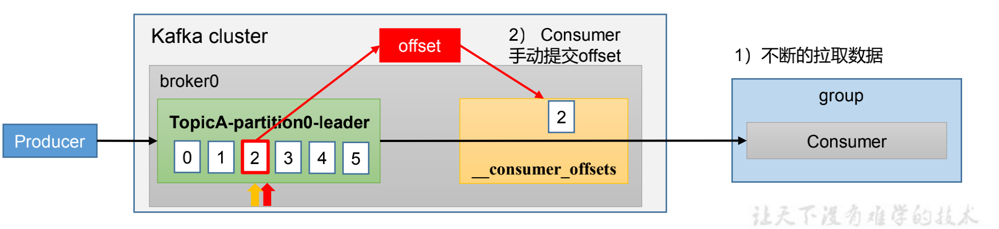

**1）同步提交 offset**

由于同步提交 offset 有失败重试机制，故更加可靠，但是由于一直等待提交结果，提交的效率比较低。以下为同步提交 offset 的示例。

```java
package com.yooome.kafka.producer;

import org.apache.kafka.clients.consumer.ConsumerConfig;
import org.apache.kafka.clients.consumer.ConsumerRecord;
import org.apache.kafka.clients.consumer.ConsumerRecords;
import org.apache.kafka.clients.consumer.KafkaConsumer;
import org.apache.kafka.common.serialization.StringDeserializer;

import java.time.Duration;
import java.util.ArrayList;
import java.util.Properties;

public class CustomConsumerByHandSync {
    public static void main(String[] args) {
        // 1. 创建kafka生产者配置对象
        Properties properties = new Properties();
        // 2. 给 kafka 配置对象添加配置信息：bootstrap.servers
        properties.put(ConsumerConfig.BOOTSTRAP_SERVERS_CONFIG, "localhost:9092");
        // key,value 序列化（必须）：key.serializer，value.serializer
        properties.put(ConsumerConfig.KEY_DESERIALIZER_CLASS_CONFIG, StringDeserializer.class.getName());
        properties.put(ConsumerConfig.VALUE_DESERIALIZER_CLASS_CONFIG, StringDeserializer.class.getName());

        properties.put(ConsumerConfig.GROUP_ID_CONFIG, "test");
        // 是否自动提交 offset
        properties.put(ConsumerConfig.ENABLE_AUTO_COMMIT_CONFIG, false);

        // 3. 创建 kafka 生产者对象
        KafkaConsumer<String, String> kafkaConsumer = new KafkaConsumer<String, String>(properties);

        ArrayList<String> topic = new ArrayList<>();
        topic.add("first");
        kafkaConsumer.subscribe(topic);
        // 拉去数据打印
        while (true) {
            ConsumerRecords<String, String> consumerRecords = kafkaConsumer.poll(Duration.ofSeconds(1));
            for (ConsumerRecord<String,String> consumerRecord : consumerRecords) {
                System.out.println("consumerRecord: " + consumerRecord.value());
            }
            // 同步提交 offset
            kafkaConsumer.commitSync();
        }
    }
}
```

**2）异步提交 offset**

虽然同步提交 offset 更可靠一些，但是由于其会阻塞当前线程，直到提交成功。因此吞吐量会受到很大的影响。因此更多的情况下，会选用异步提交 offset 的方式。以下为异步提交 offset 的示例：

```java
package com.yooome.kafka.producer;

import org.apache.kafka.clients.consumer.ConsumerConfig;
import org.apache.kafka.clients.consumer.ConsumerRecord;
import org.apache.kafka.clients.consumer.ConsumerRecords;
import org.apache.kafka.clients.consumer.KafkaConsumer;
import org.apache.kafka.common.serialization.StringDeserializer;

import java.time.Duration;
import java.util.ArrayList;
import java.util.Properties;

public class CustomConsumerByHandSync {
    public static void main(String[] args) {
        // 1. 创建kafka生产者配置对象
        Properties properties = new Properties();
        // 2. 给 kafka 配置对象添加配置信息：bootstrap.servers
        properties.put(ConsumerConfig.BOOTSTRAP_SERVERS_CONFIG, "localhost:9092");
        // key,value 序列化（必须）：key.serializer，value.serializer
        properties.put(ConsumerConfig.KEY_DESERIALIZER_CLASS_CONFIG, StringDeserializer.class.getName());
        properties.put(ConsumerConfig.VALUE_DESERIALIZER_CLASS_CONFIG, StringDeserializer.class.getName());

        properties.put(ConsumerConfig.GROUP_ID_CONFIG, "test");
        // 是否自动提交 offset
        properties.put(ConsumerConfig.ENABLE_AUTO_COMMIT_CONFIG, false);

        // 3. 创建 kafka 生产者对象
        KafkaConsumer<String, String> kafkaConsumer = new KafkaConsumer<String, String>(properties);

        ArrayList<String> topic = new ArrayList<>();
        topic.add("first");
        kafkaConsumer.subscribe(topic);
        // 拉去数据打印
        while (true) {
            ConsumerRecords<String, String> consumerRecords = kafkaConsumer.poll(Duration.ofSeconds(1));
            for (ConsumerRecord<String,String> consumerRecord : consumerRecords) {
                System.out.println("consumerRecord: " + consumerRecord.value());
            }
            // 异步提交 offset
            kafkaConsumer.commitAsync();
        }
    }
}

```

##### **5.5.4** **指定** **Offset** **消费**

auto.offset.reset = earliest | latest | none 默认是 latest。 

当 Kafka 中没有初始偏移量（消费者组第一次消费）或服务器上不再存在当前偏移量

时（例如该数据已被删除），该怎么办？ 

（1）earliest：自动将偏移量重置为最早的偏移量，--from-beginning。 

（2）latest（默认值）：自动将偏移量重置为最新偏移量。

（3）none：如果未找到消费者组的先前偏移量，则向消费者抛出异常。

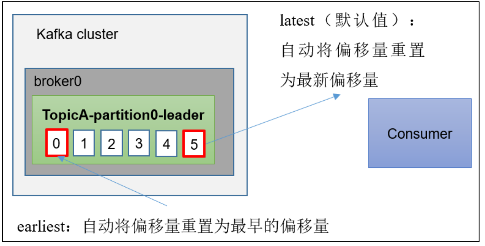

​	(4) 任意指定 offset 位移开始消费

```java
package com.yooome.kafka.producer;

import org.apache.kafka.clients.consumer.ConsumerConfig;
import org.apache.kafka.clients.consumer.ConsumerRecord;
import org.apache.kafka.clients.consumer.ConsumerRecords;
import org.apache.kafka.clients.consumer.KafkaConsumer;
import org.apache.kafka.common.TopicPartition;
import org.apache.kafka.common.serialization.StringDeserializer;

import java.time.Duration;
import java.util.ArrayList;
import java.util.HashSet;
import java.util.Properties;
import java.util.Set;

public class CustomConsumerSeek {
    public static void main(String[] args) {
        // 1. 创建kafka生产者配置对象
        Properties properties = new Properties();
        // 2. 给 kafka 配置对象添加配置信息：bootstrap.servers
        properties.put(ConsumerConfig.BOOTSTRAP_SERVERS_CONFIG, "localhost:9092");
        // key,value 序列化（必须）：key.serializer，value.serializer
        properties.put(ConsumerConfig.KEY_DESERIALIZER_CLASS_CONFIG, StringDeserializer.class.getName());
        properties.put(ConsumerConfig.VALUE_DESERIALIZER_CLASS_CONFIG, StringDeserializer.class.getName());

        properties.put(ConsumerConfig.GROUP_ID_CONFIG, "test2");
        // 3. 创建 kafka 生产者对象
        KafkaConsumer<String, String> kafkaConsumer = new KafkaConsumer<String, String>(properties);

        ArrayList<String> topic = new ArrayList<>();
        topic.add("first");
        kafkaConsumer.subscribe(topic);
        Set<TopicPartition> assignment= new HashSet<>();
        while (assignment.size() == 0) {
            kafkaConsumer.poll(Duration.ofSeconds(1));
        // 获取消费者分区分配信息（有了分区分配信息才能开始消费）
            assignment = kafkaConsumer.assignment();
        }
        // 遍历所有分区，并指定 offset 从 1700 的位置开始消费
        for (TopicPartition tp: assignment) {
            kafkaConsumer.seek(tp, 1700);
        }

        // 拉去数据打印
        while (true) {
            ConsumerRecords<String, String> consumerRecords = kafkaConsumer.poll(Duration.ofSeconds(1));
            for (ConsumerRecord<String,String> consumerRecord : consumerRecords) {
                System.out.println("consumerRecord: " + consumerRecord);
            }
        }
    }
}

```

【注意】：每次执行完，需要修改消费者组名；

##### **5.5.5** **指定时间消费**

需求：在生产环境中，会遇到最近消费的几个小时数据异常，想重新按照时间消费。

例如要求按照时间消费前一天的数据，怎么处理？

操作步骤：

```java
package com.yooome.kafka.producer;

import org.apache.kafka.clients.consumer.*;
import org.apache.kafka.common.TopicPartition;
import org.apache.kafka.common.serialization.StringDeserializer;

import java.time.Duration;
import java.util.*;

public class CustomConsumerSeek {
    public static void main(String[] args) {
        // 1. 创建kafka生产者配置对象
        Properties properties = new Properties();
        // 2. 给 kafka 配置对象添加配置信息：bootstrap.servers
        properties.put(ConsumerConfig.BOOTSTRAP_SERVERS_CONFIG, "localhost:9092");
        // key,value 序列化（必须）：key.serializer，value.serializer
        properties.put(ConsumerConfig.KEY_DESERIALIZER_CLASS_CONFIG, StringDeserializer.class.getName());
        properties.put(ConsumerConfig.VALUE_DESERIALIZER_CLASS_CONFIG, StringDeserializer.class.getName());

        properties.put(ConsumerConfig.GROUP_ID_CONFIG, "test2");
        // 3. 创建 kafka 生产者对象
        KafkaConsumer<String, String> kafkaConsumer = new KafkaConsumer<String, String>(properties);

        ArrayList<String> topic = new ArrayList<>();
        topic.add("first");
        kafkaConsumer.subscribe(topic);
        Set<TopicPartition> assignment = new HashSet<>();
        while (assignment.size() == 0) {
            kafkaConsumer.poll(Duration.ofSeconds(1));
// 获取消费者分区分配信息（有了分区分配信息才能开始消费）
            assignment = kafkaConsumer.assignment();
        }
        HashMap<TopicPartition, Long> timestampToSearch = new
                HashMap<>();
        // 封装集合存储，每个分区对应一天前的数据
        for (TopicPartition topicPartition : assignment) {
            timestampToSearch.put(topicPartition,
                    System.currentTimeMillis() - 1 * 24 * 3600 * 1000);
        }
        // 获取从 1 天前开始消费的每个分区的 offset
        Map<TopicPartition, OffsetAndTimestamp> offsets =
                kafkaConsumer.offsetsForTimes(timestampToSearch);
        // 遍历每个分区，对每个分区设置消费时间。
        for (TopicPartition topicPartition : assignment) {
            OffsetAndTimestamp offsetAndTimestamp =
                    offsets.get(topicPartition);
        // 根据时间指定开始消费的位置
            if (offsetAndTimestamp != null) {
                kafkaConsumer.seek(topicPartition,
                        offsetAndTimestamp.offset());
            }
        }

        // 拉去数据打印
        while (true) {
            ConsumerRecords<String, String> consumerRecords = kafkaConsumer.poll(Duration.ofSeconds(1));
            for (ConsumerRecord<String, String> consumerRecord : consumerRecords) {
                System.out.println("consumerRecord: " + consumerRecord);
            }
        }
    }
}

```

##### 5.5.6 漏消费和重复消费

**重复消费**：已经消费了数据，但是  offset 没有提交。

**漏消费**：先提交 offset 后消费，有可能会造成数据的漏消费。

（1）场景1：重复消费。自动提交offset引起。 

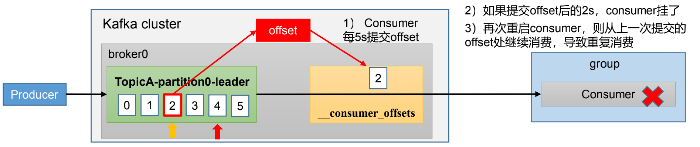

（2）场景1：漏消费。设置offset为手动提交，当offset被提交时，数据还在内存中未落盘，此时刚好消费者线程被kill掉，那么offset已经提交，但是数据未处理，导致这部分内存中的数据丢失。

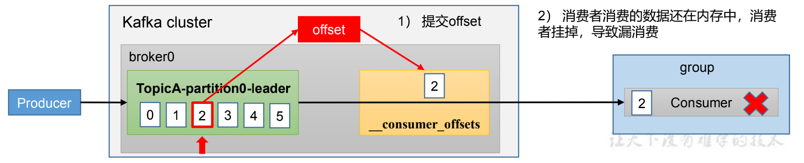

思考：怎么能做到既不漏消费也不重复消费呢？详看消费者事务。

#### 5.6 生产经验----消费者事务

如果想完成Consumer端的精准一次性消费，那么需要Kafka消费端将消费过程和提交offset过程做原子绑定。此时我们需要将Kafka的offset保存到支持事务的自定义介质（比 如MySQL）。这部分知识会在后续项目部分涉及。

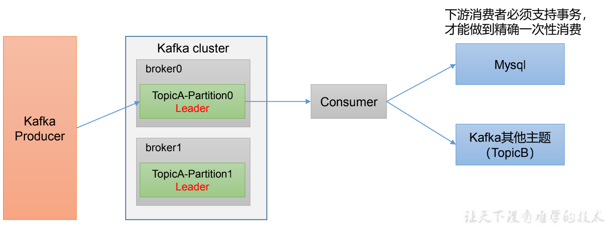

#### 5.7 生产经验----数据积压（消费者如何提高吞吐量）

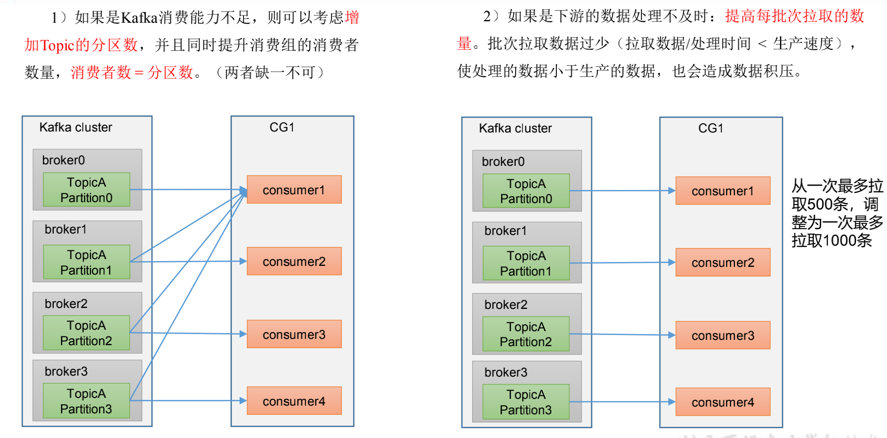

| 参数名称         | 描述                                                         |
| ---------------- | ------------------------------------------------------------ |
| fetch.max.bytes  | 默认 Default: 52428800（50 m）。消费者获取服务器端一批<br/>消息最大的字节数。如果服务器端一批次的数据大于该值<br/>（50m）仍然可以拉取回来这批数据，因此，这不是一个绝<br/>对最大值。一批次的大小受 message.max.bytes （broker <br/>config）or max.message.bytes （topic config）影响。 |
| max.poll.records | 一次 poll 拉取数据返回消息的最大条数，默认是 500 条          |

### 六、Kafka-Eagle监控

Kafka-Eagle 框架可以监控 Kafka 集群的整体运行情况，在生产环境中经常使用。

#### 6.1 Mysql环境准备

Kafka-Eagle 的安装依赖于 MySQL，MySQL 主要用来存储可视化展示的数据。如果集群中之前安装过 MySQL 可以跨过该步。

#### 6.2 Kafka环境准备

1. **关闭Kafka集群**

```java
[atguigu@hadoop102 kafka]$ kf.sh stop
```

2. **修改/opt/module/kafka/bin/kafka-server-start.sh命令中**

```java
[atguigu@hadoop102 kafka]$ vim bin/kafka-server-start.sh
```

修改如下参数值：

```java
if [ "x$KAFKA_HEAP_OPTS" = "x" ]; then
export KAFKA_HEAP_OPTS="-Xmx1G -Xms1G"
fi
```

为

```java
if [ "x$KAFKA_HEAP_OPTS" = "x" ]; then
export KAFKA_HEAP_OPTS="-server -Xms2G -Xmx2G -
XX:PermSize=128m -XX:+UseG1GC -XX:MaxGCPauseMillis=200 -
XX:ParallelGCThreads=8 -XX:ConcGCThreads=5 -
XX:InitiatingHeapOccupancyPercent=70"
export JMX_PORT="9999"
#export KAFKA_HEAP_OPTS="-Xmx1G -Xms1G"
fi
```

注意：修改之后在启动 Kafka 之前要分发之其他节点

```java
[atguigu@hadoop102 bin]$ xsync kafka-server-start.sh
```

#### 6.3 Kafka-Eagle 安装

1.  [官网](https://www.kafka-eagle.org/)

2. **上传压缩包  kafka-eagle-bin-2.0.8.tar.gz 到集群/opt/software目录**

3. **解压到本地**

```java
[atguigu@hadoop102 software]$ tar -zxvf kafka-eagle-bin-2.0.8.tar.gz
```

4. **进入刚才解压的目录**

```java
[atguigu@hadoop102 kafka-eagle-bin-2.0.8]$ ll
总用量 79164
-rw-rw-r--. 1 atguigu atguigu 81062577 10 月 13 00:00 efak-web-
2.0.8-bin.tar.gz
```

5. 修改名称

```java
[atguigu@hadoop102 module]$ mv efak-web-2.0.8/ efak
```


6. **将efak-web-2.0.8-bin.tar.gz 解压至/opt/module**

```java
[atguigu@hadoop102 module]$ mv efak-web-2.0.8/ efak
```

7. **修改配置文件 /opt/module/efak/conf/system-config.properties**

```shell
[atguigu@hadoop102 conf]$ vim system-config.properties
######################################
# multi zookeeper & kafka cluster list
# Settings prefixed with 'kafka.eagle.' will be deprecated, use 'efak.' 
instead
######################################
efak.zk.cluster.alias=cluster1
cluster1.zk.list=hadoop102:2181,hadoop103:2181,hadoop104:2181/kafka
######################################
# zookeeper enable acl
######################################
cluster1.zk.acl.enable=false
cluster1.zk.acl.schema=digest
cluster1.zk.acl.username=test
cluster1.zk.acl.password=test123
######################################
# broker size online list
######################################
cluster1.efak.broker.size=20
######################################
# zk client thread limit
######################################
kafka.zk.limit.size=32
######################################
# EFAK webui port
######################################
efak.webui.port=8048
######################################
# kafka jmx acl and ssl authenticate
######################################
cluster1.efak.jmx.acl=false
cluster1.efak.jmx.user=keadmin
cluster1.efak.jmx.password=keadmin123
cluster1.efak.jmx.ssl=false
cluster1.efak.jmx.truststore.location=/data/ssl/certificates/kafka.truststor
e
cluster1.efak.jmx.truststore.password=ke123456
######################################
# kafka offset storage
######################################
# offset 保存在 kafka
cluster1.efak.offset.storage=kafka
######################################
# kafka jmx uri
######################################
cluster1.efak.jmx.uri=service:jmx:rmi:///jndi/rmi://%s/jmxrmi
######################################
# kafka metrics, 15 days by default
######################################
efak.metrics.charts=true
efak.metrics.retain=15
######################################
# kafka sql topic records max
######################################
efak.sql.topic.records.max=5000
efak.sql.topic.preview.records.max=10
######################################
# delete kafka topic token
######################################
efak.topic.token=keadmin
######################################
# kafka sasl authenticate
######################################
cluster1.efak.sasl.enable=false
cluster1.efak.sasl.protocol=SASL_PLAINTEXT
cluster1.efak.sasl.mechanism=SCRAM-SHA-256
cluster1.efak.sasl.jaas.config=org.apache.kafka.common.security.scram.ScramL
oginModule required username="kafka" password="kafka-eagle";
cluster1.efak.sasl.client.id=
cluster1.efak.blacklist.topics=
cluster1.efak.sasl.cgroup.enable=false
cluster1.efak.sasl.cgroup.topics=
cluster2.efak.sasl.enable=false
cluster2.efak.sasl.protocol=SASL_PLAINTEXT
cluster2.efak.sasl.mechanism=PLAIN
cluster2.efak.sasl.jaas.config=org.apache.kafka.common.security.plain.PlainL
oginModule required username="kafka" password="kafka-eagle";
cluster2.efak.sasl.client.id=
cluster2.efak.blacklist.topics=
cluster2.efak.sasl.cgroup.enable=false
cluster2.efak.sasl.cgroup.topics=
######################################
# kafka ssl authenticate
######################################
cluster3.efak.ssl.enable=false
cluster3.efak.ssl.protocol=SSL
cluster3.efak.ssl.truststore.location=
cluster3.efak.ssl.truststore.password=
cluster3.efak.ssl.keystore.location=
cluster3.efak.ssl.keystore.password=
cluster3.efak.ssl.key.password=
cluster3.efak.ssl.endpoint.identification.algorithm=https
cluster3.efak.blacklist.topics=
cluster3.efak.ssl.cgroup.enable=false
cluster3.efak.ssl.cgroup.topics=
######################################
# kafka sqlite jdbc driver address
######################################
# 配置 mysql 连接
efak.driver=com.mysql.jdbc.Driver
efak.url=jdbc:mysql://hadoop102:3306/ke?useUnicode=true&characterEncoding=UT
F-8&zeroDateTimeBehavior=convertToNull
efak.username=root
efak.password=000000
######################################
# kafka mysql jdbc driver address
######################################
#efak.driver=com.mysql.cj.jdbc.Driver
#efak.url=jdbc:mysql://127.0.0.1:3306/ke?useUnicode=true&characterEncoding=U
TF-8&zeroDateTimeBehavior=convertToNull
#efak.username=root
#efak.password=123456
```

8. **添加环境变量**

```shell
[atguigu@hadoop102 conf]$ sudo vim /etc/profile.d/my_env.sh
# kafkaEFAK
export KE_HOME=/opt/module/efak
export PATH=$PATH:$KE_HOME/bin
```

注意：source /etc/profile

```shell
[atguigu@hadoop102 conf]$ source /etc/profile
```

9. **启动**

   （1）注意：启动之前需要先启动 ZK 以及 KAFKA。

```java
[atguigu@hadoop102 kafka]$ kf.sh start
```

​		（2）启动 efak

```java
[atguigu@hadoop102 efak]$ bin/ke.sh start
Version 2.0.8 -- Copyright 2016-2021
*****************************************************************
* EFAK Service has started success.
* Welcome, Now you can visit 'http://192.168.10.102:8048'
* Account:admin ,Password:123456
*****************************************************************
* <Usage> ke.sh [start|status|stop|restart|stats] </Usage>
* <Usage> https://www.kafka-eagle.org/ </Usage>
*****************************************************************
```

说明：如果停止 efak，执行命令。

```java
[atguigu@hadoop102 efak]$ bin/ke.sh stop
```

#### 6.4 Kafka-Eagle页面操作

##### 6.4.1 登录页面查看监控数据

http://192.168.10.102:8048/

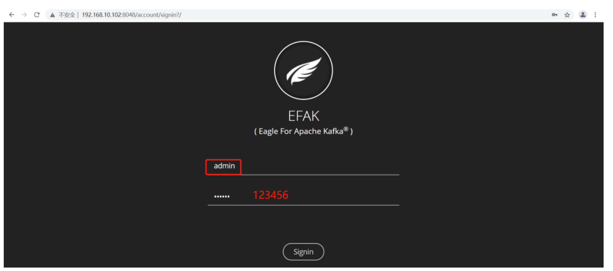

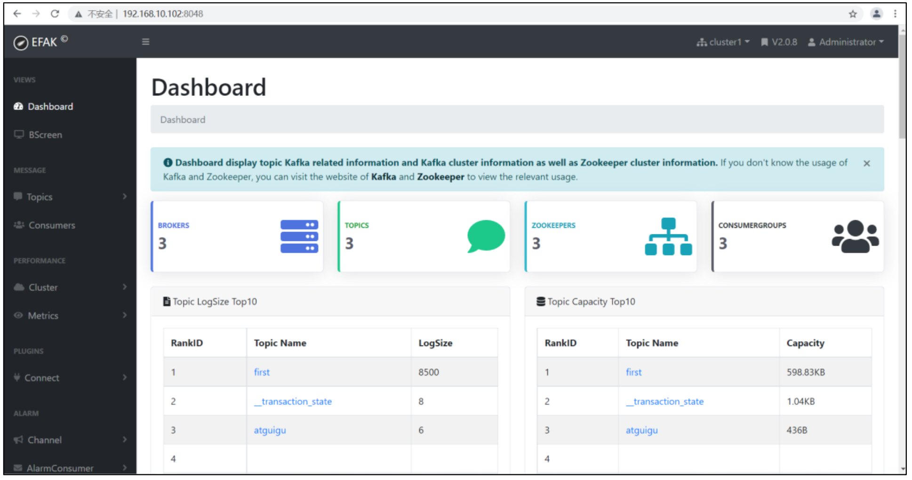

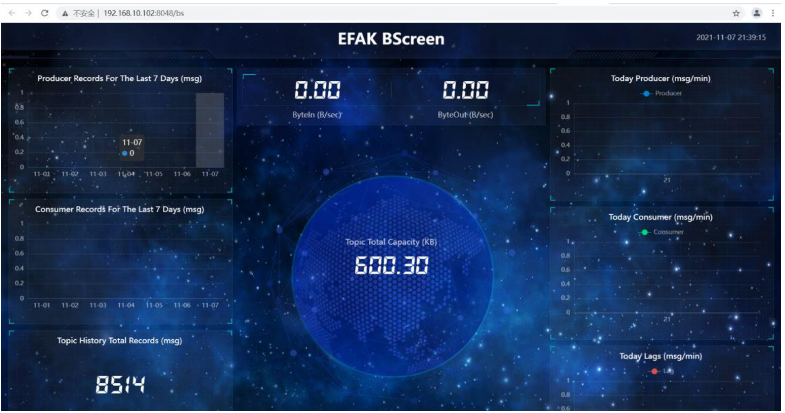

### 七、Kafka-Kraft模式

#### 7.1 Kafka-Kraft架构

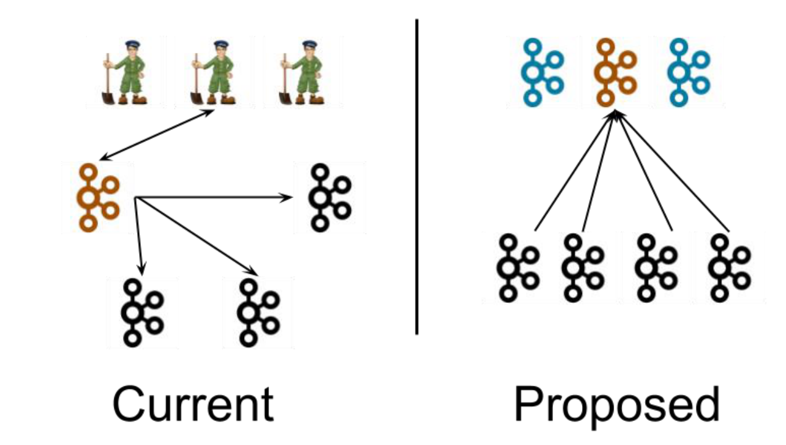

左图为 Kafka 现有架构，元数据在 zookeeper 中，运行时动态选举 controller，由controller 进行 Kafka 集群管理。右图为 kraft 模式架构（实验性），不再依赖 zookeeper 集群，而是用三台 controller 节点代替 zookeeper，元数据保存在 controller 中，由 controller 直接进行 Kafka 集群管理。

这样做的好处有以下几个： 

- Kafka 不再依赖外部框架，而是能够独立运行； 

- controller 管理集群时，不再需要从 zookeeper 中先读取数据，集群性能上升； 

- 由于不依赖 zookeeper，集群扩展时不再受到 zookeeper 读写能力限制； 

- controller 不再动态选举，而是由配置文件规定。这样我们可以有针对性的加强controller 节点的配置，而不是像以前一样对随机 controller 节点的高负载束手无策。

#### 7.2 Kafka-Kraft集群部署

1. **再次解压一份kafka安装包**

```java
[atguigu@hadoop102 software]$ tar -zxvf kafka_2.12-3.0.0.tgz -C /opt/module/
```

2. **重命名为Kafka2**

```java
[atguigu@hadoop102 module]$ mv kafka_2.12-3.0.0/ kafka2
```

3. **在 hadoop102 上修改/opt/module/kafka2/config/kraft/server.properties 配置文件**

```shell
[atguigu@hadoop102 kraft]$ vim server.properties
#kafka 的角色（controller 相当于主机、broker 节点相当于从机，主机类似 zk 功 能）
process.roles=broker, controller
#节点 ID
node.id=2
#controller 服务协议别名
controller.listener.names=CONTROLLER
#全 Controller 列表
controller.quorum.voters=2@hadoop102:9093,3@hadoop103:9093,4@hado
op104:9093
#不同服务器绑定的端口
listeners=PLAINTEXT://:9092,CONTROLLER://:9093
#broker 服务协议别名
inter.broker.listener.name=PLAINTEXT
#broker 对外暴露的地址
advertised.Listeners=PLAINTEXT://hadoop102:9092
#协议别名到安全协议的映射
listener.security.protocol.map=CONTROLLER:PLAINTEXT,PLAINTEXT:PLA
INTEXT,SSL:SSL,SASL_PLAINTEXT:SASL_PLAINTEXT,SASL_SSL:SASL_SSL
#kafka 数据存储目录
log.dirs=/opt/module/kafka2/data
```

4. **发布kafka2**

```java
[atguigu@hadoop102 module]$ xsync kafka2/
```

- 在 hadoop103 和 hadoop104 上 需 要 对 node.id 相应改变 ， 值 需 要 和controller.quorum.voters 对应。

- 在 hadoop103 和 hadoop104 上需要 根据各自的主机名称，修改相应的advertised.Listeners 地址。

5. **初始化集群数据目录**

- ① 首先生成存储目录唯一ID

```java
[atguigu@hadoop102 kafka2]$ bin/kafka-storage.sh random-uuid
J7s9e8PPTKOO47PxzI39VA
```

- ② 用该 ID 格式化 kafka 存储目录（三台节点）。

```java
[atguigu@hadoop102 kafka2]$ bin/kafka-storage.sh format -t 
J7s9e8PPTKOO47PxzI39VA -c 
/opt/module/kafka2/config/kraft/server.properties
[atguigu@hadoop103 kafka2]$ bin/kafka-storage.sh format -t 
J7s9e8PPTKOO47PxzI39VA -c 
/opt/module/kafka2/config/kraft/server.properties
[atguigu@hadoop104 kafka2]$ bin/kafka-storage.sh format -t 
J7s9e8PPTKOO47PxzI39VA -c 
/opt/module/kafka2/config/kraft/server.properties
```

6. 启动kafka集群

```java
[atguigu@hadoop102 kafka2]$ bin/kafka-server-start.sh -daemon 
config/kraft/server.properties
[atguigu@hadoop103 kafka2]$ bin/kafka-server-start.sh -daemon 
config/kraft/server.properties
[atguigu@hadoop104 kafka2]$ bin/kafka-server-start.sh -daemon 
config/kraft/server.properties
```

7. 停止kafka集群

```java
[atguigu@hadoop102 kafka2]$ bin/kafka-server-stop.sh
[atguigu@hadoop103 kafka2]$ bin/kafka-server-stop.sh
[atguigu@hadoop104 kafka2]$ bin/kafka-server-stop.sh
```

#### 7.3 Kafka-kraft集群启动停止脚本

1. 在/home/atguigu/bin 目录下创建文件 kf2.sh 脚本文件

```java
[atguigu@hadoop102 bin]$ vim kf2.sh
```

脚本如下：

```shell
#! /bin/bash
case $1 in
"start"){
for i in hadoop102 hadoop103 hadoop104
do
echo " --------启动 $i Kafka2-------"
ssh $i "/opt/module/kafka2/bin/kafka-server-start.sh -
daemon /opt/module/kafka2/config/kraft/server.properties"
done
};;
"stop"){
for i in hadoop102 hadoop103 hadoop104
do
echo " --------停止 $i Kafka2-------"
ssh $i "/opt/module/kafka2/bin/kafka-server-stop.sh "
done
};;
esac
```

2. 添加执行权限

```shell
[atguigu@hadoop102 bin]$ chmod +x kf2.sh
```

3. 启动集群命令

```shell
[atguigu@hadoop102 ~]$ kf2.sh start
```

4. 停止集群命令

```shell
[atguigu@hadoop102 ~]$ kf2.sh stop
```


https://gitee.com/yooome/golang/tree/main/Kafka详细教程


