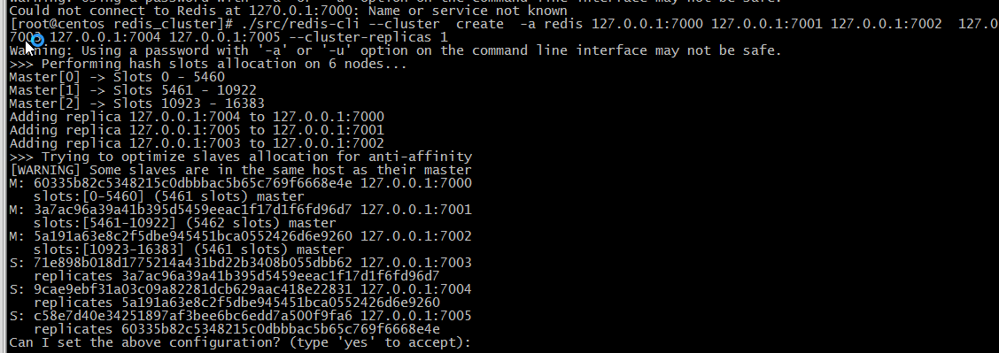

###                                                  Redis学习笔记

#### 一 、Redis简介

##### 1.1 什么是Redis

Redis 是完全开源免费的，遵守**BSD**协议，是一个高性能(**NOSQL**)的key-value**数据库***，Redis是一个开源的使用ANSI C语言编写、支持网络、可基于内存可持久化的日志型，Key-Value数据库，并提供多种语言的API。

```xml
BSD是"Berkeley Software Distribution"的缩写，意思是“伯克利软件发型版本”。
BSD开源协议是一个给予使用者很大自由的协议。可以自由的使用，修改源代码，也可以将修改后的代码作为开源或者专有软件在发布。BSD代码鼓励代码共享，但需要尊重代码作者的著作权。
BSD由于允许使用者修改和重新发布代码，也允许使用或在BSD代码上开发商业软件发布和销售，一次是对商业集成很友好的协议。
```

##### 1.2 NoSQL

```xml
NoSQL,泛指非关系型的数据库，NoSQL即Not-only SQL,它可以作为关系型数据库的良好补充。随着互谅网web2.0网站的兴起，非关系型的数据库现在成为了一个及其热门的新领域，非关系型数据库产品的发展非常迅速。
```

传统数据库暴露很多难以克服的问题，如下问题：

```xml
1、High performance - 对数据库高并发读写的需求。

2、Huge Storage - 对海量数据的高效存储和访问的需求。

3、High Scalability && High Availability - 对数据库的高可扩展性和高课用性的需求。
```

##### 1.3 NoSQL的类别

**键值（Key-Value）存储数据库**

```xml
  这一类数据库主要会使用到一个哈希表，这个表中有一个特定的键和一个指针指向特定的数据。
key/value模型对于IT系统涞水的优势在于简单，已部署。但是如果DBA只对部分值进行查询或者更新的时候，key/value显示的效率低下。
相关产品 ： Redis，Tokyo Cabinet
典型应用 ： 内存缓存，主要用于处理大量数据的高访问负载。
数据模型 ： 一系列键值对
优势 ： 快速查询
劣势 ： 存储的数据缺少结构化

```

**列存储数据库**

```xml
这部分数据库通常是用来对分布式存储的海量数据。键仍然存在，但是他们的特点是指向了多个列。这些列是由列家族来安排的。
相关产品 : HBase 、Riak
典型应用 ： 分布式的文件系统
数据模型 ： 以列簇式存储，将同一列数据存在一起
优势 ： 查找速度快，可扩展性强，更容易进行分布式扩展
劣势 ： 功能相对于局限
```

**文档型数据库**

```xml
文档型数据库：该类型的数据库模型是版本化的文档，半结构化的文档一特定的格式存储，比如JSON。文档数据库可以看做键值数据库的升级版，允许之间嵌套键值。而且文档型数据库比键值数据库的查询效率更高。
相关产品：MOngoDB
典型应用 ： web应用
数据模型 ： 一系列键值对
优势 ： 数据结构要求不严格
劣势 ： 查询性能不高，而且缺乏统一的查询语言
```

##### 1.4 总结：

NoSQL 数据库在一下的这几种情况下比较适用 ：

1、数据模型比较简单；

2、需要灵活更前的IT系统；

3、对数据库性能要求较高；

4、不需要高度的数据一致性；

5、对于给定key，比较容易映射复杂的环境；

##### 1.5 Redis 描述

​	Redis是完全开源免费的，遵守BSD协议，是一个高性能(NoSQL)的（key-value）数据库，Redis是一个开源的使用ANSI C语言编写，支持网络，可基于内存亦可持久化的日志型，Key-Value数据库，并提供多种语言的API。

##### 1.6 Redis的特点

-  **性能极高** - Redis读写的熟读110000次/s，写的速度是81000次/s。
- **丰富的数据类型** - Redis支持的类型String， Hash 、List 、Set 及 Ordered Set数据类型操作。
- **原子性**  - Redis的所有操作都是原子性的，意思就是要么成功，要么失败。单个操作时原子性的。多个操作也支持事务，即原子性，通过MULTI和EXEC指令包起来。
- **丰富的特性** - Redis还支持publis/subscribe，通知，key过期等等特性。
- **高速读写** ，redis使用自己实现的分离器，代码量很短，没有使用lock(MySQL),因此效率非常高。

Redis是一个简单的，高效的，分布式的，基于内存的缓存工具。

架设好服务器后，通过网络连接(类似数据库)，提供Key-Value缓存服务。

简单，是Redis突出的特色。

简单可以保证核心功能的稳定和优异。

##### 1.7 Redis的应用场景

**可以作为数据库，缓存，热点数据(经常别查询，但是不经常被修改或者删除的数据)和消息中间件等大部分功能。**

Redis常用的场景示例如下：

```xml
1、缓存
   缓存现在几乎是所有大中型网站都在用的必杀技，合理利用缓存提升网站的访问速度，还能大大降低数据库的访问压力。Redis提供了键过期功能，也提供了灵活的键淘汰策略，所以，现在Redis用在缓存的场合非常多。
2、排行榜
   Redis提供的有序集合数据类结构能够实现葛洪复杂的排行榜应用。
3、计数器
   什么是计数器，，视频网站的播放量等等，每次浏览+1，并发量高时如果每次都请求数据库操作无疑是中挑战和压力。Redis提供的incr命令来实现计数器功能，内存操作，性能非常好，非常是用于这些技术场景。
4、分布式会话
   集群模式下，在应用不多的情况下一般使用容日自带的session复制功能就能够满足，当应用相对复杂的系统中，一般都会搭建Redis等内存数据库为中心的session服务，session不在由容器管理，而是有session服务及内存数据管理。
5、分布式锁
   在很多互联网公司中都是用来分布式技术，分布式技术带来的技术挑战是对同一个资源的并发访问，如全局ID，减库存，秒杀等场景，并发量不发的场景可以使用数据库的悲观锁，乐观锁来实现，但是在并发高的场合中，利用数据库锁来控制资源的并发访问是不太理想的，大大影响了数据库的性能。可以利用Redis的setnx功能来编写分布式的锁，如果设置返回1，说明获取所成功，否则获取锁失败，实际应用中药考虑的细节要更多。
6、社交网络
   点赞、踩、关注/被关注，共同好友等是社交网站的基本功能，社交网站的访问量通常老说比较大，而且传统的关系数据库不适合这种类型的数据，Redis提供的哈希，集合等数据结构能很方便的实现这些功能。
7、最新列表
   Redis列表结构，LPUSH可以在列表头部插入一个内容ID作为关键字，LTRIM可以用来限制列表的数量，这样列表永远为N个ID。无需查询最新的列表，直接根据ID 去到对应的内容也即可。
8、消息系统
   消息对队列是网站比用中间件，如ActiveMQ，RabbitMQ，Kafaka等流行的消息队列中间件，主要用于业务解耦，流量削峰及异步处理试试性低的业务。Redis提供了发布/订阅及阻塞队列功能，能实现一个简单的消息队列系统。另外，这个不能喝专业的消息中间件相比。
```

##### 1.8  Redis总结

**优势** 

-  **性能极高** - Redis读写的熟读110000次/s，写的速度是81000次/s。
- **丰富的数据类型** - Redis支持的类型String， Hash 、List 、Set 及 Ordered Set数据类型操作。
- **原子性**  - Redis的所有操作都是原子性的，意思就是要么成功，要么失败。单个操作时原子性的。多个操作也支持事务，即原子性，通过MULTI和EXEC指令包起来。
- **丰富的特性** - Redis还支持publis/subscribe，通知，key过期等等特性。
- **高速读写** ，redis使用自己实现的分离器，代码量很短，没有使用lock(MySQL),因此效率非常高。

**缺点**

- **持久化**。 Redis直接将数据存储到内存中，要将数据保存到磁盘上，Redis可以使用两种方式实现持久化过程。定时快照(snapshot)：每个一端时间将整个数据库写到磁盘上，每次均是写全部数据，代价非常高。第二种方式基于语句追加（aof）：只追踪变化的数据，但是追加的log可能过大，同时所有的操作均重新执行一遍，**回复速度慢**。
- **耗内存**  、占用内存过高。

#### 二、Redis安装

##### 2.1 Redis官网

官方网站 ： https://redis.io/

官方下载 ： https://redis.io/download 可以根据需要下载不同版本

##### 2.2 Redis 安装

Redis是C语言开发，安装Redis需要先将官网下载的源码进行编译。编译依赖gcc环境，如果没有gcc环境，需要安装gcc

##### 2.3 安装gcc

gcc的安装很简单，首先要确保root登录，其次就是Linux要能连外网

```xml
yum -y install gcc automake autoconf libtool make
```

**注意：** 运行yum是出现/var/run/yum.pid已被锁定，PID为xxxx的另外一个程序正在运行的问题解决。

```xml
rm -f /var/run/yum.pid
```

##### 2.4 安装Redis

**下载redis二进制安装包**

```xml
wget http://download.redis.io/release/redis-6.0.5.tar.gz
```

**解压/apps目录下**

```xml
tar zxvf redis-6.0.5.tar.gz -C /apps
#Linux 中剪切命令
mv redis-6.0.5.tar.gz 安装包
#Linux中复制命令: cp Files path
cp redis-6.0.5.tar.gz /root/apps
```

进入redis中使用make命令进行编译

```xml
[root@centos redis-5.0.8]# make MALLOC=libc
```


```xml
    LINK redis-cli
    CC redis-benchmark.o
    LINK redis-benchmark
    INSTALL redis-check-rdb
    INSTALL redis-check-aof

Hint: It's a good idea to run 'make test' ;)

make[1]: 离开目录“/root/apps/redis-5.0.8/src”
[root@centos redis-5.0.8]# ll
```

**安装成功如上**

##### 2.5 安装到指定的位置

```xml
make PREFIX=/root/apps/redis install
```

（安装编译后的文件）安装到指定目录；

注意：PREFIX必须为大写，同时会自动为我们创建redis目录，并将结果安装此目录；

#### 三 、Redis启动

##### 3.1 启动Redis服务端，进入到Redis的安装目录

```xml
cd /usr/local/redis
```

##### 3.2 执行命令

```xml
./bin/redis-server
```


##### 3.3 Redis的客户端进行启动

```java
./bin/redis-cli
```

##### 3.4 启动Redis客户端命令语法：

```java
redis-cli -h IP地址 -p 端口   //默认IP本机  端口号6379
```

##### 3.5 检测是否服务端启动

启动redis客户端，打开终端并输入命令redis-cli。该命令连接本地的redis服务。

```java
127.0.0.1:6379> 
127.0.0.1:6379> ping
PONG
127.0.0.1:6379> 
```

在以上实例中我们连接到本地的redis服务并执行**PING** 命令，该命令用于检测redis服务是否启动

##### 3.6 检查redis的进程

```java
#执行 ps -ef | grep -i redis 来查看进程
ps -ef | grep -i redis
root      10050   5728  0 23:03 pts/0    00:00:03 ./bin/redis-server *:6379
root      10077  10056  0 23:10 pts/1    00:00:00 ./bin/redis-cli
root      10100  10081  0 23:22 pts/2    00:00:00 grep --color=auto -i redis
[root@centos ~]#   
```

#### 四、Redis配置详细

Redis默认定义了很多默认配置。但在实际开发中，一般我们都会通过手动配置完成。回到安装目录下找到解压文件中的redis.conf。

Redis的配置文件位于Redis安装目录下，文件名称为redis.conf

##### 4.1 配置Redis

命令：解压目录下的redis.conf配置文件复制到安装文件的目录下

```java
#把编译的redis.conf文件放 ，安装的redis文件目录下
[root@centos redis-5.0.8]# pwd
/root/apps/redis-5.0.8
[root@centos redis-5.0.8]# cp redis.conf /root/apps/redis
[root@centos redis-5.0.8]# cd ..
[root@centos apps]# ll
```

##### 4.2 Redis.conf

```java
1、Redis默认不是以守护进程的方式运行，可以通过该配置项修改，使用yes启用守护进程
    daemonize no
2、当Redis以守护进程方式运行时，Redis默认会把pid写入/var/run/redis.pid文件，可以通过pidfile指定 
    pidfile /var/run/redis.pid

3、指定Redis监听端口，默认端口为6379；’
    port 6379
4、绑定的主机地址
    bind 127.0.0.1
5、当客户端限制多长时间后关闭连接，如果指定为0，表示关闭该功能
    timeout 300
6、指定日志记录几倍，Redis总共支持四个级别：debug，verbose，notice，warning，默认为verbose
    loglevel verbos
7、日志记录方式，默认为标准输出，如果配置Redis为守护进程方式运行，而这里又配置日志记录方式标准输出，则日志将会发送给/dev/null
    logfile stdout
8、设置数据库的数量，默认数据库为0，可以使用SELECT<dbid>命令在连接上指定数据库id
    databases 16
9、指定在多长时间内，有多少次更新操作，就将数据同步到数据文件，可以多个条件配合
    save<seconds><changes>
    Redis默认配置文件中提供了三个条件
    save 900 1
    save 300 10
    save 60 10000
    分别表示900秒(15分钟)内有1个更改，300秒(5分钟)内有10个更改以及60秒内有10000个更改。
10、指定存储至本地数据库时是否压缩数据，默认为yes，Redis采用LZF(压缩算法)压缩，如果为了节省CPU时间，可以关闭该选项，但会导致数据库文件变的巨大
    rdbcompression yes
```

**中间10个**

```java
11、指定本地数据库文件名，默认为dump.rdb
	dbfilename dump.rdb
12、指定本地数据库存放目录
	dir ./
13、设置当本机为slav服务时，设置master服务的IP地址及端口，在Redis启动时，它会自动从master进行数据同步slaveof<masterip> <masterport>
14、当master服务设置了密码保护时，slav服务连接master的密码
    masterauth<master-password>
15、设置Redis连接密码，如果配置了连接密码，客户端在连接Redis是需要通过AUTH <password>命令提供密码，默认关闭
    requirepass foobared
16、设置同一时间最大客户端连接数，默认是无限制，Redis可以同时打开的客户端连接数为Redis进程可以打开的最大文件描述符数，如果设置maxclients 0，表示不作限制。当客户端连接数到达限制是，Redis会关闭新的连接并向客户端返回max number of clients reached错误信息
    maxclients 128

17、指定Redis最大内存限制，Redis在启动时会把数据加载到内存中，达到最大内存后，Redis会先尝试清除已到期或即将到期的Key，档次方法处理后，仍然达最大内存设置，将无法再进行写入操作，但仍然可以静心读取操作。Rdis新的vm机制，会把key存放内存，Value会存放在swap区
    maxmemory <bytes>
18、指定是否每次更新操作后进行日志记录，Redis在默认情况下是异步的把数据写入磁盘，如果不开启，可能会在断电时导致一端时间内的数据丢失。因为 redis 本省同步数据文件是按上面save条件来同步的，所有的数据会在一端时间内只存在于内存中。默认为no
    appendonly no
19、指定更新日志文件名，默认为appendonly.aof
    appendfulename appendonly.aof
20、指定更新日志条件，共有3个可选值：
    no: 表示等操作系统进行数据缓存同步到磁盘(快)
    always: 表示每次更新操作后活动调用fsync()将数据写到磁盘(慢，安全)
    everysec: 表示每秒同步一个(折中，默认值)
    appendfsync everysec
```

``` xml
maxmemory-policy noeviction  #  内存达到上限之后的处理策略
1、volatile-lru ： 只对设置了过期时间的key进行LRU（默认值）
2、allkeys-lru ： 产出lru算法的key
3、volatile-random  ： 随机删除即将过期key
4、allkey -random : 随机删除
5、volatile-ttl  :  删除即将过期的
6、noeviction    ： 永不过期，返回错误
```


**结尾10个**

```java
21、指定是否启用虚拟内存机制，默认为no，简单的介绍一下，vm机制将数据分页存放，有Redis将访问量较少的页即冷数据swap到磁盘上，访问多的页面由磁盘自动换出到内存中(在后面的文章会仔细分析Redis的vm机制)
    vm-enabled no
22、虚拟内存文件路径，默认值为/tmp/redis.swap，不可多个Redis实例共享
    vm-swap-file /tmp/redis.swap
23、将所有大于vm-max-memory的数据存入虚拟内存，无论vm-max-memory设置多小，所有索引数据都是内存存储的(Redis的索引数据 就是keys)，也就是说，当vm-max-memory设置为0的时候，其实是所有value都存在于磁盘。默认值为0
    vm-page-size 32
24、Redis swap文件分成了很多的page，一个对象可以保存咱几多个page上面，但一个page上不能被多个对象共享，vm-page-size是要根据存储的 数据大小来设定的，作者建议如果村粗很多小对象，page大小最好设置为32或者64bytes；如果存储很大大对象，则可以使用更大的page，如果不确定，就是用默认值
    vm-page-size 32
25、设置swap文件中的page数量，由于页表(一种表示页面空闲或是欧诺个的bitmap)是放在内存中的，在磁盘上每8个pages将消耗1byte的内存
    vm-pages 134217728
26、设置访问swap文件的线程数，最好不要超过机器的核数，如果设置为0，那么所有对swap文件的操作都是串行的，可能会造成比较长时间的延迟。默认值为 4
    vm-max-threads 4
27、设置在向客户端应答时，是否把较小的包含并未一个包发送，默认为开启
    glueoutputbuf yes
28、指定在超过一定的数量或者最大的元素超过某一临界值时，采用一种特殊的哈希算法
    hash-max-zipmap-entries 64
    hash-max-zipmap-value 512
29、指定是否激活重置哈希。默认为开启(后面在介绍Redis的哈希算法时具体介绍)
    activerehasing yes
30、指定包含其他的配置文件，可以在同一主机上多个redis实例之间使用同一份配置文件，而同时各个实例又拥有自己的特定配置文件
    include /path/to/local.conf    
```

##### 4.2、内存中的维护策略

redis作为优秀的中间缓存件，时常会存储大量的数据，即使采取了集群部署来动态扩容，也应该即使的整理内存，维持系统性能。

###### 4.2.1 在redis中有两种解决方案

- 为数据设置超时时间

```java
//设置过期时间
expire key time(以秒为单位)--这是最常用的方式
setex(String key, int seconds, String value) --字符串独有的方式

1、除了字符串自己独有设置过期时间的方法外，其他方法都需要依靠expire方法来设置时间
2、如果没有设置时间，那缓存就是永不过期
3、如果设置了过期时间，之后又想让缓存永不过期没使用persist key    
```

- 采用LRU算法动态将不用的数据删除

```java
内存管理的一种页面置换算法，对于在内存中但又不用的数据块(内存块)叫做LRU，
操作系统会根据哪些数据属于LRU而将其移除内存而腾出空间来加载另外的数据。
    
```

1.**volatile-lru**：设定超时时间的数据中，删除最不常使用的数据

2.**allkeys-lru**：查询所有的key只能怪最近最不常使用的数据进行删除，这是应用最广泛的策略。

3.**volatile-random**：在已经设定了超时的数据中随机删除。

4.**allkeys-random**：查询所有的key，之后随机删除。

5.**volatile-ttl**：查询全部设定超时时间的数据，之后排序，将马上要过期的数据进行删除操作。

6.**noeviction**：如果设置为该属性，则不会进行删除操作，如果内存溢出则报错返回。

7.**volatile-lfu**：从所有配置了过去时间的键中驱逐使用频率最少的键

8.**allkeys-lfu**：从所有键中驱逐使用频率最少的键

###### 4.2.2 自定义配置redis

进入对应的安装目录：

```xml
/root/apps/redis
```

修改redis.conf配置文件 vim redis.conf（进入命令模式 通过/内容 查找相应字符串）

```java
daemonize no 修改为 daemonize yes 守护进程启动
bind 127.0.0.1 注释掉  允许除本机 外的机器访问redis服务
requirepass 设置密码  设定数据库密码 (保证服务安全/有些情况下不设定密码是无法进行远程连接访问的)
```

Redis采用的是单进程多线程的模式。当redis.conf中选项daemonize设置成为yes时，代表开启守护进程模式。在该模式下，redis会在后台运行，并将进程pid号写入值redis.conf选项pidfile设置的文件中，此时redis将一直运行，除非手动kill该进程。但当daemonize选项设置为no时，当前界面将进入redis的命令行界面，exit强制退出或者关闭连接工具（putty,xshell等）都会呆滞redis进程退出。

服务端开发的大部分应用都是采用后台运行的模式

requirepass设置密码。因为redis速度相当快，所以一台比较好的服务器下，一个外部用户在一秒内可以进行15w密码尝试，这意味你需要设定非常强大的密码来防止暴力破解。

可以通过redis的配置文件设置密码参数，这样客户端连接大redis服务就需要密码验证，这样可以让你的redis服务更加安全。

#### 五 、Redis启动

##### 5.1 Redis以守护进程服务端进行启动

```java
// 使用该命令进行启动：【./bin/redis-server ./redis.conf 】
[root@centos redis]# ./bin/redis-server ./redis.conf 
11450:C 05 Jul 2020 12:23:34.257 # oO0OoO0OoO0Oo Redis is starting oO0OoO0OoO0Oo
11450:C 05 Jul 2020 12:23:34.257 # Redis version=5.0.8, bits=64, commit=00000000, modified=0, pid=11450, just started
11450:C 05 Jul 2020 12:23:34.257 # Configuration loaded
[root@centos redis]# 
```

##### 5.2 Redis客户端进行启动：

```java
//Redis 客户端启动命令：./redis-cli
[root@centos bin]# ./redis-cli 
127.0.0.1:6379> keys *
1) "name"
127.0.0.1:6379> 
```

#### 六、Redis关闭

##### 6.1、第一种关闭方式：

(断电、非正常关闭，容易数据丢失) 查询不到redis进程id

```xml
PID ps -ef | grep -i redis
```

kill 查询的id进行强制关闭

```java
kill -9 PID
```

##### 6.2、第二种关闭方式

(正常关闭，数据保存)

**关闭redis服务，通过客户端进行shutdown**

如果redis设置了密码，需要先在客户端通过密码登录，在进行shutdown即可关闭服务端

```java
// 在客户端使用【shutdown】命令关闭Redis服务端
127.0.0.1:6379> SHUTDOWN
not connected> y
Could not connect to Redis at 127.0.0.1:6379: Connection refused
not connected> shutdown
```

#### 七、远程连接

##### 7.1 Redis远程连接比较流行的软件：RedisDesktoManager

默认不允许远程连接，需要修改一下信息才可以进行修改，

```java
bind 127.0.0.1 注释掉 允许除本机以外的机器访问Redis服务
requirepass 设置密码 设定数据库密码(有些情况系不设定密码是无法进行远程连接访问的)
```

##### 7.2 Redis使用密码登录

```java
// Redis客户端使用密码进行登录  【./bin/redis-cli -a redis】
[root@centos redis]# ./bin/redis-cli -a redis
Warning: Using a password with '-a' or '-u' option on the command line interface may not be safe.
127.0.0.1:6379> keys *
1) "name"
127.0.0.1:6379> 
```


#### Centos 防火墙端口

开放8080端口（如下命令只针对Centos7以上）

查看已经开放的端口：

```xml
firewall-cmd --list-ports
```

开启端口：

```xml
firewall-cmd --zone=public --add-port-6379/tcp --permanent
```

重启防火墙：

```xml
firewall-cmd --reload  #重启
Firewall systemctl stop firewalld.service  #停止
firewall systemctl disable firewalld.service #禁止firewall 开机启动

```


#### 八 、Docker安装Redis

##### 8.1 搜索redis

```java
docker search redis
```

##### 8.2 下载镜像

```java
docker pull redis：4.0.1
```

##### 8.3 创建并运行容器

```java
docker run -d --name redis6379 -p 6379:6379 redis:4.0.1 --requirepass "redis"
```

##### 8.4 测试进入Redis进入客户端

使用redis镜像执行redis-cli命令连接到刚启动的容器

#### 九、Redis常用命令

Redis 命令用于在redis服务上执行操作。要在redis服务上执行命令需要一个redis客户端。

Redis 客户端在我们之前下载的Redis的安装包中。

**Redis支持的物种数据类型 ：string(字符串)，hash(哈希)，list(列表)，set(集合)及zset（sorted set : 有序集合）等

##### 9.1 常用命令key管理

```java
1、 keys * :返回满足的所有键，可以模糊匹配，比如 keys abc* ：表示以 abc 开头的 key
2、 exists key ： 是否存在指定的key ，存在返回1.不存在返回0
3、 expire key second ：设置某个key的过期时间 时间为妙
4、 del key : 删除某个key
5、 ttl key ：查看剩余时间，当key不存在是，返回-2；存在但没有设置剩余生存时间时，返回 -1，否              则，以秒为单位，返回key 的剩余生存时间。
6、 persist key ：取消过去时间
7、 PEXPIRE key millisseconds 修改key 的过期时间为毫秒
8、 select ： 选择数据库 数据库为0-15（默认一共16个数据库）
9、 设计成多个数据库实际上是为了数据库安全和备份
10、 move key dbindex ： 将当前数据中的key转移到其他数据库
11、 randomkey ： 随机返回一个key
12、 rename key key2 : 种命名key
13、 echo ： 打印命令
14、 dbsize : 查看数据库的key数量
15、 info : 查看数据库信息
16、 config get * 实时存储收到的请求，返回相关的配置
17、 flushdb ： 清除当前数据库
18、 flushall ： 清空所有数据库 
```

##### 9.2 DEL key

```xml
该命令用于在key存在时删除key。
```

##### 9.3 EXISTS key

```xml
检查给定key是否存在。
```

##### 9.4 EXPIRE key seconds

```xml
为给定key设置过期时间(以秒计)
```

##### 9.5 PEXPIRE key milliseconds

```java
设置key的过期时间以毫秒计
```

##### 9.6 TTL key

```xml
以秒为单位，返回给定key的剩余生存时间(TTL, time to live)
```

##### 9.7 PTTL key

```xml
以秒为单位，返回 key 的剩余生存时间
```

##### 9.8 KEYS pattern

```xml
查找所有服务给定模式(pattern)的key。
keys 通配符  获取所有与pattern匹配的key，返回所有与该匹配
  通配符 ： 
		* 代表所有
        ? 表示代表一个字符
```

##### 9.9 RENAME key newkey

```java
修改key的名称
```

##### 9.10 MOVE key db

```java
将当前数据库的 key 移动到给定的数据库db当中
```

##### 9.11 TYPE key

```
返回 key 所存储的值的类型
```

##### 9.12 应用场景

**EXPIPER key seconds**

```java
1、限时的优惠活动信息
2、网站数据缓存(对于一些需要定时更新的数据，例如:积分排行榜)
3、手机验证码
4、限制网站访客访问频率(例如：1分钟最多访问10次)
```

##### 9.13 key的命名建议

**redis单个key允许存入512M大小** 

- 1、key 不要太长，尽量不要超过1024字节，这不仅消耗内存，而且会降低查找的效率
- 2、key 也不要太短，太短的话，key的可读性会降低
- 3、在一个项目中，key最好使用提议的命名模式，例如user:12:password
- 4、key名称区分大小写

#### 十 、Redis数据类型

##### 10.1 String 类型

String类型是Redis最基本的数据类型，一个键最大能存储512MB。

String 数据结构最贱但的key-value类型，value其不仅是string，也可以是数字，是包含很多种类型的特殊类型，

String类型是二进制安全的。意思是redis的string可以包含任何数据。

比如序列化的对象进行存储，比如一张图片进行二进制存储，比如一个简单的字符串，数值等等。

##### String命令

``` java
1、复制语法：
	SET KEY_NAME VALUE : (说明：多次设置name会覆盖)(Redis SET 命令用于设置给定 key 的值。如果 key 已经存储值，SET 就要写旧值，且无视类型)。
2、命令：
    SETNX key1 value：(not exist) 如果key1不存在，则设置 并返回1。如果key1存在，则不设置并返回0;(解决分布式锁  方案之一，只有在key 不存在时设置 key 的值。setnx (SET if not exits)命令在指定的key不存在时，为key设置指定的值)。
    SETEX key1 10 lx :(expired)设置key1的值为lx,过期时间为10秒，10秒后key1清除（key也清除）

SETEX key1 10 lx :(expired) 设置key1的值为lx，过期时间为10秒，10秒后key1清除(key 也清除)

SETRANG STRING range value : 替换字符串

3、取值语法：
	GET KEY_NAME : Redis GET 命令用于获取指定 key 的值。如果 key 不存在，返回 nil。如果key存储的值不是字符串类型，返回一个错误。

  GETRANGE  key start end : 用于获取存储在指定key中字符串的子字符串。字符串的截取范围由 start 和 end 两个偏移量来决定(包括 start 和 end 在内)

	GETBIT key offset ：对 key 所存储的字符串值，获取指定偏移量上的为(bit)；
GETTEST语法 ： GETSET KEY_NAME VALUE : GETSET 命令用于设置指定 key 的值，并返回key的旧值。当key不存在是，返回 nil
	STRLEN key :返回 key 所存储的字符串值的长度

4、删除语法：
DEL KEY_NAME : 删除指定的key，如果存在，返回数字类型。

5、批量写：MSET K1 V1 K2 V2 ... (一次性写入多个值)
6、批量读：MGET K1 K2 K3


7、GETSET NAME VALUE : 一次性设置和读取(返回旧值，写上新值)
8、自增/自减：
  INCR KEY_Name : Incr 命令将key中存储的数组值增1。如果 key 不存在，那么key的值会先被初始化为0，然后在执行INCR操作
  自增: INCRBY KEY_Name : 增量值Incrby 命令将key中存储的数字加上指定的增量值
  自减: DECR KEY_Name 或 DECYBY KEY_NAME 减值：DECR 命令将key中存储的数字减少1

：(注意这些key对应的必须是数字类型字符串，否则会出错。)

字符串拼接：APPEND  KEY_NAME VALUE
:Append 命令用于为指定的key追加至末尾，如果不存在，为其赋值

字符串长度 ：STRLEN key
    
##########################    
 setex   (set with expire) #设置过期时间
 setnx   (set if not exist) #不存在设置 在分布式锁中会常常使用！
    
```

##### 10.2 应用场景

- **1、String通常用于保存单个字符串或JSON字符串数据**
- **2、因String是二进制安全的，所以你完全可以把一个图片文件的内容作为字符串来存储**

- **3、计数器(常规key-value缓存应用。常规计数：微博数，粉丝数)**

```bash
INCR 等指令本身就具有原子操作的特定，所以我们完全可以利用redis的INCR，INCRBY,DECR,DECRBY等指令来实现原子计数的效果。假如，在某种场景下有3个客户端同时读取了mynum的值(值为2)，然后对其同时进行了加1的操作，那么，最后mynum的值一定是5。
不少网站都利用redis的这个特性来实现业务上的统计计数需求。
```

##### 10.3 Hash类型

Hash类型是String类型的field和value的映射表，或者说是一个String集合。hash特别适合用于存储对象，相比较而言，将一个对象类型存储在Hash类型要存储在String类型里占用更少的内存空间，并对整个对象的存取。可以看成具有KEY和VALUE的MAP容器，该类型非常适合于存储值对象的信息。

如：uname，upass，age等。该类型的数据仅占用很少的磁盘空间(相比于JSON).

Redis 中每一个hash 可以存储 2的32次方 -1 键值对(40 多亿)

##### 10.4 Hash命令

常用命令

```java
一、赋值语法：
	1、 HSET KEY FIELD VALUE   ： 为指定的KEY,设定FILD/VALUE
	2、 HMSET KEY FIELD VALUE [FIELD1，VALUE]... : 同时将多个 field-value(域-值)对设置到哈希表key中。

二、取值语法：
    HGET KEY FIELD  :获取存储在HASH中的值，根据FIELD得到VALUE
    HMGET KEY FIELD [FIELD1]   :获取key所有给定字段的值
    HGETALL KEY     :返回HASH表中所有的字段和值
        
 HKEYS KEY : 获取所有哈希表中的字段
 HLEN  KEY : 获取哈希表中字段的数量

三、删除语法：
     HDEL KEY FIELD[FIELD2]  :删除一个或多个HASH表字段
 
四、其它语法：
     HSETNX KEY FIELD VALUE : 只有在字段field 不存在时，设置哈希表字段的值
     
     HINCRBY KEY FIELD INCREMENT :为哈希key中的指定字段的整数值加上增量 increment。
         
     HINCRBYFLOAT KEY FIELD INCREMENT  :为哈希表key 中的指定字段的浮点数值加上增量 increment
         
     HEXISTS KEY FIELD  : 查看哈希表中key中，指定的字段是否存在  
```


##### 10.5 应用场景

**Hash的应用场景 ：(存储一个用户信息对象数据)**

- **常用于存储一个对象**

- **为什么不用string存储一个对象**

  hash值最接近关系数据库结构的数据类型，可以将数据库一条记录或程序中一个对象转换成hashmap存放在redis中。

  用户ID为查找的key，存储的value用户对象包含姓名，年龄，生日等信息，如果用普通的key/value结构来存储，主要有一下2中村粗方式：

  ​		第一种方式将用户ID作为查找key，把其他信息封装成为一个对象以序列化的方式存储，这种方式的却但是，增加了序列化/反序列化的开销，并且在需要修改其中一项信息时，需要把整个对象取回，并且修改操作需要对并发进行保护，引入CAS等复杂问题。

  ​      第二种方法是这个用户信息对象有多少成员就存成多少个key-value对儿，用用户ID+对应属性的名称作为唯一标识来取的对应属性的值，虽然省去了序列化开销和并发问题，但是用户ID重复存储，如果存在大量这样的数据，内存浪费还是非常可观的。

  ##### 10.6 总结：

  Redis提供的Hash很好的解决了这个问题，Redis的Hash实际内部存储的Value为一个HashMap，

##### 10.6 List类型

**简介：**

```xml
1、   List 类型是一个链表结构的集合，其主要功能有push、pop、获取元素等。更详细的说，List类型是一个双端链表的节后，我们可以通过相关的操作进行集合的头部或者尾部添加和删除元素，List的设计是非常简单精巧，即可以最为栈，有可以最为队列，满足绝大多数的需求。
```

**常用命令**

```properties
1、赋值语法： 
	LPUSH KEY VALUE1 [VALUE2] :将一个或多个值插入到列表头部（从左侧添加）
  RPUSH KEY VALUE1 [VALUE2] ：在列表中添加一个或多个值（从有侧添加）
	LPUSHX KEY VAKUE :将一个值插入到已存在的列表头部。如果列表不在，操作无效
	RPUSHX KEY VALUE :一个值插入已经在的列表尾部（最右边）。如果列表不在，操作无效
```

```properties
2、取值语法：
	LLEN KEY   :获取列表长度
  LINDEX KEY INDEX	:通过索引获取列表中的元素
	LRANGE KEY START STOP	:获取列表指定范围内的元素
```

描述：返回列表中指定区间的元素，区间以偏移量START和END指定。

其中0表示列表的第一个元素，1表示列表的第二个元素，以此类推。。。

也可以使用负数下标，以-1表示列表的最后一个元素，-2表示列表的倒数第二个元素，一次类推。。。

start：页大小（页数-1）

stop：（页大小页数）-1

```properties
3、删除语法：
	LPOP KEY :移除并获取列表的第一个元素（从左侧删除）
	RPOP KEY :移除列表的最后一个元素，返回值为移除的元素（从右侧删除）

	BLPOP key1 [key2]timeout :移除并获取列表的第一个元素，如果列表没有元素会阻塞列表知道等待超时或发现可弹出元素为止。
```

```properties
4、修改语法：
	LSET KEY INDEX VALUE :通过索引设置列表元素的值
	LINSERT KEY BEFORE|AFTER WORIL VALUE :在列表的元素前或者后 插入元素 描述：将值 value 插入到列表key当中，位于值world之前或之后。
```

**高级命令**

```properties
高级语法：
	RPOPLPUSH source destiation : 移除列表的最后一个元素，并将该元素添加到另外一个列表并返回
	示例描述：
		RPOPLPUSH a1  a2  : a1的最后元素移到a2的左侧
		RPOPLPUSH a1  a1  : 循环列表，将最后元素移到最左侧
   BRPOPLPUSH source destination timeout  :从列表中弹出一个值，将弹出的元素插入到另外一个列表中并返回它；如果列表没有元素会阻塞列表知道等待超时或发现可弹出的元素为止。
```

**List代码案例**

```java
package com.tyx.service.impl;

import com.tyx.po.User;
import lombok.extern.slf4j.Slf4j;
import org.springframework.beans.factory.annotation.Autowired;
import org.springframework.data.redis.core.RedisTemplate;
import org.springframework.stereotype.Service;
import org.springframework.util.CollectionUtils;

import java.io.Serializable;
import java.util.Collections;
import java.util.List;
import java.util.concurrent.TimeUnit;

/**
 * @author papi
 * @data 2020/7/15
 */
@Service
@Slf4j
public class UserServiceImpl {
    @Autowired
    private RedisTemplate<String, Object> redisTemplate;
    /**
     * Redis有什么命令，Jedis有什么方法
     * Lettuce-----》RedisTemplate进一步的封装
     *RedisTemplate 方法和命令是肯定不一样的
     * Redis 和 String类型
     * 需求输入一个key
     * 先判断该key是否存在如果不存在则在mysql中进行查询，写入到redis中。并返回值。
     */
    public String getRedisValueByKey(String key){
        if (redisTemplate.hasKey(key)) {
            //表示存在值，进行获取
            log.info("-------> redis中查询的数据");
            Object o = redisTemplate.opsForValue().get(key);
            return (String) o;
        }else {
            //不存在去mysql中查并且赋值给reids
            String val = "redis中不存在的key";
            log.info("------>mysql中查询出来的："+val);
            redisTemplate.opsForValue().set(key,val);
            log.info("------>mysql中查出的数据存入redis中");
            return val;
        }
    }

    /**
     * 测试String类型
     * 需求：用户输入一个redis数据。该key的有效期为28小时
     */
    public void expireStr(String key, String val){
        redisTemplate.opsForValue().set(key,val);
        redisTemplate.expire(key,2,TimeUnit.HOURS);
    }
    /**
     * 根据ID查询用户对象信息
     *  先判断redis中是否存在该key
     *  如果不存在，查询数据库中mysql中的值，并将结果添加到redis中。
     *  如果存在，直接将结果在redis查询，并返回。
     */
    public User getHashKey(String id){
        if (redisTemplate.opsForHash().hasKey("user",id)){
            log.info("----->查询redis数据库");
          return (User) redisTemplate.opsForHash().get("user",id);
        }else {
            log.info("----->查询mysql数据库");
            User user = new User();
            user.setId(id);
            user.setAge(18);
            user.setName("速速");
            /*
                @param  h  用户的实体
                @param  hk 用户主键id
                @param  hv 整个对象
             */
            redisTemplate.opsForHash().put("user",id,user);
            return user;

        }
    }

    /**
     * 将list放入缓存中
     * @param key 值
     * @param list 键
     * @return true 成功 false 失败
     */
    public boolean lpushAll(String key, List<Object> list){
        try {
            redisTemplate.opsForList().leftPush(key, list);
            return true;
        }catch (Exception e){
            e.printStackTrace();
            return false;
        }

    }
    /**
     * 将list放入缓存中
     * @param key 值
     * @param list 键
     * @param time 时间（秒）
     * @return true 成功 false 失败
     */
    public boolean lpushAll(String key, List<Object> list, long time){
        try {
            redisTemplate.opsForList().leftPushAll(key, list);
            if (time >0){
                redisTemplate.expire(key,time,TimeUnit.SECONDS);
            }
            return true;
        }catch (Exception e){
            e.printStackTrace();
            return false;
        }

    }

    /**
     * 在变量左边添加元素。
     * @param key
     * @param obj
     * @return
     */
    public boolean lpush(String key, Object obj){
        try {
            redisTemplate.opsForList().leftPush(key,obj);
            return true;
        }catch (Exception e){

            e.printStackTrace();
            return false;
        }

    }
    /**
     * 在变量左边添加元素。
     * @param key 键
     * @param prvot 中间参数
     * @param object 要放的值
     * @return 。
     */
    public boolean lpush(String key, Object prvot,Object object){
        try {
            redisTemplate.opsForList().leftPush(key,prvot,object);
            return true;
        }catch (Exception e){

            e.printStackTrace();
            return false;
        }

    }
    /**
     * 在变量左边添加元素。
     * @param key 键
     * @param prvot 中间参数
     * @param object 要放的值
     * @return 。
     */
    public boolean rpush(String key, Object prvot,Object object){
        try {
            redisTemplate.opsForList().rightPush(key,prvot,object);
            return true;
        }catch (Exception e){

            e.printStackTrace();
            return false;
        }

    }

    /**
     * 在变量左边添加元素。
     * @param key 键
     * @param object 要放的值
     * @return 。
     */
    public boolean rpush(String key, Object object){
        try {
            redisTemplate.opsForList().rightPush(key,object);
            return true;
        }catch (Exception e){

            e.printStackTrace();
            return false;
        }

    }


    /**
     * 在变量左边添加元素。
     * @param key 键
     * @param object 要放的值
     * @return 。
     */
    public boolean lpushIfPresent(String key, Object object){
        try {
            redisTemplate.opsForList().leftPushIfPresent(key,object);
            return true;
        }catch (Exception e){

            e.printStackTrace();
            return false;
        }

    }

    /**
     * 移除集合中的左边第一个集合
     * @param key 键
     * @return 返回右边第一个值
     */
    public Object lpop(String key) {
        return redisTemplate.opsForList().leftPop(key);
    }

    /**
     * 移除集合中的右边的元素，一般用在队列取值
     * @param key 键
     * @return 返回右边的元素
     */
    public Object rpop(String key) {
        return redisTemplate.opsForList().leftPop(key);
    }

    /**
     * 获取指定区间的值
     * @param key 键
     * @param start 开始位置
     * @param end 结束位置
     * @return 返回值
     */
    public List<Object> lrange(String key, long start, long end) {
        return redisTemplate.opsForList().range(key,start,end);
    }

    /**
     * 返回当前位置上的值。
     * @param key 键
     * @param index 当前位置
     * @return
     */
    public Object lindex(String key, long index) {
        return redisTemplate.opsForList().index(key,index);
    }

    /**
     *
     * @param key  键
     * @param count 统计
     * @param object 移除的对象
     * @return
     */
    public long remove(String key,long count, Object object){
        return redisTemplate.opsForList().remove(key,count,object);
    }

    /**
     * 获取集合长度
     * @param key 键
     * @return 长度
     */
    public long llen(String key){
        return redisTemplate.opsForList().size(key);
    }

    /**
     * 在集合的指定位置插入元素，如果指定的位置已有元素，则覆盖，没有则新增，超过集合的下标+n则会报错；
     * @param key 键
     * @param index 位置
     * @param value 值
     */
    public void set(String key,Long index, Object value) {

    }

    /**
     * 截取集合元素，保留成都内地数据
     * @param key 键
     * @param start 开始位置
     * @param end 结束位置
     */
    public void trim(String key,Long start, Long end) {
        redisTemplate.opsForList().trim(key,start,end);
    }

    /**
     *出去集合右边的值，同时集合的左边添加一个值
     * @param key 键
     * @param str 入栈的值
     * @return 返回对象
     */
    public Object rightPopAndleftPush(String key,String str) {
       return redisTemplate.opsForList().rightPopAndLeftPush(key,str);
    }
    /**
     *出去集合右边的值，同时集合的左边添加一个值,如果超过等待的时间仍然没有元素则退出
     * @param key 键
     * @param str 左边新增的值
     * @param time 超时时间
     * @return 返回移除右边的值
     */
    public Object rightPopAndleftPush(String key,String str,long time) {
        return redisTemplate.opsForList().rightPopAndLeftPush(key,str,time,TimeUnit.MINUTES);
    }

    /**
     * 删除.
     * @param keys
     */
    public void del(String ... keys){
        if (keys!=null || keys.length > 0){
            if (keys.length == 1) {
                redisTemplate.delete(keys[0]);
            }else {
                redisTemplate.delete(CollectionUtils.arrayToList(keys));
            }
        }
    }

    /**
     * 设置过期时间。
     * @param key 键。
     * @param seconds 过期时间。
     */
    public void expire(String key,long seconds){
        redisTemplate.expire(key,seconds,TimeUnit.SECONDS);
    }

}

```

##### 10.7 List 的应用场景

**项目应用于：1、对数据量大的集合数据删除；2、任务队列**

**1、对数据量大的集合数据删减**

​	列表数据显示，关注列表，粉丝列表，留言评论等.....分页，热点新闻等

利用LRANG还可以很方便的实现分页的功能，在博客系统中，每片博文的评论也可以存入一个单独的list中。

**2、任务队列**

(list 通常用来实现一个消息队列，而且可以却表先后顺序，不必像MySQL那样还需要通过ORDER BY来进行排序)

```java
任务队列介绍(生产者和消费者模式：)
    在处理web客户端发送的命令请求是，某些操作的执行时间可能会比我们预期的更长一些，通过将待执行任务的相关信息放入队列里面，并在之后队列进行处理，用户可以推迟执行那些需要一段时间才能完成的操作，这种将工作交个任务处理器来执行的做法被称为任务队列（task queue）。
    
RPOPLPUSH source destination
 移除列表的最后一个元素，并将该元素添加到另一个列表并返回
```

**3、List应用场景案例1**

```java


```

##### 10.8 Set类型

**简介**

​	Redis的Set是String类型的无需集合。集合成员是唯一的，这就意味着集合中不能出现重复的数据。Redis中集合是通过哈希表实现的，set是通过hashtable实现的

集合中最大的成员数为2^32 -1,类似于JAVA中的Hashtable集合。

**命令**

```java
1、复制语法：
    SADD KEY member1 [member2]:向集合添加一个或多个成员
    
2、取值语法：
    SCARD KEY :获取集合的成员数
    SMEMBERS KEY ：返回集合中的所有成员
    SISMEMBER  KEY  MEMBER  :判断member元素是否是集合key的成员(开发中：验证是否存在判断)
    SRANDMEMBER KEY [COUNT] :返回集合中一个或对个随机数
        
3、删除语法：
      SREM key member1 [member2] : 移除集合中一个或多个成员
      SPOP key [count] : 移除并返回集合中的一个随机元素
      SMOVE source destination member :将member 元素从Source集合移动到destination集合中

4、差集语言：
   SDIFF  key1  [key2]  :返回给定所有集合的差集
   SDIFFSTORE destination key1 [key2]  :返回给定所有集合的茶几并存储在destination中

5、交集语言：          
    SUNION key1 [key2] : 返回所有给定集合的并集
    SUNIONSTORE destination key1 [key2] :所有给定集合的并集存储在 destinatiion集合中                              
```

##### 10.9 ZSet类型

有序集合(sorted set)

**简介**

1、Redis有序集合和集合一样也是string类型元素的集合，且不允许重复的成员。

2、不同的是每个元素都会关联一个double类型的分数。redis正是通过分数来为集合中的成员进行从小到大的排序。

3、有序集合的成员是唯一的，但分数（score）却可以重复。

4、集合是通过哈希表实现的。集合中最大的成员数为2^32 -1。Redis的ZSet是有序，且不重复。

（很多时候，我们都将redis中的有序结合叫做zsets，这是因为在redis中，有序集合相关的操作指令都是以z开头的）

**命令**

```xml
1、复制语法：
	ZADD KEY score1 member1 【score2 member2】  ：向有序集合添加一个或多个成员，或者更新已经存在成员的分数

2、取值语法：
	ZCARD key ：获取有序结合的成员数
  ZCOUNT key min max :计算在有序结合中指定区间分数的成员数

	127.0.0.1:6379> ZADD kim 1 tian
	(integer) 0
	127.0.0.1:6379> zadd kim 2 yuan 3 xing
	(integer) 2
	127.0.0.1:6379> zcount kim 1 2
	(integer) 2
	127.0.0.1:6379> 

  ZRANK  key member  :返回有序集合中指定成员的所有
  ZRANGE KEY START STOP  [WITHSCORES]:通过索引区间返回有序集合成指定区间内的成员(低到高)
	ZRANGEBYSCORE KEY MIN MAX [WITHSCORES] [LIMIT] :通过分数返回有序集合指定区间内的成员
	ZREVRANGE KEY START STOP [WITHSCORES] :返回有序集中是定区间内的成员，通过索引，分数从高到底
	ZREVERANGEBYSCORE KEY MAX MIN [WITHSCORES] :返回有序集中指定分数区间的成员，分数从高到低排序

删除语法：
	DEL KEY   : 移除集合
	ZREM key member [member...] 移除有序集合中的一个或多个成员
	ZREMRANGEBYSCORE KEY MIN MAX  :移除有序集合中给定的分数区间的所有成员。
	ZREMRANGEBYSCORE KEY MIN MAX  :移除有序集合中给定的分数区间的所有成员。
	
ZINCRBY KEY INCREMENT MEMBER :增加member元素的分数increment，返回值是更改后的分数


```

##### 10.10 HyperLogLog 

**常用命令**

```xml
PFADD key element [element ...] : 添加指定元素到HyperLoglog中
PFCOUNT KEY [key ...] :返回给定 HyperLogLog的基数估算值
PFMERGE destkey sourcekey [sourcekey ...] :将过个HyperLogLog 合并为一个HyperLoglog

```

**应用场景**

基数不大，数据量不大就用不上，会有点大材小用浪费空间

有局限性，就是指能统计基数数量，而没办法去知道具体的内容是什么

```xml
统计注册 IP 数
统计每日访问 IP 数
统计页面实时 UV 数
统计在线用户数
统计用户每天搜索不同词条的个数
统计真实文章阅读数
```


##### 10.11 geospatial 地理位置

GEORANDIUSBYMEMBER  找出指定元素周围的其他元素


#### 十一、SpringBoot整合Jedis

##### 11.1 简介

​		我们在使用springboot搭建微服务的时候，在很多时候还是需要redis的高速缓存来缓存一些数据，存储一些高品率访问的数据，如果直接使用redis的话由比较麻烦，在这里，我们使用jedis来实现redis缓存达到高效缓存的目的。

##### 11.2 引入Jedis依赖

```xml
<!-- https://mvnrepository.com/artifact/redis.clients/jedis -->
<dependency>
    <groupId>redis.clients</groupId>
    <artifactId>jedis</artifactId>
    <version>3.2.0</version>
</dependency>

```

因为SpringBoot内默认引用了jedis版本。

所以我们直接引入jedis依赖无需配置jedis的版本号了。

##### 11.3 application.yml

例如 在application.yml中配置如下信息：

#### 十二、SpringBoot2.x中redis使用（lettuce）

```xml
java代码操作Redis，需要使用Jedis，也就是redis支持java的第三方类库
注意：Jedis2.7以上的版本才支持集群操作
```

##### 12.1 maven配置

新建SpringBoot2.0.3的WEB工程，在MAVEN的pom.xml文件中加入如下依赖

```xml
<?xml version="1.0" encoding="UTF-8"?>
<project xmlns="http://maven.apache.org/POM/4.0.0" xmlns:xsi="http://www.w3.org/2001/XMLSchema-instance"
         xsi:schemaLocation="http://maven.apache.org/POM/4.0.0 https://maven.apache.org/xsd/maven-4.0.0.xsd">
    <modelVersion>4.0.0</modelVersion>
    <parent>
        <groupId>org.springframework.boot</groupId>
        <artifactId>spring-boot-starter-parent</artifactId>
        <version>2.3.1.RELEASE</version>
        <relativePath/> <!-- lookup parent from repository -->
    </parent>
    <groupId>com.tyx</groupId>
    <artifactId>lettuce-demo</artifactId>
    <version>0.0.1-SNAPSHOT</version>
    <name>lettuce-demo</name>
    <description>Demo project for Spring Boot</description>

    <properties>
        <java.version>1.8</java.version>
    </properties>

    <dependencies>
        <dependency>
            <groupId>org.springframework.boot</groupId>
            <artifactId>spring-boot-starter-web</artifactId>
        </dependency>
        <!-- 默认是lettuce客户端 -->
        <dependency>
            <groupId>org.springframework.boot</groupId>
            <artifactId>spring-boot-starter-data-redis</artifactId>
        </dependency>

        <!-- redis依赖common-pool 这个依赖一定要添加 -->
        <dependency>
            <groupId>org.apache.commons</groupId>
            <artifactId>commons-pool2</artifactId>
            <version>2.8.0</version>
        </dependency>

        <dependency>
            <groupId>org.springframework.boot</groupId>
            <artifactId>spring-boot-devtools</artifactId>
            <scope>runtime</scope>
            <optional>true</optional>
        </dependency>
        <dependency>
            <groupId>org.projectlombok</groupId>
            <artifactId>lombok</artifactId>
            <optional>true</optional>
        </dependency>
        <dependency>
            <groupId>org.springframework.boot</groupId>
            <artifactId>spring-boot-starter-test</artifactId>
            <scope>test</scope>
            <exclusions>
                <exclusion>
                    <groupId>org.junit.vintage</groupId>
                    <artifactId>junit-vintage-engine</artifactId>
                </exclusion>
            </exclusions>
        </dependency>
    </dependencies>

    <build>
        <plugins>
            <plugin>
                <groupId>org.springframework.boot</groupId>
                <artifactId>spring-boot-maven-plugin</artifactId>
            </plugin>
        </plugins>
    </build>

</project>
```


##### 12.2 视频中的代码

**POM文件**

```xml
<?xml version="1.0" encoding="UTF-8"?>
<project xmlns="http://maven.apache.org/POM/4.0.0" xmlns:xsi="http://www.w3.org/2001/XMLSchema-instance"
         xsi:schemaLocation="http://maven.apache.org/POM/4.0.0 https://maven.apache.org/xsd/maven-4.0.0.xsd">
    <modelVersion>4.0.0</modelVersion>
    <parent>
        <groupId>org.springframework.boot</groupId>
        <artifactId>spring-boot-starter-parent</artifactId>
        <version>2.3.1.RELEASE</version>
        <relativePath/> <!-- lookup parent from repository -->
    </parent>
    <groupId>com.tyx</groupId>
    <artifactId>lettuce-demo</artifactId>
    <version>0.0.1-SNAPSHOT</version>
    <name>lettuce-demo</name>
    <description>Demo project for Spring Boot</description>

    <properties>
        <java.version>1.8</java.version>
    </properties>

    <dependencies>
        <dependency>
            <groupId>org.springframework.boot</groupId>
            <artifactId>spring-boot-starter-web</artifactId>
        </dependency>
        <!-- 默认是lettuce客户端 -->
        <dependency>
            <groupId>org.springframework.boot</groupId>
            <artifactId>spring-boot-starter-data-redis</artifactId>
        </dependency>

        <!-- redis依赖common-pool 这个依赖一定要添加 -->
        <dependency>
            <groupId>org.apache.commons</groupId>
            <artifactId>commons-pool2</artifactId>
            <version>2.8.0</version>
        </dependency>

        <dependency>
            <groupId>org.springframework.boot</groupId>
            <artifactId>spring-boot-devtools</artifactId>
            <scope>runtime</scope>
            <optional>true</optional>
        </dependency>
        <dependency>
            <groupId>org.projectlombok</groupId>
            <artifactId>lombok</artifactId>
            <optional>true</optional>
        </dependency>
        <dependency>
            <groupId>org.springframework.boot</groupId>
            <artifactId>spring-boot-starter-test</artifactId>
            <scope>test</scope>
            <exclusions>
                <exclusion>
                    <groupId>org.junit.vintage</groupId>
                    <artifactId>junit-vintage-engine</artifactId>
                </exclusion>
            </exclusions>
        </dependency>
    </dependencies>

    <build>
        <plugins>
            <plugin>
                <groupId>org.springframework.boot</groupId>
                <artifactId>spring-boot-maven-plugin</artifactId>
            </plugin>
        </plugins>
    </build>
</project>
```


**RedisConfig**

```java
package com.tyx.config;

import org.springframework.cache.annotation.CachingConfigurerSupport;
import org.springframework.context.annotation.Bean;
import org.springframework.context.annotation.Configuration;
import org.springframework.data.redis.connection.lettuce.LettuceConnectionFactory;
import org.springframework.data.redis.core.RedisTemplate;
import org.springframework.data.redis.serializer.GenericJackson2JsonRedisSerializer;
import org.springframework.data.redis.serializer.StringRedisSerializer;
import org.springframework.stereotype.Component;

import java.io.Serializable;

/**
 * @author papi
 * @data 2020/7/15
 */
@Configuration
public class RedisConfig  {
    @Bean
    public RedisTemplate<String, Object> redisTemplate(LettuceConnectionFactory factory){
        RedisTemplate<String, Object> redisTemplate = new RedisTemplate<>();
        redisTemplate.setKeySerializer(new StringRedisSerializer());
        redisTemplate.setValueSerializer(new GenericJackson2JsonRedisSerializer());
        redisTemplate.setConnectionFactory(factory);
        return redisTemplate;
    }
}
```

**User**

```java

package com.tyx.po;

import lombok.Data;

import java.io.Serializable;

/**
 * @author papi
 * @data 2020/7/15
 */

/**
 * Java常用编码规范
 * Java规范
 */
@Data
public class User implements Serializable {
    private String name;
    private int age;
    private String id;
}
```

**UserServiceImpl**

```java
package com.tyx.service.impl;

import com.tyx.po.User;
import lombok.extern.slf4j.Slf4j;
import org.springframework.beans.factory.annotation.Autowired;
import org.springframework.data.redis.core.RedisTemplate;
import org.springframework.stereotype.Service;

import java.io.Serializable;
import java.util.concurrent.TimeUnit;

/**
 * @author papi
 * @data 2020/7/15
 */
@Service
@Slf4j
public class UserServiceImpl {
    @Autowired
    private RedisTemplate<String, Object> redisTemplate;
    /**
     * Redis有什么命令，Jedis有什么方法
     * Lettuce-----》RedisTemplate进一步的封装
     *RedisTemplate 方法和命令是肯定不一样的
     * Redis 和 String类型
     * 需求输入一个key
     * 先判断该key是否存在如果不存在则在mysql中进行查询，写入到redis中。并返回值。
     */
    public String getRedisValueByKey(String key){
        if (redisTemplate.hasKey(key)) {
            //表示存在值，进行获取
            log.info("-------> redis中查询的数据");
            Object o = redisTemplate.opsForValue().get(key);
            return (String) o;
        }else {
            //不存在去mysql中查并且赋值给reids
            String val = "redis中不存在的key";
            log.info("------>mysql中查询出来的："+val);
            redisTemplate.opsForValue().set(key,val);
            log.info("------>mysql中查出的数据存入redis中");
            return val;
        }
    }

    /**
     * 测试String类型
     * 需求：用户输入一个redis数据。该key的有效期为28小时
     */
    public void expireStr(String key, String val){
        redisTemplate.opsForValue().set(key,val);
        redisTemplate.expire(key,2,TimeUnit.HOURS);
    }
    /**
     * 根据ID查询用户对象信息
     *  先判断redis中是否存在该key
     *  如果不存在，查询数据库中mysql中的值，并将结果添加到redis中。
     *  如果存在，直接将结果在redis查询，并返回。
     */
    public User getHashKey(String id){
        if (redisTemplate.opsForHash().hasKey("user",id)){
            log.info("----->查询redis数据库");
          return (User) redisTemplate.opsForHash().get("user",id);
        }else {
            log.info("----->查询mysql数据库");
            User user = new User();
            user.setId(id);
            user.setAge(18);
            user.setName("速速");
            /*
                @param  h  用户的实体
                @param  hk 用户主键id
                @param  hv 整个对象
             */
            redisTemplate.opsForHash().put("user",id,user);
            return user;

        }
    }
}
```

**测试类**

```java
package com.tyx;

import com.tyx.po.User;
import com.tyx.service.impl.UserServiceImpl;
import lombok.AllArgsConstructor;
import org.junit.jupiter.api.Test;
import org.springframework.beans.factory.annotation.Autowired;
import org.springframework.boot.test.context.SpringBootTest;

@SpringBootTest
class LettuceDemoApplicationTests {
    @Autowired
    private UserServiceImpl userService;
    @Test
    void contextLoads() {
    }

    @Test
    void T1 (){
        String tyx = userService.getRedisValueByKey("tyx");
        System.out.println("返回redis中的值为：" + tyx);
    }
    @Test
    void T2(){
        User hashKey = userService.getHashKey("1003");
        System.out.println(hashKey);
    }
}

```

##### 12.3 查看Redis客户端信息

原因：把任何数据保存到redis中时，**都需要进行序列化**，默认使用JdkSerializationRedisSerializer进行数据序列化。所有的key和value还有hashkey和hashvalue的原始字符前，都加了一串字符。

#### 十三、Redis的发布订阅

##### 13.1 redis发布订阅简介

Redis 发布订阅(pub/sub)是一种消息通信模式：发送者（pub）发送消息，订阅者（sub)接受消息。

Redis客户端可以订阅任意数量的频道

```xml
Redis 发布订阅(pub/sub)是一种消息通信模式：发送者（pub）发送消息，订阅者（sub)接受消息。
Redis 客户端可以订阅任意数量的频道。
下图展示了频道channel1，以及订阅这个频道的三个客户端---client2，client5和client1之间的关系。
```


```properties 
//订阅端
SUBSCRIBE redischannel
Reading messages ...(press  ctrl-c quit)
//发送端
PUBLIC redischannel "redis channel"
```


#### 十四、Redis多数据库

##### 14.1 Redis下，数据库是由一个整数索引标识，而不是一个数据库名称。默认情况下，一个客户端连接到**数据库0**。

redis配置问阿金中下面的参数来控制数据库总数：

database 16  //（从0开始 1,2,3...15）

**select  数据库**  //数据库的切换

**移动数据(将当前key移动另一库)**

```xml
move key 名称  数据库
```

##### 14.2 数据库清空：

```bash
flushdb  ：清除当前数据库的所有key
flushall :清除整个redis的数据库所有key
```

#### 十五、Redis事务

Redis事务可以一次执行多个命令，（按顺序地串行化执行，执行中不会被其他命令插入，不许加塞）

**简介**

Redis事务可以一次指定多个命令（允许在一个单独的步骤中执行一组命令），并且带有一下两个中要的保证：

```xml
批量操作在发送EXEC命令前被放入队列缓存。
收到EXEC命令后进入事务执行，事务中任意命令执行失败，其余命令依然被执行。
在事务执行过程中，其他客户端提交的命令请求不会插入到事务执行命令列中。
```

1. **Redis会将一个事务中的所有命令序列化，然后按顺序执行**
2. **执行中不会被其它命令插入，不许出现加赛行为**

**常用命令**

```properties
DISCARD :
	取消事务，放弃执行事务块内的所有命令。
MULTI :
	标记一个事务块的开始。
EXEC :
	执行所有事务块内的命令。
UNWATCH:
	取消watch命令对所有key的监视。

WATCH KEY [KEY ...]
	:监视一个(或多个)key，如果在事务执行之前这个(或这些)key被其他命令所改动，那么事务将被打断。	
```

一个事务从开始到执行会经历以下三个阶段：

1、开始事务。

2、命令入队。

3、执行事务。

##### 15.1示例 1 MULTI EXEC

转账功能，A向B转账50元

一个事务的例子，它先以MULTI开始一个事务，然后将多个命令入队到事务中，最后由EXEC命令触发事务


1. **输入Multi命令开始，输入的命令都会一次进入命令队列中，但不会执行**
2. **知道输入Exce后，Redis会将之前的命令队列中的命令一次执行。**

##### 15.2 示例 DISCARD放弃队列运行


1. **输入MULTI命令，输入的命令都会依次进入命令队列中，但不会执行。**
2. **直到输入Exec后，Redis会将之前的命令队列中的命令依次执行。**
3. **命令队列的过程中可以使用命令DISCARD来放弃队列运行。**

#### 15.3 示例3事务的错误处理

事务的错误处理：

如果执行的某个命令报出了错误，则只有报错的命令不会被执行，**而其他的命令都会执行，不会回滚**。


##### 15.4  示例4 事务的错误处理

事务的错误处理：

队列中的某个命令出现了 报告错误，执行是整个的所有队列都会被取消。


**由于之前的错误，事务执行失败**

##### 15.5 示例5 事务的watch

```xml
WATCH  key [key ...]
:监视一个(或多个)key，如果在事务执行前这个(或这些)key被其他命令所改动，那么事务将被打断。
```

需求：某一账户在一事务内进行操作，在提交事务前，另一个进程对该账户进行操作。


##### 15.6 应用场景

一组命令必须同时都执行，或者都不执行。

我们想要保证一组命令在执行的过程之中不被其他命令插入。

**案例**： 秒杀

##### 15.7 Redis事务的总结

Redis事务本质：一组命令的集合！一个事务中的所有命令都会被序列化，在事务执行过程中，会按照顺序执行！一次性，顺序性，排他性！执行一些列的命令！

**Redis事务没有隔离级别的概念！**

所有的命令在事务中，并没有直接被执行！只有发起执行命令的时候才会执行！Exec

**Redis单条命令保存原子性，但是事务不保证原子性！**

Redis 事务其实是支持原子性的！即使 Redis 不支持事务回滚机制，但是它会检查每一个事务中的命令是否错误。

#### 十六、Redis持久化

##### 16.1 什么是Redis 持久化？

持久化就是把内存的数据写到磁盘中去，防止府服务宕机内存数据丢失。

Redis提供了两种持久化方式：**RDB(默认)和AOF**

**简介**

数据存放于：

**内存：高效，断电（关机）内存数据会丢失**

**硬盘：读写速度慢于内存，断电数据不会丢失**

**Redis持久化存储支持两种方式：RDB和AOF。RDB一定时间取存储文件，AOF默认每秒去存储历史命令，**

**Redis是支持持久化的内存数据库，也就是说redis需要经常将内存中的数据同步到硬盘来保证持久化。**

##### 16.2 RDB

RDB是Redis DataBase缩写  

Redis是内存数据库，如果不将内存中的数据库状态保存到磁盘中，那么一旦服务器进程退出，服务器中的数据库的状态也会消失。造成数据的丢失，所以redis提供了持久化的功能。


在指定的时间间隔内将内存中的数据集快照写入磁盘，也就是所说的snapshot快照，它恢复是将卡UN关照文件爱你直接读到内存里。

Redis会单独创建（fock）一个子进程来进行持久化，会先将数据写入到一个临时文件中，待持久化过程都结束了，在用这个临时文件替换上次持久化好的文件。整个过程中，主进程是不进行任何IO操作的。这就确保了极高的性能。如果需要进行大规模的数据的恢复，且对于数据恢复的完整性不死非常敏感，那RDB方式要比AOF 方式更加的高效。RDB的缺点是最后一次持久化的数据可能丢失。


功能核心函数rdbSave（生成RDB文件）和rdbLoad（从文件加载内存）两个函数


- **rdbSave：生成RDB文件**
- **rdbLoad：从文件夹杂内存**


RDB : 是redis默认的持久化机制

快照是默认的持久化方式。这种方式就是将内存中数据以快照的方式写入到二进制文件中，默认的文件名为**dump.rdb**。

**优点：**

- 快照保存数据极快，还原数据极快
- 适用于灾难备份

**缺点：**

- 小内存机器不适合使用，RDB机制符合要求就会照快照

**快照条件：**

```xml
1、服务器正常关闭：./bin/redis-cli shutdown
2、key满足一定条件，会进行快照
 vim redis.config 搜索save
 /save
save   900  1      //每秒900秒（15分钟）至少1个key发生变化，产生快照
save   300  10     //每300秒  （5分钟）至少10个key发生变化，产生快照
save   60   10000  //每60秒（1分钟）至少10000个key发生变化，产生快照
```

##### 16.3 AOF

由于快照方式是在一定间隔时间做一次的，所以如果redis意外down掉的话，就会丢失最后一个快照后的所有修改。如果应用要求不能丢失任何修改的话，可以采用aof持久化方式。

Append-only file：aof比rdb有更好的持久化性，是由于在使用aof持久化方式是，redis会将每一个收到的命令都通过write函数追加到文件中（默认是appendonly.aof)。当redis重启是会通过重新执行文件中保存的写命令来在内存冲重建整个数据库的内容。


每当执行服务器（定时）任务或者函数时flushAppendOnlyFile函数都会被调用，这个函数执行以下两个工作aof写入保存：

**WRITE：根据条件，将aof_buf中的缓存写入到AOF文件。**

**SAVE：根据条件，调用fsync或fdatasync函数，将AOF文件保存到磁盘中。**

**有三种方式如下（默认是：每秒fsync一次）**

- appendonly yes      //启用aof持久化方式
- `#` appendfsync always  //收到写命令就立即写入磁盘，最慢，但是保证完全的持久化
- appendfysnceverysec    //每秒钟写入磁盘一次，在性能和持久化方面做了很好的折中
- `#` appendfysnc no        //完全依赖os，性能孔，持久化没保证

**产生的问题：**

​	aof的方式也同时带来了另一个问题。持久化文件会变的越来越大。例如我们调用incr test命令 100次，问价中必须保存全部的1000条命令，其实有99条都是多余的。

#### 十七、Redis缓存与数据库一致性

##### 17.1 实时同步

对强一直要求比较高的，应采用实时同步方案，即查询缓存查询不到在从DB查询，保存到缓存；更新缓存时，先更新数据库，在将缓存的设置过期（建议不要去更新缓存内容，直接设置缓存过期）。

@Cacheable：查询时使用，注意Long类型需要转换为String类型，否则会抛异常

@CachePut：跟新是使用，使用此注解，一定会从DB上查询数据

@CacheEvict：删除时使用；

@Caching ：组合用法

##### 17.2 异步队列

对于并发程度高的，可采用异步队列的方式同步，可采用kafka等消息中间件处理消息生产和消费。

##### 17.3 使用阿里的同步工具canal

##### 17.4 采用UDF自定义函数的方式

面对mysql的API进行编程，利用触发器进行缓存同步，但UDF主要是C/C++语言实现，学习成本高。

#### 十八、总结

##### 18.1 缓存穿透

缓存穿透是指查询一个一定不存在的数据，由于缓存时不命中时需要从数据库查询，查不到数据则不写入缓存，这将导致这个不存在的数据每次请求都要到数据库去查询，造成缓存穿透。

**解决办法**：持久层查询不到就缓存空结果，查询时先判断缓存中是否exists(key)，如果有直接返回空，没有则查询后返回，

注意insert时需要清除查询的key，否则即便DB中有值也查询不到（当然可以设置空缓存的过去时间）

> 概念

缓存穿透的概念很简单，用户想要查询一个数据没法安redis内存数据库没有，也就是缓存没有命中，于是向持久层数据量查询。发现也没有，于是本次查询失败。当用户很多的时候，缓存都没有命中，于是都去请求持久层数据库，这会给持久层数据库造成很大的压力，这时候就相当于出现了缓存穿透。

> 解决方案

###### 18.1.1 布隆过滤器

布隆过滤器是一种数据结构，对所有可能查询的参数以hash形式存储，在控制层先进行校验，不符合则丢弃，从而避免了对底层存储系统的查询压力；


但是这种方法存在两个问题：

1、如果空值能够被缓存起来，这就意味着缓存需要更过的空间村粗更过的键，因为这当中可能回有很多的空值的键；

2、即使对空值设置了过期时间，还是会存在缓存层和存储层的数据会有一段时间窗口的不一致，这对于需要保持一致性的业务会有影响；

##### 18.1.2 缓存击穿

> 概念

这里需要主要的是缓存击穿的区别，缓存击穿，是指一个key非常热点，在不停的扛着大并发，大并发集中对这一个点进行访问，当这个key在失效的瞬间，持续的大并发就穿破缓存，直接请求数据库，就行在一个屏幕上凿开一个洞

当某个key在过期的瞬间，有大量的请求并发访问，这类数据一般是热点数据，由于缓存过期，会同时访问数据库来查询最新数据，并且回写缓存，会导致数据库瞬间压力过大。

> 解决方案

**设置热点数据永不过期**

从缓存层面来看，没有设置过期时间，所有不会出现热点key过期后产生的问题。

**加锁互斥**

分布式锁：使用分布式锁，保证对于每个key同时只有一个线程去查询后盾服务，其他线程没有获得分布式锁的权限，因此只需要等待即可，这种方式将高并发的压力转移到了分布式锁，因此对分布式锁的考验很大。


##### 18.2 雪崩

**雪崩：缓存大量失效的时候，引发大量查询数据库。**

**解决办法：**

​	用锁/分布式锁或者队列串行访问

​    缓存失效时间均匀分布

```
如果缓存集中在一端时间内失效，发生大量的缓存穿透，所有的查询都落在数据库上，造成了缓存雪崩。

这个没有完美解决办法，但是可以分析用户的行为，尽量让失效时间点均匀分布。大所属系统设计者考虑用加锁或者队列的方式保证缓存的单线程写，从而避免失效时大量的并发请求落到底层存储系统上。
```

1. **加锁排队。限流---限流算法**

   在缓存失效后，通过加锁或者队列来控制读数据库写缓存的线程数量。比如对某个key只允许一个线程查询数据和写缓存，其他线程等待。

   简单地来说，就是在缓存失效的时候（判断拿出来的值为空），不是立即去load db，而是先使用缓存工具的某些带成功操作返回值的操作（比如Redisde SETNX或者Memcache的ADD）去set一个mutex key，当操作返回成功是，在进行koad db 的操作应设缓存；否则，就重试整个get缓存的方法。

   SETNX ,是【SET IF NOT EXISTS]的缩写，也就是只有不存在的时候才设置，可以利用它来实现锁的效果。

2. **数据预热**

   可以通过缓存reload机制，预选去更新缓存，再即将发生大并发访问前手动触发加载缓存不同的key，设置不同的过期时间，让缓存失效的时间点尽量均匀。

##### 18.3 热点key

​	热点key：某个key访问非常频繁。当key失效的时候有大量线程来构建缓存，导致负载增加，系统崩溃。

解决办法：

1. 使用锁，单机用synchronized ， lock等，分布式使用分布式锁
2. 缓存过期时间不设置，而是设置在key对应的value里。如果检测到存的时间超过过期时间则 异步跟新缓存。
3. 在value设置一个比过去时间t0小的过期时间值t1,当t1过期的时候，延长t1并做更新缓存操作。
4. 设置标签缓存，标签缓存设置过期时间，标签缓存过期后，需异步地跟新实际缓存。

**案例**

```
假设并发有10000个请求，想达到对个请求从数据库中获取，其他9999个请求冲redis中获取这种效果
```


双重检测锁测压：


#### 十九、可能的问题

一般来说，要将redis运用于工程项目中，只是用一台Redis是万万不能的，原因如下：

1、从结构上，单个Redis服务器会发生单点故障，并且一台服务器需要处理所有的请求负载，压力较大；（容错性）

2、从容量上，单个redis服务器内存容量有限，就算一台redis服务器内存容量为256G，也不能将所有内容用作Redis存储内存，一般来说，单台Redis最大使用内存不应该超过20G。

问题：

- 内存容量有限
- 处理能力有限
- 无法高可用。

#### 二十、主从复制

**简介**

电子商务网站上的商品，一般都是一次上传，无数次的浏览的，说专业点的也就是“多读少些”。

#####   20.1主从复制：

一个Redis服务可以有多个该服务的复制品，这个Redis服务成为Master，其他的复制成为Slaves


如图中所示：我们将一台Redis服务器作为主库（master），其他的三台作为（salve），主库负责写数据，每次有数据跟新都更新的数据同步到它的所有的从库，而从库只负责读数据。这样一来，就有了两个好处：

1、读写分离：不仅可以提高服务器的负载能力，并且可以根据读请求的规模自由增加或者减少从库的数据。

2、数据被复制成了好几份，就算一台机器出现故障，也可以使用其它机器的数据快速的恢复。

需要注意的是：Redis主从复制模式中，一台主库可以用用多个从库，一个从库只能属于一个主库。

##### 20.2 Redis主从复制配置

在Redis中，要实现主从复制架构非常的简单，只需要在从数据库的配置文件中加上如下命令即可：

1、主数据库不需要任务配置，创建爱哪一个从数据库：

redis.config（配置文件信息）

```xml
-- port 6380  : 从服务的端口号
--slaveof  127.0.0.1 6379   ：指定主服务器
```

2、启动从数据库：

```xml
./bin/redis-server   ./redis.conf  --port  6380  --slaveof  127.0.0.1   6379
```

3、登录到从服务客户端

```xml
./bin/redis-cli   -p  6380  -a  redis
```

4、哨兵模式

**简介** 

```
Redis-Sentinel(哨兵模式)是高可用解决方案，当redis在做master-slave的高可用方案时，假如master宕机了，redis本身（以及其很多客户端）都没有实现自动进行主备切换，而redis-sentinel本身是独立运行的进程，可以部署在其他的与redis集群可通讯的机器中监控redis集群。
```

```xml
有了主从复制的实现之后，我们如果想从服务器进行监控，那么在redis2.6以后提供了有个“哨兵”机制，并在2.8版本以后功能稳定起来。
哨兵：故名司仪，就是监控Redis系统的运行状况。
```


哨兵模式的特点

```xml
1、不时地监控redis是否按照预期良好地运行；
2、如果发现某个redis 节点运行出现状况，能够通知另外一个进程（例如它的客户端）；
3、能够进行自动切换。当一个master节点不可用时，能够选举出master的多个slave(如果有超过一个slave的话)中的一个来作为新的master，其他的slave节点会将它所追随的master地址改为被提升为master的salve的新地址。
4、哨兵为客户端提供服务发现，客户端连接哨兵，哨兵提供当前master的地址然后提供服务，如果出现切换，也就是master挂了，哨兵会提供客户端一个新地址。
```

##### 20.3 基本概述

**高可用**

"高可用性（High Availability）"通常用来描述一个系统经过专门的设计，从而减少停工时间，而保证器服务的高可用性。（一直都能用）

高可用：6个99.9999% 全年停机不超过32秒。

**高并发**

**高并发** （High Concurrentcy）是互联网分布式系统架构设计中必须考虑的因素之一，它通常是指，通过设计在保证系统能够同时并行处理的很多请求。

高并发相关商用的一些指标有如下：

- 响应时间（Response Time）
- 吞吐量（Throughput）
- 每秒查询率QPS（Query Pre Second），并发用户数等。

**响应时间**：系统对请求做出响应的时间，例如系统处理一个HTTP请求需要200ms，这个200ms就是系统的响应时间。

**吞吐量**：单位时间内处理的请求数量。

**QPS** ：每秒响应请求数。在互联网领域，这个指标和吞吐量区分的没有那么明显。

并发用户：同时承载正常使用系统功能的用户数量。例如一个即使通讯系统，同时在线量一定程度上代表

##### 20.4 主从复制的主要作用包括

**1、数据冗余**：主从复制实现了数据热备份，是持久化之外的一种数据冗余的方式。

**2、故障恢复**：当主节点出现 问题时，可以由从节点提供服务，实现快速的故障恢复；世界上是以一种服务的冗余。

**3、负载均衡**：在主从复制的基础上，配合读写分离，可以由节点提供写的服务，由从节点提供提供读服务（即写redis数据时应用及连接主节点，读redis数据时应该用从节点），人丹服务器的负载；尤其在写少读多的场景下，通过多个从节点分担读负载，可以大大提高redis服务器的并发量。

**4、高可用的基石**：除了上述作用以外，主从复制还是哨兵和集群能够实施的基础，因此说主从复制是redis高可用的基础。


##### 20.5 主从复制的原理

Slave 启动成功连接到master后会发送一个sync命令

Master接收到名，启动后台的存盘进程，同时收集所有接受到的用于修改数据集命令，在后台进程执行完毕后，master将传送的数据文件到slave，并完成一次完全同步

全量复制：而slave服务在接受到数据库文件数据后，将其存盘并加载内存中。

增量文件：Master继续将新的所有收集的修改命令一次传给slave，完成同步

但是只要是重新连接master，一次完全同步（全量复制）将别自动执行。


#### 二十一、Redis Cluster集群

**简介**

##### 21.1 集群模式是实际使用最多的模式。

Redis Cluster是社区版推出的Redis分布式集群解决方案，主要解决Redis分布式方面的需求，比如，当遇到单机内存，并发和流量等瓶颈的时候，Redis Cluster能起到很好的的负载均衡的目的。

**为什么使用redis-cluster？**

```xml
为了在大流量访问下提供稳定的业务，集群化时存储的必然形态
未来的发展趋势可定是云计算和大数据的紧密结合
只有分布式架构能满足需求
```

##### 21.2 集群描述

Redis集群搭建方案：

```xml
(1)、Twitter开发的twemproxy
(2)、豌豆荚开发的codis
(3)、redis观法的redis-cluster
```

Redis集群搭建的方式有很多种，但从redis 3.0 之后变动表呢支持redis-cluster集群，志超需要3（master）+3（Slave）才能简历集群。Redis——Cluster采用无中心结构，没个节点保存数据和整个集群状态，每个节点都和其他所有 节点连接。其redis-cluster架构图如下所示：


Redis Cluster集群几点最小配置6个节点以上（3主3从），其中主节点提供读写操作，从节点作为备用节点，不提供请求，只作为故障转移使用。

**Redis Cluster集群特点**


1、所有的redis节点彼此互联（PING-PONG)，内部使用二进制协议优化传输速度和带宽。

2、节点的fail是通过集群中超过半数的节点检测失效时才生效。

3、客户端与redis节点直连，不需要中间proxy层。客户端不需要连接集群所有节点，连接集群中任何一个可用节点即可。

4、redis-cluster把所有的物理节点映射到[0-16383]slot上（不一定是平均分配），cluster负责维护

5、redis集群预先分好16384个哈希槽，当需要在redis集群中放置一个key-value时，redis先对key使用crc16算法算出一个结果，然后把结果对16384求余数，这样对每个key都会对应一个编号在0-16383之间的哈希槽，redis会根据节点数量大致均等的将哈希槽映射到不同的节点。

##### 21.3 Redis Cluster集群搭建

集群搭建参考官网：https://redis.io/topic/cluster-tutorial

​	redis集群需要至少三个master节点，我们这里搭建三个master节点，并且给每个master在搭建一个slave节点，总共6个节点，这里用一台机器（可以多台机器部署，修改一下ip地址就可以了）部署6个redis实例，三主三从。搭建集群的步骤如下：

1. 创建Redis节点安装目录

   ```xml
   mkdir /root/apps/redis_cluster ：指定目录下  创建 redis_cluster
   ```

2. 在redis_cluster目录，创建7000-7005   6个文件夹下

   ```xml
   mkdir 70000 70001 70002 70003 70004 70005
   ```

3. 并将redis-conf分别拷贝到70000-70005文件夹下

   ```xml
   cp /opt/redis-5.0.8/redis.conf   ./70000
   ```

4. 修改Redis配置文件

   ```java
   /root/apps/redis_cluster/70000
   # 关闭保护模式 用于公网访问
       protected-mode  no
       port  70000
   # 开启集群模式
       cluster-enabled  yes
       cluster-config-file nodes-70000.config
       cluster-node-timeout  5000
   # 后台启动
       daemonize  yes
       pidfile  /var/run/redis_70000.pid
       logfile  "70000.log"
   # dir /redis/data
   # 此处绑定ip,可以是阿里内网ip和本地ip也可以直接注释掉该项
   # bind 127.0.0.1
   # 用于连接主节点密码
       masterauth redis
   #设置redis密码 各个几点请保持密码一致
       requirepass  redis
   ```

5. 依次复制并修改6个redis.conf

   ```xml
   cp ./70000/redis.conf ./70001   :依次进行复制
   vim ./70001/redis.conf  : 执行 %s/old/new/g 全部替换 ：wq 保存并退出  即可
   ```

   

6、依次启动6个节点

将安装的redis目录下的src复制到cluster下，方便启动服务端

```xml
cd /opt/redis-5.0.8  :进入redis安装目录
cp -r  ./src/  /usr/local/redis_cluster/   :将src文件复制到redis——cluster目录中
```

```xml
./src/redis-server   ./7000/redis.conf
./src/redis-server   ./7001/redis.conf
./src/redis-server   ./7002/redis.conf
./src/redis-server   ./7003/redis.conf
./src/redis-server   ./7004/redis.conf
./src/redis-server   ./7005/redis.conf
```

启动后，可以用PS查看进程：

```xml
ps -ef | grep -i redis
```

7.  创建集群 

   Redis 5版本后 通过redis-cli 客户端命令来创建集群。

   ```xml
   ./src/redis-cli --cluster  create  -a redis 127.0.0.1:7000 127.0.0.1:7001 127.0.0.1:7002  127.0.0.1:7003 127.0.0.1:7004 127.0.0.1:7005 --cluster-replicas 1
   ```

   

```xml
Performing hash slots allocation on 6 nodes

Trying to optimize slaves allocation for anti-affinity

```


```xml
[OK] All 16384 slots covered.
```

8. Redis Cluster集群验证

   在某台机器上（或）连接集群的7001端口的几点：

   ```properties
   redis-cli  -h 127.0.0.1  -c -p 7000 -a redis   :加参数 -c 可以连接到集群
   ```

   redis cluster在设计的时候，就考虑了去中心化，去中间件，也就是说集群中的每个节点都是平等的关系，都是对等的，每个几点都保存各自的数据和整个集群的状态。每个节点都和其他所有节点连接，而且这些连接保持活跃，这样就保证了我们只需要连接集群中的任意一个节点，就可以获取到其他节点的数据。

   基本命令

   **info replication** 通过Cluster Nodes 命令和Cluster Info命令来看看集群的效果

```properties
127.0.0.1:7000> info replication
# Replication
role:master
connected_slaves:1
slave0:ip=127.0.0.1,port=7004,state=online,offset=1026,lag=1
master_replid:2c2851db4bea0ea2f9d93d60a065e868112c47d7
master_replid2:0000000000000000000000000000000000000000
master_repl_offset:1026
second_repl_offset:-1
repl_backlog_active:1
repl_backlog_size:1048576
repl_backlog_first_byte_offset:1
repl_backlog_histlen:1026
127.0.0.1:7000>
```

**输入命令cluster nodes**

```properties
127.0.0.1:7000> cluster nodes
c58e7d40e34251897af3bee6bc6edd7a500f9fa6 127.0.0.1:7005@17005 slave 3a7ac96a39a41b395d5459eeac1f17d1f6fd96d7 0 1596391181092 6 connected
71e898b018d1775214a431bd22b3408b055dbb62 127.0.0.1:7003@17003 slave 5a191a63e8c2f5dbe945451bca0552426d6e9260 0 1596391182096 4 connected
60335b82c5348215c0dbbbac5b65c769f6668e4e 127.0.0.1:7000@17000 myself,master - 0 1596391181000 1 connected 0-5460
5a191a63e8c2f5dbe945451bca0552426d6e9260 127.0.0.1:7002@17002 master - 0 1596391183102 3 connected 10923-16383
9cae9ebf31a03c09a82281dcb629aac418e22831 127.0.0.1:7004@17004 slave 60335b82c5348215c0dbbbac5b65c769f6668e4e 0 1596391182000 5 connected
3a7ac96a39a41b395d5459eeac1f17d1f6fd96d7 127.0.0.1:7001@17001 master - 0 1596391182598 2 connected 5461-10922
```

每个Redis的节点都有一个ID值，此ID将被此特定redis实例永久使用，以便实例在集群上下文中具有唯一的名称。每个节点都都会记住使用此ID的每个其他节点，而不是通过IP或端口号。IP地址和端口可能会发生变化，但唯一的节点标识符在节点的整个生命周期内都不会改变。我们简单称这个标识符为节点ID。

##### 21.4 Redis总结

**简介：**

​     redis cluster 为了保证数据的高可用性，加入了主从模式，一个节点对应一个或多个从节点，主节点提供数据存取，从节点则是从主节点拉去数据备份，当这个主节点挂掉后，就会有这个从节点选取一个来充当主节点，从而保证集群不会挂掉。

 集群有ABC三个主节点，如果这3个几点都没有加入从节点，如果B挂掉了，我们就无法访问整个集群了。A和C的slot也无法访问。

所以我们集群建立的时候，一定腰围每个主节点都添加一个从节点，比如像这样，集群包含主节点A,B,C 以及从节点A1,B1,C1，那么及时B挂掉系统也可以继续正确工作。

B1节点代替了B节点，所有Redis集群将会选择B1节点作为新的主节点，集群将会继续正确的提供服务。当B重新开启后，它就变成B1的从节点。

不过需要注意，如果几点B和B1同时挂掉，Redis集群就无法继续正确的提供服务了。

##### 21.5 关闭集群

在/root/apps/redis_cluster 目录下编写脚本文件 ： vim shutdowm.sh

内容如下：

```properties
/root/apps/redis_cluster/src/redis-cli -c -h 127.0.0.1 -p 7000 -a redis shutdown
/root/apps/redis_cluster/src/redis-cli -c -h 127.0.0.1 -p 7001 -a redis shutdown
/root/apps/redis_cluster/src/redis-cli -c -h 127.0.0.1 -p 7002 -a redis shutdown
/root/apps/redis_cluster/src/redis-cli -c -h 127.0.0.1 -p 7003 -a redis shutdown
/root/apps/redis_cluster/src/redis-cli -c -h 127.0.0.1 -p 7004 -a redis shutdown
/root/apps/redis_cluster/src/redis-cli -c -h 127.0.0.1 -p 7005 -a redis shutdown

```

```properties
chmod u+x shutdown.sh   :然后执行将shutdown.sh变成可执行文件
./shutdown.sh   :在当前目录下启动
查看： ps aux | grep redis
官方：/usr/local/redis_cluster/redis-cli -a xxx -c -h 192.168.5.100 -p 8001
提示：-a ：访问服务端密码  ， -c 表示集群模式  ， -h指定ip地址  ，-p指定端口号
```

```properties
/root/apps/redis_cluster/src/redis-service ./70000/redis.conf
/root/apps/redis_cluster/src/redis-service ./70001/redis.conf
/root/apps/redis_cluster/src/redis-service ./70002/redis.conf
/root/apps/redis_cluster/src/redis-service ./70003/redis.conf
/root/apps/redis_cluster/src/redis-service ./70004/redis.conf
/root/apps/redis_cluster/src/redis-service ./70005/redis.conf
```

```xml
chmod u+x redisinstall.sh   :然后执行将redisinstall.sh变成可执行文件
./redisinstall.sh
```

#### 二十二、Redis中的拓展

##### 22.1 Redis为什么单线程还这么快

1、误区1：高性能的服务器一定是多线程的？

2、误区2：多线程（CUP上下文会切换！）一定比单线程效率高！

先去CPU>内存>硬盘的速度要有所了解！

核心：redis是将所有的数据全部放在内存中的，所以说使用单线程去炒作效率就是最高的。

多线称（CUP上下文切换：耗时！！！），对于内存来说，如果没有上下文切换效率就是最高的。对此读写就是在CUP上所以Redis 的速度是非常 快的。

#### 二十三、重新配置RedisTemplate

```java
package com.yux.redisdemo.redis;
 
import org.springframework.context.annotation.Bean;
 
import org.springframework.context.annotation.Configuration;
 
import org.springframework.data.redis.connection.RedisConnectionFactory;
 
import org.springframework.data.redis.core.RedisTemplate;
 
import org.springframework.data.redis.serializer.Jackson2JsonRedisSerializer;
 
import org.springframework.data.redis.serializer.StringRedisSerializer;
 
import com.fasterxml.jackson.annotation.JsonAutoDetect;
 
import com.fasterxml.jackson.annotation.PropertyAccessor;
 
import com.fasterxml.jackson.databind.ObjectMapper;
 
/**
15
 * redis配置类
16
 * @author YUX
17
 * @date   2018年6月6日
18
 *
19
 */
 
@Configuration
public class RedisConfig {
 
    @Bean
    @SuppressWarnings("all")
    public RedisTemplate<String, Object> redisTemplate(RedisConnectionFactory factory) {
 
        RedisTemplate<String, Object> template = new RedisTemplate<String, Object>();
 
        template.setConnectionFactory(factory);
 
        Jackson2JsonRedisSerializer jackson2JsonRedisSerializer = new Jackson2JsonRedisSerializer(Object.class);
 
        ObjectMapper om = new ObjectMapper();
 
        om.setVisibility(PropertyAccessor.ALL, JsonAutoDetect.Visibility.ANY);
 
        om.enableDefaultTyping(ObjectMapper.DefaultTyping.NON_FINAL);
 
        jackson2JsonRedisSerializer.setObjectMapper(om);
 
        StringRedisSerializer stringRedisSerializer = new StringRedisSerializer();
 
        // key采用String的序列化方式
 
        template.setKeySerializer(stringRedisSerializer);
 
        // hash的key也采用String的序列化方式
 
        template.setHashKeySerializer(stringRedisSerializer);
 
        // value序列化方式采用jackson
 
        template.setValueSerializer(jackson2JsonRedisSerializer);
 
        // hash的value序列化方式采用jackson
        template.setHashValueSerializer(jackson2JsonRedisSerializer);
 
        template.afterPropertiesSet();
 
        return template;
 
    }
 
}
```

#### 二十四、重新编写RedisUtils

```java
package com.yux.redisdemo.redis;
import java.util.List; 
import java.util.Map;
import java.util.Set;
import java.util.concurrent.TimeUnit; 
import org.springframework.beans.factory.annotation.Autowired;
import org.springframework.data.redis.core.RedisTemplate; 
import org.springframework.stereotype.Component; 
import org.springframework.util.CollectionUtils;
/**
14
 * Redis工具类
15
 * @author YUX
16
 * @date   2018年6月7日
17
 */
 
@Component
public final class RedisUtil {
 
 
    @Autowired
 
    private RedisTemplate<String, Object> redisTemplate;
 
    // =============================common============================
 
    /**
     * 26
     * 指定缓存失效时间
     * 27
     *
     * @param key  键
     *             28
     * @param time 时间(秒)
     *             29
     * @return 30
     */
 
    public boolean expire(String key, long time) {
        try { 
            if (time > 0) { 
                redisTemplate.expire(key, time, TimeUnit.SECONDS); 
            } 
            return true; 
        } catch (Exception e) { 
            e.printStackTrace(); 
            return false; 
        } 
    }
 
    /**
     * 44
     * 根据key 获取过期时间
     * 45
     *
     * @param key 键 不能为null
     *            46
     * @return 时间(秒) 返回0代表为永久有效
     * 47
     */
 
    public long getExpire(String key) { 
        return redisTemplate.getExpire(key, TimeUnit.SECONDS);
    }
 
    /**
     * 53
     * 判断key是否存在
     * 54
     *
     * @param key 键
     *            55
     * @return true 存在 false不存在
     * 56
     */ 
    public boolean hasKey(String key) { 
        try {
            return redisTemplate.hasKey(key); 
        } catch (Exception e) {
            e.printStackTrace();
            return false;
        } 
    }
 
    /**
     * 67
     * 删除缓存
     * 68
     *
     * @param key 可以传一个值 或多个
     *            69
     */
 
    @SuppressWarnings("unchecked") 
    public void del(String... key) { 
        if (key != null && key.length > 0) { 
            if (key.length == 1) { 
                redisTemplate.delete(key[0]); 
            } else {
                redisTemplate.delete(CollectionUtils.arrayToList(key));
            } 
        }
    }
 
    // ============================String=============================
 
    /**
     * 83
     * 普通缓存获取
     * 84
     *
     * @param key 键
     *            85
     * @return 值
     * 86
     */
 
    public Object get(String key) { 
        return key == null ? null : redisTemplate.opsForValue().get(key);
    }
 
    /**
     * 92
     * 普通缓存放入
     * 93
     *
     * @param key   键
     *              94
     * @param value 值
     *              95
     * @return true成功 false失败
     * 96
     */
 
    public boolean set(String key, Object value) {
        try {
            redisTemplate.opsForValue().set(key, value);
            return true;
        } catch (Exception e) {
            e.printStackTrace();
            return false; 
        } 
    }
 
    /**
     * 109
     * 普通缓存放入并设置时间
     * 110
     *
     * @param key   键
     *              111
     * @param value 值
     *              112
     * @param time  时间(秒) time要大于0 如果time小于等于0 将设置无限期
     *              113
     * @return true成功 false 失败
     * 114
     */
 
    public boolean set(String key, Object value, long time) {
        try {
            if (time > 0) {
                redisTemplate.opsForValue().set(key, value, time, TimeUnit.SECONDS);
            } else {
                set(key, value);
            } 
            return true; 
        } catch (Exception e) { 
            e.printStackTrace(); 
            return false;
        } 
    }
 
    /**
     * 130
     * 递增
     * 131
     *
     * @param key   键
     *              132
     * @param delta 要增加几(大于0)
     *              133
     * @return 134
     */
 
    public long incr(String key, long delta) { 
        if (delta < 0) { 
            throw new RuntimeException("递增因子必须大于0"); 
        } 
        return redisTemplate.opsForValue().increment(key, delta);
    }
 
    /**
     * 143
     * 递减
     * 144
     *
     * @param key   键
     *              145
     * @param delta 要减少几(小于0)
     *              146
     * @return 147
     */
 
    public long decr(String key, long delta) { 
        if (delta < 0) { 
            throw new RuntimeException("递减因子必须大于0"); 
        } 
        return redisTemplate.opsForValue().increment(key, -delta); 
    }
 
    // ================================Map=================================
 
    /**
     * 157
     * HashGet
     * 158
     *
     * @param key  键 不能为null
     *             159
     * @param item 项 不能为null
     *             160
     * @return 值
     * 161
     */ 
    public Object hget(String key, String item) {
        return redisTemplate.opsForHash().get(key, item);
    }
 
    /**
     * 167
     * 获取hashKey对应的所有键值
     * 168
     *
     * @param key 键
     *            169
     * @return 对应的多个键值
     * 170
     */
 
    public Map<Object, Object> hmget(String key) {
        return redisTemplate.opsForHash().entries(key);
    }
 
    /**
     * 176
     * HashSet
     * 177
     *
     * @param key 键
     *            178
     * @param map 对应多个键值
     *            179
     * @return true 成功 false 失败
     * 180
     */
 
    public boolean hmset(String key, Map<String, Object> map) {
        try {
            redisTemplate.opsForHash().putAll(key, map);
            return true;
        } catch (Exception e) {
            e.printStackTrace();
             return false;
        }
    }
 
    /**
     * 192
     * HashSet 并设置时间
     * 193
     *
     * @param key  键
     *             194
     * @param map  对应多个键值
     *             195
     * @param time 时间(秒)
     *             196
     * @return true成功 false失败
     * 197
     */
 
    public boolean hmset(String key, Map<String, Object> map, long time) {
        try {
            redisTemplate.opsForHash().putAll(key, map); 
            if (time > 0) { 
                expire(key, time); 
            } 
            return true; 
        } catch (Exception e) { 
            e.printStackTrace(); 
            return false; 
        }
 
    }
 
    /**
     * 212
     * 向一张hash表中放入数据,如果不存在将创建
     * 213
     *
     * @param key   键
     *              214
     * @param item  项
     *              215
     * @param value 值
     *              216
     * @return true 成功 false失败
     * 217
     */
 
    public boolean hset(String key, String item, Object value) { 
        try { 
            redisTemplate.opsForHash().put(key, item, value); 
            return true; 
        } catch (Exception e) { 
            e.printStackTrace(); 
            return false; 
        } 
    }
 
    /**
     * 229
     * 向一张hash表中放入数据,如果不存在将创建
     * 230
     *
     * @param key   键
     *              231
     * @param item  项
     *              232
     * @param value 值
     *              233
     * @param time  时间(秒) 注意:如果已存在的hash表有时间,这里将会替换原有的时间
     *              234
     * @return true 成功 false失败
     * 235
     */
    public boolean hset(String key, String item, Object value, long time) { 
        try { 
            redisTemplate.opsForHash().put(key, item, value); 
            if (time > 0) {
                expire(key, time);
            }
            return true;
        } catch (Exception e) { 
           e.printStackTrace();
            return false 
        } 
    }
 
    /**
     * 250
     * 删除hash表中的值
     * 251
     *
     * @param key  键 不能为null
     *             252
     * @param item 项 可以使多个 不能为null
     *             253
     */
 
    public void hdel(String key, Object... item) { 
        redisTemplate.opsForHash().delete(key, item); 
    }
 
    /**
     * 259
     * 判断hash表中是否有该项的值
     * 260
     *
     * @param key  键 不能为null
     *             261
     * @param item 项 不能为null
     *             262
     * @return true 存在 false不存在
     * 263
     */
    public boolean hHasKey(String key, String item) {
        return redisTemplate.opsForHash().hasKey(key, item);
    }
 
    /**
     * 269
     * hash递增 如果不存在,就会创建一个 并把新增后的值返回
     * 270
     *
     * @param key  键
     *             271
     * @param item 项
     *             272
     * @param by   要增加几(大于0)
     *             273
     * @return 274
     */
    public double hincr(String key, String item, double by) {
        return redisTemplate.opsForHash().increment(key, item, by);
    }
 
    /**
     * 280
     * hash递减
     * 281
     *
     * @param key  键
     *             282
     * @param item 项
     *             283
     * @param by   要减少记(小于0)
     *             284
     * @return 285
     */
    public double hdecr(String key, String item, double by) {
        return redisTemplate.opsForHash().increment(key, item, -by);
    }
 
    // ============================set=============================
 
    /**
     * 292
     * 根据key获取Set中的所有值
     * 293
     *
     * @param key 键
     *            294
     * @return 295
     */
    public Set<Object> sGet(String key) { 
        try { 
            return redisTemplate.opsForSet().members(key); 
        } catch (Exception e) { 
            e.printStackTrace(); 
            return null; 
        } 
    } 
    /**
     * 306
     * 根据value从一个set中查询,是否存在
     * 307
     *
     * @param key   键
     *              308
     * @param value 值
     *              309
     * @return true 存在 false不存在
     * 310
     */ 
    public boolean sHasKey(String key, Object value) { 
        try {
            return redisTemplate.opsForSet().isMember(key, value); 
        } catch (Exception e) {
            e.printStackTrace();
            return false;
        }
 
    }
 
    /**
     * 321
     * 将数据放入set缓存
     * 322
     *
     * @param key    键
     *               323
     * @param values 值 可以是多个
     *               324
     * @return 成功个数
     * 325
     */
    public long sSet(String key, Object... values) {
        try {
            return redisTemplate.opsForSet().add(key, values);
        } catch (Exception e) {
            e.printStackTrace();
          return 0;
        }
    }
    /**
     * 336
     * 将set数据放入缓存
     * 337
     *
     * @param key    键
     *               338
     * @param time   时间(秒)
     *               339
     * @param values 值 可以是多个
     *               340
     * @return 成功个数
     * 341
     */
 
    public long sSetAndTime(String key, long time, Object... values) {
        try {
            Long count = redisTemplate.opsForSet().add(key, values);
            if (time > 0)
              expire(key, time);
            return count;
        } catch (Exception e) {
          e.printStackTrace();
            return 0;
        }
    }
 
    /**
     * 355
     * 获取set缓存的长度
     * 356
     *
     * @param key 键
     *            357
     * @return 358
     */
    public long sGetSetSize(String key) {
        try {
            return redisTemplate.opsForSet().size(key);
        } catch (Exception e) {
            e.printStackTrace();
          return 0;
        }
 
    }
 
    /**
     * 369
     * 移除值为value的
     * 370
     *
     * @param key    键
     *               371
     * @param values 值 可以是多个
     *               372
     * @return 移除的个数
     * 373
     */
 
    public long setRemove(String key, Object... values) {
        try {
            Long count = redisTemplate.opsForSet().remove(key, values);
            return count;
        } catch (Exception e) {
            e.printStackTrace();
            return 0;
        }
    }
 
    // ===============================list=================================
 
    /**
     * 386
     * 获取list缓存的内容
     * 387
     *
     * @param key   键
     *              388
     * @param start 开始
     *              389
     * @param end   结束 0 到 -1代表所有值
     *              390
     * @return 391
     */
 
    public List<Object> lGet(String key, long start, long end)  
        try {
            return redisTemplate.opsForList().range(key, start, end);
        } catch (Exception e) {
            e.printStackTrace();
            return null;
        }
    }
 
    /**
     * 402
     * 获取list缓存的长度
     * 403
     *
     * @param key 键
     *            404
     * @return 405
     */
 
    public long lGetListSize(String key) {
        try {
            return redisTemplate.opsForList().size(key);
        } catch (Exception e) {
            e.printStackTrace();
            return 0;
        }
    }
 
    /**
     * 416
     * 通过索引 获取list中的值
     * 417
     *
     * @param key   键
     *              418
     * @param index 索引 index>=0时， 0 表头，1 第二个元素，依次类推；index<0时，-1，表尾，-2倒数第二个元素，依次类推
     *              419
     * @return 420
     */
 
    public Object lGetIndex(String key, long index) {
        try {
            return redisTemplate.opsForList().index(key, index);
        } catch (Exception e) {
            e.printStackTrace();
            return null;
        }
    }
 
    /**
     * 431
     * 将list放入缓存
     * 432
     *
     * @param key   键
     *              433
     * @param value 值
     *              434
     * @param time  时间(秒)
     *              435
     * @return 436
     */
    public boolean lSet(String key, Object value) {
        try {
            redisTemplate.opsForList().rightPush(key, value);
            return true;
        } catch (Exception e) {
            e.printStackTrace();
            return false;
        }
    }
    /**
     * 将list放入缓存
     *
     * @param key   键
     * @param value 值
     * @param time  时间(秒)
     * @return
     */
    public boolean lSet(String key, Object value, long time) {
        try {
            redisTemplate.opsForList().rightPush(key, value);
            if (time > 0)
                expire(key, time);
            return true;
        } catch (Exception e) {
          e.printStackTrace();
           return false;
        }
    }
 
    /**
     * 467
     * 将list放入缓存
     * 468
     *
     * @param key   键
     *              469
     * @param value 值
     *              470
     * @param time  时间(秒)
     *              471
     * @return 472
     */ 
    public boolean lSet(String key, List<Object> value) {
        try { 
            redisTemplate.opsForList().rightPushAll(key, value);
            return true;
        } catch (Exception e) {
          e.printStackTrace();
            return false;
        }
    }
 
    /**
     * 484
     * 将list放入缓存
     * 485
     * <p>
     * 486
     *
     * @param key   键
     *              487
     * @param value 值
     *              488
     * @param time  时间(秒)
     *              489
     * @return 490
     */
    public boolean lSet(String key, List<Object> value, long time) {
        try {
            redisTemplate.opsForList().rightPushAll(key, value);
            if (time > 0)
                expire(key, time);
          return true;
        } catch (Exception e) {
            e.printStackTrace();
            return false;
        }
    }
 
    /**
     * 504
     * 根据索引修改list中的某条数据
     * 505
     *
     * @param key   键
     *              506
     * @param index 索引
     *              507
     * @param value 值
     *              508
     * @return 509
     */
 
    public boolean lUpdateIndex(String key, long index, Object value) {
        try {
            redisTemplate.opsForList().set(key, index, value);
            return true;
        } catch (Exception e) {
            e.printStackTrace();
            return false;
       }
    }
 
    /**
     * 521
     * 移除N个值为value
     * 522
     *
     * @param key   键
     *              523
     * @param count 移除多少个
     *              524
     * @param value 值
     *              525
     * @return 移除的个数
     * 526
     */
   public long lRemove(String key, long count, Object value) {
        try {
            Long remove = redisTemplate.opsForList().remove(key, count, value);
            return remove;
        } catch (Exception e) {
           e.printStackTrace();
            return 0;
        }
    }
}

```

#### 二十五、哨兵模式

##### 25.1 自动选举master的模式

主从切换的技术方式是：当主机宕机之后，需要手动把一台服务器切换为主机服务器，这就需要人工干预，费时费力，还会造成一段时间内服务器不可用，这是一种不推荐的方式，更多的时候，我们在考虑使用哨兵模式。redis中2.8之后提供了哨兵模式来解决这个问题。

哨兵模式是一种特殊的模式，首先redis提供哨兵命令，哨兵是一个独立的进程，作为进程，它会独立运行。其原理是**哨兵同过发送命令，等待redis 服务器响应，从而监控运行的多个redis实例。**


这里的哨兵有两个作用：

- 通过发送命令，让redis服务器返回监控其运行状态，包括主服务器和从服务器。
- 当哨兵检测到master宕机，会自动将slave切换成为master，然后通过发布订阅模式通知其他的服务器，修改配置文件，让她们切换主机。

然而一个哨兵进程对Redis服务器进行监控可能会出现问题，为此，我们可以使用多个哨兵进行监控。各个哨兵之间还会进行监控，这样就形成了多哨兵模式。


假设主服务宕机，哨兵1先检测到这个结果，系统并不会马上进行failover过程，仅仅是哨兵1主管的认为服务器不可用，这个现象称为主观下线。当后面的哨兵也检测到主服务器不可用，并且数量达到一定值时，那么哨兵之间就会进行一侧投票，投票的结果由一个哨兵发起，进行failover[故障转移]操作。切换成功后，就会通过发布订阅模式，让哥哥哨兵把自己监控的服务器实现切换主机，这个过程称为可观下线。

我们目前的装填是一主二从！

1、配置哨兵配置文件sentinel.conf

```javascript
# sentinel monitor  被监控的名称host port 1
sentinel monitor  myredis 127.0.0.1 6379 1
```

候命的这个数字1，代表主机挂了，slave投票看让谁阶梯称为主机，票数最多的，就会称为主机！

```/java
redis-sentinel  bin/sentinel.conf
```

**优点：**

- 哨兵集群，基于主从复制模式，所有的主从配置优点，它全有
- 主从可以切换，故障可以转移，系统的可用性就会更好
- 哨兵模式就是主从模式的升级买手动到自动，更加健壮！

**缺点** ：

- redis不好在线扩容，集群容量一旦达到上限，在向扩容就十分麻烦！
- 实现哨兵模式的配置其实是很麻烦的，里面有很多选择！