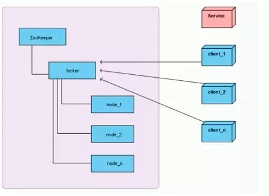
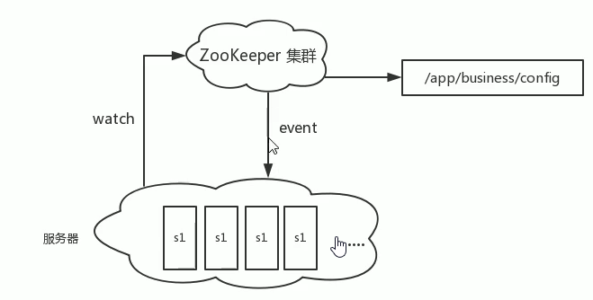
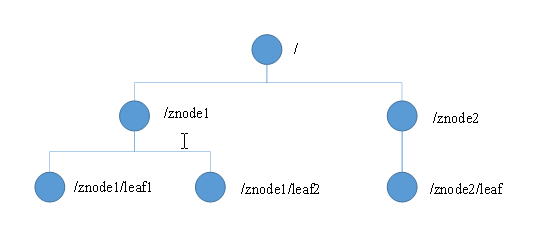
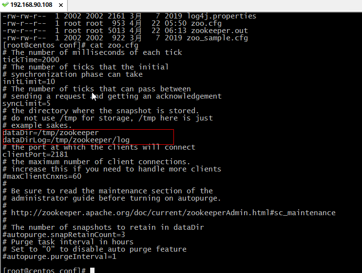
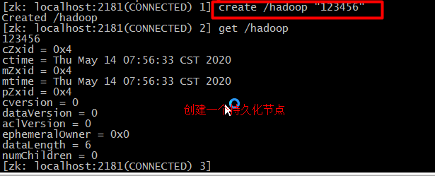
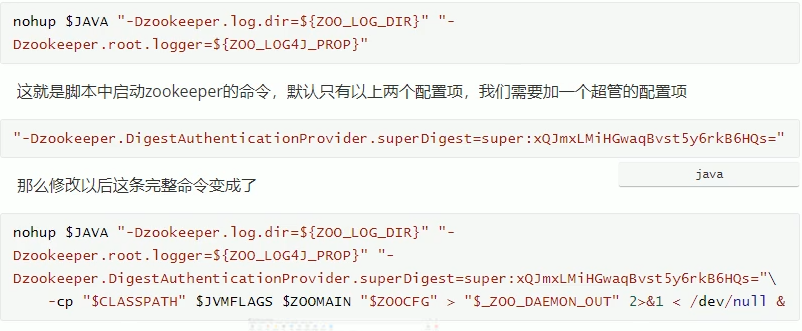
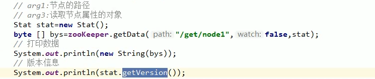
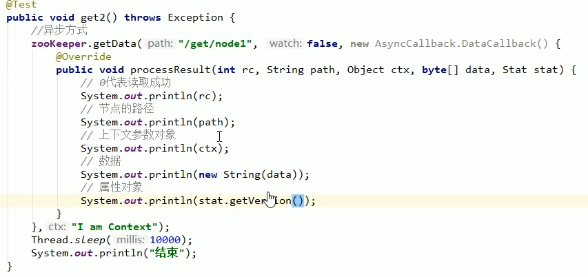
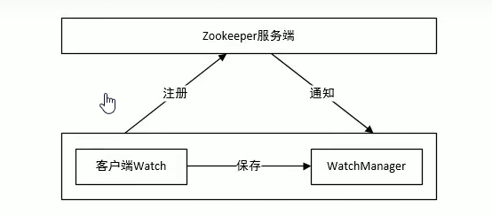
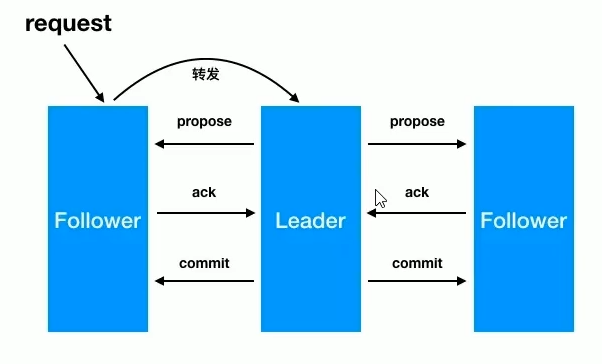

### Zookeeper详细教程

#### 一、Zookeeper介绍

##### 1.1 什么是zookeeper

​		Zookeeper是一个分布式的、高性能的、开源的分布式系统的协调（Coordination）服务，是Google的Chubby一个开源的实现，是Hadoop和Hbase的一个重要的组件。它是一个为分布式应用提供一致性服务的软件。

##### 1.2 zookeeper应用场景

​	zookeeper是一个经典的分布式数据一致性解决方案，致力于为分布式应用提供一个高性能，高可用，且具有严格属性访问控制能力的分布式协调存储服务。

- 维护配置信息
- 分布式锁服务
- 集群管理
- 生成分布式唯一ID

**1、维护配置信息**

​	java编程经常会遇到配置项，比如数据库的url，schema，user和password等。通常这些配置项我们会放置在配置文件中，在将配置文件放置在服务器上当需要更改配置的时，需要去服务器上修改对应的配置信息文件。但是随着分布式系统的兴起，由于许多服务都需要使用到该配置文件，因此有必须保证该配置服务的高可用性和各台服务器上配置数据的一致性。通常会将配置文件不俗在一个集群上，然而一个集群动辄上前台服务器，此时如果在一台一台服务器逐个的修改配置文件将是非常繁琐的一个操作。因此就需要一种服务，能够高效快速且可靠的完成配置项的更待等操作，并能够保证各个配置项在每一台服务器上的数据一致性。

​	zookeeper就可以提供这样一种服务，其使用Zab这种一致性协议来保证一致性。现在有很多开源项目使用zookeeper来维护配置，比如hhase中，客户端就是连接一个zookeeper，获得必要hbase集群的配置信息然后才可以进一步操作。还有开源的消息队列kafka中，也是用zookeeper来维护broker的信息。

**2、分布式锁服务**

​	一个集群是一个分布式系统，有多台服务器组成。为了提高并发度和可靠性，多台服务器运行着同一种服务。当多个服务在运行时就需要协调各服务的进度，有时候需要保证当某个服务在进行某个操作时，其他的服务都不能进行该操作，即对该操作进行加锁，如果当前机器挂掉后，并释放fail over到其他的机器继续执行该服务。



**3、集群管理**

​	一个集群优势会因为各种软硬件故障或者网络故障，出现某种服务器挂掉而被移除集群，而某些服务器加入到集群中的情况，zookeeper会将这些服务器加入/移出的情况下通知给集群汇总的其他正常工作的服务器，以及时调用存储和计算等任务的分配和执行等。此外zookeeper还会对故障的服务器做出诊断并尝试修复。



**4、生成分布式唯一ID**

​	在过去的单库单表型系统中，通常可以使用数据库字段自带的auto_increment属性来自动为每条记录生成一个唯一的ID。但是分库分表后，就无法再依靠数据库的auto_increatment属性来唯一标识一条记录了，此时我们就可以用zookeeper在分布式环境下生成全局唯一ID。做法如下：每一个生成一个新ID时，创建一个持久顺序节点，创建操作返回的节点序号，及微信ID，然后把比自己节点小的删除即可。

##### 1.3 zookeeper的设计目标

​	zookeeper致力于为分布式应用提供一个高性能，高可用，具有严格顺序访问控制能力的分布式协调服务。

**1、高性能**

​		zookeeper将全量数据存储在内存中，并直接服务与客户端的所有非事务请求，尤其适合用于以读为主的应用场景。

**2、高可用**

​		zookeeper一般以集群的范式对外提供服务，一般3-5台机器就可以组成一个可用的zookeeper集群，每一台机器都会在内存中维护当前的服务器状态，并且每台机器之间都相互保持着通信。只要集群中超过一旦的机器都在工作，那么这个集群就能够正常对外服务；

**3、严格访问数据**

​	对于客户端的每一个更新请求，Zookeeper都会分配一个全局唯一的递增编号，这个编号反映了所有事物操作的先后顺序。

#### 二、Zookeeper的数据模型

##### 2.1 zookeeper数据结构

 	Zookeeper数据模型的结构与Unix文件系统很类似，整体上可以看作是一颗树，每一个节点称做一个ZNode。每一个Znode默认能够存储1MB的数据，每个ZNode都可以通过其路径唯一标识。



如何来描述一个ZNode呢？一个znode大体上分为3部分：

- 节点的数据：即znode data(节点path，节点data的关系)就像是java map中(key，value)的关系
- 节点的子节点children
- 节点的状态stat：用来描述当前节点的创建，修改记录，包括cZxid、ctime等。

##### 2.2 zookeeper节点类型 

​	zookeeper中的节点有两种类型，一种是**临时节点**和**永久节点**。节点类型在创建是即被确定，并且不能改变。

- **临时节点** ：该节点的生命周期依赖于创建他们的回话。一旦回话（Session）结束，临时节点将会被自动删除，当然可以手动的进行删除。虽然每个临时的ZNode都会绑定到一个客户端回话，但他们对所有的客户端还是可见的。另外，Zookeeper的临时节点不允许拥有子节点。
- **持久化节点**：该节点的生命周期不依赖于花花，并且只有在客户点显示执行删除操作的时候，他们才能被删除。

##### 2.3 zookeeper 单机安装

​	当前测试系统环境centos7.3

 1.在centos中使用root用户创建zookeeper用户，用户名：zookeeper  密码：zookeeper

```xml
useradd zookeeper
passwd zookeeper
```

2. zookeeper 底层依赖jdk，zookeeper用户登录后，根目录下先进行jdk的安装，jdk使用jdk-11.0.5

```html
//解压jdk
tar -xzvf jdk-11.0.5.tar.gz
```

3.配置jdk环境量

```
//打开/etc/profile文件
# vim /etc/profile
export JAVA_HOME=/root/apps/jdk-11.0.5
export PATH=$PATH:$JAVA_HOME/bin
//执行profile
#source /etc/profile
```

4.zookeeper使用zookeeper-3.4.10.tar.gz,上传并解压

```xml
//解压zookeeper
tar -xzvf zookeeper-3.4.10.tar.gz
```

5.为zookeeper准备配置文件

```xml
//进入conf目录
cd /root/apps/zookeeper/zookeeper-3.4.14/conf
//复制配置文件
cp zoo_sample.cfg zoo.cfg
//zookeeper根目录下新建data目录
mkdir data
// vi 修改配置文件中的dataDir
// 此路径用于存储zookeeper中数据的内存快照，及事务日志文件
dataDir=/root/apps/zookeeper/zookeeper-3.4.14/data
```



6.zookeeper启动命令

```xml
[root@centos ~]# systemctl stop firewalld #关闭防火墙的命令
[root@centos ~]# zkServer.sh start  #启动
[root@centos ~]# zkServer.sh stop   #关闭
[root@centos ~]# zkServer.sh status #查看运行状态

启动客户端：
[root@localhost ~]# zkCli.sh   //启动客户端
[zk: localhost:2181(CONNECTED) 0] ls /  #查看根节点命令
//查看zookeeper进程是否存在
[root@centos zookeeper-3.4.14]# ps -ef | grep zookeeper
```

#### 三、zookeeper常用的Shell命令

##### 3.1 新增节点

```xml
create [-s] [-e] path data   # 其中 -s 为有序节点， -e 临时节点
```

1.创建持久化节点并写入数据：

```xml
create /hadoop  "123456"
```

2.创建持久化有序节，此时创建的节点名为指定节点名+自增序号

```xml
//创建一个持久化节点
[zk: localhost:2181(CONNECTED) 1] create /hadoop "123456"
//通过get命令获取该节点的值
[zk: localhost:2181(CONNECTED) 2] get /hadoop
//创建一个有序的节点
[zk: localhost:2181(CONNECTED) 4] create -s /a "aa"
Created /a0000000001
//获取路径的值
[zk: localhost:2181(CONNECTED) 5] get /a0000000001
aa

//创建临时节点并获取值
[zk: localhost:2181(CONNECTED) 1] create -e /tmp "tmp"
Created /tmp
[zk: localhost:2181(CONNECTED) 2] get /tmp
tmp
```



3.创建临时节点，临时节点会在回话过期后被删除;

```
[zk: localhost:2181(CONNECTED) 1] create -e /tmp "tmp"
Created /tmp

```

4.创建临时有序节点，临时节点会在会话过期后被删除：

    ```xml
[zk: localhost:2181(CONNECTED) 1] create -s -e /tmp "tmp"
Created /tmp000000001
    ```

##### 3.2 更新节点

```xml
//使用set命令来更新hadoop节点
[zk: localhost:2181(CONNECTED) 1] set /hadoop "345"
//根据版本号来更新节点
[zk: localhost:2181(CONNECTED) 1] set /hadoop "345" 2

```

​	也可以基于版本号来进行更改，此时类似于乐观锁机制，当你传入的数据版本号(dataVersion)和当前节点的数据版本号不符合时，zookeeper会拒绝本次修改：

##### 3.3 删除节点

1.删除节点的命令如下

```xml
delete path [version]
```

和更新节点数据一样，也可以传入版本号，当你传入的数据版本号(dataVersion)和当前节点的数据版本号不符合时，zookeeper不会执行删除操作。

```xml
//根据版本号来删除节点
[zk: localhost:2181(CONNECTED) 1] set /hadoop "345" 2
```

要想删除某个节点及其所有后代节点，可以使用递归删除，**命令为 rmr path**。

##### 3.4 查看节点

```xml
get path 
[zk: localhost:2181(CONNECTED) 1] get /hadoop 
```


```xml
[zk: localhost:2181(CONNECTED) 0] create /hadoop2 "hadoop"
Created /hadoop2
[zk: localhost:2181(CONNECTED) 1] get /hadoop2
hadoop
cZxid = 0xb
ctime = Thu May 14 09:06:29 CST 2020
mZxid = 0xb
mtime = Thu May 14 09:06:29 CST 2020
pZxid = 0xb
cversion = 0
dataVersion = 0
aclVersion = 0
ephemeralOwner = 0x0
dataLength = 6
numChildren = 0
[zk: localhost:2181(CONNECTED) 2]
```

​	节点各个属性如下表。起哄一个重要的概念是Zxid(ZooKeeper Transaction Id)，ZooKeeper节点的每一个更改都具唯一的Zxid，如果Zxid1小于Zxid2,则Zxid1的更改发生在Zxid2更改之前。

| 状态属性       | 节点说明                                                     |
| -------------- | ------------------------------------------------------------ |
| cZxid          | 数据节点创建时的事务ID                                       |
| ctime          | 数据节点创建世的时间                                         |
| mZxid          | 数据节点最后一个更新是的事务ID                               |
| mtime          | 数据节点最后一个跟新时的时间                                 |
| pZxid          | 数据节点的子节点最后一个被修改时的事务ID                     |
| cversion       | 子节点的更改次数                                             |
| dataVerion     | 节点数据的更改次数                                           |
| aclVersion     | 节点ACL的更改次数                                            |
| ephemeralOwner | 如果节点是临时节点，则表示创建该节点的会话的SeeesionID;如果是持久节点，则该属性值为0 |
| dataLength     | 数据内容的长度                                               |
| numChildren    | 数据节点当前的子节点个数                                     |

##### 3.5 查看节点状态

​	可以使用stat命令查看节点状态，它的返回值和get命令类似，但不会返回节点数据

```xml
//使用stat命令来查看节点状态
[zk: localhost:2181(CONNECTED) 0] stat /hadoop
cZxid = 0x4
ctime = Thu May 14 07:56:33 CST 2020
mZxid = 0x4
mtime = Thu May 14 07:56:33 CST 2020
pZxid = 0x4
cversion = 0
dataVersion = 0
aclVersion = 0
ephemeralOwner = 0x0
dataLength = 6
numChildren = 0
[zk: localhost:2181(CONNECTED) 1]
```

#####  3.6 查看节点列表

​	查看节点列表有ls path 和ls2 path 两个命令，后者是前者的增强。不仅可以查看指定路径下的所有节点，还可以查看当前几点的信息

```xml
[zk: localhost:2181(CONNECTED) 5] ls /
[a0000000001, hadoop, zookeeper, tmp, hadoop2]
[zk: localhost:2181(CONNECTED) 6] ls2 /
[a0000000001, hadoop, zookeeper, tmp, hadoop2]
cZxid = 0x0
ctime = Thu Jan 01 08:00:00 CST 1970
mZxid = 0x0
mtime = Thu Jan 01 08:00:00 CST 1970
pZxid = 0xb
cversion = 3
dataVersion = 0
aclVersion = 0
ephemeralOwner = 0x0
dataLength = 0
numChildren = 5
[zk: localhost:2181(CONNECTED) 7] 
```

##### 3.7 监听器get path [watch]

​	使用get path [watch] 注册的监听器能够在节点内容发生改变的时候，向客户点发出通知。需要注意的是zookeeper的触发器是一次性的(One-time trigger)，触发一次后就会立即失效。

```xml
[zk: localhost:2181(CONNECTED) 8] get /hadoop watch
123456
cZxid = 0x4
ctime = Thu May 14 07:56:33 CST 2020
mZxid = 0x4
mtime = Thu May 14 07:56:33 CST 2020
pZxid = 0x4
cversion = 0
dataVersion = 0
aclVersion = 0
ephemeralOwner = 0x0
dataLength = 6
numChildren = 0
[zk: localhost:2181(CONNECTED) 9] 
WATCHER::

WatchedEvent state:SyncConnected type:NodeDataChanged path:/hadoop
```

##### 3.8 监听器stat path [watch]

​	使用stat path [watch] 注册的监听器能够在节点抓哪个台发生改变的时候，向客户点发出通知。

```xml
[zk: localhost:2181(CONNECTED) 1] stat /hadoop watch
cZxid = 0x4
ctime = Thu May 14 07:56:33 CST 2020
mZxid = 0xf
mtime = Thu May 14 10:01:04 CST 2020
pZxid = 0x4
cversion = 0
dataVersion = 1
aclVersion = 0
ephemeralOwner = 0x0
dataLength = 6
numChildren = 0
[zk: localhost:2181(CONNECTED) 2] 
WATCHER::

WatchedEvent state:SyncConnected type:NodeDataChanged path:/hadoop
```

##### 4.9 监听器ls\ls2 path [watch]

​	使用 ls path [watch] 或者 ls2 path [watch] 注册的监听器能够监听该节点下所有子节点的增加和删除操作。

#### 四、zookeeper权限控制

##### 4.1 概述

​	zookeeper类似于文件系统，client可以创建节点，更新节点，删除节点，那么如何做到节点的权限的控制呢？zookeeper的access control list 访问控制列表可以自耦到这一点。

​	acl权限控制，使用scheme：id：permission来表示，主要涵盖3个方面：

- 权限模式(scheme)：授权的策略

- 授权对象(id)：授权的对象

- 权限(permission)：授予的权限

  **其特性如下：**

- zookeeper的权限控制是基于每个znode节点的，需要对每个节点设置权限
- 每个znode支持设置多种权限控制方案和多个权限
- 子节点不会继承父节点的权限，客户点无权访问某个节点，但可能可以访问他的子节点

```java
setAcl /test2 ip:192.168.60.130:rewda //将节点权限设置为Ip:192.168.60.130的客户端可以对节点进行增、删、该、查、权限管理
```

##### 4.2 权限模式

​	采用何种方式授权

| 方案   | 描述                                                  |
| :----- | ----------------------------------------------------- |
| world  | 只有一个用户：anyone，代表登录zooleeper所有人（默认） |
| ip     | 对客户端使用ip地址认证                                |
| auth   | 使用已添加认证的用户认证                              |
| digest | 使用“用户名：密码”方式认证                            |

##### 4.3 授权的对象

​	给谁授权

​	授权对象ID是指，权限赋予的实体例如：ip地址或用户。

##### 4.4 授予的权限

​	授予什么权限

​	create、delete、read、writer、admin也就是增、删、改、查、管理权限，这5中权限简写为cdrwa、注意：这5中权限中，delete是指对子节点的删除权限，其他4种权限值对自身节点的权限操作。

| 权限   | ACL简写 | 描述                             |
| ------ | ------- | -------------------------------- |
| create | c       | 可以创建子节点                   |
| delete | d       | 可以删除子节点(仅下一级节点)     |
| read   | r       | 可以读取节点数据及显示子节点列表 |
| write  | w       | 可以设置节点数据                 |
| admin  | a       | 可以设置节点访问控制列表权限     |

##### 4.5 授权的相关命令

| 命令    | 使用方式              | 描述         |
| ------- | --------------------- | ------------ |
| getAcl  | getAcl<path>          | 读取ACL权限  |
| setAcl  | setAcl<path><acl>     | 设置ACL权限  |
| addauth | addauth<scheme><auth> | 添加认证用户 |

##### 4.6 案例

- world授权模式：

  命令

  ```java
  setAcl <path> world:anyone:<acl>
  setAcl /hadoop world:anyone:cdrwa
  ```

  案例

  ```xml
  [zk: localhost:2181(CONNECTED) 2] getAcl /hadoop
  'world,'anyone   #world方式对所有用户进行授权
  : cdrwa          #增、删、改、查、管理
  [zk: localhost:2181(CONNECTED) 3] 
  ```

- IP 授权模式

  命令

  ```java
  #需要两台机器来进行连接 192.168.60.129  192.168.60.130 
  #使用 192.168.60.129  登录zookeeper
  zkCli.sh -server 192.168.60.130
  #使用本机  192.168.60.130 zookeeper
  zkCli.sh -server 192.168.60.130    
  ```

  

- Auth授权模式

  命令

  ```xml
  addauth digest <user>:<password> #添加认证用户
  setAcl <path>auth:<user>:<acl>
  ```

  案例

```xml
[zk: localhost:2181(CONNECTED) 0] create /hadoop3 "hadoop3"
Created /hadoop3
[zk: localhost:2181(CONNECTED) 1] getAcl /hadoop3
'world,'anyone
: cdrwa
[zk: localhost:2181(CONNECTED) 2] addauth digest tyx:123
[zk: localhost:2181(CONNECTED) 3] setAcl /hadoop3 auth:tyx:cdrwa
cZxid = 0x16
ctime = Thu May 14 20:29:34 CST 2020
mZxid = 0x16
mtime = Thu May 14 20:29:34 CST 2020
pZxid = 0x16
cversion = 0
dataVersion = 0
aclVersion = 1
ephemeralOwner = 0x0
dataLength = 7
numChildren = 0
[zk: localhost:2181(CONNECTED) 7] getAcl /hadoop3
'digest,'tyx:nSk0WYb+XoISHNhIQiQ1BGsZHjE=
: cdrwa
[zk: localhost:2181(CONNECTED) 8]
```

- Digest 授权模式

  命令

  ```xml
  setAcl <path> digest:<user>:<password>:<acl>
  ```

  这里的密码是经过SHA1及BASE64处理的密文，在SHEEL中可以通过命令计算：

  ```xml
  echo -n <user>:<password> | openssl dgst -binary -sha1 | openssl base64
  ```

  先来计算一个密文

  ```xml
  echo -n tyx:123 | openssl dgst -binary -sha1 | openssl base64
  #得到的密文
  [root@centos zookeeper-3.4.14]# echo -n tyx:123 | openssl dgst -binary -sha1 | openssl base64
  nSk0WYb+XoISHNhIQiQ1BGsZHjE=
  ```

  案例：

  ```xml
  
  [zk: localhost:2181(CONNECTED) 8] create /hadoop4 "hadoop4"
  Created /hadoop4
  [zk: localhost:2181(CONNECTED) 10] getAcl /hadoop4
  'world,'anyone
  : cdrwa
  //使用digest进行授权
  [zk: localhost:2181(CONNECTED) 11] setAcl /hadoop4 digest:tyx:nSk0WYb+XoISHNhIQiQ1BGsZHjE=:cdrwa
  
  //该节点的权限
  [zk: localhost:2181(CONNECTED) 13] getAcl /hadoop4
  'digest,'tyx:nSk0WYb+XoISHNhIQiQ1BGsZHjE=
  : cdrwa
  //没有权限
  [zk: localhost:2181(CONNECTED) 0] get /hadoop4
  Authentication is not valid : /hadoop4
  //添加授权用户
  [zk: localhost:2181(CONNECTED) 1] addauth digest tyx:123
  [zk: localhost:2181(CONNECTED) 2] get /hadoop4
  hadoop4
  cZxid = 0x19
  ctime = Thu May 14 21:12:46 CST 2020
  mZxid = 0x19
  mtime = Thu May 14 21:12:46 CST 2020
  pZxid = 0x19
  cversion = 0
  dataVersion = 0
  aclVersion = 1
  ephemeralOwner = 0x0
  dataLength = 7
  numChildren = 0
  ```

  

- 多种密室授权：

  同一个节点可以同时使用多种模式授权

  ```xml
  [zk: localhost:2181(CONNECTED) 8] create /hadoop4 "hadoop4"
  Created /hadoop4
  //添加认证用户
  [zk: localhost:2181(CONNECTED) 8] addauth digest itcast:123456
  [zk: localhost:2181(CONNECTED) 8] setAcl /hadoop4 ip:192.168.60.129:cdrwa,auth:tyx:123:cdrwa,digest:tyx:nSk0WYb+XoISHNhIQiQ1BGsZHjE=:cdrwa
  ```

  

##### 4.7 acl 超级管理员

zookeeper的权限管理模式有一种叫做super，该模式提供一个超管，可以方阿斌的访问任何权限的节点

假设这个超管是：super：admin，需要先为超管生成密码的密文

```xml
echo -n super:admin | openssl dgst -binary -sha1 | openssl base64
```

那么打开zookeeper目录下的/bin/zkServer.sh 服务器脚本，找到如下一行：



之后启动zookeeper，输入如下的命令添加权限

```xml
addauth digest super:admin  #添加认证用户
```

#### 五、zookeeper javaAPI

​	znode是zookeeper集合的核心组件，zookeeper API提供了一小组方法使用zookeeper集合来操作znode所有的细节。

客户端用该遵循以下步骤，与zookeeper服务器进行清洗和干净的交互。

- 连接到zookeeper服务器。zookeeper服务器为客户端分配回话ID。
- 定期向服务器发送心跳。否则，zookeeper服务器将过期回话ID，客户端需要重新连接。
- 只要回话ID处于活动状态，就可以获取/设置znode。
- 所有任务完成后，断开与zookeeper服务器的连接。如果客户端长时间不活动，则zookeeper服务器将自动断开客户端。

##### 5.1 连接到zookeeper

```xml
Zookeeper(String connectionString,int sessionTimeout,Watcher watcher)
```

- connectionString -zookeeper 主机
- sessionTimeout - 回话超时（一毫秒为单位）
- watcher -实现“监视器”对象。zookeeper集合通过监视器对象返回连接状态。

```java
package com.example.springcloud.controller;

import org.apache.zookeeper.WatchedEvent;
import org.apache.zookeeper.Watcher;
import org.apache.zookeeper.ZooKeeper;

import java.io.IOException;
import java.util.concurrent.CountDownLatch;

/**
 * @author papi
 * @data 2020/5/1
 */
public class ZookeeperTest {

    public static void main(String[] args) {
        try {
            CountDownLatch countDownLatch = new CountDownLatch(1);
            //arg1：服务器和端口号
            //arg2: 客户端和服务器之间的会话超时时间
            //arg3: 监视器对象
            ZooKeeper zooKeeper = new ZooKeeper("192.168.90.108:2181", 5000, new Watcher() {
                @Override
                public void process(WatchedEvent watchedEvent) {
                    if (watchedEvent.getState() == Event.KeeperState.SyncConnected) {
                        System.out.println("连接成功");
                        //通知主线不要去等待了
                        countDownLatch.countDown();
                    }
                }
            });
            //主线程阻塞等待连接对象
            countDownLatch.await();
            //获取zookeeper的session会话编号
            System.out.println(zooKeeper.getSessionId());
            zooKeeper.close();
        } catch (Exception e) {
            e.printStackTrace();
        }
    }

}

```

##### 5.2 新增节点

```xml
//同步方式
create(String path, byte[] data, List<Acl> acl, CreateMode createMode)
//异步方式
create(String path, byte[] data, List<Acl> acl, CreateMode createMode, AsyncCallback.StringCallback callBack,Object ctx)
```

- **path** -znode路径。例如，/node1  /node1/node11
- **data** -要存储的指定znode路径中的数据
- **acl** - 要创建的节点的访问控制列表。zookeeper API提供了一个静态接口**ZooDefs.Ids** 来获取一些基本的acl列表。例如,Zoodefs.Ids.OPEN_ACL_USERAFE 返回发开znode的acl列表。
- **createMode** -节点的类型，这是一个枚举。
- **callBack** -异步回调接口

```java
package com.example.springcloud.controller;

import org.apache.zookeeper.*;
import org.apache.zookeeper.data.ACL;
import org.apache.zookeeper.data.Id;

import java.util.ArrayList;
import java.util.List;
import java.util.concurrent.CountDownLatch;

/**
 * @author papi
 * @data 2020/5/15
 */
public class ZookeeperTest {

    public static void main(String[] args) {
        try {
            CountDownLatch countDownLatch = new CountDownLatch(1);
            //arg1：服务器和端口号
            //arg2: 客户端和服务器之间的会话超时时间
            //arg3: 监视器对象
            ZooKeeper zooKeeper = new ZooKeeper("192.168.90.108:2181", 5000, new Watcher() {
                @Override
                public void process(WatchedEvent watchedEvent) {
                    if (watchedEvent.getState() == Event.KeeperState.SyncConnected) {
                        System.out.println("连接成功");
                        //通知主线不要去等待了
                        countDownLatch.countDown();
                    }
                }
            });
            //主线程阻塞等待连接对象
            countDownLatch.await();
            //获取zookeeper的session会话编号
            System.out.println(zooKeeper.getSessionId());
            zooKeeper.create("/hadoop7","hadoop7".getBytes(),ZooDefs.Ids.OPEN_ACL_UNSAFE,CreateMode.PERSISTENT);
            //ZooDefs.Ids.READ_ACL_UNSAFE world:anyone:r
            zooKeeper.create("/hadoop8", "hadoop8".getBytes(), ZooDefs.Ids.READ_ACL_UNSAFE, CreateMode.PERSISTENT );
            //world 模式
            //权限列表
            List<ACL> list = new ArrayList<>();
            Id id = new Id();
            id.setScheme("world");
            id.setId("anyone");
            list.add(new ACL(ZooDefs.Perms.READ, id));
            list.add(new ACL(ZooDefs.Perms.WRITE, id));
            zooKeeper.create("/hadoop9", "hadoop9".getBytes(), list, CreateMode.PERSISTENT );

            //IP授权模式
            List<ACL> acls = new ArrayList<>();
            //授权模式和授权对象
            Id id1 = new Id("ip", "192.168.60.130");
            acls.add(new ACL(ZooDefs.Perms.ALL, id1));
            zooKeeper.create("/hadoop10", "hadoop10".getBytes(), acls, CreateMode.PERSISTENT);

            //使用auth模式进行授权
            zooKeeper.addAuthInfo("digest","tyx:123".getBytes());
            zooKeeper.create("/hadoop11", "hadoop11".getBytes(), ZooDefs.Ids.CREATOR_ALL_ACL,CreateMode.PERSISTENT);

            //使用auth模式进行授权，只读的模式
            zooKeeper.addAuthInfo("digest","tyx:123".getBytes());
            List<ACL> acls2 = new ArrayList<>();
            Id id2 = new Id("auth", "tyx");
            acls.add(new ACL(ZooDefs.Perms.READ, id1));
            zooKeeper.create("/hadoop12", "hadoop12".getBytes(), acls2,CreateMode.PERSISTENT);
            //使用digest模式进行授权
            List<ACL> acls3 = new ArrayList<>();
            Id id3 = new Id("digest", "tyx:adkalfjasncasaKJHG=");
            acls.add(new ACL(ZooDefs.Perms.ALL, id3));
            zooKeeper.create("/hadoop13", "hadoop13".getBytes(), acls3,CreateMode.PERSISTENT);

            //持久化有序节点
            zooKeeper.create("/hadoop14", "hadoop14".getBytes(), ZooDefs.Ids.CREATOR_ALL_ACL,CreateMode.PERSISTENT_SEQUENTIAL);

            //临时节点
            zooKeeper.create("/hadoop15", "hadoop15".getBytes(), ZooDefs.Ids.CREATOR_ALL_ACL,CreateMode.EPHEMERAL);
            //临时顺序节点
            zooKeeper.create("/hadoop16", "hadoop16".getBytes(), ZooDefs.Ids.CREATOR_ALL_ACL,CreateMode.EPHEMERAL_SEQUENTIAL);

            //异步创建节点
            zooKeeper.create("/hadoop16", "hadoop16".getBytes(), ZooDefs.Ids.CREATOR_ALL_ACL, CreateMode.PERSISTENT, new AsyncCallback.StringCallback() {
                @Override
                public void processResult(int i, String s, Object o, String s1) {
                    //0代表创建成功
                    System.out.println(i);
                    //节点的路径
                    System.out.println(s);
                    //节点的路径
                    System.out.println(o);
                    //上下文参数
                    System.out.println(s1);
                }
            },"I am context");
            zooKeeper.close();
        } catch (Exception e) {
            e.printStackTrace();
        }
    }

}

```

##### 5.3 更新节点

```xml
//同步方式
setData(String path,byte[] data, int version)
//异步方式
setData(String path, byte[] data, int version, AsyncCallback.StatCallback callBack, Object ctx)
```

- **path** -znode路径
- **data** -要存储在指定znode路径中的数据。
- **version** -znode的当前版本号。每当数据更改时，Zookeeper会更新znode的版本号。
- **callBack** -异步回调接口
- **ctx** 传递上下文参数

##### 5.4 删除节点

```xml
//同步方式
delete(String path, int version)
//异步方式
delete(String path, int version, AsyncCallback.VoidCallback callBack, Object ctx)
```

- **path** -znode路径
- **version** -znode的当前版本
- **callBack** -异步回调接口
- **ctx** -传递上下文参数

案例

```java
//arg1：删除节点的节点路径
//arg2：数据版本信息 -1代表删除节点时不考虑节点版本信息
zooKeeper.delete("/delete/node1", -1);
delete(String path, int version, AsyncCallback.VoidCallback callBack, Object ctx)
```

##### 5.5 查看节点

```xml
//同步方式
getData(String path, boolean b, Stat stat)
//异步方式
getData(String path, boolean b, AsyncCallback.DataCallback callBack, Object ctx)
```

- **path** -znode路径
- **b** -是否使用连接对象中注册的监视器。
- **stat** -返回znode的元数据。
- **callBack** -异步回调接口
- **ctx** -传递上下文参数



//异步方式获取



##### 5.6 查看子节点

```xml
//同步方式
getChildren(String path, boolean b)
//异步方式
getChildren(String path, boolean b, AsyncCallback.ChildrenCallback callBack, Object ctx)
```

- **path** -Znode路径。
- **b** -是使用连接对象中注册的监视器。
- **callBack** -异步回调接口。
- **ctx** -传递上下文参数。

```java
//同步方式
List<String> list = zookeeper.getChildren("/get",false);
for(String str : list){
    System.out.println(str);
}

//异步方式
zookeeper.getChildren("/get", false, new AsyncCallback.ChildrenCallback(){
    @Override
    public void processResult(int rc, String path,Object ctx, List<String> children){
        //0代表读取成功
        System.out.println(rc);
        //子节点路径
        System.out.println(path);
        //上下文参数对象
        System.out.println(ctx);
        //子节点信息
        for(String str : children){
    		System.out.println(str);
		}
    }
},"I am Context")
 Thread.sleep(1000);   
```

##### 6.7 检查节点是否存在

```java
//同步方法
exists(String path, boolean b);
//异步方法
exists(String path, boolean b, AsyncCallback.StatCallBack, Object ctx)
```

- **path** -znode路径
- **b** -是否使用连接对象中注册的监视器
- **callBack** -异步回调接口
- **ctx** -上下文参数

#### 六、zookeeper事件监听机制

 ##### 6.1 watcher概念

​	zookeeper提供了数据的发布/订阅功能，对个订阅者可同时监听某一特定主题对象，当该主题对象的自身状态发生变化时(例如节点内容改变，节点下的子节点列表改变等)，会实时，主动通知所有订阅者；

​	zookeeper采用了watcher机制实现数据的发布/订阅功能。该机制在被订阅对象发生变化时会异步通知客户端，因此客户端不必在Watcher注册后轮询阻塞，从而减轻了客户点压力。

​	watcher机制实际上与观察者密室类似，也可以看作是一种观察者密室在分布式场景下的实现方式。

##### 6.2 wathcer架构

​	Watcher实现由三个部分组成：

- Zookeeper服务端
- Zookeeper客户端
- 客户端的ZKWatchManager对象

​	客户端首先将Watcher注册到服务端，同时将Watcher对象保存到客户端的Watch管理器中。当Zookeeper服务端监听的数据状态发生变化时，服务端会主动同时客户端，接着客户端的Watch管理器会触发相关Watcher来回调相应处理逻辑，从而完成整体的数据发布/订阅流程。



##### 6.3 wahcher特性

| 特性           | 说明                                                         |
| -------------- | ------------------------------------------------------------ |
| 一次性         | wathcer是一次性的，一旦被触发就会移除，再次使用时需要重新注册 |
| 客户端顺序回调 | watcher回调是顺序串行化执行的，只有回调后客户端才能看到最新的数据状态。一个watcher回调逻辑不用太多，以免影响别的watcher执行 |
| 轻量级         | wathcerEvent是最小的通信单元，结构上只包含通知状态，事件类型和节点路径，并不会告诉数据节点变化前后的具体内容； |
| 时效性         | watcher只有在当前session彻底失效时才会无效，若session有效期内快速重连成功。则wacher依然存在，然可接收到通知； |

##### 6.4 watcher接口设计

- **Wacher通知状态**

​       KeeperState是客户端与服务daunt连接状态发生变化时对应的通知类型。路径为org.apache.zookeeper.Watcher.Event.KeeperState，是一个枚举类，其枚举属性如下：

| 枚举属性      | 说明                     |
| ------------- | ------------------------ |
| SyncConnected | 客户端与服务器正常连接时 |
| Disconnected  | 客户端与服务器断开连接时 |
| Expired       | 回话session失效时        |
| AuthFailed    | 身份认证失败时           |


- **Watcher事件类型(EventType)**

  EventType是数据节点(znode)发生变化时对应的通知类型。EventType变化时KeeperState永远处于SyncConnected通知状态下；当KeeperState发生变化时，EventType永远为None。其路径为org.apache.zookeeper.Watcher.Event.EventType,是一个枚举类，枚举类属性如下：

| 枚举属性            | 说明                                                      |
| ------------------- | --------------------------------------------------------- |
| None                | 无                                                        |
| NodeCreated         | Watcher监听的数据节点被创建时                             |
| NodeDeleted         | Watcher监听的数据节点被删除时                             |
| NodeDataChanged     | Watcher监听的数据节点内容发生变更时(无论内容数据是否变化) |
| NodeChildrenChanged | Watcher监听的数据节点的子节点列表发生变更时               |

##### 6.5 捕获相应的事件

​	上面讲到的zookeeper客户端连接的状态和zookeeper对znode节点监听的事件类型，下面我们来将如何建立zookeeper的watcher监听。在zookeeper中采用zk.getChildren(path,watch)、zk.exists(path,watch)，zk.getData(path,watcher,stat)这样的方式为某个znode注册监听。

下表以node-x节点为例，说明调用的注册方法和监听事件间的关系：

| 注册方式                          | Created | ChildrenChanged | Changed | Deleted |
| --------------------------------- | ------- | --------------- | ------- | ------- |
| zk.exists("/node-x",watcher)      | 可监控  |                 | 可监控  | 可监控  |
| zk.getData("/node-x",watcher)     |         |                 | 可监控  | 可监控  |
| zk.getChildren("/node-x",watcher) |         | 可监控          |         | 可监控  |

##### 6.5 注册watcher的方法

**客户端与服务器的连接状态** 

```xml
KeeperState : 通知状态
SyncConnected：客户端与服务器正常连接时
Disconnected:客户端与服务器断开连接时
Expired:回话session失效时
AuthFailed：身份认证失败时

事件类型为：None
```

##### 6.6 查看节点

``` java
//使用连接对象的监听器
getData(String path, boolean b, Stat stat)
//滴定仪监视器
getData(String path, boolean b, Stat stat)
//NodeDeleted：节点删除
//NodeDataChanged:节点内容发生变化
```

- **path** -znode路径。
- **b** -是否使用连接对象中注册的监听器。
- **w** -监视器对象。
- **stat** - 返回znode的元数据

#### 七、配置中心案例

​		工作中有这样一个场景：数据库用户名和密码信息放在一个配置文件中，应用读取该配置文件，配置文件信息放入缓存。

​		若数据库的用户名和密码改变时候，还需要重新加载缓存，比较麻烦，通过Zookeeper可以轻松完成，当数据库发生变化时自动完成缓存同步。

设计思路：

1. 连接zookeeper服务器
2. 读取zookeeper中的配置信息，注册watcher监听器，存入本地变量
3. 当zookeeper中的配置信息发生变化时，通过watcher的回调方法捕获数据变化事件。
4. 重新获取配置信息。

#### 八、生成分布式唯一ID

​		在过去的单库单表型系统中，通常可以使用数据库字段自带的auto_increment属性来自动为每条记录生成一个唯一的ID。但是分库分表后，就无法再依靠数据库的auto_increment属性唯一标识一条记录了。此时我们就可以用zookeeper在分布式环境下生成全局唯一ID。

设计思路：

1. 连接zookeeper服务器
2. 指定路径下生成临时有序节点
3. 取序号及为分布式环境下的唯一ID

#### 九、分布式锁

​		分布式锁有多重实现方式，比如通过数据库，redis都可以实现。作为分布式协同工具Zookeeper，当然也有者标准的实现方式。下面介绍在zookeeper中如何实现排它锁。

设计思路:

1、每个客户端往/Locks下创建临时有序节点/Locks/Lock_，创建成功后/Locks下面会有每个客户端对应的节点。如/Locks/Lock_0000001

2、客户端取得/Locks下子节点，并进行排序，判断排在最前面的是否为自己，如果自己的锁节点在第一位，代表获取锁成功。

3、如果自己的锁节点不在第一位，则监听自己前一位的锁节点。如果自己锁节点Lock_000002,那么则监听Lock_0000001

4、当前一位锁节点（Lock_000000001）对应的客户端执行完成，释放了锁，将会触发监听客户端（Lock_000002）的逻辑

5、监听客户端重新执行第2步逻辑，判断自己是否获得了锁；

#### 十、zookeeper集群搭建

​		单机环境下，jdk、zookeeper安装完毕，基于一台虚拟机，进行zookeeper伪集群搭建，zookeeper集群中包含3个节点，节点对外提供服务端口号分别为2181,2182,2183

##### 10.1配置zookeeper服务器文件

​	 1、基于zookeeper-3.4.14复制三分zookeeper安装好的服务器文件，目录名称分别为zookeeper2181、zookeeper2182、zookeeper2183

```xml
cp -r zookeeper-3.4.14 zookeeper2181
cp -r zookeeper-3.4.14 zookeeper2182
cp -r zookeeper-3.4.14 zookeeper2183
```

2.修改zookeeper2181服务器对应配置文件

```java
#服务器对应端口号
clientPort=2181
#数据快照文件所在路径
dataDir=/home/zookeeper/zookeeper2181/data
#集群配置信息
	#server.A=B:C:D
	#A:是一个数字，表示这个是服务器的编号
	#B:是这个服务器的ip地址
	#C:Zookeeper服务器之间的通信端口号
	#D:Leader选举的端口
server.1=192.168.60.130:2287:3387
server.1=192.168.60.130:2288:3388
server.1=192.168.60.130:2289:3389
```

3. 在上一步dataDir指定的目录下，创建myid文件，然后在该文件添加上一步server配置对应A数字。

```java
#zookeeper2181对应的数字为1
#/home/zookeeper/zookeeper2181/data目录下执行命令
echo "1" > myid
```

4.zookeeper2182  、zookeeper2183参照2，3不找进行相应配置

5.分别启动三台服务器，检验集群状态

​	登录命令：

```java
./zkCli.sh -server 192.168.60.130:2181
./zkCli.sh -server 192.168.60.130:2182
./zkCli.sh -server 192.168.60.130:2183
```

##### 10.2 一致性协议：zab协议

​	zab协议的全称是**Zookeeper Atomic Broadcast** (zookeeper原子广播)。zookeeper是通过zab协议来保证分布式事务的最终一致性

​	基于zab协议，zookeeper集群中的角色主要有一下三类，如下表所示：

| 角色            | 描述                                                         |
| --------------- | ------------------------------------------------------------ |
| 领导者(leader)  | 领导者负责进行投票的发起和决议，更新系统状态                 |
| 学习者(Learner) | Follower用于接受客户请求并向客户端返回结果，在选主过程中参与投票 |
|                 | ObServer可以接受客户端连接，将写请求转发给leader节点。但是ObServer不参加投票过程，只同步leader的状态。ObServer的目的是为了扩展系统，提高读取速度 |
| 客户端(Client)  | 请求发起方。                                                 |

zab广播模式工作原理，通过类似两阶段提交协议的方式解决数据一致性：



1. leader从客户端收到一个写请求
2. leader生成一个新的事务并未这个事务生成一个唯一的ZXID
3. leader将这个事务提议(propose)发送给所有的follows节点
4. follower节点将收到的事务请求加入到历史队列(history queue)中，并发送ack给leader
5. 当leader收到大多数follower(半数以上节点)的ack消息，leader会发送commit请求
6. 当follower收到commit请求时，从历史队列中将事务请求commit

##### 10.3 zookeeper的leader选举

​	**1、服务器状态**

​	  **looking**：寻找leader状态。当服务器处于该状态时，它会认为当前集群中没有leader,因此需要进入leader选举状态。

​     **leading**：领导者状态。表明当前服务器角色是leader。

 	**following**：跟随者状态。表明当前服务器角色是follower。

​	**observing**：观察者状态。表明当前服务器角色是observer。

**2、服务器启动时期的leader选举**

​	在集群初始化阶段，当有一台服务器server启动时，其单独无法进行完成leader选举，当第二太服务器server2启动时，此时两台机器可以相互通信，每台机器都视图zhaodaoleader。于是进入leader选举过程。选举过程如下：

1. 每个server发出一个投票。由于是初始情况，server1和server2都会将自己作为leader服务器进行投票，没投票会包含所推举的服务器的myid和zxid，使用(myid，zxid（**事务ID**）)来表示，此时server1的投票为(1,0),server2的投票为(2,0)，然后各自将这个投票发给集群中其他机器。
2. 集群中的每一台服务器接受来自集群中各个服务器的投票。
3. 处理投票。针对每一个投票，服务器都需要将别人的投票和自己的投票进行pk，pk规则如下
   - 优先检查zxid(**事务的编号**)。zxid比较大的服务器优先为leader。
   - 如果zxid相同，那么就比较myid(**服务器的编号**)。myid比较大的服务器作为leader服务器。

​          对于Server1而言，它的投票是(1,0)，接受Server2的投票为(2,0)，首先会比较两者的zxid，均为0，在比较myid，此时server2的myid最大，于是更新自己的投票为(2,0)，然后重新投票，对于server2而言，其无须更新自己的投票，只是再次向集群中所有机器发出上一次的投票信息即可。

 	4.  统计投票。每次投票后，服务器都会统计投票信息，判断是否已经有过半机器接受到相同的投票信息，对于server1、server2而言，都统计出集群中已经有两台机器接受了(2,0)的投票信息，此时便认为已经选出了leader。
 	5.  改变服务状态。一旦确定了leader，每个服务器就会更新自己的状态，如果是follower，那么久变更为following，如果是leader，就变更为leading。

##### 10.4 服务器运行时期的Leader选举【zxid：事务ID】

​		在zookeeper运行期间，leader与非leader服务器各司其职，即便当有非leader服务器宕机或新加入，此时也不会影响leader，但是一旦leader服务器挂了，那么这个集群将暂停对外服务，进入新一轮leader选举，其过程和启动时期的Leader选举过程基本一致。

​		假设正在运行的server1、server2、server3三台服务器，当前leader是server2，若某一时刻leader挂了、此时开始Leader选举。选举过程如下：

1. 变更状态。leader挂后，剩余的服务器都会将自己的服务状态变更为looking，然后开始进入leader选举过程。
2. 每个server会发出一个投票。在运行期间，每个服务器上的zxid可能不同，此时嘉定server1的ZXID为122，server3的zxid为122,在第一轮投票中，server1和server3都会投自己、产生投票(1,122)，(3,122)，然后各自将投票发送给集群中的所有机器。
3. 接受来自各个服务器的投票。与启动时过程相同。
4. 处理投票。与启动时过程相同，此时，server3将会成为leader。
5. 统计投票。与启动时过程相同。
6. 改变服务器的状态。与启动时过程相同。

##### 10.5 observer角色及其配置

​	observer角色特点：

1. 不参与集群的leader选举

2. 不参与集群中写数据时的ack反馈

   为了使用observer角色，在任何想变成observer角色的配置文件中加入如下配置：

```java
peerType=observer
```

​	并在所有的server的配置文件中，配置成observer模式的server的哪行配置追加：observer，例如：

```java
server.3=192.168.60.130:2289:3389:observer
```

##### 10.6 zookeeperAPI连接集群

```java
Zookeeper(String connectionString, int sessionTimeout, Watcher watcher)
```

- **connectionString ** -zooKeeper集合主机
- **sessionTimeout** - 回话超时(以毫秒为单位)。
- **watcher** - 实现“监视器”界面的对象。Zookeeper集合通过监视器对象返回连接状态。


#### 十一、zookeeper开源客户端curator介绍

- zookeeper开源客户端curator介绍
- zookeeper四字监控命令
- zookeeper图形化的客户端工具(Zoolnspector)
- taokeeper监控工具的使用

##### 11.1 curator简介

​		curator是Netflix公司开源的一个zookeeper客户端，后捐赠给apache，curator框架在走哦科普日原生API接口上进行了包装，解决了很多zookeeper客户端非底层的细节开发。提供了zookeeper各种应用场景(比如：分布式锁服务，集群领导选举，共享计数器，缓存机制，分布式队列等)的抽象封装，实现了Fluent风格的API接口，是最好用，最流行的zookeeper的客户端。

​	原生zookeeperAPI的不足：

- 连接对象异步创建，需要开发人员自行编码等待。

- 连接没有自动重连超时机制

- watcher一次注册生效一次

- 不支持递归创建树形节点

  curator特点：

- 解决session会话超时重连

- watche反复注册

- 简化开发api

- 遵循Fluent风格的API

- 提供了分布式锁服务，共享计数器，缓存机制等机制


##### 11.2 zookeeoer 四字监控命令

​		zookeeper支持某些特定的四字命令与其他的交互。他们大多数是查询命令，用来获取zookeeper服务的当前状态及相关的信息。用户在客户点可以通过telnet或nc向zookeeper提交相应的命令。走哦可额偶尔常用的四字命令见下表：

| 命令 | 描述                                                         |
| ---- | ------------------------------------------------------------ |
| conf | 输出相关服务的配置的详细信息。比如端口，zk数据及日志配置路径，最大连接数，session超时时间，serverid等。 |
| cons | 列出所有连接到台服务器的客户端连接/回话的详细信息。包括“接受/发送”的包数量、session id。操作延迟，最后的操作执行等信息。 |
| crst | 重置当前这台服务器所有连接/回话的统计信息                    |
| envi | 输出关于服务器的环境详细信息                                 |
| ruok | 测试服务器的详细信息：接受/发送包数量、连接数、模式(leader/follower)、节点总数、延迟、所有客户端的列表。 |
| srst | 重置server状态                                               |
| wchs | 累出服务器watches的简洁信息：连接总数、watching节点总数和watches总数 |
| wchc | 通过session分组，累出watch的所有节点，它的输出是一个与watch相关的回话的节点列表 |
| mntr | 雷虎集群的健康状态。包括“接受/发送”的包数量，操作延迟，当前服务模式(leader/follower)、节点总数，watch总数，临时节点总数 |

##### 11.3 conf 命令

​	conf：输出相关服务配置的详细信息

 ``` java
shell终端输入：echo conf | nc localhost 2181
 ```

| 属性              | 含义                                                         |
| ----------------- | ------------------------------------------------------------ |
| clientPort        | 客户端端口号                                                 |
| dataDir           | 数据快照文件目录 默认情况下100000次事务操作生成一次快照      |
| dataLogDir        | 事务日志文件目录，生产环境中放在独立的磁盘上                 |
| tickTime          | 服务器之间或客户端与服务器至今维持心跳的时间间隔(以毫秒为单位) |
| maxClientCnxns    | 最大连接数                                                   |
| minSessionTimeout | 最小session超时minSessionTimeout=tickTime*2                  |
| maxSessionTimeout | 最大session超时maxSessionTimeout=tickTime*20                 |
| serverId          | 服务器编号                                                   |
| initLimit         | 集群中的follower服务器(F)与leader服务器(L)之间初始连接时能容忍的最多心跳数 |
| syncLimit         | 集群中的follower服务器(F)与leader服务器(L)之间请求和答应之间能容忍的最多心跳数 |
| electionAlg       | 0:基于UDP的LeaderElection  1：基于UDP的FastLeaderElection  2：基于UDP和认证的FastLeaderElection  3：基于TCP的FastLeaderElection 在3.4.10版本中，默认值为3，另外的三种算法已经被弃用了，并且有计划在之后的版本中将它们彻底铲除而不再支持。 |
| electionPort      | 选举端口                                                     |
| quorumPort        | 数据通信端口                                                 |
| peerType          | 是否为观察者  1 为观察者                                     |

##### 11.4 cons命令

cons：列出所有连接到这台服务器的客户端连接/回话的详细信息

```java
echo cons | nc localhost 2181
```

| 属性     | 含义                                          |
| -------- | --------------------------------------------- |
| ip       | IP地址                                        |
| port     | 端口号                                        |
| queued   | 等待被处理的请求数，请求缓存在队列中          |
| received | 收到的包数                                    |
| sent     | 发送的包数                                    |
| sid      | 回话id                                        |
| lop      | 最后的操作GETD-读取数据DELE-删除CREA-创建数据 |
| est      | 连接时间戳                                    |
| to       | 超时时间                                      |
| lcxid    | 当前回话的操作id                              |
| lzxid    | 最大事务id                                    |
| llat     | 最后/最新 延时                                |
| minlat   | 最小延时                                      |
| maxlat   | 最大延时                                      |
| avglat   | 平均延时                                      |

##### 11.5 crst命令

crst：重置当前这台服务器所有连接/绘画的统计信息

shell终端输入：echo crest | nc localhost 2181

##### 11.6 dump命令

dump：列出未经处理的回话和临时节点

shell终端输入：echo dump | nc loalhost 21

| 属性       | 含义                                                 |
| ---------- | ---------------------------------------------------- |
| session id | znode path(1对多，处于队列中排队的session和临时节点) |

##### 11.7 eniv命令

envi：输出关于服务器的环境详细信息

shell终端输入：echo envi |nc localhost 2181

| 属性              | 含义                                      |
| ----------------- | ----------------------------------------- |
| zookeeper.version | 版本                                      |
| host.name         | host信息                                  |
| java.version      | java版本                                  |
| java.vendor       | 供应商                                    |
| java.home         | 运行环境所在目录                          |
| java.class.path   | classpath                                 |
| java.library.path | 第三方库指定非java类包的位置(如：dll，so) |
| java.io.tmpdir    | 默认的临时文件路径                        |
| java.compiler     | JIL编译器的名称                           |
| os.name           | Linux                                     |
| os.arch           | amd64                                     |
| os.version        | XXXXXXX                                   |
| user.name         | zookeeper                                 |
| user.home         | /home/zookeeper                           |
| user.dir          | /home/zookeeper/zookeeper2181/bin         |

##### 11.8 ruok命令

ruok：测试服务是否处于正确运行状态

```java
echo ruok | nv 192.168.60.120 2181
```


##### 11.9 stat命令

stat：输出服务器的详细信息与srvr相似，但是多了每个连接的回话信息

shell终端输入：echo stat | nc localhost 2181

| 属性                | 含义       |
| ------------------- | ---------- |
| Zookeeper version   | 版本       |
| Latency min/avg/max | 延时       |
| Received            | 收包       |
| Sent                | 发包       |
| Connections         | 连接数     |
| OutStanding         | 堆积数     |
| Zxid                | 最大事务id |
| Mode                | 服务器角色 |
| Node count          | 节点数     |


##### 11.10 srst命令

srst：重置server状态

```xml
shell终端输入：schoolsrst | nc localhost 2181
```

##### 11.11 wchs命令

wchs：累出服务器watches的简洁信息

```java
shell终端输入：echo wchs | nc localhost 2181
```

| 属性         | 含义        |
| ------------ | ----------- |
| connectsions | 连接数      |
| watch-paths  | watch节点数 |
| watchers     | watcher数量 |

##### 11.12 wchc命令

wchc：通过session分组，累出watch的所有节点，它的输出的是一个与watch相关的回话的节点列表问题：

问题：

```xml
wchc is not executed because it is not in the whiltelist
```

解决方法：

```xml
#修改启动指令 zkServer.sh
#注意找到这个信息
else
  echo "JMX disabled by user request" > & 2
  ZOOMAIN = "org.apache.zookeeper.server.quorum.QuorumPeerMain"
fi

# 添加如下信息
ZOOMAIN = "-Dzookeeper.4lw.commands.whitelist=*${ZOOMAIN}"
```

shell终端输入：echo wchc | nc localhost 2181

##### 11.13 wchp命令

查看服务上有多少个节点；

wchp：通过路径分组，列出所有的watch的session id信息

问题：

```xml
wchp is not executer beacues it is not in the whitelist
```

解决方法：

```xml

#修改启动指令 zkServer.sh
#注意找到这个信息
else
  echo "JMX disabled by user request" > & 2
  ZOOMAIN = "org.apache.zookeeper.server.quorum.QuorumPeerMain"
fi

# 添加如下信息
ZOOMAIN = "-Dzookeeper.4lw.commands.whitelist=*${ZOOMAIN}"
```

shell终端输入：echo wchp | nc localhost 2181

##### 11.14 mntr命令

mntr：猎虎服务器的健康状态

| 属性                         | 含义                 |
| ---------------------------- | -------------------- |
| zk_version                   | 版本                 |
| zk_avg_latency               | 平均延时             |
| zk_max_latency               | 最大延时             |
| zk_min_latency               | 最小延时             |
| zk_packets_received          | 收包数               |
| zk_num_alive_connections     | 连接数               |
| zk_outstanding_requests      | 堆积请求数           |
| zk_znode_count               | znode数量            |
| zk_watch_count               | watch数量            |
| zk_ephemreals_count          | 临时节点             |
| zk_approximate_data_size     | 数据大小             |
| zk_open_file_decriptor_count | 打开的文件描述符数量 |
| zk_max_file_descriptor_count | 最大文件描述数量     |
| zk_server_state              | leader/follower数量  |

shell终端输入：echo mntr | nc localhost 2181

