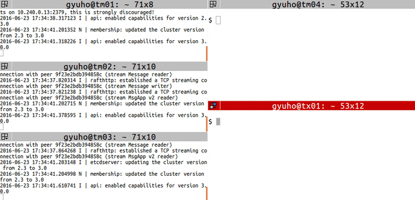

### Ectd 集群搭建

引导etcd群集：静态、etcd发现和DNS发现

### 一、Ectd 集群搭建

#### 1.1 概述

静态启动etcd集群需要集群中的每个成员都知道另一个成员。在许多情况下，集群成员的IP可能提前未知。在这些情况下，可以在发现服务的帮助下引导etcd集群。

一旦etcd集群启动并运行，就可以通过运行时重新配置来添加或删除成员。为了更好地理解[运行时重新配置](https://etcd.io/docs/v3.5/op-guide/runtime-configuration/)背后的设计，我们建议阅读[运行时配置设计文档](https://etcd.io/docs/v3.5/op-guide/runtime-reconf-design/)

本指南将介绍以下3中引导etcd集群的机制：

- **Static**
- **etcd Discovery**
- **DNS Discovery**

每个引导机制都将用于创建一个三机etcd集群，其中包含以下详细信息：

| Name      | Address   | Hostname             |
| --------- | --------- | -------------------- |
| machine-1 | 127.0.0.1 | machine0.example.com |
| machine-2 | 127.0.0.1 | machine1.example.com |
| machine-3 | 127.0.0.1 | machine2.example.com |

#### 1.2 State

由于我们在启动之前知道集群成员、它们的地址和集群的大小，我们可以通过设置初始集群标志来使用离线引导配置。每台机器将获得以下环境变量或命令行：

```bash
ETCD_INITIAL_CLUSTER="etcd0=http://127.0.0.1:12380,etcd1=http://127.0.0.1:22380,etcd2=http://127.0.0.1:32380"
ETCD_INITIAL_CLUSTER_STATE=new
```

```bash
--initial-cluster etcd0=http://127.0.0.1:12380,etcd1=http://127.0.0.1:22380,etcd2=http://127.0.0.1:32380 \
--initial-cluster-state new
```

注意，在初始集群中指定的URL是播发对等URL，即它们应该与`initial-advertise-peer-urls`(相应节点上的初始播发对等URL)的值匹配。

如果出于测试目的使用相同的配置启动多个集群（或创建和销毁单个集群），强烈建议为每个集群提供唯一的`initial-cluster-token`。通过这样做，即使集群具有完全相同的配置，etcd也可以为集群生成唯一的集群ID和成员ID。这可以保护etcd免受跨集群交互的影响，这可能会损坏集群

etcd 侦听[`listen-client-urls`](https://etcd.io/docs/v3.5/op-guide/configuration/#member)以接受客户端流量。etcd 成员将指定的 URL 通告[`advertise-client-urls`](https://etcd.io/docs/v3.5/op-guide/configuration/#clustering)给其他成员、代理、客户端。请确保`advertise-client-urls`目标客户可以访问它们。`advertise-client-urls`如果远程客户端应该访问 etcd，一个常见的错误是设置为 localhost 或将其保留为默认值。

在每台机器上，使用以下标志启动 etcd：

```bash
$ etcd --name machine-0 --initial-advertise-peer-urls http://127.0.0.1:12380 \
  --listen-peer-urls http://127.0.0.1:12380 \
  --listen-client-urls http://127.0.0.1:12379,http://127.0.0.1:12379 \
  --advertise-client-urls http://127.0.0.1:12379 \
  --initial-cluster-token etcd-cluster-1 \
  --initial-cluster etcd0=http://127.0.0.1:12380,etcd1=http://127.0.0.1:22380,etcd2=http://127.0.0.1:32380 \
  --initial-cluster-state new
```

```bash
$ etcd --name machine-1 --initial-advertise-peer-urls http://127.0.0.1:22380 \
  --listen-peer-urls http://127.0.0.1:22380 \
  --listen-client-urls http://127.0.0.1:22379,http://127.0.0.1:22379 \
  --advertise-client-urls http://127.0.0.1:22379 \
  --initial-cluster-token etcd-cluster-1 \
  --initial-cluster etcd0=http://127.0.0.1:12380,etcd1=http://127.0.0.1:22380,etcd2=http://127.0.0.1:32380 \
  --initial-cluster-state new
```

```bash
$ etcd --name machine-2 --initial-advertise-peer-urls http://127.0.0.1:32380 \
  --listen-peer-urls http://127.0.0.1:32380 \
  --listen-client-urls http://127.0.0.1:32379,http://127.0.0.1:32379 \
  --advertise-client-urls http://127.0.0.1:32379 \
  --initial-cluster-token etcd-cluster-1 \
  --initial-cluster etcd0=http://127.0.0.1:12380,etcd1=http://127.0.0.1:22380,etcd2=http://127.0.0.1:32380 \
  --initial-cluster-state new
```

以 开头的命令行参数`--initial-cluster`将在 etcd 的后续运行中被忽略。在初始引导过程之后随意删除环境变量或命令行标志。如果稍后需要更改配置（例如，在集群中添加或删除成员），请参阅[运行时配置](https://etcd.io/docs/v3.5/op-guide/runtime-configuration/)指南。

#### 1.3 TLS

etcd 支持通过 TLS 协议进行加密通信。TLS 通道可用于对等点之间的加密内部集群通信以及加密的客户端流量。本节提供了使用对等和客户端 TLS 设置集群的示例。可以在[安全指南](https://etcd.io/docs/v3.5/op-guide/security/)中找到详细说明 etcd 的 TLS 支持的其他信息。

在每台机器上，etcd 将使用以下标志启动：

```bash
$ etcd --name machine-0 --initial-advertise-peer-urls http://127.0.0.1:12380 \
  --listen-peer-urls http://127.0.0.1:12380 \
  --listen-client-urls http://127.0.0.1:12379,http://127.0.0.1:12379 \
  --advertise-client-urls http://127.0.0.1:12379 \
  --initial-cluster-token etcd-cluster-1 \
  --initial-cluster etcd0=http://127.0.0.1:12380,etcd1=http://127.0.0.1:22380,etcd2=http://127.0.0.1:32380 \
  --initial-cluster-state new \
  --client-cert-auth --trusted-ca-file=/path/to/ca-client.crt \
  --cert-file=/path/to/infra0-client.crt --key-file=/path/to/infra0-client.key \
  --peer-client-cert-auth --peer-trusted-ca-file=ca-peer.crt \
  --peer-cert-file=/path/to/infra0-peer.crt --peer-key-file=/path/to/infra0-peer.key
```


```bash
$ etcd --name machine-0 --initial-advertise-peer-urls http://127.0.0.1:22380 \
  --listen-peer-urls http://127.0.0.1:22380 \
  --listen-client-urls http://127.0.0.1:22379,http://127.0.0.1:22379 \
  --advertise-client-urls http://127.0.0.1:22379 \
  --initial-cluster-token etcd-cluster-1 \
  --initial-cluster etcd0=http://127.0.0.1:12380,etcd1=http://127.0.0.1:22380,etcd2=http://127.0.0.1:32380 \
  --initial-cluster-state new \
  --client-cert-auth --trusted-ca-file=/path/to/ca-client.crt \
  --cert-file=/path/to/infra0-client.crt --key-file=/path/to/infra0-client.key \
  --peer-client-cert-auth --peer-trusted-ca-file=ca-peer.crt \
  --peer-cert-file=/path/to/infra0-peer.crt --peer-key-file=/path/to/infra0-peer.key
```

```bash
$ etcd --name machine-0 --initial-advertise-peer-urls http://127.0.0.1:32380 \
  --listen-peer-urls http://127.0.0.1:32380 \
  --listen-client-urls http://127.0.0.1:32379,http://127.0.0.1:32379 \
  --advertise-client-urls http://127.0.0.1:32379 \
  --initial-cluster-token etcd-cluster-1 \
  --initial-cluster etcd0=http://127.0.0.1:12380,etcd1=http://127.0.0.1:22380,etcd2=http://127.0.0.1:32380 \
  --initial-cluster-state new \
  --client-cert-auth --trusted-ca-file=/path/to/ca-client.crt \
  --cert-file=/path/to/infra0-client.crt --key-file=/path/to/infra0-client.key \
  --peer-client-cert-auth --peer-trusted-ca-file=ca-peer.crt \
  --peer-cert-file=/path/to/infra0-peer.crt --peer-key-file=/path/to/infra0-peer.key
```

#### 1.4 自动证书

如果集群需要加密通信但不需要经过身份验证的连接，则可以将 etcd 配置为自动生成其密钥。在初始化时，每个成员都会根据其公布的 IP 地址和主机创建自己的一组密钥。

在每台机器上，etcd 将使用以下标志启动：

```bash
$ etcd --name machine-0 --initial-advertise-peer-urls http://127.0.0.1:12380 \
  --listen-peer-urls http://127.0.0.1:12380 \
  --listen-client-urls http://127.0.0.1:12379,http://127.0.0.1:12379 \
  --advertise-client-urls http://127.0.0.1:12379 \
  --initial-cluster-token etcd-cluster-1 \
  --initial-cluster etcd0=http://127.0.0.1:12380,etcd1=http://127.0.0.1:22380,etcd2=http://127.0.0.1:32380 \
  --initial-cluster-state new \
  --auto-tls \
  --peer-auto-tls
```

```bash
$ etcd --name machine-1 --initial-advertise-peer-urls http://127.0.0.1:22380 \
  --listen-peer-urls http://127.0.0.1:22380 \
  --listen-client-urls http://127.0.0.1:22379,http://127.0.0.1:22379 \
  --advertise-client-urls http://127.0.0.1:22379 \
  --initial-cluster-token etcd-cluster-1 \
  --initial-cluster etcd0=http://127.0.0.1:12380,etcd1=http://127.0.0.1:22380,etcd2=http://127.0.0.1:32380 \
  --initial-cluster-state new \
  --auto-tls \
  --peer-auto-tls
```

```bash
$ etcd --name machine-2 --initial-advertise-peer-urls http://127.0.0.1:32380 \
  --listen-peer-urls http://127.0.0.1:32380 \
  --listen-client-urls http://127.0.0.1:32379,http://127.0.0.1:32379 \
  --advertise-client-urls http://127.0.0.1:32379 \
  --initial-cluster-token etcd-cluster-1 \
  --initial-cluster etcd0=http://127.0.0.1:12380,etcd1=http://127.0.0.1:22380,etcd2=http://127.0.0.1:32380 \
  --initial-cluster-state new \
  --auto-tls \
  --peer-auto-tls
```

#### 1.5 发现 （Discovery）

在许多情况下，可能无法提前知道集群对等方的 IP。这在使用云提供商或网络使用 DHCP 时很常见。在这些情况下，不要指定静态配置，而是使用现有的 etcd 集群来引导一个新的。这个过程称为“发现”。

有两种方法可用于发现：

- etcd 发现服务
- DNS SRV 记录

##### 1.5.1 etcd 发现

为了更好地理解发现服务协议的设计，我们建议阅读发现服务协议[文档](https://etcd.io/docs/v3.5/dev-internal/discovery_protocol/)。

##### 1.5.2 发现 URL 的生命周期

一个发现 URL 标识一个唯一的 etcd 集群。每个 etcd 实例都共享一个新的发现 URL 来引导新集群，而不是重用现有的发现 URL。

此外，发现 URL 应仅用于集群的初始引导。要在集群已经运行后更改集群成员资格，请参阅[运行时重新配置](https://etcd.io/docs/v3.5/op-guide/runtime-configuration/)指南。

##### 1.5.3 自定义 etcd 发现服务

Discovery 使用现有集群来引导自身。如果使用私有 etcd 集群，请创建如下 URL：

```bash
$ curl -X PUT https://myetcd.local/v2/keys/discovery/6c007a14875d53d9bf0ef5a6fc0257c817f0fb83/_config/size -d value=3
```

通过将大小键设置为 URL，将创建一个预期集群大小为 3 的发现 URL。

在这种情况下使用的 URL 将是`https://myetcd.local/v2/keys/discovery/6c007a14875d53d9bf0ef5a6fc0257c817f0fb83`，并且 etcd 成员将在`https://myetcd.local/v2/keys/discovery/6c007a14875d53d9bf0ef5a6fc0257c817f0fb83`开始时使用该目录进行注册。

**每个成员必须指定不同的名称标志。`Hostname`或者`machine-id`可以是一个不错的选择。否则发现会因名称重复而失败。**

```bash
$ etcd --name machine-0 --initial-advertise-peer-urls http://127.0.0.1:12380 \
  --listen-peer-urls http://127.0.0.1:12380 \
  --listen-client-urls http://127.0.0.1:12379,http://127.0.0.1:12379 \
  --advertise-client-urls http://127.0.0.1:12379 \
 --discovery https://myetcd.local/v2/keys/discovery/6c007a14875d53d9bf0ef5a6fc0257c817f0fb83
```

```bash
$ etcd --name machine-1 --initial-advertise-peer-urls http://127.0.0.1:22380 \
  --listen-peer-urls http://127.0.0.1:22380 \
  --listen-client-urls http://127.0.0.1:22379,http://127.0.0.1:22379 \
  --advertise-client-urls http://127.0.0.1:22379 \
--discovery https://myetcd.local/v2/keys/discovery/6c007a14875d53d9bf0ef5a6fc0257c817f0fb83
```

```bash
$ etcd --name machine-2 --initial-advertise-peer-urls http://127.0.0.1:32380 \
  --listen-peer-urls http://127.0.0.1:32380 \
  --listen-client-urls http://127.0.0.1:32379,http://127.0.0.1:32379 \
  --advertise-client-urls http://127.0.0.1:32379 \
--discovery https://myetcd.local/v2/keys/discovery/6c007a14875d53d9bf0ef5a6fc0257c817f0fb83
```

这将导致每个成员向自定义 etcd 发现服务注册自己，并在所有机器都注册后启动集群。

##### 1.5.4 公共 etcd 发现服务

如果没有可用的现有集群，请使用托管在 的公共发现服务`discovery.etcd.io`。要使用“新”端点创建私有发现 URL，请使用以下命令：

```bash
$ curl https://discovery.etcd.io/new?size=3
https://discovery.etcd.io/3e86b59982e49066c5d813af1c2e2579cbf573de
```

这将创建初始大小为 3 个成员的集群。如果未指定大小，则使用默认值 3。

```bash
ETCD_DISCOVERY=https://discovery.etcd.io/3e86b59982e49066c5d813af1c2e2579cbf573de
--discovery https://discovery.etcd.io/3e86b59982e49066c5d813af1c2e2579cbf573de
```

**每个成员必须指定不同的名称标志，否则发现将由于名称重复而失败。`Hostname`或者`machine-id`可以是一个不错的选择。**

现在我们使用每个成员的相关标志启动 etcd：

```bash
$ etcd --name machine-0 --initial-advertise-peer-urls http://127.0.0.1:12380 \
  --listen-peer-urls http://127.0.0.1:12380 \
  --listen-client-urls http://127.0.0.1:12379,http://127.0.0.1:12379 \
  --advertise-client-urls http://127.0.0.1:12379 \
--discovery https://discovery.etcd.io/3e86b59982e49066c5d813af1c2e2579cbf573de
```

```bash
$ etcd --name machine-1 --initial-advertise-peer-urls http://127.0.0.1:22380 \
  --listen-peer-urls http://127.0.0.1:22380 \
  --listen-client-urls http://127.0.0.1:22379,http://127.0.0.1:22379 \
  --advertise-client-urls http://127.0.0.1:22379 \
--discovery https://discovery.etcd.io/3e86b59982e49066c5d813af1c2e2579cbf573de
```

```bash
$ etcd --name machine-2 --initial-advertise-peer-urls http://127.0.0.1:32380 \
  --listen-peer-urls http://127.0.0.1:32380 \
  --listen-client-urls http://127.0.0.1:32379,http://127.0.0.1:32379 \
  --advertise-client-urls http://127.0.0.1:32379 \
--discovery https://discovery.etcd.io/3e86b59982e49066c5d813af1c2e2579cbf573de
```

这将导致每个成员向发现服务注册自己，并在所有成员都注册后启动集群。

使用环境变量`ETCD_DISCOVERY_PROXY`使 etcd 使用 HTTP 代理连接到发现服务。

##### 1.5.5 DNS 发现

DNS [SRV 记录](http://www.ietf.org/rfc/rfc2052.txt)可用作发现机制。该`--discovery-srv`标志可用于设置可以找到发现 SRV 记录的 DNS 域名。设置`--discovery-srv example.com`会导致按列出的顺序查找 DNS SRV 记录：

- _etcd-server-ssl._tcp.example.com
- _etcd-server._tcp.example.com

如果`_etcd-server-ssl._tcp.example.com`找到，则 etcd 将尝试通过 TLS 进行引导过程。

为了帮助客户端发现 etcd 集群，按照列出的顺序查找以下 DNS SRV 记录：

- _etcd-client._tcp.example.com
- _etcd-client-ssl._tcp.example.com

如果`_etcd-client-ssl._tcp.example.com`找到，客户端将尝试通过 SSL/TLS 与 etcd 集群通信。

如果 etcd 使用 TLS，则发现 SRV 记录（例如`example.com`）必须与主机名一起包含在 SSL 证书 DNS SAN 中，否则集群将失败并显示如下日志消息：

```bash
[...] rejected connection from "10.0.1.11:53162" (error "remote error: tls: bad certificate", ServerName "example.com")
```

如果 etcd 在没有自定义证书授权的情况下使用 TLS，则发现域（例如，example.com）必须与 SRV 记录域（例如，infra1.example.com）匹配。这是为了减轻伪造 SRV 记录以指向不同域的攻击；该域将具有 PKI 下的有效证书，但由未知的第三方控制。

该`-discovery-srv-name`标志还为在发现期间查询的 SRV 名称配置了后缀。使用此标志来区分同一域下的多个 etcd 集群。例如，如果设置了`discovery-srv=example.com`和，`-discovery-srv-name=foo`则会进行以下 DNS SRV 查询：

- _etcd-server-ssl-foo._tcp.example.com
- _etcd-server-foo._tcp.example.com

##### 1.5.6 创建 DNS SRV 记录

```
$ dig +noall +answer SRV _etcd-server._tcp.example.com
_etcd-server._tcp.example.com. 300 IN  SRV  0 0 2380 infra0.example.com.
_etcd-server._tcp.example.com. 300 IN  SRV  0 0 2380 infra1.example.com.
_etcd-server._tcp.example.com. 300 IN  SRV  0 0 2380 infra2.example.com.
$ dig +noall +answer SRV _etcd-client._tcp.example.com
_etcd-client._tcp.example.com. 300 IN SRV 0 0 2379 infra0.example.com.
_etcd-client._tcp.example.com. 300 IN SRV 0 0 2379 infra1.example.com.
_etcd-client._tcp.example.com. 300 IN SRV 0 0 2379 infra2.example.com.
$ dig +noall +answer infra0.example.com infra1.example.com infra2.example.com
infra0.example.com.  300  IN  A  10.0.1.10
infra1.example.com.  300  IN  A  10.0.1.11
infra2.example.com.  300  IN  A  10.0.1.12
```

##### 1.5.7 使用 DNS 引导 etcd 集群

etcd 集群成员可以发布域名或 IP 地址，引导过程将解析 DNS A 记录。从 3.2（3.1 打印警告）开始`--listen-peer-urls`，`--listen-client-urls`将拒绝网络接口绑定的域名。

中的已解析地址`--initial-advertise-peer-urls` *必须与*SRV 目标中的已解析地址之一匹配。etcd 成员读取解析后的地址，以确定它是否属于 SRV 记录中定义的集群。

#### 1.6 MAC M1   ETCD 集群搭建

##### 1.6.1 **创建etcd1.sh**

```bash
TOKEN=token-01
CLUSTER_STATE=new
NAME_1=machine-1
NAME_2=machine-2
NAME_3=machine-3
HOST_1=127.0.0.1
CLUSTER=${NAME_1}=http://${HOST_1}:12380,${NAME_2}=http://${HOST_1}:22380,${NAME_3}=http://${HOST_1}:32380

# For machine 1
THIS_NAME=${NAME_1}
THIS_IP=${HOST_1}
etcd --data-dir=/var/lib/etcd1/data.etcd --name ${THIS_NAME} \
	--initial-advertise-peer-urls http://${THIS_IP}:12380 --listen-peer-urls http://${THIS_IP}:12380 \
	--advertise-client-urls http://${THIS_IP}:12379 --listen-client-urls http://${THIS_IP}:12379 \
	--initial-cluster ${CLUSTER} \
	--initial-cluster-state ${CLUSTER_STATE} --initial-cluster-token ${TOKEN}
```

##### 1.6.2 **创建etcd2.sh**

```bash
TOKEN=token-01
CLUSTER_STATE=new
NAME_1=machine-1
NAME_2=machine-2
NAME_3=machine-3
HOST_2=127.0.0.1
CLUSTER=${NAME_1}=http://${HOST_2}:12380,${NAME_2}=http://${HOST_2}:22380,${NAME_3}=http://${HOST_2}:32380

THIS_NAME=${NAME_2}
THIS_IP=${HOST_2}
etcd --data-dir=/var/lib/etcd2/data.etcd  --name ${THIS_NAME} \
	--initial-advertise-peer-urls http://${THIS_IP}:22380 --listen-peer-urls http://${THIS_IP}:22380 \
	--advertise-client-urls http://${THIS_IP}:22379 --listen-client-urls http://${THIS_IP}:22379 \
	--initial-cluster ${CLUSTER} \
	--initial-cluster-state ${CLUSTER_STATE} --initial-cluster-token ${TOKEN}
```

##### 1.6.3 **创建etcd3.sh**

```bash
TOKEN=token-01
CLUSTER_STATE=new
NAME_1=machine-1
NAME_2=machine-2
NAME_3=machine-3
HOST_3=127.0.0.1
CLUSTER=${NAME_1}=http://${HOST_3}:12380,${NAME_2}=http://${HOST_3}:22380,${NAME_3}=http://${HOST_3}:32380
# For machine 3
THIS_NAME=${NAME_3}
THIS_IP=${HOST_3}
etcd --data-dir=/var/lib/etcd3/data.etcd  --name ${THIS_NAME} \
	--initial-advertise-peer-urls http://${THIS_IP}:32380 --listen-peer-urls http://${THIS_IP}:32380 \
	--advertise-client-urls http://${THIS_IP}:32379 --listen-client-urls http://${THIS_IP}:32379 \
	--initial-cluster ${CLUSTER} \
	--initial-cluster-state ${CLUSTER_STATE} --initial-cluster-token ${TOKEN}
```

##### 1.6.4 **创建etcd_server.sh**，用于启动其他三个脚本

```bash
open -a Terminal.app /Users/yooome/etcd/etcd1.sh
open -a Terminal.app /Users/yooome/etcd/etcd2.sh
open -a Terminal.app /Users/yooome/etcd/etcd3.sh
```

##### 1.6.5 **创建客户端连接服务端命令**

```bash
export ETCDCTL_API=3
HOST_1=127.0.0.1
HOST_2=127.0.0.1
HOST_3=127.0.0.1
ENDPOINTS=$HOST_1:12379,$HOST_2:22379,$HOST_3:32379

etcdctl --endpoints=$ENDPOINTS member list -w table
```

##### 1.6.6 结果如下，表示ETCD集群搭建成功


#### 1.7 如何访问etcd

##### 1.7.1 put 写命令：


```bash
etcdctl --endpoints=$ENDPOINTS put foo "Hello World!"
```

##### 1.7.2 get 从etcd中读取：

```bash
etcdctl --endpoints=$ENDPOINTS get foo
etcdctl --endpoints=$ENDPOINTS --write-out="json" get foo
```

#### 1.8 如何通过前缀批量获取 keys


```bash
etcdctl --endpoints=$ENDPOINTS put web1 value1
etcdctl --endpoints=$ENDPOINTS put web2 value2
etcdctl --endpoints=$ENDPOINTS put web3 value3

etcdctl --endpoints=$ENDPOINTS get web --prefix
```

#### 1.9 如何删除 keys


```bash
etcdctl --endpoints=$ENDPOINTS put key myvalue
etcdctl --endpoints=$ENDPOINTS del key

etcdctl --endpoints=$ENDPOINTS put k1 value1
etcdctl --endpoints=$ENDPOINTS put k2 value2
etcdctl --endpoints=$ENDPOINTS del k --prefix
```

#### 1.10 如何在事务中进行多次写入


```bash
```

#### 1.11 监控 keys


```bash
etcdctl --endpoints=$ENDPOINTS watch stock1
# 新开一个窗口，然后输入该值，就会发现 前的面的窗口就会有相应的值改变。
etcdctl --endpoints=$ENDPOINTS put stock1 1000
# 监控前缀为 stock 的 keys
etcdctl --endpoints=$ENDPOINTS watch stock --prefix
etcdctl --endpoints=$ENDPOINTS put stock1 10
etcdctl --endpoints=$ENDPOINTS put stock2 20
```

#### 1.12 设置过期时间 keys


```bash
etcdctl --endpoints=$ENDPOINTS lease grant 300
# lease 2be7547fbc6a5afa granted with TTL(300s)
# 给当前的 key 设置过期时间
etcdctl --endpoints=$ENDPOINTS put sample value --lease=2be7547fbc6a5afa
etcdctl --endpoints=$ENDPOINTS get sample

etcdctl --endpoints=$ENDPOINTS lease keep-alive 2be7547fbc6a5afa
# 取消过期时间
etcdctl --endpoints=$ENDPOINTS lease revoke 2be7547fbc6a5afa
# or after 300 seconds
etcdctl --endpoints=$ENDPOINTS get sample
```

#### 1.13 如何创建锁


```bash
etcdctl --endpoints=$ENDPOINTS lock mutex1

# another client with the same name blocks
etcdctl --endpoints=$ENDPOINTS lock mutex1
```

#### 1.14 etcd集群中如何进行leader选举


```bash
etcdctl --endpoints=$ENDPOINTS elect one p1

# another client with the same name blocks
etcdctl --endpoints=$ENDPOINTS elect one p2
```

#### 1.15 如何检查集群状态

检查 etcd 集群状态的指南

为每台机器指定初始集群配置：

```bash
etcdctl --write-out=table --endpoints=$ENDPOINTS endpoint status
```


```bash
yooome@192 etcd % etcdctl --endpoints=$ENDPOINTS endpoint health
127.0.0.1:12379 is healthy: successfully committed proposal: took = 2.374209ms
127.0.0.1:32379 is healthy: successfully committed proposal: took = 2.496333ms
127.0.0.1:22379 is healthy: successfully committed proposal: took = 2.452208ms
yooome@192 etcd % 
```

#### 1.16 如何保存数据库

获取 etcd 数据库快照的指南

`snapshot`保存 etcd 数据库的时间点快照：


快照只能从一个 etcd 节点请求，因此`--endpoints`flag 应该只包含一个端点。

```bash
ENDPOINTS=$HOST_1:2379
etcdctl --endpoints=$ENDPOINTS snapshot save my.db

Snapshot saved at my.db
```

#### 1.17 如何将 etcd 从 v2 迁移到 v3

`migrate`将 etcd v2 转换为 v3 数据：


```bash
# write key in etcd version 2 store
export ETCDCTL_API=2
etcdctl --endpoints=http://$ENDPOINT set foo bar

# read key in etcd v2
etcdctl --endpoints=$ENDPOINTS --output="json" get foo

# stop etcd node to migrate, one by one

# migrate v2 data
export ETCDCTL_API=3
etcdctl --endpoints=$ENDPOINT migrate --data-dir="default.etcd" --wal-dir="default.etcd/member/wal"

# restart etcd node after migrate, one by one

# confirm that the key got migrated
etcdctl --endpoints=$ENDPOINTS get /foo
```

#### 1.18 如何添加和删除成员

`member`添加、删除、更新成员资格：




```bash
# For each machine
TOKEN=my-etcd-token-1
CLUSTER_STATE=new
NAME_1=etcd-node-1
NAME_2=etcd-node-2
NAME_3=etcd-node-3
HOST_1=10.240.0.13
HOST_2=10.240.0.14
HOST_3=10.240.0.15
CLUSTER=${NAME_1}=http://${HOST_1}:2380,${NAME_2}=http://${HOST_2}:2380,${NAME_3}=http://${HOST_3}:2380

# For node 1
THIS_NAME=${NAME_1}
THIS_IP=${HOST_1}
etcd --data-dir=data.etcd --name ${THIS_NAME} \
	--initial-advertise-peer-urls http://${THIS_IP}:2380 \
	--listen-peer-urls http://${THIS_IP}:2380 \
	--advertise-client-urls http://${THIS_IP}:2379 \
	--listen-client-urls http://${THIS_IP}:2379 \
	--initial-cluster ${CLUSTER} \
	--initial-cluster-state ${CLUSTER_STATE} \
	--initial-cluster-token ${TOKEN}

# For node 2
THIS_NAME=${NAME_2}
THIS_IP=${HOST_2}
etcd --data-dir=data.etcd --name ${THIS_NAME} \
	--initial-advertise-peer-urls http://${THIS_IP}:2380 \
	--listen-peer-urls http://${THIS_IP}:2380 \
	--advertise-client-urls http://${THIS_IP}:2379 \
	--listen-client-urls http://${THIS_IP}:2379 \
	--initial-cluster ${CLUSTER} \
	--initial-cluster-state ${CLUSTER_STATE} \
	--initial-cluster-token ${TOKEN}

# For node 3
THIS_NAME=${NAME_3}
THIS_IP=${HOST_3}
etcd --data-dir=data.etcd --name ${THIS_NAME} \
	--initial-advertise-peer-urls http://${THIS_IP}:2380 \
	--listen-peer-urls http://${THIS_IP}:2380 \
	--advertise-client-urls http://${THIS_IP}:2379 \
	--listen-client-urls http://${THIS_IP}:2379 \
	--initial-cluster ${CLUSTER} \
	--initial-cluster-state ${CLUSTER_STATE} \
	--initial-cluster-token ${TOKEN}
```

`member remove`然后用和`member add`命令替换一个成员：

```bash
# get member ID
export ETCDCTL_API=3
HOST_1=10.240.0.13
HOST_2=10.240.0.14
HOST_3=10.240.0.15
etcdctl --endpoints=${HOST_1}:2379,${HOST_2}:2379,${HOST_3}:2379 member list

# remove the member
MEMBER_ID=278c654c9a6dfd3b
etcdctl --endpoints=${HOST_1}:2379,${HOST_2}:2379,${HOST_3}:2379 \
	member remove ${MEMBER_ID}

# add a new member (node 4)
export ETCDCTL_API=3
NAME_1=etcd-node-1
NAME_2=etcd-node-2
NAME_4=etcd-node-4
HOST_1=10.240.0.13
HOST_2=10.240.0.14
HOST_4=10.240.0.16 # new member
etcdctl --endpoints=${HOST_1}:2379,${HOST_2}:2379 \
	member add ${NAME_4} \
	--peer-urls=http://${HOST_4}:2380
```

`--initial-cluster-state existing`接下来，使用标志启动新成员：

```bash
# [WARNING] If the new member starts from the same disk space,
# make sure to remove the data directory of the old member
#
# restart with 'existing' flag
TOKEN=my-etcd-token-1
CLUSTER_STATE=existing
NAME_1=etcd-node-1
NAME_2=etcd-node-2
NAME_4=etcd-node-4
HOST_1=10.240.0.13
HOST_2=10.240.0.14
HOST_4=10.240.0.16 # new member
CLUSTER=${NAME_1}=http://${HOST_1}:2380,${NAME_2}=http://${HOST_2}:2380,${NAME_4}=http://${HOST_4}:2380

THIS_NAME=${NAME_4}
THIS_IP=${HOST_4}
etcd --data-dir=data.etcd --name ${THIS_NAME} \
	--initial-advertise-peer-urls http://${THIS_IP}:2380 \
	--listen-peer-urls http://${THIS_IP}:2380 \
	--advertise-client-urls http://${THIS_IP}:2379 \
	--listen-client-urls http://${THIS_IP}:2379 \
	--initial-cluster ${CLUSTER} \
	--initial-cluster-state ${CLUSTER_STATE} \
	--initial-cluster-token ${TOKEN}
```


### 二、在容器中运行Etcd

为了向 Docker 主机之外的客户端公开 etcd API，请使用容器的主机 IP 地址。[`docker inspect`](https://docs.docker.com/engine/reference/commandline/inspect)有关如何获取 IP 地址的更多详细信息，请参阅。或者，为命令指定`--net=host`标志以`docker run`跳过将容器放置在单独的网络堆栈中。

#### 2.1 运行单节点 etcd

配置 etcd 时使用主机 IP 地址：

```bash
export NODE1=192.168.1.21
```

配置一个 Docker 卷来存储 etcd 数据：

```bash
docker volume create --name etcd-data
export DATA_DIR="etcd-data"
```

运行最新版本的 etcd：

```bash
REGISTRY=quay.io/coreos/etcd
# available from v3.2.5
REGISTRY=gcr.io/etcd-development/etcd

docker run \
  -p 2379:2379 \
  -p 2380:2380 \
  --volume=${DATA_DIR}:/etcd-data \
  --name etcd ${REGISTRY}:latest \
  /usr/local/bin/etcd \
  --data-dir=/etcd-data --name node1 \
  --initial-advertise-peer-urls http://${NODE1}:2380 --listen-peer-urls http://0.0.0.0:2380 \
  --advertise-client-urls http://${NODE1}:2379 --listen-client-urls http://0.0.0.0:2379 \
  --initial-cluster node1=http://${NODE1}:2380
```

列出集群成员：

```bash
etcdctl --endpoints=http://${NODE1}:2379 member list
```

#### 2.2 运行 3 节点 etcd 集群

```bash
REGISTRY=quay.io/coreos/etcd
# available from v3.2.5
REGISTRY=gcr.io/etcd-development/etcd

# For each machine
ETCD_VERSION=latest
TOKEN=my-etcd-token
CLUSTER_STATE=new
NAME_1=etcd-node-0
NAME_2=etcd-node-1
NAME_3=etcd-node-2
HOST_1=10.20.30.1
HOST_2=10.20.30.2
HOST_3=10.20.30.3
CLUSTER=${NAME_1}=http://${HOST_1}:2380,${NAME_2}=http://${HOST_2}:2380,${NAME_3}=http://${HOST_3}:2380
DATA_DIR=/var/lib/etcd

# For node 1
THIS_NAME=${NAME_1}
THIS_IP=${HOST_1}
docker run \
  -p 2379:2379 \
  -p 2380:2380 \
  --volume=${DATA_DIR}:/etcd-data \
  --name etcd ${REGISTRY}:${ETCD_VERSION} \
  /usr/local/bin/etcd \
  --data-dir=/etcd-data --name ${THIS_NAME} \
  --initial-advertise-peer-urls http://${THIS_IP}:2380 --listen-peer-urls http://0.0.0.0:2380 \
  --advertise-client-urls http://${THIS_IP}:2379 --listen-client-urls http://0.0.0.0:2379 \
  --initial-cluster ${CLUSTER} \
  --initial-cluster-state ${CLUSTER_STATE} --initial-cluster-token ${TOKEN}

# For node 2
THIS_NAME=${NAME_2}
THIS_IP=${HOST_2}
docker run \
  -p 2379:2379 \
  -p 2380:2380 \
  --volume=${DATA_DIR}:/etcd-data \
  --name etcd ${REGISTRY}:${ETCD_VERSION} \
  /usr/local/bin/etcd \
  --data-dir=/etcd-data --name ${THIS_NAME} \
  --initial-advertise-peer-urls http://${THIS_IP}:2380 --listen-peer-urls http://0.0.0.0:2380 \
  --advertise-client-urls http://${THIS_IP}:2379 --listen-client-urls http://0.0.0.0:2379 \
  --initial-cluster ${CLUSTER} \
  --initial-cluster-state ${CLUSTER_STATE} --initial-cluster-token ${TOKEN}

# For node 3
THIS_NAME=${NAME_3}
THIS_IP=${HOST_3}
docker run \
  -p 2379:2379 \
  -p 2380:2380 \
  --volume=${DATA_DIR}:/etcd-data \
  --name etcd ${REGISTRY}:${ETCD_VERSION} \
  /usr/local/bin/etcd \
  --data-dir=/etcd-data --name ${THIS_NAME} \
  --initial-advertise-peer-urls http://${THIS_IP}:2380 --listen-peer-urls http://0.0.0.0:2380 \
  --advertise-client-urls http://${THIS_IP}:2379 --listen-client-urls http://0.0.0.0:2379 \
  --initial-cluster ${CLUSTER} \
  --initial-cluster-state ${CLUSTER_STATE} --initial-cluster-token ${TOKEN}
```

要`etcdctl`使用 API 版本 3 运行：

```bash
docker exec etcd /bin/sh -c "export ETCDCTL_API=3 && /usr/local/bin/etcdctl put foo bar"
```

### 三、故障模式

失败的种类和 ectd 对它们的容忍度

在大型机器部署中，故障很常见。当机器的硬件或软件出现故障时，机器就会出现故障。当出现电源故障或网络问题时，多台机器会同时出现故障。多种故障也可能同时发生；列举所有可能的失败案例几乎是不可能的。

在本节中，我们对故障类型进行分类并讨论 etcd 是如何设计来容忍这些故障的。大多数用户（如果不是全部）都可以将特定故障映射为一种故障。要为罕见或[不可恢复的故障](https://etcd.io/docs/v3.5/op-guide/recovery/)做准备，请始终[备份](https://etcd.io/docs/v3.5/op-guide/maintenance/#snapshot-backup)etcd 集群。

#### 3.1 Minor followers failure

当不到一半的追随者失败时，etcd集群仍然可以接受请求并在没有任何重大中断的情况下取得进展。例如，两个跟随器故障不会影响五成员etcd集群的运行。但是，客户端将失去与故障成员的连接。客户端库应该通过自动重新连接到其他成员来对用户的读取请求隐藏这些中断。操作员应预计由于重新连接，其他构件上的系统负载会增加。

#### 3.2 Leader failure

当一个leader失败时，etcd集群会自动选举一个新的leader。一旦领导者失败，选举不会立即发生。因为故障检测模型是基于超时的，所以选举一个新的领导者需要一个选举超时。

在领导者选举期间，集群无法处理任何写入。在选举期间发送的写入请求将排队等待处理，直到选出新的领导者。

已经发送给旧领导但尚未提交的写入可能会丢失。新领导者有权重写前领导者的任何未提交条目。从用户的角度来看，一些写请求可能会在新的领导者选举后超时。但是，不会丢失任何已提交的写入。

新领导者自动延长所有租约的超时时间。这种机制确保租约不会在授予的 TTL 之前到期，即使它是由旧领导者授予的。

#### 3.3 Majority failure

当集群的大多数成员发生故障时，etcd 集群会发生故障并且无法接受更多的写入。

一旦大多数成员可用，etcd 集群只能从多数失败中恢复。如果大多数成员无法重新上线，则操作员必须启动[灾难恢复](https://etcd.io/docs/v3.5/op-guide/recovery/)来恢复集群。

一旦大多数成员工作，etcd 集群会自动选举一个新的领导者并恢复到健康状态。新领导者自动延长所有租约的超时时间。此机制确保不会由于服务器端不可用而导致租约到期。

#### 3.4 网络分区

网络分区类似于次要跟随者故障或领导者故障。网络分区将 etcd 集群分为两部分；一个成员占多数，另一个成员占少数。多数方成为可用集群，少数方不可用。etcd 中没有“裂脑”，因为集群成员是显式添加/删除的，每次此类更改都得到当前大多数成员的批准。

如果领导者站在多数人一边，那么从多数人的角度来看，失败是少数跟随者失败。如果领导者在少数方面，那么它就是领导者失败。少数党领袖下台，多数党选举新领袖。

一旦网络分区清除，少数方会自动识别多数方的领导者并恢复其状态。

#### 3.5 引导期间失败

只有当所有必需的成员都成功启动时，集群引导才会成功。如果在引导期间发生任何故障，请删除所有成员上的数据目录并使用新的集群令牌或新的发现令牌重新引导集群。

当然，可以像恢复正在运行的集群一样恢复失败的引导集群。但是，恢复该集群几乎总是比引导一个新集群花费更多的时间和资源，因为没有要恢复的数据。

### 四、灾难恢复

etcd v3 快照和恢复工具


etcd 旨在承受机器故障。一个 etcd 集群会自动从临时故障（例如，机器重启）中恢复，并且对于 N 个成员的集群最多可以容忍*(N-1)/2 个*永久故障。当成员永久失败时，无论是由于硬件故障还是磁盘损坏，它都会失去对集群的访问权限。如果集群永久失去超过*(N-1)/2 个*成员，那么它会灾难性地失败，不可挽回地失去法定人数。一旦失去仲裁，集群就无法达成共识，因此无法继续接受更新。

为了从灾难性故障中恢复，etcd v3 提供了快照和恢复工具来重新创建集群，而不会丢失 v3 关键数据。要恢复 v2 密钥，请参阅[v2 管理员指南](https://etcd.io/docs/v2.3/admin_guide#disaster-recovery)。

#### 4.1 对键空间进行快照

恢复集群首先需要来自 etcd 成员的密钥空间快照。可以使用命令从活动成员获取快照，也可以通过从 etcd 数据目录`etcdctl snapshot save`复制文件来获取快照。`member/snap/db`例如，以下命令将提供的密钥空间快照`$ENDPOINT`到文件`snapshot.db`：

```sh
$ ETCDCTL_API=3 etcdctl --endpoints $ENDPOINT snapshot save snapshot.db
```

#### 4.2 恢复集群

要恢复集群，只需要一个快照“db”文件。集群恢复`etcdutl snapshot restore`创建新的 etcd 数据目录；所有成员都应使用相同的快照进行还原。恢复会覆盖一些快照元数据（特别是成员 ID 和集群 ID）；该成员失去了以前的身份。此元数据覆盖可防止新成员无意中加入现有集群。因此，为了从快照启动集群，恢复必须启动一个新的逻辑集群。

可以选择在还原时验证快照完整性。如果快照是用 拍摄的`etcdctl snapshot save`，它将有一个由 . 检查的完整性哈希`etcdutl snapshot restore`。如果快照是从数据目录复制的，则没有完整性哈希，只能使用`--skip-hash-check`.

恢复初始化新集群的新成员，使用新的集群配置使用`etcd`集群配置标志，但保留 etcd 键空间的内容。继续上一个示例，以下为三成员集群创建新的 etcd 数据目录 ( `m1.etcd`, `m2.etcd`, )：`m3.etcd`

```sh
$ etcdutl snapshot restore snapshot.db \
  --name m1 \
  --initial-cluster m1=http://host1:2380,m2=http://host2:2380,m3=http://host3:2380 \
  --initial-cluster-token etcd-cluster-1 \
  --initial-advertise-peer-urls http://host1:2380
$ etcdutl snapshot restore snapshot.db \
  --name m2 \
  --initial-cluster m1=http://host1:2380,m2=http://host2:2380,m3=http://host3:2380 \
  --initial-cluster-token etcd-cluster-1 \
  --initial-advertise-peer-urls http://host2:2380
$ etcdutl snapshot restore snapshot.db \
  --name m3 \
  --initial-cluster m1=http://host1:2380,m2=http://host2:2380,m3=http://host3:2380 \
  --initial-cluster-token etcd-cluster-1 \
  --initial-advertise-peer-urls http://host3:2380
```

接下来，`etcd`从新的数据目录开始：

```sh
$ etcd \
  --name m1 \
  --listen-client-urls http://host1:2379 \
  --advertise-client-urls http://host1:2379 \
  --listen-peer-urls http://host1:2380 &
$ etcd \
  --name m2 \
  --listen-client-urls http://host2:2379 \
  --advertise-client-urls http://host2:2379 \
  --listen-peer-urls http://host2:2380 &
$ etcd \
  --name m3 \
  --listen-client-urls http://host3:2379 \
  --advertise-client-urls http://host3:2379 \
  --listen-peer-urls http://host3:2380 &
```

现在恢复的 etcd 集群应该可用并为快照提供的键空间提供服务。

#### 4.3 使用错误的 URL 从成员错误重新配置中恢复集群

以前，etcd[会因错误的 URL 的成员错误重新配置而](https://github.com/etcd-io/etcd/issues/9173)恐慌（v3.2.15 或更高版本在 etcd 服务器恐慌之前[的客户端早期返回错误）。](https://github.com/etcd-io/etcd/pull/9174)

[推荐的方法是从快照](https://etcd.io/docs/v3.5/op-guide/recovery/#snapshotting-the-keyspace)恢复。`--force-new-cluster`可用于在保留现有应用程序数据的同时覆盖集群成员资格，但强烈建议不要这样做，因为如果前一个集群中的其他成员还活着，它会恐慌。确保定期保存快照。

### 五、etcd 网关

etcd 网关，何时使用，以及如何设置


#### 5.1 什么是etcd网关

etcd 网关是一个简单的 TCP 代理，将网络数据转发到 etcd 集群。网关无状态透明；它既不检查客户端请求也不干扰集群响应。它不会终止 TLS 连接，不会代表其客户端进行 TLS 握手，也不会验证连接是否安全。

网关支持多个 etcd 服务器端点，并采用简单的循环策略。它只路由到可用的端点并对其客户端隐藏故障。未来可能会支持其他重试策略，例如加权循环。

#### 5.2 何时使用 etcd 网关

每个访问 etcd 的应用程序必须首先具有 etcd 集群客户端端点的地址。如果同一台服务器上的多个应用程序访问同一个 etcd 集群，每个应用程序仍然需要知道 etcd 集群的通告客户端端点。如果 etcd 集群被重新配置为具有不同的端点，每个应用程序可能还需要更新其端点列表。这种大规模的重新配置既乏味又容易出错。

etcd 网关通过充当稳定的本地端点解决了这个问题。典型的 etcd 网关配置让每台机器运行一个网关，监听本地地址，并且每个 etcd 应用程序都连接到其本地网关。结果只是网关需要更新其端点，而不是更新每个应用程序。

总之，为了自动传播集群端点更改，etcd 网关运行在每台机器上，为访问同一个 etcd 集群的多个应用程序提供服务。

#### 5.3 何时不使用 etcd 网关

- 提高性能

网关不是为提高 etcd 集群性能而设计的。它不提供缓存、监视合并或批处理。etcd 团队正在开发一种缓存代理，旨在提高集群的可扩展性。

- 在集群管理系统上运行

Kubernetes 等高级集群管理系统原生支持服务发现。应用程序可以通过系统管理的 DNS 名称或虚拟 IP 地址访问 etcd 集群。例如，kube-proxy 相当于 etcd 网关。

#### 5.4 启动 etcd 网关

考虑一个具有以下静态端点的 etcd 集群：

| 姓名      | 地址      | 主机名             |
| --------- | --------- | ------------------ |
| 基础设施0 | 10.0.1.10 | infra0.example.com |
| 基础设施1 | 10.0.1.11 | infra1.example.com |
| 基础设施2 | 10.0.1.12 | infra2.example.com |

使用以下命令启动 etcd 网关以使用这些静态端点：

```bash
$ etcd gateway start --endpoints=infra0.example.com,infra1.example.com,infra2.example.com
2016-08-16 11:21:18.867350 I | tcpproxy: ready to proxy client requests to [...]
```

或者，如果使用 DNS 进行服务发现，请考虑 DNS SRV 条目：

```bash
$ dig +noall +answer SRV _etcd-client._tcp.example.com
_etcd-client._tcp.example.com. 300 IN SRV 0 0 2379 infra0.example.com.
_etcd-client._tcp.example.com. 300 IN SRV 0 0 2379 infra1.example.com.
_etcd-client._tcp.example.com. 300 IN SRV 0 0 2379 infra2.example.com.
$ dig +noall +answer infra0.example.com infra1.example.com infra2.example.com
infra0.example.com.  300  IN  A  10.0.1.10
infra1.example.com.  300  IN  A  10.0.1.11
infra2.example.com.  300  IN  A  10.0.1.12
```

使用以下命令启动 etcd 网关以从 DNS SRV 条目中获取端点：

```bash
$ etcd gateway start --discovery-srv=example.com
2016-08-16 11:21:18.867350 I | tcpproxy: ready to proxy client requests to [...]
```

#### 5.5 配置标志

##### 5.5.1 etcd 集群

##### –端点

- 用于转发客户端连接的 etcd 服务器目标的逗号分隔列表。
- 默认：`127.0.0.1:2379`
- 无效示例：（`https://127.0.0.1:2379`网关不终止 TLS）。请注意，网关不会验证 HTTP 模式或检查请求，它只会将请求转发到给定的端点。

##### --发现-srv

- 用于通过 SRV 记录引导集群端点的 DNS 域。
- 默认值：（未设置）

##### 网络

##### --listen-addr

- 为接受客户端请求而绑定的接口和端口。
- 默认：`127.0.0.1:23790`

##### --重试延迟

- 重试连接失败端点之前的延迟时间。
- 默认值：1m0s
- 无效示例：“123”（期望格式中的时间单位）

##### 安全

##### –不安全的发现

- 接受不安全或容易受到中间人攻击的 SRV 记录。
- 默认：`false`

##### --trusted-ca 文件

- etcd 集群的客户端 TLS CA 文件的路径，用于验证从 SRV 发现返回的端点。请注意，它仅用于验证发现的端点，而不是为数据传输创建连接。网关永远不会终止 TLS 连接或代表其客户端创建 TLS 连接。
- 默认值：（未设置）


### 六、gRPC 代理

在 gRPC 层运行的无状态 etcd 反向代理

gRPC 代理是在 gRPC 层（L7）运行的无状态 etcd 反向代理。该代理旨在减少核心 etcd 集群上的总处理负载。对于水平可扩展性，它合并了监视和租用 API 请求。为了保护集群免受滥用客户端的影响，它缓存了键范围请求。

gRPC 代理支持多个 etcd 服务器端点。当代理启动时，它会随机选择一个 etcd 服务器端点来使用。此端点为所有请求提供服务，直到代理检测到端点故障。如果 gRPC 代理检测到端点故障，它会切换到另一个端点（如果可用）以隐藏其客户端的故障。未来可能会支持其他重试策略，例如加权循环。

#### 6.1 可扩展的手表 API

gRPC 代理将同一键或范围上的多个客户端观察者 ( ) 合并为连接到 etcd 服务器`c-watchers`的单个观察者 ( )。`s-watcher`代理将所有事件从 广播`s-watcher`到其`c-watchers`.

假设有 N 个客户端监视同一个 key，一个 gRPC 代理可以将 etcd 服务器上的监视负载从 N 减少到 1 个。用户可以部署多个 gRPC 代理以进一步分散服务器负载。

在以下示例中，三个客户端在密钥 A 上进行监视。gRPC 代理合并三个观察者，创建一个连接到 etcd 服务器的单个观察者。

```
            +-------------+
            | etcd server |
            +------+------+
                   ^ watch key A (s-watcher)
                   |
           +-------+-----+
           | gRPC proxy  | <-------+
           |             |         |
           ++-----+------+         |watch key A (c-watcher)
watch key A ^     ^ watch key A    |
(c-watcher) |     | (c-watcher)    |
    +-------+-+  ++--------+  +----+----+
    |  client |  |  client |  |  client |
    |         |  |         |  |         |
    +---------+  +---------+  +---------+
```

#### 6.2 限制

为了有效地将多个客户端观察者合并为一个观察者，gRPC 代理会在可能的情况下将新的观察者合并`c-watchers`为现有`s-watcher`的。由于网络延迟或缓冲的未交付事件，此合并`s-watcher`可能与 etcd 服务器不同步。当未指定监视修订时，gRPC 代理将不保证`c-watcher`将从最近的存储修订开始监视。例如，如果客户端从修订版 1000 的 etcd 服务器进行监视，则该观察者将从修订版 1000 开始。如果客户端从 gRPC 代理进行监视，则可能从修订版 990 开始监视。

类似的限制适用于取消。当 watcher 被取消时，etcd 服务器的版本可能会大于取消响应的版本。

这两个限制不应该对大多数用例造成问题。将来，可能会有其他选项强制观察者绕过 gRPC 代理以获得更准确的修订响应。

#### 6.3 可扩展的租赁 API

为了保持其租约有效，客户端必须建立至少一个 gRPC 流到 etcd 服务器以发送周期性心跳。如果 etcd 工作负载涉及分布在许多客户端上的大量租用活动，则这些流可能会导致 CPU 利用率过高。为了减少核心集群上的流总数，代理支持租用流合并。

假设 N 个客户端正在更新租约，单个 gRPC 代理将 etcd 服务器上的流负载从 N 减少到 1。部署可能具有额外的 gRPC 代理，以进一步跨多个代理分发流。

在以下示例中，三个客户端更新三个独立的租约（`L1`、`L2`和`L3`）。gRPC 代理将三个客户端租用流 ( ) 合并为一个附加到 etcd 服务器`c-streams`的租用保持活动流 ( )。`s-stream`代理将客户端租赁心跳从 c-stream 转发到 s-stream，然后将响应返回到相应的 c-stream。

```
          +-------------+
          | etcd server |
          +------+------+
                 ^
                 | heartbeat L1, L2, L3
                 | (s-stream)
                 v
         +-------+-----+
         | gRPC proxy  +<-----------+
         +---+------+--+            | heartbeat L3
             ^      ^               | (c-stream)
heartbeat L1 |      | heartbeat L2  |
(c-stream)   v      v (c-stream)    v
      +------+-+  +-+------+  +-----+--+
      | client |  | client |  | client |
      +--------+  +--------+  +--------+
```

#### 6.4 滥用客户保护

gRPC 代理在不破坏一致性要求时缓存请求的响应。这可以保护 etcd 服务器免受紧密 for 循环中的滥用客户端的影响。

#### 6.5 启动 etcd gRPC 代理

考虑一个具有以下静态端点的 etcd 集群：

| 姓名      | 地址      | 主机名             |
| --------- | --------- | ------------------ |
| 基础设施0 | 10.0.1.10 | infra0.example.com |
| 基础设施1 | 10.0.1.11 | infra1.example.com |
| 基础设施2 | 10.0.1.12 | infra2.example.com |

使用以下命令启动 etcd gRPC 代理以使用这些静态端点：

```bash
$ etcd grpc-proxy start --endpoints=infra0.example.com,infra1.example.com,infra2.example.com --listen-addr=127.0.0.1:2379
```

etcd gRPC 代理启动并侦听端口 2379。它将客户端请求转发到上面提供的三个端点之一。

通过代理发送请求：

```bash
$ ETCDCTL_API=3 etcdctl --endpoints=127.0.0.1:2379 put foo bar
OK
$ ETCDCTL_API=3 etcdctl --endpoints=127.0.0.1:2379 get foo
foo
bar
```

#### 6.6 客户端端点同步和名称解析

代理支持通过写入用户定义的端点来注册其端点以进行发现。这有两个目的。首先，它允许客户端将其端点与一组代理端点同步以实现高可用性。其次，它是 etcd [gRPC 命名](https://etcd.io/docs/v3.5/dev-guide/grpc_naming/)的端点提供者。

通过提供用户定义的前缀来注册代理：

```bash
$ etcd grpc-proxy start --endpoints=localhost:2379 \
  --listen-addr=127.0.0.1:23790 \
  --advertise-client-url=127.0.0.1:23790 \
  --resolver-prefix="___grpc_proxy_endpoint" \
  --resolver-ttl=60

$ etcd grpc-proxy start --endpoints=localhost:2379 \
  --listen-addr=127.0.0.1:23791 \
  --advertise-client-url=127.0.0.1:23791 \
  --resolver-prefix="___grpc_proxy_endpoint" \
  --resolver-ttl=60
```

代理将列出其所有成员的成员列表：

```bash
ETCDCTL_API=3 etcdctl --endpoints=http://localhost:23790 member list --write-out table

+----+---------+--------------------------------+------------+-----------------+
| ID | STATUS  |              NAME              | PEER ADDRS |  CLIENT ADDRS   |
+----+---------+--------------------------------+------------+-----------------+
|  0 | started | Gyu-Hos-MBP.sfo.coreos.systems |            | 127.0.0.1:23791 |
|  0 | started | Gyu-Hos-MBP.sfo.coreos.systems |            | 127.0.0.1:23790 |
+----+---------+--------------------------------+------------+-----------------+
```

这让客户端可以通过 Sync 自动发现代理端点：

```go
cli, err := clientv3.New(clientv3.Config{
    Endpoints: []string{"http://localhost:23790"},
})
if err != nil {
    log.Fatal(err)
}
defer cli.Close()

// fetch registered grpc-proxy endpoints
if err := cli.Sync(context.Background()); err != nil {
    log.Fatal(err)
}
```

请注意，如果代理配置没有解析器前缀，

```bash
$ etcd grpc-proxy start --endpoints=localhost:2379 \
  --listen-addr=127.0.0.1:23792 \
  --advertise-client-url=127.0.0.1:23792
```

grpc-proxy 的成员列表 API 返回它自己的`advertise-client-url`：

```bash
ETCDCTL_API=3 etcdctl --endpoints=http://localhost:23792 member list --write-out table

+----+---------+--------------------------------+------------+-----------------+
| ID | STATUS  |              NAME              | PEER ADDRS |  CLIENT ADDRS   |
+----+---------+--------------------------------+------------+-----------------+
|  0 | started | Gyu-Hos-MBP.sfo.coreos.systems |            | 127.0.0.1:23792 |
+----+---------+--------------------------------+------------+-----------------+
```

#### 6.7 命名空间

假设应用程序希望完全控制整个密钥空间，但 etcd 集群与其他应用程序共享。为了让所有应用程序在不相互干扰的情况下运行，代理可以对 etcd 键空间进行分区，以便客户端看起来可以访问完整的键空间。当代理被赋予 flag`--namespace`时，进入代理的所有客户端请求都被转换为在键上具有用户定义的前缀。对 etcd 集群的访问将在前缀下，来自代理的响应将去除前缀；对客户来说，似乎根本没有前缀。

要命名代理，请使用以下命令开始`--namespace`：

```bash
$ etcd grpc-proxy start --endpoints=localhost:2379 \
  --listen-addr=127.0.0.1:23790 \
  --namespace=my-prefix/
```

对代理的访问现在透明地在 etcd 集群上添加前缀：

```bash
$ ETCDCTL_API=3 etcdctl --endpoints=localhost:23790 put my-key abc
# OK
$ ETCDCTL_API=3 etcdctl --endpoints=localhost:23790 get my-key
# my-key
# abc
$ ETCDCTL_API=3 etcdctl --endpoints=localhost:2379 get my-prefix/my-key
# my-prefix/my-key
# abc
```

#### 6.8 TLS 终止

通过提供未加密的本地端点，使用 gRPC 代理从安全的 etcd 集群中终止 TLS。

要试用它，请使用客户端 https 启动单个成员 etcd 集群：

```sh
$ etcd --listen-client-urls https://localhost:2379 --advertise-client-urls https://localhost:2379 --cert-file=peer.crt --key-file=peer.key --trusted-ca-file=ca.crt --client-cert-auth
```

确认客户端端口服务于 https：

```sh
# fails
$ ETCDCTL_API=3 etcdctl --endpoints=http://localhost:2379 endpoint status
# works
$ ETCDCTL_API=3 etcdctl --endpoints=https://localhost:2379 --cert=client.crt --key=client.key --cacert=ca.crt endpoint status
```

接下来，通过使用客户端证书`localhost:12379`连接到 etcd 端点来启动 gRPC 代理：`https://localhost:2379`

```sh
$ etcd grpc-proxy start --endpoints=https://localhost:2379 --listen-addr localhost:12379 --cert client.crt --key client.key --cacert=ca.crt --insecure-skip-tls-verify &
```

最后，通过 http 将密钥放入代理来测试 TLS 终止：

```sh
$ ETCDCTL_API=3 etcdctl --endpoints=http://localhost:12379 put abc def
# OK
```

#### 6.9 指标和健康

gRPC代理`/health`为由. 另一种方法是定义一个附加 URL，该 URL 将使用该标志同时响应 the和端点。`/metrics``--endpoints``/metrics``/health``--metrics-addr`

```bash
$ etcd grpc-proxy start \
  --endpoints https://localhost:2379 \
  --metrics-addr https://0.0.0.0:4443 \
  --listen-addr 127.0.0.1:23790 \
  --key client.key \
  --key-file proxy-server.key \
  --cert client.crt \
  --cert-file proxy-server.crt \
  --cacert ca.pem \
  --trusted-ca-file proxy-ca.pem
```

#### 6.10 已知问题

代理的主界面同时服务于 HTTP2 和 HTTP/1.1。如果如上例所示使用 TLS 设置代理，则在针对侦听接口使用诸如 cURL 之类的客户端时，将需要在请求返回时将协议显式设置为 HTTP/1.1`/metrics`或`/health`. 通过使用该`--metrics-addr`标志，辅助接口将没有此要求。

```bash
 $ curl --cacert proxy-ca.pem --key proxy-client.key --cert proxy-client.crt https://127.0.0.1:23790/metrics --http1.1
```


### 。、配置文件和启动参数说明

```yml
# 节点名称
name
# 指定节点的数据存储目录
data-dir
# 监听url，用于与其他节点通讯
listen-peer-urls
# 对外提供服务的地址：比如 http://ip:2379,http://127.0.0.1:2379 ，客户端会连接到这里和 etcd 交互
listen-client-urls
# 该节点member(同伴)监听地址，这个值会告诉集群其节点
initial-advertise-peer-urls
# 集群中所有节点的信息，格式为 node1=http://ip1:2380,node2=http://ip2:2380,… 。注意：这里的 node1 是节点的 --name 指定的名字；后面的 ip1:2380 是 --initial-advertise-peer-urls 指定的值
initial-cluster-state
# 创建集群的 token ，这个值每个集群保持唯一。这样的话，如果你要重新创建集群，即时配置和之前的一样，也会再次生成新的集群和节点 uuid；否则会导致多个集群之间的冲突，造成位置的错误。
initial-cluster-token
# 对外公告的该节点客户点监听地址，这个值会告诉集群中其他节点
advertise-client-urls
```

0etcd --config-file=/Users/yooome/etcd/etcd1.conf.yml &

0etcd - -config-file /etc/etcd/etcd.conf

etcd --config-file=/Users/yooome/etcd/etcd2.conf.yml &

etcd --config-file=/Users/yooome/etcd/etcd3.conf.yml 

 etcdctl --endpoints http://127.0.0.1:12379,http://127.0.0.1:22379,http://127.0.0.1:32379 member list

 etcdctl --endpoints http://127.0.0.1:12379,http://127.0.0.1:22379,http://127.0.0.1:32379 member list

```
#[Member]
#1.节点名称，必须唯一
ETCD_NAME="etcd1"

#2.设置数据保存的目录
ETCD_DATA_DIR="/var/lib/etcd"

#3.用于监听其他etcd member的url
ETCD_LISTEN_PEER_URLS="http://127.0.0.1:12380"

#4.该节点对外提供服务的地址
ETCD_LISTEN_CLIENT_URLS="http://127.0.0.1:12379,http://127.0.0.1:12379"

#[Clustering]
#5.对外公告的该节点客户端监听地址
ETCD_ADVERTISE_CLIENT_URLS="http://192.168.86.131:12379"

#6.该节点成员对等URL地址，且会通告集群的其余成员节点
ETCD_INITIAL_ADVERTISE_PEER_URLS="http://192.168.86.131:12380"

#7.集群中所有节点的信息
ETCD_INITIAL_CLUSTER="etcd01=http://192.168.86.131:2380,（注意这是第一台虚拟机的地址，是不变的）

etcd02=http://192.168.86.132:2380"（注意这是第二台虚拟机的地址，是不变的）

#8.创建集群的token，这个值每个集群保持唯一
ETCD_INITIAL_CLUSTER_TOKEN="etcd-cluster"

#9.初始集群状态，新建集群的时候，这个值为new；
ETCD_INITIAL_CLUSTER_STATE="new"

#10.flannel操作etcd使用的是v2的API，而kubernetes操作etcd使用的v3的API
#   为了兼容flannel，将默认开启v2版本，故配置文件中设置 
ETCD_ENABLE_V2="true"
```

```
docker run -d -p 2579:2579 -p 2580:2580 --restart=always --net etcdnet --ip 192.167.0.172 --name etcd2 quay.io/coreos/etcd /usr/local/bin/etcd --name autumn-client2 -advertise-client-urls http://192.167.0.172:2579 -listen-client-urls http://0.0.0.0:2579 -initial-advertise-peer-urls http://192.167.0.172:2580 -listen-peer-urls http://0.0.0.0:2580 -initial-cluster-token etcd-cluster -initial-cluster autumn-client0=http://192.167.0.168:2380,autumn-client1=http://192.167.0.170:2480,autumn-client2=http://192.167.0.172:2580 -initial-cluster-state new

```


etcd --config-file=/Users/yooome/etcd/etcd1.conf.yml

etcd --config-file=/Users/yooome/etcd/etcd2.conf.yml

etcd --config-file=/Users/yooome/etcd/etcd3.conf.yml