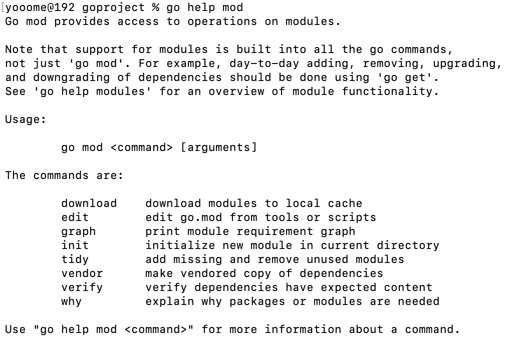
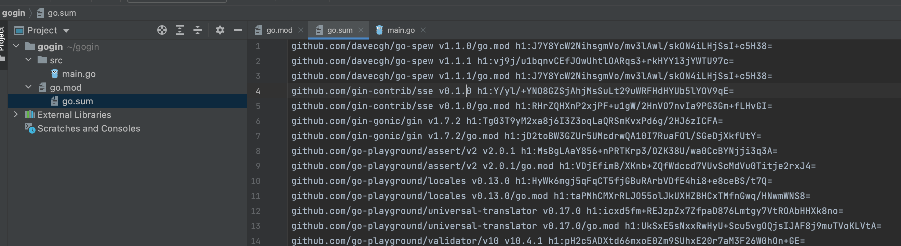

#### 一、go mod 命令

golang 提供了 `go mod` 命令来管理包

**go help mod**



go mod 有以下命令：

| 命令     | 说明                                                         |
| -------- | ------------------------------------------------------------ |
| download | download modules to local cache(下载依赖包)                  |
| edit     | edit go.mod from tools or scripts（编辑go.mod)               |
| graph    | print module requirement graph (打印模块依赖图)              |
| init     | initialize new modul in current dirctory(在当前目录初始化mod) |
| tidy     | add missing and remove unused modules(添加缺少的模块，移除不用的模块) |
| vendor   | make vendored copy of dependencies(将依赖复制到vendor下)     |
| verify   | verify dependencies have expected content(验证依赖是否正确)  |
| why      | explain why packages or moudles are needed(解释为什么需要依赖) |

比较常用的是`init`,`tidy`,`edit`

##### 1.1 如何使用go mod

首先，必须升级go到1.11，目前的版本是1.14

下面是升级演示：

```golang
# 卸载旧版本，删除对应文件
brew uninstall -f go
# 更新一下brew
brew update

# 安装go
brew install go
```

上面升级完成，使用go version 看下版本

```golang
go version go1.14.1 darwin/amd64
```

下面设置go mod 和 go proxy

```golang
go env -w GOBIN=/Users/yooome/goproject/bin
go env -w GO111MODULE=on
go env -w GOPROXY=https://goproxy.cn,direct // 使用七牛云的
```

注意：go env -w 会将配置写到 GOENV="/Users/yooome/Library/Application Support/go/env"

下面是我的配置

```golang
GO111MODULE="on"
GOARCH="arm64"
GOBIN="/Users/yooome/goproject/bin"
GOCACHE="/Users/yooome/Library/Caches/go-build"
GOENV="/Users/yooome/Library/Application Support/go/env"
GOEXE=""
GOFLAGS=""
GOHOSTARCH="arm64"
GOHOSTOS="darwin"
GOINSECURE=""
GOMODCACHE="/Users/yooome/goproject/pkg/mod"
GONOPROXY=""
GONOSUMDB=""
GOOS="darwin"
GOPATH="/Users/yooome/goproject"
GOPRIVATE=""
GOPROXY="https://goproxy.io,direct"
GOROOT="/usr/local/go"
GOSUMDB="sum.golang.org"
GOTMPDIR=""
GOTOOLDIR="/usr/local/go/pkg/tool/darwin_arm64"
GOVCS=""
GOVERSION="go1.16.5"
GCCGO="gccgo"
AR="ar"
CC="clang"
CXX="clang++"
CGO_ENABLED="1"
GOMOD="/Users/yooome/gogin/go.mod"
CGO_CFLAGS="-g -O2"
CGO_CPPFLAGS=""
CGO_CXXFLAGS="-g -O2"
CGO_FFLAGS="-g -O2"
CGO_LDFLAGS="-g -O2"
PKG_CONFIG="pkg-config"
GOGCCFLAGS="-fPIC -arch arm64 -pthread -fno-caret-diagnostics -Qunused-arguments -fmessage-length=0 -fdebug-prefix-map=/var/folders/qr/htx6ks8n6hl9kblb8wjqzv2w0000gn/T/go-build2734471366=/tmp/go-build -gno-record-gcc-switches -fno-common"

```


#### 二、使用go mod 管理一个新项目

##### 2.1 初始化项目

可以随便找一个目录创建项目

```golang
mkdir Vone
cd Vone
go mod init Vone
```

##### 2.2 查看一下go.mod 文件

```golang
module Vone
go 1.14
```

go.mod文件一旦创建后，它的内容将会被go toolchain 全面掌控。go toolchain会在各类命令执行时，比如go get 、go build 、go build 等修改和维护 go.mod 文件

go.mod 提供了 module，require，replace和exculde四个命令。

- `module` 语句指定包的名字（路径）
- `require` 语句指定的依赖项模块
- `replace` 语句可以替换依赖项模块
- `exclude` 语句可以忽略依赖项模块

##### 2.3 添加依赖

创建main.go文件

```golang
package main
import "github.com/gin-gonic/gin"
func main()  {
	r := gin.Default()
	r.GET("/ping", func(context *gin.Context) {
		context.JSON(200,gin.H{
			"message":"pong",
		})
	})
	r.Run()
}
```

执行go run main.go 允信代码会发现 go mod 会自动查找依赖自动下载

在查看 `go.mod`

```golang
module gogin
go 1.16
require github.com/gin-gonic/gin v1.7.2

```

go module 安装 package 的原则是先拉最新的 release tag，若无tag则拉最新的commit 

go 会自动生成一个go.sum 文件记录 dependency  tree



再次执行脚本 go run main.go 发现跳过了检查并安装依赖的步骤。

可以使用命令 go list -m -u all 来检查可以升级 package ，使用 go get -u need-ugrade-package 升级后会将新的依赖版本更新到 go.mod * 也可以使用go get -u 升级所有依赖去 mod 包缓存下看看

##### 2.4 go get 升级

- 运行 go get -u 将会升级到最新的次要版本或者修订版本(x.y.z, z是修订版本号， y是次要版本号)
- 运行 go get -u=patch 将会升级到最新的修订版本
- 运行 go get package@version 将会升级到指定的版本号version
- 运行 go get 如果有版本的更改，那么go.mod 文件也会更改

##### 2.5 使用replace替换无法直接获取的package

由于某些已知的原因，并不是所有的package都能成功下载，比如：golang.org下的包。

modules 可以通过在go.mod 文件中使用replace 指令替换成github上对应的库，比如：

