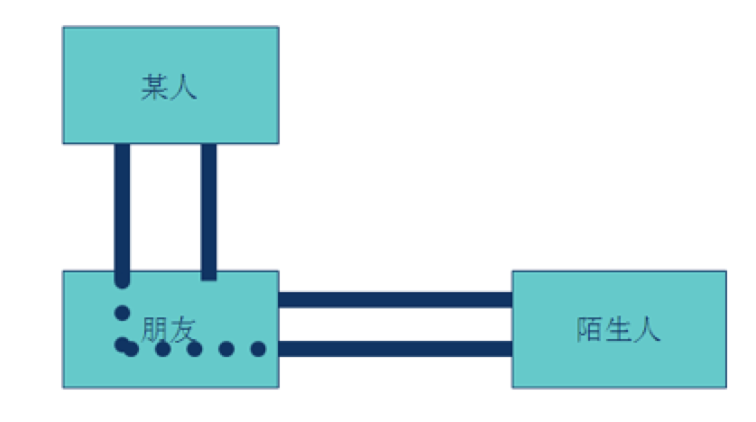
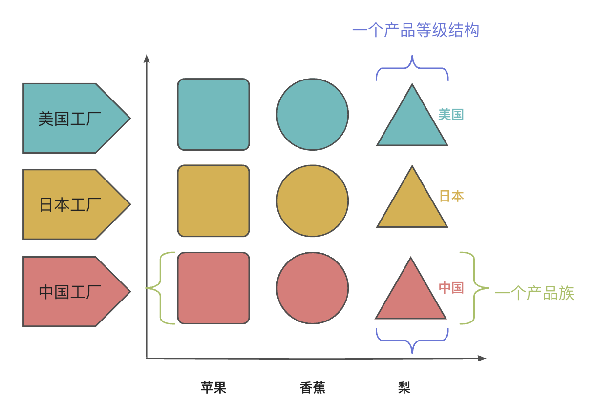
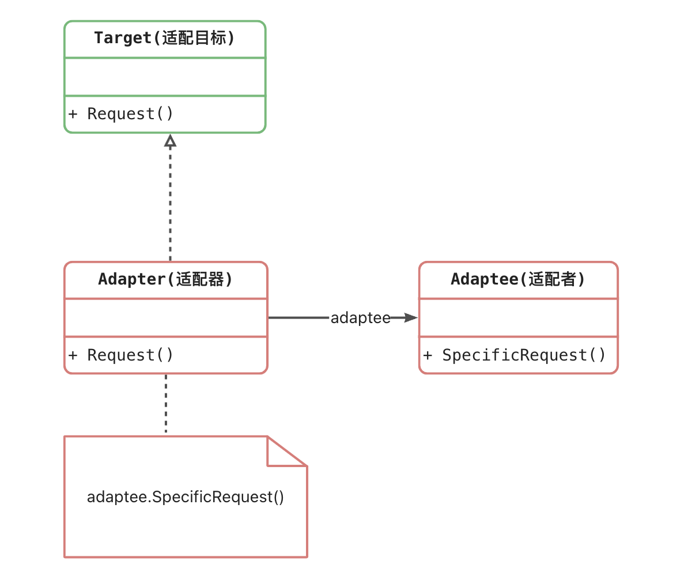

### Golang 设计模式

### 一、设计模式概述

#### 1.1 概述

如果把修习软件开发当做武功修炼的话，那么可以分为**招式**和**内功**。   

**招式：**

- Java、C#、C++、Golang、Rust等编程语言；
-  Eclipse、Visual Studio、Goland、Vim等开发工具；
-  Struts、Hibernate、JBPM、Gin、Istio、gRPC等框架技术；

**内功：**

- 数据结构
- 算法
- 设计模式
- 架构设计
- 软件工程

#### 1.2 软件设计模式又从何而来

GoF将模式的概念引入软件工程领域，这标志着软件模式的诞生。软件模式(Software Patterns)是将模式的一般概念应用于软件开发领域，即软件开发的总体指导思路或参照样板。软件模式并非仅限于设计模式，还包括架构模式、分析模式和过程模式等，实际上，在软件开发生命周期的每一个阶段都存在着一些被认同的模式。

​	软件模式与具体的应用领域无关，也就是说无论你从事的是移动应用开发、桌面应用开发、Web应用开发还是嵌入式软件的开发，都可以使用软件模式。无论你是使用Java、C#、Objective-C、VB.net、Smalltalk等纯面向对象编程语言，还是使用C++、PHP、Delphi、JavaScript等可支持面向对象编程的语言，你都需要了解软件设计模式！
​	GoF给软件设计模式提供了定义，如下：

“软件设计模式(Design Pattern)是一套被反复使用、多数人知晓的、经过分类编目的、代码设计经验的总结，使用设计模式是为了可重用代码、让代码更容易被他人理解并且保证代码可靠性。”

一句大白话可以总结：“在一定环境下，用固定套路解决问题。”

#### 1.3 软件设计模式的种类

GoF提出的设计模式有23个，包括：

1. 创建型（Creational）模式：如何创建对象。
2. 结构型（Structural）模式：如何实现类或对象的组合。
3. 行为型（Behavioral）模式：类或对象怎样交互以及怎样分配职责。

有一个 简单工厂模式 不属于GoF 23种涉及模式，但大部分的设计模式书籍都会对它进行专门的介绍。 

> 设计模式目前种类：GoF 的 23 种 + “简单工厂模式”  = 24 种。

#### 1.4 软件设计模式的作用

那么对于初学者来说，学习设计模式将有助于更加深入地理解面向对象思想，让你知道：

> 1. 如何将代码分散在几个不同的类中？
> 2. 为什么要有“接口”？
> 3. 何谓针对抽象编程？
> 4. 何时不应该使用继承？
> 5. 如果不修改源代码增加新功能？
> 6. 更好地阅读和理解现有类库与其他系统中的源代码。

学习设计模式会让你早点脱离面向对象编程的 “菜鸟期”。

#### 1.5 如何学号设计模式。

设计模式的基础是：多态。

初学者：积累案例，不要盲目的背类图。

初级开发人员：多思考，多梳理，归纳总结，尊重事物的认知规律，注意临界点的突破，不要浮躁。

中级开发人员：合适的开发环境，寻找合适的设计模式来解决问题。

多应用，对经典啧组合设计模式的大量，自由的运用。要不断的追求。

#### 1.6 设计模式总览表


### 二、面向对象设计原则

​	对于面向对象软件系统的设计而言，在支持可维护性的同时，提高系统的可复用性是一个至关重要的问题，**如何同时提高一个软件系统的可维护性和可复用性是面向对象设计需要解决的核心问题之一。**在面向对象设计中，可维护性的复用是以设计原则为基础的。每一个原则都蕴含一些面向对象设计的思想，可以从不同的角度提升一个软件结构的设计水平。

**面向对象设计原则为支持可维护性复用而诞生，这些原则蕴含在很多设计模式中，它们是从许多设计方案中总结出的指导性原则。**面向对象设计原则也是我们用于评价一个设计模式的使用效果的重要指标之一。

> 原则的目的： 高内聚，低耦合

#### 2.1 面向对象设计原则表

|                             名称                             | 定义                                                         |
| :----------------------------------------------------------: | :----------------------------------------------------------- |
| 单一职责原则                                                        （Single Responsibility Principle SRP） | 类的职责单一，对外只提供一种功能，而引起类变化的原因都应该只有一个 |
| 开闭原则                                                               （Open-Closed Principle,OCP） | 类的改动是通过增加代码进行的，而不是修改源代码。             |
| 里氏替换原则                                                                                                                                                                            （Liskov Substitution Principle, LSP） | 任何抽象类（interface接口）出现的地方都可以用他的实现类进行替换，实际就是虚拟机制，语言级别实现面向对象功能。 |
| 依赖倒转原则                                            (DependenceInversion Principle, DIP) | 依赖于抽象（接口），不要依赖具体的实现（类），也局势针对接口编程。 |
| 接口隔离原则                                                         (Interface Segregation Principle, ISP） | 不应该强迫用户的程序依赖他们不需要的接口方法。一个接口应该只提供一种对外功能，不应该把所有操作都封装到一个接口中去。 |
| 合成复用原则                                            （Composite Reuse Principle ，CRP） | 如果使用继承，会导致父类的任何变换都可能影响到子类的行为。如果使用对象组合，就降低了这种依赖关系。对于继承和组合，优先使用组合。 |
| 迪米特法则                                                             (Law of Demeter, LoD） | 一个对象应当对其他对象经可能的少的了解，从而降低各个对象之间的耦合，提高系统的可维护性。例如在一个从程序中，各个模块之间互相调用时，通常会提供一个统一的接口来实现。这样其他模块不需要了解另外一个模块的内部实现细节，这样一个模块内部的实现发生改变时，不会影响其他模块的使用。（黑盒原理） |

#### 2.2 单一职责原则

类的职责单一，对外只提供一种功能，而引起类变化的原因都应该只有一个

```go
package main

import "fmt"

type ClothesShop struct {}

func (cs *ClothesShop) OnShop() {
	fmt.Println("休闲的装扮")
}

type ClothesWork struct {}

func (cw *ClothesWork) OnWork() {
	fmt.Println("工作的装扮")
}

func main() {
	//工作的时候
	cw := new(ClothesWork)
	cw.OnWork()

	//shopping的时候
	cs := new(ClothesShop)
	cs.OnShop()
}
```

在面向对象编程的过程中，设计一个类，建议对外提供的功能单一，接口单一，硬性一个类的范围就只限定在这个一个接口上，一个类的一个接口具备这个类的功能含义，职责单一不复杂。

#### 2.3 开闭原则


##### 2.3.1 平铺式设计

那么作为 interface 数据类型，它存在的意义在哪里呢？实际上是为了满足一些面向对象的编程思想。我们知道，软件设计的最高目标就是 `高内聚，低耦合` 。那么其中有一个设计原则叫 `开闭原则` 。什么是开闭原则呢，接下来我们看一个例子：

```go
package main

import "fmt"

//我们要写一个类,Banker银行业务员
type Banker struct {
}

//存款业务
func (this *Banker) Save() {
	fmt.Println( "进行了 存款业务...")
}

//转账业务
func (this *Banker) Transfer() {
	fmt.Println( "进行了 转账业务...")
}

//支付业务
func (this *Banker) Pay() {
	fmt.Println( "进行了 支付业务...")
}

func main() {
	banker := &Banker{}

	banker.Save()
	banker.Transfer()
	banker.Pay()
}
```

代码很简单，就是一个银行业务员，他可能拥有很多的业务，比如`Save()`存款、`Transfer()`转账、`Pay()`支付等。那么如果这个业务员模块只有这几个方法还好，但是随着我们的程序写的越来越复杂，银行业务员可能就要增加方法，会导致业务员模块越来越臃肿。


这样的设计会导致，当我们去给 Banker 添加新的业务的时候，会直接修改原有的Banker代码，那么 Banker 模块的功能会越来越多，出现问题的几率也就越来越大，假如此时 Banker 已经有 99 个业务了，现在我们要添加第 100 个业务，可能由于一次的不小心，导致之前 99 个业务也一起崩溃，因为所有的业务都在一个 Banker 类里，他们的耦合度太高，Banker 的职责也不够单一，代码的维护成本随着业务的复杂正比成倍增大。

##### 2.3.2 开闭原则设计

那么，如果我们拥有接口，interface 这个东西，那么我们就可以抽象一层出来，制作一个抽象的 Banker 模块，然后提供一个抽象的方法。分别根据这个抽象的模块，去实现 `支付Banker（实现支付方法），转账Banker（实现转账方法）`


那么依然可以搞定程序的需求。然后，当我们想要给Banker太耐额外功能的时候，之前我们是直接修改Banker的内容，现在我们可以单独定义一个股票 Banker（实现股票方法），到这个系统中。而且股票 Banker 的实现成功或者失败都不会影响之前的稳定系统，他很单一，而且独立。

所以以上，当我们给一个系统天极爱一个功能的时候，不是通过修改代码，而是通过添加代码来完成，那么就开闭原则的核心思想了。所以要想满足上面的要求，是一定需要 interface 来提供一层抽象的接口的。

golang代码实现如下：

```go
package main

import "fmt"

//抽象的银行业务员
type AbstractBanker interface{
	DoBusi()	//抽象的处理业务接口
}

//存款的业务员
type SaveBanker struct {
	//AbstractBanker
}

func (sb *SaveBanker) DoBusi() {
	fmt.Println("进行了存款")
}

//转账的业务员
type TransferBanker struct {
	//AbstractBanker
}

func (tb *TransferBanker) DoBusi() {
	fmt.Println("进行了转账")
}

//支付的业务员
type PayBanker struct {
	//AbstractBanker
}

func (pb *PayBanker) DoBusi() {
	fmt.Println("进行了支付")
}


func main() {
	//进行存款
	sb := &SaveBanker{}
	sb.DoBusi()

	//进行转账
	tb := &TransferBanker{}
	tb.DoBusi()
	
	//进行支付
	pb := &PayBanker{}
	pb.DoBusi()

}
```

当然我们也可以根据`AbstractBanker`设计一个小框架

```go
//实现架构层(基于抽象层进行业务封装-针对interface接口进行封装)
func BankerBusiness(banker AbstractBanker) {
	//通过接口来向下调用，(多态现象)
	banker.DoBusi()
}
```

那么main中可以如下实现业务调用:

```go
func main() {
	//进行存款
	BankerBusiness(&SaveBanker{})

	//进行存款
	BankerBusiness(&TransferBanker{})

	//进行存款
	BankerBusiness(&PayBanker{})
}
```

> 再看开闭原则定义:
> 开闭原则:一个软件实体如类、模块和函数应该对扩展开放，对修改关闭。
> 简单的说就是在修改需求的时候，应该尽量通过扩展来实现变化，而不是通过修改已有代码来实现变化。

##### 2.3.3 接口的意义

好了，现在interface已经基本了解，那么接口的意义最终在哪里呢，想必现在你已经有了一个初步的认知，实际上接口的最大的意义就是实现多态的思想，就是我们可以根据interface类型来设计API接口，那么这种API接口的适应能力不仅能适应当下所实现的全部模块，也适应未来实现的模块来进行调用。调用未来可能就是接口的最爱意义所在，这也是为什么架构师那么值钱，因为架构师是可以针对 interface 设计一套框架，在未来许多年依然适用。

#### 2.4 依赖倒转原则

##### 2.4.1 耦合度极高的模块关系涉及


```go
package main

import "fmt"

// === > 奔驰汽车 <===
type Benz struct {

}

func (this *Benz) Run() {
	fmt.Println("Benz is running...")
}

// === > 宝马汽车  <===
type BMW struct {

}

func (this *BMW) Run() {
	fmt.Println("BMW is running ...")
}


//===> 司机张三  <===
type Zhang3 struct {
	//...
}

func (zhang3 *Zhang3) DriveBenZ(benz *Benz) {
	fmt.Println("zhang3 Drive Benz")
	benz.Run()
}

func (zhang3 *Zhang3) DriveBMW(bmw *BMW) {
	fmt.Println("zhang3 drive BMW")
	bmw.Run()
}

//===> 司机李四 <===
type Li4 struct {
	//...
}

func (li4 *Li4) DriveBenZ(benz *Benz) {
	fmt.Println("li4 Drive Benz")
	benz.Run()
}

func (li4 *Li4) DriveBMW(bmw *BMW) {
	fmt.Println("li4 drive BMW")
	bmw.Run()
}

func main() {
	//业务1 张3开奔驰
	benz := &Benz{}
	zhang3 := &Zhang3{}
	zhang3.DriveBenZ(benz)

	//业务2 李四开宝马
	bmw := &BMW{}
	li4 := &Li4{}
	li4.DriveBMW(bmw)
}
```

我们来看上面的代码和图中每个模块之间的依赖关系，实际上并没有用到任何的`interface`接口层的代码，显然最后我们的两个业务 `张三开奔驰`, `李四开宝马`，程序中也都实现了。但是这种设计的问题就在于，小规模没什么问题，但是一旦程序需要扩展，比如我现在要增加一个`丰田汽车` 或者 司机`王五`， 那么模块和模块的依赖关系将成指数级递增，想蜘蛛网一样越来越难维护和捋顺。

##### 2.4.2 面向抽象层依赖倒转


如上图所示，如果我们在设计一个系统的时候，将模块分为3个层次，抽象层、实现层、业务逻辑层。那么，我们首先将抽象层的模块和接口定义出来，这里就需要了`interface`接口的设计，然后我们依照抽象层，依次实现每个实现层的模块，在我们写实现层代码的时候，实际上我们只需要参考对应的抽象层实现就好了，实现每个模块，也和其他的实现的模块没有关系，这样也符合了上面介绍的开闭原则。这样实现起来每个模块只依赖对象的接口，而和其他模块没关系，依赖关系单一。系统容易扩展和维护。

我们在指定业务逻辑也是一样，只需要参考抽象层的接口来业务就好了，抽象层暴露出来的接口就是我们业务层可以使用的方法，然后可以通过多态的线下，接口指针指向哪个实现模块，调用了就是具体的实现方法，这样我们业务逻辑层也是依赖抽象成编程。

我们就将这种的设计原则叫做`依赖倒转原则`。

来一起看一下修改的代码：

```go
package main

import "fmt"

// ===== >   抽象层  < ========
type Car interface {
	Run()
}

type Driver interface {
	Drive(car Car)
}

// ===== >   实现层  < ========
type BenZ struct {
	//...
}

func (benz * BenZ) Run() {
	fmt.Println("Benz is running...")
}

type Bmw struct {
	//...
}

func (bmw * Bmw) Run() {
	fmt.Println("Bmw is running...")
}

type Zhang_3 struct {
	//...
}

func (zhang3 *Zhang_3) Drive(car Car) {
	fmt.Println("Zhang3 drive car")
	car.Run()
}

type Li_4 struct {
	//...
}

func (li4 *Li_4) Drive(car Car) {
	fmt.Println("li4 drive car")
	car.Run()
}


// ===== >   业务逻辑层  < ========
func main() {
	//张3 开 宝马
	var bmw Car
	bmw = &Bmw{}

	var zhang3 Driver
	zhang3 = &Zhang_3{}

	zhang3.Drive(bmw)

	//李4 开 奔驰
	var benz Car
	benz = &BenZ{}

	var li4 Driver
	li4 = &Li_4{}

	li4.Drive(benz)
}
```

#### 2.5 合成复用原则

如果使用继承，会导致父类的任何变换都可能影响到子类的行为。如果使用对象组合，就降低了这种依赖关系。对于继承和组合，优先使用组合。

```go
package main

import "fmt"

type Cat struct {}

func (c *Cat) Eat() {
	fmt.Println("小猫吃饭")
}

//给小猫添加一个 可以睡觉的方法 （使用继承来实现）
type CatB struct {
	Cat
}

func (cb *CatB) Sleep() {
	fmt.Println("小猫睡觉")
}

//给小猫添加一个 可以睡觉的方法 （使用组合的方式）
type CatC struct {
	C *Cat
}

func (cc *CatC) Sleep() {
	fmt.Println("小猫睡觉")
}


func main() {
	//通过继承增加的功能，可以正常使用
	cb := new(CatB)
	cb.Eat()
	cb.Sleep()

	//通过组合增加的功能，可以正常使用
	cc := new(CatC)
	cc.C = new(Cat)
	cc.C.Eat()
	cc.Sleep()
}
```

#### 2.6 迪米特法则

1. 和陌生人说话


2. 不和陌生人说话



3. 与依赖倒转原则结合 某人和 抽象陌生人说话  让某人和陌生人进行解耦合


### 三、创建型模式

#### 3.1 概述


目前标准的创建型设计模式共有6种（注：设计模式种类并非仅仅局限于此，设计模式实则是一种编程思想，开发者可以根据自身经验来总结出很多种设计模式思想，这6中创建型设计模式为早期官方认可的标准模式）

本章节主要介绍常用的“单例模式”、“简单工程模式”、“工厂方法模式”、“抽象工厂模式”等。“原型模式”、“建造者模式”思想类似，作为读者选修篇幅，本章暂时先不介绍。

#### 3.2 简单工厂模式

##### 3.2.1 为什么需要工厂模式

首先来看，如果没有工厂模式，在开发者创建一个类的对象时，如果有很多不同种类的对象将会如何实现，代码如下：

```go
package main

import "fmt"

//水果类
type Fruit struct {
	//...
	//...
	//...
}

func (f *Fruit) Show(name string) {
	if name == "apple" {
		fmt.Println("我是苹果")
	} else if name == "banana" {
		fmt.Println("我是香蕉")
	} else if name == "pear" {
		fmt.Println("我是梨")
	}
}

//创建一个Fruit对象
func NewFruit(name string) *Fruit {
	fruit := new(Fruit)

	if name == "apple" {
		//创建apple逻辑
	} else if name == "banana" {
		//创建banana逻辑
	} else if name == "pear" {
		//创建pear逻辑
	}

	return fruit
}

func main() {
	apple := NewFruit("apple")
	apple.Show("apple")

	banana := NewFruit("banana")
	banana.Show("banana")

	pear := NewFruit("pear")
	pear.Show("pear")
}
```

不难看出，Fruit类是一个“巨大的”类，在该类的设计中存在如下几个问题：

​	(1) 在Fruit类中包含很多“if…else…”代码块，整个类的代码相当冗长，代码越长，阅读难度、维护难度和测试难度也越大；而且大量条件语句的存在还将影响系统的性能，程序在执行过程中需要做大量的条件判断。

​	(2) Fruit类的职责过重，它负责初始化和显示所有的水果对象，将各种水果对象的初始化代码和显示代码集中在一个类中实现，违反了“单一职责原则”，不利于类的重用和维护；   

(3) 当需要增加新类型的水果时，必须修改Fruit类的构造函数NewFruit()和其他相关方法源代码，违反了“开闭原则”。

关键是来观察main()函数，main()函数与Fruit类是两个模块。当业务层希望创建一个对象的时候，将直接依赖Fruit类型的构造方法NewFruit()，这样随着Fruit的越来越复杂，那么业务层的开发逻辑也需要依赖Fruit模块的更新，且随之改变，这样将导致业务层开发需要观察Fruit模块做改动，影响业务层的开发效率和稳定性。整体的依赖关系为。

```go
业务逻辑层 ---> 基础类模块
```

那么如何将业务层创建对象与基础类模块做解耦呢，这里即可以在中间加一层工厂模块层，来降低业务逻辑层对基础模块层的直接依赖和耦合关联。

```go
业务逻辑层 ---> 工厂模块 ---> 基础类模块
```

这样就引出了需要对工厂模块的一些设计和加工生成基础模块对象的模式。

##### 3.2.2 简单工厂模式角色和职责

​	简单工厂模式并不属于GoF的23种设计模式。它是开发者自发认为的一种非常简易的设计模式，其角色和职责如下：

​	**工厂角色**：简单工厂模式的核心，它负责实现创建所有市里的内部逻辑。工厂类可以被外界直接调用，创建所需的产品对象。

​	**抽象产品角色**：简单工厂模式所创建的所有对象的父类，它负责描述所有实例所共有的公共接口。

​	**具体产品角色**：简单工厂模式所创建的具体事例对象。


##### 3.2.3 简单工厂模式实现

根据本章节的案例可以将标准的 ”简单工厂模式“ 类图改进如下：


简单工厂方法模式的实现代码如下：

```go
package main

import "fmt"

// ======= 抽象层 =========

//水果类(抽象接口)
type Fruit interface {
	Show()	 //接口的某方法
}
// ======= 基础类模块 =========

type Apple struct {
	Fruit  //为了易于理解显示继承(此行可以省略)
}

func (apple *Apple) Show() {
	fmt.Println("我是苹果")
}

type Banana struct {
	Fruit
}

func (banana *Banana) Show() {
	fmt.Println("我是香蕉")
}

type Pear struct {
	Fruit
}

func (pear *Pear) Show() {
	fmt.Println("我是梨")
}

// ========= 工厂模块  =========
//一个工厂， 有一个生产水果的机器，返回一个抽象水果的指针
type Factory struct {}

func (fac *Factory) CreateFruit(kind string) Fruit {
	var fruit Fruit

	if kind == "apple" {
		fruit = new(Apple)
	} else if kind == "banana" {
		fruit = new(Banana)
	} else if kind == "pear" {
		fruit = new(Pear)
	}

	return fruit
}


// ==========业务逻辑层==============
func main() {
	factory := new(Factory)

	apple := factory.CreateFruit("apple")
	apple.Show()

	banana := factory.CreateFruit("banana")
	banana.Show()

	pear := factory.CreateFruit("pear")
	pear.Show()
}
```

上述代码可以看出，业务逻辑层只会和工厂模块进行依赖，这样业务逻辑层将不再关心Fruit类是具体怎么创建基础对象的。

##### 3.1.4 简单工厂方法模式的优缺点

优点：

1. 实现了对象创建和使用的分离。
2. 不需要记住具体类名，记住参数即可，减少使用者记忆量。

缺点：

1. 对工厂类职责过重，一旦不能工作，系统受到影响。
2. 增加系统中类的个数，复杂度和理解度增加。
3. 违反“开闭原则”，添加新产品需要修改工厂逻辑，工厂越来越复杂。

适用场景：

1. 工厂类负责创建的对象比较少，由于创建的对象较少，不会造成工厂方法中的业务逻辑太过复杂。

2. 客户端只知道传入工厂类的参数，对于如何创建对象并不关心。

#### 3.2 工厂方法模式

##### 3.2.1 工厂方法模式中的角色和职责

**抽象工厂（Abstract Factory）角色**：工厂方法模式的核心，任何工厂类都必须实现这个接口。

**工厂（Concrete Factory）角色**：具体工厂类是抽象工厂的一个实现，负责实例化产品对象。

**抽象产品（Abstract Product）角色**：工厂方法模式所创建的所有对象的父类，它负责描述所有实例所共有的公共接口。	

**具体产品（Concrete Product）角色**：工厂方法模式所创建的具体实例对象。

```go
简单工厂模式  + “开闭原则” =    工厂方法模式
```

工厂方法模式的标准类图如下：

其标准的设计模式类图如下：


##### 3.2.2 工厂方法模式的视线

根据本章节的案例可以将标准的“工厂方法模式”类图改进如下：


实现代码如下：

```go
package main

import "fmt"

// ======= 抽象层 =========

//水果类(抽象接口)
type Fruit interface {
	Show()	 //接口的某方法
}

//工厂类(抽象接口)
type AbstractFactory interface {
	CreateFruit() Fruit //生产水果类(抽象)的生产器方法
}

// ======= 基础类模块 =========
type Apple struct {
	Fruit  //为了易于理解显示继承(此行可以省略)
}

func (apple *Apple) Show() {
	fmt.Println("我是苹果")
}

type Banana struct {
	Fruit
}

func (banana *Banana) Show() {
	fmt.Println("我是香蕉")
}

type Pear struct {
	Fruit
}

func (pear *Pear) Show() {
	fmt.Println("我是梨")
}

// ========= 工厂模块  =========
//具体的苹果工厂
type AppleFactory struct {
	AbstractFactory
}

func (fac *AppleFactory) CreateFruit() Fruit {
	var fruit Fruit

	//生产一个具体的苹果
	fruit = new(Apple)

	return fruit
}

//具体的香蕉工厂
type BananaFactory struct {
	AbstractFactory
}

func (fac *BananaFactory) CreateFruit() Fruit {
	var fruit Fruit

	//生产一个具体的香蕉
	fruit = new(Banana)

	return fruit
}


//具体的梨工厂
type PearFactory struct {
	AbstractFactory
}

func (fac *PearFactory) CreateFruit() Fruit {
	var fruit Fruit

	//生产一个具体的梨
	fruit = new(Pear)

	return fruit
}

//======= 业务逻辑层 =======
func main() {
	/*
		本案例为了突出根据依赖倒转原则与面向接口编程特性。
	    一些变量的定义将使用显示类型声明方式
	*/

	//需求1：需要一个具体的苹果对象
	//1-先要一个具体的苹果工厂
	var appleFac AbstractFactory
	appleFac = new(AppleFactory)
	//2-生产相对应的具体水果
	var apple Fruit
	apple = appleFac.CreateFruit()

	apple.Show()


	//需求2：需要一个具体的香蕉对象
	//1-先要一个具体的香蕉工厂
	var bananaFac AbstractFactory
	bananaFac = new(BananaFactory)
	//2-生产相对应的具体水果
	var banana Fruit
	banana = bananaFac.CreateFruit()

	banana.Show()

	//需求3：需要一个具体的梨对象
	//1-先要一个具体的梨工厂
	var pearFac AbstractFactory
	pearFac = new(PearFactory)
	//2-生产相对应的具体水果
	var pear Fruit
	pear = pearFac.CreateFruit()

	pear.Show()

	//需求4：需要一个日本的苹果？
}
```

上述代码是通过面向抽象层开发，业务逻辑层的main()函数逻辑，依然是只与工厂耦合，且只与抽象的工厂和抽象的水果类耦合，这样就遵循了面向抽象层接口编程的原则。

那么抽象的工厂方法模式如何体现“开闭原则”的。接下来可以尝试在原有的代码上添加一种新产品的生产，如“日本苹果”，具体的代码如下：

```go
package main

import "fmt"

// ======= 抽象层 =========

//水果类(抽象接口)
type Fruit interface {
	Show()	 //接口的某方法
}

//工厂类(抽象接口)
type AbstractFactory interface {
	CreateFruit() Fruit //生产水果类(抽象)的生产器方法
}

// ======= 基础类模块 =========
type Apple struct {
	Fruit  //为了易于理解显示继承(此行可以省略)
}

func (apple *Apple) Show() {
	fmt.Println("我是苹果")
}

type Banana struct {
	Fruit
}

func (banana *Banana) Show() {
	fmt.Println("我是香蕉")
}

type Pear struct {
	Fruit
}

func (pear *Pear) Show() {
	fmt.Println("我是梨")
}

//(+) 新增一个"日本苹果"
type JapanApple struct {
	Fruit
}

func (jp *JapanApple) Show() {
	fmt.Println("我是日本苹果")
}

// ========= 工厂模块  =========
//具体的苹果工厂
type AppleFactory struct {
	AbstractFactory
}

func (fac *AppleFactory) CreateFruit() Fruit {
	var fruit Fruit

	//生产一个具体的苹果
	fruit = new(Apple)

	return fruit
}

//具体的香蕉工厂
type BananaFactory struct {
	AbstractFactory
}

func (fac *BananaFactory) CreateFruit() Fruit {
	var fruit Fruit

	//生产一个具体的香蕉
	fruit = new(Banana)

	return fruit
}


//具体的梨工厂
type PearFactory struct {
	AbstractFactory
}

func (fac *PearFactory) CreateFruit() Fruit {
	var fruit Fruit

	//生产一个具体的梨
	fruit = new(Pear)

	return fruit
}

//具体的日本工厂
type JapanAppleFactory struct {
	AbstractFactory
}

func (fac *JapanAppleFactory) CreateFruit() Fruit {
	var fruit Fruit

	//生产一个具体的日本苹果
	fruit = new(JapanApple)

	return fruit
}

// ========= 业务逻辑层  =========
func main() {
	/*
		本案例为了突出根据依赖倒转原则与面向接口编程特性。
	    一些变量的定义将使用显示类型声明方式
	*/

	//需求1：需要一个具体的苹果对象
	//1-先要一个具体的苹果工厂
	var appleFac AbstractFactory
	appleFac = new(AppleFactory)
	//2-生产相对应的具体水果
	var apple Fruit
	apple = appleFac.CreateFruit()

	apple.Show()


	//需求2：需要一个具体的香蕉对象
	//1-先要一个具体的香蕉工厂
	var bananaFac AbstractFactory
	bananaFac = new(BananaFactory)
	//2-生产相对应的具体水果
	var banana Fruit
	banana = bananaFac.CreateFruit()

	banana.Show()

	//需求3：需要一个具体的梨对象
	//1-先要一个具体的梨工厂
	var pearFac AbstractFactory
	pearFac = new(PearFactory)
	//2-生产相对应的具体水果
	var pear Fruit
	pear = pearFac.CreateFruit()

	pear.Show()

	//需求4：需要一个日本的苹果？
	//1-先要一个具体的日本评估工厂
	var japanAppleFac AbstractFactory
	japanAppleFac = new(JapanAppleFactory)
	//2-生产相对应的具体水果
	var japanApple Fruit
	japanApple = japanAppleFac.CreateFruit()

	japanApple.Show()
}

```

  可以看见，新增的基本类“日本苹果”，和“具体的工厂” 均没有改动之前的任何代码。完全符合开闭原则思想。新增的功能不会影响到之前的已有的系统稳定性。

##### 3.2.3 工厂方法模式的优缺点

优点：

1. 不需要记住具体类名，甚至连具体参数都不用记忆。

2. 实现了对象创建和使用的分离。

3. 系统的可扩展性也就变得非常好，无需修改接口和原类。

4.对于新产品的创建，符合开闭原则。

缺点：

1. 增加系统中类的个数，复杂度和理解度增加。

2. 增加了系统的抽象性和理解难度。

适用场景：

1. 客户端不知道它所需要的对象的类。

2. 抽象工厂类通过其子类来指定创建哪个对象。

#### 3.3 抽象工厂方法模式

​	工厂方法模式通过引入工厂等级结构，解决了简单工厂模式中工厂职责太重的问题，但由于工厂方法模式中的每个工厂只生产一类产品，可能会导致系统中存在大量的工厂类，势必会增加系统的开销。因此，可以考虑将一些相关的产品组成一个 ”产品族“ ，由不同一个工厂来统一生产，这就是本文将要学习的朝向工厂模式的基本思想。


从工厂方法模式可以看出来：

（1）当添加一个新产品的时候，比如葡萄，虽然不用修改代码，但是需要添加大量的类，而且还需要添加相对的工厂。（系统开销，维护成本）

（2）如果使用同一地域的水果（日本苹果，日本香蕉，日本梨），那么需要分别创建具体的工厂，如果选择出现失误，将会造成混乱，虽然可以加一些约束，但是代码实现变得复杂。

所以“抽象工厂方法模式”引出了“产品族”和“产品等级结构”概念，其目的是为了更加高效的生产同一个产品组产品。

##### 3.3.1 产品族与产品等级结构


上图表示“产品族”和“产品登记结构”的关系。

产品族：具有同一个地区、同一个厂商、同一个开发包、同一个组织模块等，但是具备不同特点或功能的产品集合，称之为是一个产品族。

产品等级结构：具有相同特点或功能，但是来自不同的地区、不同的厂商、不同的开发包、不同的组织模块等的产品集合，称之为是一个产品等级结构。

当程序中的对象可以被划分为产品族和产品等级结构之后，那么“抽象工厂方法模式”才可以被适用。

“抽象工厂方法模式”是针对“产品族”进行生产产品，具体如下图所示。



##### 3.3.2 抽象工厂模式的角色和职责

抽象工厂（Abstract Factory）角色：它声明了一组用于创建一族产品的方法，每一个方法对应一种产品。

具体工厂（Concrete Factory）角色：它实现了在抽象工厂中声明的创建产品的方法，生成一组具体产品，这些产品构成了一个产品族，每一个产品都位于某个产品等级结构中。

抽象产品（Abstract Product）角色：它为每种产品声明接口，在抽象产品中声明了产品所具有的业务方法。

具体产品（Concrete Product）角色：它定义具体工厂生产的具体产品对象，实现抽象产品接口中声明的业务方法。


可以看出来具体的工厂1，只负责生成具体的产品A1和B1，具体的工厂2，只负责生成具体的产品A2和B2。

“工厂1、A1、B1”为一组，是一个产品族， “工厂2、A2、B2”为一组，也是一个产品族。

##### 3.3.3 抽象工厂方法模式的实现

抽象工厂方法模式按照本章节的案例，可以得到类图如下：


```go
package main

import "fmt"

// ======= 抽象层 =========
type AbstractApple interface {
	ShowApple()
}

type AbstractBanana interface {
	ShowBanana()
}

type AbstractPear interface {
	ShowPear()
}

//抽象工厂
type AbstractFactory interface {
	CreateApple() AbstractApple
	CreateBanana() AbstractBanana
	CreatePear() AbstractPear
}

// ======== 实现层 =========
/*  中国产品族 */
type ChinaApple struct {}

func (ca *ChinaApple) ShowApple() {
	fmt.Println("中国苹果")
}

type ChinaBanana struct {}

func (cb *ChinaBanana) ShowBanana() {
	fmt.Println("中国香蕉")
}

type ChinaPear struct {}

func (cp *ChinaPear) ShowPear() {
	fmt.Println("中国梨")
}

type ChinaFactory struct {}

func (cf *ChinaFactory) CreateApple() AbstractApple {
	var apple AbstractApple

	apple = new(ChinaApple)

	return apple
}

func (cf *ChinaFactory) CreateBanana() AbstractBanana {
	var banana AbstractBanana

	banana = new(ChinaBanana)

	return banana
}

func (cf *ChinaFactory) CreatePear() AbstractPear {
	var pear AbstractPear

	pear = new(ChinaPear)

	return pear
}

/*  日本产品族 */
type JapanApple struct {}

func (ja *JapanApple) ShowApple() {
	fmt.Println("日本苹果")
}

type JapanBanana struct {}

func (jb *JapanBanana) ShowBanana() {
	fmt.Println("日本香蕉")
}

type JapanPear struct {}

func (cp *JapanPear) ShowPear() {
	fmt.Println("日本梨")
}

type JapanFactory struct {}

func (jf *JapanFactory) CreateApple() AbstractApple {
	var apple AbstractApple

	apple = new(JapanApple)

	return apple
}

func (jf *JapanFactory) CreateBanana() AbstractBanana {
	var banana AbstractBanana

	banana = new(JapanBanana)

	return banana
}

func (cf *JapanFactory) CreatePear() AbstractPear {
	var pear AbstractPear

	pear = new(JapanPear)

	return pear
}

/*  美国产品族 */
type AmericanApple struct {}

func (aa *AmericanApple) ShowApple() {
	fmt.Println("美国苹果")
}

type AmericanBanana struct {}

func (ab *AmericanBanana) ShowBanana() {
	fmt.Println("美国香蕉")
}

type AmericanPear struct {}

func (ap *AmericanPear) ShowPear() {
	fmt.Println("美国梨")
}

type AmericanFactory struct {}

func (af *AmericanFactory) CreateApple() AbstractApple {
	var apple AbstractApple

	apple = new(AmericanApple)

	return apple
}

func (af *AmericanFactory) CreateBanana() AbstractBanana {
	var banana AbstractBanana

	banana = new(AmericanBanana)

	return banana
}

func (af *AmericanFactory) CreatePear() AbstractPear {
	var pear AbstractPear

	pear = new(AmericanPear)

	return pear
}

// ======== 业务逻辑层 =======
func main() {
	//需求1: 需要美国的苹果、香蕉、梨 等对象
	//1-创建一个美国工厂
	var aFac AbstractFactory
	aFac = new(AmericanFactory)

	//2-生产美国苹果
	var aApple AbstractApple
	aApple = aFac.CreateApple()
	aApple.ShowApple()

	//3-生产美国香蕉
	var aBanana AbstractBanana
	aBanana = aFac.CreateBanana()
	aBanana.ShowBanana()

	//4-生产美国梨
	var aPear AbstractPear
	aPear = aFac.CreatePear()
	aPear.ShowPear()

	//需求2: 需要中国的苹果、香蕉
	//1-创建一个中国工厂
	cFac := new(ChinaFactory)

	//2-生产中国苹果
	cApple := cFac.CreateApple()
	cApple.ShowApple()

	//3-生产中国香蕉
	cBanana := cFac.CreateBanana()
	cBanana.ShowBanana()
}

```

##### 3.3.4 抽象工厂模式的优缺点

优点：

1. 拥有工厂方法模式的优点

2. 当一个产品族中的多个对象被设计成一起工作时，它能够保证客户端始终只使用同一个产品族中的对象。
3. 增加新的产品族很方便，无须修改已有系统，符合“开闭原则”。

缺点：

1. 增加新的产品等级结构麻烦，需要对原有系统进行较大的修改，甚至需要修改抽象层代码，这显然会带来较大的不便，违背了“开闭原则”。

##### 3.3.5 适用场景

(1) 系统中有多于一个的产品族。而每次只使用其中某一产品族。可以通过配置文件等方式来使得用户可以动态改变产品族，也可以很方便地增加新的产品族。

(2) 产品等级结构稳定。设计完成之后，不会向系统中增加新的产品等级结构或者删除已有的产品等级结构。

### 3.4 单例模式

> 保证一个类，只有一个实例存在，同时提供能对该实例加以访问的全局访问方法。

是GoF给出单例模式的定义。

##### 3.4.1 单例模式中的角色和职责

单例模式的标准类图如下：


**Singleton（单例）**：在单例类的内部实现只生成一个实例，同时它提供一个静态的getInstance()工厂方法，让客户可以访问它的唯一实例；为了防止在外部对其实例化，将其构造函数设计为私有；在单例类内部定义了一个Singleton类型的静态对象，作为外部共享的唯一实例。

单例模式要解决的问题是：

保证一个类永远只能有一个对象，且该对象的功能依然能被其他模块使用。

##### 3.4.2 单例模式逻辑推演实现

```go
package main

import "fmt"

/*
三个要点：
		一是某个类只能有一个实例；
		二是它必须自行创建这个实例；
		三是它必须自行向整个系统提供这个实例。
*/

/*
	保证一个类永远只能有一个对象
*/


//1、保证这个类非公有化，外界不能通过这个类直接创建一个对象
//   那么这个类就应该变得非公有访问 类名称首字母要小写
type singelton struct {}

//2、但是还要有一个指针可以指向这个唯一对象，但是这个指针永远不能改变方向
//   Golang中没有常指针概念，所以只能通过将这个指针私有化不让外部模块访问
var instance *singelton = new(singelton)

//3、如果全部为私有化，那么外部模块将永远无法访问到这个类和对象，
//   所以需要对外提供一个方法来获取这个唯一实例对象
//   注意：这个方法是否可以定义为singelton的一个成员方法呢？
//       答案是不能，因为如果为成员方法就必须要先访问对象、再访问函数
//        但是类和对象目前都已经私有化，外界无法访问，所以这个方法一定是一个全局普通函数
func GetInstance() *singelton {
	return instance
}

func (s *singelton) SomeThing() {
	fmt.Println("单例对象的某方法")
}

func main() {
	s := GetInstance()
	s.SomeThing()
}
```

上面代码推演了一个单例的创建和逻辑过程，上述是单例模式中的一种，属于“饿汉式”。含义是，在初始化单例唯一指针的时候，就已经提前开辟好了一个对象，申请了内存。饿汉式的好处是，不会出现线程并发创建，导致多个单例的出现，但是缺点是如果这个单例对象在业务逻辑没有被使用，也会客观的创建一块内存对象。那么与之对应的模式叫“懒汉式”，代码如下：

```go
package main

import "fmt"

type singelton struct {}

var instance *singelton

func GetInstance() *singelton {
	//只有首次GetInstance()方法被调用，才会生成这个单例的实例
	if instance == nil {
		instance = new(singelton)
		return instance
	}

	//接下来的GetInstance直接返回已经申请的实例即可
	return instance
}

func (s *singelton) SomeThing() {
	fmt.Println("单例对象的某方法")
}

func main() {
	s := GetInstance()
	s.SomeThing()
}
```

##### 3.4.3 线程安全的单例模式实现

上面的“懒汉式”实现是非线程安全的设计方式，也就是如果多个线程或者协程同时首次调用GetInstance()方法有概率导致多个实例被创建，则违背了单例的设计初衷。那么在上面的基础上进行修改，可以利用Sync.Mutex进行加锁，保证线程安全。这种线程安全的写法，有个最大的缺点就是每次调用该方法时都需要进行锁操作，在性能上相对不高效，具体的实现改进如下：

```go
package main

import (
	"fmt"
	"sync"
)

//定义锁
var lock sync.Mutex

type singelton struct {}

var instance *singelton

func GetInstance() *singelton {
	//为了线程安全，增加互斥
	lock.Lock()
	defer lock.Unlock()

	if instance == nil {
		return new(singelton)
	} else {
		return instance
	}
}

func (s *singelton) SomeThing() {
	fmt.Println("单例对象的某方法")
}


func main() {
	s := GetInstance()
	s.SomeThing()
}
```

上面代码虽然解决了线程安全，但是每次调用GetInstance()都要加锁会极大影响性能。所以接下来可以借助"sync/atomic"来进行内存的状态存留来做互斥。atomic就可以自动加载和设置标记，代码如下

```go
package main

import (
	"fmt"
	"sync"
	"sync/atomic"
)

//标记
var initialized uint32
var lock sync.Mutex

type singelton struct {}

var instance *singelton

func GetInstance() *singelton {
	//如果标记为被设置，直接返回，不加锁
	if atomic.LoadUint32(&initialized) == 1 {
		return instance
	}

	//如果没有，则加锁申请
	lock.Lock()
	defer lock.Unlock()

	if initialized == 0 {
		instance = new(singelton)
		//设置标记位
		atomic.StoreUint32(&initialized, 1)
	}

	return instance
}

func (s *singelton) SomeThing() {
	fmt.Println("单例对象的某方法")
}

func main() {
	s := GetInstance()
	s.SomeThing()
}
```

上述的实现其实Golang有个方法已经帮助开发者实现完成，就是Once模块，来看下Once.Do()方法的源代码：

```go
func (o *Once) Do(f func()) {　　　//判断是否执行过该方法，如果执行过则不执行
    if atomic.LoadUint32(&o.done) == 1 {
        return
    }
    // Slow-path.
    o.m.Lock()
    defer o.m.Unlock()　　
    if o.done == 0 {
        defer atomic.StoreUint32(&o.done, 1)
        f()
    }
}
```

所以完全可以借助Once来实现单例模式的实现，优化的代码如下：

```go
package main

import (
	"fmt"
	"sync"
)

var once sync.Once

type singelton struct {}

var instance *singelton

func GetInstance() *singelton {

	once.Do(func(){
		instance = new(singelton)
	})

	return instance
}

func (s *singelton) SomeThing() {
	fmt.Println("单例对象的某方法")
}

func main() {
	s := GetInstance()
	s.SomeThing()
}
```

##### 3.4.4 单例模式的优缺点

优点：

(1) 单例模式提供了对唯一实例的受控访问。

(2) 节约系统资源。由于在系统内存中只存在一个对象。    

缺点：

(1) 扩展略难。单例模式中没有抽象层。

(2) 单例类的职责过重。   

##### 3.4.5 适用场景

(1) 系统只需要一个实例对象，如系统要求提供一个唯一的序列号生成器或资源管理器，或者需要考虑资源消耗太大而只允许创建一个对象。

(2) 客户调用类的单个实例只允许使用一个公共访问点，除了该公共访问点，不能通过其他途径访问该实例。

### 四、结构型模式


结构型模式的要点是：让类和类进行组合，获得更大的结构。

本章节主要介绍“代理模式”、“装饰模式”、“适配器模式”、“外观模式”等。

#### 4.1 代理模式

​	Proxy 模式又叫做代理模式，是构造的设计模式之一，它可以以为其他对象提供一种代理（Proxy）以控制对这个对象的访问。

所谓代理，是指具有与代理员（被代理的对象）具有相同的接口的类，客户端必须通过代理与被代理的目标类交互，而代理一般在交互的过程中（交互前后），进行某些特别的处理。

用一个日常可见的案例来解释”代理“ 的概念，如下图：


这里假设有一个“自己”的角色，正在玩一款网络游戏。称这个网络游戏就是代理模式的“Subject”，表示要做一件事的目标或者对象事件主题。

（1）“自己”有一个给游戏角色升级的需求或者任务，当然“自己”可以独自完成游戏任务的升级。

（2）或者“自己”也可以邀请以为更加擅长游戏的“游戏代练”来完成升级这件事，这个代练就是“Proxy”代理。

（3）“游戏代练”不仅能够完成升级的任务需求，还可以额外做一些附加的能力。比如打到一些好的游戏装备、加入公会等等周边收益。

所以代理的出现实则是为了能够覆盖“自己”的原本的需求，且可以额外做其他功能，这种额外创建的类是不影响已有的“自己”和“网络游戏”的的关系。是额外添加，在设计模式原则上，是符合“开闭原则”思想。那么当需要给“自己”增加额外功能的时候，又不想改变自己，那么就选择邀请一位”代理”来完成吧。

##### 4.1.1 代理模式中的角色和职责

代理模式的标准类图如下：


**subject（抽象主题角色）**：真实主题与代理主题的共同接口。

​	**RealSubject（真实主题角色）**：定义了代理角色所代表的真实对象。 

​	**Proxy（代理主题角色）：**含有对真实主题角色的引用，代理角色通常在将客户端调用传递给真是主题对象之前或者之后执行某些操作，而不是单纯返回真实的对象。

##### 4.1.2 代理模式案例实现

讲述标准类图改成一个案例来理解。


这里以一个购物作为一个主题任务，这是一个抽象的任务。具体的购物主题分别包括“韩国购物”、“美国购物”、“非洲购物”等。可以这些都是“自己”去完成主题，那么如果希望不仅完成购物，还要做真假辨别、海关安检等，同样依然能够完成自己本身的具体购物主题，那么则可以创建一个新的代理来完成这件事。代理需要将被代理的主题关联到本类中，去重新实现Buy()方法，在Buy()方法中，调用被调用的Buy()，在额外完成辨别真伪和海关安检两个任务动作，具体的代码实现如下

```go
package main

import "fmt"

type Goods struct {
	Kind string   //商品种类
	Fact bool	  //商品真伪
}

// =========== 抽象层 ===========
//抽象的购物主题Subject
type Shopping interface {
	Buy(goods *Goods) //某任务
}


// =========== 实现层 ===========
//具体的购物主题， 实现了shopping， 去韩国购物
type KoreaShopping struct {}

func (ks *KoreaShopping) Buy(goods *Goods) {
	fmt.Println("去韩国进行了购物, 买了 ", goods.Kind)
}


//具体的购物主题， 实现了shopping， 去美国购物
type AmericanShopping struct {}

func (as *AmericanShopping) Buy(goods *Goods) {
	fmt.Println("去美国进行了购物, 买了 ", goods.Kind)
}

//具体的购物主题， 实现了shopping， 去非洲购物
type AfrikaShopping struct {}

func (as *AfrikaShopping) Buy(goods *Goods) {
	fmt.Println("去非洲进行了购物, 买了 ", goods.Kind)
}


//海外的代理
type OverseasProxy struct {
	shopping Shopping //代理某个主题，这里是抽象类型
}

func (op *OverseasProxy) Buy(goods *Goods) {
	// 1. 先验货
	if (op.distinguish(goods) == true) {
		//2. 进行购买
		op.shopping.Buy(goods) //调用原被代理的具体主题任务
		//3 海关安检
		op.check(goods)
	}
}

//创建一个代理,并且配置关联被代理的主题
func NewProxy(shopping Shopping) Shopping {
	return &OverseasProxy{shopping}
}

//验货流程
func (op *OverseasProxy) distinguish(goods *Goods) bool {
	fmt.Println("对[", goods.Kind,"]进行了辨别真伪.")
	if (goods.Fact == false) {
		fmt.Println("发现假货",goods.Kind,", 不应该购买。")
	}
	return goods.Fact
}

//安检流程
func (op *OverseasProxy) check(goods *Goods) {
	fmt.Println("对[",goods.Kind,"] 进行了海关检查， 成功的带回祖国")
}


func main() {
	g1 := Goods{
		Kind: "韩国面膜",
		Fact: true,
	}

	g2 := Goods{
		Kind: "CET4证书",
		Fact: false,
	}

	//如果不使用代理来完成从韩国购买任务
	var shopping Shopping
	shopping = new(KoreaShopping) //具体的购买主题

	//1-先验货
	if g1.Fact == true {
		fmt.Println("对[", g1.Kind,"]进行了辨别真伪.")
		//2-去韩国购买
		shopping.Buy(&g1)
		//3-海关安检
		fmt.Println("对[",g1.Kind,"] 进行了海关检查， 成功的带回祖国")
	}

	fmt.Println("---------------以下是 使用 代理模式-------")
	var overseasProxy Shopping
	overseasProxy = NewProxy(shopping)
	overseasProxy.Buy(&g1)
	overseasProxy.Buy(&g2)
}
```

##### 4.1.3 代理模式纯理解案例

```go
package main

import "fmt"

//抽象主题
type BeautyWoman interface {
	//对男人抛媚眼
	MakeEyesWithMan()
	//和男人浪漫的约会
	HappyWithMan()
}


//具体主题
type PanJinLian struct {}

//对男人抛媚眼
func (p *PanJinLian) MakeEyesWithMan() {
	fmt.Println("潘金莲对本官抛了个媚眼")
}

//和男人浪漫的约会
func (p *PanJinLian) HappyWithMan() {
	fmt.Println("潘金莲和本官共度了浪漫的约会。")
}

//代理中介人, 王婆
type WangPo struct {
	woman BeautyWoman
}

func NewProxy(woman BeautyWoman) BeautyWoman {
	return &WangPo{woman}
}

//对男人抛媚眼
func (p *WangPo) MakeEyesWithMan() {
	p.woman.MakeEyesWithMan()
}

//和男人浪漫的约会
func (p *WangPo) HappyWithMan() {
	p.woman.HappyWithMan()
}


//西门大官人
func main() {
	//大官人想找金莲，让王婆来安排
	wangpo := NewProxy(new(PanJinLian))
	//王婆命令潘金莲抛媚眼
	wangpo.MakeEyesWithMan()
	//王婆命令潘金莲和西门庆约会
	wangpo.HappyWithMan()
}

```

##### 4.1.4 代理模式的优缺点

优点：

(1) 能够协调调用者和被调用者，在一定程度上降低了系统的耦合度。

(2) 客户端可以针对抽象主题角色进行编程，增加和更换代理类无须修改源代码，符合开闭原则，系统具有较好的灵活性和可扩展性。

缺点：

(1) 代理实现较为复杂。

##### 4.1.5 适用场景

​	为其他对象提供一种代理以控制对这个对象的访问。

#### 4.2 装饰模式

装饰模式(Decorator Pattern)：动态地给一个对象增加一些额外的职责，就增加对象功能来说，装饰模式比生成子类实现更为灵活。装饰模式是一种对象结构型模式。


以上图为例，一开始有个手机（裸机Phone类），如果需要不断的为这个Phone增添某个功能从而变成一个新功能的Phone，就需要一个装饰器的类，来动态的给一个类额外添加一个指定的功能，而生成另一个类，但原先的类又没有改变，不影响原有系统的稳定。

在装饰器模式中，“裸机”、“有贴膜的手机”、“有手机壳的手机”、“有手机壳&贴膜的手机”都是一个构件。

“贴膜装饰器”、“手机壳装饰器”是装饰器也是一个构件。

##### 4.2.1 装饰模式中的角色和职责

**Component（抽象构件）**：它是具体构件和抽象装饰类的共同父类，声明了在具体构件中实现的业务方法，它的引入可以使客户端以一致的方式处理未被装饰的对象以及装饰之后的对象，实现客户端的透明操作。

**ConcreteComponent（具体构件）**：它是抽象构件类的子类，用于定义具体的构件对象，实现了在抽象构件中声明的方法，装饰器可以给它增加额外的职责（方法）。

其标准的类图如下所示：


##### 4.2.2 装饰模式中的代码实现

接下来按照上述手机案例，结合装饰器的设计模式特点，得到对应案例的类图，如下：


实现代码如下：

```go
package main

import "fmt"

// ---------- 抽象层 ----------
//抽象的构件
type Phone interface {
	Show() //构件的功能
}

//装饰器基础类（该类本应该为interface，但是Golang interface语法不可以有成员属性）
type Decorator struct {
	phone Phone
}

func (d *Decorator) Show() {}


// ----------- 实现层 -----------
// 具体的构件
type HuaWei struct {}

func (hw *HuaWei) Show() {
	fmt.Println("秀出了HuaWei手机")
}

type XiaoMi struct{}

func (xm *XiaoMi) Show() {
	fmt.Println("秀出了XiaoMi手机")
}

// 具体的装饰器类
type MoDecorator struct {
	Decorator   //继承基础装饰器类(主要继承Phone成员属性)
}

func (md *MoDecorator) Show() {
	md.phone.Show() //调用被装饰构件的原方法
	fmt.Println("贴膜的手机") //装饰额外的方法
}

func NewMoDecorator(phone Phone) Phone {
	return &MoDecorator{Decorator{phone}}
}

type KeDecorator struct {
	Decorator   //继承基础装饰器类(主要继承Phone成员属性)
}

func (kd *KeDecorator) Show() {
	kd.phone.Show()
	fmt.Println("手机壳的手机") //装饰额外的方法
}

func NewKeDecorator(phone Phone) Phone {
	return &KeDecorator{Decorator{phone}}
}


// ------------ 业务逻辑层 ---------
func main() {
	var huawei Phone
	huawei = new(HuaWei)
	huawei.Show()	 //调用原构件方法

	fmt.Println("---------")
	//用贴膜装饰器装饰，得到新功能构件
	var moHuawei Phone
	moHuawei = NewMoDecorator(huawei) //通过HueWei ---> MoHuaWei
	moHuawei.Show() //调用装饰后新构件的方法

	fmt.Println("---------")
	var keHuawei Phone
	keHuawei = NewKeDecorator(huawei) //通过HueWei ---> KeHuaWei
	keHuawei.Show()

	fmt.Println("---------")
	var keMoHuaWei Phone
	keMoHuaWei = NewMoDecorator(keHuawei) //通过KeHuaWei ---> KeMoHuaWei
	keMoHuaWei.Show()
}
```

```go
秀出了HuaWei手机
---------
秀出了HuaWei手机
贴膜的手机
---------
秀出了HuaWei手机
手机壳的手机
---------
秀出了HuaWei手机
手机壳的手机
贴膜的手机
```

##### 4.2.3 装饰模式的优缺点

优点：

(1) 对于扩展一个对象的功能，装饰模式比继承更加灵活性，不会导致类的个数急剧增加。

(2) 可以通过一种动态的方式来扩展一个对象的功能，从而实现不同的行为。

(3) 可以对一个对象进行多次装饰。

(4) 具体构件类与具体装饰类可以独立变化，用户可以根据需要增加新的具体构件类和具体装饰类，原有类库代码无须改变，符合“开闭原则”。

缺点：

(1) 使用装饰模式进行系统设计时将产生很多小对象，大量小对象的产生势必会占用更多的系统资源，影响程序的性能。

(2) 装饰模式提供了一种比继承更加灵活机动的解决方案，但同时也意味着比继承更加易于出错，排错也很困难，对于多次装饰的对象，调试时寻找错误可能需要逐级排查，较为繁琐。

##### 4.2.3 适用场景

(1) 动态、透明的方式给单个对象添加职责。

(2) 当不能采用继承的方式对系统进行扩展或者采用继承不利于系统扩展和维护时可以使用装饰模式。

装饰器模式关注于在一个对象上动态的添加方法，然而代理模式关注于控制对对象的访问。换句话说，用代理模式，代理类（proxy class）可以对它的客户隐藏一个对象的具体信息。因此，当使用代理模式的时候，我们常常在一个代理类中创建一个对象的实例。并且，当我们使用装饰器模式的时候，我们通常的做法是将原始对象作为一个参数传给装饰者的构造器。

#### 4.3 适配器模式


将一个类的接口转换成客户希望的另外一个接口。使得原本由于接口不兼容而不能一起工作的那些类可以一起工作。

##### 4.3.1 适配器模式中的角色和职责

适配器模式的标准类图如下：



**Target（目标抽象类）：**目标抽象类定义客户所需接口，可以是一个抽象类或接口，也可以是具体类。

**Adapter（适配器类）：**适配器可以调用另一个接口，作为一个转换器，对Adaptee和Target进行适配，适配器类是适配器模式的核心，在对象适配器中，它通过继承Target并关联一个Adaptee对象使二者产生联系。

**Adaptee（适配者类）：**适配者即被适配的角色，它定义了一个已经存在的接口，这个接口需要适配，适配者类一般是一个具体类，包含了客户希望使用的业务方法，在某些情况下可能没有适配者类的源代码。

根据对象适配器模式结构图，在对象适配器中，客户端需要调用request()方法，而适配者类Adaptee没有该方法，但是它所提供的specificRequest()方法却是客户端所需要的。为了使客户端能够使用适配者类，需要提供一个包装类Adapter，即适配器类。这个包装类包装了一个适配者的实例，从而将客户端与适配者衔接起来，在适配器的request()方法中调用适配者的specificRequest()方法。因为适配器类与适配者类是关联关系（也可称之为委派关系），所以这种适配器模式称为对象适配器模式。

##### 4.3.2 适配器模式的代码实现

按照上述的例子，来重新设计类图如下：


实现的代码如下：

```go
package main

import "fmt"

//适配的目标
type V5 interface {
	Use5V()
}

//业务类，依赖V5接口
type Phone struct {
	v V5
}

func NewPhone(v V5) *Phone {
	return &Phone{v}
}

func (p *Phone) Charge() {
	fmt.Println("Phone进行充电...")
	p.v.Use5V()
}


//被适配的角色，适配者
type V220 struct {}

func (v *V220) Use220V() {
	fmt.Println("使用220V的电压")
}

//电源适配器
type Adapter struct {
	v220 *V220
}

func (a *Adapter) Use5V() {
	fmt.Println("使用适配器进行充电")

	//调用适配者的方法
	a.v220.Use220V()
}

func NewAdapter(v220 *V220) *Adapter {
	return &Adapter{v220}
}


// ------- 业务逻辑层 -------
func main() {
	iphone := NewPhone(NewAdapter(new(V220)))

	iphone.Charge()
}
```

运行结果如下：

```go
Phone进行充电...
使用适配器进行充电
使用220V的电压
```

##### 4.3.3 适配器模式优缺点

优点：

1. 将目标类和适配者类解耦，通过引入一个适配类来重用现有的适配者类，无须修改原有结构。
2. 增加了类的透明性和复用型，将具体的业务实现过程封装在适配者类中，对于客户端类而言是透明的，而且提高了适配者的复用性，同一个适配者类可以在多个不同的系统重复用。
3. 灵活性和扩展性都非常好，可以很方便的更换适配器，也可以不修改原有代码的基础上增加新的适配器类，完全符合”开闭原则“。

缺点：

适配器中置换适配者类的某些方法比较麻烦。

##### 4.3.4 适应场景

(1) 系统需要使用一些现有的类，而这些类的接口（如方法名）不符合系统的需要，甚至没有这些类的源代码。

(2) 想创建一个可以重复使用的类，用于与一些彼此之间没有太大关联的一些类，包括一些可能在将来引进的类一起工作。

#### 4.4 外观模式

根据迪米特法则，如果两个类不必彼此直接通信，那么这两个类就不应当发生直接的相互作用。
	Facade模式也叫外观模式，是由GoF提出的23种设计模式中的一种。Facade模式为一组具有类似功能的类群，比如类库，子系统等等，提供一个一致的简单的界面。这个一致的简单的界面被称作facade。

##### 4.4.1 外观模式中角色和职责

外观模式的标准类图如下：


**Façade(外观角色)：**为调用方, 定义简单的调用接口。

**SubSystem(子系统角色)：**功能提供者。指提供功能的类群（模块或子系统）。

##### 4.4.2 外观模式的代码实现

外观模式相对简单一些，代码实现如下：

```go
package main

import "fmt"

type SubSystemA struct {}

func (sa *SubSystemA) MethodA() {
	fmt.Println("子系统方法A")
}

type SubSystemB struct {}

func (sb *SubSystemB) MethodB() {
	fmt.Println("子系统方法B")
}

type SubSystemC struct {}

func (sc *SubSystemC) MethodC() {
	fmt.Println("子系统方法C")
}

type SubSystemD struct {}

func (sd *SubSystemD) MethodD() {
	fmt.Println("子系统方法D")
}

//外观模式，提供了一个外观类， 简化成一个简单的接口供使用
type Facade struct {
	a *SubSystemA
	b *SubSystemB
	c *SubSystemC
	d *SubSystemD
}

func (f *Facade) MethodOne() {
	f.a.MethodA()
	f.b.MethodB()
}


func (f *Facade) MethodTwo() {
	f.c.MethodC()
	f.d.MethodD()
}

func main() {
	//如果不用外观模式实现MethodA() 和 MethodB()
	sa := new(SubSystemA)
	sa.MethodA()
	sb := new(SubSystemB)
	sb.MethodB()

	fmt.Println("-----------")
	//使用外观模式
	f := Facade{
		a: new(SubSystemA),
		b: new(SubSystemB),
		c: new(SubSystemC),
		d: new(SubSystemD),
	}

	//调用外观包裹方法
	f.MethodOne()
}
```

结果如下：

```go
子系统方法A
子系统方法B
-----------
子系统方法A
子系统方法B
```

##### 4.4.3 外观模式的案例


```go
package main

import "fmt"

//电视机
type TV struct {}

func (t *TV) On() {
	fmt.Println("打开 电视机")
}

func (t *TV) Off() {
	fmt.Println("关闭 电视机")
}


//电视机
type VoiceBox struct {}

func (v *VoiceBox) On() {
	fmt.Println("打开 音箱")
}

func (v *VoiceBox) Off() {
	fmt.Println("关闭 音箱")
}

//灯光
type Light struct {}

func (l *Light) On() {
	fmt.Println("打开 灯光")
}

func (l *Light) Off() {
	fmt.Println("关闭 灯光")
}


//游戏机
type Xbox struct {}

func (x *Xbox) On() {
	fmt.Println("打开 游戏机")
}

func (x *Xbox) Off() {
	fmt.Println("关闭 游戏机")
}


//麦克风
type MicroPhone struct {}

func (m *MicroPhone) On() {
	fmt.Println("打开 麦克风")
}

func (m *MicroPhone) Off() {
	fmt.Println("关闭 麦克风")
}

//投影仪
type Projector struct {}

func (p *Projector) On() {
	fmt.Println("打开 投影仪")
}

func (p *Projector) Off() {
	fmt.Println("关闭 投影仪")
}


//家庭影院(外观)
type HomePlayerFacade struct {
	tv TV
	vb VoiceBox
	light Light
	xbox Xbox
	mp MicroPhone
	pro Projector
}


//KTV模式
func (hp *HomePlayerFacade) DoKTV() {
	fmt.Println("家庭影院进入KTV模式")
	hp.tv.On()
	hp.pro.On()
	hp.mp.On()
	hp.light.Off()
	hp.vb.On()
}

//游戏模式
func (hp *HomePlayerFacade) DoGame() {
	fmt.Println("家庭影院进入Game模式")
	hp.tv.On()
	hp.light.On()
	hp.xbox.On()
}

func main() {
	homePlayer := new(HomePlayerFacade)

	homePlayer.DoKTV()

	fmt.Println("------------")

	homePlayer.DoGame()
}

```

结果如下：

```go
家庭影院进入KTV模式
打开 电视机
打开 投影仪
打开 麦克风
关闭 灯光
打开 音箱
------------
家庭影院进入Game模式
打开 电视机
打开 灯光
打开 游戏机
```

##### 4.4.4 外观模式的优缺点

优点：

(1) 它对客户端屏蔽了子系统组件，减少了客户端所需处理的对象数目，并使得子系统使用起来更加容易。通过引入外观模式，客户端代码将变得很简单，与之关联的对象也很少。

(2) 它实现了子系统与客户端之间的松耦合关系，这使得子系统的变化不会影响到调用它的客户端，只需要调整外观类即可。

(3) 一个子系统的修改对其他子系统没有任何影响。

缺点：

(1) 不能很好地限制客户端直接使用子系统类，如果对客户端访问子系统类做太多的限制则减少了可变性和灵活 性。

(2) 如果设计不当，增加新的子系统可能需要修改外观类的源代码，违背了开闭原则。

##### 4.4.5 适用场景

(1) 复杂系统需要简单入口使用。

(2) 客户端程序与多个子系统之间存在很大的依赖性。

(3) 在层次化结构中，可以使用外观模式定义系统中每一层的入口，层与层之间不直接产生联系，而通过外观类建立联系，降低层之间的耦合度。

### 五、行为型模式


行为型模式是用来对类或对象怎样交互和怎样分配职责进行描述，本章主要介绍“命令模式”、“观察者模式”、“策略模式”、“模板方法模式”等。

#### 5.1 模板方法模式

##### 5.1.1 模板方法模式中的角色和职责

**AbstractClass（抽象类）：**在抽象类中定义了一系列基本操作(PrimitiveOperations)，这些基本操作可以是具体的，也可以是抽象的，每一个基本操作对应算法的一个步骤，在其子类中可以重定义或实现这些步骤。同时，在抽象类中实现了一个模板方法(Template Method)，用于定义一个算法的框架，模板方法不仅可以调用在抽象类中实现的基本方法，也可以调用在抽象类的子类中实现的基本方法，还可以调用其他对象中的方法。

**ConcreteClass（具体子类）：**它是抽象类的子类，用于实现在父类中声明的抽象基本操作以完成子类特定算法的步骤，也可以覆盖在父类中已经实现的具体基本操作。


##### 5.1.2 模板方法模式案例


上图的案例类图如下：


实现代码如下：

```go
package main

import "fmt"

//抽象类，制作饮料,包裹一个模板的全部实现步骤
type Beverage interface {
	BoilWater() //煮开水
	Brew()      //冲泡
	PourInCup() //倒入杯中
	AddThings() //添加酌料

	WantAddThings() bool //是否加入酌料Hook
}

//封装一套流程模板，让具体的制作流程继承且实现
type template struct {
	b Beverage
}

//封装的固定模板
func (t *template) MakeBeverage() {
	if t == nil {
		return
	}

	t.b.BoilWater()
	t.b.Brew()
	t.b.PourInCup()

	//子类可以重写该方法来决定是否执行下面动作
	if t.b.WantAddThings() == true {
		t.b.AddThings()
	}
}


//具体的模板子类 制作咖啡
type MakeCaffee struct {
	template  //继承模板
}

func NewMakeCaffee() *MakeCaffee {
	makeCaffe := new(MakeCaffee)
	//b 为Beverage，是MakeCaffee的接口，这里需要给接口赋值，指向具体的子类对象
	//来触发b全部接口方法的多态特性。
	makeCaffe.b = makeCaffe
	return makeCaffe
}

func (mc *MakeCaffee) BoilWater() {
	fmt.Println("将水煮到100摄氏度")
}

func (mc *MakeCaffee) Brew() {
	fmt.Println("用水冲咖啡豆")
}

func (mc *MakeCaffee) PourInCup() {
	fmt.Println("将充好的咖啡倒入陶瓷杯中")
}

func (mc *MakeCaffee) AddThings() {
	fmt.Println("添加牛奶和糖")
}

func (mc *MakeCaffee) WantAddThings() bool {
	return true //启动Hook条件
}

//具体的模板子类 制作茶
type MakeTea struct {
	template  //继承模板
}

func NewMakeTea() *MakeTea {
	makeTea := new(MakeTea)
	//b 为Beverage，是MakeTea，这里需要给接口赋值，指向具体的子类对象
	//来触发b全部接口方法的多态特性。
	makeTea.b = makeTea
	return makeTea
}

func (mt *MakeTea) BoilWater() {
	fmt.Println("将水煮到80摄氏度")
}

func (mt *MakeTea) Brew() {
	fmt.Println("用水冲茶叶")
}

func (mt *MakeTea) PourInCup() {
	fmt.Println("将充好的咖啡倒入茶壶中")
}

func (mt *MakeTea) AddThings() {
	fmt.Println("添加柠檬")
}

func (mt *MakeTea) WantAddThings() bool {
	return false //关闭Hook条件
}

func main() {
	//1. 制作一杯咖啡
	makeCoffee := NewMakeCaffee()
	makeCoffee.MakeBeverage() //调用固定模板方法

	fmt.Println("------------")

	//2. 制作茶
	makeTea := NewMakeTea()
	makeTea.MakeBeverage()
}
```

运行结果如下：

```go
将水煮到100摄氏度
用水冲咖啡豆
将充好的咖啡倒入陶瓷杯中
添加牛奶和糖
------------
将水煮到80摄氏度
用水冲茶叶
将充好的咖啡倒入茶壶中
```

##### 5.1.3 模板方法的优缺点

**优点**：

(1) 在父类中形式化地定义一个算法，而由它的子类来实现细节的处理，在子类实现详细的处理算法时并不会改变算法中步骤的执行次序。

(2) 模板方法模式是一种代码复用技术，它在类库设计中尤为重要，它提取了类库中的公共行为，将公共行为放在父类中，而通过其子类来实现不同的行为，它鼓励我们恰当使用继承来实现代码复用。

(3) 可实现一种反向控制结构，通过子类覆盖父类的钩子方法来决定某一特定步骤是否需要执行。

(4) 在模板方法模式中可以通过子类来覆盖父类的基本方法，不同的子类可以提供基本方法的不同实现，更换和增加新的子类很方便，符合单一职责原则和开闭原则。

**缺点**：

需要为每一个基本方法的不同实现提供一个子类，如果父类中可变的基本方法太多，将会导致类的个数增加，系统更加庞大，设计也更加抽象。

##### 5.1.4 适用场景

(1)具有统一的操作步骤或操作过程;

(2) 具有不同的操作细节;

(3) 存在多个具有同样操作步骤的应用场景，但某些具体的操作细节却各不相同;

在抽象类中统一操作步骤，并规定好接口；让子类实现接口。这样可以把各个具体的子类和操作步骤解耦合。

### 5.2 命令模式


将一个请求封装为一个对象，从而让我们可用不同的请求对客户进行参数化；对请求排队或者记录请求日志，以及支持可撤销的操作。命令模式是一种对象行为型模式，其别名为动作(Action)模式或事务(Transaction)模式。
	命令模式可以将请求发送者和接收者完全解耦，发送者与接收者之间没有直接引用关系，发送请求的对象只需要知道如何发送请求，而不必知道如何完成请求。

下面来看一种场景，如果去医院看病，病人作为业务方用户，直接找医生看病，这样的场景如下：


那么实现这个模块依赖流程的代码如下：

```go
package main

import "fmt"

type Doctor struct {}

func (d *Doctor) treatEye() {
	fmt.Println("医生治疗眼睛")
}

func (d *Doctor) treatNose() {
	fmt.Println("医生治疗鼻子")
}


//病人
func main() {
	doctor := new(Doctor)
	doctor.treatEye()
	doctor.treatNose()
}
```

结果如下：

```go
医生治疗眼睛
医生治疗鼻子
```

这样Doctor作为核心的消息接受者和计算模块，将和业务模块高耦合，每个业务方都需要直接面向Doctor依赖和编程。

那么可以通过下述方式，新增一个订单模块，将业务方和核心医生模块进行解耦和隔离。


病人可以先填写病单，并不会直接和医生进行交互和耦合，医生只对接订单的接口，实现的代码方式如下：

```go
package main

import "fmt"

type Doctor struct {}

func (d *Doctor) treatEye() {
	fmt.Println("医生治疗眼睛")
}

func (d *Doctor) treatNose() {
	fmt.Println("医生治疗鼻子")
}

//治疗眼睛的病单
type CommandTreatEye struct {
	doctor *Doctor
}

func (cmd *CommandTreatEye) Treat() {
	cmd.doctor.treatEye()
}

//治疗鼻子的病单
type CommandTreatNose struct {
	doctor *Doctor
}

func (cmd *CommandTreatNose) Treat() {
	cmd.doctor.treatNose()
}


//病人
func main() {
	//依赖病单，通过填写病单，让医生看病
	//治疗眼睛的病单
	doctor := new(Doctor)
	cmdEye := CommandTreatEye{doctor}
	cmdEye.Treat() //通过病单来让医生看病

	cmdNose := CommandTreatNose{doctor}
	cmdNose.Treat() //通过病单来让医生看病
}
```

结果如下：

```go
医生治疗眼睛
医生治疗鼻子
```

这样就通过病单将医生（核心计算）和病人（业务）解耦，但是随着病单种类的繁多，病人（业务）依然需要了解各个订单的业务，所以应该将病单抽象出来变成一个interface，然后再新增一个管理病单集合的模块，以这个按理来讲就是一名医护人员。

##### 5.2.1 命令模式中的角色和职责

命令模式的标准的类图如下：


**Command（抽象命令类）：**抽象命令类一般是一个抽象类或接口，在其中声明了用于执行请求的execute()等方法，通过这些方法可以调用请求接收者的相关操作。

**ConcreteCommand（具体命令类）：**具体命令类是抽象命令类的子类，实现了在抽象命令类中声明的方法，它对应具体的接收者对象，将接收者对象的动作绑定其中。在实现execute()方法时，将调用接收者对象的相关操作(Action)。

**Invoker（调用者）：**调用者即请求发送者，它通过命令对象来执行请求。一个调用者并不需要在设计时确定其接收者，因此它只与抽象命令类之间存在关联关系。在程序运行时可以将一个具体命令对象注入其中，再调用具体命令对象的execute()方法，从而实现间接调用请求接收者的相关操作。

**Receiver（接收者）：**接收者执行与请求相关的操作，它具体实现对请求的业务处理。

##### 5.2.2 命令模式中的的代码实现

结合本章的例子，可以得到类图如下


```go
package main

import "fmt"

//医生-命令接收者
type Doctor struct {}

func (d *Doctor) treatEye() {
	fmt.Println("医生治疗眼睛")
}

func (d *Doctor) treatNose() {
	fmt.Println("医生治疗鼻子")
}


//抽象的命令
type Command interface {
	Treat()
}

//治疗眼睛的病单
type CommandTreatEye struct {
	doctor *Doctor
}

func (cmd *CommandTreatEye) Treat() {
	cmd.doctor.treatEye()
}

//治疗鼻子的病单
type CommandTreatNose struct {
	doctor *Doctor
}

func (cmd *CommandTreatNose) Treat() {
	cmd.doctor.treatNose()
}


//护士-调用命令者
type Nurse struct {
	CmdList []Command //收集的命令集合
}

//发送病单，发送命令的方法
func (n *Nurse) Notify() {
	if n.CmdList == nil {
		return
	}

	for _, cmd := range n.CmdList {
		cmd.Treat()	//执行病单绑定的命令(这里会调用病单已经绑定的医生的诊断方法)
	}
}

//病人
func main() {
	//依赖病单，通过填写病单，让医生看病
	doctor := new(Doctor)
	//治疗眼睛的病单
	cmdEye := CommandTreatEye{doctor}
	//治疗鼻子的病单
	cmdNose := CommandTreatNose{doctor}

	//护士
	nurse := new(Nurse)
	//收集管理病单
	nurse.CmdList = append(nurse.CmdList, &cmdEye)
	nurse.CmdList = append(nurse.CmdList, &cmdNose)

	//执行病单指令
	nurse.Notify()
}

```

运行结果

```go
医生治疗眼睛
医生治疗鼻子
```

> 练习：
>
> ​	联想路边撸串烧烤场景， 有烤羊肉，烧鸡翅命令，有烤串师傅，和服务员MM。根据命令模式，设计烤串场景。

```go
package main

import "fmt"

type Cooker struct {}

func (c *Cooker) MakeChicken() {
	fmt.Println("烤串师傅烤了鸡肉串儿")
}

func (c *Cooker) MakeChuaner() {
	fmt.Println("烤串师傅烤了羊肉串儿")
}

//抽象的命令
type Command interface {
	Make()
}


type CommandCookChicken struct {
	cooker *Cooker
}

func (cmd *CommandCookChicken) Make() {
	cmd.cooker.MakeChicken()
}

type CommandCookChuaner struct {
	cooker *Cooker
}

func (cmd *CommandCookChuaner) Make() {
	cmd.cooker.MakeChuaner()
}

type WaiterMM struct {
	CmdList []Command //收集的命令集合
}

func (w *WaiterMM) Notify() {
	if w.CmdList == nil {
		return
	}

	for _, cmd := range w.CmdList {
		cmd.Make()
	}
}


func main() {
	cooker := new(Cooker)
	cmdChicken := CommandCookChicken{cooker}
	cmdChuaner := CommandCookChuaner{cooker}

	mm := new(WaiterMM)
	mm.CmdList = append(mm.CmdList, &cmdChicken)
	mm.CmdList = append(mm.CmdList, &cmdChuaner)

	mm.Notify()
}
```

##### 5.2.3 命令模式的优缺点

优点：

(1) 降低系统的耦合度。由于请求者与接收者之间不存在直接引用，因此请求者与接收者之间实现完全解耦，相同的请求者可以对应不同的接收者，同样，相同的接收者也可以供不同的请求者使用，两者之间具有良好的独立性。

(2) 新的命令可以很容易地加入到系统中。由于增加新的具体命令类不会影响到其他类，因此增加新的具体命令类很容易，无须修改原有系统源代码，甚至客户类代码，满足“开闭原则”的要求。

(3) 可以比较容易地设计一个命令队列或宏命令（组合命令）。

缺点：

使用命令模式可能会导致某些系统有过多的具体命令类。因为针对每一个对请求接收者的调用操作都需要设计一个具体命令类，因此在某些系统中可能需要提供大量的具体命令类，这将影响命令模式的使用。


##### 5.2.4 适用场景

(1) 系统需要将请求调用者和请求接收者解耦，使得调用者和接收者不直接交互。请求调用者无须知道接收者的存在，也无须知道接收者是谁，接收者也无须关心何时被调用。

(2) 系统需要在不同的时间指定请求、将请求排队和执行请求。一个命令对象和请求的初始调用者可以有不同的生命期，换言之，最初的请求发出者可能已经不在了，而命令对象本身仍然是活动的，可以通过该命令对象去调用请求接收者，而无须关心请求调用者的存在性，可以通过请求日志文件等机制来具体实现。

(3) 系统需要将一组操作组合在一起形成宏命令。

#### 5.3 策略模式

##### 5.3.1 策略模式中的角色和职责

策略模式的标准类图如下：


**Context（环境类）**：环境类是使用算法的角色，它在解决某个问题（即实现某个方法）时可以采用多种策略。在环境类中维持一个对抽象策略类的引用实例，用于定义所采用的策略。

**Strategy（抽象策略类）**：它为所支持的算法声明了抽象方法，是所有策略类的父类，它可以是抽象类或具体类，也可以是接口。环境类通过抽象策略类中声明的方法在运行时调用具体策略类中实现的算法。

**ConcreteStrategy（具体策略类）**：它实现了在抽象策略类中声明的算法，在运行时，具体策略类将覆盖在环境类中定义的抽象策略类对象，使用一种具体的算法实现某个业务处理。

##### 5.3.2 策略模式案例


代码实现如下：

```go
package main

import "fmt"

//武器策略(抽象的策略)
type WeaponStrategy interface {
	UseWeapon()  //使用武器
}


//具体的策略
type Ak47 struct {}

func (ak *Ak47) UseWeapon() {
	fmt.Println("使用Ak47 去战斗")
}

//具体的策略
type Knife struct {}

func (k *Knife) UseWeapon() {
	fmt.Println("使用匕首 去战斗")
}

//环境类
type Hero struct {
	strategy WeaponStrategy //拥有一个抽象的策略
}

//设置一个策略
func (h *Hero) SetWeaponStrategy(s WeaponStrategy) {
	h.strategy = s
}

func (h *Hero) Fight() {
	h.strategy.UseWeapon() //调用策略
}

func main() {
	hero := Hero{}
	//更换策略1
	hero.SetWeaponStrategy(new(Ak47))
	hero.Fight()

	hero.SetWeaponStrategy(new(Knife))
	hero.Fight()
}
```

运行结果如下：

```go
使用Ak47 去战斗
使用匕首 去战斗
```

> 练习：
>
> ​	商场促销有策略A（0.8折）策略B（消费满200，返现100），用策略模式模拟场

```go
package main

import "fmt"

/*
	练习：
	商场促销有策略A（0.8折）策略B（消费满200，返现100），用策略模式模拟场景
 */

//销售策略
type SellStrategy interface {
	//根据原价得到售卖价
	GetPrice(price float64)	 float64
}

type StrategyA struct {}

func (sa *StrategyA) GetPrice(price float64) float64 {
	fmt.Println("执行策略A, 所有商品打八折")
	return price * 0.8;
}

type StrategyB struct {}

func (sb *StrategyB) GetPrice(price float64) float64 {
	fmt.Println("执行策略B, 所有商品满200 减100")

	if price >= 200 {
		price -= 100
	}

	return price;
}

//环境类
type Goods struct {
	Price float64
	Strategy SellStrategy
}

func (g *Goods) SetStrategy(s SellStrategy) {
	g.Strategy = s
}

func (g *Goods) SellPrice() float64 {
	fmt.Println("原价值 ", g.Price , " .")
	return g.Strategy.GetPrice(g.Price)
}

func main() {
	nike := Goods{
		Price: 200.0,
	}
	//上午 ，商场执行策略A
	nike.SetStrategy(new(StrategyA))
	fmt.Println("上午nike鞋卖", nike.SellPrice())

	//下午， 商场执行策略B
	nike.SetStrategy(new(StrategyB))
	fmt.Println("下午nike鞋卖", nike.SellPrice())
}

```

结果：

```go
原价值  200  .
执行策略A, 所有商品打八折
上午nike鞋卖 160
原价值  200  .
执行策略B, 所有商品满200 减100
下午nike鞋卖 100
```

##### 5.3.3 策略模式的优缺点

优点：

(1) 策略模式提供了对“开闭原则”的完美支持，用户可以在不修改原有系统的基础上选择算法或行为，也可以灵活地增加新的算法或行为。

(2) 使用策略模式可以避免多重条件选择语句。多重条件选择语句不易维护，它把采取哪一种算法或行为的逻辑与算法或行为本身的实现逻辑混合在一起，将它们全部硬编码(Hard Coding)在一个庞大的多重条件选择语句中，比直接继承环境类的办法还要原始和落后。

(3) 策略模式提供了一种算法的复用机制。由于将算法单独提取出来封装在策略类中，因此不同的环境类可以方便地复用这些策略类。

缺点：

(1) 客户端必须知道所有的策略类，并自行决定使用哪一个策略类。这就意味着客户端必须理解这些算法的区别，以便适时选择恰当的算法。换言之，策略模式只适用于客户端知道所有的算法或行为的情况。

(2) 策略模式将造成系统产生很多具体策略类，任何细小的变化都将导致系统要增加一个新的具体策略类。

##### 5.3.4 适用场景

​	准备一组算法，并将每一个算法封装起来，使得它们可以互换。

#### 5.4 观察者模式

如上图，随着交通信号灯的变化，汽车的行为也将随之而变化，一盏交通信号灯可以指挥多辆汽车。

观察者模式是用于建立一种对象与对象之间的依赖关系，一个对象发生改变时将自动通知其他对象，其他对象将相应作出反应。在观察者模式中，发生改变的对象称为观察目标，而被通知的对象称为观察者，一个观察目标可以对应多个观察者，而且这些观察者之间可以没有任何相互联系，可以根据需要增加和删除观察者，使得系统更易于扩展。

##### 5.4.1 观察者模式中的角色和职责


**Subject（被观察者或目标，抽象主题）：**被观察的对象。当需要被观察的状态发生变化时，需要通知队列中所有观察者对象。Subject需要维持（添加，删除，通知）一个观察者对象的队列列表。

**ConcreteSubject（具体被观察者或目标，具体主题）：**被观察者的具体实现。包含一些基本的属性状态及其他操作。

**Observer（观察者）：**接口或抽象类。当Subject的状态发生变化时，Observer对象将通过一个callback函数得到通知。

**ConcreteObserver（具体观察者）：**观察者的具体实现。得到通知后将完成一些具体的业务逻辑处理。

```go
package main

import "fmt"

//--------- 抽象层 --------

//抽象的观察者
type Listener interface {
	OnTeacherComming()	 //观察者得到通知后要触发的动作
}

type Notifier interface {
	AddListener(listener Listener)
	RemoveListener(listener Listener)
	Notify()
}

//--------- 实现层 --------
//观察者学生
type StuZhang3 struct {
	Badthing string
}

func (s *StuZhang3) OnTeacherComming() {
	fmt.Println("张3 停止 ", s.Badthing)
}

func (s *StuZhang3) DoBadthing() {
	fmt.Println("张3 正在", s.Badthing)
}

type StuZhao4 struct {
	Badthing string
}

func (s *StuZhao4) OnTeacherComming() {
	fmt.Println("赵4 停止 ", s.Badthing)
}

func (s *StuZhao4) DoBadthing() {
	fmt.Println("赵4 正在", s.Badthing)
}

type StuWang5 struct {
	Badthing string
}

func (s *StuWang5) OnTeacherComming() {
	fmt.Println("王5 停止 ", s.Badthing)
}

func (s *StuWang5) DoBadthing() {
	fmt.Println("王5 正在", s.Badthing)
}


//通知者班长
type ClassMonitor struct {
	listenerList []Listener //需要通知的全部观察者集合
}

func (m *ClassMonitor) AddListener(listener Listener) {
	m.listenerList = append(m.listenerList, listener)
}

func (m *ClassMonitor) RemoveListener(listener Listener) {
	for index, l := range m.listenerList {
		//找到要删除的元素位置
		if listener == l {
			//将删除的点前后的元素链接起来
			m.listenerList = append(m.listenerList[:index], m.listenerList[index+1:]...)
			break
		}
	}
}

func (m* ClassMonitor) Notify() {
	for _, listener := range m.listenerList {
		//依次调用全部观察的具体动作
		listener.OnTeacherComming()
	}
}


func main() {
	s1 := &StuZhang3{
		Badthing: "抄作业",
	}
	s2 := &StuZhao4{
		Badthing: "玩王者荣耀",
	}
	s3 := &StuWang5{
		Badthing: "看赵四玩王者荣耀",
	}

	classMonitor := new(ClassMonitor)

	fmt.Println("上课了，但是老师没有来，学生们都在忙自己的事...")
	s1.DoBadthing()
	s2.DoBadthing()
	s3.DoBadthing()

	classMonitor.AddListener(s1)
	classMonitor.AddListener(s2)
	classMonitor.AddListener(s3)

	fmt.Println("这时候老师来了，班长给学什么使了一个眼神...")
	classMonitor.Notify()
}
```

运行结果如下：

```go
张3 正在 抄作业
赵4 正在 玩王者荣耀
王5 正在 看赵四玩王者荣耀
这时候老师来了，班长给学什么使了一个眼神...
张3 停止  抄作业
赵4 停止  玩王者荣耀
王5 停止  看赵四玩王者荣耀
```

##### 5.4.3 观察者模式武林群侠版

假设江湖有一名无事不知，无话不说的大嘴巴，“江湖百晓生”，任何江湖中发生的事件都会被百晓生知晓，且进行广播。

先江湖中有两个帮派，分别为：

丐帮：黄蓉、洪七公、乔峰。

明教：张无忌、灭绝师太、金毛狮王。

现在需要用观察者模式模拟如下场景：

（1）事件一：丐帮的黄蓉把明教的张无忌揍了，这次武林事件被百晓生知晓，并且进行广播。

​         主动打人方的帮派收到消息要拍手叫好。

​         被打的帮派收到消息应该报酬，如：灭绝师太得知消息进行报仇，将丐帮黄蓉揍了。触发事件二。

（2）事件二：明教的灭绝师太把丐帮的黄蓉揍了，这次武林事件被百姓生知晓，并且进行广播。

   ......

   ......


实现的代码如下：

```go
package main

import "fmt"

/*
               百晓生
	[丐帮]               [明教]
    洪七公               张无忌
    黄蓉					韦一笑
    乔峰				    金毛狮王
*/

const (
	PGaiBang string = "丐帮"
	PMingJiao string = "明教"
)


//-------- 抽象层 -------
type Listener interface {
	//当同伴被揍了该怎么办
	OnFriendBeFight(event *Event)
	GetName() string
	GetParty() string
	Title() string
}

type Notifier interface {
	//添加观察者
	AddListener(listener Listener)
	//删除观察者
	RemoveListener(listener Listener)
	//通知广播
	Notify(event *Event)
}

type Event struct {
	Noti Notifier //被知晓的通知者
	One Listener  //事件主动发出者
	Another Listener //时间被动接收者
	Msg string		//具体消息
}


//-------- 实现层 -------
//英雄(Listener)
type Hero struct {
	Name string
	Party string
}

func (hero *Hero) Fight(another Listener, baixiao Notifier) {
	msg := fmt.Sprintf("%s 将 %s 揍了...", hero.Title(), another.Title(),)

	//生成事件
	event := new(Event)
	event.Noti = baixiao
	event.One = hero
	event.Another = another
	event.Msg = msg

	baixiao.Notify(event)
}

func (hero *Hero) Title() string {
	return fmt.Sprintf("[%s]:%s", hero.Party, hero.Name)
}

func (hero *Hero) OnFriendBeFight(event *Event) {
	//判断是否为当事人
	if hero.Name == event.One.GetName() || hero.Name == event.Another.GetName() {
		return
	}

	//本帮派同伴将其他门派揍了，要拍手叫好!
	if hero.Party == event.One.GetParty() {
		fmt.Println(hero.Title(), "得知消息，拍手叫好！！！")
		return
	}

	//本帮派同伴被其他门派揍了，要主动报仇反击!
	if hero.Party == event.Another.GetParty() {
		fmt.Println(hero.Title(), "得知消息，发起报仇反击！！！")
		hero.Fight(event.One, event.Noti)
		return
	}
}

func (hero *Hero) GetName() string {
	return hero.Name
}

func (hero *Hero) GetParty() string {
	return hero.Party
}


//百晓生(Nofifier)
type BaiXiao struct {
	heroList []Listener
}

//添加观察者
func (b *BaiXiao) AddListener(listener Listener) {
	b.heroList = append(b.heroList, listener)
}

//删除观察者
func (b *BaiXiao) RemoveListener(listener Listener) {
	for index, l := range b.heroList {
		//找到要删除的元素位置
		if listener == l {
			//将删除的点前后的元素链接起来
			b.heroList = append(b.heroList[:index], b.heroList[index+1:]...)
			break
		}
	}
}

//通知广播
func (b *BaiXiao) Notify(event *Event) {
	fmt.Println("【世界消息】 百晓生广播消息: ", event.Msg)
	for _, listener := range b.heroList {
		//依次调用全部观察的具体动作
		listener.OnFriendBeFight(event)
	}
}

func main() {
	hero1 := Hero{
		"黄蓉",
		PGaiBang,
	}

	hero2 := Hero{
		"洪七公",
		PGaiBang,
	}

	hero3 := Hero{
		"乔峰",
		PGaiBang,
	}

	hero4 := Hero{
		"张无忌",
		PMingJiao,
	}

	hero5 := Hero{
		"韦一笑",
		PMingJiao,
	}

	hero6 := Hero{
		"金毛狮王",
		PMingJiao,
	}

	baixiao := BaiXiao{}

	baixiao.AddListener(&hero1)
	baixiao.AddListener(&hero2)
	baixiao.AddListener(&hero3)
	baixiao.AddListener(&hero4)
	baixiao.AddListener(&hero5)
	baixiao.AddListener(&hero6)

	fmt.Println("武林一片平静.....")
	hero1.Fight(&hero5, &baixiao)
}
```

当我们运行的时候，发现触发了观察者模式的无限循环。

##### 5.4.4 观察者模式的优缺点

优点：

(1) 观察者模式可以实现表示层和数据逻辑层的分离，定义了稳定的消息更新传递机制，并抽象了更新接口，使得可以有各种各样不同的表示层充当具体观察者角色。

(2) 观察者模式在观察目标和观察者之间建立一个抽象的耦合。观察目标只需要维持一个抽象观察者的集合，无须了解其具体观察者。由于观察目标和观察者没有紧密地耦合在一起，因此它们可以属于不同的抽象化层次。

(3) 观察者模式支持广播通信，观察目标会向所有已注册的观察者对象发送通知，简化了一对多系统设计的难度。

(4) 观察者模式满足“开闭原则”的要求，增加新的具体观察者无须修改原有系统代码，在具体观察者与观察目标之间不存在关联关系的情况下，增加新的观察目标也很方便。


缺点：

(1) 如果一个观察目标对象有很多直接和间接观察者，将所有的观察者都通知到会花费很多时间。

(2) 如果在观察者和观察目标之间存在循环依赖，观察目标会触发它们之间进行循环调用，可能导致系统崩溃。

(3) 观察者模式没有相应的机制让观察者知道所观察的目标对象是怎么发生变化的，而仅仅只是知道观察目标发生了变化。


##### 5.4.5 适用场景

​	(1) 一个抽象模型有两个方面，其中一个方面依赖于另一个方面，将这两个方面封装在独立的对象中使它们可以各自独立地改变和复用。

​	(2) 一个对象的改变将导致一个或多个其他对象也发生改变，而并不知道具体有多少对象将发生改变，也不知道这些对象是谁。

​	(3) 需要在系统中创建一个触发链，A对象的行为将影响B对象，B对象的行为将影响C对象……，可以使用观察者模式创建一种链式触发机制。

