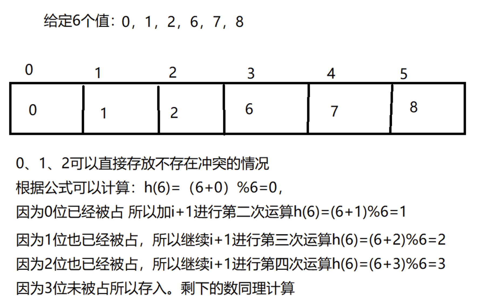
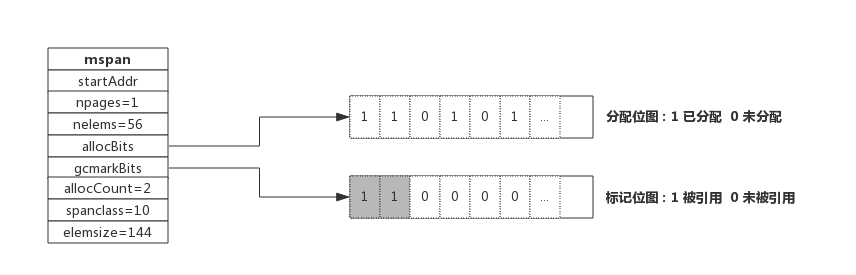

## 													golang 面试题

### 一、是么是面向对象

在了解 Go 语言 是不是面向对象（简称：OOP）之前，我们必须先知道 OOP 是啥，得先给它 ”下定义“。

根据Wikipedia的定义，我们梳理出 OOP 的几个基本认：

- 面向对象编程（OOP）是一种基于 "对象" 概念的编程范式，它可以包含数据和代码：数据以字段的形式存在（通常称为属性或属性），代码以程序的形式存在（通常为方法）。
- 对象自己的程序可以访问并经常修改自己的数据字段。
- 对象经常被定义为类的一个实例。
- 对象利用属性和方法的私有/受保护/公共可见性，对对象的内部状态收到保护，不受外界影响（被封装）。

#### 1.1 Go语言和Java有什么区别？

1. Go上不允许函数重载，必须具有方法和函数的唯一名称，而Java允许函数重载。
2. 在速度方面，Go的速度要比Java快。
3. Java默认允许多态，而Go没有。
4. Go语言使用HTTP协议进行路由配置，而Java使用Akka.routing.ConsistentHashingRouter和Akka.routing.ScatterGatherFirstCompletedRouter进行路由配置。
5. Go代码可以自动扩展到多个核心，而Java并不总是具有足够的可扩展性。
6. Go语言的继承通过匿名组合完成，基类以 Struct 的方式定义，子类只需要把基类作为成员放在子类的定义中，支持多继承；而Java的继承通过 extends 关键字完成，不支持多继承。

#### 1.2 Go是面向对象的语言吗？

是的，也不是。原因是：

1. Go有类型和方法，并且允许面向对象的编程风格，但没有类型层次。
2. Go中的 ”接口“ 概念提供了一种不同的方法，我们认为这种方法易于使用，而且在某些方面更加通用。还有一些方法可以将类型嵌入到其他类型中，以提供类似的东西，但不等同于子类。
3. Go 中的方法比 C++ 或Java中的方法更通用：它们可以为任何类型的数据定义，甚至是内置类型，如普通的、"未装箱的"整数。它们并不局限于结构（类）。

4. Go由于缺乏类型层次，Go中的 ”对象“ 比 C++ 或 Java 等语言更加轻巧。

#### 1.3 Go实现面向对象编程

##### 1.3.1 封装

面向对象中的 ”封装“ 指的是可以隐藏对象的颞部属性和实现细节，仅对外提供公开接口调用，这样子用户就不需要关注你内部是怎么实现的。

##### 1.3.2 在 Go  语言中的属性访问权限，通过首字母大小写来控制：

- 首字母大写，代表是公共的、可被外部访问的。
- 首字母小写，代表是私有的，不可以被外部访问。

Go 语言的例子如下：

```go
type Animal struct {
  name string;
}
func NewAnimal() *Animal {
  return &Animal{}
}
func (p *Animal) SetName(name string) {
  p.name = name
}
func (p *Animal) GetName() string {
  return p.name
}
```

在上述例子中，我们生命了一个结构体Animal，其属性 name 为小写。没法通过外部方法，在配套上存在 Setter 和 Getter 的方法，用于统一的访问和设置控制。

以此实现在 Go 语言中的基本封装。

##### 1.3.3 继承

面向对象中的 ”继承“ 指的是子类继承父类的特征和行为，使得子类对象（实例）具有父类的实例域和方法，或子类从父类继承方法，使得子类具有父类相同的行为。


从实际的例子来看，就是动物是一个大父类，下面又能细分为 ”食草动物“、”食肉动物“、这两者会包含 ”动物“  这个父类的基本定义。

##### 1.3.4 **在Go语言中，是没有类似 extends 关键字的这种继承的方式，在语言设计上采用的是组合的方式**：

```go
type Animal struct {
  Name string
}
type Cat struct {
  Animal
  FeatureA string
}
type Dog struct {
  Animal 
  FeatureB string
}
```

在上述例子中，我们声明了Cat 和Dog结构体，其在内部匿名组合了 Animal 结构体。因此 Cat 和 Dog 的实例都可以调用Animal结构体的方法：

```go
func main() {
  p := NewAnimal()
  p.SetName("我是伴鱼")
  
  dog := NewDog{Animal: *p}
  fmt.Println(dog.GetName())
}
```

同时 Cat 和 Dog 的实例可以拥有自己的方法：

```go
func (dog *Dog) HelloWorld() {
  fmt.Println("hello go")
}
func (cat *Cat) HelloWorld() {
  fmt.println("hello cat")
}
```

上述例子能够正常包含调用 Animal 的相关属性和方法，也能够拥有自己的独立属性和方法，在Go语言中表达了类似继承的效果。

##### 1.3.5 **多态**

面向对象中的 ”多态“ 指的同一个行为具有多种不同表现形式或形态的能力，具体是指一个类实例（对象）的相同方法在不同情形有不同表现形式。

多态也使得不同内部结构的对象可以共享相同的外部接口，也就是都是一套外部模板，内部实际是什么，只要符合规格就可以。

**在Go语言中，多态是通过接口来实现的**：

```go
type AnimalSounder interface {
  MakeDNA()
}
// 参数是AnimalSounder接口类型
func MakeSomeDNA(aninalSounder AnimalSounder) {
  aninalSounder.MakeDNA()
}
```

在上述例子中，我们声明了一个接口类型AnimalSounder，配套一个 MakeSomeDNA 方法，其接受 AnimalSounder接口类型作为参数。

因此在go语言中，只要配套的Cat和Dog的实例也实现了 MakeSomeDNA方法，那么我们就可以认为他是AnimalSounder接口类型：

```go
type AnimalSounder interface {
  MakeSounds()
}

func MakeSomeSounds(animalSounder AnimalSounder) {
  animalSounder.MakeSounds()
}
func (c *Cat) MakeSounds() {
  fmt.println("hello cat")
}
func (c *Dog) MakeSounds() {
  fmt.println("hello dog")
}
func main() {
  MakeSomeSounds(&Cat{})
  MakeSomeSounds(&Dog{})
}
```

当Cat 和 Dog 的实例实现了 AnimalSounder 接口类型的约束后，就意味着满足了条件，它们在 go 语言中就是一个东西。能够作为入参传入 MakeSomeSounds 方法中，在根据不同的实例实现多态行为。

在日常工作中，基本了解这些概念就可以了。若是面试，可以针对三大特性：”封装、继承、多态“ 和 五大原则 ”单一职责原则（SRP)“、开发封闭原则（OCP）、里式替换原则（LSP）、依赖倒置原则（DIP）、接口隔离原则（ISP）” 进行深入理解和说明。

### 二、基础部分

#### 2.1 golang 中 make 和 new 的区别？（基本必问）

**共同点**：给变量分配内存。

**不同点**：

1. 作用变量类型不同，new 给 string， int和数组分配内存， make给切片，map，channel 分配内存；
2. 返回类型不一样，new 返回执行变量的指针， make 返回变量本身；
3. new 分配的空间被清零。make 分配空间后，会进行初始化。
4. 字节的面试官还说了一个区别，就是分配的位置，在堆上还是栈上？

只要代码逻辑允许，编译器总是倾向于把变量分配在栈上，比分配在堆上更高效。编译器倾向于让变量不逃逸。（逃逸分析是指当函数局部变量的生命周期超过函数栈帧的生命周期时，编译器把该局部变量由栈分配改为堆分配，即变量从栈上逃逸到堆上）。

下面两个函数，返回值都是在堆上动态分配的int型变量的地址，编译器进行了逃逸分析。

```go
// go:noinline
func newInt1() *int{
    var a int
    return &a
}

// go:noinline
func newInt2() *int{
    return new(int)
}

func main(){
    println(*newInt1())
}
```

newInt1() 函数如果被分配在栈上，在函数返回后，栈帧被销毁，返回的变量a的地址会变成悬挂指针，对改地址所有读写都是不合法的，会造成程序逻辑错误或崩溃。

new() 与堆分配无必然联系，代码如下：

```go
func New() int{
  p := new(int)
  return *p
}
```

这个函数的 new()进行栈分配，因为变量的生命周期没有超过函数栈帧的生命周期。

把逻辑上没有逃逸的变量分配到堆上不会造成错误，只是效率低一些，但是把逻辑上逃逸了的变量分配到栈上就会造成悬挂指针等问题，因此编译器只有在能够确定变量没有逃逸的情况下才会把变量分配到栈上，在能够确定变量已经逃逸或者无法确定是否逃逸的情况，都要按照已经逃逸处理。

#### 2.2 数组和切片的区别（基本必问）

**相同点：**

1. 只能存储一组相同类型的数据结构。
2. 都是通过下标来访问，并且容量长度，长度通过len获取，容量通过 cap 获取。

**区别：**

1. **数组**是定长，访问和复制不能超过数组定义的长度，否则就会下标越界，**切片**长度和容量可以自动扩容。
2. 数组是值类型，切片是引用类型，每个切片都引用了一个底层数组，切片本身不存储任何数据，都是这底层数组存储数据，所以修改切片的时候修改的是底层数组中的数据。切片一旦扩容，指向一个新的底层数组，内存地址也就随之改变。

**简洁的回答**：

1. 定义方式不一样。
2. 初始化方式不一样，数组需要执行大小，大小不改变。
3. 在函数传递中，数组切片都是值传递。

**数组的定义：**

```go
var a1 [3]int
var a2 [...]int{1,2,3}
```

**切片的定义：**

```go
var a1 []int
var a2 := make([]int,3,5)
```

**数组的初始化：**

 ```go
 a1 := [...]int{1,2,3}
 a2 := [5]int{1,2,3}
 ```

**切片的初始化：**

```go
b := make([]int,3,5)
```

#### 2.3 IO多路复用

#### 2.4 for range 的时候它的地址会发生变化么？

答：在 for a,b := range c 遍历中，a 和 b 在内存中只会存在一份，即之后每次循环时遍历到的数据都是以值覆盖的方式赋给a和 b，a，b的内存地址始终不变。由于这个特性，for 循环里面如果开协诚，不要直接把 a 或者 b 的姿势传给协程。解决办法：在每次循环时，创建一个临时变量。

#### 2.5 go defer ，多个 defer 的顺序，defer 在什么时候会修改返回值？

作用：defer 延迟函数，释放资源，收尾工作；如释放锁，关闭文件，关闭连接；捕获panic；

避坑指南：defer 函数紧跟在资源打开后面，否则defer 可能得不到执行，导致内存泄露。

多个defer调用顺序是 LIFO （后入先出），defer后的操作可以理解为压入栈中。

defer ，return， return value （函数返回值）执行顺序：首先return，其次return value，最后defer。defer可以修改函数最终返回值，修改时机：有名返回值或者函数返回指针 参考：

```go
func b() (i int) { 	
    defer func() { 		
        i++ 		
        fmt.Println("defer2:", i) 	
    }() 	
    defer func() { 		
        i++ 		
        fmt.Println("defer1:", i) 	
    }() 	
    return i 
    //或者直接写成
    return 
} 
func main() { 	
    fmt.Println("return:", b()) 
} 
```

**函数返回指针**

```go
func c() *int { 	
    var i int 	
    defer func() { 		
        i++ 		
        fmt.Println("defer2:", i) 	
    }() 	
    defer func() { 		
        i++ 		
        fmt.Println("defer1:", i) 	
    }() 	
    return &i 
} 
func main() { 	
    fmt.Println("return:", *(c())) 
}
```

#### 2.6 uint 类型溢出问题

超过最大存储值如 uint8 最大是 255

```go
var a uint8 = 255

var b uint8 = 1

a + b = 0 总之类型溢出会出现难以意料的事。
```


#### 2.7 能介绍下 rune 类型吗？

相当于 int32 

golang 中的字符串底层实现是通过byte数组的，中文字符再unicode 下占2个字节，在 utf-8 编码下占3个字节，而golang默认编码正好是 utf-8。

byte 等同于int8 ，常用来处理 ascii 字符。

rune 等同于 int32，常用来处理 unicode 或 utf-8 字符。

```go
package main

import (
	"fmt"
	"unicode/utf8"
)

func main() {
	var str = "hello rune 张三"
	// golang 中 str 的底层是通过 byte 数组实现的，左移直接求len，实际是按照字节长度来计算的，所以一个汉字占了3个字节，算了3个长度
	fmt.Println("len(str) = ", len(str))
	fmt.Println("RuneCountInString = ",utf8.RuneCountInString(str))
	// 前面说到，字符串在底层的表示是一个字节序列。其中，英文字符占用 1 字节，中文字符占用 3 字节，
	// 所以得到的长度 17 显然是底层占用字节长度，而不是字符串长度，这时，便需要用到rune类型。
	fmt.Println("rune = ",len([]rune(str)))
}
// 结果如下
// len(str) =  17
// RuneCountInString =  13
// rune =  13
```

#### 2.8 golang 中解析 tag 是怎么实现的？反射原理是什么？（中高级肯定会问，比较难，需要自己去总结）


```go
package main

import (
	"fmt"
	"reflect"
)

type User struct {
	name string `json:name-field`
	age int
}

func main() {
	user := &User{"John Doe The Fourth", 20}
	field, ok := reflect.TypeOf(user).Elem().FieldByName("name")
	if !ok {
		panic("Field not found")
	}
	fmt.Println(getStructTag(field))
}
func getStructTag(f reflect.StructField) string {
	return string(f.Tag)
}
```

​	Go 中解析的 tag 是通过反射实现的，反射是指计算机程序在运行时（Run time）可以访问，检测和修改它本身状态或行为的一种能力或动态知道给定数据对象的类型和结构，并有机会修改它。反射将接口变量转换成反射对象 Type 和 value ； 反射可以通过反射对象 Value 还原成原先的接口变量；反射可以用来修改一个变量的值，前提是这个值可以被修改；tag 是啥？结构体支持标记，name string json: name-field 就是 json:name-field这部分。

```go
// 都是通过反射来实现的
gorm json yaml gRPC protobuf gin.Bind()
```

#### 2.9 调用函数传入结构体时，应该传值还是指针（Golang 都是传值）

​	Go 的函数参数传递都是值传递。所谓指传递：值在调用函数时将实际参数复制一份传递到函数中，这样在函数中如果对参数进行修改，将不会影响到实际参数。参数传递还有引用传递，所谓引用传递是指在调用函数时将实际参数的地址传递到函数中，那么在函数中对参数所进行的修改，将影响到实际参数。

​	因为 Go 里面的 map，slice，chan都是引用类型。变量区分【值类型】和【引用类型】。

- 值类型：变量和变量的值存在同一个位置。
- 引用类型：变量和变量的值是不同的位置，变量的值存储的是对值得引用。

但并不是 map，slice，chan 的所有的变量在函数内都能被修改，不同数据类型的底层存储结构和实现可能不太一样，情况也就不一样。

#### 2.10 goroutine 什么情况下会阻塞？

在 Go里面阻塞主要分为一下 4 种场景：

1. 由于原子，互斥量或通告操作调用导致 Goroutine 阻塞，调度器将把当前阻塞的 Goroutine 切换出去，重新调度 LRQ 上的其它 Goroutine；
2. 由于网络请求和 IO 操作导致 Goroutine 阻塞。Go程序提供了网络轮询器（NetPoller）来处理网络请求和 IO 操作的问题，其后台通过kqueue（MacOS），epoll（Linux）或 iocp（Windows）来实现 IO 多路复用。通过使用 NetPoller 进行网络系统调用，调度器可以防止 Goroutine 在进行这些系统调用时阻塞M。这可以让 M 执行 P 的LRQ中其他的 Goroutine，而不需要创建新的 M。执行网络系统调用不需要额外的 M，网络轮询器使用系统线程，它时刻处理一个有效的事件循环，有助于减少操作系统上的调度负载。用户层严重看到的 Goroutine 中的 ”block socket” ，实现 goroutine-per-connection 简单的网络编程模式。实际上是通过 Go runtime 中的netpoller 通过Non-block socket + IO 多路复用机制 “模拟”出来的。
3. 当调用一些系统方法的时候（如文件IO），如果系统方法调用的时候发生阻塞，这种情况下，网络轮询（NetPoller）无法使用，而进行系统调用的 G1 将阻塞当前 M1.调度器引入其它 M 来服务 M1 的P。
4. 如果在 Goroutine 去执行一个 sleep 操作，导致 M 被阻塞了。Go 程序后台有一个监控线程 sysmon，它监控那些长时间运行的 G 任务然后设置可以强占的标识符，别的 Goroutine 就可以抢先进来执行。

#### 2.11 讲讲 Go 的 select 底层数据结构和一些特性？（难点，没有项目经常可能说不清，面试一般会问你项目中怎么使用select）

​	Go 的select 为golang提供了多路 IO 复用机制，和其他 IO 复用一样，用于检测是否有读写时间是否 ready。Linux 的系统 IO 模型有，select， poll，epoll， go 的 select 和 linux 系统select 非常相似。

select 结构组成主要是由 case 语句和执行的函数组成 ，select 实现的多路复用是：每个线程或者进程都先注册和接受 channel （装置）注册，然后阻塞，然后只有一个线程在运输，当注册的线程和进程准备好数据后，装置会根据注册的信息得到相应的数据。

**select 的特征**

1. select 操作至少要有一个 case 语句，出现读写nil的channel该分支会忽略，在 nil 的channel上操作则会报错。
2. select 仅支持管道，而且是单协程操作。
3. 每个case语句仅能处理一个管道，要么读要么写。
4. 多个case语句的执行顺序是随机的。
5. 存在default语句，select 将不会阻塞，但是存在 default 会影响性能。

#### 2.12 讲讲Go的defer底层数据结构和一些特性？

每个defer语句都对应一个_defer实例，多个实例使用指针连接起来形成一个单链表，保存在 goroutine 数据结构中，每次插入 _defer 实例，军插入到链表的头部，函数结束再一次从头部去除，从而形成后进先出的效果。

**defer的规则总结：**

延迟函数的参数是 defer 语句出现的时候就已经确定了的。

延迟函数执行按照后进先出的顺序执行，即先出现的 defer 最后执行。

延迟函数可能操作主函数的返回值。

申请资源后立即使用 defer 关闭资源这个好习惯。

#### 2.13 单引号、双引号、反引号的区别？

单引号，表示byte类型或rune类型，对应uint8和int32类型，默认是rune类型。byte用来强调是raw data，而不是数字；而 rune用来表示 Unicode 的 code point。

双引号，才是字符串，实际上是字符数组。可以用索引号访问某字节，也可以用 len() 函数来获取字符串所占用的字节长度。

反引号，表示字符串字面量，但不支持任何转义序列。字面量 raw literal string 的意思是，你定时写的啥样，它就啥样，你有换行，它就换行。你写转义字符，他也就砖石转义字符。

#### 2.14 go出现panic的场景

https://www.cnblogs.com/paulwhw/p/15585467.html

- 数组/切片越界
- 空指针调用。比如访问一个 nil 结构体指针的成员
- 过早关闭 HTTP 响应体
- 除以 0
- 向已经关闭的 channel 发送消息
- 重复关闭 channel
- 关闭未初始化的 channel
- 未初始化 map。注意访问 map 不存在的 key 不会 panic，而是返回 map 类型对应的零值，但是不能直接赋值
- 跨协程的 panic 处理
- sync 计数为负数。
- 类型断言不匹配。`var a interface{} = 1; fmt.Println(a.(string))` 会 panic，建议用 `s,ok := a.(string)`

#### 2.15 go是否支持while循环，如何实现这种机制

Go 语言没有 while 和 do...while 语法，这一点和其他语言不同，需要格外注意一下，如果需要使用类似其它语言(比如 java / c 的 while 和 do...while )，可以通过 for 循环来实现其使用效果。

```go
package main
 
import "fmt"
 
func main() {
   // 使用while方式输出10句 "hello,world"
   // 循环变量初始化
   var i int = 1
   for {
      if i > 10 { // 循环条件
         break // 跳出for循环,结束for循环
      }
      fmt.Println("hello,world", i)
      i++ // 循环变量的迭代
   }
 
   fmt.Println("i=", i)
}
```

#### 2.15 go 里面如何实现set？

Go 中是不提供Set 类型的，Set是一个集合，其本质就是一个List，只是List里的元素不能重复。

Go 提供了 map 类型，但是我们知道，map类型的key是不能重复的，因此，我们可以利用这一点，来实现一个set。那 value 呢？value我们可以用一个常量来代替，比如一个空结构体，实际上空结构体不占任何内存，使用空结构体，能够帮我们节省内存空间，提高性能。

#### 2.16 go 如何实现类似于java当中的继承机制？

说到继承我们都知道，在Go中没有extends关键字，也就意味着Go并没有原生级别的继承支持。这也是为什么我在文章开头用了**伪继承**这个词。本质上，Go使用interface实现的功能叫组合，Go是使用组合来实现的继承，说的更精确一点，是使用组合来代替的继承，举个很简单的例子:

**通过组合实现了继承：**

```go
type Animal struct {
    Name string
}

func (a *Animal) Eat() {
    fmt.Printf("%v is eating", a.Name)
    fmt.Println()
}

type Cat struct {
    *Animal
}

cat := &Cat{
    Animal: &Animal{
        Name: "cat",
    },
}
cat.Eat() // cat is eating
```

**首先**，我们实现了一个Animal的结构体，代表动物类。并声明了Name字段，用于描述动物的名字。

**然后**，实现了一个以Animal为receiver的Eat方法，来描述动物进食的行为。

**最后**，声明了一个Cat结构体，组合了Cat字段。再实例化一个猫，调用Eat方法，可以看到会正常的输出。

可以看到，Cat结构体本身没有Name字段，也没有去实现Eat方法。唯一有的就是组合了Animal父类，至此，我们就证明了已经通过组合实现了继承。

**总结：**

- 如果一个 struct 嵌套了另一个匿名结构体，那么这个结构可以直接访问匿名结构体的属性和方法，从而实现继承。
- 如果一个 struct 嵌套了另一个有名的结构体，那么这个模式叫做组合。
- 如果一个 struct 嵌套了多个匿名结构体，那么这个结构可以直接访问多个匿名结构体的属性和方法，从而实现多重继承。

#### 2.17 怎么去复用一个接口的方法？

```go
package main

import "fmt"

type USB interface {
	Stop()
	Start()
}
type IPhone struct {
	name string
}

func (i IPhone) Start() {
	fmt.Println("IPhone Start name = ", i.name)
}
func (i IPhone) Stop() {
	fmt.Println("IPhone Stop name = ", i.name)
}

type Camera struct {
	name string
}

func (c Camera) Start() {
	fmt.Println("camera name = ", c.name)
}
func (c Camera) Stop() {
	fmt.Println("camera stop name = ", c.name)
}

type Computer struct {
	name string
}

func (cp Computer) Working(usb USB) {
	usb.Start()
	usb.Stop()
}
func main() {
	phone := IPhone{
		name: "苹果",
	}
	camera := Camera{
		name: "佳能",
	}
	computer := Computer{
		name: "Mac",
	}
	computer.Working(phone)
	computer.Working(camera)
}
```

#### 2.19 go里面的 _

1. **忽略返回值**
2. 比如某个函数返回三个参数，但是我们只需要其中的两个，另外一个参数可以忽略，这样的话代码可以这样写：

```go
v1, v2, _ := function(...)
v1, _, _ := function(...)
```

3. **用在变量(特别是接口断言)**

```go
type T struct{}
var _ X = T{}
//其中 I为interface
```

上面用来判断 type T是否实现了X,用作类型断言，如果T没有实现接口X，则编译错误.

4. **用在import package**

```go
import _ "test/food"
```

引入包时，会先调用包中的初始化函数，这种使用方式仅让导入的包做初始化，而不使用包中其他功能

#### 2.20 goroutine 创建的时候如果要传入一个参数进去有什么要注意的点？

```go
// 3. 正确示范
for _, i := range a {
    fmt.Printf("-----%s---\n", i)
    go func(a string) {
        //time.Sleep(time.Second * 4)
        testDomain(a)
    }(i)
}
// 这种操作会先将i的值传递给形参a，i的变化不会对testDomain方法的执行产生影响
```

#### 2.21 写go单元测试的规范？

1. **单元测试文件命名规则 ：**

单元测试需要创建单独的测试文件，不能在原有文件中书写，名字规则为 xxx_test.go。这个规则很好理解。

2. **单元测试包命令规则**

单元测试文件的包名为原文件的包名添加下划线接test，举例如下：

```go
// 原文件包名：
package xxx
// 单元测试文件包名：
package xxx_test
```

3. **单元测试方法命名规则**

单元测试文件中的测试方法和原文件中的待测试的方法名相对应，以Test开头，举例如下：

```go
// 原文件方法：
func Xxx(name string) error 
// 单元测试文件方法：
func TestXxx()
```

4. **单元测试方法参数**

单元测试方法的参数必须是t *testing.T，举例如下：

```go
func TestZipFiles(t *testing.T) { ...
```

#### 2.22 单步调试？

https://www.jianshu.com/p/21ed30859d80

#### 2.23 导入一个go的工程，有些依赖找不到，改怎么办？

https://www.cnblogs.com/niuben/p/16182001.html

#### 2.24 [值拷贝 与 引用拷贝，深拷贝 与 浅拷贝](https://www.cnblogs.com/yizhixiaowenzi/p/14664222.html)

map，slice，chan 是引用拷贝；引用拷贝 是 浅拷贝

其余的，都是 值拷贝；值拷贝 是 深拷贝

**深浅拷贝的本质区别**：

是否真正获取对象实体，而不是引用

**深拷贝：**

拷贝的是数据本身，创造一个新的对象，并在内存中开辟一个新的内存地址，与原对象是完全独立的，不共享内存，修改新对象时不会影响原对象的值。释放内存时，也没有任何关联。

**值拷贝：**

接收的是 整个array的值拷贝，所以方法对array中元素的重新赋值不起作用。

```go
package main  

import "fmt"  

func modify(a [3]int) {  
    a[0] = 4  
    fmt.Println("modify",a)             // modify [4 2 3]
}  

func main() {  
    a := [3]int{1, 2, 3}  
    modify(a)  
    fmt.Println("main",a)                  // main [1 2 3]
}  
```

**浅拷贝：**

拷贝的是数据地址，只复制指向的对象的指针，新旧对象的内存地址是一样的，修改一个另一个也会变。释放内存时，同时释放。

**引用拷贝：**

函数的引用拷贝与原始的引用指向同一个数组，所以对数组中元素的修改，是有效的

```go
package main  
  
import "fmt"  
  
func modify(s []int) {  
    s[0] = 4  
    fmt.Println("modify",s)          // modify [4 2 3]
}  
  
func main() {  
    s := []int{1, 2, 3}  
    modify(s)  
    fmt.Println("main",s)              // main [4 2 3]
}
```

### 三、slice 切片

#### **3.1 数组和切片的区别 （基本必问）**

1. **相同点：**

- 只能存储一组相同类型的数据结构

- 都是通过下标来访问，并且有容量长度，长度通过 len 获取，容量通过 cap 获取

2. **区别：**

- 数组是定长，访问和复制不能超过数组定义的长度，否则就会下标越界，切片长度和容量可以自动扩容

- 数组是值类型，切片是引用类型，每个切片都引用了一个底层数组，切片本身不能存储任何数据，都是这底层数组存储数据，所以修改切片的时候修改的是底层数组中的数据。切片一旦扩容，指向一个新的底层数组，内存地址也就随之改变

3. **简洁的回答：**

- 定义方式不一样 2）初始化方式不一样，数组需要指定大小，大小不改变 3）在函数传递中，数组切片都是值传递。

4. **数组的定义**

```go
var a1 [3]int

var a2 [...]int{1,2,3}
```

5. **切片的定义**

```go
var a1 []int

var a2 := make([]int,3,5)
```

6. **数组的初始化**

```go
a1 := [...]int{1,2,3}

a2 := [5]int{1,2,3}
```

7. **切片的初始化**

```go
b := make([]int,3,5)
```

#### **3.2 讲讲 Go 的 slice 底层数据结构和一些特性？**

答：Go 的 slice 底层数据结构是由一个 array 指针指向底层数组，len 表示切片长度，cap 表示切片容量。slice 的主要实现是扩容。对于 append 向 slice 添加元素时，假如 slice 容量够用，则追加新元素进去，slice.len++，返回原来的 slice。当原容量不够，则 slice 先扩容，扩容之后 slice 得到新的 slice，将元素追加进新的 slice，slice.len++，返回新的 slice。对于切片的扩容规则：当切片比较小时（容量小于 1024），则采用较大的扩容倍速进行扩容（新的扩容会是原来的 2 倍），避免频繁扩容，从而减少内存分配的次数和数据拷贝的代价。当切片较大的时（原来的 slice 的容量大于或者等于 1024），采用较小的扩容倍速（新的扩容将扩大大于或者等于原来 1.25 倍），主要避免空间浪费，网上其实很多总结的是 1.25 倍，那是在不考虑内存对齐的情况下，实际上还要考虑内存对齐，扩容是大于或者等于 1.25 倍。

（关于刚才问的 slice 为什么传到函数内可能被修改，如果 slice 在函数内没有出现扩容，函数外和函数内 slice 变量指向是同一个数组，则函数内复制的 slice 变量值出现更改，函数外这个 slice 变量值也会被修改。如果 slice 在函数内出现扩容，则函数内变量的值会新生成一个数组（也就是新的 slice，而函数外的 slice 指向的还是原来的 slice，则函数内的修改不会影响函数外的 slice。）

#### 3.3 golang中数组和slice作为参数的区别？slice作为参数传递有什么问题？

https://blog.csdn.net/weixin_44387482/article/details/119763558

1. 当使用数组作为参数和返回值的时候，传进去的是值，在函数内部对数组进行修改并不会影响原数据
2. 当切片作为参数的时候穿进去的是值，也就是值传递，但是当我在函数里面修改切片的时候，我们发现源数据也会被修改，这是因为我们在切片的底层维护这一个匿名的数组，当我们把切片当成参数的时候，会重现创建一个切片，但是创建的这个切片和我们原来的数据是共享数据源的，所以在函数内被修改，源数据也会被修改
3. 数组还是切片，在函数中传递的时候如果没有指定为指针传递的话，都是值传递，但是切片在传递的过程中，有着共享底层数组的风险，所以如果在函数内部进行了更改的时候，会修改到源数据，所以我们需要根据不同的需求来处理，如果我们不希望源数据被修改话的我们可以使用copy函数复制切片后再传入，如果希望源数据被修改的话我们应该使用指针传递的方式

### **四、map相关**

#### 4.1 map 使用注意的点，是否并发安全？

map的类型是map[key]，key类型的ke必须是可比较的，通常情况，会选择内建的基本类型，比如整数、字符串做key的类型。如果要使用struct作为key，要保证struct对象在逻辑上是不可变的。在Go语言中，map[key]函数返回结果可以是一个值，也可以是两个值。map是无序的，如果我们想要保证遍历map时元素有序，可以使用辅助的数据结构，例如orderedmap。

**第一**、 一定要先初始化，否则panic

**第二** 、map类型是容易发生并发访问问题的。不注意就容易发生程序运行时并发读写导致的panic。 Go语言内建的map对象不是线程安全的，并发读写的时候运行时会有检查，遇到并发问题就会导致panic。

#### 4.2 map 循环是有序的还是无序的？

无序的, map 因扩张⽽重新哈希时，各键值项存储位置都可能会发生改变，顺序自然也没法保证了，所以官方避免大家依赖顺序，直接打乱处理。就是 for range map 在开始处理循环逻辑的时候，就做了随机播种

#### 4.3 map 中删除一个 key，它的内存会释放么？（常问）

如果删除的元素是值类型，如int，float，bool，string以及数组和struct，map的内存不会自动释放

如果删除的元素是引用类型，如指针，slice，map，chan等，map的内存会自动释放，但释放的内存是子元素应用类型的内存占用

将map设置为nil后，内存被回收。

**这个问题还需要大家去搜索下答案，我记得有不一样的说法，谨慎采用本题答案。**

#### 4.4 怎么处理对 map 进行并发访问？有没有其他方案？ 区别是什么？

##### 4.4.1 map 是什么

map 是 Go 中用于存储key-value关系数据的数据结构，类似 C++ 中的 map。Go 中 map 的使用很简单，但是对于初学者，经常会犯两个错误：没有初始化，并发读写。

1. 未初始化的 map 都是 nil，直接赋值 panic。map 作为结构体成员的时候，很容易忘记对它的初始化。
2. 并发读写使我们使用 map 中很常见的一个错误。多个协程读写同一个 key 的时候，会出现冲突，导致 panic。

Go 内置的 map 类型并没有对并发场景进行优化，但是并发场景又很常见，如何实现线程安全（并发安全）的 map 就很重要。

##### 4.4.2 三种线程安全的 map

1. **加读写锁（RWMutex）**

这是最容易想到的一种方式。常见的 map 的操作有增删改查和遍历，这里面查和遍历是读操作，增删改是写操作，因此对查和遍历需要加读锁，对增删改需要加写锁。

以 map[int]int 为例，借助 RWMutex，具体的实现方式如下:

```go
type RWMap struct { // 一个读写锁保护的线程安全的map
    sync.RWMutex // 读写锁保护下面的map字段
    m map[int]int
}
// 新建一个RWMap
func NewRWMap(n int) *RWMap {
    return &RWMap{
        m: make(map[int]int, n),
    }
}
func (m *RWMap) Get(k int) (int, bool) { //从map中读取一个值
    m.RLock()
    defer m.RUnlock()
    v, existed := m.m[k] // 在锁的保护下从map中读取
    return v, existed
}
 
func (m *RWMap) Set(k int, v int) { // 设置一个键值对
    m.Lock()              // 锁保护
    defer m.Unlock()
    m.m[k] = v
}
 
func (m *RWMap) Delete(k int) { //删除一个键
    m.Lock()                   // 锁保护
    defer m.Unlock()
    delete(m.m, k)
}
 
func (m *RWMap) Len() int { // map的长度
    m.RLock()   // 锁保护
    defer m.RUnlock()
    return len(m.m)
}
 
func (m *RWMap) Each(f func(k, v int) bool) { // 遍历map
    m.RLock()             //遍历期间一直持有读锁
    defer m.RUnlock()
 
    for k, v := range m.m {
        if !f(k, v) {
            return
        }
    }
}
```

2. **分片加锁**

通过读写锁RWMutex 实现的线程安全的  map，功能上已经完全满足需求，但是要面对高并发的场景，仅仅功能满足可不行，性能也得跟上。锁是性能下降的万恶之源之一。所以并发编程的原则就是尽可能的减少锁的使用。当锁不得可用的时候，可以减小锁的力度和持有的时间。

在第一种方法中，加锁的对象是整个map，协程A对 map 中的 key 进行修改操作，会导致其它协程无法对其它 key 进行读写操作。一种解决思路是将这个 map 分成 n 快，每个块之间的读写操作互不干扰，从而降低冲突的可能性。

Go 比较知名的分配 map 的实现是 orcaman/concurrent-map，它的定义如下：

```go
var SHARD_COUNT = 32
   
// 分成SHARD_COUNT个分片的map
type ConcurrentMap []*ConcurrentMapShared
   
// 通过RWMutex保护的线程安全的分片，包含一个map
type ConcurrentMapShared struct {
    items        map[string]interface{}
    sync.RWMutex // Read Write mutex, guards access to internal map.
}
   
// 创建并发map
func New() ConcurrentMap {
    m := make(ConcurrentMap, SHARD_COUNT)
    for i := 0; i < SHARD_COUNT; i++ {
        m[i] = &ConcurrentMapShared{items: make(map[string]interface{})}
    }
    return m
}
   
 
// 根据key计算分片索引
func (m ConcurrentMap) GetShard(key string) *ConcurrentMapShared {
    return m[uint(fnv32(key))%uint(SHARD_COUNT)]
}
```

ConcurrentMap 其实就是一个切片，切片的每个元素都是第一种方法中携带了读写锁的 map。

这里面 GetShard 方法就是用来计算每一个 key 应该分配到哪个分片上。

再来看一下 Set 和 Get 操作。

```go
func (m ConcurrentMap) Set(key string, value interface{}) {
    // 根据key计算出对应的分片
    shard := m.GetShard(key)
    shard.Lock() //对这个分片加锁，执行业务操作
    shard.items[key] = value
    shard.Unlock()
}
 
func (m ConcurrentMap) Get(key string) (interface{}, bool) {
    // 根据key计算出对应的分片
    shard := m.GetShard(key)
    shard.RLock()
    // 从这个分片读取key的值
    val, ok := shard.items[key]
    shard.RUnlock()
    return val, ok
}
```

Get 和 Set 方法类似，都是根据 key 用 GetShard 计算出分片索引，找到对应的 map 块，执行读写操作。

3. sync 中的 map

分片加锁的思路是将大块的数据切分成小块的数据，从而减少冲突导致锁阻塞的可能性。如果在一些特殊的场景下，将读写数据分开，是不是能在进一步提升性能呢？

在内置的 sync 包中（Go 1.9+）也有一个线程安全的 map，通过将读写分离的方式实现了某些特定场景下的性能提升。

其实在生产环境中，sync.map 用的很少，官方文档推荐的两种使用场景是：

> a) when the entry for a given key is only ever written once but read many times, as in caches that only grow.
> b) when multiple goroutines read, write, and overwrite entries for disjoint sets of keys.

两种场景都比较苛刻，要么是一写多读，要么是各个协程操作的 key 集合没有交集（或者交集很少）。所以官方建议先对自己的场景做性能测评，如果确实能显著提高性能，再使用 sync.map。

sync.map 的整体思路就是用两个数据结构（只读的 read 和可写的 dirty）尽量将读写操作分开，来减少锁对性能的影响。

下面详细看下 sync.map 的定义和增删改查实现。

3. **sync.map 数据结构定义** 

```go
type Map struct {
    mu Mutex
    // 基本上你可以把它看成一个安全的只读的map
    // 它包含的元素其实也是通过原子操作更新的，但是已删除的entry就需要加锁操作了
    read atomic.Value // readOnly
 
    // 包含需要加锁才能访问的元素
    // 包括所有在read字段中但未被expunged（删除）的元素以及新加的元素
    dirty map[interface{}]*entry
 
    // 记录从read中读取miss的次数，一旦miss数和dirty长度一样了，就会把dirty提升为read，并把dirty置空
    misses int
}
 
type readOnly struct {
    m       map[interface{}]*entry
    amended bool // 当dirty中包含read没有的数据时为true，比如新增一条数据
}
 
// expunged是用来标识此项已经删掉的指针
// 当map中的一个项目被删除了，只是把它的值标记为expunged，以后才有机会真正删除此项
var expunged = unsafe.Pointer(new(interface{}))
 
// entry代表一个值
type entry struct {
    p unsafe.Pointer // *interface{}
}
```

Map 的定义中，read 字段通过 atomic.Values 存储被高频读的 readOnly 类型的数据。dirty 存储

4. **Store 方法**

Store 方法用来设置一个键值对，或者更新一个键值对。

```go
func (m *Map) Store(key, value interface{}) {
    read, _ := m.read.Load().(readOnly)
    // 如果read字段包含这个项，说明是更新，cas更新项目的值即可
    if e, ok := read.m[key]; ok && e.tryStore(&value) {
        return
    }
 
    // read中不存在，或者cas更新失败，就需要加锁访问dirty了
    m.mu.Lock()
    read, _ = m.read.Load().(readOnly)
    if e, ok := read.m[key]; ok { // 双检查，看看read是否已经存在了
        if e.unexpungeLocked() {
            // 此项目先前已经被删除了，需要添加到 dirty 中
            m.dirty[key] = e
        }
        e.storeLocked(&value) // 更新
    } else if e, ok := m.dirty[key]; ok { // 如果dirty中有此项
        e.storeLocked(&value) // 直接更新
    } else { // 否则就是一个新的key
        if !read.amended { //如果dirty为nil
            // 需要创建dirty对象，并且标记read的amended为true,
            // 说明有元素它不包含而dirty包含
            m.dirtyLocked()
            m.read.Store(readOnly{m: read.m, amended: true})
        }
        m.dirty[key] = newEntry(value) //将新值增加到dirty对象中
    }
    m.mu.Unlock()
}
 
// tryStore利用 cas 操作来更新value。
// 更新之前会判断这个键值对有没有被打上删除的标记
func (e *entry) tryStore(i *interface{}) bool {
    for {
        p := atomic.LoadPointer(&e.p)
        if p == expunged {
            return false
        }
        if atomic.CompareAndSwapPointer(&e.p, p, unsafe.Pointer(i)) {
            return true
        }
    }
}
 
// 将值设置成 nil，表示没有被删除
func (e *entry) unexpungeLocked() (wasExpunged bool) {
    return atomic.CompareAndSwapPointer(&e.p, expunged, nil)
}
 
// 通过复制 read 生成 dirty
func (m *Map) dirtyLocked() {
    if m.dirty != nil {
        return
    }
 
    read, _ := m.read.Load().(readOnly)
    m.dirty = make(map[interface{}]*entry, len(read.m))
    for k, e := range read.m {
        if !e.tryExpungeLocked() {
            m.dirty[k] = e
        }
    }
}
 
// 标记删除
func (e *entry) tryExpungeLocked() (isExpunged bool) {
    p := atomic.LoadPointer(&e.p)
    for p == nil {
        if atomic.CompareAndSwapPointer(&e.p, nil, expunged) {
            return true
        }
        p = atomic.LoadPointer(&e.p)
    }
    return p == expunged
}
```

第2-6行，通过 cas 进行键值对更新，更新成功直接返回。

第8-28行，通过互斥锁加锁来处理处理新增键值对和更新失败的场景（键值对被标记删除）。

第11行，再次检查 read 中是否已经存在要 Store 的 key（双检查是因为之前检查的时候没有加锁，中途可能有协程修改了 read）。

如果该键值对之前被标记删除，先将这个键值对写到 dirty 中，同时更新 read。

如果 dirty 中已经有这一项了，直接更新 read。

如果是一个新的 key。dirty 为空的情况下通过复制 read 创建 dirty，不为空的情况下直接更新 dirty。

5. **Load 方法**

Load 方法比较简单，先是从 read 中读数据，读不到，再通过互斥锁锁从 dirty 中读数据。

```go
func (m *Map) Load(key interface{}) (value interface{}, ok bool) {
    // 首先从read处理
    read, _ := m.read.Load().(readOnly)
    e, ok := read.m[key]
    if !ok && read.amended { // 如果不存在并且dirty不为nil(有新的元素)
        m.mu.Lock()
        // 双检查，看看read中现在是否存在此key
        read, _ = m.read.Load().(readOnly)
        e, ok = read.m[key]
        if !ok && read.amended {//依然不存在，并且dirty不为nil
            e, ok = m.dirty[key]// 从dirty中读取
            // 不管dirty中存不存在，miss数都加1
            m.missLocked()
        }
        m.mu.Unlock()
    }
    if !ok {
        return nil, false
    }
    return e.load() //返回读取的对象，e既可能是从read中获得的，也可能是从dirty中获得的
}
 
func (m *Map) missLocked() {
    m.misses++ // misses计数加一
    if m.misses < len(m.dirty) { // 如果没达到阈值(dirty字段的长度),返回
        return
    }
    m.read.Store(readOnly{m: m.dirty}) //把dirty字段的内存提升为read字段
    m.dirty = nil // 清空dirty
    m.misses = 0  // misses数重置为0
}
```

这里需要注意的是，如果出现多次从 read 中读不到数据，得到 dirty 中读取的情况，就直接把 dirty 升级成 read，以提高 read 效率。

6. **Delete 方法**

下面是 Go1.13 中 Delete 的实现方式，如果 key 在 read 中，就将值置成 nil；如果在 dirty 中，直接删除 key。

```go
func (m *Map) Delete(key interface{}) {
    read, _ := m.read.Load().(readOnly)
    e, ok := read.m[key]
    if !ok && read.amended {
        m.mu.Lock()
        read, _ = m.read.Load().(readOnly)
        e, ok = read.m[key]
        if !ok && read.amended { // 说明可能在
            delete(m.dirty, key)
        }
        m.mu.Unlock()
    }
    if ok {
        e.delete()
    }
}
 
func (e *entry) delete() (hadValue bool) {
    for {
        p := atomic.LoadPointer(&e.p)
        if p == nil || p == expunged {
            return false
        }
        if atomic.CompareAndSwapPointer(&e.p, p, nil) {
            return true
        }
    }
}
```

补充说明一下，delete() 执行完之后，e.p 变成 nil，下次 Store 的时候，执行到 dirtyLocked() 这一步的时候，会被标记成 enpunged。因此在 read 中 nil 和 enpunged 都表示删除状态。

7. **sync.map 总结**

上面对源码粗略的梳理了一遍，最后在总结一下 sync.map 的实现思路：

- 读写分离。读（更新）相关的操作尽量通过不加锁的 read 实现，写（新增）相关的操作通过 dirty 加锁实现。
- 动态调整。新写入的 key 都只存在 dirty 中，如果 dirty 中的 key 被多次读取，dirty 就会上升成不需要加锁的 read。
- 延迟删除。Delete 只是把被删除的 key 标记成 nil，新增 key-value 的时候，标记成 enpunged；dirty 上升成 read 的时候，标记删除的 key 被批量移出 map。这样的好处是 dirty 变成 read 之前，这些 key 都会命中 read，而 read 不需要加锁，无论是读还是更新，性能都很高。

总结了 sync.map 的设计思路后，我们就能理解官方文档推荐的 sync.map 的两种应用场景了。

8. **总结**

Go 内置的 map 使用起来很方便，但是在并发频繁的 Go 程序中很容易出现并发读写冲突导致的问题。本文介绍了三种常见的线程安全 map 的实现方式，分别是读写锁、分片锁和 sync.map。

较常使用的是前两种，而在特定的场景下，sync.map 的性能会有更优的表现。

##### 4.4.3 nil map和空 map 有何不同？

1. 可以对未初始化的 map 进行取值，但取出来的东西是空：

```go
var m map[string]string
fmt.println(m["1"])
```

2. 不能对为初始化的 map 进行复制，这样将会抛出一个异常：

未初始化的 map 是 nil，它与一个空 map 基本等价，只是 nil 的map 不允许往里面添加值。

```go
var m1 map[string]string
m1["1"] = "1"
panic: assignment to entry in nil map

//因此，map是nil时，取值是不会报错的（取不到而已），但增加值会报错。

//其实，还有一个区别，delete一个nil map会panic，
//但是delete 空map是一个空操作（并不会panic）
//（这个区别在最新的Go tips中已经没有了，即：delete一个nil map也不会panic）
```

3. 通过 fmt 打印 map 时，空 map 和 nil  map 结果是一样的，都为 map[]。所以，这个时候别判定 map 是空还是 nil，而应该通过map == nil 来判断。

   **nil map 未初始化，空 map 是长度为空**

##### 4.4.4 map的数据结构是什么

golang 中 map 是一个  kv 对集合。底层使用 hash table，用链表来解决冲突，出现冲突时，不是每一个 key 都申请一个结构通过链表串起来，而是以 bmap 为最小粒度挂载，一个bmap 可以放 8 个 kv。在哈希函数的选择上，会在程序启动时，检测 cpu 是否支持 aes，如果支持，则使用 aes hash，否则使用 memhash。每个 map 的底层结构是 hmap，是有若干个结构为 bmap的 bucket 组成的数组。每个 bucket 底层都采用链表结构。

**hmap 的结构如下**：

```go
type hmap struct {     
    count     int                  // 元素个数     
    flags     uint8     
    B         uint8                // 扩容常量相关字段B是buckets数组的长度的对数 2^B     
    noverflow uint16               // 溢出的bucket个数     
    hash0     uint32               // hash seed     
    buckets    unsafe.Pointer      // buckets 数组指针     
    oldbuckets unsafe.Pointer      // 结构扩容的时候用于赋值的buckets数组     
    nevacuate  uintptr             // 搬迁进度     
    extra *mapextra                // 用于扩容的指针 
}
```

**下图展示一个拥有4个bucket的map：**


本例中, hmap.B=2， 而hmap.buckets长度是2^B为4. 元素经过哈希运算后会落到某个bucket中进行存储。查找过程类似。

bucket很多时候被翻译为桶，所谓的哈希桶实际上就是bucket。

**bucket数据结构**

bucket数据结构由runtime/map.go:bmap定义：

```go
type bmap struct {
    tophash [8]uint8 //存储哈希值的高8位
    data    byte[1]  //key value数据:key/key/key/.../value/value/value...
    overflow *bmap   //溢出bucket的地址
}
```

每个bucket可以存储8个键值对。

- tophash是个长度为8的数组，哈希值相同的键（准确的说是哈希值低位相同的键）存入当前bucket时会将哈希值的高位存储在该数组中，以方便后续匹配。
- data区存放的是key-value数据，存放顺序是key/key/key/…value/value/value，如此存放是为了节省字节对齐带来的空间浪费。
- overflow 指针指向的是下一个bucket，据此将所有冲突的键连接起来。

注意：上述中data和overflow并不是在结构体中显示定义的，而是直接通过指针运算进行访问的。

下图展示bucket存放8个key-value对：


**解决哈希冲突（四种方法）**

1. **了解哈希表及哈希冲突**

> 哈希表：是一种实现关联数组抽象数据类型的数据结构，这种结构可以将关键码映射到给定值。简单来说哈希表（key-value）之间存在一个映射关系，是键值对的关系，一个键对应一个值。
>
> 哈希冲突：当两个不同的数经过哈希函数计算后得到了同一个结果，即他们会被映射到哈希表的同一个位置时，即称为发生了哈希冲突。简单来说就是哈希函数算出来的地址被别的元素占用了。

2. **解决哈希冲突办法**

> ①：开放地址法：我们在遇到哈希冲突时，去寻找一个新的空闲的哈希地址。
>
> 举例：就是当我们去教室上课，发现该位置已经存在人了，所以我们应该寻找新的位子坐下，这就是开放定址法的思路。如何寻找新的位置就通过以下几种方法实现
>
> - 线性探测法
>
>   当我们所需要存放值的位置被占用了，我们就往后面一直加 1 并对 m 取模直到存在一个空余的地址供我们存放值，取模是为了保证找到的位置 0~m-1 的有效空间之中。
>
>   
>
>   存在问题：出现非同义词冲突（两个不想同的哈希值，抢占同一个后续的哈希地址）被称为堆积或聚集现象。
>
> - 平方探测法（二次探测）
>
>   当我们的所需要存放值的位置被占了，会前后寻找而不是单独方向的寻找。
>
>           公式：h(x)=(Hash(x) +i)mod (Hashtable.length);（i依次为+(i^2)和-(i^2)）
>                   
>           举例：
>
>   

​	

> ②：再哈希法：同时构造多个不同的哈希函数，等发生哈希冲突时就使用第二个、第三个……等其他的哈希函数计算地址，直到不发生冲突为止。虽然不易发生聚集，但是增加了计算时间。
>
> ③：链地址法：将所有哈希地址相同的记录都链接在同一链表中。
>
> 公式：h(x)=xmod(Hashtable.length);
>
> 
>
> ④：建立公共溢出区：将哈希表分为基本表和溢出表，将发生冲突的都存放在溢出表中。

3. **哈希冲突**

当有两个或以上数量的键被哈希到了同一个bucket时，我们称这些键发生了冲突。Go使用链地址法来解决键冲突。 由于每个bucket可以存放8个键值对，所以同一个bucket存放超过8个键值对时就会再创建一个键值对，用类似链表的方式将bucket连接起来。

下图展示产生冲突后的map：


bucket数据结构指示下一个bucket的指针称为overflow bucket，意为当前bucket盛不下而溢出的部分。事实上哈希冲突并不是好事情，它降低了存取效率，好的哈希算法可以保证哈希值的随机性，但冲突过多也是要控制的，后面会再详细介绍。

4. 负载因子

负载因子用于衡量一个哈希表冲突情况，公式为：

负载因子 = 键数量/bucket数量

例如，对于一个bucket数量为4，包含4个键值对的哈希表来说，这个哈希表的负载因子为1.

哈希表需要将负载因子控制在合适的大小，超过其阀值需要进行rehash，也即键值对重新组织：

- 哈希因子过小，说明空间利用率低
- 哈希因子过大，说明冲突严重，存取效率低

每个哈希表的实现对负载因子容忍程度不同，比如Redis实现中负载因子大于1时就会触发rehash，而Go则在在负载因子达到6.5时才会触发rehash，因为Redis的每个bucket只能存1个键值对，而Go的bucket可能存8个键值对，所以Go可以容忍更高的负载因子。

##### 4.4.5 map 怎么实现扩容？

- map的容量大小：

  底层调用 makemap 函数，计算得到合适的 B，map 容量最多可容纳 6.25^B个元素，6.5 为装载因子阈值常量。装载因子的计算公式是：装载因子 = 装入表中的元素个数/散列表的长度，装载因子越大，说明空闲位置越少，冲突越多，散列表的性能会下降。底层调用 makemap 函数，计算得到合适的B，map 容量最多可容纳 6.25^B 个元素，6.5 为装载因子阈值常量。装载因子的计算公式是：装载因子 = 填入表中的元素个数/散列表的长度，装载因子越大，说明空闲位置越少，冲突越多，散列表的性能会下降。

- 触发 map 扩容的条件：

  为了保证访问效率，当新元素将要添加进 map 时，都会检查是否需要扩容，扩容实际上是以空间换时间的手段。触发扩容的条件有二个：

  1. 负载因子 > 6.5时，也即平均每个bucket存储的键值对达到6.5个。
  2. overflow数量 > 2^15时，也即overflow数量超过32768时。

**增量扩容**

当负载因子过大时，就新建一个bucket，新的bucket长度是原来的2倍，然后旧bucket数据搬迁到新的bucket。 考虑到如果map存储了数以亿计的key-value，一次性搬迁将会造成比较大的延时，Go采用逐步搬迁策略，即每次访问map时都会触发一次搬迁，每次搬迁2个键值对。

下图展示了包含一个bucket满载的map(为了描述方便，图中bucket省略了value区域):


当前map存储了7个键值对，只有1个bucket。此地负载因子为7。再次插入数据时将会触发扩容操作，扩容之后再将新插入键写入新的bucket。

当第8个键值对插入时，将会触发扩容，扩容后示意图如下：


hmap 数据结构中 oldbuckets成员值身bucket，而buckets指向了新申请的bucket。新的键值对被插入新的bucket中。后续对map的访问操作会触发迁移，将oldbuckets中的键值对逐步的搬迁过来。当 oldbuckets的键值对全部搬迁完毕之后，删除oldbuckets。

搬迁完成后的示意图如下：


数据搬迁过程中原bucket中的键值对将存在于新bucket的前面，新插入的键值对将存在于新bucket的后面。实际搬迁过程中比较复杂，将在后序源码分析中详细介绍。

**等量扩容**

所谓等量扩容，实际上并不是扩大容量，buckets数量不变，重新做一遍类似增量扩容的搬迁动作，把松散的键值对重新排列一次，以便bucket的使用率更高，进而保证更快的存取。在极端场景下，比如不断地增删，而键值对正好集中在一小部分的bucket，这样会造成overflow的bucket数量增多，但负载因又不高，从而无法执行增量搬迁的情况，如下图所示：


上图课件，overflow的bucket中大部分是空的，访问效率会很差。此时进行一次等量扩容，即buckets数量不变，经过重新组织后overflow的bucket数量会减少，即节省了空间又提高访问效率。

##### 4.4.6 查找过程

查找过程如下：

1. 根据key值算出哈希值。
2. 取哈希值低位与hmap.B取模确定bucket位置。
3. 取哈希值高位在tophash数组中查询。
4. 如果tophash[i] 中存储值也哈希值相等，则去找到改 bucket 中的key值进行比较。
5. 如果bucket没有找到，则继续从下一个overflow的bucket中查找。
6. 如果当前处于搬迁过程，则优先从 oldbuckets 查找。

注：如果查找不到，也不会返回空值，而是返回相应类型的 0 值。

##### 4.4.7 插入过程

新元素插入过程如下：

1. 根据key值计算哈希值。
2. 取哈希值低位与 hmap.B取模确定 bucket 位置。
3. 查找该 key 是否已经存在，如果存在则直接更新值。
4. 如果没有找到将key，将key插入。

##### 4.4.8 slices能作为 map 类型的 key 嘛？

当时被问的一脸懵逼，其实是这个问题的变种：golang那些类型可以作为 map key ？

答案是：在 golang规范中，可以比较的类型都可以作为 map key；这个问题又衍生到：golang规范中，那些数据类型可以比较？

**不能作为 map key 的类型包括：**

- slices
- maps
- functions

### 五、接口

#### 5.1 Go 语言与鸭子类型的关系

总结一下，鸭子类型是一种动态语言的风格，在这种风格中，一个对象有效的语义，不是由继承自特定的类或实现特定的接口，而是由它"当前方法和属性的集合"决定。Go 作为一种静态语言，通过接口实现了 `鸭子类型`，实际上是 Go 的编译器在其中作了隐匿的转换工作。

#### 5.2 值接收者和指针接收者的区别

方法能给用户自定义的类型添加新的行为。它和函数的区别在于方法有一个接收者，给一个函数添加一个接收者，那么它就变成了方法。接收者可以是`值接收者`，也可以是`指针接收者`。

在调用方法的时候，值类型既可以调用`值接收者`的方法，也可以调用`指针接收者`的方法；指针类型既可以调用`指针接收者`的方法，也可以调用`值接收者`的方法。

也就是说，不管方法的接收者是什么类型，该类型的值和指针都可以调用，不必严格符合接收者的类型。

实际上，当类型和方法的接收者类型不同时，其实是编译器在背后做了一些工作，用一个表格来呈现：

| -              | 值接收者                                                     | 指针接收者                                                   |
| -------------- | ------------------------------------------------------------ | ------------------------------------------------------------ |
| 值类型调用者   | 方法会使用调用者的一个副本，类似于“传值”                     | 使用值的引用来调用方法，上例中，`qcrao.growUp()` 实际上是 `(&qcrao).growUp()` |
| 指针类型调用者 | 指针被解引用为值，上例中，`stefno.howOld()` 实际上是 `(*stefno).howOld()` | 实际上也是“传值”，方法里的操作会影响到调用者，类似于指针传参，拷贝了一份指针 |

#### 值接收者和指针接收者

前面说过，不管接收者类型是值类型还是指针类型，都可以通过值类型或指针类型调用，这里面实际上通过语法糖起作用的。

先说结论：实现了接收者是值类型的方法，相当于自动实现了接收者是指针类型的方法；而实现了接收者是指针类型的方法，不会自动生成对应接收者是值类型的方法。

所以，当实现了一个接收者是值类型的方法，就可以自动生成一个接收者是对应指针类型的方法，因为两者都不会影响接收者。但是，当实现了一个接收者是指针类型的方法，如果此时自动生成一个接收者是值类型的方法，原本期望对接收者的改变（通过指针实现），现在无法实现，因为值类型会产生一个拷贝，不会真正影响调用者。

最后，只要记住下面这点就可以了：

> 如果实现了接收者是值类型的方法，会隐含地也实现了接收者是指针类型的方法。

#### 两者分别在何时使用

如果方法的接收者是值类型，无论调用者是对象还是对象指针，修改的都是对象的副本，不影响调用者；如果方法的接收者是指针类型，则调用者修改的是指针指向的对象本身。

使用指针作为方法的接收者的理由：

- 方法能够修改接收者指向的值。
- 避免在每次调用方法时复制该值，在值的类型为大型结构体时，这样做会更加高效。

是使用值接收者还是指针接收者，不是由该方法是否修改了调用者（也就是接收者）来决定，而是应该基于该类型的`本质`。

如果类型具备“原始的本质”，也就是说它的成员都是由 Go 语言里内置的原始类型，如字符串，整型值等，那就定义值接收者类型的方法。像内置的引用类型，如 slice，map，interface，channel，这些类型比较特殊，声明他们的时候，实际上是创建了一个 `header`， 对于他们也是直接定义值接收者类型的方法。这样，调用函数时，是直接 copy 了这些类型的 `header`，而 `header` 本身就是为复制设计的。

如果类型具备非原始的本质，不能被安全地复制，这种类型总是应该被共享，那就定义指针接收者的方法。比如 go 源码里的文件结构体（struct File）就不应该被复制，应该只有一份`实体`。

#### 5.3 iface 和 eface 的区别是什么

iface 和 eface 都是go中描述接口的底层结构体，区别在于iface 描述的结构包含方法，而 eface 则是不包含任何方法的空接口：interface{}。

从源码层面看一下：

```go
type iface struct {
	tab  *itab
	data unsafe.Pointer
}

type itab struct {
	inter  *interfacetype
	_type  *_type
	link   *itab
	hash   uint32 // copy of _type.hash. Used for type switches.
	bad    bool   // type does not implement interface
	inhash bool   // has this itab been added to hash?
	unused [2]byte
	fun    [1]uintptr // variable sized
}
```

iface 内部维护两个指针，tab 指向一个 itab 实体，它表示接口的类型以及赋给这个接口的实体类型。data 则指向接口具体的值，一般而言是一个指向堆内存的指针。

在来仔细看一下 itab 结构体：_type字段描述了实体的类型，包括内存对齐的方式，大小等； inter 字段则描述了接口的类型。fun 字段放置和接口方法对应的具体数据类型的方法地址，实现接口调用方法的动态分派，一般在每次给接口赋值发生转换时会更新此表，或者直接拿缓存的 itab。

这里只会列出实体类型和接口相关的方法，实体类型的其他方法并不会出现在这里。

另外，你可能会觉得奇怪，为什么 fun 数组的大小为 1，要是接口定义了多个方法可怎么办？实际上，这里存储的是第一个方法的函数指针，如果有更多的方法，在它之后的内存空间里继续存储。从汇编角度来看，通过增加地址就能获取到这些函数指针，没什么影响。顺便提一句，这再看一下 interfacetype 类型，它描述的是接口的类型：

```go
type interfacetype struct {
	typ     _type
	pkgpath name
	mhdr    []imethod
}
```

可以看到，它包装了 _type 类型，`_type` 实际上是描述 Go 语言各种数据类型的结构体。我们注意到，这里还包含一个  mhdr 字段，表示接口所定义的函数列表， `pkgpath` 记录定义了接口的包名。


接着来看一下eface的源码：

```go
type eface struct {
    _type *_type
    data  unsafe.Pointer
}
```

相比 `iface`，`eface` 就比较简单了。只维护了一个 `_type` 字段，表示空接口所承载的具体的实体类型。`data` 描述了具体的值。


#### 5.4 接口的动态类型和动态值

从源码里可以看到： `iface` 包含两个字段：tab 是接口表指针，指向类型信息； data 是数据指针，则指向具体的数据。它们分别被称为 动态类型 和 动态值。而 接口值包括 动态类型 和 动态值。

【引申1】接口类型和 nil 作比较

接口值的零值是值指`动态类型` 和 `动态值` 都为 nil。当且仅当这两部分的值都为 nil 的情况下，这个接口值就才回被认为 ，`接口值 == nil`

#### 5.5 [编译器自动检测类型是否实现接口](http://golang.design/go-questions/interface/detect-impl/)

#### 5.6 [接口的构造过程是怎样的](http://golang.design/go-questions/interface/construct/)

#### 5.7 [类型转换和断言的区别](http://golang.design/go-questions/interface/assert/)

我们知道，Go语言中不允许隐式类型转换，也就是说 `=` 两边，不允许出现类型不同的变量。

`类型转换` 、`类型断言` 本质都是把一个类型转换成另外一个类型。不同之处在于，类型断言是对接口变量进行的操作。

**类型转换**

对于类型转换而言，转换前后的两个类型要互相兼容才行。类型转换的语法为：

> <结果类型> := <目标类型> ( <表达式> )

```go
func main() {
	var i int = 9

	var f float64
	f = float64(i)
	fmt.Printf("%T, %v\n", f, f)

	f = 10.8
	a := int(f)
	fmt.Printf("%T, %v\n", a, a)
}
```

**断言**

前面说过，因为空接口， interface{} 没有任何定义任何函数，因此Go中所有类型都实现了空接口。当一个函数的形参是 interface{}，那么在函数中，需要对形参进行断言，从而得到它的真实类型。

**断言的语法为：**

> <目标类型的值>，<布尔参数> := <表达式>.( 目标类型 ) // 安全类型断言
>
> <目标类型的值> := <表达式>.( 目标类型 )　　//非安全类型断言

```go
type Student struct {
	Name string
	Age int
}

func main() {
	var i interface{} = new(Student)
	s, ok := i.(Student)
	if ok {
		fmt.Println(s)
	}
}
```

断言其实还有另外一种形式，就是用在利用switch语句判断接口的类型。每一个case会被顺序地考虑。当命中一个 case 时，就会执行 case 中的语句，因此 case 语句的顺序很重要的，因为很有可能会有多个 case 匹配的情况。

#### 5.8 [接口转换的原理](http://golang.design/go-questions/interface/convert/)

通过前面提到的 `iface` 的源码可以看到，实际上它包含接口的类型 `interfacetype` 和 实体类型的类型 `_type`，这两者都是 `iface` 的字段 `itab` 的成员。也就是说生成一个 `itab` 同时需要接口的类型和实体的类型。

```case
<interface 类型， 实体类型> ->itable
```

当判定一种类型是否满足某个接口时，Go 使用类型的方法集和接口所需要的方法集进行匹配，如果类型的方法集完全包含接口的方法集则可认为该类型实现了该接口。

例如某类型  m  个方法，某个接口有 n 个方法，则很容易知道这种判定的时间复杂度为 0(mn)，Go会对方法集的函数按照函数名的字典顺序进行排序，所以实际的时间复杂度为 0（m+n)。

这里我们来探索将一个接口转换给另外一个接口背后的原理，当然，能转换的原因必然是类型兼容。

> 1. 具体类型转空接口时，_type 字段直接复制源类型的 _type；调用 mallocgc 获得一块新内存，把值复制进去，data 再指向这块新内存。
> 2. 具体类型转非空接口时，入参 tab 是编译器在编译阶段预先生成好的，新接口 tab 字段直接指向入参 tab 指向的 itab；调用 mallocgc 获得一块新内存，把值复制进去，data 再指向这块新内存。
> 3. 而对于接口转接口，itab 调用 getitab 函数获取。只用生成一次，之后直接从 hash 表中获取。

#### 5.9 如何用 interface 实现多态

Go 语言并没有设计注入函数，纯虚函数，继承，多重继承等概念，但它通过接口却非常优雅的支持了面向对象的特征。

多态是一种运行期的行为，它有以下几个特点：

```go
1. 一种类型具有多种类型的能力。
2. 允许不同的对象对同一消息做出灵活的反应。
3. 以一种通用的方式对待个使用的对象。
4. 非动态语言必须通过继承和接口的方式来实现。
```

main 函数里先生成 student 和 programmer 的对象，再将他们分别传入到函数 whatJob 和 growUp。函数中，直接调用接口函数，实际执行的时候看最终传入的实体类型是什么，调用的是实例类型实现的函数。于是，不同对象针对同一消息就有多种表现，多态就实现了。

#### 5.10 Go接口与 C++ 接口有何异同

接口定义了一种规范，描述了类的行为和功能，而不坐具体实现。

C++的接口是使用抽象类来实现的，如果类中至少有一个函数被声明为纯虚函数，则这个类就是抽象类。纯虚函数是通过在声明中使用 “= 0”来指定的。例如：

```go
class Shape
{
   public:
      // 纯虚函数
      virtual double getArea() = 0;
   private:
      string name;      // 名称
};
```

设计抽象类的目的，是为了给其他类提供一个可以继承的适当的基类。抽象不能被用于实例化对象，它只能作为接口使用。

派生类需要明确地声明它继承自基类，并且需要实现基类中所有的纯虚函数。

C++定义接口的方式称为 "侵入式" ，而 go 采用的是 "非侵入式"，不需要显示声明，只需要实现接口定义的函数，编译器自动会识别。

C++和go 在定义接口方式上的不同，也导致了底层实现上的不同。C++ 通过虚函数表来实现基类调用派生类的函数；而 Go 通过 itab 中的 fun 字段来实现接口变量调用实体类型的函数。C++ 中的虚函数表是在编译期生成的；而 Go 的 itab中的 fun字段是在运行期间动态生成的。原因在于，Go 中实体类型可能会无意中实现 N 多接口，很多接口并不是本来需要的，所以不能为类型实现的所以接口都生成一个 itab，这也是 非侵入式 带来的影响；这在 C++ 中是不存在的，因为派生需要声明它继承自那个基类。

### 六、Context 相关

Context通常被称为上下文，在go中，理解为goroutine的运行状态、现场，存在上下层goroutine context的传递，上层goroutine会把context传递给下层goroutine。

每个goroutine在运行前，都要事先知道程序当前的执行状态，通常将这些状态封装在一个 context变量，传递给要执行的goroutine中。

在网络编程中，当接收到一个网络请求的request，处理request时，可能会在多个goroutine中处理。而这些goroutine可能需要共享Request的一些信息；当request被取消或者超时时，所有从这个request创建的goroutine也要被结束。

go context包不仅实现了在程序单元之间共享状态变量的方法，同时能通过简单的方法，在被调用程序单元外部，通过设置ctx变量的值，将过期或撤销等信号传递给被调用的程序单元。在网络编程中，如果存在A调用B的API，B调用C的 API，如果A调用B取消，那么B调用C也应该被取消，通过在A、B、C调用之间传递context，以及判断其状态，就能解决此问题。

通过context包，可以非常方便地在请求goroutine之间传递请求数据、取消信号和超时信息。

context包的核心时Context接口

```go
type Context interface {
	// Deadline returns the time when work done on behalf of this context
	// should be canceled. Deadline returns ok==false when no deadline is
	// set. Successive calls to Deadline return the same results.
	Deadline() (deadline time.Time, ok bool)

	// Done returns a channel that's closed when work done on behalf of this
	// context should be canceled. Done may return nil if this context can
	// never be canceled. Successive calls to Done return the same value.
	// The close of the Done channel may happen asynchronously,
	// after the cancel function returns.
	//
	// WithCancel arranges for Done to be closed when cancel is called;
	// WithDeadline arranges for Done to be closed when the deadline
	// expires; WithTimeout arranges for Done to be closed when the timeout
	// elapses.
	//
	// Done is provided for use in select statements:
	//
	//  // Stream generates values with DoSomething and sends them to out
	//  // until DoSomething returns an error or ctx.Done is closed.
	//  func Stream(ctx context.Context, out chan<- Value) error {
	//  	for {
	//  		v, err := DoSomething(ctx)
	//  		if err != nil {
	//  			return err
	//  		}
	//  		select {
	//  		case <-ctx.Done():
	//  			return ctx.Err()
	//  		case out <- v:
	//  		}
	//  	}
	//  }
	//
	// See https://blog.golang.org/pipelines for more examples of how to use
	// a Done channel for cancellation.
	Done() <-chan struct{}

	// If Done is not yet closed, Err returns nil.
	// If Done is closed, Err returns a non-nil error explaining why:
	// Canceled if the context was canceled
	// or DeadlineExceeded if the context's deadline passed.
	// After Err returns a non-nil error, successive calls to Err return the same error.
	Err() error

	// Value returns the value associated with this context for key, or nil
	// if no value is associated with key. Successive calls to Value with
	// the same key returns the same result.
	//
	// Use context values only for request-scoped data that transits
	// processes and API boundaries, not for passing optional parameters to
	// functions.
	//
	// A key identifies a specific value in a Context. Functions that wish
	// to store values in Context typically allocate a key in a global
	// variable then use that key as the argument to context.WithValue and
	// Context.Value. A key can be any type that supports equality;
	// packages should define keys as an unexported type to avoid
	// collisions.
	//
	// Packages that define a Context key should provide type-safe accessors
	// for the values stored using that key:
	//
	// 	// Package user defines a User type that's stored in Contexts.
	// 	package user
	//
	// 	import "context"
	//
	// 	// User is the type of value stored in the Contexts.
	// 	type User struct {...}
	//
	// 	// key is an unexported type for keys defined in this package.
	// 	// This prevents collisions with keys defined in other packages.
	// 	type key int
	//
	// 	// userKey is the key for user.User values in Contexts. It is
	// 	// unexported; clients use user.NewContext and user.FromContext
	// 	// instead of using this key directly.
	// 	var userKey key
	//
	// 	// NewContext returns a new Context that carries value u.
	// 	func NewContext(ctx context.Context, u *User) context.Context {
	// 		return context.WithValue(ctx, userKey, u)
	// 	}
	//
	// 	// FromContext returns the User value stored in ctx, if any.
	// 	func FromContext(ctx context.Context) (*User, bool) {
	// 		u, ok := ctx.Value(userKey).(*User)
	// 		return u, ok
	// 	}
	Value(key interface{}) interface{}
}
```

context的使用:

对于goroutine，他们的创建和调用关系总是像层层调用进行的，就像一个树状结构，而更靠顶部的context应该有办法主动关闭下属的goroutine的执行。为了实现这种关系，context也是一个树状结构，叶子节点总是由根节点衍生出来的。

要创建context树，第一步应该得到根节点，context.Backupgroup函数的返回值就是根节点。

```go
// Background returns a non-nil, empty Context. It is never canceled, has no
// values, and has no deadline. It is typically used by the main function,
// initialization, and tests, and as the top-level Context for incoming
// requests.
func Background() Context {
    return background
}
```

该函数返回空的context，该context一般由接收请求的第一个goroutine创建，是与进入请求对应的context根节点，他不能被取消，也没有值，也没有过期时间。他常常作为处理request的顶层的context存在。

有了根节点，就可以创建子孙节点了，context包提供了一系列方法来创建他们：

```go
func WithCancel(parent Context) (ctx Context, cancel CancelFunc) {}
func WithDeadline(parent Context, d time.Time) (Context, CancelFunc) {}
func WithTimeout(parent Context, timeout time.Duration) (Context, CancelFunc) {}
func WithValue(parent Context, key, val interface{}) Context {}
```

函数都接收一个Context类型的parent，并返回一个context类型的值，这样就蹭蹭创建除不同的context，子节点是从复制父节点得到，并且根据接受参数设定子节点的一些状态值，接着就可以将子节点传递给下层的 goroutine 了。

怎么样通过context传递改变后的状态呢？

在父goroutine中可以通过Withxxx方法获取一个cancel方法，从而获得了操作子 context 的权力。

WithCancel 函数，是讲父节点复制到子节点，并且返回一个额外的CancelFunc 函数类型变量，该函数类型的定义为 type CancelFunc func() 


调用 CancelFunc 将撤销对应的子context对象。在父goroutine中，通过 WithCancel 可以创建子节点的 Context, 还获得了子goroutine的控制权，一旦执行了 CancelFunc函数，子节点Context就结束了，子节点需要如下代码来判断是否已经结束，并退出goroutine：

```go
select {
case <- ctx.Done():
    fmt.Println("do some clean work ...... ")
}
```

WithDeadline函数作用和WithCancel差不多，也是将父节点复制到子节点，但是其过期时间是由deadline和parent的过期时间共同决定。当parent的过期时间早于deadline时，返回的过期时间与parent的过期时间相同。父节点过期时，所有的子孙节点必须同时关闭。

 

WithTimeout函数和WithDeadline类似，只不过，他传入的是从现在开始Context剩余的生命时长。他们都同样也都返回了所创建的子Context的控制权，一个CancelFunc类型的函数变量。

当顶层的Request请求函数结束时，我们可以cancel掉某个context，而子孙的goroutine根据select ctx.Done()来判断结束。

**小结：**

1. context包通过构建树形关系的context，来达到上一层goroutine对下一层goroutine的控制。对于处理一个request请求操作，需要通过goroutine来层层控制goroutine，以及传递一些变量来共享。

2. context变量的请求周期一般为一个请求的处理周期。即针对一个请求创建context对象；在请求处理结束后，撤销此ctx变量，释放资源。

3. 每创建一个goroutine，要不将原有context传递给子goroutine，要么创建一个子context传递给goroutine.

4. Context能灵活地存储不同类型、不同数目的值，并且使多个Goroutine安全地读写其中的值。

5. 当通过父 Context对象创建子Context时，可以同时获得子Context的撤销函数，这样父goroutine就获得了子goroutine的撤销权。

**原则：**

1. 不要把context放到一个结构体中，应该作为第一个参数显式地传入函数

2. 即使方法允许，也不要传入一个nil的context，如果不确定需要什么context的时候，传入一个context.TODO

3. 使用context的Value相关方法应该传递和请求相关的元数据，不要用它来传递一些可选参数

4. 同样的context可以传递到多个goroutine中，Context在多个goroutine中是安全的

5. 在子context传入goroutine中后，应该在子goroutine中对该子context的Done channel进行监控，一旦该channel被关闭，应立即终止对当前请求的处理，并释放资源。

> 答：Go 的 Context 的数据结构包含 Deadline，Done，Err，Value，Deadline 方法返回一个 time.Time，表示当前 Context 应该结束的时间，ok 则表示有结束时间，Done 方法当 Context 被取消或者超时时候返回的一个 close 的 channel，告诉给 context 相关的函数要停止当前工作然后返回了，Err 表示 context 被取消的原因，Value 方法表示 context 实现共享数据存储的地方，是协程安全的。context 在业务中是经常被使用的。
>
> **其主要的应用 ：**
>
> 1：上下文控制，2：多个 goroutine 之间的数据交互等，3：超时控制：到某个时间点超时，过多久超时。

### 七、channel 相关

#### 7.1 channel是否线程安全？锁用在什么地方？

1. Golang的Channel,发送一个数据到Channel 和 从Channel接收一个数据 都是 原子性的。
2. 而且Go的设计思想就是:不要通过共享内存来通信，而是通过通信来共享内存，前者就是传统的加锁，后者就是Channel。
3. 也就是说，设计Channel的主要目的就是在多任务间传递数据的，这当然是安全的

#### 7.2 go channel 的底层实现原理（数据结构）

channel 是golang中用来实现多个goroutine通信的管道，它的底层是一个叫做hchan的结构体。在 go 的 runtime 包下。

```go
type hchan struct {
    //channel分为无缓冲和有缓冲两种。
    //对于有缓冲的channel存储数据，借助的是如下循环数组的结构
    qcount   uint           // 循环数组中的元素数量
    dataqsiz uint           // 循环数组的长度
    buf      unsafe.Pointer // 指向底层循环数组的指针
    elemsize uint16 //能够收发元素的大小
    
    
    closed   uint32   //channel是否关闭的标志
    elemtype *_type //channel中的元素类型
    
    //有缓冲channel内的缓冲数组会被作为一个“环型”来使用。
    //当下标超过数组容量后会回到第一个位置，所以需要有两个字段记录当前读和写的下标位置
    sendx    uint   // 下一次发送数据的下标位置
    recvx    uint   // 下一次读取数据的下标位置
    
    //当循环数组中没有数据时，收到了接收请求，那么接收数据的变量地址将会写入读等待队列
    //当循环数组中数据已满时，收到了发送请求，那么发送数据的变量地址将写入写等待队列
    recvq    waitq  // 读等待队列
    sendq    waitq  // 写等待队列
    
    
    lock mutex //互斥锁，保证读写channel时不存在并发竞争问题
}
```


总结hchan结构体的主要组成部分有四个：

- 用来保存 goroutine 之间传递数据的循环链表。 ====> buf 。
- 用来记录下次循环链表当前发送或接收数据的下标值。 ====> sendx 和 recvx 。
- 用于保存向该chan发送和从改chan接受数据的 goroutine 的队列。 ====> sendq 和 recvq 。
- 保证 channel 写入和读取数据时线程安全的锁。====> lock。

#### 7.3 nil、关闭的channel、有数据的channel，在进行读、写、关闭会怎么样？（各种变种题型，重要）

**Channel读写特性**

首先，我们先复习一下Channel都有哪些特征？

- 给一个 nil channel 发送数据，造成永远阻塞。
- 从一个 nil channel 接受数据，造成永远阻塞。
- 给一个已经关闭的 channel 发送数据，引起 panic 。
- 从一个已经关闭的 channel 接受数据， 如果缓冲区中为空，则返回一个零值。
- 无缓冲的 channel 是同步的，有缓冲的 channel 是非同步的。

以上 5 个特性是死东西，也可以通过口诀来记忆："空读写阻塞，写关闭异常，读关闭空零"

#### 7.4 向channel 发送数据和从channel读数据的流程是什么样的？

**发送流程**：

向一个 channel 中写数据简单过程如下：

1. 如果等待接受队列 recvq 不为空，说明缓冲区中没有数据或者没有缓冲区，此时直接从 recvq 取出 G，并把数据写入，最后把该 G 唤醒，结束发送过程；

2. 如果缓冲区有空余位置，将数据写入缓冲区，结束发送过程。
3. 如果缓冲区中没有空余位置，将待发送数据写入 G，将当前 G 加入 sendq，进入睡眠，等待被读 goroutine唤醒。

**简单流程如下：**


**接受流程**：

从一个channel读数据简单过程如下：

1. 如果等待发送队列sendq不为空，且没有缓冲区，直接从sendq中取出 G，把G中数据读出，最后把G唤醒，结束读取过程。
2. 如果等待发送队列sendq为空，此时说明缓冲区已满，从缓冲区中首部读出数据，把G中数据写入缓冲区尾部，把G唤醒，结束读取过程；
3. 如果缓冲区中有数据，则从缓冲区取出数据，结束读取过程；
4. 将当前 Goroutine 加入 recvq，进入睡眠，等待被写 goroutine 唤醒。

**简单流程如下：**


**关闭channel**

关闭channel时会把 recvq 中的G全部唤醒，本该写入 G 的数据位置为 nil。把 sendq 中的 G 全部唤醒，但这些 G 会 panic 。除此之外，panic出现的常见场景还有：

1. 关闭值为 nil 的channel。
2. 关闭已经被关闭的 channel。
3. 向已经关闭的 channel 写数据。

#### 7.5 讲讲 Go 的 chan 底层数据结构和主要使用场景

channel 的数据结构包含qccount 当前队列中剩余元素个数，dataqsiz 环形队列长度，即可以存放的元素个数，buf 环形队列指针，elemsize 每个元素的大小，closed标识关闭状态，elemtype 元素类型，sendx 队列元素，指示元素写入时存放到队列中的位置，recv 队列下表，指示元素从队列的该位置读出。recvq 等待读消息的 goroutine 队列，sendq 等待写消息的 Goroutine队列，lock 互斥锁，chan 不允许并发读写。

**无缓冲和有缓冲区别**：

管道没有缓冲区，从管道读取数据会阻塞，直到有协诚向管道中写入数据。同样，向管道写入数据也会阻塞，直到有协程从管道读取数据。管道有缓冲区但缓冲区没有数据，从管道读取数据也会阻塞，直到协程写入数据，如果管道满了，写数据也会阻塞，直到协程从缓冲区读取数据。

**channel 的一些特点**：

1. 读写值 nil 管道会永久阻塞
2. 关闭的管道读数据仍然可以读数据。
3. 往关闭的管道写数据会 panic 。
4. 关闭为 nil 的管道 panic 。
5. 关闭已经关闭的管道 panic 。

**向channel 写数据的流程**：

如果等待接收队列recvq 不为空，说明缓冲区中没有数据或者没有缓冲区，此时直接从 recvq 取出 G，并把数据写入，最后把该 G 唤醒，结束发送过程；如果缓冲区中有空余位置，将数据写入缓冲区，结束发送过程；如果缓冲区中没有空余位置，将待发送数据写入 G，将当前 G 加入 sendq，进入睡眠，等待被读 goroutine 唤醒；

**场景：**

消息传递，消息过滤，信号广播，事件订阅与广播，请求，响应转发，任务分发，结果汇总，并发控制，限流，同步与异步。

#### 7.6 有缓存channel和无缓存channel


无缓存channel适用于数据要求同步的场景，而有缓存channel适用于无数据同步的场景。可以根据实现项目需求选择。

### 八、GMP相关

#### 8.1 协程调度原理及GMP设计思想

##### 8.1.1 单进程时代不需要调度器

我们知道，一切的软件都是泡在操作系统上，真正用来干活（计算）的是 CPU。早起的操作系统每个程序就是一个进程，直到一个程序运行完，才能进行下一个进程，就是 "单进程时代"。


早期的单进程操作系统，面临 2 个问题：

1. 单一的执行流程，计算机只能一个任务一个任务处理。
2. 进程阻塞所带来的CPU事件浪费。

那么能不能有多个进程来宏观一起执行多个任务呢？

后来操作系统就具有了 最早的并发能力：多线程并发，当一个进程阻塞的时候，切换到另外等待执行的进程，这样就能尽量把 CPU 利用起来，CPU 就不浪费了。

##### 8.1.2 多进程/线程时代有了调度器需求


在多进程/多线程的操作系统中，就解决了阻塞的问题，因为一个进程阻塞 cpu 可以立即切换到其他进程中去执行，而且调度 cpu 的算法可以保证运行的进程会给你都可以被分配到 cpu 的运行时间片。这样从宏观来看，似乎多个进程是在同时被运行。

但新的问题就又出现了，进程拥有太多的资源，进程的创建，切换，销毁，都会占用很长的时间，CPU 虽然利用起来了，但如果进程过多，CPU有很大的一部分都被用来进行进程调度了。

**怎么样才能提高CPU的利用率呢？**


很明显，CPU调度切换的是进程和线程。尽管线程看起来很美好，但实际上多线程设计会变得更加复杂，要考虑很多同步竞争等问题，如锁，竞争冲突等。

##### 8.1.3 协程来提高 CPU 利用率

多进程、多线程已经提高了系统的并发能力，但是在当今互联网高并发场景下，为了每个任务都创建一个线程是不现实的，因为会消耗大量的内存（进程虚拟内存会占用4GB[32位操作系统]，而线程也要大约 4 MB）。

大量的进程/线程出现了新的问题

- 高内存占用。
- 调度的高消耗CPU。

好了，然后工程师们就发现，其实一个线程分为 "内核态" 线程和 "用户态" 线程。

一个 "用户态线程" 必须要绑定一个 "内核态线程" ，但是 CPU 并不知道有 "用户态线程" 的存在，它只知道它运行的是一个 "内核态线程" (Linux 的PCB进程控制块)。


这样，我们再去细化去分类一下，内核线程依然叫“线程(thread)”，用户线程叫“协程(co-routine)”.


既然一个协程（co-routine）可以绑定一个线程（thread），那么能不能多个协程（co-routine）绑定一个或者多个线程（thread）上呢。之后，我们就看到了有 3 种协程和线程的映射关系：

> **N:1 关系**

N 个协程绑定 1  个线程，优点就是 协程在用户态线程即完成切换，不会陷入到内核态，这种切换非常的轻量快速。但也有很大的缺点，1个进程的所有协程都绑定在 1 个线程上

缺点：

- 某个程序用不了硬件的多核加速能力。
- 一旦某个协程阻塞，造成线程阻塞，本进程的其他协程都无法执行了，根本就没有并发的能力了。


> **1:1 关系**

1个协诚绑定 1 个线程，这种最容易实现。协程的调度都是由 CPU 完成了，不存在 N ：1缺点。

缺点：

- 协程的创建、删除和切换的代价都由 CPU 完成，有点略显昂贵了。


> **M:N 关系**

M 个协程绑定 N 个线程，是 N ：1 和 1 : 1类型的结合，客服了以上 2 中模型的缺点，但实现起来最为复杂。


协程跟线程是有区别的，线程由 CPU 调度是抢占式的，协程由用户态调度是协作式，一个协程让出 CPU 后，才执行下一个协程。

##### 8.1.4 Go 语言的协程 goroutine 

Go 为了提供更容易使用的并发方法，使用了 goroutine 和 channel。goroutine 来自协程的概念，让一组可复用的函数运行在一组线程之上，即使有协程阻塞，该线程的其他协程也可以被 runtime 调度，转移到其他可运行的线程上。最关键的是，程序员看不到这些底层的细节，这就降低了编程的难度，提供了更容易的并发。

Go中，协程被称为 goroutine ，它非常轻量，一个 goroutine 只占用 KB ，并且这几 KB 就足够 goroutine 运行完，这就能在有限的内存空间内支持大量 goroutine ，支持了更多的并发。虽然一个 goroutine 的栈只占用几 KB，但实际是可伸缩的，如果需要更多内容，runtime会自动为 goroutine 分配。

Goroutine特点：

- 占用内存更小（几KB）
- 调度更灵活（runtime调度）

##### 8.1.5 被废弃的goroutine调度器

好了，既然我们知道了协程和线程的关系，那么最关键的一点就是调度协程的调度器的实现了。

Go 目前使用的调度去是2012 年重新设计的，因为之前的调度器性能存在问题，所以使用了4年就被废弃了，那么我们先来分析一下被废弃的调度器是如何运作的？

> 大部分文章都是会用G来表示 Goroutine，用 M 来表示线程，那么我们也会用这种表达的对应关系。


 下面我们来看看被废弃的golang调度器是如何实现的？


M 想要执行，放回G都必须访问全局G队列，并且M有多个，即多线程访问同一资源需要加锁进行保证互斥/同步，所以全局 G 队列是有互斥进行保护的。

老调度器有几个缺点：

1. 创建、销毁、调度 G 都需要每个 M 获取锁，这就形成了激烈的锁竞争。
2. M 转移G会造成延迟和额外的系统负载。比如当 G 中包含创建新协程的时候，M 创建 G’ ，为了继续执行 G，需要把 G‘交给M‘ 执行，也造成了很差的局部性，因为 G’ 和 G 是相关的，最好放在 M 上执行，而不是其他 M‘。
3. 系统调用（CPU 在M 之间的切换）导致频繁的线程阻塞和取消阻塞操作增加了系统开销。

#### 8.2 Goroutine 调度器的GMP模型的设计思想

面对之前调度器的问题，Go 设计了新的调度器。

在新调度器中，列出M（thread）和 G（goroutine），又引进了 P（processor)


Processor，它包含了运行 goroutine 的资源，如果线程相运行 goroutine ，必须先获取 P，P中还包含了可运行的 G 队列。

##### 8.2.1 GMP 模型

在Go 中，线程是运行 goroutine 的实体，调度器的功能是把课运行的 goroutine 分配到工作线程上。


1. 全局队列（Global Queue）：存放等待运行的 G。
2. P的本地队列：同全局队列类似，存放的也是等待运行的G，存的数量有限，不超过256个。新建G’时，G‘优先加入到 P 的本地队列，如果队列满了，则会把本地队列中一半的G移动到全局队列。
3. P列表：所有的P都在程序启动时创建，并保存在数组中，最多有 GOMAXOPROCS（可配置）个。
4. M：线程想运行任务就得获取P，从P的本地队列获取G，P队列为空时，M也尝试从全局队列拿一批G放到P的本地队列，或从其他P的本地队列偷一半放到自己P的本地队列。M运行G，G执行之后，M会从P获取下一个G，不断重复下去。

**Goroutine调度器和OS调度器是通过M结合起来的，每个M都代表了 1 个内核线程，OS 调度器负责把内核线程分配到 CPU 的核上执行。**

##### 8.2.2 有关P和M的个数问题

1. P的数量：

- 由启动环境变量 $GOMAXPROCS  或者由 runtime 的方法 GOMAXPROES() 决定。这意味着再程序执行的任意时刻都只有 $GOMAXPROES个 goroutine 在同时运行。

2. M的数量：

- go语言本身的限制：go程序启动时，会设置M的最大数量，默认10000.但是内核很难支持这么多的线程数没所以这个限制可以忽略。
- runtime/debug中SetMaxThreads函数，设置M的最大数量。
- 一个M阻塞了，会创建新的M。

M与P的数量没有绝对关系，一个M阻塞，P就去创建或者切换另外一个M，所以，即使P的默认数是1，也有可能会创建很多个 M 出来。

##### 8.2.3 P 和 M何时被创建

1. P何时创建：在确定了P的最大数量 n 后，运行时系统会根据这个数量创建 n 个 P。
2. M何时创建：没有足够的M来关联P并运行其中的可运行的G。比如所有的M此时都阻塞住了，而P种还有很多就绪任务，就会去寻找空闲的M，而灭有空闲的，就会去创建新的M。

##### 8.2.4 调度器的设计策略

复用线程：避免频繁的创建，销毁线程，而是对线程的复用。

1. work stealing 机制

当本线程无可运行的G时，尝试从其他线程绑定的 P 偷取 G，而不是销毁线程。

2. hand off 机制

当本线程因为G进行系统调用阻塞时，线程释放绑定的P，把P转移给其他空闲的线程执行。

**利用并行**：`GOMAXPROCS`设置P的数量，最多有`GOMAXPROCS`个线程分布在多个CPU上同时运行。`GOMAXPROCS`也限制了并发的程度，比如`GOMAXPROCS = 核数/2`，则最多利用了一半的CPU核进行并行。

**抢占**：在coroutine中要等待一个协程主动让出CPU才执行下一个协程，在Go中，一个goroutine最多占用CPU 10ms，防止其他goroutine被饿死，这就是goroutine不同于coroutine的一个地方。

**全局G队列**：在新的调度器中依然有全局G队列，但功能已经被弱化了，当M执行work stealing从其他P偷不到G时，它可以从全局G队列获取G。

##### 8.2.5 go func() 调度流程


从上图我们可以分析出几个结论：

1. 我们通过 go func() 来创建一个 goroutine；
2. 有两个存储 G 的队列，一个是局部调度器 P 的本地队列，一个是全局G队列。新创建的G会先保存在 P 的本地队列中，如果 P 的本地队列已经满了就会保存在全局的队列中；
3. G只能运行在M中，一个M必须持有一个P，M与P是1：1的关系。M会从P的本地队列弹出一个可执行状态的G来执行，如果P的本地队列为空，就会想其他的MP组合偷取一个可执行的G来执行；

4. 一个M调度G执行的过程是一个循环机制；

5. 当M执行某一个G时候如果发生了syscall或则其余阻塞操作，M会阻塞，如果当前有一些G在执行，runtime会把这个线程M从P中摘除(detach)，然后再创建一个新的操作系统的线程(如果有空闲的线程可用就复用空闲线程)来服务于这个P；

6. 当M系统调用结束时候，这个G会尝试获取一个空闲的P执行，并放入到这个P的本地队列。如果获取不到P，那么这个线程M变成休眠状态， 加入到空闲线程中，然后这个G会被放入全局队列中。

##### 8.2.6 调度器的生命周期


[查看8.7节](#8.7 调度器的声明周期)

[[#8.7]]

#### 8.2 进程、线程、协诚有什么区别？

进程：是应用程序的启动实例，每个进程都有独立的内存空间，不同的进程通过进程间的通信方式来通信。

线程：从属于进程，每个进程至少包含一个线程，线程是 CPU 调度的基本单位，多个线程之间可以共享进程的资源并通过共享内存等线程间的通信方式来通信。

协程：为轻量级线程，与线程相比，协程不受操作系统的调度，协程的调度器由用户应用程序提供，协程调度器按照调度策略把协程调度到线程中运行。

#### 8.3 什么是 GMP ？

G代表：goroutine。

P代表：上下文处理器。

M代表：thread 线程。

在 GMP 模型，有一个全局队列（Global Queue）：存放等待运行的 G ，还有一个 P 的本地队列：也是存放等待运行的 G，但数量有限，不超过 256 个。

GPM 的调度流程从 go func() 开始创建一个 goroutine，新建的 goroutine 优先保存在 P 的本地队列中，如果 P 的本地队列已经满了，则会保存到全局队列中。

M 会从 P 的队列中取一个可以执行状态的 G 来执行，如果 P 的本地队列为空，就会从其他的 MP 组合偷取一个可执行的 G 来执行，当M 执行某一个 G 时候发生系统调用或者阻塞， M 阻塞。

如果这个时候 G 在执行，runtime 会把这个线程 M 从 P 中摘除，然后创建一个新的操作系统线程来服务于这个 P，当 M 系统调用结束时，这个 G 会尝试获取一个 空闲的 P 来执行，并放入到这个 P 的本地队列，如果这个线程 M 变成休眠状态，加入到空闲线程中，然后调整整个 G 就会被放入到全局队列中。

**G、P、M 的个数问题：**

1. G的个数理论上是无限制的，但是受内存限制。
2. P 的数量一般建议是逻辑 CPU 数量的 2 倍。
3. 由启动时环境变量$GOMAXPROCS或者是由runtime的方法GOMAXPROCS()决定。这意味着在程序执行的任意时刻都只有$GOMAXPROCS个goroutine在同时运行。

4. M 的数量

- go语言本身的限制：go程序启动时，会设置 M 的最大数量，默认 10000 。但是内核很难支持这么多的线程数，所以这个限制可忽略。
- runtime/debug 中的SetMaxThreads函数，设置 M 的最大数量。
- 一个 M 阻塞了，会创建新的 M。

5. M 与 P 的数量没有绝对关系，一个 M 阻塞， P 就会去创建或者切换另一个 M，所以，即使 P 的默认数量是 1，也有可能会创建很多个 M 出来。

**work stealing (工作量窃取)机制**：会优先从全局队列里进行窃取，之后会从其他的 P 队列里窃取一半的 G ，放入到本地 P 队列里。

hand off(移交)机制：当前线程的 G 进行阻塞调用时，例如睡眠，则当前线程就会释放 P，然后把 P 转交给其它空闲的线程执行，如果没有闲置的线程，则创建新的线程。

#### 8.4 为什么要有 P？

**带来什么改变**

加了 P 之后会带来什么改变？我们再更显示的讲一下。

- 每个 P 有自己的本地队列，大幅度的减轻了全局队列的直接依赖，所带来的效果就是所竞争的减少。而 GM 模型的性能开销大头就是锁竞争。
- 每个 P 相对的平衡上，在 GMP 模型中也实现了 Work Stealing（工作量窃取机制）算法，如果 P 的本地队列为空，则会从全局队列或者其他 P 的本地队列中窃取可运行的 G 来运行，减少空转，提高了资源利用率。

**为什么要有 P**

这时候就有小伙伴会疑惑了，如果是想实现本地队列，Work Stealing 算法，那么为什么不直接在 M 上加呢，M 也照样可以实现类似的组件。为什么又再多加一个 P 组件？

结合 M （系统线程）的定位来看，若这么做，有以下问题：

- 一般来讲，M 的数量都会多于 P。像在 Go 中，M 的数量默认是 10000， P 的默认数量的 CPU 核数。另外由于 M 的属性，也就是如果存在系统阻塞调用，阻塞了 M，又不够用的情况下，M 会不断增加。
- M 不断增加的话，如果本地队列挂载在 M 上，那就意味着本地队列也会随之增加。这显然是不合理的，因为本地队列的管理会变得复杂，且Work Srealing 性能会大幅度下降。
- M 被系统调用阻塞后，我们是期望把他既有未执行的任务分配给其它继续运行的，而不是一阻塞就导致全部停止。

因此使用 M 是不合理的，那么引入新的组件 P，把本地队列关联到 P 上，就能很好的解决这个问题。

#### 8.5 调度器的设计策略

**复用线程**：避免频繁的创建，销毁线程，而是对线程的复用。

1. working stealing （工作量窃取）机制。

   当本地县城无可运行的 G 时，尝试从其他线程绑定的 P 偷取 G，而不是销毁线程。

2. hand off（移交）机制。

   本地线程因为 G 进行系统调用阻塞时，线程释放绑定的 P，把 P 转移给其他空闲的线程执行。

**利用并行**：GOMAXPROCS设置P的数量，最多有GOMAXPROCS个线程分布在多个CPU上同时运行。GOMAXPROCS也限制了并发的程度，比如GOMAXPROCS = 核数/2，则最多利用了一半的CPU核进行并行。

**抢占**：在 coroutine 中要等待一个协程主动让出 CPU才执行下一个协程，在 Go 中，一个  goroutine 最多占用 CPU 10ms，防止其他 goroutine 被饿死，这就是 goroutine 不同于 coroutine 的一个地方。

全局 G 队列：在新的调度器中依然有全局 G 队列，但功能已经被弱化了，当 M 执行 work stealing 从其他 P 偷不到 G 时，它可以从全局 G 队列获取 G。

#### 8.6 抢占式调度是如何抢占的

##### 8.6.1 基于协作式抢占

##### 8.6.2 基于信号量抢占

就像操作系统要负责线程的调度一样，Go 的 runtime 要负责 goroutine 的调用。现代操作系统调度线程都是抢占式的，我们不能依赖用户代码主动让出 CPU，或者因为 IO、锁等待而让出，这样会造成调度的不公平。基于经典的时间片算法，当线程的时间片用完之后，会被时钟中断给打断，调度器会将当前线程的执行上下文进行保存，然后恢复下一个线程的上下文，分配新的时间片令其开始执行。这种抢占对于线程本身是无感知的，系统底层支持，不需要开发人员特殊出处理。

基于时间片的抢占调度有个明显的优点，能够避免 CPU 资源持续被少数线程占用，从而使其他线程长时间处于饥饿状态。goroutine 的调度器也用到了时间片算法，但是和操作系统的线程调度还是有些区别的，因为整个 Go 程序都是运行在用户态的，所以不能像操作系统那样利用时钟中断来大胆运行中的 goroutine 。也得益于完全在用户态实现，goroutine 的调度切换更加轻量。

上面的这两段文字只是对调度的一个概括，具体的协作式调度，信号量调度大家还需要去详细了解，这偏底层了，大厂或者中高级开发会问。

#### 8.7 调度器的声明周期


特殊的M0和G0

**M0**

M0时启动程序的编号为 0 的主线程，这个 M 对应的实例会在全局变量 runtime.m0 中，不需要再 heap 上分配， M0负责执行初始化操作和启动第一个 G，在之后 M0 就和其它的 M 一样了。

**G0**

G0是每次启动一个 M 都会第一个创建的 goroutine，G0 仅用于负责调度的G，G0不指向任何课执行的函数，每个 M 都会有一个自己的 G0。在调度或系统用时会使用 G0 的栈空间，全局变量的 G0 是 M0的 G0。

我们来跟踪一段代码

```go
package main 
import "fmt" 
func main() {
    fmt.Println("Hello world") 
}
```

接下来我们针对上面的代码对调度器里面的结构做一个分析。

也会经历如上图所示的过程：

1. runtime创建最初的线程 m0 和 goroutine g0，并把 2 者关联。
2. 调度器初始化：初始化m0、栈、垃圾回收、以及创建和初始化由 GOMAXPROCS 个P构成的P列表。
3. 示例代码中的 main 函数是 main.main ，runtime 中也有 1 个 main 函数 ---runtime.main，代码经过编译后，runtime.main 会调用 main.main ，程序启动时会为 runtime.main 创建 goroutine ，称它 main goroutine 吧，然后把 main goroutine 加入到 P 的本地队列。
4. 启动 m0， m0已经绑定了 P，会从 P 的本地队列获取G，获取 main，goroutine。
5. G 拥有栈，M 根据G中的栈信息和调度信息设置运行环境。
6. M 运行 G
7. G退出，再次回到 M 获取可运行的G，这样重复下去，直到 main.main 退出，runtime.main 执行 Defer 和 Panic 处理，或调用 runtime.exit退出程序。

调度器的生命周期几乎占满了一个Go 程序的一生，runtime.main 的 goroutine 执行之前都是为了调度器做准备工作，runtime.main 的 goroutine运行，才是调度器的真正开始，直到 runtime.main 结束而结束。


#### 8.8 Go 调度器调度场景过程全解析

##### 8.8.1 场景1

P 拥有 G1，M1获取 P 后开始运行 G1，G1 使用 go func() 创建了 G2，为了局部性，G2优先加入到 P1的本地队列。


##### 8.8.2 场景2

G1 运行完成后（函数：goexit），M行运行的 goroutine 切换为 G0，G0负责调度是协程的切换（函数：schedule）。从P的本地队列取出G2，从 G0 切换到 G2，并开始运行 G2（函数：eecute）。实现了线程 M1 的复用。


##### 8.8.3 场景3

假设每个 P 的本地队列只能存 3 个 G。G2 要创建了6 个G，前 3 个G（G3，G4，G5）已经加入P1的本地队列，P1本地队列满了。


##### 8.8.4 场景4

G2 在创建 G7 的时候，发现P1的本地队列已满，需要执行负载均衡（把P1中本地队列中前一半的G，还有新创建G转移到全局队列）

> （实现中并不一定是新的G，如果G是G2之后就执行的，会被保存在本地队列，利用某个老的G替换新G加入全局队列）


这些G被转移到全局队列时，会被打乱顺序。所以G3，G4，G7被转移到全局队列。

##### 8.8.5 场景5

G2 创建G8时，P1的本地队列未满，所以G8会被加入到P1的本地队列。


G8加入到P1点本地队列的原因还是因为 P1此时在与 M1 绑定，而G2此时是M1在执行。所以G2创建的新的G会优先放置到自己的M绑定的P上。

##### 8.8.6 场景6

规定：**在创建G时，运行的G会尝试唤醒其他空闲的P和M组合去执行。**


假定G2唤醒了M2，M2绑定了P2，并运行G0，但P2本地队列没有G，M2此时为自旋线程（没有G但为运行状态的线程，不断寻找G）。

##### 8.8.7 场景7

M2 尝试从全局队列（简称"GQ")取一批G放到P2的本地队列（函数：finddrunnable())。M2从全局队列取的G数量符合下面的公式：

```go
n = min(len(GQ)/GOMAXPROCS + 1, len(GQ/2))
```

至少从全局队列取1个g，但每次不要从全局队列移动太多的 g 到 p 本地队列，给其他 p 留点。这是从全局队列到 P 本地队列的负载均衡。


假定我们场景中一共 4 个 P（GOMAXPROCS设置为4，那么我们允许最多就能用 4 个 P 来提供 M 使用）。所以M2 只从能从全局队列取 1 个G （即G3）移动 P2 本地队列，然后完成从 G0 到 G3 的切换，运行G3。

##### 8.8.8 场景8

假设G2 一直在 M1 上运行，经过2轮后，M2 已经把G7、G4从全局队列获取到了P2的本地队列并完成运行，全局队列和P2的本地队列都空了，如场景 8 图的左半部分。


**全局队列已经没有G，那m就要执行work stealing(偷取)：从其他有G的P哪里偷取一半G过来，放到自己的P本地队列**。P2从P1的本地队列尾部取一半的G，本例中一半则只有1个G8，放到P2的本地队列并执行。

##### 8.8.9 场景9 

G1本地队列G5、G6已经被其他M偷走并运行完成，当前M1和M2分别在运行G2和G8，M3和M4没有goroutine可以运行，M3和M4处于**自旋状态**，它们不断寻找goroutine。


 为什么要让m3和m4自旋，自旋本质是在运行，线程在运行却没有执行G，就变成了浪费CPU. 为什么不销毁现场，来节约CPU资源。因为创建和销毁CPU也会浪费时间，我们**希望当有新goroutine创建时，立刻能有M运行它**，如果销毁再新建就增加了时延，降低了效率。当然也考虑了过多的自旋线程是浪费CPU，所以系统中最多有`GOMAXPROCS`个自旋的线程(当前例子中的`GOMAXPROCS`=4，所以一共4个P)，多余的没事做线程会让他们休眠。

##### 8.8.10 场景10

 假定当前除了M3和M4为自旋线程，还有M5和M6为空闲的线程(没有得到P的绑定，注意我们这里最多就只能够存在4个P，所以P的数量应该永远是M>=P, 大部分都是M在抢占需要运行的P)，G8创建了G9，G8进行了**阻塞的系统调用**，M2和P2立即解绑，P2会执行以下判断：如果P2本地队列有G、全局队列有G或有空闲的M，P2都会立马唤醒1个M和它绑定，否则P2则会加入到空闲P列表，等待M来获取可用的p。本场景中，P2本地队列有G9，可以和其他空闲的线程M5绑定。


##### 8.8.11 场景11


M2和P2会解绑，但M2会记住P2，然后G8和M2进入**系统调用**状态。当G8和M2退出系统调用时，会尝试获取P2，如果无法获取，则获取空闲的P，如果依然没有，G8会被记为可运行状态，并加入到全局队列,M2因为没有P的绑定而变成休眠状态(长时间休眠等待GC回收销毁)。

#### 8.8.12 小结

总结，Go调度器很轻量也很简单，足以撑起goroutine的调度工作，并且让Go具有了原生（强大）并发的能力。**Go调度本质是把大量的goroutine分配到少量线程上去执行，并利用多核并行，实现更强大的并发。**

### 九、锁相关

#### 9.1 前言

互斥锁是并发程序中对共享资源惊醒访问控制的主要手段，对此 Go 语言提供了非常简单医用的 Mutex，Mutex为一结构体类型，对外暴露两个方法 Lock() 和 Unlock() 分别用于加锁和解锁。Mutex 使用起来非常方便，但其内部实现却非常复杂的多，这包括 Mutex 的几种状态。另外，我们也想研究一下 Mutex 重复解锁引起 panic 的原因。

按照惯例，本节内容从源码入手，提取出实现原理，又不会过分纠结于实现细节。

#### 9.2 Mutex数据结构

##### 9.2.1 Mutex 结构体

源码包 `src/sync/mutex.go:Mutex` 定义了互斥锁的数据结构：

```go
type Mutex struct {
    state int32
    sema  uint32
}
```

- Mutex.state 表示互斥锁的状态，比如石头被锁定等。
- Mutex.sema 表示信号量，协程阻塞等待该信号量，解锁的协程释放信号量从而等待信号量的协程。

我们看到 Mutex.state 是32为的整型变量，内部实现时该变量分成四份，用于记录Mutex 的四种状态。

**下图展示Mutex的内存布局：**


- Locked：表示该Mutex是否已被锁定， 0：没有锁定；1：已被锁定；
- Woken：表示是否有协程已被唤醒；0：没有协程唤醒；1：已有协程唤醒，正在加锁过程中。
- Starving： 表示该Mutex是否处于饥饿状态；0：没有饥饿；1：饥饿状态，说明有协程阻塞了超过1ms。
- Waiter：表示阻塞等待锁的协程个数，协程解锁时根据此值来哦按断是否需要释放信号量。

协程之间抢锁实际上是抢给Locked赋值的权力，能给Locked域值1，说明抢锁成功。抢不到的话就阻塞等待 Mutex.sema信号量，一旦持有锁的协程解锁，等待的协程会依次被唤醒。

Woken 和 Starving 主要用于控制协程间的抢锁过程，后面在进行了解。

##### 9.2.2 Mutex 方法

Mutex 对外提供两个方法，实际上也只有这两个方法：

- Lock()：加锁方法；
- Unlock()：解锁方法；

下面我们分析一下加锁和解锁的过程，加锁分成功和失败两种情况，成功的话直接获取锁，失败后当前协程被阻塞，同样，解锁是根据是否有阻塞协程也有两种处理。

#### 9.3 加解锁过程

##### 9.3.1 简单加锁

假定当前只有一个协程加锁，没有其他协程干扰，那么过程如下如所示：


加锁过程会去判断Locked标志位是否为0，如果是0则把Locked位置1，代表加锁成功。从上图可见，加锁成功后，只是Locked位置1，其他状态位没发生变化。

##### 9.3.2 加锁被阻塞 

假定加锁时，锁已被其他协程占用了，此时加锁过程如下图所示：


从上图可看到，当协程B对一个已被占用的锁再次加锁时，Waiter 计数器增加了1，此时协程B将被阻塞，直到Locked值并未 0 后才会被唤醒。

##### 9.3.3 简单解锁

假定解锁时，没有其他协程阻塞，此时解锁过程如下所示：


由于没有其他协程阻塞等待加锁，所以此时解锁时只需要把Locked位置设置为0即可，不需要释放信号量。

##### 9.3.4 解锁并唤醒协程

假定解锁时，有1个或多个协程阻塞，此时解锁过程如下图所示：


协程A解锁过程分为两个步骤，一是把Locked位置设置 0 ，二是查看到 Waiter > 0，所以释放一个信号量，唤醒一个阻塞的协程，被唤醒的协程 B 把 Locked 位置设置 1，于是协程 B 获得锁。

#### 9.4 自旋过程

​	加锁时，如果当前 Locked 位为 1，说明该锁当前由其他协程持有，尝试加锁的协诚并不是马上转入阻塞，而是会持续的探测 Locked 为是否变为 0，这个过程即为自旋过程。自旋时间很短，但如果在自旋过程中发现锁已被释放，那么协程可以立即获取锁。此时即便有协程被唤醒也无法获取锁，只能再次阻塞。

自旋的好处是，当加锁失败时不必立即转入阻塞，有一定机会获取到锁，这样可以避免协程的切换。

##### 9.4.1 什么是自旋

自旋对应于CPU的”PAUSE”指令，CPU对该指令什么都不做，相当于CPU空转，对程序而言相当于sleep了一小段时间，时间非常短，当前实现是30个时钟周期。

自旋过程中会持续探测Locked是否变为0，连续两次探测间隔就是执行这些PAUSE指令，它不同于sleep，不需要将协程转为睡眠状态。

##### 9.4.2 自旋条件

加锁时程序会自动判断是否可以自旋，无限制的自旋将会给CPU带来巨大压力，所以判断是否可以自旋就很重要了。

自旋必须满足以下所有条件：

- 自旋次数要足够小，通常为4，即自旋最多4次
- CPU核数要大于1，否则自旋没有意义，因为此时不可能有其他协程释放锁
- 协程调度机制中的Process数量要大于1，比如使用GOMAXPROCS()将处理器设置为1就不能启用自旋
- 协程调度机制中的可运行队列必须为空，否则会延迟协程调度

可见，自旋的条件是很苛刻的，总而言之就是不忙的时候才会启用自旋。

##### 9.4.3 自旋的优势

自旋的优势是更充分的利用CPU，尽量避免协程切换。因为当前申请加锁的协程拥有CPU，如果经过短时间的自旋可以获得锁，当前协程可以继续运行，不必进入阻塞状态。

##### 9.4.4 自旋的问题

如果自旋过程中获得锁，那么之前被阻塞的协程将无法获得锁，如果加锁的协程特别多，每次都通过自旋获得锁，那么之前被阻塞的进程将很难获得锁，从而进入饥饿状态。

为了避免协程长时间无法获取锁，自1.8版本以来增加了一个状态，即Mutex的Starving状态。这个状态下不会自旋，一旦有协程释放锁，那么一定会唤醒一个协程并成功加锁。。

#### 9.5 Mutex 模式

前面分析枷锁和解锁过程只关注了Waiter 和 Locked 位的变化，现在我们看一下 Starving 位的作用。

每个 Mutex 都有两个模式，称为 Normal 和 Starving 。下面分别说明这两个模式。

##### 9.5.1 normal 模式

默认情况下，Mutex 的模式为 normal。

该模式下，协程如果枷锁不成功不会立即装入阻塞排队，而是判断是否满足自旋的条件，如果满足则会启动自旋过程，尝试抢锁。

##### 9.5.2 starvation 模式

自旋过程中能抢到锁，一定意味着同一时刻有协程释放了锁，我们知道释放锁时如果发现有阻塞等待的协程，还会释放一个信号量来唤醒一个等待协程，被唤醒的协程得到cpu后开始运行，此时发现锁已被抢占了，自己只好再次阻塞，不过阻塞前会判断自上次阻塞到本次阻塞经过了多长时间，如果超过 1 ms 的话，会降 Mutex 标记为 "饥饿" 模式，然后在阻塞。

处于饥饿模式下，不会启动自旋过程，也即一旦有协程释放了锁，那么一定会唤醒协程，被唤醒的协程将会成功获取锁，同时也会把等待计数减1.

##### 9.5.3 Woken状态

Woken状态用于加锁和解锁过程的通信，举个例子，同一时刻，两个协程一个在加锁，一个在解锁，在加锁的协程可能在自旋过程中，此时把Woken标记为1，用于通知解锁协程不必释放信号量了，好比在说：你只管解锁好了，不必释放信号量，我马上就拿到锁了。

##### 9.5.4  为什么重复解锁要panic

可能你会想，为什么Go不能实现得更健壮些，多次执行Unlock()也不要panic？

仔细想想Unlock的逻辑就可以理解，这实际上很难做到。Unlock过程分为将Locked置为0，然后判断Waiter值，如果值>0，则释放信号量。

如果多次Unlock()，那么可能每次都释放一个信号量，这样会唤醒多个协程，多个协程唤醒后会继续在Lock()的逻辑里抢锁，势必会增加Lock()实现的复杂度，也会引起不必要的协程切换。

#### 9.6 编程Tips

##### 9.6.1 使用defer避免死锁

加锁后立即使用defer对其解锁，可以有效的避免死锁。

##### 9.6.2 加锁和解锁应该成对出现

加锁和解锁最好出现在同一个层次的代码块中，比如同一个函数。

重复解锁会引起panic，应避免这种操作的可能性。

#### 9.7 除了 mutex 以外还有哪些方式安全读写共享变量

- 将共享变量的读写放到一个 goroutine 中，其它 goroutine 通过 channel 进行读写操作。
- 可以用个数为 1 的信号量（semaphore）实现互斥。
- 通过 Mutex 锁实现。

##### 9.7.1 Go 如何实现原子操作

原子操作就是不可中断的操作，外界是看不到原子操作的中间状态，要么看到原子操作已经完成，要么看到原子操作已经结束。在某个值的原子操作执行的过程中，CPU 绝对不会再去执行其他针对该值的操作，那么其他操作也是原子操作。

Go 语言的标准库代码包 sync/atomic 提供了原子的读取（Load 为前缀的函数）或写入（Store 为前缀的函数）某个值（这里细节还要多去查查资料）。

**原子操作与互斥锁的区别**

1）、互斥锁是一种数据结构，用来让一个线程执行程序的关键部分，完成互斥的多个操作。

2）、原子操作是针对某个值的单个互斥操作。

##### 9.7.2 Mutex 是悲观锁还是乐观锁？悲观锁、乐观锁是什么？

**Mutex是** **悲观锁**

**悲观锁**：当要对数据库中的一条数据进行修改的时候，为了避免同时被其他人修改，最好的办法就是直接对该数据进行加锁以防止并发。这种借助数据库锁机制，在修改数据之前先锁定，再修改的方式被称之为悲观并发控制【Pessimistic Concurrency Control，缩写“PCC”，又名“悲观锁”】。

**乐观锁**

乐观锁是相对悲观锁而言的，乐观锁假设数据一般情况不会造成冲突，所以在数据进行提交更新的时候，才会正式对数据的冲突与否进行检测，如果冲突，则返回给用户异常信息，让用户决定如何去做。乐观锁适用于读多写少的场景，这样可以提高程序的吞吐量

##### 9.7.3 Mutex 有几种模式？

1. 正常模式

- 当前的mutex只有一个goroutine来获取，那么没有竞争，直接返回。
- 新的 goroutine 进来，如果当前 mutex 已经被获取率，则该 goroutine 进入一个先入先出的 waiter 队列，在mutex被释放后，waiter按照先进先出的方式获取锁。该goroutine会处于自旋状态（不挂起，继续占用 cpu）
- 新的goroutine 进来，mutex 处于空闲状态，将参与竞争。新来的 goroutine 有先天的优势，它们正在 CPU 中运行，可能他们的数量还不少，所以，在高并发情况下，被唤醒的waiter可能比较悲剧地获取不到锁，这时，它会被插入到队列的前面。如果waiter获取不到锁的时间超过域值 1 毫秒，那么，这个 Mutex 就进入到了饥饿模式。

2. 饥饿模式

在饥饿模式下，Mutex 的拥有者将直接把锁交给队列最前面的 waiter 。新来的 goroutine 不会尝试获取锁，即时看起来锁没有被持有，它也不会去抢，也不会 spin （自旋），它会乖乖地加入等待队列的尾部。如果拥有 Mutex 的 waiter 发现下面两种情况的其中之一，它就会把这个Mutex转换成正常模式：

1. 此waiter 已经是队列中的最后一个 waiter 了，没有其它的等待锁的 goroutine 了；
2. 此 waiter 的等待时间小于1 毫秒；

##### 9.7.4 goroutine 的自旋占用资源如何解决

自旋锁是值当一个线程在获取锁的时候，如果锁已经被其他线程获取，那么该线程将循环等待，然后不断地判断是否能够被成功获取，直到获取到锁才会退出循环。

**自旋锁的条件如下：**

1. 还没自旋超过 4 次。
2. 多核处理器。
3. GORMAXPROCS > 1。
4. p 上本地 goroutine 队列为空。

mutex 会让当前的 goroutine 去空转 CPU，在空转完后再次调用 CAS 方法去尝试性的占有锁资源，直到不满足自旋条件，则最终会加入等待队列里。

### 十、并发相关

#### 10.1 怎么控制并发数？

1. 有缓冲通道

根据通道中没有数据时读取操作陷入阻塞和通道已满时继续写入操作陷入阻塞的特征，正好实现控制并发数量。

```go
func main() {
    count := 10                     // 最大支持并发
    sum := 100                      // 任务总数
    wg := sync.WaitGroup{}          //控制主协程等待所有子协程执行完之后再退出。
    c := make(chan struct{}, count) // 控制任务并发的chan
    defer close(c)
    for i := 0; i < sum; i++ {
        wg.Add(1)
        c <- struct{}{} // 作用类似于waitgroup.Add(1)
        go func(j int) {
            defer wg.Done()
            fmt.Println(j)
            <-c // 执行完毕，释放资源
        }(i)
    }
    wg.Wait()
}
```

2. 三方库实现的协程池

```go
import (
    "github.com/Jeffail/tunny"
    "log"
    "time"
)
func main() {
    pool := tunny.NewFunc(10, func(i interface{}) interface{} {
        log.Println(i)
        time.Sleep(time.Second)
        return nil
    })
    defer pool.Close()
    for i := 0; i < 500; i++ {
        go pool.Process(i)
    }
    time.Sleep(time.Second * 4)
}
```

#### 10.2 多个 goroutine对同一个 map 写会 panic ，异常是否可以用 defer 捕获？

可以捕获异常，但是只能捕获一次，Go 语言，可以使用多值返回来返回错误。不要用异常代替错误，更不要用来控制流程。在极个别的情况下，才使用 Go 中引入的 Exception 处理：defer，panic，recover Go 中，对异常处理的原则是：多用 error 包，少用panic

```go
defer func() {
    if err := recover(); err != nil {
        // 打印异常，关闭资源，退出此函数
        fmt.Println(err)
    }
}()
```

#### 10.3 如何优雅的实现一个 goroutine 池

##### 10.3.1 为什么需要协程池

​	虽然 go 语言自带 ” 高并发 “ 的标签，其并发编程就是由  goroutine 实现的，因其消耗资源低（大约2KB左右，线程通常2M左右），性能高效，开发成本低的特征被广泛应用到各种场景，例如服务端开发中使用的 HTTP 服务，在golang net/http 包中每一个被监听到的tcp链接都是由一个 Goroutine 去完成处理其上下的，由此是的其拥有极其优秀的并发吞吐量。

​	但是，如果无休止的开辟 goroutine 依然会出现高频率的调度 goroutine，那么依然会浪费很多上下文切换的资源，导致做无用功。所以设计一个 goroutine 池限制 goroutine 的开辟个数在大型并发场景还是必要的。

##### 10.3.2 简单的协程池

```go
package main

import (
	"fmt"
	"time"
)

/* 有关Task任务相关定义及操作 */
//定义任务Task类型,每一个任务Task都可以抽象成一个函数
type Task struct {
	f func() error //一个无参的函数类型
}

//通过NewTask来创建一个Task
func NewTask(f func() error) *Task {
	t := Task{
		f: f,
	}
	return &t
}

//执行Task任务的方法
func (t *Task) Execute() {
	t.f() //调用任务所绑定的函数
}

/* 有关协程池的定义及操作 */
//定义池类型
type Pool struct {
	EntryChannel chan *Task //对外接收Task的入口
	worker_num   int        //协程池最大worker数量,限定Goroutine的个数
	JobsChannel  chan *Task //协程池内部的任务就绪队列
}

//创建一个协程池
func NewPool(cap int) *Pool {
	p := Pool{
		EntryChannel: make(chan *Task),
		worker_num:   cap,
		JobsChannel:  make(chan *Task),
	}
	return &p
}

//协程池创建一个worker并且开始工作
func (p *Pool) worker(work_ID int) {
	//worker不断的从JobsChannel内部任务队列中拿任务
	for task := range p.JobsChannel {
		//如果拿到任务,则执行task任务
		task.Execute()
		fmt.Println("worker ID ", work_ID, " 执行完毕任务")
	}
}

//让协程池Pool开始工作
func (p *Pool) Run() {
	//1,首先根据协程池的worker数量限定,开启固定数量的Worker,
	//  每一个Worker用一个Goroutine承载
	for i := 0; i < p.worker_num; i++ {
		fmt.Println("开启固定数量的Worker:", i)
		go p.worker(i)
	}

	//2, 从EntryChannel协程池入口取外界传递过来的任务
	//   并且将任务送进JobsChannel中
	for task := range p.EntryChannel {
		p.JobsChannel <- task
	}

	//3, 执行完毕需要关闭JobsChannel
	close(p.JobsChannel)
	fmt.Println("执行完毕需要关闭JobsChannel")

	//4, 执行完毕需要关闭EntryChannel
	close(p.EntryChannel)
	fmt.Println("执行完毕需要关闭EntryChannel")
}

//主函数
func main() {
	//创建一个Task
	t := NewTask(func() error {
		fmt.Println("创建一个Task:", time.Now().Format("2006-01-02 15:04:05"))
		return nil
	})

	//创建一个协程池,最大开启3个协程worker
	p := NewPool(3)

	//开一个协程 不断的向 Pool 输送打印一条时间的task任务
	go func() {
		for {
			p.EntryChannel <- t
		}
	}()

	//启动协程池p
	p.Run()
}

```

##### 10.3.3  go-playground/pool

上面的协程池虽然简单，但是对于每一个并发任务的状态，pool的状态缺少控制，我们可以看看go-playground/pool的源码实现，“源码面前，如同裸奔”。先从每一个需要执行的任务入手，该库中对并发单元做了如下的结构体，可以看到除工作单元的值，错误，执行函数等，还用了三个分别表示，取消，取消中，写 的三个并发安全的原子操作值来标识其运行状态。

依赖包下载： go get "gopkg.in/go-playground/pool.v3"


```go
package main
 
import (
	"fmt"
	"gopkg.in/go-playground/pool.v3"
	"time"
)
 
func SendMail(int int) pool.WorkFunc {
	fn := func(wu pool.WorkUnit) (interface{}, error) {
		// sleep 1s 模拟发邮件过程
		time.Sleep(time.Second * 1)
		// 模拟异常任务需要取消
		if int == 17 {
			wu.Cancel()
		}
		if wu.IsCancelled() {
			return false, nil
		}
		fmt.Println("send to", int)
		return true, nil
	}
	return fn
}
 
func main() {
	// 初始化groutine数量为20的pool
	p := pool.NewLimited(20)
	defer p.Close()
	batch := p.Batch()
	// 设置一个批量任务的过期超时时间
	t := time.After(10 * time.Second)
	go func() {
		for i := 0; i < 100; i++ {
			batch.Queue(SendMail(i)) // 往批量任务中添加workFunc任务
		}
		// 通知批量任务不再接受新的workFunc, 如果添加完workFunc不执行改方法的话将导致取结果集时done channel一直阻塞
		batch.QueueComplete()
	}()
	// // 获取批量任务结果集, 因为 batch.Results 中要close results channel 所以不能将其放在LOOP中执行
	r := batch.Results()
LOOP:
	for {
		select {
		case <-t:
			// 超时通知
			fmt.Println("超时通知")
			break LOOP
		case email, ok := <-r:
			// 读取结果集
			if ok {
				if err := email.Error(); err != nil {
					fmt.Println("读取结果集错误，error info:", err.Error())
				}
				fmt.Println("错误结果集:", email.Value())
			} else {
				fmt.Println("finish")
				break LOOP
			}
		}
	}
}
```

 go-playground/pool相比简单的协程池， 对pool, worker的状态有了很好的管理。但是在第一个实现的简单groutine池和go-playground/pool中，都是先启动预定好的groutine来完成任务执行，在并发量远小于任务量的情况下确实能够做到groutine的复用，如果任务量不多则会导致任务分配到每个groutine不均匀，甚至可能出现启动的groutine根本不会执行任务从而导致浪费，而且对于协程池也没有动态的扩容和缩小。接下来了解下ants的设计和实现。

##### 10.3.4 ants（推荐）

ants是一个受fasthttp启发的高性能协程池，fasthttp号称是比go原生的net/http快10倍，其原因之一就是采用了各种池化技术， ants相比之前两种协程池，其模型更像是之前接触到的数据库连接池，需要从空余的worker中取出一个来执行任务, 当无可用空余worker的时候再去创建，而当pool的容量达到上线之后，剩余的任务阻塞等待当前进行中的worker执行完毕将worker放回pool, 直至pool中有空闲worker。 ants在内存的管理上做得很好，除了定期清除过期worker(一定时间内没有分配到任务的worker)，ants还实现了一种适用于大批量相同任务的pool, 这种pool与一个需要大批量重复执行的函数锁绑定，避免了调用方不停的创建，更加节省内存。
```go
package main

import (
	"fmt"
	"github.com/panjf2000/ants/v2"
	"sync"
	"sync/atomic"
	"time"
)

var sum int32

func myFunc(i interface{}) {
	n := i.(int32)
	atomic.AddInt32(&sum, n)
	fmt.Printf("run with %d\n", n)
}

func demoFunc() {
	time.Sleep(10 * time.Millisecond)
	fmt.Println("Hello World!")
}

func main() {
	defer ants.Release()

	runTimes := 1000

	// Use the common pool.
	var wg sync.WaitGroup
	syncCalculateSum := func() {
		demoFunc()
		wg.Done()
	}
	for i := 0; i < runTimes; i++ {
		wg.Add(1)
		_ = ants.Submit(syncCalculateSum)
	}
	wg.Wait()
	fmt.Printf("running goroutines: %d\n", ants.Running())
	fmt.Printf("finish all tasks.\n")

	// Use the pool with a function,
	// set 10 to the capacity of goroutine pool and 1 second for expired duration.
	p, _ := ants.NewPoolWithFunc(10, func(i interface{}) {
		myFunc(i)
		wg.Done()
	})
	defer p.Release()
	// Submit tasks one by one.
	for i := 0; i < runTimes; i++ {
		wg.Add(1)
		_ = p.Invoke(int32(i))
	}
	wg.Wait()
	fmt.Printf("running goroutines: %d\n", p.Running())
	fmt.Printf("finish all tasks, result is %d\n", sum)
}

```

源码中提到， ants的吞吐量能够比原生groutine高出N倍，内存节省10到20倍。

### 十一、GC相关

#### 11.1 前言

​	所谓垃圾就是不再需要的内存块，这些垃圾如果不清理就没办法再次被分配使用，在不支持垃圾回收的编程语言里，这些垃圾内存就是泄露的内存。

​	Golang的垃圾回收（GC）也是内存管理的一部分，了解垃圾回收最好先了解前面介绍的内存分配原理。

#### 11.2 垃圾回收算法

业界常见的垃圾回收算法有以下几种：

- 引用计数：对每个对象维护一个引用计数，当引用该对象的对象被销毁时，引用计数减1，当引用计数器为0时回收该对象。
  - 优点：对象可以很快地被回收，不会出现内存耗尽或达到某个阀值时才回收。
  - 缺点：不能很好地处理循环引用，而且实时维护引用计数，也有一定的代价。
  - 代表语言：Python、PHP、Swift
- 标记-清除：从根变量开始遍历所有引用的对象，引用的对象标记为”被引用”，没有被标记的进行回收。
  - 优点：解决了引用计数的缺点。
  - 缺点：需要STW，即要暂时停掉程序运行。
  - 代表语言：Golang（其采用三色标记法）
- 分代收集：按照对象生命周期长短划分不同的代空间，生命周期长的放入老年代，而短的放入新生代，不同代有不同的回收算法和回收频率。
  - 优点：回收性能好
  - 缺点：算法复杂
  - 代表语言： JAVA

#### 11.3 Golang垃圾回收

##### 11.3.1 垃圾回收原理

​	简单的说，垃圾回收的核心就是标记出那些内存还在使用中（即被引用到），哪些内存不再使用了（即未被引用），把未被引用的内存回收掉，以供手续内存分配时使用。

下图展示了一段内存，内存中既有以分配掉的内存，也有为分配的内存，垃圾回收的目标就是把那些已经分配的但没有对象引用的内存找出来并回收掉：


上图中，内存块1、2、4号位上的内存块已被分配（数字1代表已被分配，0 未分配）。变量a, b为一指针，指向内存的1、2号位。内存块的4号位曾经被使用过，但现在没有任何对象引用了，就需要被回收掉。

垃圾回收开始时从root对象开始扫描，把root对象引用的内存标记为”被引用”，考虑到内存块中存放的可能是指针，所以还需要递归的进行标记，全部标记完成后，只保留被标记的内存，未被标记的全部标识为未分配即完成了回收。

##### 11.3.2 内存标记（Mark）

前面介绍内存分配时，介绍过span数据结构，span中维护了一个个内存快，并由一个位图 allocBits 表示每个内存的分配情况。在Span数据结构中还有另一位图 gcmarkBits 用于标记内存快被引用的情况。



如上图所示，allocBits记录了每块内存分配情况，而gcmarkBits记录了每块内存标记情况。标记阶段对每块内存进行标记，有对象引用的的内存标记为1(如图中灰色所示)，没有引用到的保持默认为0.

allocBits和gcmarkBits数据结构是完全一样的，标记结束就是内存回收，回收时将allocBits指向gcmarkBits，则代表标记过的才是存活的，gcmarkBits则会在下次标记时重新分配内存，非常的巧妙。

#### 11.3.3 三色标记法

前面介绍了对象标记状态的存储方式，还需要有一个标记队列来存放待标记的对象，可以简单详细成把对象从标记队列中取出，将对象的引用状态标记在span的gcmarkBits，把对象引用到的其他对象再放入队列中。

三色只是为了叙述上方便抽象出来的一种说法，实际上对象并没有颜色之分。这里的三色，对应了垃圾回收过程中对象的三种状态；

- 灰色：对象还在标记队列中等待。
- 黑色：对象已经被标记，gcmarkBits对应的位为 1 （该对象不会再本次GC中被清理）
- 白色：对象未被标记，gcmarkBits 对应的位为 0 （该对象将会在本次 GC 中被清理）


例如：当前内存中 A~F 一共 6 个对象，跟对象a，b 本身为栈上分配的局部变量，跟对象a，b分别引用了对象 A、B，而B对象又引用了对象D，则GC 开始前各对象的状态如下所示：


初始状态下所有对象都是白色的。

接着开始扫描跟对象a、b：


由于根对象引用了对象A，B，那么A，B变为灰色对象，接下来就开始分析灰色对象，分析A时，A没有引用其他对象很快就装入黑色，B引用了D，则B转入褐色的同时还需要将D转为灰色，进行接下来的分析。如下图所示：


上图中灰色对象只有D，由于D没有引用其他对象，所以D转入褐色。标记过程结束。

最终，黑色的对象会被保留下来，白色对象会被回收掉

##### 11.3.4 Stop The World

对于垃圾回收来说，回收过程中也需要控制住内存的变化，否则回收过程中指针传递会引起内存引用关系变化，如果错误的回收了还在使用的内存，结果将是灾难性的。Golang中STW（Stop The World）就是停掉所有的 goroutine ，专心做垃圾回收，待垃圾回收结束后再恢复 goroutine。 STW 时间的长短直接影响了应用的执行，时间过长对于一些 web 应用来说是不可接受的，这也是广收诟病的原因之一。为了缩短STW的时间，Golang不断优化垃圾回收算法，这种情况得到了很大的改善。

#### 11.4 垃圾回收优化

##### 11.4.1 写屏障（Write Barrier）

前面说过 STW 的目的是防止 GC 扫描时内存变化而停掉 goroutine，而写屏障就是让 goroutine 同时运行的手段。虽然写屏障不能完全消除 STW ，但是可以打打减少 STW 的时间。写屏障类似一种开关，在GC的特定时机开启，开启后指针传递时会把指针标记，即本轮不会回收，下次GC时再确定。

GC过程中新分配的内存会被立即标记，用的并不是写屏障技术，也即 GC 过程中分配的内存不会再本轮GC中回收。

##### 11.4.2 辅助GC（Mutator Assist）

为了防止内存分配过快，在GC执行过程中，如果goroutine需要分配内存，那么这个 goroutine 会参与一部分 GC 的工作，即帮助 GC 做一部分工作，这个机制叫作 Mutator Assist。

#### 11.5 垃圾回收触发时机

##### 11.5.1 内存分配量达到阈值触发 GC

每次内存分配时都会检查当前内存分配量是否已达到阈值，如果达到阈值则立即启动GC。

> 阀值 = 上次GC内存分配量 * 内存增长率

内存增长率由环境变量 `GOGC` 控制，默认为 100，即每当内存扩大一倍时启动 GC

##### 11.5.2 定期触发 GC

默认情况下，最长2分钟触发一次GC，这个间隔在 `src/runtime/proc.go:forcegcperiod` 变量中被声明：

```go
// forcegcperiod is the maximum time in nanoseconds between garbage
// collections. If we go this long without a garbage collection, one
// is forced to run.
//
// This is a variable for testing purposes. It normally doesn't change.
var forcegcperiod int64 = 2 * 60 * 1e9
```

##### 11.5.3 手动触发

程序代码中也可以使用 runtime.GC() 来手动触发 GC。这主要用于 GC 性能测试和统计。

#### 11.6 GC性能优化

GC性能与对象数量负相关，对象越多GC性能越差，对程序影响越大。

所以GC性能优化的思路之一就是减少对象分配个数，比如对象复用或使用大对象组合多个小对象等等。

另外，由于内存逃逸现象，有些隐式的内存分配也会产生，也有可能成为GC的负担。

关于GC性能优化的具体方法，后面单独介绍。

#### 11.7 go gc 是怎么实现的？（必问）

##### 11.7.1 go gc 是怎么实现的？

**细分常见的三个问题：1、GC机制随着golang版本变化如何变化的？2、三色标记法的流程？3、插入屏障、删除屏障，混合写屏障（具体的实现比较难描述，但你要知道屏障的作用：避免程序运行过程中，变量被误回收；减少STW的时间）4、虾皮还问了个开放性的题目：你觉得以后GC机制会怎么优化？**

Go 的 GC 回收有三次演进过程，Go V1.3 之前普通标记清除（mark and sweep）方法，整体过程需要启动 STW，效率极低。GoV1.5 三色标记法，堆空间启动写屏障，栈空间不启动，全部扫描之后，需要重新扫描一次栈(需要 STW)，效率普通。GoV1.8 三色标记法，混合写屏障机制：栈空间不启动（全部标记成黑色），堆空间启用写屏障，整个过程不要 STW，效率高。

Go1.3 之前的版本所谓**标记清除**是先启动 STW 暂停，然后执行标记，再执行数据回收，最后停止 STW。Go1.3 版本标记清除做了点优化，流程是：先启动 STW 暂停，然后执行标记，停止 STW，最后再执行数据回收。

Go1.5 **三色标记**主要是插入屏障和删除屏障，写入屏障的流程：程序开始，全部标记为白色，1）所有的对象放到白色集合，2）遍历一次根节点，得到灰色节点，3）遍历灰色节点，将可达的对象，从白色标记灰色，遍历之后的灰色标记成黑色，4）由于并发特性，此刻外界向在堆中的对象发生添加对象，以及在栈中的对象添加对象，在堆中的对象会触发插入屏障机制，栈中的对象不触发，5）由于堆中对象插入屏障，则会把堆中黑色对象添加的白色对象改成灰色，栈中的黑色对象添加的白色对象依然是白色，6）循环第 5 步，直到没有灰色节点，7）在准备回收白色前，重新遍历扫描一次栈空间，加上 STW 暂停保护栈，防止外界干扰（有新的白色会被添加成黑色）在 STW 中，将栈中的对象一次三色标记，直到没有灰色，8）停止 STW，清除白色。至于删除写屏障，则是遍历灰色节点的时候出现可达的节点被删除，这个时候触发删除写屏障，这个可达的被删除的节点也是灰色，等循环三色标记之后，直到没有灰色节点，然后清理白色，删除写屏障会造成一个对象即使被删除了最后一个指向它的指针也依旧可以活过这一轮，在下一轮 GC 中被清理掉。

GoV1.8 **混合写屏障**规则是：

1）GC 开始将栈上的对象全部扫描并标记为黑色(之后不再进行第二次重复扫描，无需 STW)，2）GC 期间，任何在栈上创建的新对象，均为黑色。3）被删除的对象标记为灰色。4）被添加的对象标记为灰色。

##### 11.7.2 go 是 gc 算法是则呢么实现的？

```go
func GC() {
    n := atomic.Load(&work.cycles)
    gcWaitOnMark(n)
    gcStart(gcTrigger{kind: gcTriggerCycle, n: n + 1})
    gcWaitOnMark(n + 1)
    for atomic.Load(&work.cycles) == n+1 && sweepone() != ^uintptr(0) {
        sweep.nbgsweep++
        Gosched()
    }
    for atomic.Load(&work.cycles) == n+1 && atomic.Load(&mheap_.sweepers) != 0 {
        Gosched()
    }
    mp := acquirem()
    cycle := atomic.Load(&work.cycles)
    if cycle == n+1 || (gcphase == _GCmark && cycle == n+2) {
        mProf_PostSweep()
    }
    releasem(mp)
}
```

##### 11.7.3 Golang GC 算法解读

1. **概括**

Go 的垃圾回收官方形容为 非分代  非紧缩  写屏障  三色并发标记清理算法。

**非分代**： 不像Java那样分为年轻代和老年代，自然也没有 minor gc 和 major gc 的区别。

**非紧缩**：在垃圾回收之后不会进行内存整理以清除内存碎片。

**写屏障**：在并发标记的过程中，如果应用程序（mutator）修改了对象图，就可能出现标记遗漏的可能，写屏障就是为了处理标记遗漏的问题。

**三色**：将GC中的对象按照搜索的情况分成三种：

- 黑色：对象再这次 GC 中已标记，且这个对象包含的子对象也已标记。

- 灰色：对象再这次 GC 中已标记，但这个对象包含的子对象未标记。

- 白色：对象再这次 GC 中未标记

  **并发**：可以和应用程序（mutator）在一定程度上并发执行。

  **标记清理**：GC算法分为两个大步骤：标记阶段找出要回收的对象，清理阶段则回收未被标记的对象（要被回收的对象）。

2. **触发时机**

- gc TraggerAlways：强制触发 GC ，没找到什么情况下使用这个。
- gcTriggerHeap：当前分配的内存达到一定值（动态计算）就触发GC。
- gcTriggerTime：当一定时间（2分钟）没有执行过 GC 就触发GC。
- gcTriggerCycle：要求启动新一轮的 GC，已启动则跳过，手动触发 GC 的 runtime.GC() 会使用这个条件。

```go
func gcStart(trigger gcTrigger) {
	// Since this is called from malloc and malloc is called in
	// the guts of a number of libraries that might be holding
	// locks, don't attempt to start GC in non-preemptible or
	// potentially unstable situations.
	mp := acquirem()
	if gp := getg(); gp == mp.g0 || mp.locks > 1 || mp.preemptoff != "" {
		releasem(mp)
		return
	}
	releasem(mp)
	mp = nil

	// Pick up the remaining unswept/not being swept spans concurrently
	//
	// This shouldn't happen if we're being invoked in background
	// mode since proportional sweep should have just finished
	// sweeping everything, but rounding errors, etc, may leave a
	// few spans unswept. In forced mode, this is necessary since
	// GC can be forced at any point in the sweeping cycle.
	//
	// We check the transition condition continuously here in case
	// this G gets delayed in to the next GC cycle.
	for trigger.test() && sweepone() != ^uintptr(0) {
		sweep.nbgsweep++
	}

	// Perform GC initialization and the sweep termination
	// transition.
	semacquire(&work.startSema)
	// Re-check transition condition under transition lock.
	if !trigger.test() {
		semrelease(&work.startSema)
		return
	}

	// For stats, check if this GC was forced by the user.
	work.userForced = trigger.kind == gcTriggerCycle

	// In gcstoptheworld debug mode, upgrade the mode accordingly.
	// We do this after re-checking the transition condition so
	// that multiple goroutines that detect the heap trigger don't
	// start multiple STW GCs.
	mode := gcBackgroundMode
	if debug.gcstoptheworld == 1 {
		mode = gcForceMode
	} else if debug.gcstoptheworld == 2 {
		mode = gcForceBlockMode
	}

	// Ok, we're doing it! Stop everybody else
	semacquire(&gcsema)
	semacquire(&worldsema)

	if trace.enabled {
		traceGCStart()
	}

	// Check that all Ps have finished deferred mcache flushes.
	for _, p := range allp {
		if fg := atomic.Load(&p.mcache.flushGen); fg != mheap_.sweepgen {
			println("runtime: p", p.id, "flushGen", fg, "!= sweepgen", mheap_.sweepgen)
			throw("p mcache not flushed")
		}
	}

	gcBgMarkStartWorkers()

	systemstack(gcResetMarkState)

	work.stwprocs, work.maxprocs = gomaxprocs, gomaxprocs
	if work.stwprocs > ncpu {
		// This is used to compute CPU time of the STW phases,
		// so it can't be more than ncpu, even if GOMAXPROCS is.
		work.stwprocs = ncpu
	}
	work.heap0 = atomic.Load64(&gcController.heapLive)
	work.pauseNS = 0
	work.mode = mode

	now := nanotime()
	work.tSweepTerm = now
	work.pauseStart = now
	if trace.enabled {
		traceGCSTWStart(1)
	}
	systemstack(stopTheWorldWithSema)
	// Finish sweep before we start concurrent scan.
	systemstack(func() {
		finishsweep_m()
	})

	// clearpools before we start the GC. If we wait they memory will not be
	// reclaimed until the next GC cycle.
	clearpools()

	work.cycles++

	gcController.startCycle()
	work.heapGoal = gcController.heapGoal

	// In STW mode, disable scheduling of user Gs. This may also
	// disable scheduling of this goroutine, so it may block as
	// soon as we start the world again.
	if mode != gcBackgroundMode {
		schedEnableUser(false)
	}

	// Enter concurrent mark phase and enable
	// write barriers.
	//
	// Because the world is stopped, all Ps will
	// observe that write barriers are enabled by
	// the time we start the world and begin
	// scanning.
	//
	// Write barriers must be enabled before assists are
	// enabled because they must be enabled before
	// any non-leaf heap objects are marked. Since
	// allocations are blocked until assists can
	// happen, we want enable assists as early as
	// possible.
	setGCPhase(_GCmark)

	gcBgMarkPrepare() // Must happen before assist enable.
	gcMarkRootPrepare()

	// Mark all active tinyalloc blocks. Since we're
	// allocating from these, they need to be black like
	// other allocations. The alternative is to blacken
	// the tiny block on every allocation from it, which
	// would slow down the tiny allocator.
	gcMarkTinyAllocs()

	// At this point all Ps have enabled the write
	// barrier, thus maintaining the no white to
	// black invariant. Enable mutator assists to
	// put back-pressure on fast allocating
	// mutators.
	atomic.Store(&gcBlackenEnabled, 1)

	// Assists and workers can start the moment we start
	// the world.
	gcController.markStartTime = now

	// In STW mode, we could block the instant systemstack
	// returns, so make sure we're not preemptible.
	mp = acquirem()

	// Concurrent mark.
	systemstack(func() {
		now = startTheWorldWithSema(trace.enabled)
		work.pauseNS += now - work.pauseStart
		work.tMark = now
		memstats.gcPauseDist.record(now - work.pauseStart)
	})

	// Release the world sema before Gosched() in STW mode
	// because we will need to reacquire it later but before
	// this goroutine becomes runnable again, and we could
	// self-deadlock otherwise.
	semrelease(&worldsema)
	releasem(mp)

	// Make sure we block instead of returning to user code
	// in STW mode.
	if mode != gcBackgroundMode {
		Gosched()
	}

	semrelease(&work.startSema)
}
```

在trigger.test()函数中，检查是否满足 GC 触发的条件

```go
func (t gcTrigger) test() bool {
    if !memstats.enablegc || panicking != 0 {
        return false
    }
    if t.kind == gcTriggerAlways {
        return true
    }
    if gcphase != _GCoff {
        return false
    }
    switch t.kind {
    case gcTriggerHeap:
        // Non-atomic access to heap_live for performance. If
        // we are going to trigger on this, this thread just
        // atomically wrote heap_live anyway and we'll see our
        // own write.
        return memstats.heap_live >= memstats.gc_trigger
    case gcTriggerTime:
        if gcpercent < 0 {
            return false
        }
        lastgc := int64(atomic.Load64(&memstats.last_gc_nanotime))
        // forcegcperiod = 2分钟
        return lastgc != 0 && t.now-lastgc > forcegcperiod
    case gcTriggerCycle:
        // t.n > work.cycles, but accounting for wraparound.
        return int32(t.n-work.cycles) > 0
    }
    return true
}
const (
    // gcTriggerAlways indicates that a cycle should be started
    // unconditionally, even if GOGC is off or we're in a cycle
    // right now. This cannot be consolidated with other cycles.
    gcTriggerAlways gcTriggerKind = iota
 
    // gcTriggerHeap indicates that a cycle should be started when
    // the heap size reaches the trigger heap size computed by the
    // controller.
    gcTriggerHeap
 
    // gcTriggerTime indicates that a cycle should be started when
    // it's been more than forcegcperiod nanoseconds since the
    // previous GC cycle.
    gcTriggerTime
    // gcTriggerCycle indicates that a cycle should be started if
    // we have not yet started cycle number gcTrigger.n (relative
    // to work.cycles).
    gcTriggerCycle
)
```

3. **算法过程**

- Sweep Termination：对未清扫的 span 进行清扫，只有上一轮的 GC 的清扫工作完成才能可以开始新一轮的 GC 。
- Mark：扫描所有根对象，和根对象可以达到的所有对象，标记他们不被回收。
- Mark Termination：完成标记工作，重新扫描部分根对象（要求STW）。
- Sweep：按标记结果清扫span。

4. **关键函数及路径**：
   1. gcBgMarkStartWorkers():准备后台标记工作goroutine（allp）， 启动后等待该任务通知信号量bgMarkReady再继续，notewakeup(&work.bgMarkReady)
   2. gcResetMarkState():重置一些全局状态和所有gorontine的栈（一种根对象）扫描状态
   3. **systemstack(stopTheWorldWithSema):启动stop the world**
   4. systemstack(func(){finishsweep_m()}): 不断去除要清理的span进行清理，然后重置gcmark位
   5. clearpools(): 清扫sched.sudogcache和sched.deferpool，不知道在干嘛......
   6. gcController.startCycle():启动新一轮GC，设置gc controller的状态位和计算一些估计值
   7. setGCPhase(_GCmark):设置GC阶段，启用写屏障
   8. gcBgMarkPrepare():设置后台标记任务计数；work.nproc = ^uint32(0)，work.nwait = ^uint32(0)
   9. gcMarkRootPrepare(): 计算扫描根对象的任务数量
   10. gcMarkTinyAllocs(): 标记所有tiny alloc等待合并的对象
   11. atomic.Store(&gcBlackenEnabled, 1): 启用辅助GC
   12. **systemstack(func(){now=startTheWorldWithSema(trace.enable)}): 停止stop the world**

5. **STW分析：web程序中，我们关注最大停顿时间**

​	STW 出现在两个位置，分别是在初始标记阶段 Mark 和并发标记完成后重标记 Mark Termination：

**初始标记阶段：**

- **systemstack(stopTheWorldWithSema):启动stop the world**
- systemstack(func(){finishsweep_m()}): 不断去除要清理的span进行清理，然后重置gcmark位
- clearpools(): 清扫sched.sudogcache和sched.deferpool，不知道在干嘛......
- gcController.startCycle():启动新一轮GC，设置gc controller的状态位和计算一些估计值
- gcMarkRootPrepare(): 计算扫描根对象的任务数量
- gcMarkTinyAllocs(): 涂灰所有tiny alloc等待合并的对象
- **systemstack(func(){now=startTheWorldWithSema(trace.enable)}): 停止stop the world**

找出其中比较耗时的阶段：

- finishsweep_m():如果上一次GC清扫阶段没有完成，那么在新的一轮GC阶段中就会在阻塞在这里，使得原本可以和应用程序并行的清扫阶段被放进STW。所以，如果频繁的执行GC，就可能会使得GC的最大停顿时间变长。
- clearpools():时间复杂度大概为：O(5*L),L为_defer中链表的长度。
- gcController.startCycle():O(P)，P为go的P的数量，和cpu数有关，时间复杂度可以忽略
- gcMarkRootPrepare(): O(全局变量区)，包括bss段和data段
- gcMarkTinyAllocs(): O(P)

个人觉得，对STW影响最大的是finishsweep_m()阶段，所有我们应该尽量避免让go在清扫期执行新一轮的GC。

**重新标记阶段**

- **systemstack(stopTheWorldWithSema)：启动STW**
- gcWakeAllAssists()：唤醒所有因辅助gc而休眠的G
- nextTriggerRatio:=gcController.endCycle()：计算下一次触发gc需要的heap大小
- setGCPhase(_GCmarktermination)：启用写屏障
- systemstack(func() {gcMark(startTime)})： 再次执行标记
- systemstack(func(){setGCPhase(_GCoff)；gcSweep(work.mode)})：关闭写屏障，唤醒后台清扫任务，将在STW结束后开始运行
- gcSetTriggerRatio(nextTriggerRatio)：更新下次触发gc时的heap大小
- **systemstack(func() { startTheWorldWithSema(true) }): 停止STW**

找出其中比较耗时的阶段：

- gcWakeAllAssists()：O(G)，将所有可运行的G插入到调度链表
- systemstack(func() {gcMark(startTime)})：

### 十二、内存相关

#### 12.1 内存分配原理

##### 12.1.1 前言

Golang中也实现了内存分配器，原理与tcmalloc类似，简单的说就是维护一块大的全局内存，每个线程(Golang中为P)维护一块小的私有内存，私有内存不足再从全局申请。

另外，内存分配与GC（垃圾回收）关系密切，所以了解GC前有必要了解内存分配的原理。

##### 12.1.2 基础概念

为了方便自主管理内存，做法便是向系统申请一块内存，然后在讲内存切割成小块，通过一定的内存分配算法管理内存。

以64 为系统为例：Golang 程序启动时会向系统申请的内存如下图所示：


预申请的内存划分为 spans，bitmap，arena 三部分。其中arena 即为所谓的堆区，应用中需要的内存欧诺个这里分配。其中 spans 和 bitmap 是为了管理 arena 区而存在的。

arena的大小为 512 G ，为了方便管理把arean区域划分成一个个的 page，每个 page 为 8 kb，一共有 512 GB/8KB 个页；

spans 区域存放 span 的指针，每个指针对应一个或多个 page，所以 span 区域的大小为 （512GB/8KB）* 指针大小 8 byte = 512M

bitmap 区域大小也是通过 arena 计算出来，不过主要用于 GC。

#### 12.2 span

span是用于管理arena页的关键数据结构，每个span中包含1个或多个连续页，为了满足小对象分配，span中的一页会划分更小的粒度，而对于大对象比如超过页大小，则通过多页实现。

##### 12.2.1 class

根据对象大小，划分了一系列class，每个class 都代表一个固定大小的对象，以及每个span 的大小。如下表所示：

```go
// class  bytes/obj  bytes/span  objects  waste bytes
//     1          8        8192     1024            0
//     2         16        8192      512            0
//     3         32        8192      256            0
//     4         48        8192      170           32
```

上表中每列含义如下：

- class：class ID ，每个 span 结构中都有一个 class ID，表示该 span 可处理的对象类型。
- bytes/obj：该class代表队形的字节数。
- bytes/span：每个span占用堆的字节数，也即页数 * 页大小。
- objects：每个span可分配的对象个数，也即（bytes/spans)/(bytes/obj)
- waste bytes：每个 span 产生的内存碎片，也即（bytes/spans) % (bytes/obj)

上表可见最大的对象是 32 K 大小，超过 32 K 大小的由特殊的 class 表示，该class ID 为 0，每个 class 只包含一个对象。

##### 12.2.2 span 数据结构

span 是内存管理的基本单位，每个span用于管理特定的 class 对象，根据对象大小，span将一个或多个页拆分成多个块进行管理。

`src/runtime/mheap.go:mspan`定义了其数据结构：

```go
type mspan struct {
    next *mspan            //链表前向指针，用于将span链接起来
    prev *mspan            //链表前向指针，用于将span链接起来
    startAddr uintptr 		 // 起始地址，也即所管理页的地址
    npages    uintptr 		 // 管理的页数

    nelems uintptr 				 // 块个数，也即有多少个块可供分配

    allocBits  *gcBits     //分配位图，每一位代表一个块是否已分配

    allocCount  uint16     // 已分配块的个数
    spanclass   spanClass  // class表中的class ID

    elemsize    uintptr    // class表中的对象大小，也即块大小
}
```

以 class 10 为例，span和管理的内存如下图所示：


spanclass为10，参照 class 表可得出 npages=1，nelems=56，elemsize为144。其中startAddr是在span初始化时就指定了某个也得地址。allocBits 指向一个地图，每位代表一个块是否被分配，本例中有两个块已经被分配，其allocCount也为2 。

next 和 prev 用于将多个 span 连接起来，这有利于管理 多个 span，接下来会进行说明。

#### 12.3 cache

有了管理内存的基本单位span，还要有个数据结构来管理span，这个数据结构叫mcentral，各线程需要内存时从mcentral管理的span中申请内存，为了避免多线程申请内存时不断地加锁，Golang为每个线程分配了span的缓存，这个缓存即是cache。

`src/runtime/mcache.go:mcache`定义了cache的数据结构：

```go
type mcache struct {
    alloc [67*2]*mspan // 按class分组的mspan列表
}
```

alloc为mspan的指针数组，数组大小为class总数的2倍。数组中每个元素代表了一种class类型的span列表，每种class类型都有两组span列表，第一组列表中所表示的对象中包含了指针，第二组列表中所表示的对象不含有指针，这么做是为了提高GC扫描性能，对于不包含指针的span列表，没必要去扫描。

根据对象是否包含指针，将对象分为noscan和scan两类，其中noscan代表没有指针，而scan则代表有指针，需要GC进行扫描。

mcache和span的对应关系如下图所示：


mcache在初始化时是没有任何span的，在使用过程中会动态地从central中获取并缓存下来，根据使用情况，每种class的span个数也不相同。上图所示，class 0的span数比class1的要多，说明本线程中分配的小对象要多一些。

#### 12.4 central

cache作为线程的私有资源为单个线程服务，而central则是全局资源，为多个线程服务，当某个线程内存不足时会向central申请，当某个线程释放内存时又会回收进central。

`src/runtime/mcentral.go:mcentral`定义了central数据结构：

```go
type mcentral struct {
    lock      mutex     //互斥锁
    spanclass spanClass // span class ID
    nonempty  mSpanList // non-empty 指还有空闲块的span列表
    empty     mSpanList // 指没有空闲块的span列表

    nmalloc uint64      // 已累计分配的对象个数
}
```

- lock: 线程间互斥锁，防止多线程读写冲突
- spanclass : 每个mcentral管理着一组有相同class的span列表
- nonempty: 指还有内存可用的span列表
- empty: 指没有内存可用的span列表
- nmalloc: 指累计分配的对象个数

**线程从central获取span步骤如下**：

1. 加锁
2. 从nonempty列表获取一个可用span，并将其从链表中删除
3. 将取出的span放入empty链表
4. 将span返回给线程
5. 解锁
6. 线程将该span缓存进cache

**线程将span归还步骤如下**：

1. 加锁
2. 将span从empty列表删除
3. 将span加入noneempty列表
4. 解锁

上述线程从central中获取span和归还span只是简单流程，为简单起见，并未对具体细节展开。

#### 12.5 heap

从mcentral数据结构可见，每个mcentral对象只管理特定的class规格的span。事实上每种class都会对应一个mcentral,这个mcentral的集合存放于mheap数据结构中。

`src/runtime/mheap.go:mheap`定义了heap的数据结构：

```go
type mheap struct {
    lock      mutex

    spans []*mspan

    bitmap        uintptr     //指向bitmap首地址，bitmap是从高地址向低地址增长的

    arena_start uintptr        //指示arena区首地址
    arena_used  uintptr        //指示arena区已使用地址位置

    central [67*2]struct {
        mcentral mcentral
        pad      [sys.CacheLineSize - unsafe.Sizeof(mcentral{})%sys.CacheLineSize]byte
    }
}
```

- lock： 互斥锁
- spans: 指向spans区域，用于映射span和page的关系
- bitmap：bitmap的起始地址
- arena_start: arena区域首地址
- arena_used: 当前arena已使用区域的最大地址
- central: 每种class对应的两个mcentral

从数据结构可见，mheap管理着全部的内存，事实上Golang就是通过一个mheap类型的全局变量进行内存管理的。

mheap内存管理示意图如下：


系统预分配的内存分为spans、bitmap、arean三个区域，通过mheap管理起来。接下来看内存分配过程。

#### 12.6 内存分配过程

针对待分配对象的大小不同有不同的分配逻辑：

- (0, 16B) 且不包含指针的对象： Tiny分配
- (0, 16B) 包含指针的对象：正常分配
- [16B, 32KB] : 正常分配
- (32KB, -) : 大对象分配
  其中Tiny分配和大对象分配都属于内存管理的优化范畴，这里暂时仅关注一般的分配方法。

以申请size为n的内存为例，分配步骤如下：

1. 获取当前线程的私有缓存mcache
2. 根据size计算出适合的class的ID
3. 从mcache的alloc[class]链表中查询可用的span
4. 如果mcache没有可用的span则从mcentral申请一个新的span加入mcache中
5. 如果mcentral中也没有可用的span则从mheap中申请一个新的span加入mcentral
6. 从该span中获取到空闲对象地址并返回

#### 12.7  总结

Golang内存分配是个相当复杂的过程，其中还掺杂了GC的处理，这里仅仅对其关键数据结构进行了说明，了解其原理而又不至于深陷实现细节。

1. Golang程序启动时申请一大块内存，并划分成spans、bitmap、arena区域
2. arena区域按页划分成一个个小块
3. span管理一个或多个页
4. mcentral管理多个span供线程申请使用
5. mcache作为线程私有资源，资源来源于mcentral

#### 12.8 谈谈内存泄露，什么情况下会内存泄露？怎么定位排查内存泄露问题？

​	go 中的内存泄露一般都是 goroutine 泄露，就是 goroutine 没有被关闭，或者没有添加超时控制，让 goroutine 一只处于阻塞状态，不能被GC。

##### 12.8.1 内存泄露又下面的一些情况

1. 如果 goroutine 在执行时被阻塞而无法退出，就导致 goroutine 的内存泄露，一个 goroutine 的最低栈大小为 2 KB，在高并发的场景下，对内存的消耗也是非常恐怖的。
2. 互斥锁未释放或者造成死锁会造成内存泄漏。
3. time.Ticker 是每隔指定的时间就会向通道内写数据。作为循环触发器，必须调用 stop 方法才会停止，从而被 GC 掉，否则会一直占用内存空间。
4. 字符串的截取引发临时的内存泄漏。

```go
func main() {
    var str0 = "12345678901234567890"
    str1 := str0[:10]
}
```

5. 切片截取引起子切片内存泄漏

```go
func main() {
    var s0 = []int{0, 1, 2, 3, 4, 5, 6, 7, 8, 9}
    s1 := s0[:3]
}
```

6. 函数数组传参引发内存泄漏【如果我们在函数传参的时候用到了数组传参，且这个数组够大（我们假设数组大小为100万，64位机上消耗的内存约为800w，即8MB内存），或者改函数端时间内被调用N次，那么可想而知，会消耗大量的内存，对性能产生极大的影响，如果短时间内分配大量内存，而又来不及GC，那么就会产生临时性的内存泄露，对于高并发场景相当可怕。】

##### 12.8.2 排查方式

一般通过 pprof 是 Go 的性能分析工具，在程序运行过程中，可以记录程序的运行信息，可以是 CPU 使用情况，内存使用情况，goroutine运行情况等，当需要性能调优或则定位 Bug 时候，这些记录的信息是相当重要。

**当然你能说说具体的分析指标更加分咯，有的面试官就喜欢他问什么，你简洁的回答什么，不喜欢巴拉巴拉详细解释一通，比如虾P面试官，不过他考察的内容特别多，可能是为了节约时间。**

#### 12.9 golang的内存逃逸吗？什么情况下会发生内存逃逸？

1. 本该分配到栈上的变量，跑到了堆上，这就导致了内存逃逸。
2. 栈是高地址到底地址，栈上的变量，函数结束后变量就会跟着回收掉，不会又额外性能的开销。
3. 变量从栈逃逸到堆上，如果要回收掉，需要进行 GC，那么 GC 一定会带来额外的性能开销。变成语言不断优化 GC 算法，主要目的都是为了减少 gc 带来的额外性能开销，变量一旦逃逸会导致性能开销变大。

**内存逃逸的情况如下：**

1. 方法内返回局部变量指针。
2. 向channel 发送指针数据。
3. 咱闭包中引用包外的值。
4. 在slice或map中存储指针。
5. 切片（扩容后）长度太大。
6. 在interface类型上调用方法。

##### 12.9.1 请简述 Go 是如何分配内存的

mcache mcentral mheap mspan

Go 程序启动的时候申请一块内存，并且划分 spans，bitmap，arena 区域；

arena： 区域按照页划分成一个个小块，span 管理一个或者多个页，

mcentral： 管理多个 span 供现场申请使用；

mcache：作为线程私有资源来源于mcentral。

##### 12.9.2 [go内存分配器](https://zhuanlan.zhihu.com/p/410317967)

##### 12.9.3 Channel 分配在栈上还是堆上？哪些对象分配在堆上，哪些对象分配在栈上？

Channel 被设计用来实现协程间通信的组件，其作用域和生命周期不可能仅限于某个函数内部，所以golang直接将其分配在堆上，准确的来说，你并不需要知道。Golang 中的变量只要被引用就一直会存活，存储在堆上还是栈上由颞部实现决定而和具体的语法没有关系。

知道变量的存储位置确实和效率编程有关系。如果可能，Golang编译器会将函数的局部变量分配到函数栈帧上。然而，如果编译器不能确保变量在函数 return 之后不再被引用，编译器就会将变量分配到堆上。而且，如果一个局部变量非常大，那么它也应该被分配到堆上而不是栈上。

当前情况下，如果一个变量被取地址，那么它就有可能被分配到堆上，然而，还要对这些数量做逃逸分析，如果函数 return 之后，变量不再被引用，则将其分配到栈上

##### 12.9.4 介绍一下大对象小对象，为什么小对象会造成 gc 压力？

小于等于 32k 的对象就是小对象，其它都是大对象。一般小对象通过 mspans 分配内存；大对象则直接由 mheap 分配内存。通常小对象过多会导致 gc 三色法消耗过多的 CPU 。优化思路是，减少对象分配。

**小对象**：如果申请小对象时，发现当前内存空间不存在空间跨度时，将会需要调用 nextFree 方法获取新的可用的对象，可能会触发 GC 行为。

**大对象**：如果申请大于 32k 以上的大对象时，可能会触发GC行为。

#### 12.10 GoRoot 和 GoPath有什么用

GoRoot 是Go 的安装路径。Mac 或 unix 是在 `/usr/local/go` 路径上，来看下这里都装了些什么：


**bin目录下面：**


**pkg 目录下面**


Go 工具目录如下，其中比较重要的有编译器 `compile` , 连接器 `link`


GoPath 的作用在于提供一个可以寻找 `.go` 源码的路径，它是一个工作空间的概念，可以设置多个目录。Go 官方要求，GoPath 下面需要包含三个文件夹：

```go
src
pkg
bin
```

src 存放源文件，pkg 存放源文件编译后的库文件，后缀为 `.a`；bin 则存放可执行文件。

##### 12.10.1 Go 编译链接过程概述

Go 程序并不能直接运行，每条 Go 语句必须转化为一系列的低级机器语言指令，将这些指令打包到一起，并以二进制磁盘文件的形式存储起来，也就是可执行目标文件。

从源文件到可执行目标文件的转化过程：


完成以上各个阶段的就是 Go 编译系统。你肯定知道大名鼎鼎的 GCC（GNU Compile Collection），中文名为 GNU 编译器套装，它支持像 C，C++，Java，Python，Objective-C，Ada，Fortran，Pascal，能够为很多不同的机器生成机器码。

可执行目标文件可以直接在机器上执行。一般而言，先执行一些初始化的工作；找到 main 函数的入口，执行用户写的代码；执行完成后，main 函数退出；再执行一些收尾的工作，整个过程完毕。

在接下来的文章里，我们将探索`编译`和`运行`的过程。

Go 源码里的编译器源码位于 `src/cmd/compile` 路径下，链接器源码位于 `src/cmd/link` 路径下

##### 12.10.2 Go 编译相关的命令详解

和编译相关的命令主要是：

```go
go build
go install
go run
```


