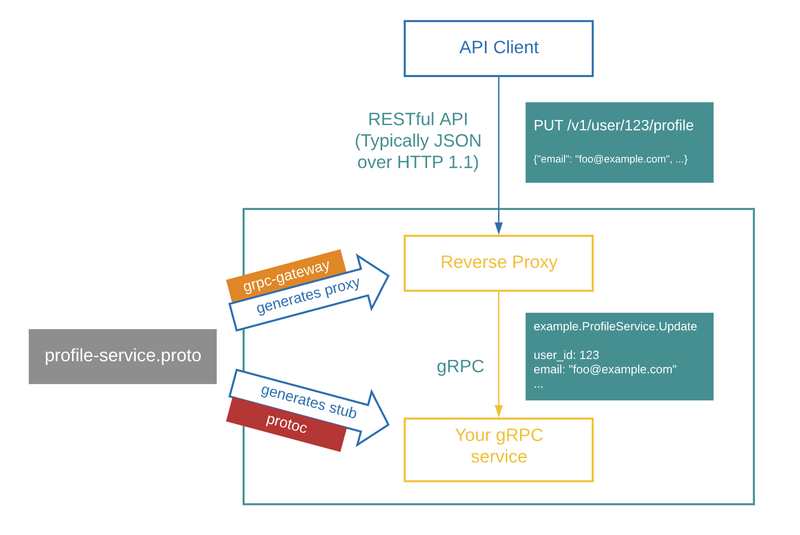
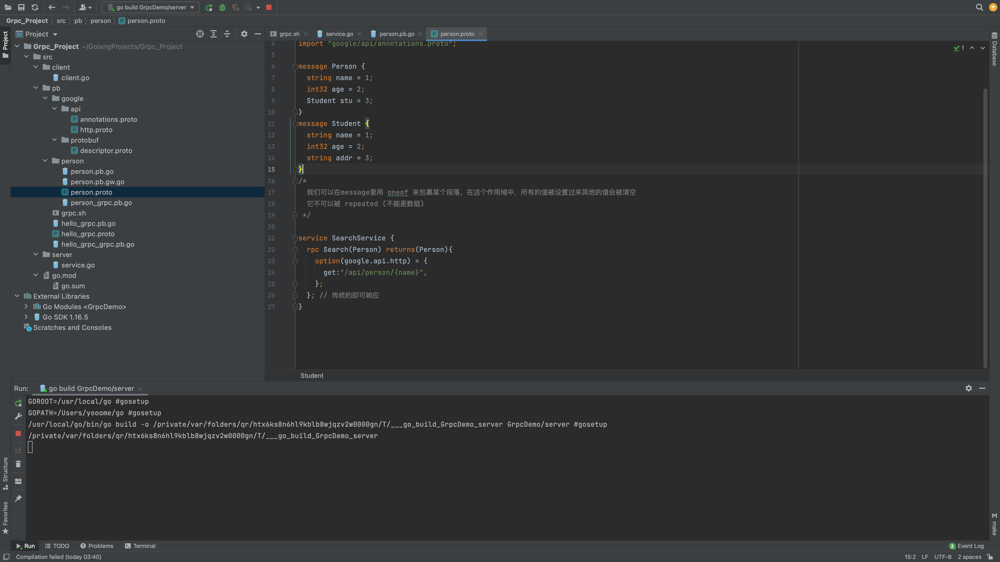
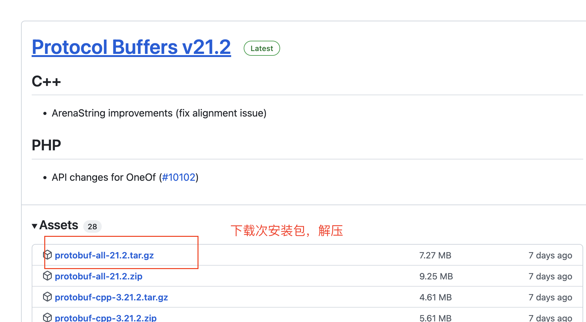
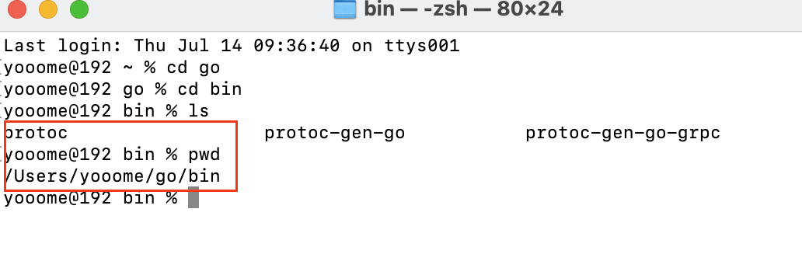
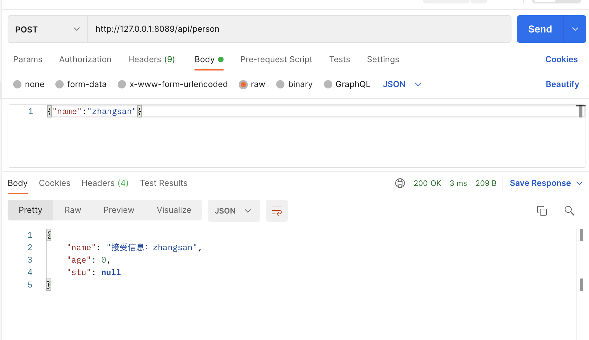

### gRPC-Gateway

### 一、介绍

gRPC网关是protoc的一个插件。它读取gRPC服务定义并生成反向代理服务器，该服务器将 RESTful JSON API 转换为 gRPC。此服务器是根据gRPC定义中的自定义选项生成的。

#### 1.1 入门

gRPC网关帮助您同时提供gRPC和RESTful风格的API。



要了解有关gRPC网关的更多信息，请查看文档。

### 二、概述

#### 2.1 背景

**gRPC**很棒——它可以用多种编程语言生成API客户端和服务器存根，它速度快、易于使用、带宽效率高，其设计经过了谷歌的验证。然而，您可能仍然希望提供传统的RESTful API。原因包括维护向后兼容性、支持gRPC不支持的语言或客户端，以及简单地维护RESTful架构所涉及的美学和工具。

该项目旨在为您的gRPC服务提供HTTP+JSON接口。使用该库生成反向代理只需在服务中进行少量配置以附加HTTP语义。

#### 2.2 如何使用grpc-gateway

Follow the [instructions](https://github.com/grpc-ecosystem/grpc-gateway#usage) in the [README](https://github.com/grpc-ecosystem/grpc-gateway#readme).

### 三、教程

#### 3.1 Introduction to the gRPC-Gateway

我们都知道，gRPC并不是万能的工具。在某些情况下，我们仍然希望提供传统的HTTP/JSON API。原因可以从维护向后兼容性到支持gRPC不支持的编程语言或客户端。但是编写另一个服务只是为了公开HTTP/JSON API是一项非常耗时和乏味的任务。

那么，有没有办法只编写一次代码，但同时在gRPC和HTTP/JSON中提供API？

答案是肯定的。

gRPC网关是Google protocol buffers编译器协议的插件。它读取protobuf服务定义并生成反向代理服务器，该服务器将RESTful HTTP API转换为gRPC。这台服务器是根据谷歌生成的。应用程序编程接口。服务定义中的http注释。

这有助于您同时提供gRPC和HTTP/JSON格式的API


#### 3.2 前提

在开始编码之前，我们必须安装一些工具。

我们将在示例中使用Go gRPC服务器，因此请先从安装Gohttps://golang.org/dl/.

安装Go后，使用Go get下载以下软件包：

```golang
$ go get github.com/grpc-ecosystem/grpc-gateway/v2/protoc-gen-grpc-gateway
$ go get google.golang.org/protobuf/cmd/protoc-gen-go
$ go get google.golang.org/grpc/cmd/protoc-gen-go-grpc
```

这将安装生成存根所需的`protoc`生成器插件。确保将`$GOPATH/bin`添加到您的`$PATH中`，以便通过`go get`安装的可执行文件可以在您的`$PATH`中使用。

我们将在本教程的一个新模块中工作，现在就在您选择的文件夹中创建：

#### 3.3 创建 go.mod 文件

使用go mod init命令启动模块以创建go。mod文件。

运行`go mod init`命令，为其提供代码所在模块的路径。在这里，使用 `github.com/myuser/myrepo` 用于模块路径–在生产代码中，这将是可以下载模块的URL。

```golang
$ go mod init github.com/myuser/myrepo
go: creating new go.mod: module github.com/myuser/myrepo
```

`go mod init`命令创建`go.mod`文件，该文件将您的代码标识为可能从其他代码中使用的模块。您刚刚创建的文件只包括模块的名称和代码支持的Go版本。但是，当您添加依赖项（即来自其他模块的包）时，`go.mod`文件将列出要使用的特定模块版本。这可以保持构建的可复制性，并让您直接控制要使用的模块版本。

#### 3.4 使用gRPC创建一个简单的hello world

​	为了理解gRPC网关，我们将首先制作一个hello world gRPC服务。

使用协议缓冲区定义gRPC服务

在创建gRPC服务之前，我们应该创建一个原型文件来定义我们需要什么，这里我们创建一个名为hello_world.proto的文件。proto在proto/helloworld/hello_world.proto.目录中。原型。

gRPC服务是使用Google协议缓冲区定义的。了解有关如何在中定义服务的更多信息。原型文件请参阅其基础教程。现在，您需要知道的是，服务器和客户端存根都有一个SayHello（）RPC方法，该方法从客户端获取HelloRequest参数，并从服务器返回HelloReply，该方法定义如下：

**hello_proto.proto**

```golang
syntax = "proto3";

package helloworld;

// The greeting service definition
service Greeter {
  // Sends a greeting
  rpc SayHello (HelloRequest) returns (HelloReply) {}
}

// The request message containing the user's name
message HelloRequest {
  string name = 1;
}

// The response message containing the greetings
message HelloReply {
  string message = 1;
}
```

#### 3.5 生成存根

对于生成存根，我们有两种选择：protoc和buf。protoc是业界广泛使用的更经典的一代体验，但它有一个相当陡峭的学习曲线。buf是一种更新的工具，它是在考虑用户体验和速度的基础上构建的。它还提供了linting和breaking变化检测，这是protoc所没有的。我们在这里为两者提供说明。

##### 3.5.1 使用buf生成存根

Buf 是一种提供各种protobuf实用程序的工具，例如linting、中断更改检测和生成。请在上查找安装说明https://docs.buf.build/installation/.

它是通过buf配置的。yaml文件，该文件应检入Protobuf文件层次结构的根。Buf将自动读取此文件（如果存在）。还可以通过命令行标志config提供配置，该标志接受到的路径。json或。yaml文件，或直接JSON或yaml数据。与protoc相反，protoc中的所有。原型文件在命令行上手动指定，buf通过递归发现所有文件进行操作。配置中的原型文件并构建它们。

下面是一个有效配置的示例，您可以将其放在Protobuf文件层次结构的根中，例如proto/buf中。相对于存储库根的yaml。

```yml
version: v1
name: buf.build/myuser/myrepo
```

要为Go生成类型和gRPC存根，请创建文件buf。buf.gen.yaml:

```yml
version: v1
plugins:
  - name: go
    out: proto
    opt: paths=source_relative
  - name: go-grpc
    out: proto
    opt: paths=source_relative
```

我们使用go和go grpc插件来生成go类型和grpc服务定义。我们正在输出相对于proto文件夹生成的文件，并且我们正在使用paths=source_relative选项，这意味着生成的文件将显示在与源文件相同的目录中 .proto  文件.

接下来运行

```yml
$ buf generate
```

这将生成一个 `*.pb.go` 和 `*_grpc.pb.go `。我们的proto文件层次结构中每个protobuf包的go文件。

##### 3.5.2 使用protoc生成存根

下面是一个proto命令生成Go存根的示例，假设您位于存储库的根目录，并且您的proto文件位于名为proto的目录中：

```bash
$ protoc -I ./proto \
   --go_out ./proto --go_opt paths=source_relative \
   --go-grpc_out ./proto --go-grpc_opt paths=source_relative \
   ./proto/helloworld/hello_world.proto

# 例如
protoc --go_out=. --go_opt=paths=source_relative --go-grpc_out=. --go-grpc_opt=paths=source_relative --grpc-gateway_out . --grpc-gateway_opt paths=source_relative ./person/person.proto
```

我们使用go和go grpc插件来生成go类型和grpc服务定义。我们正在输出相对于proto文件夹生成的文件，并且我们正在使用paths=source_relative选项，这意味着生成的文件将显示在与源文件相同的目录中 .proto 文件

这将生成一个`*.pb.go` 和  `*_grpc.pb.go`转到 `proto/helloworld/hello_-world` 的文件.proto

#### 3.6 创建main.go文件

在创建main.go文件之前，我们假设用户已经创建了go.mod名为 github.com/myuser/myrepo，如果没有，请参阅创建go.mod文件。这里的导入使用相对于存储库根的proto/helloworld中生成文件的路径 

**main.go**

```golang
package main

import (
	"context"
	"log"
	"net"

	"google.golang.org/grpc"

	helloworldpb "github.com/myuser/myrepo/proto/helloworld"
)

type server struct{
	helloworldpb.UnimplementedGreeterServer
}

func NewServer() *server {
	return &server{}
}

func (s *server) SayHello(ctx context.Context, in *helloworldpb.HelloRequest) (*helloworldpb.HelloReply, error) {
	return &helloworldpb.HelloReply{Message: in.Name + " world"}, nil
}

func main() {
	// Create a listener on TCP port
	lis, err := net.Listen("tcp", ":8080")
	if err != nil {
		log.Fatalln("Failed to listen:", err)
	}

	// Create a gRPC server object
	s := grpc.NewServer()
	// Attach the Greeter service to the server
	helloworldpb.RegisterGreeterServer(s, &server{})
	// Serve gRPC Server
	log.Println("Serving gRPC on 0.0.0.0:8080")
	log.Fatal(s.Serve(lis))
}
```

#### 3.7 向现有原型文件添加gRPC网关注释

现在我们已经有了一个正常工作的Go-gRPC服务器，我们需要添加gRPC网关注释。

注释定义了gRPC服务如何映射到JSON请求和响应。当使用协议缓冲区时，每个RPC必须使用google定义HTTP方法和路径。应用程序编程接口。http注释。

所以我们需要添加 `google/api/http`。proto导入到proto文件。我们还需要添加所需的`HTTP->gRPC`映射。在本例中，我们将`POST/v1/example/echo`映射到`SayHello RPC`。

```golang
syntax = "proto3";

package helloworld;

import "google/api/annotations.proto";

// Here is the overall greeting service definition where we define all our endpoints
service Greeter {
  // Sends a greeting
  rpc SayHello (HelloRequest) returns (HelloReply) {
    option (google.api.http) = {
      post: "/v1/example/echo"
      body: "*"
    };
  }
}

// The request message containing the user's name
message HelloRequest {
  string name = 1;
}

// The response message containing the greetings
message HelloReply {
  string message = 1;
}
```

查看  [a_bit_of_everything.proto](https://github.com/grpc-ecosystem/grpc-gateway/blob/master/examples/internal/proto/examplepb/a_bit_of_everything.proto)获取更多注释的示例，您可以添加这些注释来自定义网关行为。

##### 3.7.1 生成gRPC网关存根

现在我们已经将gRPC网关注释添加到原型文件中，我们需要使用`gRPC-Gateway`生成器来生成存根。

##### Using buf

我们需要将`gRPC-Gateway`生成器添加到发电配置中：

```yml
version: v1
plugins:
  - name: go
    out: proto
    opt: paths=source_relative
  - name: go-grpc
    out: proto
    opt: paths=source_relative,require_unimplemented_servers=false
  - name: grpc-gateway
    out: proto
    opt: paths=source_relative
```

我们还需要将“googleapis”依赖项添加到我们的`buf.yaml`文件：

```yml
version: v1
name: buf.build/myuser/myrepo
deps:
  - buf.build/googleapis/googleapis
```

然后我们需要运行“buf mod update”来选择要使用的依赖项的版本。

就这样！现在，如果您运行：

```
$ buf generate
```

将会产生 `*.gw.pb.go` 文件.

##### Using `protoc`

在用protoc生成存根之前，我们需要将一些依赖项复制到proto文件结构中。将googleapis的子集从官方存储库复制到您的本地原型文件结构中。之后应该是这样的：

```
proto
├── google
│   └── api
│       ├── annotations.proto
│       └── http.proto
└── helloworld
    └── hello_world.proto
```

现在我们需要添加到 gRPC-Gateway 生成器 到  `protoc` 启用

```basic
$ protoc -I ./proto \
  --go_out ./proto --go_opt paths=source_relative \
  --go-grpc_out ./proto --go-grpc_opt paths=source_relative \
  --grpc-gateway_out ./proto --grpc-gateway_opt paths=source_relative \
  ./proto/helloworld/hello_world.proto
```

将会产生 `*.gw.pb.go` 文件

我们还需要在主服务器中添加和服务gRPC网关多路复用器。转到文件。

```golang
package main

import (
	"context"
	"log"
	"net"
	"net/http"

	"github.com/grpc-ecosystem/grpc-gateway/v2/runtime"
	"google.golang.org/grpc"
	"google.golang.org/grpc/credentials/insecure"

	helloworldpb "github.com/myuser/myrepo/proto/helloworld"
)

type server struct{
	helloworldpb.UnimplementedGreeterServer
}

func NewServer() *server {
	return &server{}
}

func (s *server) SayHello(ctx context.Context, in *helloworldpb.HelloRequest) (*helloworldpb.HelloReply, error) {
	return &helloworldpb.HelloReply{Message: in.Name + " world"}, nil
}

func main() {
	// Create a listener on TCP port
	lis, err := net.Listen("tcp", ":8080")
	if err != nil {
		log.Fatalln("Failed to listen:", err)
	}

	// Create a gRPC server object
	s := grpc.NewServer()
	// Attach the Greeter service to the server
	helloworldpb.RegisterGreeterServer(s, &server{})
	// Serve gRPC server
	log.Println("Serving gRPC on 0.0.0.0:8080")
	go func() {
		log.Fatalln(s.Serve(lis))
	}()

	// Create a client connection to the gRPC server we just started
	// This is where the gRPC-Gateway proxies the requests
	conn, err := grpc.DialContext(
		context.Background(),
		"0.0.0.0:8080",
		grpc.WithBlock(),
		grpc.WithTransportCredentials(insecure.NewCredentials()),
	)
	if err != nil {
		log.Fatalln("Failed to dial server:", err)
	}

	gwmux := runtime.NewServeMux()
	// Register Greeter
	err = helloworldpb.RegisterGreeterHandler(context.Background(), gwmux, conn)
	if err != nil {
		log.Fatalln("Failed to register gateway:", err)
	}

	gwServer := &http.Server{
		Addr:    ":8090",
		Handler: gwmux,
	}

	log.Println("Serving gRPC-Gateway on http://0.0.0.0:8090")
	log.Fatalln(gwServer.ListenAndServe())
}
```

更多案例，查看 [our boilerplate repository](https://github.com/johanbrandhorst/grpc-gateway-boilerplate).

##### 测试 gRPC-Gateway

启动main server:

```
$ go run main.go
```

使用curl发送 HTTP 请求:

```
$ curl -X POST -k http://localhost:8090/v1/example/echo -d '{"name": " hello"}'
{"message":"hello world"}
```

希望这能让我们了解如何使用gRPC网关。

helloworld程序的完整源代码可以在[helloworld-grpc-gateway](https://github.com/iamrajiv/helloworld-grpc-gateway).中找到

### 四、Grpc-GateWay Demo

#### 4.1 项目结构



#### 4.2 前提配置

##### 4.2.1 安装Protobuf



解压到合适的目录下

```bash
tar -zxvf protobuf-all-21.2.tar.gz
```

进入到源码目录下

```bash
cd protobuf-all-21.2
```

安装Protobuf，以及检测安装环境是否满足天骄，生成Mkefile

```bash
./configure --prefix=/usr/local/protobuf
```

编译安装

```bash
# 在当前解压的目录下执行
make && make install
```

添加相关的环境变量。如

```bash
cd ~
vim .bash_profile
```

```bash
export PROTOBUF=/usr/local/protobuf 
export PATH=$PROTOBUF/bin:$PATH
```

更新环境变量使其生效

```
source .bash_profile
```

查看是否安装成功

```bahs
protoc --version
```

然后拷贝 生成的protoc 放入到自己的 $GPPATH 下




使用PostMan 进行访问




