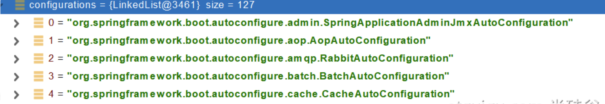

### springboot源码分析

### 三、自动配置原理入门

#### 3.1 引导加载自动配置类

```java
@SpringBootConfiguration
@EnableAutoConfiguration
@ComponentScan(excludeFilters = { @Filter(type = FilterType.CUSTOM, classes = TypeExcludeFilter.class),
		@Filter(type = FilterType.CUSTOM, classes = AutoConfigurationExcludeFilter.class) })
public @interface SpringBootApplication{}


======================
    
```

### 1、@SpringBootConfiguration

@Configuration。代表当前是一个配置类

### 2、@ComponentScan

指定扫描哪些，Spring注解；

### 3、@EnableAutoConfiguration

```java
@AutoConfigurationPackage
@Import(AutoConfigurationImportSelector.class)
public @interface EnableAutoConfiguration {}
```

#### 1、@AutoConfigurationPackage

自动配置包？指定了默认的包规则

```java
@Import(AutoConfigurationPackages.Registrar.class)  //给容器中导入一个组件
public @interface AutoConfigurationPackage {}

//利用Registrar给容器中导入一系列组件
//将指定的一个包下的所有组件导入进来？MainApplication 所在包下。

```

#### 2、@Import(AutoConfigurationImportSelector.class)

```java
1、利用getAutoConfigurationEntry(annotationMetadata);给容器中批量导入一些组件
  
2、调用List<String> configurations = getCandidateConfigurations(annotationMetadata, attributes)获取到所有需要导入到容器中的配置类
  
3、利用工厂加载 Map<String, List<String>> loadSpringFactories(@Nullable ClassLoader classLoader)；得到所有的组件
  
4、从META-INF/spring.factories位置来加载一个文件。
  
	默认扫描我们当前系统里面所有META-INF/spring.factories位置的文件
  
    spring-boot-autoconfigure-2.3.4.RELEASE.jar包里面也有 META-INF/spring.factories
    
```



```properties
文件里面写死了spring-boot一启动就要给容器中加载的所有配置类
spring-boot-autoconfigure-2.3.4.RELEASE.jar/META-INF/spring.factories
# Auto Configure
org.springframework.boot.autoconfigure.EnableAutoConfiguration=\
org.springframework.boot.autoconfigure.admin.SpringApplicationAdminJmxAutoConfiguration,\
org.springframework.boot.autoconfigure.aop.AopAutoConfiguration,\
org.springframework.boot.autoconfigure.amqp.RabbitAutoConfiguration,\
org.springframework.boot.autoconfigure.batch.BatchAutoConfiguration,\
org.springframework.boot.autoconfigure.cache.CacheAutoConfiguration,\
org.springframework.boot.autoconfigure.cassandra.CassandraAutoConfiguration,\
org.springframework.boot.autoconfigure.context.ConfigurationPropertiesAutoConfiguration,\
org.springframework.boot.autoconfigure.context.LifecycleAutoConfiguration,\
org.springframework.boot.autoconfigure.context.MessageSourceAutoConfiguration,\
org.springframework.boot.autoconfigure.context.PropertyPlaceholderAutoConfiguration,\
org.springframework.boot.autoconfigure.couchbase.CouchbaseAutoConfiguration,\
org.springframework.boot.autoconfigure.dao.PersistenceExceptionTranslationAutoConfiguration,\
org.springframework.boot.autoconfigure.data.cassandra.CassandraDataAutoConfiguration,\
org.springframework.boot.autoconfigure.data.cassandra.CassandraReactiveDataAutoConfiguration,\
org.springframework.boot.autoconfigure.data.cassandra.CassandraReactiveRepositoriesAutoConfiguration,\
org.springframework.boot.autoconfigure.data.cassandra.CassandraRepositoriesAutoConfiguration,\
org.springframework.boot.autoconfigure.data.couchbase.CouchbaseDataAutoConfiguration,\
org.springframework.boot.autoconfigure.data.couchbase.CouchbaseReactiveDataAutoConfiguration,\
org.springframework.boot.autoconfigure.data.couchbase.CouchbaseReactiveRepositoriesAutoConfiguration,\
org.springframework.boot.autoconfigure.data.couchbase.CouchbaseRepositoriesAutoConfiguration,\
org.springframework.boot.autoconfigure.data.elasticsearch.ElasticsearchDataAutoConfiguration,\
org.springframework.boot.autoconfigure.data.elasticsearch.ElasticsearchRepositoriesAutoConfiguration,\
org.springframework.boot.autoconfigure.data.elasticsearch.ReactiveElasticsearchRepositoriesAutoConfiguration,\
org.springframework.boot.autoconfigure.data.elasticsearch.ReactiveElasticsearchRestClientAutoConfiguration,\
org.springframework.boot.autoconfigure.data.jdbc.JdbcRepositoriesAutoConfiguration,\
org.springframework.boot.autoconfigure.data.jpa.JpaRepositoriesAutoConfiguration,\
org.springframework.boot.autoconfigure.data.ldap.LdapRepositoriesAutoConfiguration,\
org.springframework.boot.autoconfigure.data.mongo.MongoDataAutoConfiguration,\
org.springframework.boot.autoconfigure.data.mongo.MongoReactiveDataAutoConfiguration,\
org.springframework.boot.autoconfigure.data.mongo.MongoReactiveRepositoriesAutoConfiguration,\
org.springframework.boot.autoconfigure.data.mongo.MongoRepositoriesAutoConfiguration,\
org.springframework.boot.autoconfigure.data.neo4j.Neo4jDataAutoConfiguration,\
org.springframework.boot.autoconfigure.data.neo4j.Neo4jRepositoriesAutoConfiguration,\
org.springframework.boot.autoconfigure.data.solr.SolrRepositoriesAutoConfiguration,\
org.springframework.boot.autoconfigure.data.r2dbc.R2dbcDataAutoConfiguration,\
org.springframework.boot.autoconfigure.data.r2dbc.R2dbcRepositoriesAutoConfiguration,\
org.springframework.boot.autoconfigure.data.r2dbc.R2dbcTransactionManagerAutoConfiguration,\
org.springframework.boot.autoconfigure.data.redis.RedisAutoConfiguration,\
org.springframework.boot.autoconfigure.data.redis.RedisReactiveAutoConfiguration,\
org.springframework.boot.autoconfigure.data.redis.RedisRepositoriesAutoConfiguration,\
org.springframework.boot.autoconfigure.data.rest.RepositoryRestMvcAutoConfiguration,\
org.springframework.boot.autoconfigure.data.web.SpringDataWebAutoConfiguration,\
org.springframework.boot.autoconfigure.elasticsearch.ElasticsearchRestClientAutoConfiguration,\
org.springframework.boot.autoconfigure.flyway.FlywayAutoConfiguration,\
org.springframework.boot.autoconfigure.freemarker.FreeMarkerAutoConfiguration,\
org.springframework.boot.autoconfigure.groovy.template.GroovyTemplateAutoConfiguration,\
org.springframework.boot.autoconfigure.gson.GsonAutoConfiguration,\
org.springframework.boot.autoconfigure.h2.H2ConsoleAutoConfiguration,\
org.springframework.boot.autoconfigure.hateoas.HypermediaAutoConfiguration,\
org.springframework.boot.autoconfigure.hazelcast.HazelcastAutoConfiguration,\
org.springframework.boot.autoconfigure.hazelcast.HazelcastJpaDependencyAutoConfiguration,\
org.springframework.boot.autoconfigure.http.HttpMessageConvertersAutoConfiguration,\
org.springframework.boot.autoconfigure.http.codec.CodecsAutoConfiguration,\
org.springframework.boot.autoconfigure.influx.InfluxDbAutoConfiguration,\
org.springframework.boot.autoconfigure.info.ProjectInfoAutoConfiguration,\
org.springframework.boot.autoconfigure.integration.IntegrationAutoConfiguration,\
org.springframework.boot.autoconfigure.jackson.JacksonAutoConfiguration,\
org.springframework.boot.autoconfigure.jdbc.DataSourceAutoConfiguration,\
org.springframework.boot.autoconfigure.jdbc.JdbcTemplateAutoConfiguration,\
org.springframework.boot.autoconfigure.jdbc.JndiDataSourceAutoConfiguration,\
org.springframework.boot.autoconfigure.jdbc.XADataSourceAutoConfiguration,\
org.springframework.boot.autoconfigure.jdbc.DataSourceTransactionManagerAutoConfiguration,\
org.springframework.boot.autoconfigure.jms.JmsAutoConfiguration,\
org.springframework.boot.autoconfigure.jmx.JmxAutoConfiguration,\
org.springframework.boot.autoconfigure.jms.JndiConnectionFactoryAutoConfiguration,\
org.springframework.boot.autoconfigure.jms.activemq.ActiveMQAutoConfiguration,\
org.springframework.boot.autoconfigure.jms.artemis.ArtemisAutoConfiguration,\
org.springframework.boot.autoconfigure.jersey.JerseyAutoConfiguration,\
org.springframework.boot.autoconfigure.jooq.JooqAutoConfiguration,\
org.springframework.boot.autoconfigure.jsonb.JsonbAutoConfiguration,\
org.springframework.boot.autoconfigure.kafka.KafkaAutoConfiguration,\
org.springframework.boot.autoconfigure.availability.ApplicationAvailabilityAutoConfiguration,\
org.springframework.boot.autoconfigure.ldap.embedded.EmbeddedLdapAutoConfiguration,\
org.springframework.boot.autoconfigure.ldap.LdapAutoConfiguration,\
org.springframework.boot.autoconfigure.liquibase.LiquibaseAutoConfiguration,\
org.springframework.boot.autoconfigure.mail.MailSenderAutoConfiguration,\
org.springframework.boot.autoconfigure.mail.MailSenderValidatorAutoConfiguration,\
org.springframework.boot.autoconfigure.mongo.embedded.EmbeddedMongoAutoConfiguration,\
org.springframework.boot.autoconfigure.mongo.MongoAutoConfiguration,\
org.springframework.boot.autoconfigure.mongo.MongoReactiveAutoConfiguration,\
org.springframework.boot.autoconfigure.mustache.MustacheAutoConfiguration,\
org.springframework.boot.autoconfigure.orm.jpa.HibernateJpaAutoConfiguration,\
org.springframework.boot.autoconfigure.quartz.QuartzAutoConfiguration,\
org.springframework.boot.autoconfigure.r2dbc.R2dbcAutoConfiguration,\
org.springframework.boot.autoconfigure.rsocket.RSocketMessagingAutoConfiguration,\
org.springframework.boot.autoconfigure.rsocket.RSocketRequesterAutoConfiguration,\
org.springframework.boot.autoconfigure.rsocket.RSocketServerAutoConfiguration,\
org.springframework.boot.autoconfigure.rsocket.RSocketStrategiesAutoConfiguration,\
org.springframework.boot.autoconfigure.security.servlet.SecurityAutoConfiguration,\
org.springframework.boot.autoconfigure.security.servlet.UserDetailsServiceAutoConfiguration,\
org.springframework.boot.autoconfigure.security.servlet.SecurityFilterAutoConfiguration,\
org.springframework.boot.autoconfigure.security.reactive.ReactiveSecurityAutoConfiguration,\
org.springframework.boot.autoconfigure.security.reactive.ReactiveUserDetailsServiceAutoConfiguration,\
org.springframework.boot.autoconfigure.security.rsocket.RSocketSecurityAutoConfiguration,\
org.springframework.boot.autoconfigure.security.saml2.Saml2RelyingPartyAutoConfiguration,\
org.springframework.boot.autoconfigure.sendgrid.SendGridAutoConfiguration,\
org.springframework.boot.autoconfigure.session.SessionAutoConfiguration,\
org.springframework.boot.autoconfigure.security.oauth2.client.servlet.OAuth2ClientAutoConfiguration,\
org.springframework.boot.autoconfigure.security.oauth2.client.reactive.ReactiveOAuth2ClientAutoConfiguration,\
org.springframework.boot.autoconfigure.security.oauth2.resource.servlet.OAuth2ResourceServerAutoConfiguration,\
org.springframework.boot.autoconfigure.security.oauth2.resource.reactive.ReactiveOAuth2ResourceServerAutoConfiguration,\
org.springframework.boot.autoconfigure.solr.SolrAutoConfiguration,\
org.springframework.boot.autoconfigure.task.TaskExecutionAutoConfiguration,\
org.springframework.boot.autoconfigure.task.TaskSchedulingAutoConfiguration,\
org.springframework.boot.autoconfigure.thymeleaf.ThymeleafAutoConfiguration,\
org.springframework.boot.autoconfigure.transaction.TransactionAutoConfiguration,\
org.springframework.boot.autoconfigure.transaction.jta.JtaAutoConfiguration,\
org.springframework.boot.autoconfigure.validation.ValidationAutoConfiguration,\
org.springframework.boot.autoconfigure.web.client.RestTemplateAutoConfiguration,\
org.springframework.boot.autoconfigure.web.embedded.EmbeddedWebServerFactoryCustomizerAutoConfiguration,\
org.springframework.boot.autoconfigure.web.reactive.HttpHandlerAutoConfiguration,\
org.springframework.boot.autoconfigure.web.reactive.ReactiveWebServerFactoryAutoConfiguration,\
org.springframework.boot.autoconfigure.web.reactive.WebFluxAutoConfiguration,\
org.springframework.boot.autoconfigure.web.reactive.error.ErrorWebFluxAutoConfiguration,\
org.springframework.boot.autoconfigure.web.reactive.function.client.ClientHttpConnectorAutoConfiguration,\
org.springframework.boot.autoconfigure.web.reactive.function.client.WebClientAutoConfiguration,\
org.springframework.boot.autoconfigure.web.servlet.DispatcherServletAutoConfiguration,\
org.springframework.boot.autoconfigure.web.servlet.ServletWebServerFactoryAutoConfiguration,\
org.springframework.boot.autoconfigure.web.servlet.error.ErrorMvcAutoConfiguration,\
org.springframework.boot.autoconfigure.web.servlet.HttpEncodingAutoConfiguration,\
org.springframework.boot.autoconfigure.web.servlet.MultipartAutoConfiguration,\
org.springframework.boot.autoconfigure.web.servlet.WebMvcAutoConfiguration,\
org.springframework.boot.autoconfigure.websocket.reactive.WebSocketReactiveAutoConfiguration,\
org.springframework.boot.autoconfigure.websocket.servlet.WebSocketServletAutoConfiguration,\
org.springframework.boot.autoconfigure.websocket.servlet.WebSocketMessagingAutoConfiguration,\
org.springframework.boot.autoconfigure.webservices.WebServicesAutoConfiguration,\
org.springframework.boot.autoconfigure.webservices.client.WebServiceTemplateAutoConfiguration
```

#### 3.2、按需开启自动配置项

```java
虽然我们127个场景的所有自动配置启动的时候默认全部加载。xxxxAutoConfiguration
按照条件装配规则（@Conditional），最终会按需配置。
```

#### 3.3、修改默认配置

```java
        @Bean
		@ConditionalOnBean(MultipartResolver.class)  //容器中有这个类型组件
		@ConditionalOnMissingBean(name = DispatcherServlet.MULTIPART_RESOLVER_BEAN_NAME) //容器中没有这个名字 multipartResolver 的组件
		public MultipartResolver multipartResolver(MultipartResolver resolver) {
            //给@Bean标注的方法传入了对象参数，这个参数的值就会从容器中找。
            //SpringMVC multipartResolver。防止有些用户配置的文件上传解析器不符合规范
			// Detect if the user has created a MultipartResolver but named it incorrectly
			return resolver;
		}
给容器中加入了文件上传解析器；
```

SpringBoot默认会在底层配好所有的组件。但是如果用户自己配置了以用户的优先

```java
@Bean
	@ConditionalOnMissingBean
	public CharacterEncodingFilter characterEncodingFilter() {
    }
```

总结：

- SpringBoot先加载所有的自动配置类  xxxxxAutoConfiguration
- 每个自动配置类按照条件进行生效，默认都会绑定配置文件指定的值。xxxxProperties里面拿。xxxProperties和配置文件进行了绑定
- 生效的配置类就会给容器中装配很多组件
- 只要容器中有这些组件，相当于这些功能就有了
- 定制化配置

- - 用户直接自己@Bean替换底层的组件
  - 用户去看这个组件是获取的配置文件什么值就去修改。

**xxxxxAutoConfiguration ---> 组件  --->** **xxxxProperties里面拿值  ----> application.properties**

#### 3.4、最佳实践

- 引入场景依赖

- - https://docs.spring.io/spring-boot/docs/current/reference/html/using-spring-boot.html#using-boot-starter

- 查看自动配置了哪些（选做）

- - 自己分析，引入场景对应的自动配置一般都生效了
  - 配置文件中debug=true开启自动配置报告。Negative（不生效）\Positive（生效）

- 是否需要修改

- - 参照文档修改配置项

- - - https://docs.spring.io/spring-boot/docs/current/reference/html/appendix-application-properties.html#common-application-properties
    - 自己分析。xxxxProperties绑定了配置文件的哪些。

- - 自定义加入或者替换组件

- - - @Bean、@Component。。。

- - 自定义器  **XXXXXCustomizer**；


### 九、SpringBoot原理

Spring原理【Spring注解】、SpringMVC原理、自动配置原理、SpringBoot原理

#### 9.1 SpringBoot启动过程

1、**创建SpringApplication**

- 保存一些信息。
- 判定当前应用的类型。ClassUtils、Servlet。
- bootstrapers：**初始启动引导器**(List<BootstrapRegistryInitializer> bootstrapRegistryInitializers)：去spring.factories文件中找 org.springframework.boot.BootstrapRegistryInitializer

- 找ApplicationContextInitializer；去spring.factories 找 **ApplicationContextInitializer**
  1. List<ApplicationContextInitializer<?>> initializers;

- 找 ApplicationListener；应用监听器。去 **spring.factories** 找 **ApplicationListener**
  1. List<ApplicationListener<?>> listeners

2、**运行SpringApplication**

- **StopWatch** 这个类主要是记录任务的执行时间。

- 记录应用的启动时间
- 创建引导上下文（Context环境）**createBootstrapContext()**
  1. 获取到所有之前的 **bootstrappers 挨个执行** **initializer()** 来完成对引导启动器上下文环境设置。

- 让当前应用进入**headless**模式。**java.awt.headless** 【Headless 模式是在缺少显示屏，键盘或者鼠标时候的系统配置】

- **获取所有 RunListener（运行监听器）**【**为了方便所有Listener进行时间感知**】
  1. **getSpringFactoriesInstances** 去**spring.factories**找 **SpringApplicationRunListener**.

- 遍历SpringApplicationRunListener 调用 starting 方法；
  1. **相当于通知所有感兴趣系统正在启动过程的人，项目正在 starting**。

- 保存命令行参数；**ApplicationArguments**

- 准备环境 **prepareEnvironment ()** ;

  1. 返回或者创建基础环境信息对象。StandardServletEnvironment
  2. 配置环境信息对象。
     - 读取所有的配置源的配置属性值。

  3. 绑定环境信息。
  4. 监听器调用 **listeners.environmentPrepared(bootstrapContext, (ConfigurableEnvironment)environment);** 通知所有的舰艇器当前环境准备完成。

- 创建IOC容器(createApplicationContext())
  1. 根据项目类型（Servlet）创建容器。
  2. 当前会创建 **AnnotationConfigServletWebServerApplicationContext**

- 准备ApplicationContext IOC 容器的基本信息  prepareContext()

  1. 保存环境信息
  2. IOC容器的后置处理流程
  3. 准备IOC容器 **prepareContext()**
  4. 应用初始化器；**applyInitializers**；
     - **遍历所有的** **ApplcationContextInitializer**。调用initialize。来对 ioc 容器进行初始化扩展功能。
     - 比那里所有的 listener 调用 **contextPrepared**。**EventPublishRunListener**；通知所有的监听器 **contextPrepared**

  5. 所有的监听器 调用contextLoaded。通知所有的监听器 contextLoaded ；

- 刷新IOC容器。refreshContext
  1. 创建容器中的所有组件（Spring注解）

- 容器刷新完成后工作？afterRefresh
- 所有监听器调用 listeners.started(context);通知所有的监听器 started。
- 调用所有runners; callRunners()
  1. 获取容器中的 ApplicationRunner。
  2. 获取容器中的 CommandLineRunner。
  3. 合并所有 runner 并且按照 @Order 进行排序。
  4. 遍历所有的runner。调用 run 方法。

- 如果以上有异常
  1. 调用 listener的failed。

- 调用所有监听器的running方法 listeners.running(context);通知所有的监听器 running。

- running 如果有问题。继续通知failed。调用所有 Listener 的 failed； 通知所有的监听器 failed。


