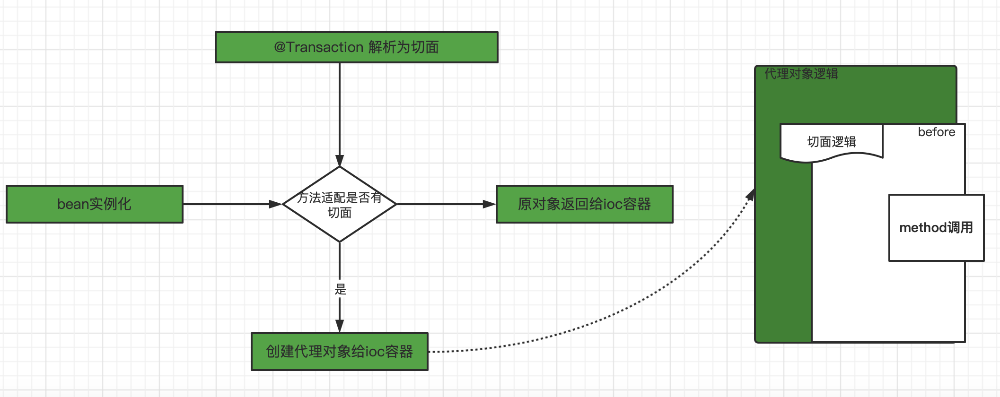
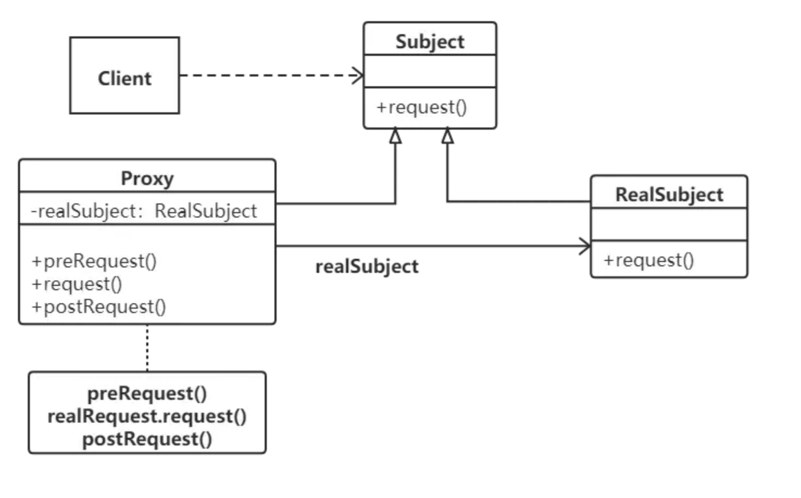
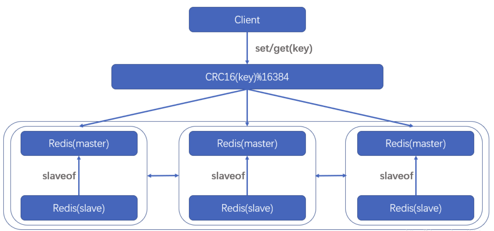

### 一、Spring事务失效场景

#### 1.1 前言

身为Java开发工程师，相信大家对Spring种事务的使用并不陌生。但是你可能只停留在基础的使用层面上，在遇到一些比较特殊的场景，事务可能没有生效，直接在生产上暴露了，这可能就会导致比较严重的生产事故。今天，我们就简单来说一下Spring事务的原理，然后总结出对应的解决方案。

- 声明式事务是Spring 功能中最爽之一，可是有些时候，我们在使用声明式事务并为生效，这是为什么呢？
- 再次就聊聊声明式事务的几种失效场景。本文将会从以下两个方面来说一下事务为什么会失效？

#### 1.2 Spring 事务原理

大家还记得在JDBC中是如何操作事务的吗？伪代码可能如下：

```java
//Get database connection
Connection connection = DriverManager.getConnection();
//Set autoCommit is false
connection.setAutoCommit(false);
//use sql to operate database
.........
//Commit or rollback
connection.commit()/connection.rollback

connection.close();
```

需要再各个业务中编写代码如 commit() 、close() 来控制事务。

但是 Spring 不乐意这么干了，这样对业务代码侵入性太大了，所有就用一个事务注解 @Transaction 来控制事务，底层实现是基于切面编程 AOP 实现的，而Spring 中实现 AOP 机制采用的动态代理，具体分为 JDK 动态代理和 CGLib 动态代理两种模式。



1. Spring 的 bean 的初始化过程中，发现方法有 @Transaction 注解，就需要对相应的 Bean 进行代理，生成代理对象。
2. 然后再方法调用的时候，会执行切面的逻辑，而这里切卖你的逻辑中就包含了开启事务，提交事务或者回滚事务等逻辑。

另外注意一点的是，Spring 本身不实现事务，底层还是依赖于数据库的事务。没有数据库事务的支持，Spring 事务是不会生效的。

#### 1.3 Spring 事务失效场景

##### 1.3.1 抛出检查异常

比如你的事务控制代码如下：

```java
@Transactional
public void transactionTest() throws IOException{
    User user = new User();
    UserService.insert(user);
    throw new IOException();
}
```

如果 @Transactional 没有特别指定，Spring只会在遇到运行时异常RuntimeException或者error时进行回滚，而 IOException 等检查异常不会影响回滚。

```java
public boolean rollbackOn(Throwable ex) {
  	return (ex instanceof RuntimeException || ex instanceof  Error);
}
```

**解决方案：**

知道原因后，解决方法也很简单。配置rollbackFor 属性，例如：

```java
 @Transactional（rollbackFor = Exception.class)
```

##### 1.3.2 业务方法本身捕获了异常

```java
@Transactional(rollbackFor = Exception.class)
public void transactionTest() {
    try {
        User user = new User();
        UserService.insert(user);
        int i = 1 / 0;
    }catch (Exception e) {
        e.printStackTrace();
    }
}
```

这种场景下，事务失败的原因也很简单，Spring 是否进行回滚时根据你是否抛出异常决定的，所以如果你自己捕获了异常，Spring也无能为力。

看了上面的代码，你可能认为这么简单的问题你不可能犯这么愚蠢的错误，但是我想告诉你的是，我身边几乎一半的人都被这一幕困扰过。

写业务代码的时候，代码可能比较复杂，嵌套的方法很多。如果你不小心，很可能会触发此问题。举一个非常简单的例子，假设你有一个审计功能。每个方法执行后，审计结果保存在数据库中，那么代码可能会这样写。

```java
@Service
public class TransactionService {

    @Transactional(rollbackFor = Exception.class)
    public void transactionTest() throws IOException {
        User user = new User();
        UserService.insert(user);
        throw new IOException();

    }
}

@Component
public class AuditAspect {

	@Autowired
	private auditService auditService;

    @Around(value = "execution (* com.alvin.*.*(..))")
    public Object around(ProceedingJoinPoint pjp) {
        try {
            Audit audit = new Audit();
            Signature signature = pjp.getSignature();
            MethodSignature methodSignature = (MethodSignature) signature;
            String[] strings = methodSignature.getParameterNames();
            audit.setMethod(signature.getName());
            audit.setParameters(strings);
            Object proceed = pjp.proceed();
            audit.success(true);
            return proceed;
        } catch (Throwable e) {
            log.error("{}", e);
            audit.success(false);
        }
        
        auditService.save(audit);
        return null;
    }

}
```

上面的示例中，事务将失败。原因是Spring 的事务切面 优先级最低，所以如果异常被切面捕获，Spring自然不能正常处理事务，因为事务管理器无法捕获异常。

**解决方案**：

虽然我们知道在处理使唔使业务代码不能自己捕获异常，但是只要代码变得复杂，我们就很可能再次出错，所以我们在处理事务的时候要小心，还是不要使用声明式事务，并使用编程式事务：

```java
transactionTemplate.execute()
```

##### 1.3.3 同一类的方法调用

```java
@Service
public class DefaultTransactionService implement Service {

    public void saveUser() throws Exception {
        //do something
        doInsert();
    }

    @Transactional(rollbackFor = Exception.class)
    public void doInsert() throws IOException {
        User user = new User();
        UserService.insert(user);
        throw new IOException();

    }
}
```

这也是一个容易出错的场景。事务失败的原因也很简单，因为Spring的事务管理功能是通过动态代理实现的，而Spring默认使用 JDK 动态代理，而 JDK 动态代理采用接口实现的方式，通过反射调用目标类。简单理解，就是 saveUser()  方法中调用 this.doInsert() ，这里的this 是被真实对象，所以会直接走 doInsert 的业务逻辑，而不走切面逻辑，所以事务失败。

**解决方案**：

```java
方案一：解决方法可以是直接在启动类中添加 @Transcational 注解 saveUser() 
方案二：@EnableAspectJAutoProxy(exposeProxy = true)在启动类中添加，会由Cglib代理实现。
```

##### 1.3.4 方法使用 final 或 static 关键字

如果Spring 使用了 Cglib 代理实现 （比如你的代理类没有实现接口），而你的业务方法敲好使用了 final  或者 static 关键字，那么事务也会失败。更具体的说，它应该抛出异常，因为 Cglib 使用字节码增强技术生成被代理类的子类并重写代理类的方法来实现代理。如果被代理的方法使用 final 或 static 关键字，则子类不能重写被代理的方法。


如果 Spring 使用 JDK 动态代理实现，JDK动态代理是基于接口实现的，那么 final 和 static 修饰的方法也就无法被代理。

总而言之，方法连代理都没有，那么肯定无法实现事务回滚了。

**解决方案**：

```java
想办法去掉 final 或者 static 关键字
```

##### 1.3.5 方法不是 public

如果方法不是 public，Spring 事务也会失败，因为 spring  的事务管理源码 `AbstractFallbackTransactionAttributeSource`中有判断`computeTransactionAttribute()。`如果目标方法不是公共的，则`TransactionAttribute`返回`null`。

```java
// Don't allow no-public methods as required.
if (allowPublicMethodsOnly() && !Modifier.isPublic(method.getModifiers())) {
  return null;
}
```

**解决方案：**

```java
将当前方法访问级别更改为 public 
```

##### 1.3.6 错误使用传播机制

Spring 事务的传播机制是指在多个事务方法互相调用时，确定事务应该如何传播的策略。Spring 提供了 7  种事务传播机制：

1. REQUIRED
2. SUPPORT
3. MANDATORY
4. REQUIRES_NEW
5. NOT_SUPPORTED
6. NEVER
7. NESTED

如果不知道这些传播策略的原理，很可能会导致交易失败。

```java
@Service
public class TransactionService {


    @Autowired
    private UserMapper userMapper;

    @Autowired
    private AddressMapper addressMapper;


    @Transactional(propagation = Propagation.REQUIRES_NEW,rollbackFor = Exception.class)
    public  void doInsert(User user,Address address) throws Exception {
        //do something
        userMapper.insert(user);
        saveAddress(address);
    }

    @Transactional(propagation = Propagation.REQUIRES_NEW)
    public  void saveAddress(Address address) {
        //do something
        addressMapper.insert(address);
    }
}
```

在上面的例子中，如果用户插入失败，不会导致 saveAddress() 回滚，因为这里使用的传播是 `REQUIRES_NEW`，传播机制 `REQUIRES_NEW` 的原理是如果当前方法中没有事务，就会创建一个新的事物。如果一个事物已经存在，则当前事务将被挂起，并创建一个新事务。在当前事务完成之前，不会提交父事务。如果父事务发生异常，则不影响子事务的提交。

事务的传播机制说明如下：

- REQUIRED：如果当前上下文中存在事务，那么加入该事务，如果不存在事务，创建一个事务，这是默认的传播属性值。
- SUPPORT：如果当前上下文存在事务，则支持事务加入事务，如果不存在事务，则使用非事务的方式执行。
- MANDATORY：如果当前上下文中存在事务，并且同时将上下文中的事务挂起，执行当前新建事务完成以后，上下文事务回复在执行。
- NOT_SUPPORTED  如果当前上下文存在事务，则挂起当前事务，然后新的方法在没有事务的环境中执行。
- NEVER 如果当前上下文中存在书屋，则抛出异常，否则在无事务环境上执行代码。
- NESTED 如果当前上下文中存在是我，则嵌套是我执行，如果不存在事务，则新建事务。

**解决方案**：

```tex
将事务传播策略更改为默认值 REQUIRED, REQUIRED 原理是如果当前有一个事务被添加到一个事务中，如果没有，则创建一个新事物，父事务和被调用的事务在同一个事务中。即时被调用的异常被捕获，整个事务仍然会被回滚。
```

##### **1.3.7 没有被Spring管理**

```java
// @Service
public class OrderServiceImpl implements OrderService {
    @Transactional
    public void updateOrder(Order order) {
        // update order
    }
}
```

如果此时把 @Server 注解注释掉，这个类就不会被加载成一个 Bean ，那这个类就不会被 Spring 管理了，事务自然就失效了。

**解决方案**：

```
需要保证每个事物注解的每个Bean被Spring管理。
```

##### 1.3.8 多线程

```java
@Service
public class UserService {

    @Autowired
    private UserMapper userMapper;
    @Autowired
    private RoleService roleService;

    @Transactional
    public void add(UserModel userModel) throws Exception {

        userMapper.insertUser(userModel);
        new Thread(() -> {
             try {
                 test();
             } catch (Exception e) {
                roleService.doOtherThing();
             }
        }).start();
    }
}

@Service
public class RoleService {

    @Transactional
    public void doOtherThing() {
         try {
             int i = 1/0;
             System.out.println("保存role表数据");
         }catch (Exception e) {
            throw new RuntimeException();
        }
    }
}
```

我们可以看到实物方法add中，调用了实物方法 doOtherThing ，但是事务方法 doOtherThing 是在另外一个线程中被调用的。

这样会导致两个方法不再同一个线程中，获取到的数据库连接不一样，从而使两个不同的事务。如果想 doOtherThing 方法中抛出异常， add 方法也回滚时不可能的。

我们说的同一个事物，其实是指同一个数据库连接，只有拥有同一个数据库连接才能同时提交和回滚。如果在不同的线程，拿到的数据库连接肯定时不一样的，所以是不同的事务。

**解决方案**：

```tex
这里就有点分布式事务的感觉了，尽量还是保证在同一个事物中处理。
```

##### 1.3.9 总结

以上总结了 Spring 中事务实现的原理，同时列举了 8  重 Spring 事务失败的场景，相信很多人都遇到过，失败的原理也有详细说明。希望大家对 Spring 事务有一个新的认识。


### 二、JDK动态代理和CGLIB动态代理

#### 2.1 什么是代理模式

代理模式（Proxy Pattern）给某一个对象提供一个代理，并用代理对象控制原对象的引用。代理对象再客户端和目标对象之间起到中介作用。

代理模式是常用的结构型设计模式之一，当直接访问某些对象存在问题时可以通过一个代理对象来间接访问，为了保证客户端使用的透明性，所访问的真实对象与代理对象需要实现相同的接口。代理模式属于结构型设计模式，属于GOF23设计模式

代理模式可以分为静态代理和动态代理两种类型，而动态代理中又分为 JDK 动态代理和 CGLIB 代理两种。



**代理模式包含如下角色**：

1. **Subject**（抽象主体角色）抽象主体角色声明了真实主体和代理主体的共同接口，这样依赖在任何使用真实主体的地方都可以使用代理主体。客户端需要针对抽象主体角色进行编程。
2. **Proxy**（代理主体角色）代理主体角色内部包含对真实主体的引用，从而可以在任何时候操作真是主体对象。在代理主体角色中提供一个与真实主体角色相同的接口，以便在任何时候都可以代替真实主体。代理主体角色还可以控制对真实主体的使用，负责在需要的时候创建和删除真是主体对象，并对真实主体对象的使用加以约束。代理角色通常在客户端调用所引用的真实主体操作之前或之后还需要执行其他操作，而不仅仅是单纯的调用真是主体对象中的操作。
3. **RealSubject**（真是主体角色）真是主体角色定义了代理角色所代表的真实对象，在真实主体角色中实现了真实的业务操作，客户端可以通过代理主体角色间接调用真是主体角色重定义的方法。

#### 2.2 代理模式的优点

- 代理模式能将代理对象与真实被调用的目标对象分离。
- 一定程度上降低了系统柜的耦合度，扩展性好。
- 可以起到保护目标对象的作用。
- 可以对目标对象的功能增强

#### 2.3 代理模式的缺点

- 代理模式会造成系统设计中类的数量增加。
- 在客户端和目标对象增加一个代理对象，会造成请求处理速度变慢。

#### 2.4 JDK动态代理

在java的动态代理机制中，有两个重要的类或接口，一个是 InvocationHandler(Interface)、另外一个则是Prox（Class），这个类和接口是实现我们动态代理所必须用到的。

##### 2.4.1 **InvocationHandler**

每一个动态代理类都必须要实现 InvocationHandler 这个接口，并且每个代理类的实例都关联了一个handler，当我们通过代理对象调用一个方法的时候，这个方法的调用就会被转发为由 InvocationHandler 这个接口的 invoke 方法来进行调用。

InvocationHandler 这个接口的唯一一个方法 invoke 方法：

```java
Object invoke(Object proxy, Method method, Object[] args) throws Throwable
```

这个方法一共接受三个参数，那么这三个参数分别代表如下：

- **proxy** ：指代 JDK 动态生成的最终代理对象。
- **method** ：指代的是我们所要调用真是对象的某个方法的 Method 对象。
- **args** ： 指代的是调用真实对象某个方法时接受的参数。

##### 2.4.2 Proxy

Proxy 这个类的作用就是来动态创建一个代理对象的类，它提供了许多的方法，但是我们用的最多的就是 newProxyInstance 这个方法：

```java
public static Object newProxyInstance(ClassLoader loader, Class<?>[] interfaces,  InvocationHandler handler)  throws IllegalArgumentException
```

这个方法的作用就是得到一个动态的代理对象，其接收三个参数，我们来看看这三个参数所代表的含义：

- **loader** ：ClassLoader对象，定义了由那些 ClassLoader 来对生成的代理对象进行加载，即代理类的类加载器。
- **interfaces** ： Interface 对象的数组，表示的是我将要给我需要代理的对象提供一组什么接口，如果我提供了一组接口给它，那么这个代理对象就宣称实现了该接口（多态），这样我就能调用这组接口中的方法了。
- **Handler** ：InvocationHandler 对象，表示的是当我这个动态代理对象在调用方法的时候，会关联到哪一个 InvocationHandler 对象上。

所以我们所说的 DynamicProxy （动态代理类）是这样一种class ： 它是在运行时生成的 class ，在生成它时你必须提供一组 interface 给它，然后改 class 就宣称它实现了这些 interface。这个 DynamicProxy 其实就是一个 Proxy，它不会做实质性的工作，在生成它的实例时你必须提供一个 handler，由它接管实际的工作。

##### 2.4.3 JDK 动态代理实例

1. 创建接口类

```java
public interface HelloInterface {
    void sayHello();
}
```

2. 创建被代理类，实现接口

```java
/**
 * 被代理类
 */
public class HelloImpl implements HelloInterface{
    @Override
    public void sayHello() {
        System.out.println("hello");
    }
}
```

3. 创建InvocationHandler实现类

```java
/**
 * 每次生成动态代理类对象时都需要指定一个实现了InvocationHandler接口的调用处理器对象
 */
public class ProxyHandler implements InvocationHandler{
    private Object subject; // 这个就是我们要代理的真实对象，也就是真正执行业务逻辑的类
    public ProxyHandler(Object subject) {// 通过构造方法传入这个被代理对象
        this.subject = subject;
    }
    /**
     *当代理对象调用真实对象的方法时，其会自动的跳转到代理对象关联的handler对象的invoke方法来进行调用
     */
    @Override
    public Object invoke(Object obj, Method method, Object[] objs)
            throws Throwable {
        Object result = null;
        System.out.println("可以在调用实际方法前做一些事情");
        System.out.println("当前调用的方法是" + method.getName());
        result = method.invoke(subject, objs);// 需要指定被代理对象和传入参数
        System.out.println(method.getName() + "方法的返回值是" + result);
        System.out.println("可以在调用实际方法后做一些事情");
        System.out.println("------------------------");
        return result;// 返回method方法执行后的返回值
    }
}
```

4. 测试

```java
public class Mytest {
    public static void main(String[] args) {
        //第一步：创建被代理对象
        HelloImpl hello = new HelloImpl();
        //第二步：创建handler,传入真实对象
        ProxyHandler handler = new ProxyHandler(hello);
        //第三步：创建代理对象，传入类加载器、接口、handler
        HelloInterface helloProxy = (HelloInterface) Proxy.newProxyInstance(
                HelloInterface.class.getClassLoader(), 
                new Class[]{HelloInterface.class}, handler);
        //第四步：调用方法
        helloProxy.sayHello();
    }
}
```

5. 结果

```java
可以在调用实际方法前做一些事情
当前调用的方法是sayHello
hello
sayHello方法的返回值是null
可以在调用实际方法后做一些事情
------------------------
```

##### 2.4.4 JDK 动态代理步骤

JDK 动态代理分为以下几步：

1. 拿到被代理对象的引用，并且通过反射获取到它的所有的接口。
2. 通过 JDK Proxy 类重新生成一个新的类，同时新的类要实现被代理类所实现的所有的接口。
3. 动态生成 Java 代码，把新加的业务逻辑方法由一定的逻辑代码去调用。
4. 编译新生成的 Java 代码 .class。
5. 将新生成的Class文件重新加载到JVM中运行。

所以说 JDK 动态代理的核心是通过重写被代理对象所实现的接口中的方法重新生成代理类来实现的，那么加入被代理对象没有实现接口呢？那么这时候就需要 CGLIB 动态代理了。

#### 2.5 CGLIB 动态代理

JDK 动态代理是通过重写被代理对象实现的接口中的方法来实现，而CGLIB是通过集成部诶代理对象来实现和 JDK 动态代理需要实现指定接口一样，CGLIB 也要求代理对象必须要实现 MethodInterceptor 接口，并重写其唯一的方法 intercept 。

CGLib 采用了非常底层的字节码技术，其原理是通过字节码技术为一个类创建子类，并在子类中采用方法拦截的技术拦截所有父类方法的调用，顺势植入横切逻辑。（利用ASM开源包，对代理对象类的 class 文件加载进来，通过修改其字节码生成子类来处理）。

**注意** ：因为CGLIB 是童工集成目标类来重写其方法来实现的，故而如果是 final  和 private  方法则无法被重写，也就无法被代理。

```xml
<dependency>
  <groupId>cglib</groupId>
	<artifactId>cglib-nodep</artifactId>
	<version>2.2</version>
</dependency>
```

##### 2.5.1 CGLIB 核心类

1. **net.sf.cglib.proxy.Enhancer** ：主要增强类，通过字节码技术动态创建委托类的子类实例；

   Enhancer 可能是 CGLIB 中最常用的一个类，和Java1.3 动态代理中引入的Proxy类差不多。和Proxy不同的是，Enhancer 技能够代理普通的 class，也能够代理接口。Enhancer 创建一个被代理对象的子类并且拦截所有的方法调用（包括从 Object 中继承的 toString 和 hashCode 方法）。Enhancer 不能够拦截 final 方法，例如 Object.getClass() 方法，这是由于 Java final  方法语义决定的。基于同样的道理，Enhancer 也不能对 final 类进行 代理操作。这也是 Hibernate 为什么不能持久化 final class 的原因。

2. **net.sf.cglib.proxy.MethodInterceptor** ：常用的方法拦截器接口，需要实现 intercept 方法，实现具体拦截处理：

```java
public java.lang.Object intercept(java.lang.Object obj,
                                   java.lang.reflect.Method method,
                                   java.lang.Object[] args,
                                   MethodProxy proxy) throws java.lang.Throwable{}

```

- obj ： 动态生成的代理对象。
- method ： 实际调用的方法。
- args ： 调用方法入参。

- **net.sf.cglib.proxy.MethodProxy** ：java Method类的代理类，可以实现委托类对象的方法的调用；常用方法：methodProxy.invokeSuper(proxy, args)；在拦截方法内可以调用多次。

##### 2.5.2 CGLIB 代理实例

1. 创建被代理类

```java
public class SayHello {
  public void say() {
    System.out.println("hello")
  }
}
```

2. 创建代理类

```java
/**
 *代理类 
 */
public class ProxyCglib implements MethodInterceptor{
     private Enhancer enhancer = new Enhancer();  
     public Object getProxy(Class clazz){  
          //设置需要创建子类的类  
          enhancer.setSuperclass(clazz);  
          enhancer.setCallback(this);  
          //通过字节码技术动态创建子类实例  
          return enhancer.create();  
     }  

     //实现MethodInterceptor接口方法  
     public Object intercept(Object obj, Method method, Object[] args, MethodProxy proxy) throws Throwable {  
          System.out.println("可以在调用实际方法前做一些事情");  
          //通过代理类调用父类中的方法  
          Object result = proxy.invokeSuper(obj, args);  
          System.out.println("可以在调用实际方法后做一些事情");  
          return result;  
     } 
}
```

3. **测试**

```java
public class Mytest {

    public static void main(String[] args) {
          ProxyCglib proxy = new ProxyCglib();  
          //通过生成子类的方式创建代理类  
          SayHello proxyImp = (SayHello)proxy.getProxy(SayHello.class);  
          proxyImp.say();  
    }
}
```

4. 结果

```java
可以在调用实际方法前做一些事情
hello
可以在调用实际方法后做一些事情
```

##### 2.5.3 CGLIB 动态代理实现分析

CGLIB 动态代理采用了 FastClass 机制，其分别为代理类和被代理类各生成一个FastClass，这个 FastClass 类会为代理类或被代理类的方法分配一个 index（int类型）。这个index 当作一个入参，FastClass 就可以直接定位要调用的方法直接进行调用，这样省去了反射调用，所以调用效率比 JDK 动态代理通过反射调用更高。

但是我们看上面的源码也可以明显看到，JDK 动态代理只生成一个文件，而 CGLIB 生成了三个文件，所以生成代理对象的过程会更复杂。

#### 2.6 JDK 和 CGLIB 动态代理对比

JDK 动态代理是实现了呗代理对象啊所实现的接口，CGLIB 是继承了被代理对象。JDK 和 CGLIB 都是在运行期生成字节码，JDK 是直接写 Class 字节码，CGLib 使用 ASM 框架写 Class 字节码，Cglib 代理实现更为复杂，生成代理类的效率比 JDK 代理低。

JDK 调用代理方法，是通过反射机制调用，CGLIB 是通过 FastClass 机制直接调用方法，CGLIB 执行效率更高。

##### 2.6.1 原理区别：

java 动态代理是利用反射机制生成一个实现代理接口的匿名类，在调用具体方法前调用 InvocationHandler 来处理。核心是实现 InvocationHandler 接口，使用 invoke() 方法进行面向切面的处理，调用相应的通知。

1. 如果目标对象实现了接口，默认情况下会采用 JDK 的动态代理实现 AOP。
2. 如果目标对象实现了接口，可以强制使用 CGLIB 实现 AOP。
3. 如果目标对象没有实现了接口，必须采用 CGLIB  库，spring 会自动在 JDK 动态代理和 CGLIB 之间转换

##### 2.6.2 性能区别：

1. CGLib底层采用ASM字节码生成框架，使用字节码技术生成代理类，在jdk6之前比使用Java反射效率要高。唯一需要注意的是，CGLib不能对声明为final的方法进行代理，因为CGLib原理是动态生成被代理类的子类。

2. 在jdk6、jdk7、jdk8逐步对JDK动态代理优化之后，在调用次数较少的情况下，JDK代理效率高于CGLIB代理效率，只有当进行大量调用的时候，jdk6和jdk7比CGLIB代理效率低一点，但是到jdk8的时候，jdk代理效率高于CGLIB代理。

##### 2.6.3 各自局限

1. JDK的动态代理机制只能代理实现了接口的类，而不能实现接口的类就不能实现JDK的动态代理。

2. cglib是针对类来实现代理的，他的原理是对指定的目标类生成一个子类，并覆盖其中方法实现增强，但因为采用的是继承，所以不能对final修饰的类进行代理。

|     类型      |                             机制                             | 回调方式                  | 适用场景                         | 效率                                                         |
| :-----------: | :----------------------------------------------------------: | ------------------------- | -------------------------------- | ------------------------------------------------------------ |
|  JDK动态代理  | 委托机制，代理类和目标类都实现了同样的接口，InvocationHandler持有目标类，代理类委托InvocationHandler去调用目标类的原始方法 | 反射                      | 目标类是接口类                   | 效率瓶颈在反射调用稍慢                                       |
| CGLIB动态代理 | 继承机制，代理类继承了目标类并重写了目标方法，通过回调函数MethodInterceptor调用父类方法执行原始逻辑 | 通过FastClass方法索引调用 | 非接口类、非final类，非final方法 | 第一次调用因为要生成多个Class对象，比JDK方式慢。多次调用因为有方法索引比反射快，如果方法过多，switch case过多其效率还需测试 |

#### 2.7 静态代理和动态代理的区别

静态代理只能通过手动完成代理操作，如果被代理类增加新的方法，代理类需要同步新增，违背开闭原则。

动态代理采用在运行时动态生成代码的方式，取消了对被代理类的扩展限制，遵循开闭原则。

若动态代理要对目标类的增强逻辑扩展，结合策略模式，只需要新增策略类便可完成，无需修改代理类的代码。

### 三、Redlock ：Redis 集群分布式锁

#### 3.1 前言

分布式锁是一种非常有用的技术手段。实现高效的分布式锁有三个属性需要考虑。

1. 安全属性 ： 互斥，不管什么时候，只有一个客户端持有锁。
2. 效率属性A ：不会死锁。
3. 效率属性B ：容错，只要大多数 redis 节点能够正常工作，客户端都能获取和释放锁。

#### 3.2 普通版：单机 redis 分布式锁

Redis 分布式锁大部分人都会想到 ：setnx + lua 或者 set  + lua ，加上过期时间，大多数都是使用的下面的 keyset 方法，具体实现过程这里就不再赘述。

- 实现比较轻，大多数能够满足需求；因为是单机单实例部署，如果 redis 服务宕机，那么所有需要获取分布式锁的地方均无法获取锁，将全部阻塞，需要做好降级处理。
- 当锁过期后，执行任务的进程还没有执行完，但是锁因为自动过期已经解锁，可能被其他进程重新加锁，这就造成多个金策会给你同时获取到了锁，这需要额外的方案来解决这种问题。
- 在集群模式时有复制延迟，以及主节点宕机，会造成锁丢失或者锁延迟现象。

事实上这类锁最大的缺点就是它加锁时之作用在一个 Redis 节点上，即时 Redis 通过 sentinel 保证高可用，如果这个 master  节点由于某些原因发生了主从切换，那么就会出现 锁丢失的情况：

- 在 Redis 的 master 节点上拿到了锁；
- 但是这个加锁的 key 还没有同步到 slave 节点；
- master 故障，发生故障转移， slave 节点升级为 master 节点；
- 导致锁丢失。  

正因为如此，Redis 作者 基于分布式环境下提出一种更为高级的分布式锁的实现方式 ： Redlock ；Redlock 也是 Redis 所有分布式锁实现分布式锁实现方式中唯一能让面试官高潮的方式。

基于单 Redis 节点的分布式锁的算法就描述完了。这里面有好几个问题需要重点分析一下。

- 首先第一个问题，这个锁必须要设置一个过期时间。否则的话，当一个客户端获取锁成功之后，加入它崩溃了，或者由于发生了网路分割（network partition）导致它在无法和 Redis 节点通信了，那么它就会一直持有这个 锁，而其它客户端永远无法获得锁了。为了解决这个问题，redis作者把这个过期时间成为所的有效时间（lock validity time）。获的锁的客户端必须在这个时间之内完成对共享资源的访问。
- 第二个问题，第一步获取锁的操作，不少文章把它实现成了两个 Redis 命令：

```java
SETNX resource_name my_random_value
EXPIRE resource_name 30
```

虽然这两个命令和前面算法描述中的一个 set 命令执行效果相同，但却不是原子的。如果客户端在执行完 SETNX 后崩溃了，那么就没有机会执行 EXPIRE了，导致它一直持有这个锁。

- 第三个问题：也是作者指出的，设置一个随机字符串 my_random_value 是很有必要的，它保证了一个客户端释放的锁必须是自己持有的那个锁。加入获取锁时 SET 的不是一个随机字符串，而是一个固定值，那么可能会发生下面的执行序列：
  1. 客户端A 获取锁成功。
  2. 客户端A在某个操作上阻塞了很长时间。
  3. 过期时间到了，锁自动释放了。
  4. 客户端B获取到了对应同一个资源的锁。
  5. 客户端A从阻塞中回复过来，释放掉了客户端B 持有的锁。
  6. 之后，客户端B 在访问共享资源的时候，它没有锁为它提供保护了。

- 第四个问题：释放锁的操作必须是使用Lua脚本实现，释放锁其实包含三步操作 ： "GET" ，判断和 "DEL" ，用Lua脚本来实现能保证各三步的原子性。否则，如果把这三步操作方法哦客户端逻辑中执行的话，就有可能发生与前面第三个问题类似的执行序列：
  1. 客户端1获取锁成功。
  2. 客户端1访问共享资源。
  3. 客户端1为了释放锁，先执行’GET’操作获取随机字符串的值。
  4. 客户端1判断随机字符串的值，与预期的值相等。
  5. 客户端1由于某个原因阻塞住了很长时间。
  6. 过期时间到了，锁自动释放了。
  7. 客户端2获取到了对应同一个资源的锁。
  8. 客户端1从阻塞中恢复过来，执行DEL操纵，释放掉了客户端2持有的锁。
  9. 实际上，在上述第三个问题和第四个问题的分析中，如果不是客户端阻塞住了，而是出现了大的网络延迟，也有可能导致类似的执行序列发生。

前面的问题，只要实现分布式锁的时候加以注意，就都能够被正确的处理。但除此之外，还有一个问题，就是由 failover【故障切换】 引起的却是基于单Redis界定的分布式锁无法解决的。正是这个问题催生了 Redlock 的出现。

#### 3.3 为什么基于failover【故障切换】的方案不够好

为了理解我们想要提高的到底是什么，我们先看下当前大多数基于Redis的分布式锁三方库的现状。 用Redis来实现分布式锁最简单的方式就是在实例里创建一个键值，创建出来的键值一般都是有一个超时时间的（这个是Redis自带的超时特性），所以每个锁最终都会释放。

而当一个客户端想要释放锁时，它只需要删除这个键值即可。 表面来看，这个方法似乎很管用，但是这里存在一个问题：在我们的系统架构里存在一个单点故障，如果Redis的master节点宕机了怎么办呢？有人可能会说：加一个slave节点！在master宕机时用slave就行了！但是其实这个方案明显是不可行的，因为这种方案无法保证第1个安全互斥属性，因为Redis的复制是异步的。 总的来说，这个方案里有一个明显的竞争条件（race condition），举例来说：

1、客户端A在master节点拿到了锁。 

2、master节点在把A创建的key写入slave之前宕机了。 

3、slave变成了master节点 

4、B也得到了和A还持有的相同的锁（因为原来的slave里还没有A持有锁的信息）

当然，在某些特殊场景下，前面提到的这个方案则完全没有问题，比如在宕机期间，多个客户端允许同时都持有锁，如果你可以容忍这个问题的话，那用这个基于复制的方案就完全没有问题，否则的话我们还是建议你采用这篇文章里接下来要描述的方案。

#### 3.4 集群分布式锁

在redis集群模式下创建锁和解锁的方案，用到的 redis 命令依然和普通模式一样，唯一不同的在于集群模式下的数据清理方式，基本命令如下：

```bash
SET key value [EX seconds] [PX milliseconds] [NX|XX]
Set the string value of a key
SET 指令可以将字符串的value和key绑定在一起。
EX seconds：设置key的过时时间，单位为秒。
PX milliseconds：设置key的过期时间，单位为毫秒。
NX：（if Not eXist）只有键key不存在的时候才会设置key的值
XX：只有键key存在的时候才会设置key的值

NX通常用于实现锁机制，X
```

lua脚本

```java
// 获取锁（unique_value可以是UUID等）
SET key_name unique_value NX PX 30000
// 释放锁（lua脚本中，一定要比较value，防止误解锁）
if redis.call("get",KEYS[1]) == ARGV[1] then
 return redis.call("del",KEYS[1])
else
return 0
end
```

#### 3.5 Redlock 实现

Redlock 算法大概是这样的：

在 Redis 的分布式环境中，我们假设最孤立现象（最苛刻环境下）：有 N 个 Redis Master 。这些节点完全互相独立（正常集群不会做成这么孤立），不存在主从复制或者其他集群卸掉机制。我们确保将在 N 个实例上使用与 Redis 单实例下相同方法获取和释放锁。现在我们假设有 5 个 Redis Master 节点，同时我们需要在 5 台服务器上卖弄运行这些 Redis 实例，这样保证他们不会同时宕机。



这里把上图中的各个redis主从连线去掉，就变成各个独立的集群了（实现孤立场景：集群之间掉线不通等极端情况）

为了取到锁，客户端应该执行以下操作:

- 获取当前Unix时间，以毫秒为单位。

- 依次尝试从5个实例，使用相同的key和具有唯一性的value（例如UUID）获取锁。当向Redis请求获取锁时，客户端应该设置一个网络连接和响应超时时间，这个超时时间应该小于锁的失效时间。例如你的锁自动失效时间为10秒，则超时时间应该在5-50毫秒之间。这样可以避免服务器端Redis已经挂掉的情况下，客户端还在死死地等待响应结果。如果服务器端没有在规定时间内响应，客户端应该尽快尝试去另外一个Redis实例请求获取锁。

- 客户端使用当前时间减去开始获取锁时间（步骤1记录的时间）就得到获取锁使用的时间。**当且仅当从大多数（N/2+1，这里是3个节点）的Redis节点都取到锁，并且使用的时间小于锁失效时间时，锁才算获取成功。**

  ```java
  // 计算方式如下
  1. 当前时间 -  获取锁的时间 = 锁使用时间
  2. N/2 + 1 三个Redis节点都获取到锁
  3. 锁使用时间 < 锁失效时间 （才认为获取到锁）
  ```

- 如果取到了锁，key的真正有效时间等于有效时间减去获取锁所使用的时间（步骤3计算的结果）。

- 如果因为某些原因，**获取锁失败（没有在至少N/2+1个Redis实例取到锁或者取锁时间已经超过了有效时间），客户端应该在所有的Redis实例上进行解锁**（即便某些Redis实例根本就没有加锁成功，防止某些节点获取到锁但是客户端没有得到响应而导致接下来的一段时间不能被重新获取锁）。
  

##### 3.5.1实现代码

1. POM依赖

```xml
<!-- https://mvnrepository.com/artifact/org.redisson/redisson -->
<dependency>
 <groupId>org.redisson</groupId>
 <artifactId>redisson</artifactId>
 <version>3.3.2</version>
</dependency>
```

```java
Config config = new Config();

config.useSentinelServers().addSentinelAddress("127.0.0.1:6369","127.0.0.1:6379", "127.0.0.1:6389")
 .setMasterName("masterName")
 .setPassword("password").setDatabase(0);

RedissonClient redissonClient = Redisson.create(config);
// 还可以getFairLock(), getReadWriteLock()
RLock redLock = redissonClient.getLock("REDLOCK_KEY");
boolean isLock;
try {
 isLock = redLock.tryLock();//使用默认方式获取：默认租约时间（leaseTime）是LOCKEXPIRATIONINTERVAL_SECONDS，即30s
 // 因为上一行获取到了，这里获取不到：如果获取到了就500ms, 就认为获取锁失败。10000ms即10s是锁失效时间。
 isLock = redLock.tryLock(500, 10000, TimeUnit.MILLISECONDS);
 if (isLock) { //如果获取成功
 //TODO if get lock success, do something;

 }
} catch (Exception e) {

} finally {
 // 无论如何, 最后都要解锁
 redLock.unlock();
}
```

2. **key对应唯一值**

防止误删除锁：实现分布式锁的一个非常重要的点就是set的value要具有唯一性，redisson的value是怎样保证value的唯一性呢？
答案是UUID+threadId。入口在redissonClient.getLock(“REDLOCK_KEY”)，源码在Redisson.java和RedissonLock.java中：

3. **获取锁**

设置过期时间：代码为redLock.tryLock()或者redLock.tryLock(500, 10000, TimeUnit.MILLISECONDS)，两者的最终核心源码都是下面这段代码，只不过前者获取锁的默认租约时间（leaseTime）是LOCKEXPIRATIONINTERVAL_SECONDS，即30s：


